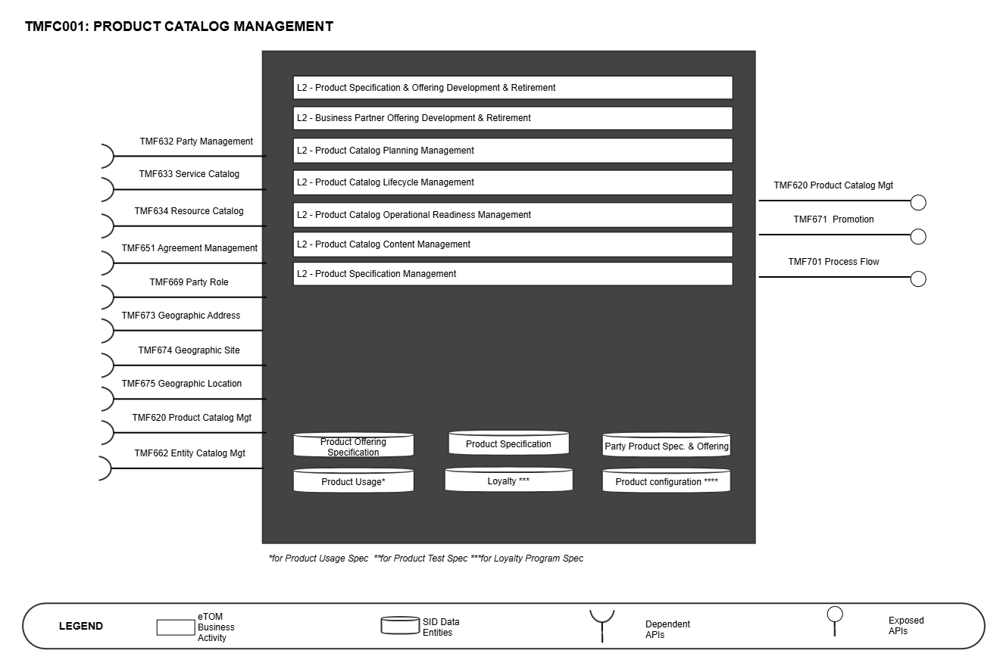
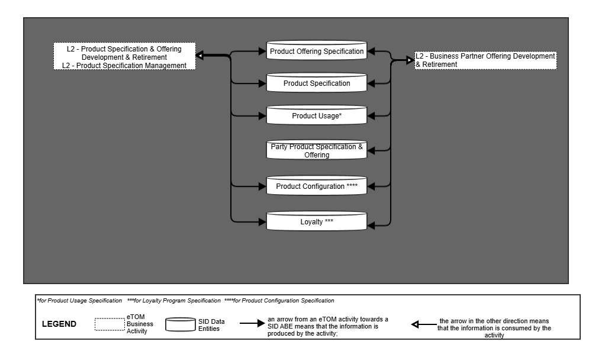
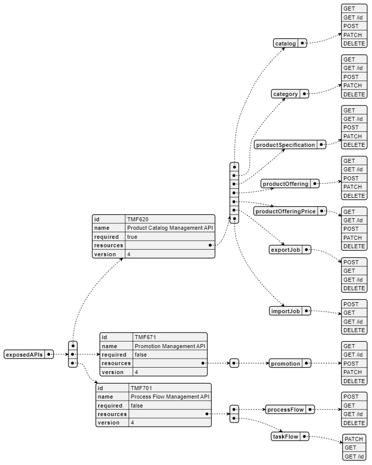
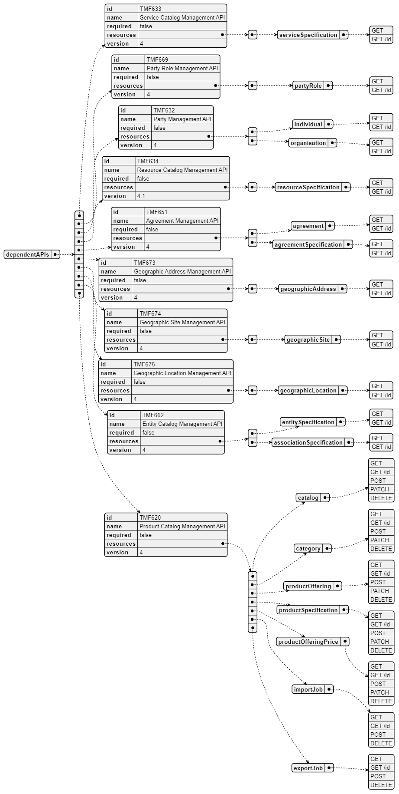
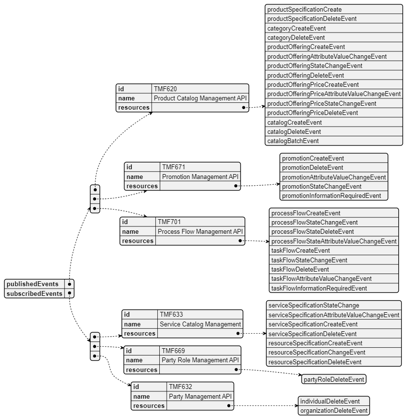

# 1. Overview

| Component Name | ID | Description | ODA Function Block |
| --- | --- | --- | --- |
| Product Catalog Management | TMFC001 | The Product Catalog Management component is responsible for organizing the collection of Products and Product Offering specifications that identify and define all requirements of a product or a product offering that can be commercialized. | Core Commerce |

*([PlantUML source](media/product-catalog-management-architecture.puml))*

# 2. eTOM Processes, SID Data

Entities and Functional Framework Functions

## 2.1. eTOM business activities

eTOM business activities this ODA Component is responsible for:

| Identifier | Level | Business Activity Name | Description |
| --- | --- | --- | --- |
| 1.2.7 | L2 | Product Specification & Offering Development & Retirement | Product Specification & Offering Development & Retirement processes develop and deliver new product specifications as well as enhancements and new features, ready for use by other processes. Additionally, they handle the removal of specifications no longer offered. Product specifications represent the types of services and resources made available as product offerings to the market by an enterprise. The key measures of this process are how effectively the enterprise’s offerings are broadened by these specifications or new specification features. These processes also manage updates and enhancements to product specifications. Business case development tracking and commitment are key elements of this process. They also develop new product offerings and their associated features. Pricing for the offerings is also developed, such as standard pricing and feature-based pricing. The offerings and selected processes are included in product catalogs which are also developed by these processes. |
| 1.2.19 | L2 | Product Catalog Planning Management | Product Catalog Planning Management business process covers a set of business activities that understand and enable establish the plan to define, design and operationalize a catalog in order to meet the needs and objectives of Product cataloging. The Product Catalog Planning Management business process ensure that the organization is able to identify the most appropriate scheme and goal for it catalog. It includes designing the Catalog plan and developing the specification according to Product management requirement. |
| 1.2.20 | L2 | Product Catalog Lifecycle Management | Catalog Lifecycle Management business process covers a set of business activities that enable us to manage the lifecycle of an organizations catalog from design to build according to defined requirements. |
| 1.2.21 | L2 | Product Catalog Operational Readiness Management | Product Catalog Operational Readiness Management business process establishes and administers the support needed to operationalize Product catalogs for ongoing day-to-day business needs. These business activities implement the Product Catalog through Release and Deploy business activities. Release Product Catalog business activity ensure all cross-functional activities needed to support catalog maintenance and operations, such as training and updating the support of the catalog are in place. Release Product Catalog business activity includes identifying stakeholders, catalog integration, catalog federation etc. for any scenario in support of the organizations business goals, including Release conditions that support users, customers and business partners. |
| 1.2.22 | L2 | Product Catalog Content Management | Product Catalog Content Management business process define and provide the business activities that support the day-to- day operations of Product Catalogs in order to realize the business operations goals. Product Catalog Content Management business processes include administering the Product Catalog instance in production, maintaining catalog entries, assuring catalogs, managing catalog access, managing entry lifecycle through versioning, handling catalog entity entry and changes, supporting distribution of catalogs as needed, and supporting user-facing activities. |
| 1.2.23 | L2 | Product Specification Management | Product Specification Management business process leverages captured product requirements to develop, master, analyze, and update documented standard and personalized conditions that must be satisfied by product design and/or delivery. Product Specifications Management can result in establishing, in a centralized way, technical (know-how) standards for products. Such standards provide the organization with a means to control and approve the values and inputs of product specification through structure, review, approval and distribution processes to users (including customers and business partners). |
| 1.6.4 | L2 | Business Partner Offering Development & Retirement | Business Partner Offering Development & Retirement supports the management of on- boarding and off-boarding another Business Partner's product specifications and product offerings that a required to facilitate the business model of the enterprise. It also manages the involvement the enterprise has with a product specification and product offering. For example, the enterprise may accept an order for one of its offerings, but it may be fulfilled by another Business Partner. Note: - Product Specification Development & Retirement and Product Offering Development & Retirement processes are used to manage most of the lifecycle of product specifications and product offerings. This is done to eliminate redundant processes. For example, the Product Offering Pricing processes are used to manage the prices associated with on-boarded product offerings. - This process therefore focuses on managing the relationship that parties, including the enterprise, have with product specifications and product offerings as well as the impact of off-boarding specifications and offerings on a provider's service and resource infrastructure. |

## 2.2. SID ABEs

SID ABEs this ODA Component is responsible for:

| SID ABE Level 1 | SID ABE Level 2 (or set of BEs)* |
| --- | --- |
| Product Offering Specification |   |
| Product Specification |   |
| Product Configuration | ProductConfigSpec BE |
| Product Usage | Product Usage Spec ABE |
| Loyalty | Loyalty Program Specification ABE |
| Party Product Specification & Offering |   |

*: if SID ABE Level 2 is not specified this means that all the L2 business entities must be implemented, else the L2 SID ABE Level is specified.

## 2.3. eTOM L2 - SID ABEs links

eTOM L2 vS SID ABEs links for this ODA Component.

*([PlantUML source](media/etom-sid-product-catalog-links.puml))*

## 2.4. Functional Framework Functions

| Function ID | Function Name | Function Description | Sub-Domain Functions Level 1 | Sub-Domain Functions Level 2 |
| --- | --- | --- | --- | --- |
| 123 | Product Catalog Browsing | Product Catalog Browsing provides a browsing function to identify products available for purchase by a given customer, provide selected relevant information (e.g. cost, requirements, configurable attributes) to the customer. This information will be used in the step guidance. | Product Specification & Offering Management | Product Specification & Offering Development |
| 210 | Centralized Ordering Rules Management | Centralized Ordering Rules Management provides centralized business rules for ordering (eligibility, compatibility). | Product Specification & Offering Management | Ordering Rules Development |
| 238 | Customer Loyalty Rules Management | Customer Loyalty Rules Management provides Loyalty Program Rules and customer loyalty profiles management | Product Specification & Offering Management | Product Specification & Offering Development |
| 263 | Product Compatibility Checking | Product Compatibility Checking function provide an internet technology driven interface for the customer to check product compatibility. | Product Specification & Offering Management | Product Specification & Offering Development |
| 360 | Product Agreement Specification Design | Product Agreement Specification Design Function creates and maintains predefined Product Agreement options and templates for Product Offerings. It includes general terms or conditions and approval rules. | Product Specification & Offering Management | Product Specification & Offering Development |
| 407 | Product Modeling Support | Product Modeling Support supports Lifecycle Management in the design and build phase of the Product Offerings and Product Specifications. | Product Specification & Offering Management | Product Modeling Support |
| 408 | Product Retirement | Product Retirement Function retires obsolete product offering as part of the Lifecycle Management (LM) | Product Specification & Offering Management | Product Specification Lifecycle Management |
| 415 | Product Strategy Linking | Product Strategy Linking links strategy to propositions and links propositions to products | Product Specification & Offering Strategy Definition & Analysis | Product Specification & Offering Strategy Management |
| 416 | Product Propositions Operations Planning | Product Propositions Operations Planning supports the planning of the introduction of propositions for new or updated product offerings and/or product specifications, by planning which operating groups are delivering what of the product proposition and where are the organization and operations touchpoints. | Product Specification & Offering Strategy Definition & Analysis | Product Specification & Offering Strategy Management |
| 417 | Product Strategy to Proposition Alignment | Product Strategy to Proposition Alignment captures and manages details of the business strategy and applies them to the propositions for new or updated product offerings and/or product specifications. | Product Specification & Offering Strategy Definition & Analysis | Product Specification & Offering Strategy Management |
| 418 | Product Strategy/Proposit ions Creation | Product Strategy/Propositions Creation delivers a product strategy and/or propositions for new or updated product offerings and/or product specifications. | Product Specification & Offering Strategy Definition & Analysis | Product Specification & Offering Strategy Management |
| 649 | Product Sourcing Registration | Product Sourcing Registration provides initiation of product instantiation into the service provider product catalog and/or storefront, including product prices. | Business Partner Product Specification and Offering Management | Business Partner Product Specification and Offering Onboarding |
| 650 | Partner Product Certification | Partner Product Certification provides product certification/decertification to be an integrated part of the service provider's value proposition. | Business Partner Product Specification and Offering Management | Business Partner Product Specificatio n and Offering Onboarding |
| 651 | Product Onboarding Support | Product Onboarding Support provides product onboarding, updating, and decommissioning. | Business Partner Product Specification and Offering Management | Business Partner Product Specification and Offering Onboarding |
| 662 | Sourcing Reference Data Collection | Sourcing Reference Data Collection collects definition of products and services, pricing schemes, partner entities and contracts into the system. Easy uploading of reference data from external sources such as XML files. | Business Partner Product Specification and Offering Management | Business Partner Product Specification and Offering Onboarding |
| 721 | Customer Order Rules Configuration | Customer Order Rules Configuration function provides in addition to the Product rules, rules like cross/up sell rules, compatibility rules, eligibility rules, address/service availability rules, etc. Some specific types of rules must be available for all decision- based actions on customer orders. These rules could be: customer fraud check, decomposition rules, priority rules, order duplication prevention rules, complex rules involving multi-system checks, etc. | Product Specification & Offering Management | Ordering Rules Development |
| 722 | Order Rules Retrieval | Order Rules Retrieval function makes the Order Rules available to e.g. customer order related applications. | Product Specification & Offering Management | Ordering Rules Development |
| 897 | Building Access Control | Building Access Control checks, stops or allow physical access to facilities according to access roles and rules. | Identification and Permission Management | Permission Control |
| 900 | Authorization Control Management | Authorization Control Function controls permissions according to roles and related rules. | Identification and Permission Management | Permission Control |
| 1050 | Product Onboarding Management | Product Onboarding Management function supports the management of the onboarding of a Product Offering sourced from an external source e.g. a business partner. | Business Partner Product Specification and Offering Management | Business Partner Product Specification and Offering Onboarding |
| 1053 | Onboarded Product Workflows Definition | Onboarded Product Workflows Definition function identifies appropriate workflows related to the use of the onboarded product in fulfillment, assurance and billing. | Business Partner Product Specification and Offering Management | Business Partner Product Specification and Offering Onboarding |
| 1076 | Product Specification Design | Product Specification Design Function provides the means to describe for every product commercialized through one or several offers: • characteristics of the product, and their possible values (ex: speed, volume, duration, phone number, …) • available operations (ex: create, change of speed) • functional incompatibilities or prerequisites (deducted from CFS specification incompatibilities or pre- requisites) • link with the know-how type (CFS specification) from which the intangible product is a restriction (ex: mobile line, VOIP, …), or directly with the resource type for tangible products (ex: smartphone, SIM Card), or to the Supplier product type in case of purchase products. It includes facilities to design a new Product Specification based on an existing one and integrity rules controls. The Product Catalogue describes, according to strategy, all the tangible and intangible products that can be commercialized through standard offers, loyalty offers. Example: • goodies can be sold or offered as a reward in exchange for fidelity points (same product commercialized through 2 offers) • a special discount can be granted through a retention offer • … A Product Specification restricts a Customer Facing Service Specification (CFSSpec). | Product Specification & Offering Management | Product Specification & Offering Development |
| 1077 | Product Offering Design | Product Offering Design function provides the means to describe Product Offering, according to marketing strategy: • commercial name • packaging rules of the contract: mandatory offers, optional offers, offers that can be ordered in number (ex: 1 to 4 mobile lines) • commercial incompatibilities or prerequisites (ex: necessary to be the holder of a X contract to subscribe Y contract) • available commercial operations (ex: contract migration) • available commitment durations • any commercial criteria such as authorized sales channel or geographic area, customer criteria, … • tariff specifications – and possible alterations. They are associated with the offer, to commercial operations or usage types and can be recurring or one shot. They are expressed as rules that can consider many criteria (ex: commitment duration, product configuration, sales channel, customer’s age, …) and will be evaluated during the order capture process, or during the rating process for usage. It includes facilities to design a new Product Offering based on an existing one and integrity rules controls. | Product Specification & Offering Management | Product Specification & Offering Development |
| 1078 | Product Specification and Offering Change Auditing | Product Specification and Offering Change Auditing manages the implications of Product Specifications and Offerings changes to determine the consequences of any given change. Product Specifications and Offerings changes may impact other Product Specifications and / or Offerings according to relationships between them. The function logs Product Specifications changes and supports the analysis of relationships between Product Specifications. In addition, it tracks the history of changes in an easy and accessible manner. | Product Specification & Offering Management | Product Specification & Offering Development |
| 1079 | Product Specification and Offering Repository Management | Product Specification and Offering Repository Management is able to create, modify and delete Product Specification and Offering. This includes the ability to manage the state of an entity during its lifecycle (e.g. planned, deployed, in operation, replaced by, locked…). It includes Product Specifications and Offerings retrieval, integrity rules check and versioning management. It also provides Product Specification and Offering views adapted to the different roles. | Product Specification & Offering Management | Product Specification & Offering Development |
| 1291 | External Product Specification Development | External Product Specification Development function supports the definition of, and sometimes development related to, Product Specifications to be provided either by a Business Partner via the Service Provider or provided with the Business Partner in conjunction with the Service Provider. This function differs from internal Product Specification Development in that this function addresses both the collaborative aspects of inter-company product specification development and the divisions of responsibilities, costs and benefits among the partners. This function provides the means to describe for every product commercialized through one or several offers: - characteristics of the product, and their possible values (ex: speed, volume, duration, phone number, etc.) available operations (ex: create, change of speed) - functional incompatibilities or prerequisites (deducted from CFS specification incompatibilities or pre- requisites) - link with the know-how type (CFS specification) from which the intangible product is a restriction (ex: mobile line, VOIP, etc.), or directly with the resource type for tangible products (ex: smartphone, SIM Card), or to the Supplier product type in case of purchase products. It includes facilities to design a new Product Specification based on an existing one and integrity rules controls. A Product Specification restricts a Customer Facing Service Specification (CFSSpec). | Product Specification & Offering Management | Product Specification & Offering Development |
| 1292 | External Product Offering Development | External Product Offering Development function includes the definition of, and sometimes the creation of, Product Offerings provided either by a Business Partner via the Service Provider or provided with the Business Partner in conjunction with the Service Provider. This function differs from internal Product Offering Development in that this function addresses both the collaborative aspects of inter-company product Offering development and the divisions of responsibilities, costs and benefits among the partners. This function provides the means to describe Product Offerings, according to marketing strategy: - commercial name - packaging rules of the contract: mandatory offers, optional offers, offers that can be ordered in number (ex: 1 to 4 mobile lines) - commercial incompatibilities or prerequisites (ex: necessary to be the holder of an X contract to subscribe Y contract) - available commercial operations (ex: contract migration) - available commitment durations - any commercial criteria such as authorized sales channel or geographic area, customer criteria, etc. - tariff specifications and possible alterations. They are associated to the offer, to commercial operations or usage types and can be recurring or one shot. They are expressed as rules that can consider many criteria (ex: commitment duration, product configuration, sales channel, customer's age, etc.) and will be evaluated during the order capture process, or during the rating process for usage. It includes facilities to design a new Product Offering based on an existing one and integrity rules controls. | Product Specification & Offering Management | Product Specification & Offering Development |
| 1293 | Product Specification Recalls Support | Product Specification Recalls Support function supports carrying out follow- through with Service Provider or Business Partner Product Specification Recalls, including notifying customers and, where appropriate, coordinating returns and replacement logistics. | Product Specification & Offering Management | Product Specification Lifecycle Management |
| 1341 | Product Specification Change Notification | Product Specification Change Notification function enables notifying systems, stakeholders and involved business partners that a new product specification change is pending. This function is ideally automated but can be a manual notification to those systems and processes that require manual intervention to make a product specification change. | Product Specification & Offering Management | Product Specification & Offering Realization |
| 1342 | Product Specification Version Control | Product Specification Version Control function facilitates multiple iterations (versions) of product specifications being kept in production to avoid inconveniencing existing customers of the previous versions. | Product Specification & Offering Management | Product Specification Lifecycle Management |

# 3. TM Forum Open APIs & Events

The following part covers the APIs and Events; This part is split in 3: • List of Exposed APIs - This is the list of APIs available from this component. • List of Dependent APIs - In order to satisfy the provided API, the component could require the usage of this set of required APIs. • List of Events (generated & consumed ) - The events which the component may generate is listed in this section along with a list of the events which it may consume. Since there is a possibility of multiple sources and receivers for each defined event.

## 3.1. Exposed APIs

The following diagram illustrates API/Resource/Operation:

*([PlantUML source](media/exposed-apis-structure.puml))*

| API ID | API Name | API Version | Mandatory / Optional | Operations |
| --- | --- | --- | --- | --- |
| TMF620 | Product Catalog Management API | 4 | Mandatory | catalog: POST, PATCH, GET, GET /id, DELETE category: POST, PATCH, GET, GET /id, DELETE productSpecification: POST, PATCH, GET, GET /id, DELETE productOffering: POST, PATCH, GET, GET /id, DELETE productOfferingPrice: POST, PATCH, GET, GET /id, DELETE exportJob: POST, GET, GET /id, DELETE importJob: POST, GET, GET /id, DELETE |
| TMF671 | Promotion | 4 | Optional | promotion: POST, PATCH, GET, GET /id, DELETE |
| TMF688 | Event | 4.0.0 | Optional | listener: POST hub: POST, DELETE |
| TMF701 | Process Flow | 4 | Optional | processFlow: POST, GET, GET /id, DELETE taskflow: PATCH, GET, GET /id |

## 3.2. Dependent APIs

Following diagram illustrates API/Resource/Operation:

*([PlantUML source](media/dependent-apis-structure.puml))*

| API ID | API Name | API Version | Mandatory / Optional | Operations |
| --- | --- | --- | --- | --- |
| TMF632 | Party Management | 4 | Optional | individual: GET, GET /id |
| TMF632 | Party Management | 4 | Optional | individual: GET, GET /id organisation: GET, GET /id |
| TMF669 | Party Role Management | 4 | Optional | partyRole: GET, GET /id |
| TMF633 | Service Catalog Management | 4 | Optional | serviceSpecification: GET, GET /id |
| TMF634 | Resource Catalog Management | 4 | Optional | resourceSpecification: GET, GET /id |
| TMF651 | Agreement Management | 4 | Optional | agreement: GET, GET /id agreementSpecification: GET, GET /id |
| TMF673 | Geographic Address | 4 | Optional | geographicAddress: GET, GET /id |
| TMF674 | Geographic Site | 4 | Optional | geographicSite: GET, GET /id |
| TMF675 | Geographic Location | 4 | Optional | geographicLocation: GET, GET /id |
| TMF688 | Event | 4.0.0 | Optional | event: GET, GET /id |
| TMF672 | UserRolesPermissions | 4.0.0 | Optional | permission: GET, GET /id |
| TMF620 | Product Catalog Management | 4 | Optional | catalog: POST, PATCH, GET, GET /id, DELETE category: POST, PATCH, GET, GET /id, DELETE productSpecification: POST, PATCH, GET, GET /id, DELETE productOffering: POST, PATCH, GET, GET /id, DELETE productOfferingPrice: POST, PATCH, GET, GET /id, DELETE exportJob: POST, GET, GET /id, DELETE importJob: POST, GET, GET /id, DELETE |

## 3.3. Events

The following diagram illustrates the Events which the component may publish and the Events that the component may subscribe to and then may receive. Both lists are derived from the APIs listed in the preceding sections.

*([PlantUML source](media/events-structure.puml))*

# 4. Machine Readable

Component Specification Refer to the ODA Component table for the machine-readable component specification file for this component.
