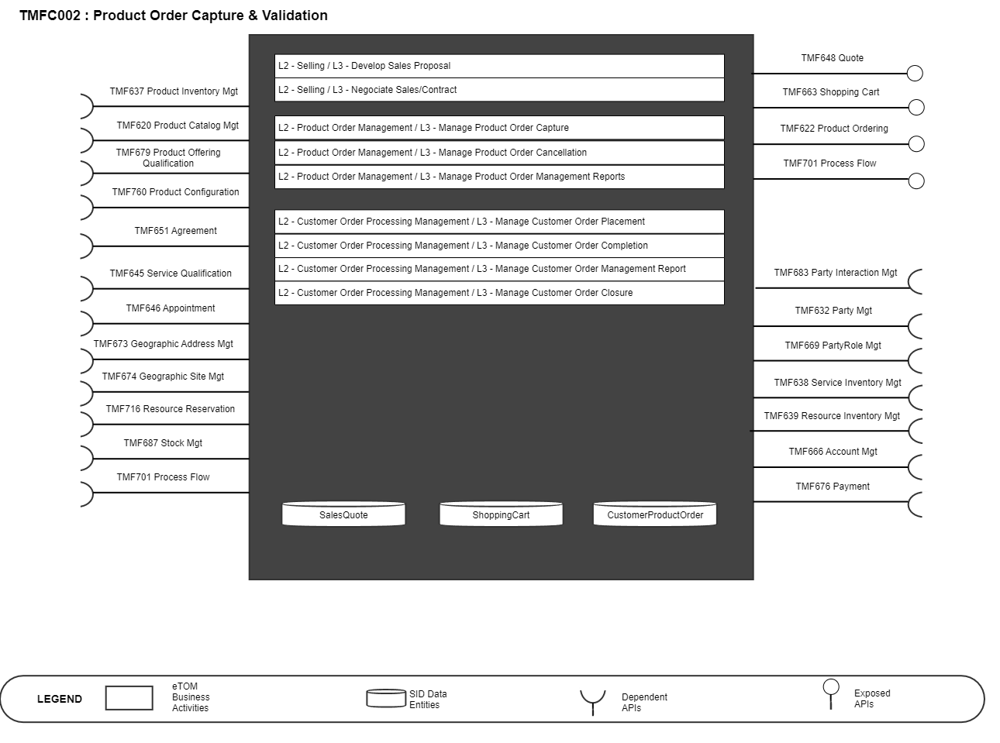
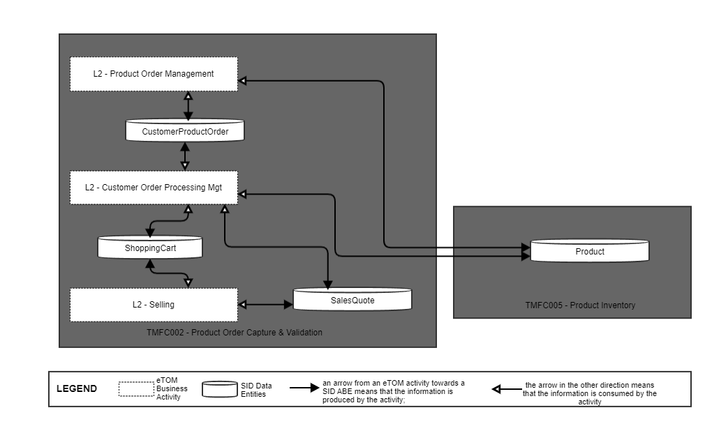
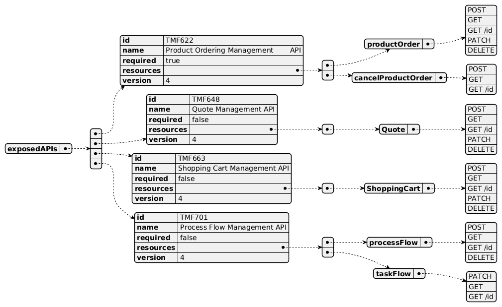
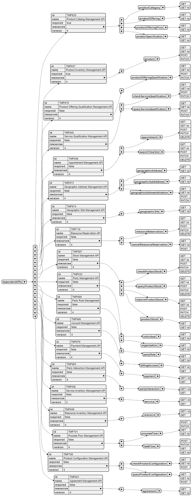
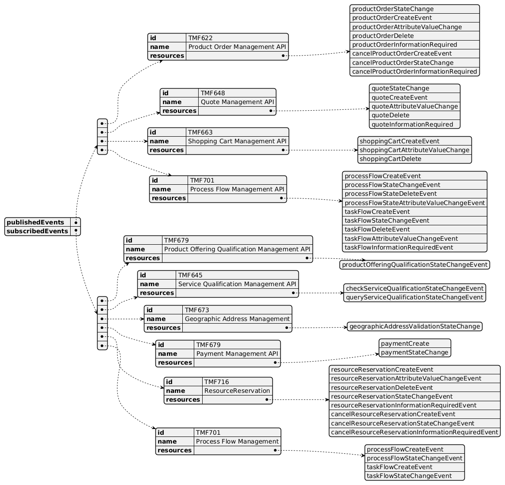

# 1. Overview

| Component Name | ID | Description | ODA Function Block |
| --- | --- | --- | --- |
| Product Order Capture and Validation | TMFC002 | This component captures what a customer wants to order based on the CSP's Product Catalog. It enables configuration of the product offerings and products desired, provides quotes, checks the eligibility of the customer order, and completes it with information needed such as the related parties or associated billing account and the delivery appointment. This component owns quote management, order capture and validation, using dedicated components (eg Offering Configurator, Service Qualification, Party Management) when needed. After the delivery of the customer product order items, this component is also in charge of the commercial closure of the order. It includes update of the Product Inventory (status and starting/end date of tariffs and discounts) and potential commercial rules control (eg receipt of the contract document signed by the customer). | Core Commerce |

*([PlantUML source](media/product-order-capture-validation-architecture.puml))*

# 2. eTOM Processes, SID

Data Entities and Functional Framework Functions

## 2.1. eTOM business activities

eTOM business activities this ODA Component is responsible for are:

| Identifier | Level | Business Activity Name | Description |
| --- | --- | --- | --- |
| 1.1.9 | L2 | Selling | Responsible for managing prospective customers, for qualifying and educating customers, and matching customer expectations. Managing prospective parties with whom an enterprise may do business, such as potential existing or new customers and partners, for qualifying and educating them, and ensuring their expectations are met. |
| 1.1.9.2 | L3 | Develop Sales Proposal | Develop a sales proposal to respond to the customer’s requirements Develop a sales proposal to respond to a sales prospect's requirements. |
| 1.1.9.5 | L3 | Negotiate Sales/Contract | Close the sale with terms that are understood by the customer and are mutually agreeable to both the customer and the service provider. Close the sale with terms that are understood by the sales prospect, which now becomes a customer or some other partythat make an enterprise's offerings to the market, such as a partner, and are mutually agreeable to both the customer or party and an enterprise. |
| 1.2.9 | L2 | Product Offering Purchasing | Make an inbound/outbound purchase of one or more product offerings, change an offering being purchased, review an entire purchase, and other processes that manage the lifecycle of a purchase of one or more product offerings. |
| 1.2.27 | L2 | Product Order Management | Product Order Management business direct and control processes that capture, track, fulfil, deliver and close product order requests. Product Order Management begins with the capture of a product order request based on a party (Customer, Business Partner, Employee |
| 1.2.27.1 | L3 | Manage Product Order Capture | Manage Product Order Capture business activity direct and control the creation of product orders, validate product orders against feasibility and/or availability checks, and ensure product orders are complete for onward business processing. Manage Product Order Capture assures for completeness, the Product Order requirements needed for successfully processing, delivering and managing returns of orders. |
| 1.2.27.4 | L3 | Manage Product Order Cancellation | Manage Product Order Cancellation business activity directs and controls the product order cancellation requests. |
| 1.2.27.5 | L3 | Manage Product Order Management Reports | Manage Product Order Management Reports business activity directs and controls monitoring of product order management activities, notify product order management status and reporting product order management activities. |
| 1.3.3 | L2 | Customer Order Handling Customer Order Processing Management | Responsible for accepting and issuing orders. Customer Order Processing Management business process directs and controls all activities that operationally realize orders for customer. Customer Order Processing Management assures the capture, processing, fulfillment, "shipping", delivery and reporting of customer orders from feasibility assessment, purchasing, payment, fulfillment and follow up with the customer for closure. |
| 1.3.3.1 | L3 | Determine Customer Order Feasibility | Check the availability and/or the feasibility of providing and supporting standard and customized product offerings where specified to a customer. |
| 1.3.3.2 | L3 | Authorize Credit | Assess a customer's credit worthiness in support of managing customer risk and company exposure to bad debt |
| 1.3.3.4 | L3 | Complete Customer Order | Manage customer information and interactions after customer contracts or associated service |
| 1.3.3.5 | L3 | Issue Customer Orders | Issue Correct and complete customer orders |
| 1.3.3.6 | L3 | Report Customer Order Handling | Monitor the status of customer orders, provide notifications of any changes, and provide management reports |
| 1.3.3.7 | L3 | Close Customer Order | Close a customer order when the customer provisioning activities have been completed. Monitor the status of all open customer orders and recognize that a customer order is ready to be closed when the status is changed to completed. |
| 1.3.3.8 | L3 | Manage Order Fallout | This process defines tasks involved in handling fallouts (exceptions) generated in the order fulfillment lifecycle. It deals with identifying, assigning, managing, monitoring, and reporting order fallouts. |
| 1.3.3.10 | L3 | Manage Customer Order Placement | Manage Customer Order Placement business activity directs and controls the capture of information to enable create customer order, change customer order and validate customer order based on ordering information from customer. |
| 1.3.3.15 | L3 | Manage Customer Order Completion | Manage Customer Order Completion business activity controls activities to confirm that an order has been successfully delivered/shipped to the customer. |
| 1.3.3.16 | L3 | Manage Customer Order Management Report | Manage Customer Order Management Report business activity provides detailed account of Customer Order Management activities, representing state and status of customer orders across the customer order lifecycle. Manage Customer Order Management Report provides monitoring, tracking and customer order status updates/notification as needed to all stakeholders linked to the customer ordering and fulfillment activities. |
| 1.3.3.17 | L3 | Manage Customer Order Closure | Manage Customer Order Closure business activity ensures that customer has confirmed the delivery of a completed customer order. Manage Customer Order Closure business activity closes-the-loop of between the Customer Order Completion process and the confirmation by the Customer. This business |

## 2.2. SID ABEs

SID ABEs this ODA Component is responsible for are:

| SID ABE Level 1 | SID ABE L1 Definition | SID ABE Level 2 (or set of BEs) | SID ABE L2 Definition |
| --- | --- | --- | --- |
| Customer Product Order | Handles single customer orders and the various types thereof, such as regulated and non-regulated orders. | SalesQuote |   |

*: if SID ABE Level 2 is not specified this means that all the L2 business entities must be implemented, else the L2 SID ABE Level is specified. Note: The Product Order Capture & Validation component will also trigger creation and update of Product but this information is managed by a dedicated component TMFC005 - Product Inventory.

## 2.3. eTOM L2 - SID ABEs links

*([PlantUML source](media/etom-sid-order-links.puml))*

## 2.4. Functional Framework Functions

1 TMFC027 Product Configurator covers the part related to Product Catalog rules checking. Only stock control part is done by TMFC002 Product Order Capture & Validation. 2 TMFC027 Product Configurator covers the part related to Product Catalog rules checking at commercial and functional eligibility levels. Only technical eligibility controls are triggered by TMFC002 Product Order Capture & Validation.

| Function ID | Functional Framework Function | Function Description | Aggregate Function Level 1 | Aggregate Function Level 2 |
| --- | --- | --- | --- | --- |
| 16 | Fallout Automated Correction | Fallout Automated Correction function tries to automatically fix fallouts in workflows before they go to a human for handling. This includes a Fallout Rules Engine that provides the capability to handling various errors or error types based on built rules. These rules can facilitate autocorrection, correction assistance, placement of errors in the appropriate queues for manual handling, as well as access to various systems. | Fallout Management | Fallout Correction Management |
| 17 | Fallout Correction Information Collection | Fallout Correction Information Collection collects relevant information for errors or situations that cannot be handled via Fallout Auto Correction. The intent is to reduce the time required by the technician in diagnosing and fixing the fallout. | Fallout Management | Fallout Correction Management |
| 18 | Fallout Management to Fulfillment | Fallout Management to Fulfillment Application Accessing function provides a variety of tools to facilitate Fallout Management access to other | Fallout Management | Fallout Repository Management |
|   | Application Accessing | applications and repositories to facilitate proper Fallout Management. This can include various general access techniques such as messaging, publish and subscribe, etc. as well as specific APIs and contracts to perform specific queries or updates to various applications or repositories within the fulfillment domain. |   |   |
| 19 | Fallout Manual Correction Queuing | Fallout Manual Correction Queuing function provides the required functionality to place error fallout into appropriate queues to be handled via various staff or workgroups assigned to handle or fix the various types of fallout that occurs during the fulfillment process. This includes the ability to create and configure queues, route errors to the appropriate queues, as well as the ability for staff to access and address the various fallout instances within the queues. | Fallout Management | Fallout Correction Management |
| 20 | Fallout Notification | Fallout Notification function provides the means to alert people or workgroups of some fallout situation. This can be done via a number of means, including email, paging, (Fallout management interface bus) etc. This function is done via business rules. | Fallout Management | Fallout Repository Management |
| 21 | Fallout Orchestration | The Fallout Orchestration function provides workflow and orchestration capability across Fallout Management. | Fallout Management | Fallout Correction Management |
| 22 | Fallout Reporting | Fallout Reporting provides various reports regarding Fallout Management, including statistics on fallout per various times periods (per hour, week, month, etc.) as well as information about specific fallout. | Fallout Management | Fallout Repository Management |
| 23 | Fallout Dashboard System Log-in Accessing | Fallout Dashboard System Log-in Accessing provides auto logon capability into various applications needed to analyze and fix fallout | Fallout Management | Fallout Repository Management |
| 24 | Pre-populated Fallout Information Presentation | Pre-populated Fallout Information Presentation automatically position the analyzer on appropriate screens pre- populated with information about the order(s) that's subject for fallout handling. | Fallout Management | Fallout Correction Management |
| 120 | Customer Order Capturing | Customer Order Capturing provides access to Order capture and negotiation capabilities or receives the captured Customer Order data from channels. Takes care of persistence using Customer Order Lifecycle Management. Including support of contract printing, integration with a locally installed cash management/cash register and a retail inventory system for order completion and ordered product versioning. | Product Configuration & Activation | Offer and Product Configuration |
| 172 | Customer Order Reporting | Customer Order Reporting function provides front end support for Business, Financial and Operational reporting and analyzing of the ordering activities. | Customer Order Management | Customer Order Repository Management |
| 174 | Ordering Customer Order Error Resolution Support | Ordering Customer Order Error Resolution Support provides to view pool of orders resulted in error or stuck orders and enable the Customer Support to act accordingly(e.g., resend the request, notify the user with recommended action) For example, a configuration incompatibility with functional or commercial constraint, product unavailability according to the configuration may trigger the resend of the request or notify the user with recommended action. | Customer Order Management | Customer Order Repository Management |
| 175 | Customer Support Jeopardy Notification | Customer Support Jeopardy Notification provide to view jeopardy notifications queue and enable the Customer Support to act accordingly (e.g. notify customer on due date delay). | Customer Order Management | Customer Order Repository Management |
| 176 | Customer Order Capturing Access | Customer Order Capturing Access provides front end support for the Customer Order Capturing functions defined by the order management. | Fulfillment Integration Management | Customer Fulfillment Access Management |
| 177 | Customer Order Take-over Management | Customer Order Take-over Management provides an ability to take over governance of orders handled by other channels (e.g., self-service) amend and relinquish while preserving all the captured data. | Customer Order Management | Customer Order Completion |
| 178 | Customer Order Administration | Customer Order Administration provide to view all outstanding orders, progress and history displays | Customer Order Management | Customer Order Repository Management |
| 181 | Product Order Data Collection | Product Order Data Collection provides an aid in verification and issuance of a complete and valid customer order. This function checks delivery address, link with a payment, a billing account, a certified holder, etc. | Customer Order Management | Customer Order Completion |
| 204 | Customer OrderCompletion E ntry Finalization | The Customer OrderCompletion Entry Finalization function enablescompletion and finalization of the Customer Order with collection of Customer Data or installed base data according to the Catalog. It allows to complete the configuration element not necessary for the quotation. The complements could also concern links with actors, dates, address, billing account. | Customer Order Management | Customer Order Completion |
| 205 | Customer Order Eligibility Validation | Customer Order Eligibility Validation function validates that the Offer & products specified on the Customer Order, are eligible from a commercial and functional point of view. It includes: • Commercial Eligibility with commercial compatibility with the already customer installed Offers • Functional Eligibility with the customer's already installed Products. • Customer Credit Eligibility check, considering the payment history and the credit scores for a Customer, only the predictive credit score for a Prospective Customer. | Customer Order Management | Customer Order Eligibility Validation |
| 208 | Customer Order Change Management | Customer Order Change Management amend pending order resulted from customer change requests or provisioning system limitation and revalidate the order. | Customer Order Management | Customer Order Change Management |
| 209 | Customer Order Cancellation | Customer Order Cancellation can optionally support Cancel for order completed by Service Order Management (this capability is dependent on the Service Order Management system’s ability to roll back service provisioning). This function assesses the feasibility of order cancellation and the potential charge to the customer. If the cancellation is confirmed, it proceeds with the cancellation. | Customer Order Management | Customer Order Validation |
| 211 | Customer Order Activity Supervision | Customer Order Activity Supervision governs the control of the order amongst the ordering channels. This allows keeping the order data consistency, sharing the order data among order application channels, and alternating the control between them. | Customer Order Management | Customer Order Repository Management |
| 212 | Customer Order Versioning | Customer Order Versioning maintains order versioning including Tracking & Logging of the changes made to a purchased product. | Customer Order Management | Customer Order Repository Management |
| 213 | Pending Customer Orders Maintenance | Pending Customer Orders Maintenance saves the order/quote for future processing (in case the customer is not | Customer Order Management | Customer Order |
|   |   | sure if they want to go through with the order at this point) |   | Repository Management |
| 217 | Customer Order Establishment Tracking | Customer Order Establishment Tracking provides the functionality necessary to track and manage the distributed requests decomposed by Customer Order Distribution.This capability needs to be provided in both an ability to query in real time and a publish/subscribe mechanism to enable the use of the information wherever required. | Customer Order Management | Customer Order Repository Management |
| 236 | Customer Loyalty SubscriptionManag ement Configuration | Customer Loyalty SubscriptionManagement Configuration function manages information for subscription and deactivation to a Loyalty program.Subscription management includes: - checking customer requirements - assigning one or more subgroups to which the customer belongs - assigning welcome points & send welcome messages - generate the unique Loyalty-identifier Loyalty Subscription Management can assign multiple traffic channels to loyalty subscriptions (sim-cards, PBX, Call Data Network etc.) | Product Configuration & Activation | Offer and Product Configuration |
| 259 | External Call Center Access | External Call Center Access provides access to call center self-empowered fulfillment function providing an internet technology driven interface for the customer to undertake a variety of fulfillment functions directly for themselves. | Customer Order Management | Customer Order Repository Management |
| 262 | Product Availability Checking 1 | Product Availability Checking function provide an internet technology driven interface for the customer to undertake a product availability check. | Customer Order Management | Customer Order Eligibility Validation |
| 272 | Order Status Viewing | Order Status Viewing provides self- empowered fulfillment function of an internet technology driven interface for the customer to undertake Order status enquiry. | Customer Order Management | Customer Order Repository Management |
| 277 | Shopping Cart Purchasing Access | Shopping Cart Purchasing Access function provide an internet technology driven interface to the customer to undertake self-service purchase. | Customer Order Management | Customer Order Repository Management |
| 317 | Product Availability Area Checking | Product Availability Area Checking checks if CSP marketed products are availability in the customer area |   |   |
| 343 | Mass Transaction Ordering | Mass Transaction Ordering feed function of new orders. For bulk sales by e.g., affiliates and corporate customer self-empowered fulfillment provided e.g., by an internet technology driven interface for bulk ordering. | Product Configuration & Activation | Offer and Product Configuration |
| 359 | Contract and SLA creation | Contract and SLA Creation provides contract generation as well as appropriate service level agreements (SLAs) generation |   |   |
| 366 | Customer Order Management | Customer Order Management provides an online access function to specific orders, to be used for management, monitoring and tracking for customer support and external agents for Upgrade of customer’s products/services. | Customer Order Management | Customer Order Repository Management |
| 379 | Product Customization Offering Management | Product Customization Offering Management provides the necessary functionality to manage the customer personalized proposals, taking into account the customer location, needs, current products, as well as the service provider's products, sales emphasis and targets, etc. | Sales Management | Opportunity Management |
| 387 | Sales Metrics Calculation | Sales Metrics Calculation provides sales metrics calculation according to pre-defined metrics rules |   |   |
| 388 | Sales Order Reporting | Sales Order Reporting provides reporting of order handoff. | Sales Reporting | Sales Performance Management |
| 716 | Order Data Enrichment | Order Data Enrichment function acquire missing order data from surrounding systems (often values taken from catalogs and inventories, billing, fraud, etc.) or from external 3rd party systems (like country's common address or credit check system). | Customer Order Management | Customer Order Completion |
| 717 | Calculated Order Data Enrichment | Calculated Order Data Enrichment calculates missing order data values on-the-fly from existing data and ordering rules. E.g., Contract end dates, Discounted period, etc. | Customer Order Management | Customer Order Completion |
| 718 | Customer Order Validation | Customer Order Validation Function ensures that the qualified order is valid in any moment of order lifecycle, usually as data become available. Validation ensures early fallout which is less costly than encountering errors in later stages of order handling. | Customer Order Management | Customer Order Validation |
| 719 | Customer Order Storage | The Customer Order Storage function stores the valid and complete customer orders into an appropriate data storage. | Customer Order Management | Customer Order Repository Management |
| 720 | Customer Order Searching | Customer Order Searching function makes the customer orders available to other applications. |   |   |
| 727 | Product Offer to Customer Verification 2 | Product Offer to Customer Verification enables and verifies the configuration of the commercial offer chosen by the customer. | Customer Order Management | Customer Order Eligibility Validation |
| 756 | Fallout Rule Based Error Correction | Fallout Rule Based Error Correction function provides the capability to handle various errors or error types based on pre-defined rules. These rules can facilitate autocorrection, correction assistance, placement of errors in the appropriate queues for manual handling, as well as access to various systems via the Fallout Interface Bus. | Fallout Management | Fallout Correction Management |
| 934 | Sales Negotiation Support | Sales Negotiation Support provides support for negotiating the sale by providing multiple quotations as needed, taking into account the customer data, customer qualification, and offers made. Functionality includes access to products, product pricing, scheduling of appointments if a dispatch is necessary, etc. Sales Negotiation generates an order or service request. A Customer order request. Customer order request generation – send solution design details to update proposal product order in Customer Order Management systems Service order request generation – send solution design details to update service order in Service Order Management systems (after customer agreement – part of handoff to fulfillment) | Sales Management | Opportunity Management |
| 1063 | Sales Quote Management | Sales Quote Management creates and manages quotes, including internal approval. | Sales Management | Opportunity Management |
| 1071 | Customer Credit Eligibility Validation | Customer Credit Eligibility Validation function checks the Customer Credit Eligibility, considering the payment history and the credit scores for a Customer, only the predictive credit score for a Prospective Customer. | Customer Order Management | Customer Order Eligibility Validation |
| 1109 | Customer Order Quote Calculation | Customer Order Quote Calculation Function enables the elaboration of an estimate, including configuration, pricing and feasibility elements, thanks to the specific configuration, eligibility and valuation functions, identifying the various relevant interlocutors (through the Sales Interlocutors Management function), the scenarios to be realized and the lot. | Customer Order Management | Customer Order Quotation |
| 1110 | Customer Order Quote Creation | Customer Order Quote Materialization Function materializes via a document and/or associated to a simplified identification mean (QR code, bar code) to ease later interactions and identification of the quotation, and sent to the customer. | Customer Order Management | Customer Order Quotation |
| 1123 | Product Order Initialization | The Product Order Initialization Function creates the Product Order and initializes it with the operations and default configuration on the mandatory products of the selected offer, or target offer in case of migration. | Product Configuratio n & Activation | Offer and Product Configuratio n |
| 1200 | Customer Loyalty Subscription Activation | Customer Loyalty Subscription Activation function manages Loyalty programs activation and deactivation. It includes - assigning one or more subgroups to which the customer belongs - assigning welcome points & send welcome messages - generate the unique Loyalty- identifier | Product Configuratio n & Activation | Product Activation |
| 1325 | Customer Order Distribution | Customer Order Distribution function enables distributing finalized customer orders to any parties and systems that need the order information and/or the notification that the order has been finalized. | Customer Order Management | Customer Order Completion |

# 3. TM Forum Open APIs & Events

The following part covers the APIs and Events; This part is split in 3: • List of Exposed APIs - This is the list of APIs available from this component. • List of Dependent APIs - In order to satisfy the provided API, the component could require the usage of this set of required APIs. • List of Events (generated & consumed ) - The events which the component may generate are listed in this section along with a list of the events which it may consume. Since there is a possibility of multiple sources and receivers for each defined event.

## 3.1. Exposed APIs

The following diagram illustrates API/Resource/Operation:

*([PlantUML source](media/exposed-apis-structure.puml))*

| API ID | API Name | API Version | Mandatory / Optional | Resource | Operations |
| --- | --- | --- | --- | --- | --- |
| TMF622 | Product Ordering Management | 4 | Mandatory | productOrder | GET GET /id POST PATCH DELETE |
|   |   |   |   | cancelProductOrder | GET GET /id POST |
| TMF648 | Quote Management | 4 | Optional | quote | GET GET /id POST PATCH DELETE |
| TMF663 | Shopping Cart Management | 4 | Optional | shoppingCart | GET GET /id POST PATCH DELETE |
| TMF688 | TMF688 Event |   | Optional |   |   |
| TMF701 | Process Flow Management | 4 | Optional | processFlow | GET GET /id POST DELETE |
|   |   |   |   | taskFlow | GET GET /id PATCH |

## 3.2. Dependent APIs

Following diagram illustrates API/Resource/Operation:

*([PlantUML source](media/dependent-apis-structure.puml))*

The APIs called by this component and provided by other components are:

| API ID | API Name | API Version | Mandatory / Optional | Resource | Operation | Rationales |
| --- | --- | --- | --- | --- | --- | --- |
| TMF620 | Product Catalog Management | v4 | Mandatory | productCategory | Get, Get /id | minimum consistenc y check |
|   |   |   |   | productOffering | Get, Get /id |   |
|   |   |   |   | productOfferingPrice | Get, Get /id |   |
|   |   |   |   | productSpecification | Get, Get /id |   |
| TMF629 | Customer Management | v4 | Optional |   | Get |   |
| TMF632 | Party Management | v4 | Optional | individual | Get, Get /id |   |
|   |   |   |   | organization | Get, Get /id |   |
| TMF637 | Product Inventory Management | v4 | Mandatory | product | Get, Get /id, Post, Patch | minimum consistenc y check (case of update of an existing product) |
| TMF638 | Service Inventory Management | v4 | Optional | service | Get, Get /id |   |
| TMF639 | Resource Inventory Management | v4 | Optional | resource | Get, Get /id |   |
| TMF645 | Service Qualification Management | v4 | Optional | checkServiceQualifica tion | Get, Get /id, Post, Patch |   |
|   |   |   |   | queryServiceQualificat ion | Get, Get /id, Post, Patch |   |
| TMF646 | Appointment Management | v4 | Optional | appointment | Get, Get /id, Post, Patch, Delete |   |
|   |   |   |   | searchTimeSlot | Get, Get /id, Post, |   |
| TMF651 | Agreement | v4 | Optional | agreement | Get, Get /id |   |
| TMF666 | Account Management | v4 | Optional | billingAccount | Get, Get /id |   |
| TMF669 | Party Role Management | v4 | Optional | partyRole | Get, Get /id |   |
| TMF672 | TMF672 User Role Permission API |   | Optional |   | Get |   |
| TMF673 | Geographic Address Management | v4 | Optional | geographicAddress | Get, Get /id |   |
|   |   |   |   | geographicSubAddres s | Get, Get /id |   |
|   |   |   |   | geographicAddressVal idation | Get, Get /id, Post, Patch |   |
| TMF674 | Geographic Site Management | v4 | Optional | geographicSite | Get, Get /id |   |
| TMF676 | Payment Management | v4 | Optional | payment | Get, Get /id |   |
| TMF679 | Product Offering Qualification Management | v4 | Optional | productOfferingQualifi cation | Get, Get /id, Post, Patch |   |
| TMF683 | Party Interaction Mgt | v4 | Optional | partyInteraction | Get, Get /id |   |
| TMF685 | Resource Pool Management |   | Optional |   | Get, Post, Patch |   |
| TMF687 | Stock Management | v4 | Optional | checkProductStock | Get, Get /id, Post, Delete |   |
|   |   |   |   | queryProductStock | Get, Get /id, Post, Delete |   |
|   |   |   |   | reserveProductStock | Get, Get /id, Post, Delete |   |
|   |   |   |   | productStock | Get, Get /id |   |
| TMF688 | TMF688 Event | v4 | Optional |   | Get, Post |   |
| TMF701 | Process Flow Management | v4 | Optional | processFlow | Get, Get /id, Post, Patch |   |
|   |   |   |   | taskFlow | Get, Get /id, Post, Patch |   |
| TMF716 | Resource Reservation | v4 | Optional | resourceReservation | Get, Get /id, Post, Patch, Delete |   |
|   |   |   |   | cancelResourceReser vation | Get, Get /id, Post |   |
| TMF760 | Product Configuration Management | v5 | Optional | checkProductConfigur ation | Get, Get /id, Post |   |
|   |   |   |   | queryProductConfigur ation | Get, Get /id, Post |   |

NOTE: Geographic Location Management API (TMF675) is available in preview version. As soon as the interface will be published it will be added to the table. NOTE: new API TMF716 Resource Reservation v4 taken into account to replace TMF685 Resource Pool Management.

## 3.3. Events

The diagram illustrates the Events which the component publishes and the Events that the component subscribes to and then receives. Both lists are derived from the APIs listed in the preceding sections. The type of event could be: • Create: a new resource has been created (following a POST). • Delete: an existing resource has been deleted. • AttributeValueChange: an attribute from the resource has changed - event structure allows to pinpoint the attribute. • InformationRequired: an attribute should be valued for the resource preventing to follow nominal lifecycle - event structure allows to pinpoint the attribute. • StateChange: resource state has changed.

*([PlantUML source](media/events-structure.puml))*

# 4. Machine Readable

Component Specification Refer to the ODA Component Map on the TM Forum website for the machine-readable component specification files for this component.
