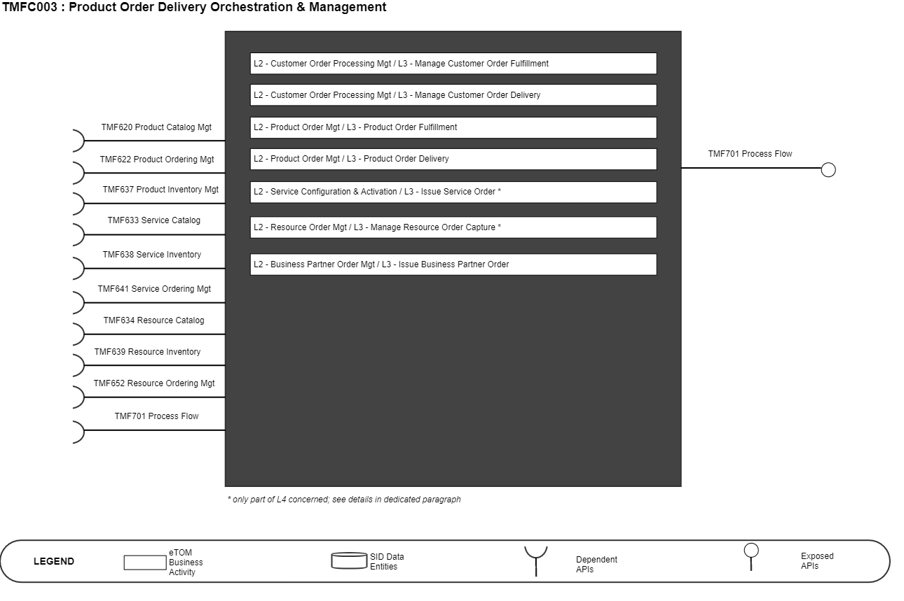
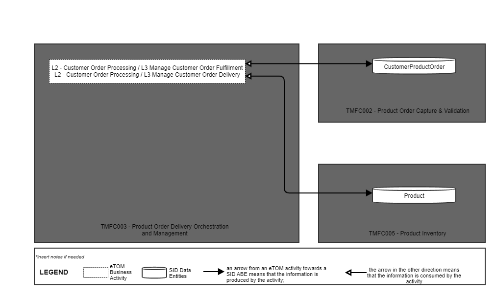
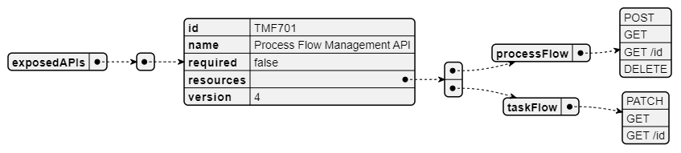
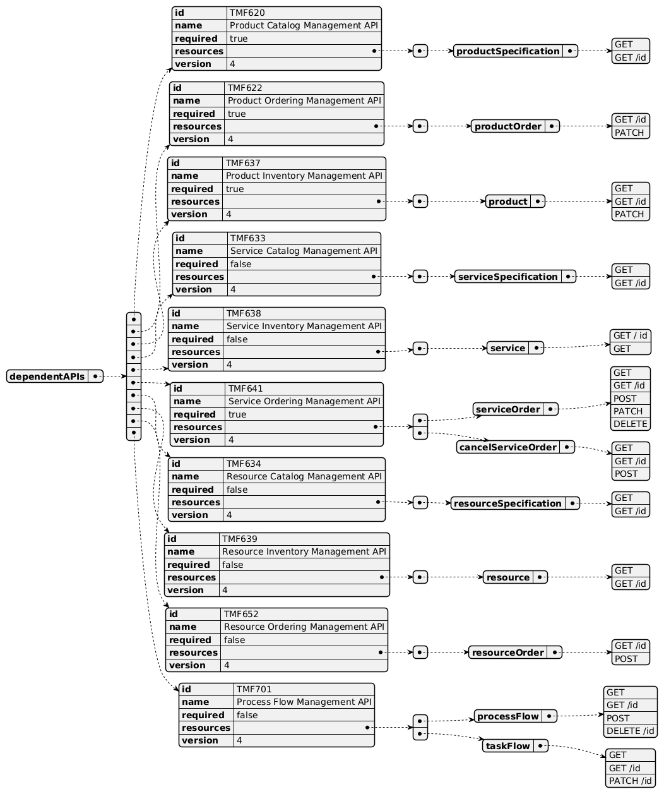
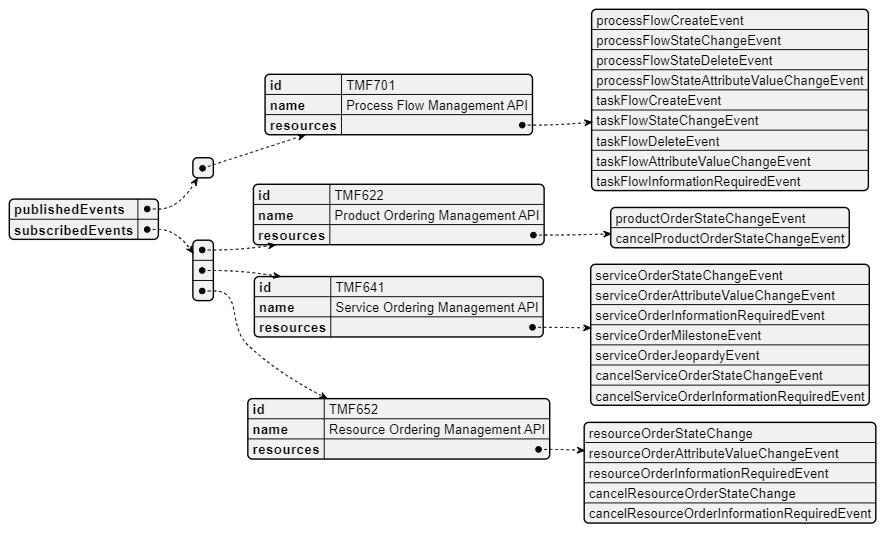

# 1. Overview

| Component Name | ID | Description | ODA Function Block |
| --- | --- | --- | --- |
| Product Order Delivery Orchestration and Management | TMFC003 | This component is in charge of the orchestration of the delivery of Product Orders (status accepted). Based on the Product specification level of information available in the Product Catalog (ex: prerequisite links between product specifications, links between product and CFS specifications, ...): • it determines in which order the product specification level order items need to be delivered, • and to which CFS (or Resource) specification each ordered product corresponds, • and prepares and addresses each related service (or resource) order to the production system in charge. During the delivery process execution, this component is in charge of the evolution of the status of the product specification level order items, and of the related product items . So, it triggers the updates of the related inventories. | Core Commerce Management |

*([PlantUML source](media/product-order-delivery-architecture.puml))*

# 2. eTOM Processes, SID Data Entities and

Functional Framework Functions

## 2.1. eTOM business activities

eTOM business activities this ODA Component is responsible for:

| Identifier | Level | Business Activity Name | Description |
| --- | --- | --- | --- |
| 1.3.3 | L2 | Customer Order Handling Customer Order Processing Management | Customer Order Handling processes are responsible for accepting and issuing orders. They deal with pre- order feasibility determination, credit authorization, order issuance, order status and tracking, customer update on order activities and customer notification on order completion. Responsibilities of the Order Handling processes include: • Testing the completed offering to ensure it is working correctly; • Updating of the Customer Inventory Database to reflect that the specific product offering has been allocated, modified or cancelled; • Assigning and tracking customer provisioning activities; • Managing customer provisioning jeopardy conditions • Reporting progress on customer orders to customer and other processes. Customer Order Processing Management business process directs and controls all activities that operationally realize orders for customer. Customer Order Processing Management assures the capture, processing, fulfillment, "shipping", delivery and reporting of customer orders from feasibility assessment, purchasing, payment, fulfillment and follow up with the customer for closure. |
| 1.3.3.12 | L3 | Manage Customer Order Fulfillment | Manage Customer Order Fulfillment business activity directs and controls all activities that provision and activate orders marked for fulfillment. Manage Customer Order Fulfillment ensure customer orders are organized and arranged (orchestrated), and tracked to meet committed ordering terms. |
| 1.3.3.8 1.3.3.12.1 | L3 L4 | Manage Customer Order Fallout | This process defines tasks involved in handling fallouts (exceptions) generated in the order fulfillment lifecycle. It deals with identifying, assigning, managing, monitoring and reporting order fallouts Manage Customer Order Fallout business activity controls orders that have failed during the fulfillment stage of a customer order process. |
| 1.3.3.9 | L3 | Customer Order Orchestration | Customer Order Orchestration ensures customer order provisioning activities are orchestrated, managed and tracked efficiently to meet the agreed committed availability date. |
| 1.3.3.13 | L3 | Manage Customer Order Delivery | Manage Customer Order Delivery business activity directs and controls activities that deliver orders according to the requirement of the customer. |
| 1.2.9 | L2 | Product Offering Purchasing | Make an inbound/outbound purchase of one or more product offerings, change an offering being purchased, review an entire purchase, and other processes that manage the lifecycle of a purchase of one or more product offerings. |
| 1.2.9.5 | L3 | Complete Product Offering Purchase | Complete a product offering purchase which may trigger other processes, such as ones that accept payment and deliver the purchased offerings. L4 - 1.2.9.5.3 - Coordinate Product Offering Purchase Provisioning Coordinate any necessary provisioning activities for inbound product offering purchases by generating the service order and resource order creation request(s) to Issue Service Orders and Issue Resource Orders L4 - 1.2.9.5.4 - Initiate Additional Product Offering Purchase(s) Prepare product offering purchases in the form of product offering orders for each product offering fulfilled by another party. |
| 1.2.27 | L2 | Product Order Management | Product Order Management business direct and control processes that capture, track, fulfil, deliver and close product order requests. |
| 1.2.27.2 | L3 | Manage Product Order Fulfillment | Manage Product Order Fulfillment business activity is responsible for directing and controlling for product orders, the configuration of product order fulfillment steps, managing the product order fulfillment profile, managing the product order picking and packing, managing product order shipment, managing product order returns, tracking product order fulfillment, and closing fulfillment of product orders. |
| 1.2.27.3 | L3 | Manage Product Order Delivery | Manage Product Order Delivery business activity directs and controls the activities to validate products in the product order. Manage Product Order Delivery business activity ensures product can be successfully be supplied to consignee of the product order to enable complete the product order process. |
| 1.4.5 | L2 | Service Configuration & Activation | Allocation, implementation, configuration, activation and testing of specific services to meet customer requirements. |
| 1.4.5.6 | L3 | Issue Service Order | Issue correct and complete service orders. |
| 1.4.5.6.1 | L4 | Assess Service Request | This process assesses the information contained in the customer order, through a service order request, relating to the purchased product offering, initiating service process or party initiated request, to determine the associated service orders that need to be issued. |
| 1.5.6 | L2 | Resource Provisioning | Allocation, installation, configuration, activation and testing of specific resources to meet the service requirements, or in response to requests from other processes to alleviate specific resource capacity shortfalls, availability concerns or failure conditions. |
| 1.5.6.7 | L3 | Issue Resource Order | Issue correct and complete resource orders. L4 - 1.5.6.7.1 - Assess Resource Request This process assesses the information contained in the service order, through a resource order request, initiating resource process request or supplier/partner initiated request, to determine the associated resource orders that need to be issued. |
| 1.5.5 | L2 | Resource Order Management | Resource Order Management business process directs and controls ordering, scheduling, and allocation of resources (such as materials, equipment, and personnel) within the business. |
| 1.5.5.6 | L3 | Manage Resource Order Capture | Manage Resource Order Capture is responsible for directing and controlling the capture and collection of resource orders from internal and external customers. |
| 1.5.5.6.1 | L4 | Initiate Resource Order Capture | Initiate Resource Order Capture business activity is responsible for the initial activity of capturing and collecting resource orders from internal and external customers. This business activity begins with the identification of the needed resources, either by a "customer" and facilitating creating the request for the resources. This business activity will gather the necessary information to complete the request order, such as the type and quantity of resources needed, delivery location, and any special instructions. |
| 1.6.8 | L2 | Business Partner Order Management | Track, monitor and report on an order to another Business Partner to ensure that the interactions are in accordance with the agreed commercial agreements with the other Business Partner. |
| 1.6.8.5 | L3 | Issue Business Partner Order | Generate a correctly formatted and specified Business Partner order and issue this to the selected Business Partner. |

## 2.2. SID ABEs

SID ABEs this ODA Component is responsible for:

| SID ABE Level 1 | SID ABE Level 2 (or set of BEs) |
| --- | --- |
| none |   |

Note: SID doesn't currently describe Orchestration Plan and delivery process to manage at Product Order level. This could be added at least as specialization from Project ABE or Workflow ABE. Refer to JIRA paragraph at the end of the document.

## 2.3. eTOM L2 - SID ABEs links

*([PlantUML source](media/etom-sid-product-order-links.puml))*

## 2.4. Functional Framework Functions

| Function ID | Function Name | Function Description | Aggregate Function Level 1 | Aggregate Function Level 2 |
| --- | --- | --- | --- | --- |
| 16 | Fallout Automated Correction | Fallout Automated Correction function tries to automatically fix fallouts in workflows before they go to a human for handling. This includes a Fallout Rules Engine that provides the capability to handling various errors or error types based on built rules. These rules can facilitate autocorrection, correction assistance, placement of errors in the appropriate queues for manual handling, as well as access to various systems. | Fallout Management | Fallout Correction Management |
| 17 | Fallout Correction Information Collection | Fallout Correction Information Collection collects relevant information for errors or situations that cannot be handled via Fallout Auto Correction. The intent is to reduce the time required by the technician in diagnosing and fixing the fallout. | Fallout Management | Fallout Correction Management |
| 18 | Fallout Management to Fulfillment Application Accessing | Fallout Management to Fulfillment Application Accessing function provides a variety of tools to facilitate Fallout Management access to other applications and repositories to facilitate proper Fallout Management. This can include various general access techniques such as messaging, publish and subscribe, etc. as well as specific APIs and contracts to perform specific queries or updates to various applications or repositories within the fulfillment domain. | Fallout Management | Fallout Repository Management |
| 19 | Fallout Manual Correction Queuing | Fallout Manual Correction Queuing function provides the required functionality to place error fallout into appropriate queues to be handled via various staff or workgroups assigned to handle or fix the various types of fallout that occurs during the fulfillment process. This includes the ability to create and configure queues, route errors to the appropriate queues, as well as the ability for staff to access and address the various fallout instances within the queues. | Fallout Management | Fallout Correction Management |
| 20 | Fallout Notification | Fallout Notification function provides the means to alert people or workgroups of some fallout situation. This can be done via a number of means, including email, paging, (Fallout management interface bus) etc. This function is done via business rules. | Fallout Management | Fallout Repository Management |
| 21 | Fallout Orchestration | The Fallout Orchestration function provides workflow and orchestration capability across Fallout Management. | Fallout Management | Fallout Correction Management |
| 22 | Fallout Reporting | Fallout Reporting provides various reports regarding Fallout Management, including statistics on fallout per various times periods (per hour, week, month, etc) as well as information about specific fallout. | Fallout Management | Fallout Repository Management |
| 23 | Fallout Dashboard System Log-in Accessing | Fallout Dashboard System Log-in Accessing provides auto logon capability into various applications needed to analyze and fix fallout | Fallout Management | Fallout Repository Management |
| 24 | Pre-populated Fallout Information Presentation | Pre-populated Fallout Information Presentation automatically position the analyzer on appropriate screens pre-populated with information about the order(s) that's subject for fallout handling. | Fallout Management | Fallout Correction Management |
| 174 | Customer Order Error Resolution Support | Customer Order Error Resolution Support provides to view pool of orders resulted in error or stuck orders and enable the Customer Support to act accordingly (e.g., resend the request, notify the user with recommended action) | Customer Order Management | Customer Order Repository Management |
| 175 | Customer Support Jeopardy Notification | Customer Support Jeopardy Notification provide to view jeopardy notifications queue and enable the Customer Support to act accordingly (e.g., notify customer on due date delay) | Customer Order Management | Customer Order Repository Management |
| 723 | Customer Order Item Decomposition | Customer Order Item Decomposition prepares the customer order structure for breakdown into customer order items. |   |   |
| 214 | Customer Order Orchestration | The Customer Order Orchestration function provides workflow and orchestration capabilities at the Product Order Item level for a dedicated Customer Order. Customer Order Orchestration function identifies Service Order Items (CFS level) according to Order Items of the Customer Order, sequences Service Order Items and distributes the Service Order requests to appropriate systems. For example : Service Order Management (SOM), potential 3rd parties, ... This identification of Service Order Items relies on : - the articulation between ProductSpecifications and CFSSpec described in the Catalogue Repository - the articulation between Product Operations and CFS Operations described in the Catalogue Repository - existing installed CFS - the potential rules of choice if several CFS can fit in with the product. Orchestration can take into account : - constraints between Customer Product Order Items inside the Customer Product Order, or successive Customer Orders including modification or cancellation (in-flight changes) - any type of business rules based on information even external to the Customer Product Order. For example : high level of priority for VIP customers - Triggering of exception process or delivery planning update, depending on Customer Product Order or Service Order events. | Customer Order Management | Customer Order Orchestration |
| 215 | Retro-active order orchestration | Retro-active Order Orchestration provides submission of a retroactive order with a past effective date (e.g., retroactive price plan change) and the handling of manual intervention requests (for order fallouts). | Customer Order Management | Customer Order Orchestration |
| 217 | Customer Order Establishment Tracking | Customer Order Establishment Tracking provides the functionality necessary to track and manage the distributed requests decomposed by Customer Order Orchestration. | Customer Order Management | Customer Order Repository Management |
| 342 | Mass Service/product pre-activation | Mass service/product pre-activation function. To prepare for a swift activation at sales affiliate services/products may be pre-activated. | Service Configuration & Activation | Service Activation |
| 743 | Number Portability Orchestration | Number Portability Orchestration communication mechanism that ensures the orders' activation according to criteria set, allowing in this way the correct execution of orders | Resource Management | Regulated Logical Resources Management |
| 724 | Customer Order Work Item Decomposition | Customer Order Work Item Decomposition decomposes customer order items into a set of customer order work items. | Customer Order Management | Customer Order Orchestration |
| 756 | Fallout Rule Based Error Correction | Fallout Rule Based Error Correction function provides the capability to handle various errors or error types based on pre-defined rules. These rules can facilitate autocorrection, correction assistance, placement of errors in the appropriate queues for manual handling, as well as access to various systems via the Fallout Interface Bus. | Fallout Management | Fallout Correction Management |
| 1070 | Orchestration Customer Order Error Resolution | Orchestration Customer Order Error Resolution provides to view pool of orders resulted in error or stuck orders during orchestration and enable the Customer Support to act accordingly. For example, a delay change because of resource unavailability or appointment not respected may trigger the resend of the request or notify the user with recommended action. | Customer Order Management | Customer Order Orchestration |
| 1202 | Delivery Items Identification | The Delivery Items Identification function allows in the context of a customer order to consult catalogs and installed bases to identify what needs to be delivered: Service Specification (CFS Spec) and its configuration, Stock Item, Supplier Product, Work Spec, related to the ordered product. | Customer Order Management | Customer Order Delivery Preparation |
| 1203 | Order Preparation | The Order Preparation Function allows in the context of a customer order to prepare a Service Order, Supplier Order, Stock Item Order or Work Order with the necessary information. In the case of a Product associated with an Internal Service (Know-How), this function also allows to: • check if a corresponding Installed CFS is operational in the Service Installed Base, and so determine the operation at CFS level (creation or modification) • possibly group in the same Service Order several ordered product, based on the same CFS specification, and/or identified to be delivered at the same time by the Customer Order Delivery Orchestration. | Customer Order Management | Customer Order Delivery Preparation |

# 3. TM Forum Open APIs & Events

The following part covers the APIs and Events; This part is split in 3: • List of Exposed APIs - This is the list of APIs available from this component. • List of Dependent APIs - In order to satisfy the provided API, the component could require the usage of this set of required APIs. • List of Events (generated & consumed ) - The events which the component may generate are listed in this section along with a list of the events which it may consume. Since there is a possibility of multiple sources and receivers for each defined event.

## 3.1. Exposed APIs

The following diagram illustrates API/Resource/Operation:

*([PlantUML source](media/exposed-apis-structure.puml))*

| API ID | API Name | Mandatory / Optional | Resource | Operations |
| --- | --- | --- | --- | --- |
| TMF701 | Process Flow | Optional | processFlow | GET GET /id POST DELETE /id |
|   |   |   | taskFlow | GET GET /id PATCH /id |
| TMF688 | Event | Optional |   |   |

## 3.2. Dependent APIs

The following diagram illustrates API/Resource/Operation:

*([PlantUML source](media/dependent-apis-structure.puml))*

| API ID | API Name | Mandatory / Optional | Resource | Operations | Rationales |
| --- | --- | --- | --- | --- | --- |
| TMF620 | Product Catalog Management API | Mandatory | productSpecification | GET GET /id | as illustrated in IG1228, TMFS004, TMFS008 and TMFS014 |
| TMF622 | Product Ordering Management API | Mandatory | productOrder | GET /id PATCH /id | as illustrated in IG1228, TMFS004, TMFS008 and TMFS014 |
| TMF637 | Product Inventory Management API | Mandatory | product | GET GET /id PATCH /id | as illustrated in IG1228, TMFS004, TMFS008 and TMFS014 |
| TMF633 | Service Catalog Management API | Optional | serviceSpecification | GET GET /id |   |
| TMF638 | Service Inventory Management API | Optional | service | GET GET /id |   |
| TMF641 | Service Ordering Management API | Mandatory | serviceOrder | POST GET /id | as illustrated in IG1228, TMFS004, TMFS008 and TMFS014 |
| TMF634 | Resource Catalog Management API | Optional | resourceSpecification | GET GET /id |   |
| TMF639 | Resource Inventory Management API | Optional | resource | GET GET /id |   |
| TMF652 | Resource Ordering Management API | Optional | resourceOrder | POST GET /id |   |
| TMF701 | Process Flow | Optional | processFlow | GET GET /id POST DELETE /id |   |
|   |   |   | taskFlow | GET GET /id PATCH /id |   |
| TMF688 | TMF688 Event | Optional |   |   |   |

## 3.3. Events

The diagram illustrates the Events which the component may publish and the Events that the component may subscribe to and then may receive. Both lists are derived from the APIs listed in the preceding sections.

*([PlantUML source](media/events-structure.puml))*

# 4. Machine Readable Component Specification

Refer to the ODA Component Map on the TM Forum website for the machine-readable component specification files for this component.
