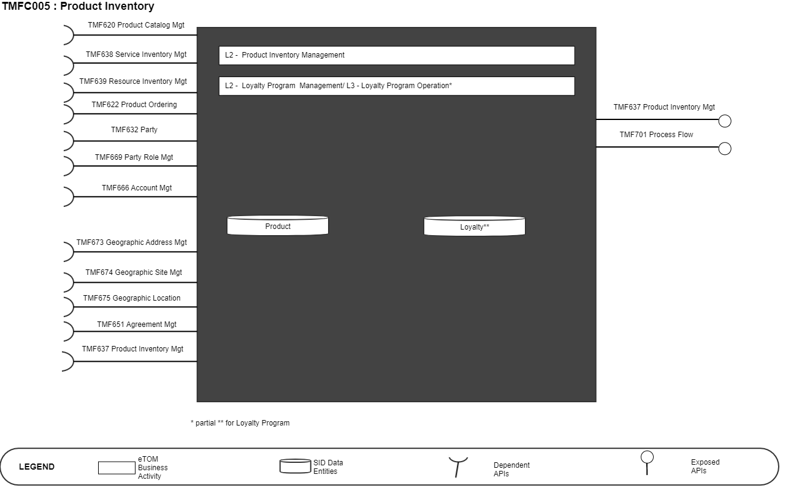
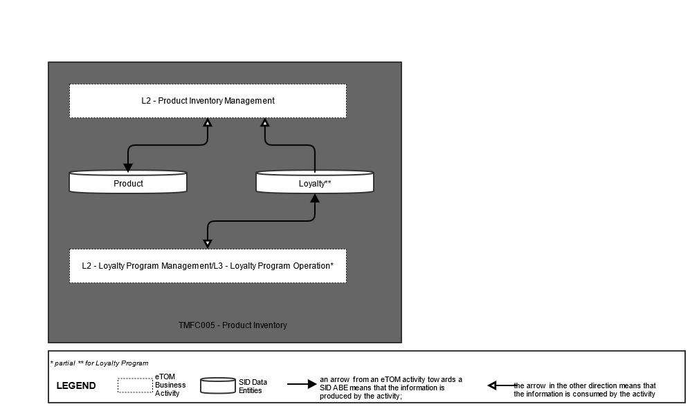
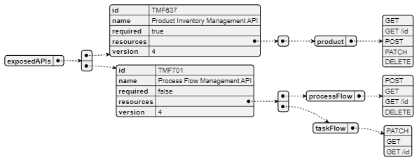
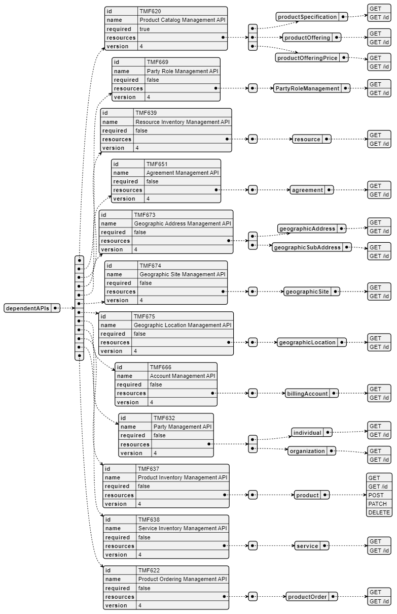
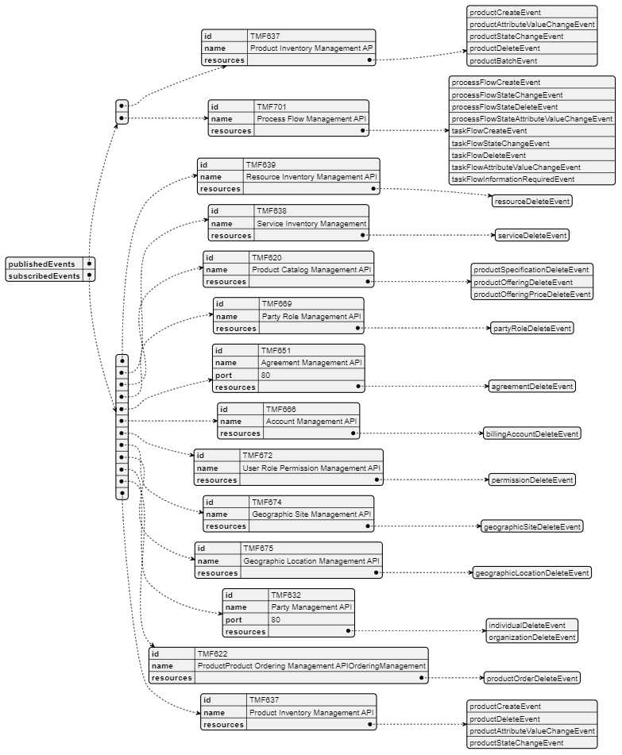

# 1. Overview

| Component Name | ID | Description | ODA Function Block |
| --- | --- | --- | --- |
| Product Inventory | TMFC005 | The Product Inventory component is responsible for storage and exposure of products that are assigned to and used by Parties. This component has functionality that enables creation of inventory items, inventory organization, inventory search or filter, inventory monitoring and tracking, inventory control and inventory auditing. The minimum check to be performed upon inventory item creation or update is for global consistency with related Product Catalog information. | Core Commerce Management |

*([PlantUML source](media/product-inventory-architecture.puml))*

# 2. eTOM Processes, SID

Data Entities and Functional Framework Functions

## 2.1. eTOM business activities

eTOM business activities this ODA Component is responsible for:

| Identifier | Level | Business Activity Name | Description |
| --- | --- | --- | --- |
| 1.2.11 | L2 | Product Inventory Management | Product Inventory Management is responsible to establish, manage and administer the enterprise's product inventory, as embodied in the Product Inventory repository, and monitor and report on the usage and access to the product inventory, and the quality of the information maintained in it. |
| 1.1.19 | L2 | Loyalty Program Management | Define all aspects of a loyalty program, such as requirements and objectives of a loyalty program, determine the benefits to participants. Develop a program, prototype it, test it, rollout/launch it, amend and evaluate it, and terminate it when it is no longer viable for an enterprise. Manage all operational aspects of running a loyalty program. Enable parties to become a members of a program, earn currency and rewards, and redeem currency. Manage a loyalty program account, leave a program, and provide operational reports. |
| 1.1.19.2 | L3 | Loyalty Program Operation | Manage all operational aspects of running a loyalty program. Enable parties to become a members of a program, earn currency and rewards, and redeem currency. Manage a loyalty program account, leave a program, and provide operational reports. |
| 1.1.19.2.5 | L4 | Manage Loyalty Program Account | Update a loyalty program account and make changes to loyalty program participant information. Expire, reinstate, transfer in/out, adjust, a loyalty participant's account currency. Prepare and send a loyalty program communication to a participant or for internal use by an enterprise. |
| 1.1.19.2.7 | L4 | Provide Loyalty Program Operation Report | Generate a loyalty program operation report, such as various loyalty program status reports, trend analysis, and reports that identify suspected abuse of a loyalty program. |

## 2.2. SID ABEs

SID ABEs this ODA Component is responsible for:

| SID ABE Level 1 | SID ABE Level 2 (or set of BEs) |
| --- | --- |
| Product |   |
| Loyalty | Loyalty Program |

## 2.3. eTOM L2 - SID ABEs links

*([PlantUML source](media/etom-sid-product-loyalty-links.puml))*

## 2.4. Functional Framework Functions

| Function ID | Function Name | Function Description | Aggregate Function Level 1 | Aggregate Function Level 2 |
| --- | --- | --- | --- | --- |
| 180 | Assigned Products Maintenance | Assigned Products Maintenance permits defining and update : - product characteristics - links with the related service or resource (handsets, SIM cards, ...) needed to deliver the product, ... | ProductReposito ry Management | ProductInventory Repository Management |
| 197 | Customer Product Storage | Customer Product Storage provides the functionality necessary to store and make available the Products./ services presently being used by the customer. This function allows: • to instantiate or update offers and products ordered by the customer, whatever their type (network product, bundle, device, …) or their marketing mode (rented, sold, …), with their configuration, their tariffs and discounts, and their status (initialized with a creation order) • to update Products status • to search and read Offer and Product installed base (subscribed offers, configuration of installed products, installed tariffs and discount, statuses, …). | ProductReposito ry Management | ProductInventory Repository Management |
| 198 | Customer Loyalty Score Balance Management | Customer Loyalty Score Balance Management function calculates the score according to accumulation/decrease rules. When a customer subscribes to the loyalty program with more than one SIM or other ‘traffic objects’, the Score Management accumulates the points into a single balance. The loyalty score could decrease for one of the following events: prize purchase, points expiry or points deletion by Call Centre. The functionality may also include the visualization of Score details (date, description event type, points, final score) via different contact Channels (e.g. via Web, IVR, Call Centre). | ProductReposito ry Management | Loyalty Account Management |
| 237 | Customer Loyalty Communication | Customer Loyalty Communication function sends information related to Loyalty Programs (Point Balance, Prize Request status, renewed Loyalty Code) to external components in push and pull modes. | ProductReposito ry Management | Loyalty Account Management |
| 361 | Contract Implementation Pro duct Agreement Implementation | Contract Implementation function provide functionality pertaining to the implementation of the contract across fulfillment, assurance, and billing. Product Agreement Implementation function provides functionality pertaining to the implementation of the Product Agreement (a.k.a. contract) across fulfillment, assurance, and billing according to Product Agreement Specification. A Product Agreement represents the approval by the Customer and the Vendor of all term or conditions of a ProductOffering. | ProductReposito ry Management | ProductInventory Agreement Management |
| 362 | Contract Searching | Contract Searching function provides the ability to search for customer contracts based on meta-data and to search text strings within contracts and view customer's existing and previous contracts, | Product Repository Management | Product Inventory Management |
| 363 | Contract Storage Product Agreement Storage | Contract Storage provides the central repository for contract storage as well as the associated contract meta- data. This data can be mined for Campaigns and Lead Generation. Product Agreement Storage provides functionality necessary to store and make | ProductReposito ry Management | ProductInventory Agreement Management |
| 1201 | Product Configuration Check | Product Configuration Check Function Checks for each Product submitted if all Product configuration rules have been respected such as prerequisite, incompatibility rules between ProductSpecifications or mandatory characteristics. | Product Management | Product Repository Management |

# 3. TM Forum Open APIs & Events

The following part covers the APIs and Events; This part is split in 3: • List of Exposed APIs - This is the list of APIs available from this component. • List of Dependent APIs - In order to satisfy the provided API, the component could require the usage of this set of required APIs. • List of Events (generated & consumed ) - The events which the component may generate are listed in this section along with a list of the events which it may consume. Since there is a possibility of multiple sources and receivers for each defined event.

## 3.1. Exposed APIs

The following diagram illustrates API/Resource/Operation:

*([PlantUML source](media/exposed-apis-structure.puml))*

| API ID | API Name | API Version | Mandatory / Optional | Resource | Operations |
| --- | --- | --- | --- | --- | --- |
| TMF637 | Product Inventory Management | 4 | Mandatory | Product | GET GET /ID POST PATCH DELETE |
| TMF688 | Event Management | 4 | Optional | listener | POST |
|   |   |   |   | hub | POST DELETE |
| TMF701 | Process Flow Management | 4 | Optional | processFlow | GET GET /ID POST DELETE |
|   |   |   |   | taskFlow | GET GET /ID PATCH |

## 3.2. Dependent APIs

Following diagram illustrates API/Resource/Operation:

*([PlantUML source](media/dependent-apis-structure.puml))*

| API ID | API Name | API Version | Mandatory / Optional | Resource | Operation |
| --- | --- | --- | --- | --- | --- |
| TMF666 | Account Management | 4 | Optional | billingAccount | Get Get /id |
| TMF669 | Party Role Management | 4 | Optional | partyRole | Get Get /id |
| TMF632 | Party | 4 | Optional | individual | Get Get /id |
|   |   |   |   | organization | Get Get /id |
| TMF672 | User Roles And Permissions | 4 | Optional | permission | Get Get /id |
| TMF673 | Geographic Addre ss Management | 4 | Optional | geographicAddress | Get Get /id |
|   |   |   |   | geographicSubAddre ss | Get Get /id |
| TMF674 | Geographic Site Management | 4 | Optional | geographicSite | Get Get /id |
| TMF675 | Geographic Location | 4 | Optional | geographicLocation | Get Get /id |
| TMF651 | Agreement Management | 4 | Optional | agreement | Get Get /id |
| TMF639 | Resource Inventory Management | 4 | Optional | resource | Get Get /id |
| TMF638 | Service Inventory Management | 4 | Optional | service | Get Get /id |
| TMF620 | Product Catalog Management | 4 | Mandatory | productSpecification | Get Get /id |
|   |   |   |   | productOffering | Get Get /id |
|   |   |   |   | productOfferingPrice | Get Get /id |
| TMF622 | Product Ordering | 4 | Optional | productOrder | Get Get /id |
| TMF637 | Product Inventory | 4 | Optional | product | Get Get /id Post Patch Delete |
| TMF688 | Event Management | 4 | Optional | event | Get Get /id |

## 3.3. Events

The diagram illustrates the Events which the component may publish and the Events that the component may subscribe to and then may receive. Both lists are derived from the APIs listed in the preceding sections.

*([PlantUML source](media/events-structure.puml))*

# 4. Machine Readable

Component Specification Refer to the ODA Component Map on the TM Forum website for the machine- readable component specification files for this component.
