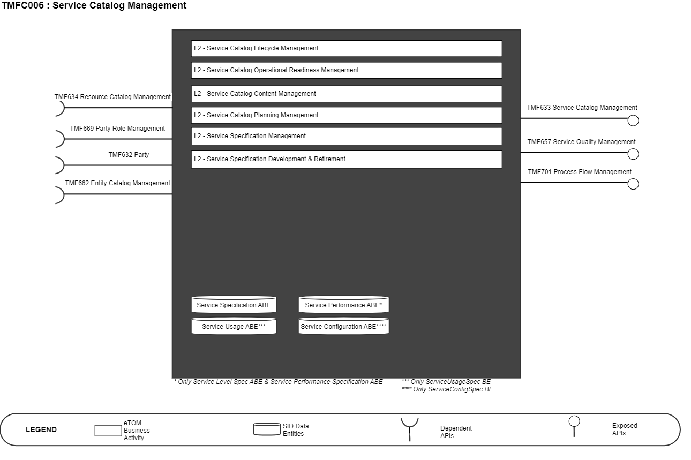
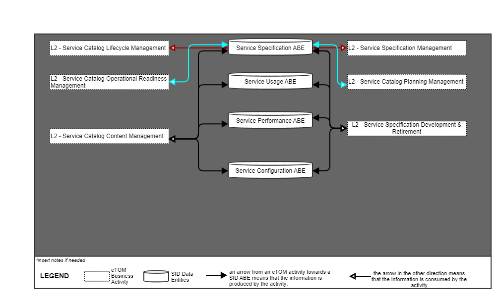
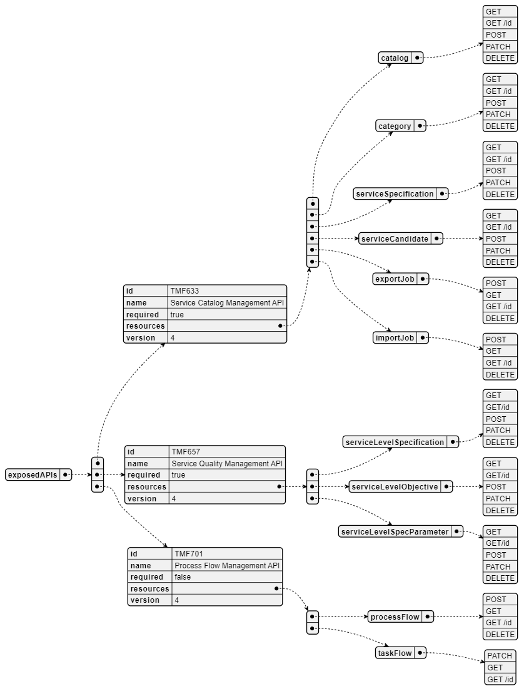
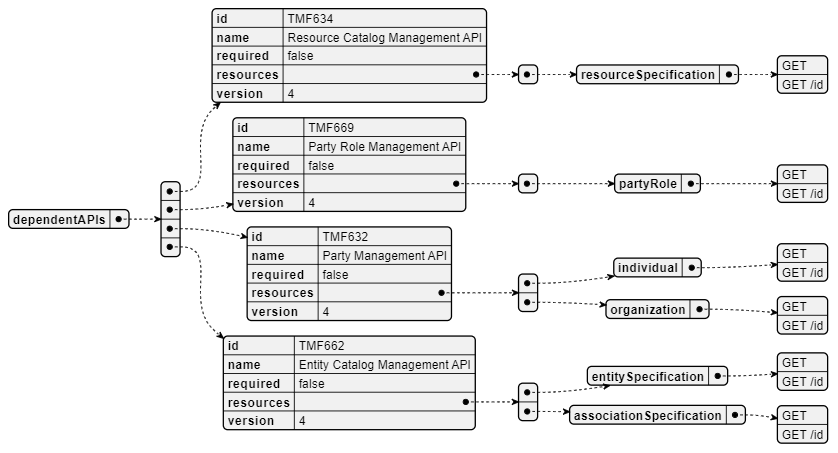
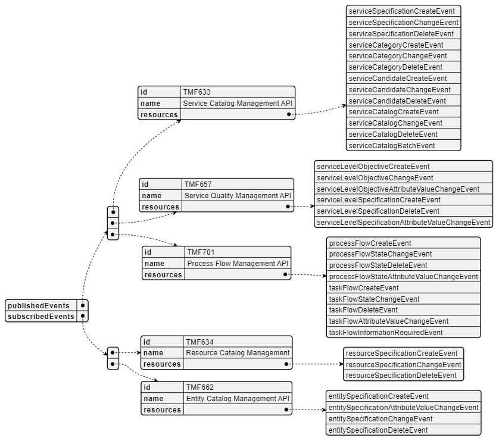

# 2. Overview

| Component Name | ID | Description | ODA Function Block |
| --- | --- | --- | --- |
| Service Catalog Management | TMFC006 | The Service Catalog Management component is responsible for organizing the collection of service specifications that identify and define all requirements of a service that can be performed. This component has the functionality that enables presentation of a customer-facing view so users are able to search and select services they need, as well as a technical view to enable definition and setup of what is needed to deliver service specifications (Customer Facing Service Specifications (CFSSs) and Resource Facing Service Specifications (RFSSs)) contained in the service catalog. The Service Catalog Management component has functionalities that include creation of new service specifications, managing service specifications, administering the lifecycle of services, describing relationships between service specification attributes, reporting on service specifications and their changes, and facilitating easy and systematic indexing and access to services, as well as facilitating automation of the service delivery process. | Production |

*([PlantUML source](media/service-catalog-management-architecture.puml))*

# 3. eTOM Processes, SID

Data Entities and Functional Framework Functions

## 3.1. eTOM business activities

eTOM business activities this ODA Component is responsible for:

| Identifier | Level | Business Activity Name | Description |
| --- | --- | --- | --- |
| 1.4.13 | L2 | Service Catalog Lifecycle Management | Catalog Lifecycle Management business process covers a set of business activities that enable manage the lifecycle of an organizations catalog from design to build according to defined requirements. |
| 1.4.14 | L2 | Service Catalog Operational Readiness Management | Service Catalog Operational Readiness Management business process establishes and administers the support needed to operationalize Service catalogs for ongoing day- to-day business needs. |
| 1.4.15 | L2 | Service Catalog Content Management | Service Catalog Content Management business process define and provide the business activities that support the day-to-day operations of Service Catalogs in order to realize the business operations goals. |
| 1.4.16 | L2 | Service Catalog Planning Management | Service Catalog Planning Management business process covers a set of business activities that understand and enable establish the plan to define, design and operationalize a catalog in order to meet the needs and objectives of Service cataloging. The Service Catalog Planning Management business process ensure that the organization is able to identify the most appropriate scheme and goal for it catalog. It includes designing the Catalog plan and developing the specification according to Service management requirement. |
| 1.4.19 | L2 | Service Specification Management | Service Specification Management business process leverages captured service requirements to develop, master, analyze, and update documented standard conditions that must be satisfied by service design and/or delivery. |
| 1.4.3 | L2 | Service Specification Development & Retirement | Service Specification Development & Retirement processes are project oriented in that they develop and deliver new or enhanced service types. These processes include process and procedure implementation, systems changes and customer documentation. They also undertake rollout and testing of the service type, capacity management and costing of the service type. It ensures the ability of the enterprise to deliver service types according to requirements. |
| 1.4.3.4 | L3 | Develop Detailed Service Specifications | The Develop Detailed Service Specifications processes develop and document the detailed service-related technical and operational specifications, and customer manuals. These processes develop and document the required service features, the specific underpinning resource requirements and selections, the specific operational, and quality requirements and support activities, any service specific data required for the systems and network infrastructure as agreed through the Develop New Service Business Proposal processes. The Develop Detailed Product Specifications processes provide input to these specifications. The processes ensure that all detailed specifications are produced and appropriately documented. Additionally, the processes ensure that the documentation is captured in an appropriate enterprise repository. |

## 3.2. SID ABEs

SID ABEs this ODA Component is responsible for:

*: if SID ABE Level 2 is not specified this means that all the L2 business entities must be implemented, else the L2 SID ABE Level is specified.

| SID ABE Level 1 | SID ABE Level 2 (or set of BEs)* |
| --- | --- |
| Service Performance ABE | Service Level Spec ABE |
| Service Performance ABE | Service Performance Specification ABE |
| Service Usage ABE | ServiceUsageSpec BE |
| Service Configuration ABE | ServiceConfigSpec BE |

## 3.3. eTOM L2 - SID ABEs links

eTOM L2 vS SID ABEs links for this ODA Component.:

*([PlantUML source](media/etom-sid-service-catalog-links.puml))*

## 3.4. Functional Framework Functions

Please note, these Functions were changed in GB1033, but ISA-996 - Master Data Management has repurposed catalog related functions : Has been raised to review this. Functional Framework 23.5 mapping draft:

| Function ID | Function Name | Function Description | Aggregate Function Level 1 | Aggregate Function Level 2 |
| --- | --- | --- | --- | --- |
| 897 | Building Access Control | Building Access Control checks, stops or allow physical access to facilities according to access roles and rules. | Identification and Permission Management | Permission Control |
| 900 | Authorization Control Management | Authorization Control Function controls permissions according to roles and related rules. It consists in evaluating if a requester is granted the permission to act by providing the required evidence. The evidence corresponds to the condition specified for each right (for instance keying the correct password to use a specific mailbox). If the action is protected via a right which is assigned (possibly via a role) to a person then the person has to be identified to retrieve their rights and verify if the request to act can be granted. | Identification and Permission Management | Permission Control |
| 995 | Service Task Item Policy Control Configuration | Define and configure the policies which will be implemented during the Service task item lifecycle. | Service Specification Development | Service Specification Design |
| 1080 | Service Specification Change Auditing | Service Specification Change Auditing manages the implications of Service Specifications changes to determine the consequences of any given change. Customer Facing Service | Service Specification Development | Service Specification Design |
| 1081 | Service Specification Repository Management | Service Specification Repository Management is able to create, modify and delete Service Specification and related entities such as Service Usage Specification. This includes the ability to manage the state of an entity during its lifecycle (e.g. planned, deployed, in operation, replaced by, locked). It includes Service Specifications retrieval, integrity rules check and versioning management. It also provides Product Specification and Offering views adapted to the different roles. | Service Specification Development | Service Specification Design |
| 1084 | Know-How Specification Design | Know-How Specification Design provides the means to describe the Customer Facing Service Specifications including constraints, characteristics and types of usages. It also identifies Technical Solutions usable for the Know-How and rules to find the Technical Solution. | Service Specification Development | Service Specification Design |
| 1085 | Technical Solution Design | Technical Solution Design provides the means to describe Resource Facing Service Specifications (a.k.a. RFSSpec) including constraints, characteristics and types of usages. It also identifies Resource Specifications used for each Technical Solution Specification (a.k.a. RFSSpec). | Service Specification Development | Service Specification Design |
| 1086 | Service Specification to Supplier Product Specification Relationship Design | Service Specification to Supplier Product Specification Relationship Design identifies, when know- how, technical solutions or part of it are not realized by the CSP, the Supplier Product Specification used to implement and corresponding rules. | Service Specification Development | Service Specification Design |
| 1135 | Technical Solution Policy Design | The Technical Solution Policy Management Function enables to define, and to check consistency of, potentially complex rules to automate the choice of the technical solution (CFS Spec) for a know-how (RFS Spec) or | Service Specification Development | Technical Solution Policy Management |

# 4. TM Forum Open APIs & Events

The following part covers the APIs and Events; This part is split in 4: • List of Exposed APIs - This is the list of APIs available from this component. • List of Dependent APIs - In order to satisfy the provided API, the component could require the usage of this set of required APIs. • List of Events (generated & consumed ) - The events which the component may generate is listed in this section along with a list of the events which it may consume. Since there is a possibility of multiple sources and receivers for each defined event.

## 4.1. Exposed APIs

The following diagram illustrates API/Resource/Operation:

*([PlantUML source](media/exposed-apis-structure.puml))*

| API ID | API Name | API Version | Mandatory / Optional | Resource | Operation |
| --- | --- | --- | --- | --- | --- |
| TMF633 | Service Catalog Management | 4 | Mandatory | catalog | GET GET /ID POST PATCH DELETE |
| TMF633 | Service Catalog Management | 4 | Mandatory | category | GET GET /ID POST PATCH DELETE |
| TMF633 | Service Catalog Management | 4 | Mandatory | serviceSpecification | GET GET /ID POST PATCH DELETE |
| TMF633 | Service Catalog Management | 4 | Mandatory | serviceCandidate | GET GET /ID POST PATCH DELETE |
| TMF633 | Service Catalog Management | 4 | Mandatory | exportJob | GET GET /ID POST DELETE |
| TMF633 | Service Catalog Management | 4 | Mandatory | importJob | GET GET /ID POST DELETE |
| TMF657 | Service Quality Management | 4 | Mandatory | serviceLevelSpecification | GET GET /ID POST PATCH DELETE |
| TMF657 | Service Quality Management | 4 | Mandatory | serviceLevelObjective | GET GET /ID POST PATCH DELETE |
| TMF657 | Service Quality Management | 4 | Mandatory | serviceLevelSpecParamete r | GET GET /ID POST PATCH DELETE |
| TMF701 | Process Flow Management | 4 | Optional | processFlow | GET GET /ID POST DELETE |
| TMF701 | Process Flow Management | 4 | Optional | taskFlow | GET GET /ID PATCH |
| TMF688 | Event Management API | 4 | Optional | listener | POST |
| TMF688 | Event Management API | 4 | Optional | hub | POST DELETE |

## 4.2. Dependent APIs

Following diagram illustrates API/Resource/Operation potentially used by the service catalog component:

*([PlantUML source](media/dependent-apis-structure.puml))*

| API ID | API Name | API Version | Mandatory / Optional | Resource | Operation | Rationale |
| --- | --- | --- | --- | --- | --- | --- |
| TMF634 | Resource Catalog Management | 4 | Optional | resourceSpecificatio n | GET GET /ID | n/a |
| TMF669 | Party Role Management | 4 | Optional | partyRole | GET GET /ID | n/a |
| TMF632 | Party | 4 | Optional | induvidual | GET GET /ID | n/a |
| TMF632 | Party | 4 | Optional | organization | GET GET /ID | n/a |
| TMF662 | Entity Catalog Management | 4 | Optional | entitySpecification | GET GET /ID | n/a |
| TMF662 | Entity Catalog Management | 4 | Optional | associationSpecificat ion | GET GET /ID | n/a |
| TMF672 | User Role Permission | 4 | Optional | permission | GET GET /ID | n/a |
| TMF688 | Event Management API | 4 | Optional | event | GET GET /ID | n/a |

## 4.3. Events

The diagram illustrates the Events which the component may publish and the Events that the component may subscribe to and then may receive. Both lists are derived from the APIs listed in the preceding sections.

*([PlantUML source](media/events-structure.puml))*

The type of event could be: • Create : a new resource has been created (following a POST). • Delete: an existing resource has been deleted. • AttributeValueChange or Change: an attribute from the resource has changed - event structure allows to pinpoint the attribute. • InformationRequired: an attribute should be valued for the resource preventing to follow nominal lifecycle - event structure allows to pinpoint the attribute. • StateChange: resource state has changed.

# 5. Machine Readable

Component Specification Refer to the ODA Component table for the machine-readable component specification file for this component.
