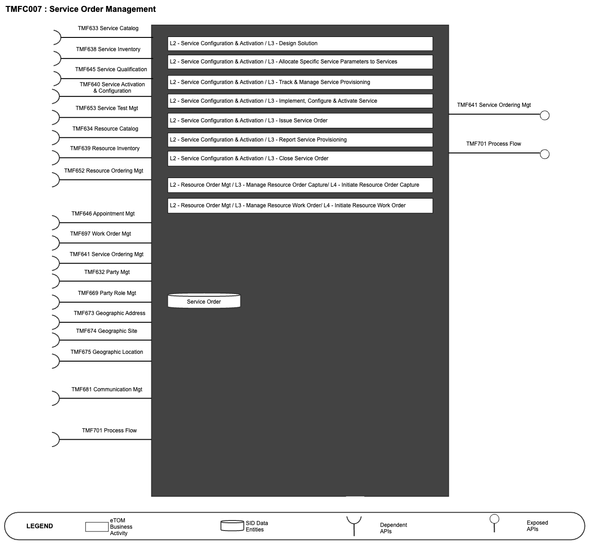
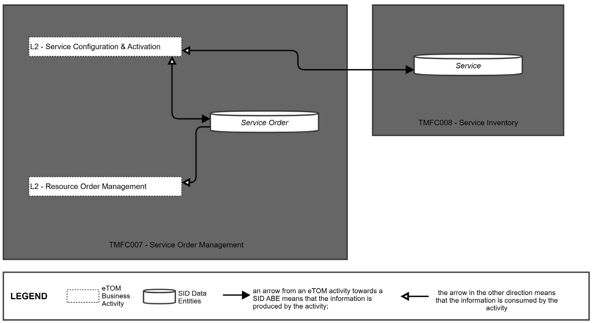
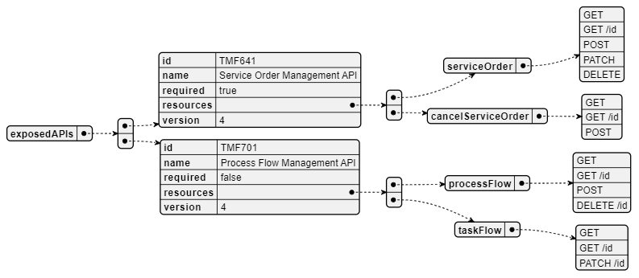
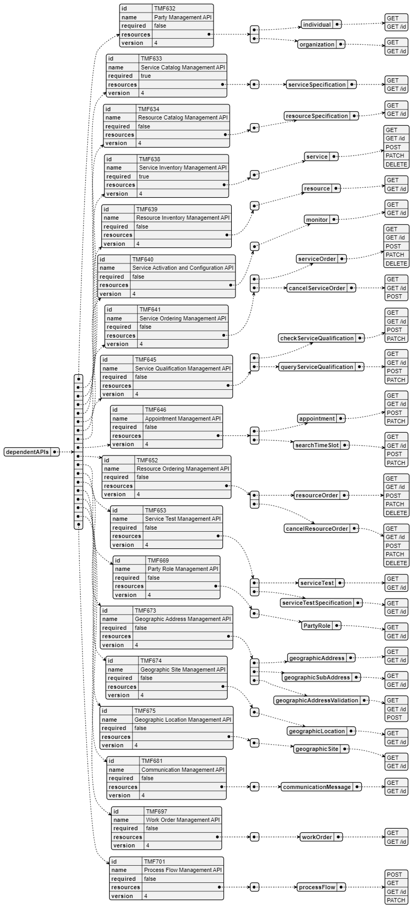
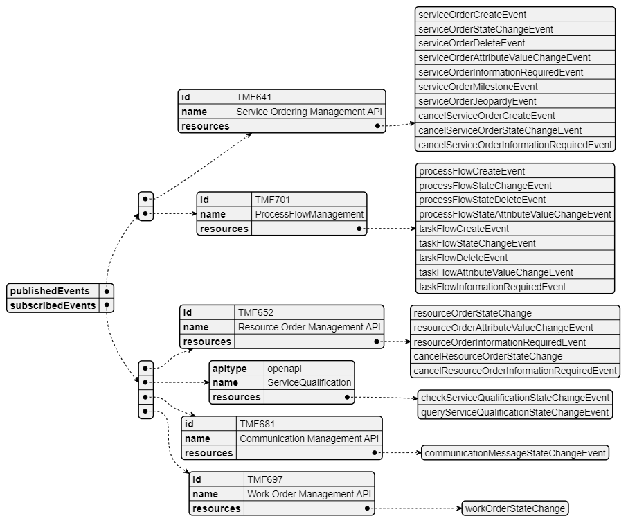

# 1. Overview

| Component Name | ID | Description | ODA Functional Block |
| --- | --- | --- | --- |
| Service Order Management | TMFC007 | Service Order Management (SOM) component is the entry point to the Production Domain. It oversees delivery of Customer-Facing-Service (CFS) resources (network and service platform equipment). The SOM exposes the API ServiceOrder. It is triggered when the Product Order Delivery Orchestration And Management component calls this API to request CFS delivery. To achieve delivery of a CFS, the SOM orchestrates the CFS delivery process which identifies possible RFS and chooses one, using the catalog and technical inventory. It selects the resources (servers, equipment, etc.) and their instances, and requests the Resource Order Management (ROM) component to update selected resource instances to deliver CFS. Requests sent to the ROM contain the CFS and the list of configured resource instances to be updated. | Production |

*([PlantUML source](media/service-order-management-architecture.puml))*

# 2. eTOM Processes, SID

Data Entities and Functional Framework Functions

## 2.1. eTOM business activities

eTOM business activities this component is responsible for are:

| Identifier | Level | Business Activity Name | Description |
| --- | --- | --- | --- |
| 1.4.5 | L2 | Service Configuration & Activation | Allocation, implementation, configuration, activation and testing of specific services to meet customer requirements. |
| 1.4.5.1 | L3 | Design Solution | Develop an end-end specific service design which complies with a particular customer's requirement |
| 1.4.5.2 | L3 | Allocate Specific Service Parameters to Services | Issue service identifiers for new services. |
| 1.4.5.3 | L3 | Track & Manage Service Provisioning | Ensure service provisioning activities are assigned, managed and tracked efficiently. |
| 1.4.5.4 | L3 | Implement, configure & activate service | Implement, configure and activate the specific services allocated against an issued service order. |
| 1.4.5.6 | L3 | Issue Service Order | Issue correct and complete service orders |
| 1.4.5.7 | L3 | Report service provisioning | Monitor the status of service orders, provide notifications of any changes and provide management reports. |
| 1.4.5.8 | L3 | Close Service Order | Close a service order when the service provisioning activities have been completed |
| 1.5.5 | L2 | Resource Order Management | Resource Order Management business process directs and controls ordering, scheduling, and allocation of resources (such as materials, equipment, and personnel) within the business. |
| 1.5.5.6 | L3 | Manage Resource Order Capture | Manage Resource Order Capture is responsible for directing and controlling the capture and collection of resource orders from internal and external customers. |
| 1.5.5.6.1 | L4 | Initiate Resource Order Capture * | Initiate Resource Order Capture business activity is responsible for the initial activity of capturing and collecting resource orders from internal and external customers. |
| 1.5.5.7 | L3 | Manage Resource Work Order | Manage Resource Order Work business activity directs and controls all work that are required to fulfill an approved resource order by ensuring the work related to the order is planned, executed and closed in a timely and efficient manner. |
| 1.5.5.7.1 | L4 | Initiate Resource Work Order * | Initiate Resource Work Order business activity starts a new work order for a specific resource along with all work orders tasks, roles and supporting resources that are need. |

*to notice, only these L4 of these L3 and L2 are covered by TMFC007.

## 2.2. SID ABEs

SID ABEs this component is responsible for are:

| SID ABE Level 1 | SID ABE L1 Definition | SID ABE Level 2 (or set of BEs)* | SID ABE Level 2 Definition |
| --- | --- | --- | --- |
| Service Order | The Service Order ABE contains entities that represent a type of Request that decomposes a Customer Order's products into the services associated with a ServiceOrder through which the products are realized. |   |   |

*: if SID ABE Level 2 is not specified this means that all the L2 business entities must be implemented, else the L2 SID ABE Level is specified. As for TMFC003 Product Order Delivery Orchestration and Management, we also need to describe Orchestration Plan and delivery process to manage here at Service Order level. Refer to Jira paragraph at the end of the document.

## 2.3. eTOM L2 - SID ABEs links

eTOM L2 vS SID ABEs links for this ODA Component.

*([PlantUML source](media/etom-sid-service-order-links.puml))*

## 2.4. Functional Framework Functions

| Function ID | Function Name | Function Description | Aggregate Function Level 1 | Aggregate Function Level 2 |
| --- | --- | --- | --- | --- |
| 571 | Service Delivery Due Date Calculation | Service Delivery Due Date Calculation functions calculates the service delivery due date using network capacity, access provider selection and work center intelligence (including workload and capacity). | Service Order Management | Service Order Initialization |
| 1061 | Service Order Initiation | Service Order Initiation function issues valid and complete service orders. | Service Order Management | Service Order Initialization |
| 1219 | Service Order Request Consistency Check | The Service Order Request Consistency Check Function allows, when receiving a Service Order request prepared and transmitted by another system, to check its consistency. | Service Order Management | Service Order Initialization |
| 1220 | Internal Service Order Initialization | The Internal Service Order Initialization Function permit to initialize Customer Facing Service Orders (a.k.a. CFS Orders) for operator internal needs, for example to change (part of) a technical solution and migrate operational Installed CFS on the new solution elements (ex: VOIP H323 -> VOIP SIP). | Service Order Management | Service Order Initialization |
| 592 | Service Parameters Reservation | Service Parameters Reservation reserves the right service parameters based on service specification and service inventory for a service order | Service Order Management | Service Availability |
| 584 | Service Activation Planning | Service Activation Planning provides planning of service activation to access, plan and gather additional information for service activation | Service Order Management | Service Order Orchestration |
| 588 | Service Orchestration Configuration | Service Orchestration Configuration function provides composition of a service configuration plan according to the required service actions and sent to Service Order Orchestration and/or Service Activation Management | Service Order Management | Service Order Orchestration |
| 591 | Service Parameters Allocation | Service Parameters Allocation provides allocation of the right service parameters to fulfill service orders | Service Order Management | Service Order Orchestration |
| 596 | Service Order Transfer Supervision | Oversees the transfer of Service Order Requests to appropriate resource providers. | Service Order Management | Service Order Orchestration |
| 598 | Service Order Orchestration | The Service Order Orchestration function provides workflow and orchestration capabilities for a dedicated Service (CFS) Order. Orchestration is needed when: • the technical solution includes the expansion of the operator Installed Resources or the purchase of a partner product (ex: local loop purchase) • a work order is necessary at the delivery address or somewhere in the operator network • part of the delivery process or checks needs to be delegated to another Service Order Manager • contributing or support systems must be informed Example: to deliver a VOIP service, it will orchestrate actions on Access Network Factory, VOIP service platform and CPE. Service Order Orchestration will also orchestrate and manage dependencies between related Service Order items of Service Order. | Service Order Management | Service Order Orchestration |
| 734 | Service Data Collection | The Service Data Collection function gathers any needed service data to aid in the verification and issuance of a complete and valid service order as well as data necessary to address dependencies between service and/or resource orders. | Service Order Management | Service Order Orchestration |
| 963 | Service Task Item Decompositio n | Service Task Item Decomposition: By a request for an orchestration of a service the service needs to be analyzed and decomposed into the part- actions necessary to take to fulfill the requested orchestration. The Service may consist of several services and may use a number of Resources. It may also be controlled by several parameters for optional behaviors. This composition of the Service is given by configuration data available from Catalog applications and the Service Capability Orchestration application. | Service Order Management | Service Order Orchestration |
| 968 | Service Work Item Sequence Execution | Service Work Item Sequence Execution function executes each individual item in sequence of the service orchestration to fulfill, or roll back according to a pre-defined configuration, and reports the sequence execution result. Because of the “Service Decomposition” of an orchestration request the result may be several actions that needs to take place in a specific sequence. | Service Order Management | Service Order Orchestration |
| 969 | Service Work Item Sequence Execution Configuration | The “Service Work Item Sequence Execution" function controls so that the sequence is fulfilled or rolled back. The rules for the sequence execution will set the conditions for the fulfillment, or roll-back, and for the reporting and notification. The “Service Task Item Sequence Carry Through configuration" is a management of the application function that defines how the execution of the orchestration sequence will be done. | Service Order Management | Service Order Orchestration |
| 632 | Service Termination Points Determining | Service Termination Points Determining determines the termination points i.e. the appropriate service provider entry point to support the Customer's service request. | Service Order Management | Service Technical Solution Identification |
| 735 | Access Provider Selection | Access Provider Selection function selects an access provider among identified available access providers or access technologies at the given location, based on business rules. | Service Order Management | Service Technical Solution Identification |
| 1141 | Installed Resources Identification | Installed Resources Identification Function identifies the installed resources to update, as part of the chosen technical solution, to deliver the ordered service (CFS). This information enriches the CFS order and the CFS. This choice is based on service catalogue rules (between RFS specification and Resources specification) and it can be necessary to check the installed resources availability, occupancy, etc. via the Resource Availability function. Cloud example: In case of a cloud service, the Service Order Delivery process only identifies the equipment in charge of the management of the cloud infrastructure and it will be informed of the ordered service characteristics. Depending on its own rules, the cloud infrastructure manager will decide or not to immediately allocate and configure all or part of the required resources. So the first usage request of the cloud service can trigger the effective choice and configuration of the necessary resources and these resources can change between usages. In this case the end of the delivery process is assumed by the manager of the cloud infrastructure. Note: This function is globally a part of the technical solution identification. | Service Order Management | Installed Resources Identification |
| 733 | Service Order Decompositio n | The Service Order Decomposition Function allows in the context of a Service Order to prepare Resource Order, Service Order which will be delegated to another system, Supplier Order, Stock Item Order or Work Order with the necessary information (the effective update in the order repositories will be supported by the corresponding Order Repository Management functions). In the case of a Service associated with an existing Internal Resource Type, this function also allows to: • check if a corresponding Installed Resource is operational in the resource installed base, and determine the operation to be performed at Resource level (creation or modification) • eventually group in the same Resource order several ordered services, based on the same Customer Facing Service Specification (a.k.a. CFS specification), and/or identified to be delivered at the same time by the Service Order Delivery Orchestration. | Service Order Management | Service Order Delivery Preparation |
| 1217 | Service Order Needs Identification | The Service Order Needs Identification Function allows in the context of a Service Order to query catalogues and installed bases to identify what needs to be delivered: resource specification and its configuration, service specification (CFSSpec), intervention (WorkSpec), supplier product, related to the ordered service. | Service Order Management | Service Order Delivery Preparation |
| 595 | Service Order Completion | Completes the service order when all resource orders have been completed. | Service Order Management | Service Order Completion |
| 600 | Service Order Validation | The Service Order Validation function validates the service order request based on contract, catalog, and provisioning rules. | Service Order Management | Service Order Completion |
| 583 | Activation Notification | Activation Notification function provides notifications on successful activation and, in cases of exceptions send fallouts to Service Order Orchestration and manage rollbacks activities (if applicable) | Service Order Management | Service Order Repository Management |
| 594 | Service Order Storage | Service order Storage function stores the service order into an appropriate data store. | Service Order Management | Service Order Repository Management |
| 599 | Service Order Tracking | The Service Order Tracking function tracks and manages the events and the lifecycle related to the Service (CFS) Order and to its items (e.g.: service order lines). It gathers Service Order items delivery events from Service Order Orchestration and manages related Service Order lifecycle and Installed CFS lifecycle (via the Installed Service Management function). Depending on the Service Order (or any of its elements) events, and on the implemented business rules, this function can decide to notify other systems (for example in case of delivery problems or delays) – via the business event publication function. | Service Order Management | Service Order Repository Management |
| 597 | Service Order Exposure | Service Order Exposure provides exposure of the status on the overall service order. | Fulfillment Integration Management | Service Fulfillment Access Management |
| 570 | Solution Services Design Management | Solution Services Design Management function supports the end to end service design. It applies engineering rules to determine required network facilities, equipment configurations and the method and access path to the customer site or location of service termination. This function also establishes and manages the detailed design tasks required to issue the work orders. | Service Configuration & Activation | Service Configuration |
| 589 | Cross Services Dependencies Configuration | Cross Services Dependencies Configuration function provides support for appropriately considered cross service dependencies as part of the configuration activities to fulfill a service order | Service Configuration & Activation | Service Configuration |
| 590 | Service Configuration | The Service Configuration function is in charge of configuring the specific service and its parameters as appropriate for the fulfillment of a service order | Service Configuration & Activation | Service Configuration |
| 341 | Service Activation | Service Activation function for services/products sold by affiliates. | Service Configuration & Activation | Service Activation |
| 342 | Mass Service Pre-activation | Mass Service Pre-activation of services to prepare for a swift activation at sales. E.g., subsequent affiliate sales. | Service Configuration & Activation | Service Activation |
| 585 | Service Configuration Activation | Service Configuration Activation implements and activates the specific service configuration against the service configuration plan (including activation of CPE if part of the service) | Service Configuration & Activation | Service Activation |
| 16 | Fallout Automated Correction | Fallout Automated Correction function tries to automatically fix fallouts in workflows before they go to a human for handling. This includes a Fallout Rules Engine that provides the capability to handling various errors or error types based on built rules. These rules can facilitate autocorrection, correction assistance, placement of errors in the appropriate queues for manual handling, as well as access to various systems. | Fallout Management | Fallout Correction Management |
| 17 | Fallout Correction Information Collection | Fallout Correction Information Collection collects relevant information for errors or situations that cannot be handled via Fallout Auto Correction. The intent is to reduce the time required by the technician in diagnosing and fixing the fallout. | Fallout Management | Fallout Correction Management |
| 19 | Fallout Manual Correction Queuing | Fallout Manual Correction Queuing function provides the required functionality to place error fallout into appropriate queues to be handled via various staff or workgroups assigned to handle or fix the various types of fallout that occurs during the fulfillment process. This includes the ability to create and configure queues, route errors to the appropriate queues, as well as the ability for staff to access and address the various fallout instances within the queues. | Fallout Management | Fallout Correction Management |
| 21 | Fallout Orchestration | The Fallout Orchestration function provides workflow and orchestration capability across Fallout Management. | Fallout Management | Fallout Correction Management |
| 24 | Pre-populated Fallout Information Presentation | Pre-populated Fallout Information Presentation automatically position the analyzer on appropriate screens pre-populated with information about the order(s) that's subject for fallout handling. | Fallout Management | Fallout Correction Management |
| 756 | Fallout Rule Based Error Correction | Fallout Rule Based Error Correction function provides the capability to handle various errors or error types based on pre-defined rules. These rules can facilitate autocorrection. | Fallout Management | Fallout Correction Management |
| 18 | Fallout Management to Fulfillment | Fallout Management to Fulfillment Application Accessing function provides a variety of tools to facilitate | Fallout Management | Fallout Repository Management |
|   | Application Accessing | Fallout Management access to other applications and repositories to facilitate proper Fallout Management. This can include various general access techniques such as messaging, publish and subscribe, etc. as well as specific APIs and contracts to perform specific queries or updates to various applications or repositories within the fulfillment domain. |   |   |
| 20 | Fallout Notification | Fallout Notification function provides the means to alert people or workgroups of some fallout situation. This can be done via a number of means, including email, paging, (Fallout management interface bus) etc. This function is done via business rules. | Fallout Management | Fallout Repository Management |
| 22 | Fallout Reporting | Fallout Reporting provides various reports regarding Fallout Management, including statistics on fallout per various times periods (per hour, week, month, etc) as well as information about specific fallout. | Fallout Management | Fallout Repository Management |
| 23 | Fallout Dashboard System Log-in Accessing | Fallout Dashboard System Log- in Accessing provides auto logon capability into various applications needed to analyze and fix fallout. | Fallout Management | Fallout Repository Management |

# 3. TM Forum Open APIs & Events

The following part covers the APIs and Events; This part is split in 3: • List of Exposed APIs - This is the list of APIs available from this component. • List of Dependent APIs - In order to satisfy the provided API, the component could require the usage of this set of required APIs. • List of Events (generated & consumed ) - The events which the component may generate is listed in this section along with a list of the events which it may consume. Since there is a possibility of multiple sources and receivers for each defined event. <Note note to be inserted into ODA Component specifications: If a new Open API is required, but it does not yet exist. Then you should include a textual description of the new Open API, and it should be clearly noted that this Open API does not yet exist. In addition, a Jira epic should be raised to request the new Open API is added, and the Open API team should be consulted. Finally, a decision is required on the feasibility of the component without this Open API. If the Open API is critical then the component specification should not be published until the Open API issue has been resolved. Alternatively if the Open API is not critical, then the specification could continue to publication. The result of this decision should be clearly recorded.>

## 3.1. Exposed APIs

Following diagram illustrates API/Resource/Operation:

*([PlantUML source](media/exposed-apis-structure.puml))*

| API ID | API Name | Mandatory / Optional | Operations |
| --- | --- | --- | --- |
| TMF641 | Service Ordering Management | Mandatory | serviceOrder: - GET - GET /id - POST - PATCH - DELETE cancelServiceOrder: - GET - GET /id - POST |
| TMF701 | Process Flow | Optional | processFlow: - GET - GET /id - POST - DELETE /id taskFlow: - GET - GET /id - PATCH /id |
| TMF688 | Event Management | Optional | d |

## 3.2. Dependant APIs

Following diagram illustrates API/Resource/Operation potentially used by the Service Order Management component:

*([PlantUML source](media/dependent-apis-structure.puml))*

| API ID | API Name | Mandatory / Optional | Operations | Rationales |
| --- | --- | --- | --- | --- |
| TMF632 | Party Management API | Optional | individual: - GET - GET /id organization: - GET - GET /id | n/a |
| TMF633 | Service Catalog Management API | Mandatory | serviceSpecification: - GET - GET /id | as illustrated into IG1228 per TMFS00 |
| TMF634 | Resource Catalog Management API | Optional | resourceSpecification: - GET - GET /id |   |
| TMF638 | Service Inventory Management API | Mandatory | service: - GET - GET /id - POST - PATCH - DELETE | as illustrated into IG1228 per TMFS00 |
| TMF639 | Resource Inventory Management API | Optional | resource: - GET - GET /id | n/a |
| TMF640 | Service Activation & Configuration API | Optional | monitor: - GET - GET /id | n/a |
| TMF641 | Service Ordering Management API | Optional | serviceOrder: - GET - GET /id - POST - PATCH - DELETE cancelServiceOrder: - GET - GET /id - POST | n7a |
| TMF645 | Service Qualification Management API | Optional | checkServiceQualification: - GET - GET /id - POST - PATCH | n/a |
| TMF646 | Appointment Management API | Optional | appointment: - GET - GET /id - POST - PATCH searchTimeSlot: - GET - GET /id - POST - PATCH | n/a |
| TMF652 | Resource Ordering Management API | Optional | resourceOrder: - GET - GET /id - POST - PATCH - DELETE cancelResourceOrder: - GET - GET /id - POST - PATCH - DELETE | n/a |
| TMF653 | Service Test Management API | Optional | serviceTest: - GET - GET /id serviceTestSpecification: - GET - GET /id | n/a |
| TMF669 | Party Role Management API | Optional | partyRole: - GET - GET /id | n/a |
| TMF672 | User Role Permission Management API | Optional | permission: - GET - GET /id | n/a |
| TMF673 | Geographic Address Management API | Optional | geographicAddress: - GET - GET /id geographicSubAddress: - GET - GET /id geographicAddressValidation: - GET - GET /id - POST | n/a |
| TMF674 | Geographic Site Management API | Optional | geographicLocation: - GET - GET /id | n/a |
| TMF675 | Geographic Location Management API | Optional | geographicSite: - GET - GET /id | n/a |
| TMF681 | Communication Management API | Optional | communicationMessage: - GET - GET /id | n/a |
| TMF685 | Resource Pool Management API | Optional | reservation: - GET - GET /id - POST - PATCH - DELETE resourcePool: - GET - GET /id |   |
| TMF688 | Event Management API | Optional | event: - GET - GET /id | n/a |
| TMF697 | Work Order Management API | Optional | workOrder: - GET - GET /id | n/a |
| TMF701 | Process Flow Management API | Optional | processFlow: - POST - GET - GET /id - PATCH | n/a |

## 3.3. Events

The diagram illustrates the Events which the component may publish and the Events that the component may subscribe to and then may receive. Both lists are derived from the APIs listed in the preceding sections.

*([PlantUML source](media/events-structure.puml))*

Event name always follows same pattern: <<Resource>> + <<Type of Event>> + "Event" The type of event could be: • Create : a new resource has been created (following a POST). • Delete: an existing resource has been deleted. • AttributeValueChange: an attribute from the resource has changed - event structure allows to pinpoint the attribute. • InformationRequired: an attribute should be valued for the resource preventing to follow nominal lifecycle - event structure allows to pinpoint the attribute. • StateChange: resource state has changed.

# 4. Machine Readable

Component Specification Refer to the ODA Component table for the machine-readable component specification file for this component.
