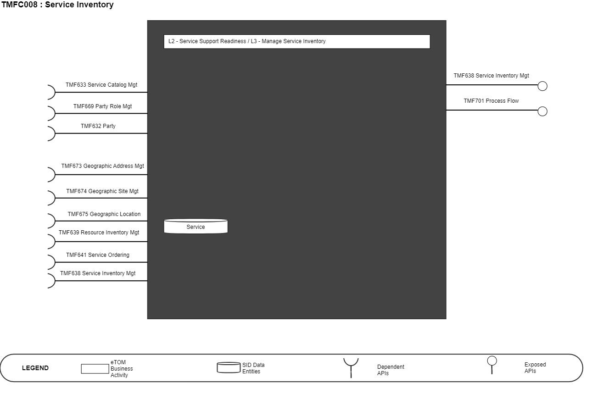
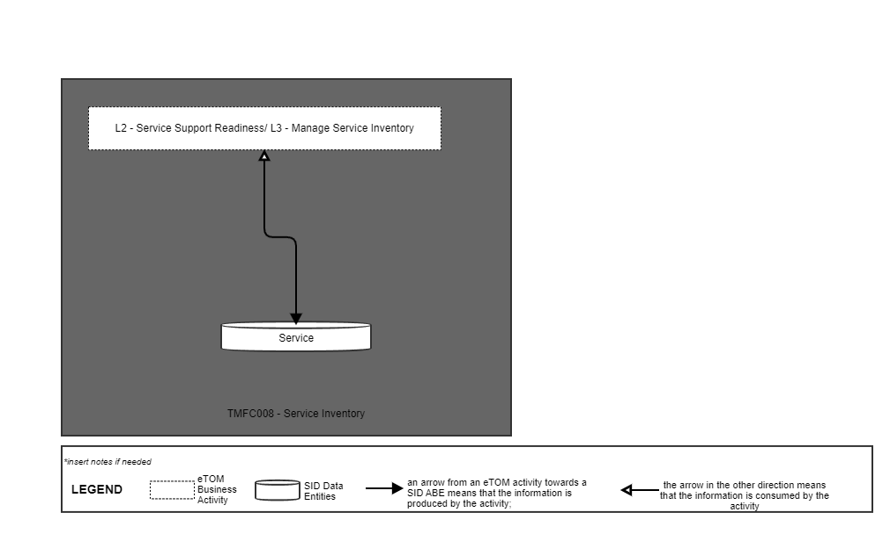
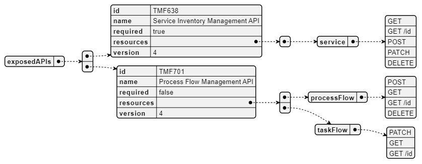
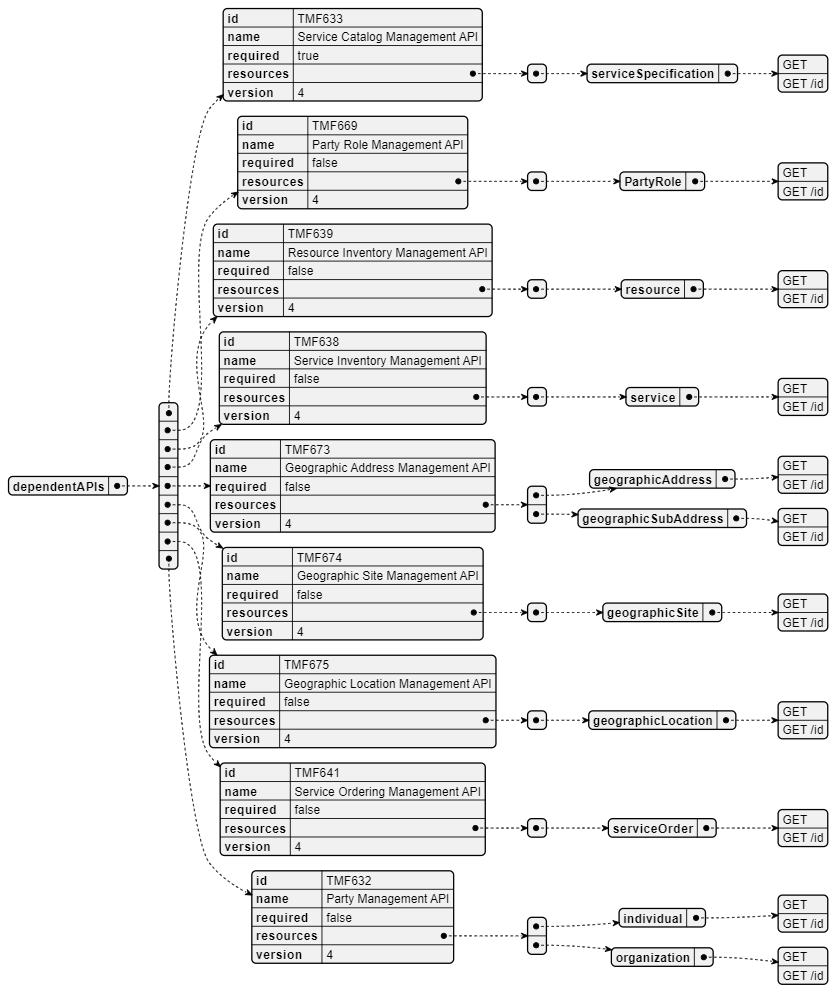
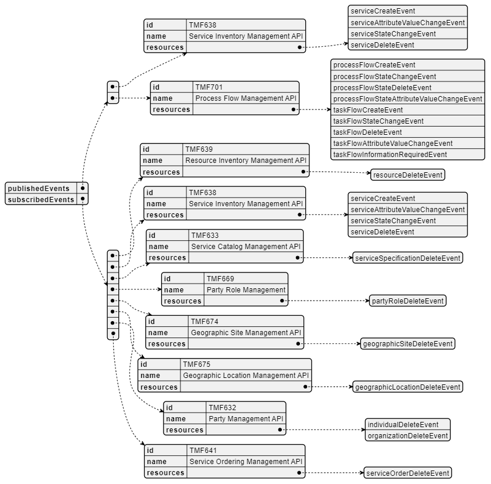

# 1. Overview

| Component Name | ID | Description | ODA Function Block |
| --- | --- | --- | --- |
| Service Inventory | TMFC008 | The Service Inventory component is responsible for storage and exposure of CFS (Customer Facing Services) that are associated to Product Inventory items. It is also responsible for RFS (Resource Facing Service) definition, mapping between CFS and RFS and mapping with infrastructure/network resources. The Service Inventory component has functionality that enables creation of inventory items, inventory organization, inventory search or filter, inventory monitoring and tracking, inventory control and inventory auditing. The minimum check to be performed at inventory item creation or update is for global consistency with related Service Catalog information. | Production |

*([PlantUML source](media/service-inventory-architecture.puml))*

# 2. eTOM Processes SID

Data Entities and Functional Framework Functions

## 2.1. eTOM business activities

eTOM business activities this ODA Component is responsible for:

| Identifier | Level | Business Activity Name | Description |
| --- | --- | --- | --- |
| 1.4.4 | L2 | Service Support Readiness | Manage service infrastructure, ensuring that the appropriate service capacity is available and ready to support the SM&O Fulfillment, Assurance and Billing processes |
| 1.4.4.1 | L3 | Manage Service Inventory | Establish, manage, and administer the enterprise's service inventory, as embodied in the Service Inventory Database, and monitor and report on the usage and access to the service inventory, and the quality of the data maintained in it. |

## 2.2. SID ABEs

SID ABEs this ODA Component is responsible for:

| SID ABE Level 1 | SID ABE Level 2 (or set of BEs) |
| --- | --- |
| Service ABE |   |

## 2.3. eTOM L2 - SID ABEs links

*([PlantUML source](media/etom-sid-service-links.puml))*

## 2.4. Functional Framework Functions

| Function ID | Function Name | Function Description | Aggregate Functions Level 1 | Aggregate Functions Level 2 |
| --- | --- | --- | --- | --- |
| 576 | Service Data Retrieval | Service Data Retrieval provides retrieval of appropriate inventory data for example in the context of service end to end testing. | Service Management | Service Repository Management |
| 593 | ServiceInventory Repository Updating | ServiceInventory Repository Updating updates information in the service inventory according to the configuration of specific services | Service Management | ServiceInventory Repository Management |
| 628 | Service to Resource Relationship Management | Service to Resource Relationship Management provides Creation, Update and Deletion of the relations of stand-alone physical or logical resources whose assignment is critical to service's fulfillment, and whose tracking is critical to service operations, assurance, and billing, as well as, resources, which represent a larger resource structure supporting the service, often referred to as an Access Point. | Service Management | ServiceInventory Repository Management |
| 629 | Service to Resource Relationship Synchronization | Service to Resource Relationship Synchronization function entails reconciliation of the data in a Service Inventory Management system with inventory discovered from other sources and synchronizes mismatched service inventory records. | Service Management | ServiceInventory Repository Management |
| 630 | Service- Resource Relationship Management Notifications | Service-Resource Relationship Management Notifications; Notification of Service-Resource Relationship Management actions to relevant stakeholders | Service Management | Service Reporting Service Repository Management |
| 964 | Onboarded Service Integration Configuration | Onboarded Service Integration Configuration function will configure the on boarded service and the relevant systems to establish integration automatically, when requested. There are several system services in the infrastructure that needs to be aware and integrated with the new service. | Service Management | Service Repository Management |
| 965 | Service Instance Lifecycle Management | Service Instance Lifecycle Management function will control the starting of new instances and closing of instances of a service as well as other activity states of the service instances. Software based Services’ performance and availability may be controlled by managing multiple instances of the service with multiple states of activity. | Service Management | ServiceInventory Repository Management |
| 1344 | Service Topology Discovery | Service Topology Discovery function provides the required capability to discover how resources (e.g. network) are related to each other in providing a service. | Service Management | Service Repository Management |

# 3. TMF OPEN APIs & Events

The following part covers the APIs and Events; This part is split in 3: • List of Exposed APIs - This is the list of APIs available from this component. • List of Dependent APIs - In order to satisfy the provided API, the component could require the usage of this set of required APIs. • List of Events (generated & consumed ) - The events which the component may generate are listed in this section along with a list of the events which it may consume. Since there is a possibility of multiple sources and receivers for each defined event.

## 3.1. Exposed APIs

The following diagram illustrates API/Resource/Operation:

*([PlantUML source](media/exposed-apis-structure.puml))*

| API ID | API Name | API Version | Mandatory / Optional | Resource | Operations |
| --- | --- | --- | --- | --- | --- |
| TMF638 | Service Inventory Management | 4 | Mandatory | service | Get Get /ID POST PATCH DELETE |
| TMF701 | Process Flow | 4 | Optional | processFlow | Get Get /ID POST DELETE |
|   |   |   |   | taskFlow | Get Get /ID PATCH |
| TMF688 | Event | 4 | Optional | listener | POST |
|   |   | 4 |   | hub | POST DELETE |

## 3.2. Dependant APIs

The following diagram illustrates API/Resource/Operation:

*([PlantUML source](media/dependent-apis-structure.puml))*

| API ID | API Name | API Version | Mandatory / Optional | Resources | Operations |
| --- | --- | --- | --- | --- | --- |
| TMF639 | Resource Inventory Management | 4 | Optional | resource | Get Get /ID |
| TMF669 | Party Role Management | 4 | Optional | partyRole | Get Get /ID |
| TMF632 | Party Management | 4 | Optional | induvidual / organization | Get Get /ID |
| TMF672 | User Roles Permission | 4 | Optional | permission | Get Get /ID |
| TMF673 | Geographic Address Management | 4 | Optional | geographicAddress | Get Get /ID |
|   |   |   |   | geographicSubAddress | Get Get /ID |
| TMF674 | Geographic Site Management | 4 | Optional | geographicSite | Get Get /ID |
| TMF675 | Geographic Location | 4 | Optional | geographicLocation | Get Get /ID |
| TMF633 | Service Catalog Management | 4 | Mandatory | serviceSpecification | Get Get /ID |
| TMF641 | Service Ordering | 4 | Optional | serviceOrder | Get Get /ID |
| TMF638 | Service Inventory Management | 4 | Optional | service | Get Get /ID, Post, Patch, Delete |
| TMF688 | Event | 4 | Optional | event | Get Get /ID, Post |

## 3.3. Events

The following diagram illustrates the Events which the component may publish and the Events that the component may subscribe to and then may receive. Both lists are derived from the APIs listed in the preceding sections.

*([PlantUML source](media/events-structure.puml))*

# 4. Machine Readable

Component Specification Refer to the ODA Component Map on the TM Forum website for the machine- readable component specification files for this component.
