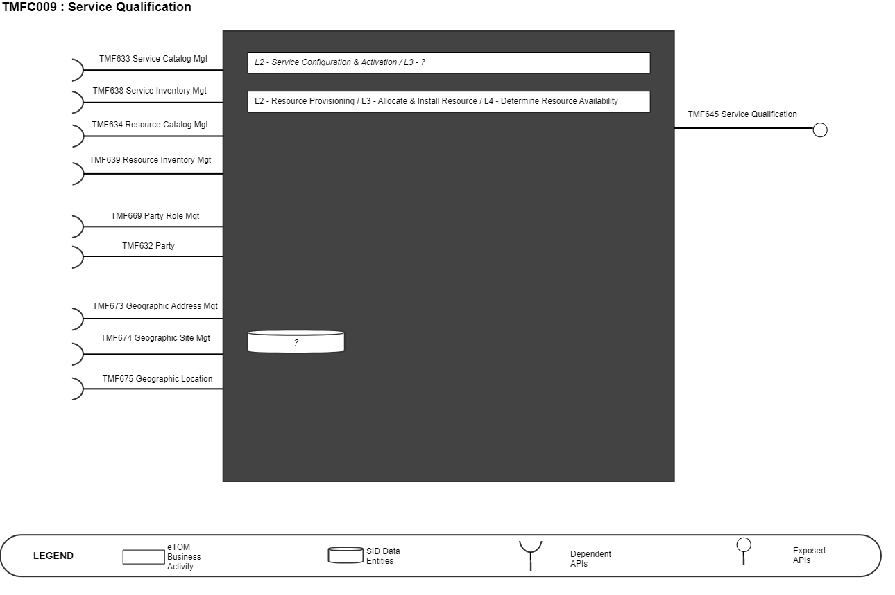
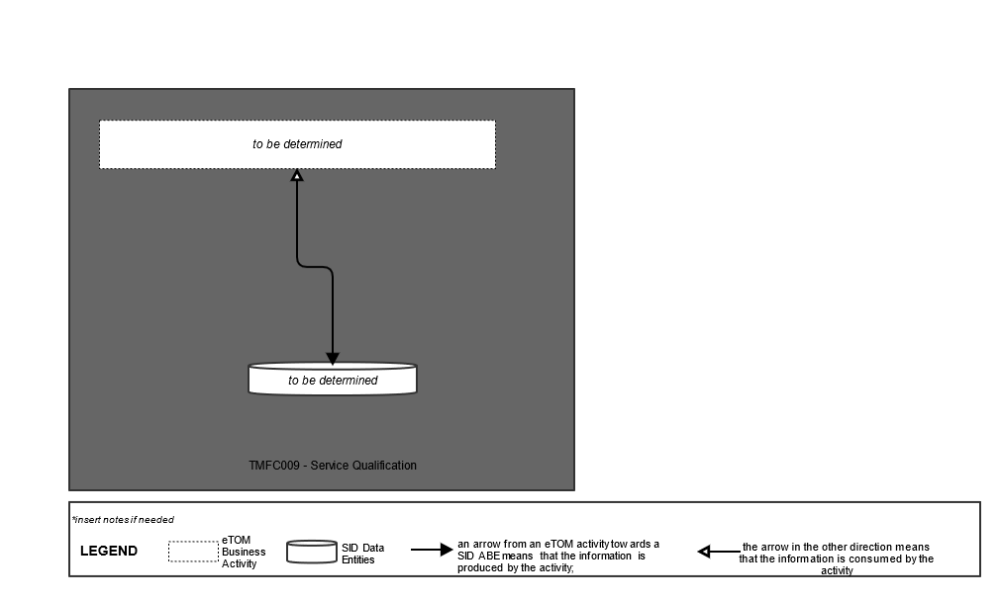
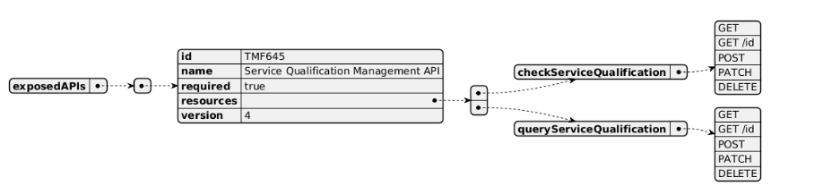
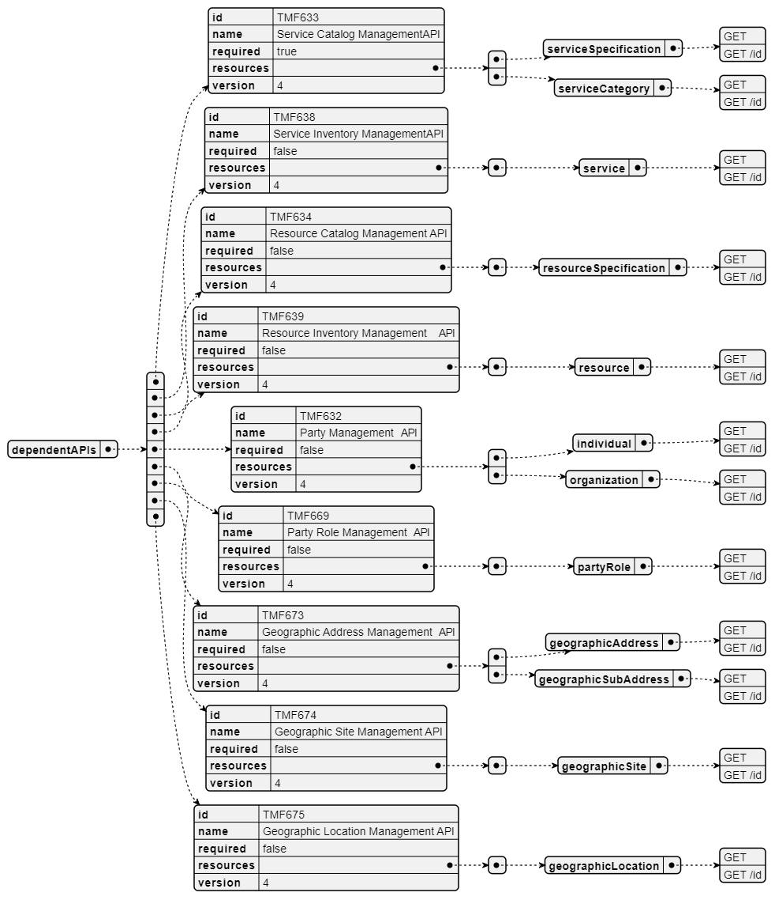
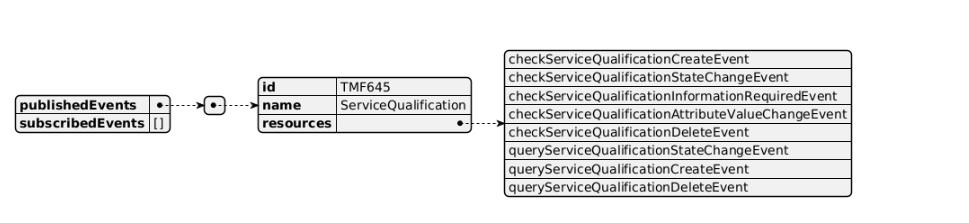

# 1. Overview

| Component Name | ID | Description | ODA Function Block |
| --- | --- | --- | --- |
| Service Qualification | TMFC009 | Service Qualification component is responsible for checking and validating the availability of a service according to specified and configured business rules. It must identify at least one technical solution (RFSspec) available to deliver the service (CFSspec) and check the availability of all the resources types involved in this technical solution. No resources are allocated during Service Qualification. Service Qualification component has functionality that include checking service feasibility status and publishing or reporting service qualification result, but also calculated service delivery due date and identified need of an appointment at the customer site. Service Qualification can also be in charge of the cost calculation of the technical solution identified, when it cannot be determined at catalog design time (complex B2B services). This information will be used as an input to price calculation. | Production |

*([PlantUML source](media/service-qualification-architecture.puml))*

# 2. eTOM Processes, SID Data Entities and

Functional Framework Functions

## 2.1. eTOM business activities

eTOM business activities this ODA Component is responsible for:

| Identifier | Level | Business Activity Name | Description |
| --- | --- | --- | --- |
| 1.4.5 | L2 | Service Configuration & Activation | Service Configuration & Activation processes encompass allocation, implementation, configuration, activation and testing of specific services to meet customer requirements, or in response to requests from other processes to alleviate specific service capacity shortfalls, availability concerns or failure conditions. Where included in the service provider offering, these processes extend to cover customer premises equipment. Responsibilities of the Service Configuration & Activation processes include, but are not limited to: • Verifying whether specific service designs sought by customers are feasible as part of pre- order feasibility checks; • Allocating the appropriate specific service parameters to support service orders or requests from other processes; • Reserving specific service parameters (if required by the business rules) for a given period of time until the initiating customer order is confirmed, or until the reservation period expires (if applicable); • Implementing, configuring and activating specific services, as appropriate; • Testing the specific services to ensure the service is working correctly; • Recovery of specific services; • Updating of the Service Inventory Database to reflect that the specific service has been allocated, modified or recovered; • Assigning and tracking service provisioning activities; • Managing service provisioning jeopardy conditions • Reporting progress on service orders to other processes. |
| ? | ? | ? | no L3 to cover standard availability/feasibility checks |

Note: refer to JIRA section and the need to identify a new Service Availability Check/Assessment activity at Service level, as part of L2 Service Configuration & Activation Note: previously identified processes at Resource level didn't exist anymore in eTOM 23.5 and no equivalent has been found. A new Jira ticket is created.

## 2.2. SID ABEs

SID ABEs this ODA Component is responsible for:

Note: refer to JIRA section and the need to create a Service Qualification BE.

## 2.3. eTOM L2 - SID ABEs links

*([PlantUML source](media/etom-sid-service-qualification-links.puml))*

## 2.4. Functional Framework Functions

Note: refer to JIRA section for improvement in classification and new function required.

| Function ID | Function Name | Function Description | Aggregate Functions Level 1 | Aggregate Functions Level 2 |
| --- | --- | --- | --- | --- |
| 319 | Service Feasibility Checking | Service Feasibility Checking provides checking based on the customer service location, service feasibility checks are done to assure the offering can actually be provided to the customer. This implies that the customer location is clearly established. Service feasibility checks are conducted via contract with the Service Order Management function. | Service Order Management | Service Availability |
| 586 | Service Availability Validation | Service Availability Validation function validates that the service or services specified on the service order are available at the specified customer/service location and feasible from a network point of view. | Service Order Management | Service Availability |
| 571 | Service Delivery Due Date Calculation | Service Delivery Due Date Calculation functions calculates the service delivery due date using network capacity, access provider selection and work center intelligence (including workload and capacity). | Service Order Management | Service Order Initialization |

# 3. TM Forum Open APIs & Events

The following part covers the APIs and Events; This part is split in 3: • List of Exposed APIs - This is the list of APIs available from this component. • List of Dependent APIs - In order to satisfy the provided API, the component could require the usage of this set of required APIs. • List of Events (generated & consumed ) - The events which the component may generate are listed in this section along with a list of the events which it may consume. Since there is a possibility of multiple sources and receivers for each defined event.

## 3.1. Exposed APIs

The following diagram illustrates API/Resource/Operation:

*([PlantUML source](media/exposed-apis-structure.puml))*

| API ID | API Name | API Version | Mandatory / Optional | Operations |
| --- | --- | --- | --- | --- |
| TMF645 | TMF645 Service Qualification Management | 4 | Mandatory | checkServiceQualification • GET • GET /ID • POST • PATCH • DELETE |
| TMF645 | TMF645 Service Qualification Management | 4 | Mandatory | queryServiceQualification • GET • GET /ID • POST • PATCH • DELETE |

## 3.2. Dependent APIs

The following diagram illustrates API/Resource/Operation:

*([PlantUML source](media/dependent-apis-structure.puml))*

| API ID | API Name | API version | Mandatory / Optional | Operations |
| --- | --- | --- | --- | --- |
| TMF639 | Resource Inventory Management | 4 | Optional | resource • GET • GET/id |
| TMF669 | Party Role Management | 4 | Optional | partyRole • GET • GET/id |
| TMF632 | Party | 4 | Optional | individual/organization • GET • GET/id |
| TMF672 | User Roles And Permissions | 4 | Optional | permission • GET • GET/id |
| TMF673 | Geographic Address Management | 4 | Optional | geographicAddress • GET • GET/id |
| TMF673 | Geographic Address Management | 4 | Optional | geographicSubAddress • GET • GET/id |
| TMF674 | Geographic Site Management | 4 | Optional | geographicSite • GET • GET/id |
| TMF675 | Geographic Location | 4 | Optional | geographicLocation • GET • GET/id |
| TMF633 | Service Catalog Management | 4 | Mandatory | serviceSpec • GET • GET/id |
| TMF633 | Service Catalog Management | 4 | Mandatory | serviceCategory • GET • GET/id |
| TMF638 | Service Inventory Management | 4 | Optional | service • GET • GET/id |
| TMF688 | Event Management | 4 | Optional | event • GET • GET/id |
| TMF634 | Resource Catalog management | 4 | Optional | resourceSpecification • GET • GET/id |

## 3.3. Events

The following diagram illustrates the Events which the component may publish and the Events that the component may subscribe to and then may receive. Both lists are derived from the APIs listed in the preceding sections.

*([PlantUML source](media/events-structure.puml))*

# 4. Machine Readable Component Specification

Refer to the ODA Component Map on the TM Forum website for the machine- readable component specification files for this component. TM Forum - ODA Component Directory
