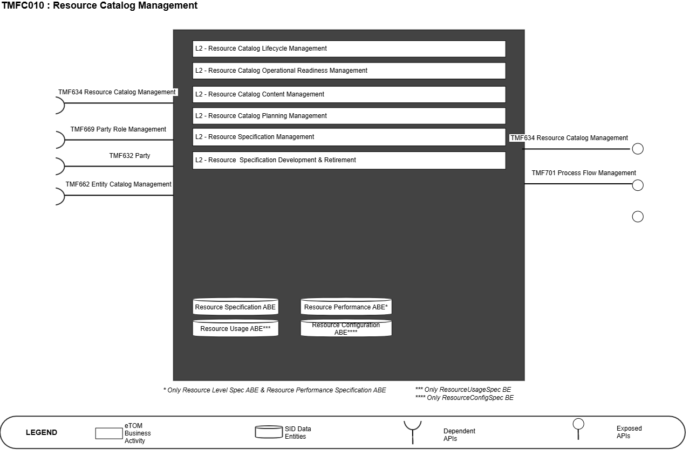
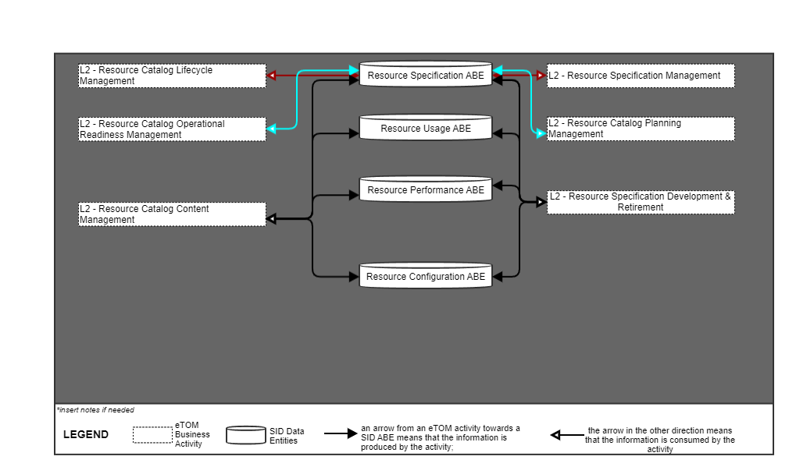
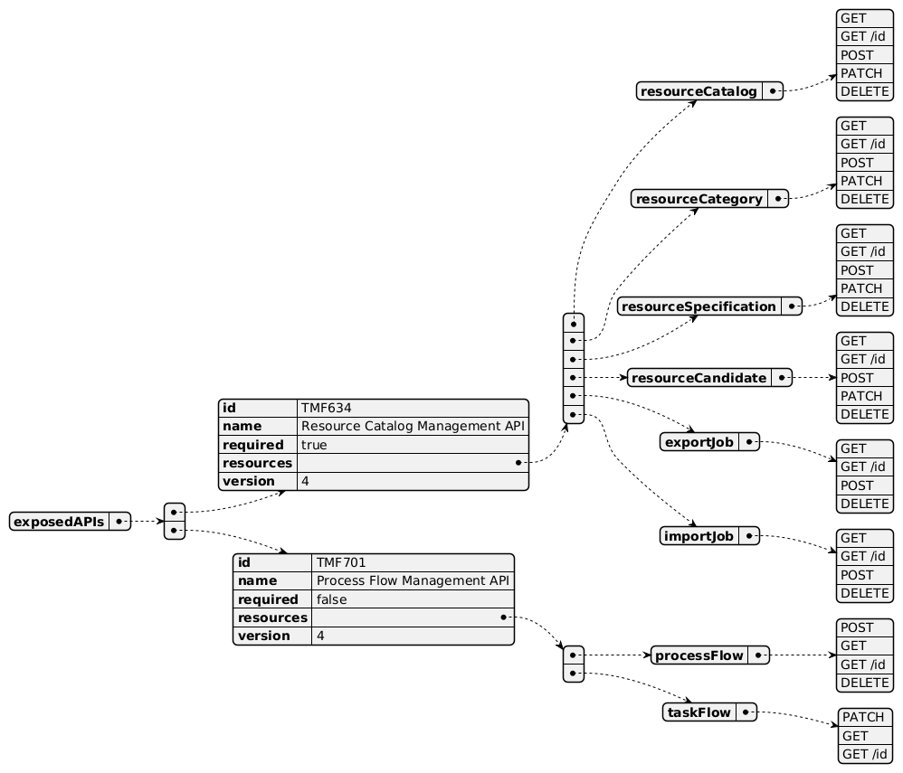
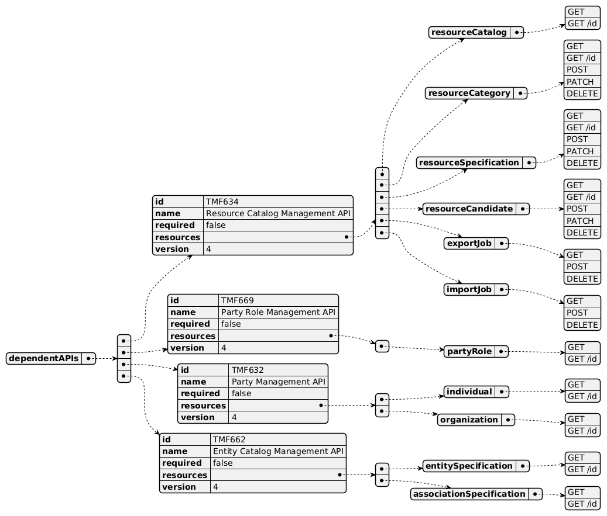
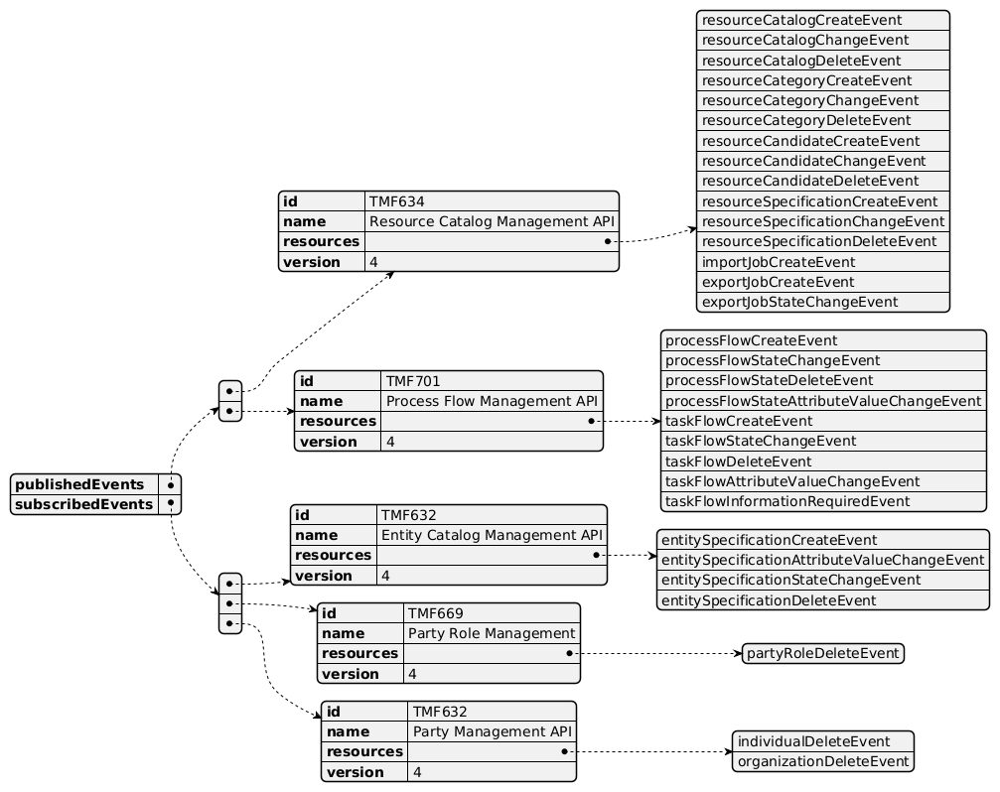

# 1. Overview

| Component Name | ID | Description | ODA Function Block |
| --- | --- | --- | --- |
| Resource Catalog Management | TMFC010 | The Resource Catalog Management component is responsible for organizing the collection of resource specifications that identify and define all requirements for a resource. The Resource Catalog Management component has the functionality that enables presentation of a customer-facing view, so users are able to browse and select resources they need, as well as a technical view to enable definition and setup of resources contained in the resource catalog. Additional functionalities include capturing new resource specifications, managing resources (registering assets and components and identifying and mapping connections / relationships), administering the lifecycle of resources, describing relationships between resources, reporting on resources and changes to their attributes, and facilitating easy access to identify and assign resources. | Production |

*([PlantUML source](media/resource-catalog-management-architecture.puml))*

# 2. eTOM Processes, SID

Data Entities and Functional Framework Functions

## 2.1. eTOM business activities

eTOM business activities this ODA Component is responsible for.

| Identifier | Level | Business Activity Name | Description |
| --- | --- | --- | --- |
| 1.5.15 | L2 | Resource Catalog Lifecycle Management | Catalog Lifecycle Management business process covers a set of business activities that enable manage the lifecycle of an organizations catalog from design to build according to defined requirements. Catalog Lifecycle Management proves the overarching governance to manage all the stages in the realization and operationalization of the Product/Service/Resource Catalog in support of the organizations business goals. |
| 1.5.16 | L2 | Resource Catalog Operational Readiness Management | Resource Catalog Operational Readiness Management business process establishes and administers the support needed to operationalize Resource catalogs for ongoing day-to-day business needs. These business activities implement the Resource Catalog through Release and Deploy business activities. |
| 1.5.17 | L2 | Resource Catalog Content Management | Resource Catalog Content Management business process define and provide the business activities that support the day-to-day operations of Resource Catalogs in order to realize the business operations goals. Resource Catalog Content Management business processes include administering the Resource Catalog instance in production, maintaining catalog entries, assuring catalogs, managing catalog access, managing entry lifecycle through versioning, handling catalog entity entry and changes, supporting distribution of catalogs as needed, and supporting user-facing activities. |
| 1.5.18 | L2 | Resource Catalog Planning Management | Resource Catalog Planning Management business process covers a set of business activities that understand and enable establish the plan to define, design and operationalize a catalog in order to meet the needs and objectives of Resource cataloging. The Resource Catalog Planning Management business process ensure that the organization is able to identify the most appropriate scheme and goal for it catalog. It includes designing the Catalog plan and developing the specification according to Resource management requirement. |
| 1.5.19 | L2 | Resource Specification Management | Resource Specification Management business process leverages captured resource requirements to develop, master, analyze, and update documented standard conditions that must be satisfied by a resource design and/or delivery. Resource Specifications Management can result in establishing in a centralized way, technical (know- how) standards. Such standards provide the organization with a means to control and approve the values and inputs of specification through structure, review, approval and distribution processes to stakeholders and suppliers. |
| 1.5.3 | L2 | Resource Specification Development & Retirement | Resource Specification Development & Retirement processes develop new, or enhance existing technologies and associated resource types, so that new Products are available to be sold to customers. They use the capability definition or requirements defined by Resource Strategy & Planning They also decide whether to acquire resources from outside, taking into account the overall business policy in that respect. These processes also retire or remove technology and associated resource types, which are no longer required by the enterprise. Resource types may be built, or in some cases leased from other parties. To ensure the most efficient and effective solution can be used, negotiations on network level agreements with other parties are paramount for both building and leasing. These processes interact strongly with Product and Engaged Party Development processes. |
| 1.5.3.4 | L3 | Develop Detailed Resource Specifications | The Develop Detailed Resource Specifications processes develop and document the detailed resource-related technical, performance and operational specifications, and manuals. These processes develop and document the required resource features, the specific technology requirements and selections, the specific operational, performance and quality requirements and support activities, any resource specific data required for the systems and network infrastructure. The Develop Detailed Resource Specifications processes provide input to these specifications. The processes ensure that all detailed specifications are produced and appropriately documented. Additionally, the processes ensure that the documentation is captured in an appropriate enterprise repository. |

## 2.2. SID ABEs

SID ABEs this ODA Component is responsible for:

| SID ABE Level 1 | SID ABE Level 2 (or set of BEs)* |
| --- | --- |
| Resource Specification ABE |   |
| Resource Performance ABE | Resource Performance Specification BE |
| Resource Usage ABE | ResourceUsageSpec BE |
| Resource Configuration ABE | ResourceConfigSpec BE |

*: if SID ABE Level 2 is not specified this means that all the L2 business entities must be implemented, else the L2 SID ABE Level is specified.

## 2.3. eTOM L2 - SID ABEs links

eTOM L2 vS SID ABEs links for this ODA Component.

*([PlantUML source](media/etom-sid-resource-catalog-links.puml))*

## 2.4. Functional Framework Functions

| Function ID | Function Name | Function Description | Aggregate Function Level 1 | Aggregate Function Level 2 |
| --- | --- | --- | --- | --- |
| 737 | Resource Capability Specification Management | This function involves the creation, editing, storage and retrieval of capability specifications. The capability specifications represent the general, common, and invariant characteristics of resource that may be realized in more than one type of specific resource. Examples of capability are Layer2, Data, radio, and Transport. | Resource Capability Management | Resource Specification Capability Development |
| 467 | Resource Data Transformation / Parsing Rules Configuration | Resource Data Transformation/Parsing Rules Configuration provides tools to set up and maintain resource data parsing rules | Resource Specification Management | Resource Specification Development |
| 951 | Resource Catalog Entities Management | Resource Catalog Entities Management identifies resource entities in a common Catalog Management from the Common Domain, or identifies a specific instance of a Catalog Management for resource entities | Resource Specification Management | Resource Specification Development |
| 996 | Resource Task Item Policy Control Configuration | Defines and configures the policies which will be implemented during the Resource task item lifecycle. | Resource Specification Management | Resource Specification Development |
| 1083 | Resource Specification Repository Management | Resource Specification Repository Management is able to create, modify and delete Resource Specification. This includes the ability to manage the state of an entity during its lifecycle (e.g. planned, deployed, in operation, replaced by locked). It includes Resource Specifications retrieval, integrity rules check and versioning management. It also provides Product Specification and Offering views adapted to the different roles. | Resource Specification Management | Resource Specification Development |
| 1088 | Resource Specification to Supplier Product Specification Relationship Design | Resource Specification to Supplier Product Specification Relationship Design identifies, when it corresponds to equipment rented to a Supplier (devices, network equipments, hardware & software, etc). | Resource Specification Management | Resource Specification Development |
| 1089 | Resource Specification Action Skill Design | Resource Specification Action Skill Design manages the links to the Skill catalog to identify for each type of resource, or of Action on a resource, which type of skill is necessary to make the intervention. | Resource Specification Management | Resource Specification Development |
| 1082 | Resource Specification Change Auditing | Resource Specification Change Auditing manages the implications of Resource Specifications changes to determine the consequences of any given change. Resource Specifications changes may impact other Resource Specifications and Resource Facing Service Specit supports The function logs Resource Specifications changes and supports the analysis of relationships between Resource Specifications. In addition, it tracks the history of changes in an easy and accessible manner. | Resource Specification Management | Resource Specification Development |
| 1064 | Logical and Software Resources Designing | Logical and Software Resources Designing supports physical, logical, and software design of resources including definition of configuration variables and initial parameters. | Resource Specification Management | Resource Specification Development |
| 1087 | Resource Specification Design | Resource Specification Design manages Resource Specifications including constraints, characteristics, and type of usages. It specifies Physical, Logical and Compound Resource Specifications. It includes resource types that as a Service Provider we don't own or commercialize (ex: mobile phones used by our customers). | Resource Specification Management | Resource Specification Development |

# 3. TM Forum Open APIs & Events

The following part covers the APIs and Events; This part is split in 3: • List of Exposed APIs - This is the list of APIs available from this component. • List of Dependent APIs - In order to satisfy the provided API, the component could require the usage of this set of required APIs. • List of Events (generated & consumed ) - The events which the component may generate is listed in this section along with a list of the events which it may consume. Since there is a possibility of multiple sources and receivers for each defined event.

## 3.1. Exposed APIs

Following diagram illustrates API/Resource/Operation:

*([PlantUML source](media/exposed-apis-structure.puml))*

| API ID | API Name | API Version | Mandatory / Optional | Operations |
| --- | --- | --- | --- | --- |
| TMF634 | Resource Catalog Management | 4 | Mandatory | resourceCatalog: POST, PATCH, GET, GET /id, DELETE resourceCategory: POST, PATCH, GET, GET /id, DELETE resourceSpecification: POST, PATCH, GET, GET /id, DELETE resourceCandidate: POST, PATCH, GET, GET /id, DELETE exportJob: POST, GET, GET /id, DELETE importJob: POST, GET, GET /id, DELETE |
| TMF701 | Process Flow Management | 4 | Optional | processFlow: POST, GET, GET /id, DELETEtaskflow: PATCH, GET, GET /id |

## 3.2. Dependent APIs

Following diagram illustrates API/Resource/Operation potentially used by the resource catalog component:

*([PlantUML source](media/dependent-apis-structure.puml))*

| API ID | API Name | API Version | Mandatory / Optional | Operations |
| --- | --- | --- | --- | --- |
| TMF634 | Resource Catalog Management | 4 | Optional | resourceCatalog: GET, GET /id resourceCategory: POST, PATCH, GET, GET /id, DELETE resourceSpecification: POST, PATCH, GET, GET /id, DELETE resourceCandidate: POST, PATCH, GET, GET /id, DELETE exportJob: POST, GET, DELETE importJob: POST, GET, DELETE |
| TMF669 | Party Role Management | 4 | Optional | partyRole: GET, GET /id |
| TMF632 | Party | 4 | Optional | individual: GET, GET /id organization: GET, GET /id |
| TMF662 | Entity Catalog Management | 4 | Optional | entitySpecification: GET, GET /id associationSpecififaction: GET, GET /id |

## 3.3. Events

The diagram illustrates the Events which the component may publish and the Events that the component may subscribe to and then may receive. Both lists are derived from the APIs listed in the preceding sections.

*([PlantUML source](media/events-structure.puml))*

# 4. Machine Readable

Component Specification Refer to the ODA Component table for the machine-readable component specification file for this component.
