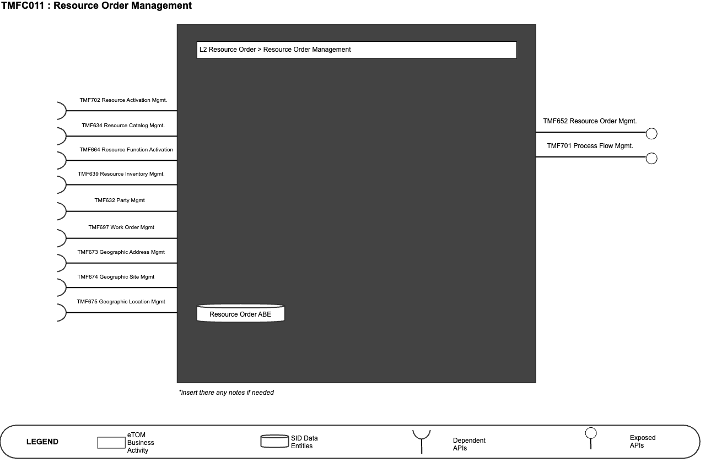
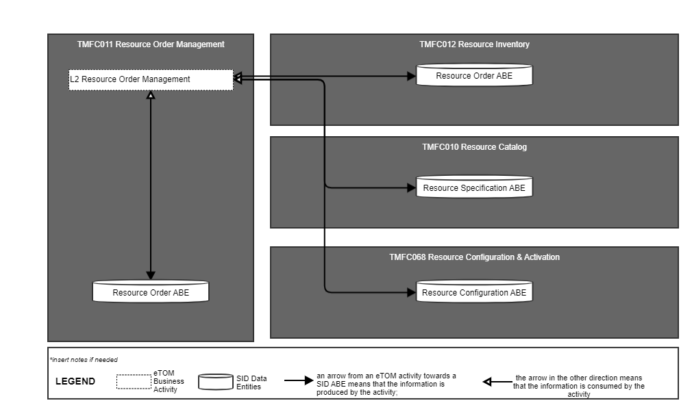
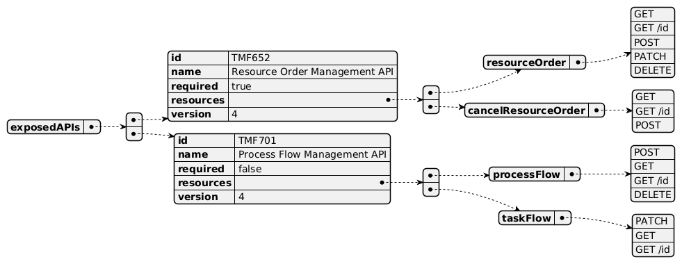
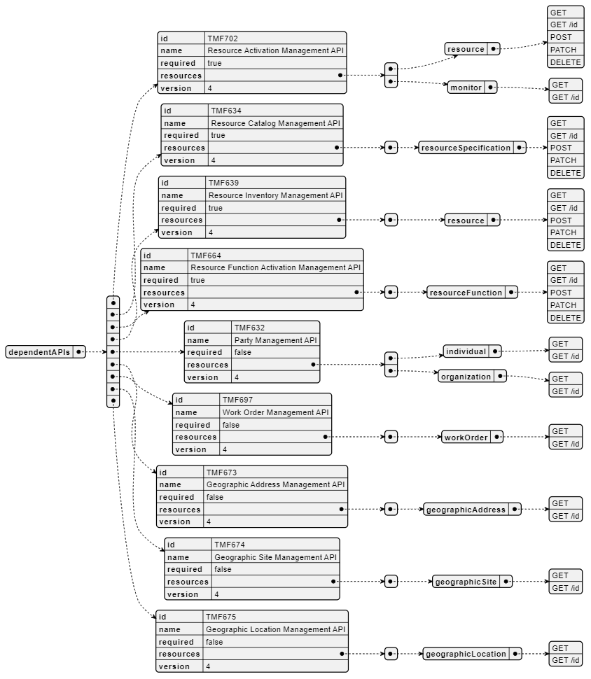
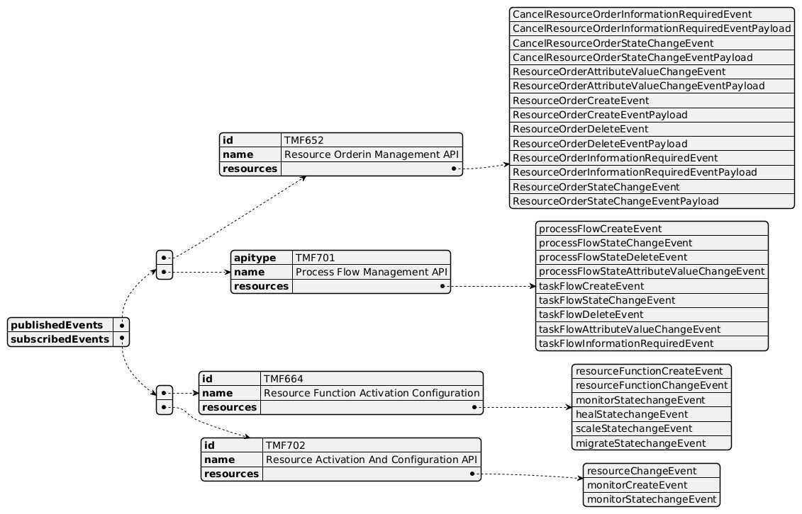

# 1. Overview

1. TAC-208 IG1171 (update) Component Definition to v4.0.0 and incorporate IG1245 Principles to Define ODA Components

# 2. [TAC-250] IG 1171 Improvements Some observations & recommendations.

- TM Forum JIRA

# 3. [TAC-214] Interface Standardization needs all 3 stages of process to be

developed - TM Forum JIRA

# 4. [TAC-226] Overview - TM Forum JIRA

# 5. ODA-846 Summary of ODA component Template enhancements for 14th

Sep Review

| Component Name | ID | Description | ODA Function Block |
| --- | --- | --- | --- |
| Resource Order Management | TMFC011 | The Resource Order Management Component manages the end-to-end lifecycle of a resource order request. This includes validating resource availability as well as the resource order request. Other functionality includes resource order assurance, resource order decomposition and resource order tracking, along with orchestrating activation and the test and turn-up processes.Component | Production |

*([PlantUML source](media/resource-order-management-architecture.puml))*

2. eTOM Processes, SID Data Entities and Functional Framework Functions

## 2.1. eTOM business activities

<Note to not be inserted onto ODA Component specifications: If a new ABE is required, but it does not yet exist in SID. Then you should include a textual description of the new ABE, and it should be clearly noted that this ABE does not yet exist. In addition a Jira epic should be raised to request the new ABE is added to SID, and the SID team should be consulted. Finally, a decision is required on the feasibility of the component without this ABE. If the ABE is critical then the component specification should not be published until the ABE issue has been resolved. Alternatively if the ABE is not critical, then the specification could continue to publication. The result of this decision should be clearly recorded.> eTOM business activities this ODA Component is responsible for.

| Identifier | Level | Business Activity Name | Description |
| --- | --- | --- | --- |
| 1.5.5 | L2 | Resource Order Management | Resource Order Management business process directs and controls ordering, scheduling, and allocation of resources (such as materials, equipment, and personnel) within the business. Resource Order Management includes managing the capture of resource orders, scheduling works to support the resource order, managing the fulfillment of resource orders, picking/packing, shipping, tracking, and closing orders. |
| 1.5.5.6 | L3 | Manage Resource Order Capture | Manage Resource Order Capture is responsible for directing and controlling the capture and collection of resource orders from internal and external customers. The business activity begins with the receipt of an order for resource(s), checks orders for completeness and accuracy, and ensures missing or incorrect information is requested from the customer. |
| 1.5.5.7 | L3 | Manage Resource Work Order | Manage Resource Order Work business activity directs and controls all work that are required to fulfill an approved resource order by ensuring the work related to the order is planned, executed and closed in a timely and efficient manner. Manage Resource Order Work business activity includes activities to "Initiate Resource Work Order", "Create Resource Work Order", "Review Resource Work Order", "Plan Resource Work Order", "Close Resource Work Order", "Analyze Resource Work Order" and "Report Resource Work Order". |
| 1.5.5.8 | L3 | Manage Resource Order Fulfilment | Manage Resource Order Fulfillment business activity directs and controls activities that ensure that resource orders are described, internally satisfied and delivered accordingly. Manage Resource Order Fulfillment business activity will coordinate with various business processes, such as inventory management, purchasing and logistics to ensure that resources are readily available and can be shipped to the customer in a timely manner. |
| 1.5.5.9 | L3 | Manage Resource Order Picking/Packing | Manage Resource Order Picking/Packing business activity directs and controls the preparation of resources for delivery to the customer. Manage Resource Order Picking/Packing business activity will select the resources from inventory, package them accordingly for delivery (based on the shipment method of the resource order), applying the right mark/label/designation. |
| 1.5.5.12 | L3 | Manage Resource Order Tracking | Manage Resource Order Tracking business activity directs and controls the monitoring of resource order status from the time the order is placed to the time is confirmed delivered Manage Resource Order Tracking business activity tracks the status of the resource order, provides updates to all related parties, and ensures that issues are escalated and managed promptly. |
| 1.5.5.13 | L3 | Manage Resource Order Closure | Manage Resource Order Closure business activity directs and controls the closure of an order and finalizing all supporting business activities. Manage Resource Order Closure business activity will support order invoicing, order payment processing, and updating the resource order status based on completion status of the order. |

## 2.2. SID ABEs

<Note not to be inserted into ODA Component specifications: If a new ABE is required, but it does not yet exist in SID. Then you should include a textual description of the new ABE, and it should be clearly noted that this ABE does not yet exist. In addition a Jira epic should be raised to request the new ABE is added to SID, and the SID team should be consulted. Finally, a decision is required on the feasibility of the component without this ABE. If the ABE is critical then the component specification should not be published until the ABE issue has been resolved. Alternatively if the ABE is not critical, then the specification could continue to publication. The result of this decision should be clearly recorded.> SID ABEs this ODA Component is responsible for:

| SID ABE Level 1 | SID ABE Level 2 (or set of BEs)* |
| --- | --- |
| Resource Order ABE | - |

*: if SID ABE Level 2 is not specified this means that all the L2 business entities must be implemented, else the L2 SID ABE Level is specified.

## 2.3. eTOM L2 - SID ABEs links

eTOM L2 vS SID ABEs links for this ODA Component.

*([PlantUML source](media/etom-sid-resource-order-links.puml))*

## 2.4. Functional Framework Functions

| Function ID | Function Name | Function Description | Sub-Domain Functions Level 1 | Sub-Domain Functions Level 2 |
| --- | --- | --- | --- | --- |
| 448 | Resource Availability Validation | Resource Availability Validation function validates that the resource or resources specified on the resource order are available at the specified customer/service location and feasible from a network point of view. This includes the following: • Resource address validation • Resource availability validation • Resource feasibility validation • Establishment of service termination points • Determination of delivery interval It includes checking appropriate network facility route(s) according to engineering rules. | ResourceOrder Management | Resource Availability Management |
| 568 | Resource Availability Checking | Resource Availability Checking determines facility and equipment availability needed for service designing/assigning. It checks appropriate network facility route(s) according to engineering rules. | ResourceOrder Management | Resource Availability Management |
| 569 | Network Facility Selection | Network Facility Selection function selects and assigns appropriate network facility route(s) and configures facility equipment per engineering rules as well as obtains new assets from network plan and build (capacity management) if required. | ResourceOrder Management | Resource Availability Management |
| 490 | Resource Order Data Collection | Resource Order Data Collection function gathers any needed resource data to aid in the verification and issuance of a complete and valid resource order. | Resource Order Management | Resource Order Completion |
| 491 | Resource Order Initiation | Resource Order Initiation function issues valid and complete resource orders, and stores the order into an appropriate data store. As part of order publication, additional data might be obtained or derived to support downstream functions that are not provided in the resource order request. | Resource Order Management | Resource Order Completion |
| 495 | Resource Order Completion | Resource Order Completion completes the resource order when all activities have been completed. | Resource Order Management | Resource Order Completion |
| 503 | Resource Order Validation | The Resource Order Validation function validates the resource order request based on contract, catalog, and provisioning rules. | Resource Order Management | Resource Order Completion |
| 452 | Resource Commissioning | Resource Commissioning supports the commissioning process of a resource and ensuring that operational status' are configured. | Resource Order Management | Resource Order Orchestration |
| 492 | Resource Order Management | This function provides workflow and orchestration capability for the Resource order fulfillment. | Resource Order Management | Resource Order Orchestration |
| 493 | Resource Order Dependency Management | Manages dependencies across resource orders by triggering and follow up as needed. | Resource Order Management | Resource Order Orchestration |
| 494 | Resource Order Jeopardy Tracking | Raises jeopardies as appropriate if specified dates and workflow milestones are not met, and escalates jeopardies to appropriate management levels. | Resource Order Management | Resource Order Orchestration |
| 529 | Tactical Resource Planning | Detailed design of resources against the existing networked resource at all technology layers, ensuring that the designed resource is actually deployed and for accurately recording the resultant inventory. | Resource Order Management | Resource Order Orchestration |
| 958 | Resource Task Decomposition | By request for an orchestration of a resource the Task Item needs to be analyzed and decomposed into the part- actions necessary to take to fulfill the requested resource orchestration. The resource task item may consist of several resource tasks and may use a number of Resources. It may also be controlled by several parameters for optional behaviors. This composition of the Resource is given by configuration data available from Catalog applications and the Resource Capability Orchestration application. | Resource Order Management | Resource Order Orchestration |
| 961 | Resource Work Item Sequence Execution | Because of the “Resource Task Item Decomposition” of an orchestration request the result may be several actions that needs to take place in a specific sequence. The “Resource Work Item Sequence Execution” function executes each individual item in sequence to fulfill, or roll back according to a pre- defined configuration, and reports the sequence carry through result. | Resource Order Management | Resource Order Orchestration |
| 496 | Resource Order Tracking | Resource Order Tracking tracks the various resource orders until completed. | Resource Order Management | Resource Order Tracking & Business Value Development |
| 497 | Resource Order Status Reporting | Resource Order Status Reporting provides status reports on the resource order. | Resource Order Management | Resource Order Tracking & Business Value Development |
| 488 | Resource Parameter Allocation | Resource Parameters Allocation allocates the right resource parameters to fulfill resource orders. | Resource Management | Resource Allocation |
| 487 | Resource Parameter Reservation | Resource Parameters Reservation reserves the right resource parameters based on resource specification and resource inventory. | Resource Management | Resource Allocation |
| 16 | Fallout Automated Correction | Fallout Automated Correction function tries to automatically fix fallouts in workflows before they go to a human for handling. This includes a Fallout Rules Engine that provides the capability to handling various errors or error types based on built rules. These rules can facilitate autocorrection, correction assistance, placement of errors in the appropriate queues for manual handling, as well as access to various systems. | Fallout Management | Fallout Correction Management |
| 17 | Fallout Correction Information Collection | Fallout Correction Information Collection collects relevant information for errors or situations that cannot be handled via Fallout Auto Correction. The intent is to reduce the time required by the technician in diagnosing and fixing the fallout. | Fallout Management | Fallout Correction Management |
| 19 | Fallout Manual Correction Queuing | Fallout Manual Correction Queuing function provides the required functionality to place error fallout into appropriate queues to be handled via various staff or workgroups assigned to handle or fix the various types of fallout that occurs during the fulfillment process. This includes the ability to create and configure queues, route errors to the appropriate queues, as well as the ability for staff to access and address the various fallout instances within the queues. | Fallout Management | Fallout Correction Management |
| 21 | Fallout Orchestration | The Fallout Orchestration function provides workflow and orchestration capability across Fallout Management. | Fallout Management | Fallout Correction Management |
| 24 | Pre-populated Fallout Information Presentation | Pre-populated Fallout Information Presentation automatically position the analyzer on appropriate screens pre-populated with information about the order(s) that's subject for fallout handling. | Fallout Management | Fallout Correction Management |
| 756 | Fallout Rule Based Error Correction | Fallout Rule Based Error Correction function provides the capability to handle various errors or error types based on pre-defined rules. These rules can facilitate autocorrection. | Fallout Management | Fallout Correction Management |
| 18 | Fallout Management to Fulfillment Application Accessing | Fallout Management to Fulfillment Application Accessing function provides a variety of tools to facilitate Fallout Management access to other applications and repositories to facilitate proper Fallout Management. This can include various general access techniques such as messaging, publish and subscribe, etc. as well as specific APIs and contracts to perform specific queries or updates to various applications or repositories within the fulfillment domain. | Fallout Management | Fallout Repository Management |
| 20 | Fallout Notification | Fallout Notification function provides the means to alert people or workgroups of some fallout situation. This can be done via a number of means, including email, paging, (Fallout management interface bus) etc. This function is done via business rules. | Fallout Management | Fallout Repository Management |
| 22 | Fallout Reporting | Fallout Reporting provides various reports regarding Fallout Management, including statistics on fallout per various times periods (per hour, week, month, etc) as well as information about specific fallout. | Fallout Management | Fallout Repository Management |
| 23 | Fallout Dashboard System Log-in Accessing | Fallout Dashboard System Log-in Accessing provides auto logon capability into various applications needed to analyze and fix fallout. | Fallout Management | Fallout Repository Management |

3. TM Forum Open APIs & Events The following part covers the APIs and Events; This part is split in 3: • List of Exposed APIs - This is the list of APIs available from this component. • List of Dependent APIs - In order to satisfy the provided API, the component could require the usage of this set of required APIs. • List of Events (generated & consumed ) - The events which the component may generate is listed in this section along with a list of the events which it may consume. Since there is a possibility of multiple sources and receivers for each defined event. <Note note to be inserted into ODA Component specifications: If a new Open API is required, but it does not yet exist. Then you should include a textual description of the new Open API, and it should be clearly noted that this Open API does not yet exist. In addition, a Jira epic should be raised to request the new Open API is added, and the Open API team should be consulted. Finally, a decision is required on the feasibility of the component without this Open API. If the Open API is critical then the component specification should not be published until the Open API issue has been resolved. Alternatively if the Open API is not critical, then the specification could continue to publication. The result of this decision should be clearly recorded.>

## 3.1. Exposed APIs

Following diagram illustrates API/Resource/Operation:

*([PlantUML source](media/exposed-apis-structure.puml))*

| API ID | API Name | Mandatory / Optional | Operations |
| --- | --- | --- | --- |
| TMF652 | TMF652 Resource Order Management | Mandatory | resourceOrder: - GET - GET /id - POST - PATCH - DELETE cancelResourceOrder: - GET - GET /id - POST |
| TMF701 | TMF701 Process Flow | Optional | processFlow: - POST - GET - GET /id - DELETE taskFlow: - PATCH - GET - GET /id |
| TMF688 | TMF688 Event | Optional |   |

## 3.2. Dependent APIs

Following diagram illustrates API/Resource/Operation potentially used by the product catalog component:

*([PlantUML source](media/dependent-apis-structure.puml))*

| API ID | API Name | Mandatory / Optional | Operations | Rationales |
| --- | --- | --- | --- | --- |
| TMF702 | Resource Activation Management API | Mandatory | resource: - GET - GET /id - POST - PATCH - DELETE monitor: - GET - GET /id | Resource order must perform resource activation / condfiguration across specified order resources. |
| TMF634 | Resource Catalog Management API | Mandatory | resourceSpecification: - GET - GET /id - POST - PATCH - DELETE | consistency checks. |
| TMF664 | Resource Function Activation Management API | Mandatory | resourceFunction: - GET - GET /id - POST - PATCH - DELETE | Resource order must perform resource activation / condfiguration across specified order resources. |
| TMF639 | Resource Inventory Management API | Mandatory | resource: - GET - GET /id - POST - PATCH - DELETE | consistency check. |
| TMF632 | Party Management API | Optional | individual: - GET - GET /id organization: - GET - GET /id | n/a |
| TMF697 | Work Order Management API | Optional | workOrder: - GET - GET /id | n/a |
| TMF673 | Geographic Address Management API | Optional | geographicAddress: - GET - GET /id | n/a |
| TMF674 | Geographic Site Management API | Optional | geographicSite: - GET - GET /id | n/a |
| TMF675 | Geographic Location Management API | Optional | geographicLocation: - GET - GET /id | n/a |
| TMF688 | TMF688 Event | Optional |   | n/a |

## 3.3. Events

The diagram illustrates the Events which the component may publish and the Events that the component may subscribe to and then may receive. Both lists are derived from the APIs listed in the preceding sections.

*([PlantUML source](media/events-structure.puml))*

4. Machine Readable Component Specification Refer to the ODA Component table for the machine-readable component specification file for this component.

5. References

## 5.1. TMF Standards related versions

| Standard | Version(s) |
| --- | --- |
| SID | 24.0 |
| eTOM | 24.0 |
| Functional Framework | 24.0 |

## 5.2. Further resources

1. IG1228: please refer to IG1228 for defined use cases with ODA components interactions.
