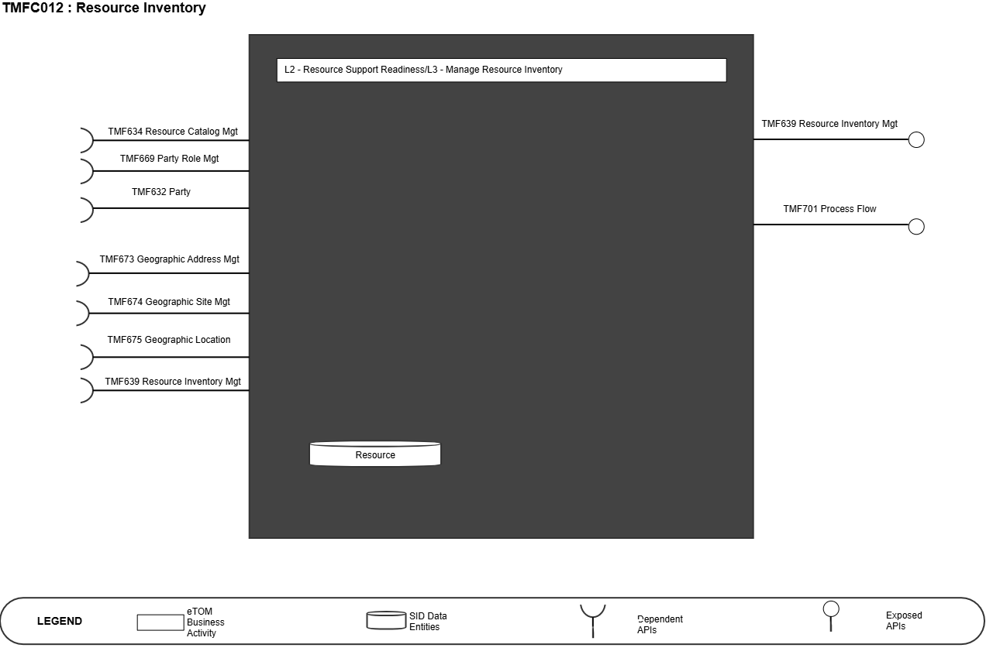
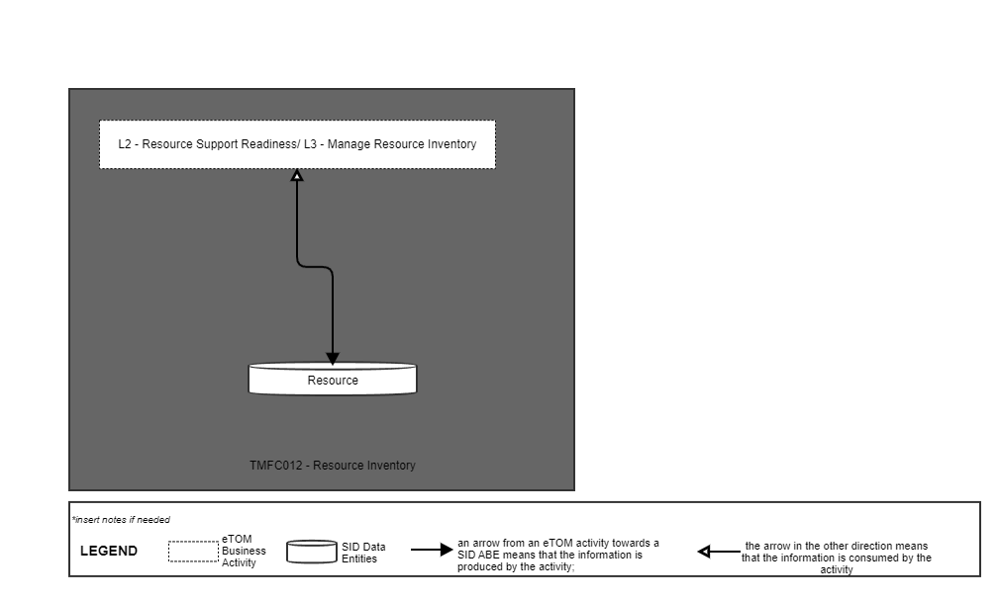
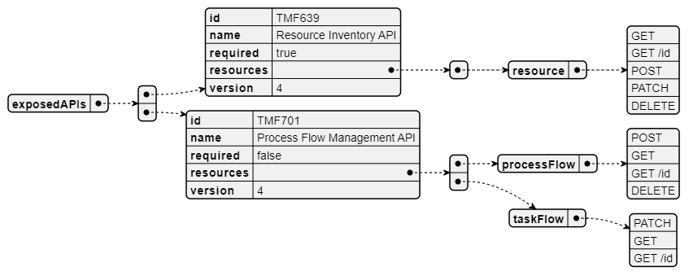
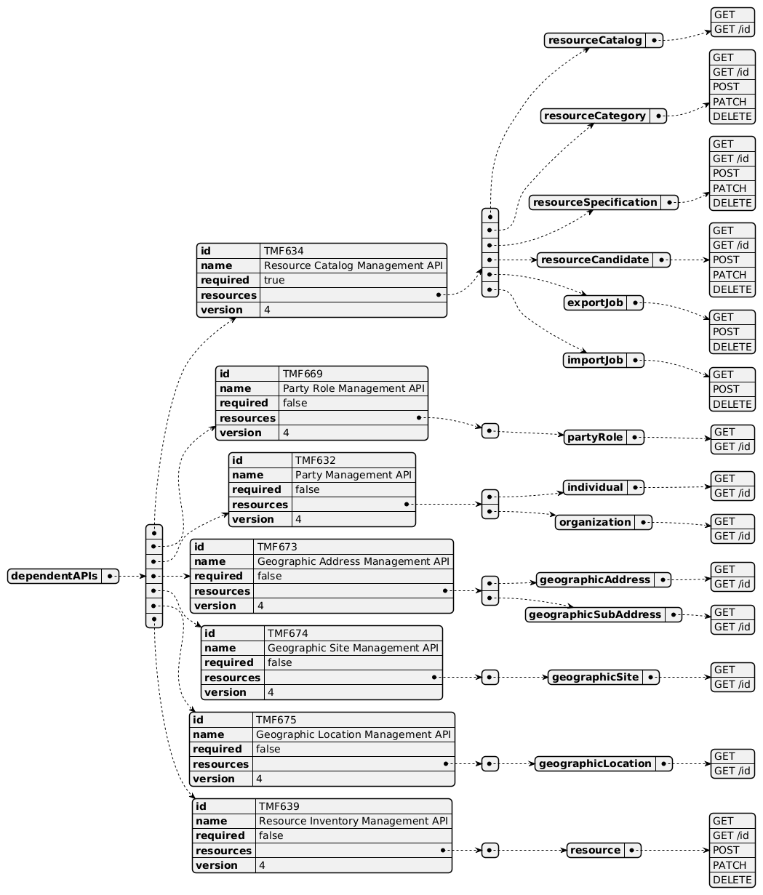
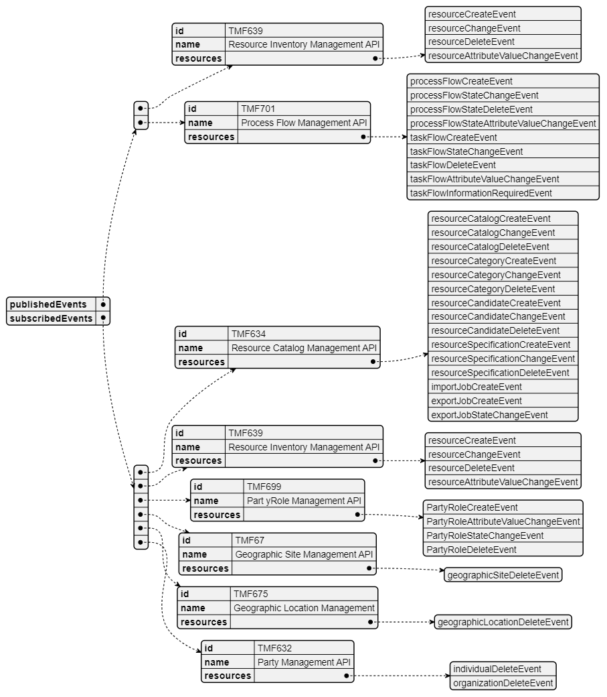

# 1. Overview

| Component Name | ID | Description | ODA Function Block |
| --- | --- | --- | --- |
| Resource Inventory | TMFC012 | The Resource Inventory component owns accounting for resources (all inputs - including stock, parts, assets, production components etc.) that are owned and/or held for allocation and/or use by the organization. The Resource Inventory component has functionality that includes inventory item creation, inventory organization, inventory search or filter, inventory monitoring and tracking, inventory control (organization, re-stock management etc.) and inventory auditing. The minimum check to be performed at inventory item creation or update is for global consistency with related Resource Catalog information. | Production |

*([PlantUML source](media/resource-inventory-architecture.puml))*

# 2. eTOM Processes and

SID Data Entities

## 2.1. eTOM business activities

eTOM business activities this ODA Component is responsible for:

| Identifier | Level | Business Activity Name | Description |
| --- | --- | --- | --- |
| 1.5.4 | L2 | Resource Support Readiness | Manage resource infrastructure to ensure that appropriate application, computing and network resources are available and ready to support the Fulfillment, Assurance and Billing processes in instantiating and managing resource instances, and for monitoring and reporting on the capabilities and costs of the individual FAB processes. |
| 1.5.4.5 | L3 | Manage Resource Inventory | Establish, manage and administer the enterprise's resource inventory, as embodied in the Resource Inventory Database, and monitor and report on the usage and access to the resource inventory, and the quality of the data maintained in it |

## 2.2. SID ABEs

SID ABEs this ODA Component is responsible for:

| SID ABE Level 1 | SID ABE Level 2 (or set of BEs) |
| --- | --- |
| Resource ABE | Logical Resource ABE, Physical Resource ABE, Compound Resource ABE |

## 2.3. eTOM L2 - SID ABEs links

*([PlantUML source](media/etom-sid-resource-links.puml))*

## 2.4. Functional Framework Functions

| Function ID | Function Name | Function Description | Aggregate Functions Level 1 | Aggregate Functions Level 2 |
| --- | --- | --- | --- | --- |
| 426 | Physical Implementation Information Capturing | Physical Implementation Information Capturing provide levels of implementation details that tactical planning does not need to specify, such as duct routes and the frame appearances of device ports. | Resource Management | Resource Repository Management |
| 442 | Network Overviews Presentation | Network Overviews Presentation provides a more generalized view of the network than found in resource management. | Resource Management | Resource Repository Management |
| 471 | Resource Repository Updating | Resource Repository Updating function entails update of the resource Repository based on a provided collection of updates. The expectation is that the Repository is updated as requested, but no other side effects are | Resource Management | Resource Repository Management |
| 453 | Resource Configuration Change Logging | Resource Configuration Change Logging - Collects and Records the history of configuration changes | Resource Management | Resource Repository Management |
| 454 | Resource Configuration Management | Resource Configuration Management provides configuration database and management of the configurations of the individual resources | Resource Management | Resource Repository Management |
| 456 | Resource Topology Verification | Resource Topology Verification work with the Inventory Management functions to ensure that the topology reflected in its database is in sync with that in the Inventory Management Systems | Resource Management | Resource Repository Management |
| 468 | Resource Information Model Creation | Resource Information Model creation function allows Service Providers to create information base in the resource inventory of the managed resources along its attributes. This function uses the standardized information model (e.g. TM Forum Information Framework) for the resources to be managed. The specific details will depend on the particular resources (e.g., particular types of managed elements and equipments) and associated technologies. | Resource Management | Resource Repository Management |
| 470 | Resource Inventory Retrieval | This function allows for client operations support (service assurance and billing systems) to retrieve part or all of the resource inventory known to the target OSS. This feature may allow the following selection criteria: • retrieval of a specified set of one or more sub-trees • exclusion or inclusion of specified object types from the selected sub-tree • further filtering based on attribute matching • retrieval of only the object instances that have been modified after a provided date and time • For the selected objects, this feature may allow the client operations support (service assurance and billing systems) to specify what specific attributes and relationships shall be returned. This (the attributes and relationships to be returned) would be the same for all objects of the same type | Resource Management | Resource Repository Management |
| 471 | Resource Inventory Updating | Resource Inventory Updating function entails update of the resource inventory based on a provided collection of updates. The expectation is that the inventory is updated as requested, but no other side effects are expected (e.g., creating a Sub Network Connection (SNC) in the network). This is a key point | Resource Management | Resource Repository Management |
| 472 | Resource Inventory Update Notification | Resource Inventory Update Notification function entails the generation of inventory update notifications based on changes to the inventory: Notifications concerning object creation, object deletion and attribute value changes to other systems. • Single Entity Notifications – in this variation of the feature, each notification pertains to only one entity, e.g., an equipment instance • Multi-entity Notifications – in this variation of the feature, a single notification may report on inventory changes for multiple entities. • Notification Suppression – in this variation of the feature, each notification pertains to only one entity. | Resource Management | Resource Repository Management |
| 562 | Voucher Reporting | Voucher Reporting function for querying and reporting of voucher related data | Resource Management | Resource Repository Management |
| 564 | Voucher Life Cycle Management | Voucher Life Cycle Management including activation, locking, expiration and maintenance of purchased vouchers. | Resource Management | Resource Repository Management |
| 738 | Resource Data Inventory Synchronization | Resource Data Inventory Synchronization is the function that ensure OSS Inventory data generated in | Resource Management | Resource Repository Management |
| 436 | Number Aging | Manages the aging of numbers before they can be re-assigned. | Resource Management | Regulated Logical Resources Management |
| 437 | Number Assigning | Number Assigning manages the assignment of numbers for usage. | Resource Management | Regulated Logical Resources Management |
| 439 | Number Searching | Number Searching provides the means to search the number inventory. | Resource Management | Regulated Logical Resources Management |
| 440 | Number Tracking and Reporting | Provides functionality to track numbers and perform number reporting. | Resource Management | Regulated Logical Resources Management |
| 743 | Number Portability Orchestration | Number Portability Orchestration is a communication mechanism that ensures the Resource Number orders activation according to a criteria set, allowing in this way the correct execution of orders. | Resource Management | Regulated Logical Resources Management |
| 744 | Number Portability Risk & Effectiveness Management | Number Portability Risk & Effectiveness Management for determine of threats, risks and control of fulfillment, in order to comply with the execution of all Resource Number Portability orders. | Resource Management | Regulated Logical Resources Management |
| 745 | Number Portability Validation | Number Portability Validation can perform calculations that determine whether the information received is reliable, safe and contains the minimum information required during implementation, enabling with this the Resource Number Portability orders rejection for those who do | Resource Management | Regulated Logical Resources Management |
| 1062 | Number Acquisition | Number Acquisition manages the capturing of numbers for the number inventory. | Resource Management | Regulated Logical Resources Management |
| 1249 | Number Porting | Number Porting implements the changes to transfer the management of a number from one Service Provider to another, and on request provides status on the implementation of the changes. | Resource Management | Regulated Logical Resources Management |
| 438 | Number Reservation | Provides the functionality to manage the reservation of numbers. | Resource Management | Regulated Logical Resources Management |
| 435 | Number Inventory Establishing | Number Inventory Establishing manages the establishment of a number inventory. | Resource Management | Regulated Logical Resources Management |

# 3. TM Forum Open APIs & Events

The following part covers the APIs and Events; This part is split in 3: • List of Exposed APIs - This is the list of APIs available from this component. • List of Dependent APIs - In order to satisfy the provided API, the component could require the usage of this set of required APIs. • List of Events (generated & consumed ) - The events which the component may generate are listed in this section along with a list of the events which it may consume. Since there is a possibility of multiple sources and receivers for each defined event.

## 3.1. Exposed APIs

The following diagram illustrates API/Resource/Operation:

*([PlantUML source](media/exposed-apis-structure.puml))*

| API ID | API Name | API Version | Mandatory / Optional | Resource | Operation |
| --- | --- | --- | --- | --- | --- |
| TMF639 | TMF639 Resource Inventory | 4 | Mandatory | resource | GET GET /ID POST PATCH DELETE |
| TMF688 | TMF688 Event | 4 | Optional | listener | POST |
|   |   |   |   | hub | POST |
| TMF701 | TMF701 Process Flow | 4 | Optional | processFlow | GET GET /ID POST DELETE |
|   |   |   |   | taskFlow | GET GET /ID PATCH |

## 3.2. Dependant APIs

The following diagram illustrates API/Resource/Operation potentially used by the resource inventory component:

*([PlantUML source](media/dependent-apis-structure.puml))*

| API ID | API Name | API Version | Mandatory / Optional | Resource | Operations | Rationales |
| --- | --- | --- | --- | --- | --- | --- |
| TMF634 | Resource Catalog Management | 4.1 | Mandatory | resourceSpecific ation | Get get /ID | Consistency check. |
| TMF669 | Party Role Management | 4 | Optional | partyRole | Get get /ID |   |
| TMF632 | Party Management | 4 | Optional | induvidual / organization | Get get /ID |   |
| TMF673 | Geographic Ad dress Management | 4 | Optional | geographicAddre ss | Get |   |
|   |   |   |   | geographicSubAd dress | Get get /ID |   |
| TMF674 | Geographic Site Management | 4 | Optional | geographicSite | Get get /ID |   |
| TMF675 | Geographic Location | 4 | Optional | geographicLocati on | Get get /ID |   |
| TMF672 | User Roles And Permissions | 4 | Optional | permission | Get get /ID |   |
| TMF639 | Resource Inventory Management | 4 | Optional | resource | Get get /ID Post, Patch Delete |   |
| TMF688 | Event | 4 | Optional | event | Get, Post |   |

## 3.3. Events

The following diagram illustrates the Events which the component may publish and the Events that the component may subscribe to and then may receive. Both lists are derived from the APIs listed in the preceding sections.

*([PlantUML source](media/events-structure.puml))*

# 4. Machine Readable

Component Specification Refer to the ODA Component Map on the TM Forum website for the machine- readable component specification files for this component.
