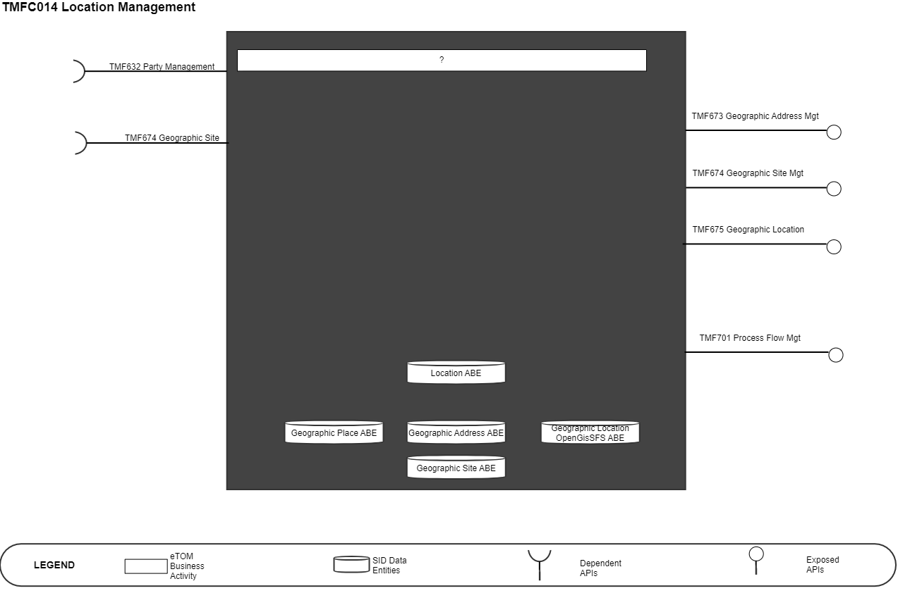
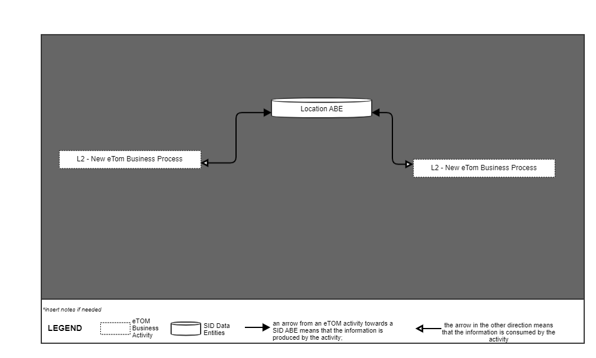
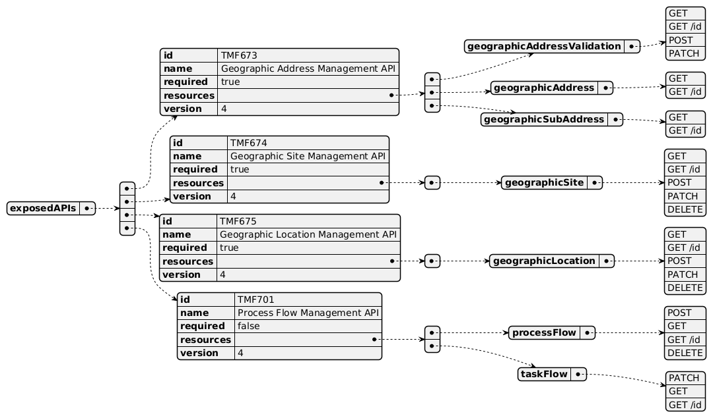
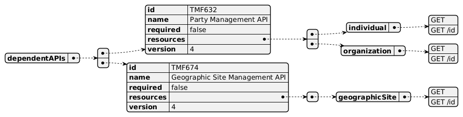
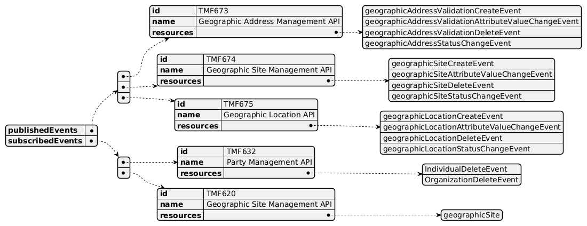

# 1. Overview

| Component Name | ID | Description | ODA Function Block |
| --- | --- | --- | --- |
| Location Management | TMFC014 | The Location Management Component allows easy reference to geographic places important to other entities, where a geographic place is an entity that can answer the question “where?” . This component could be a facade tool into GIS systems (e.g. Google Maps) Also covers the operations to manage (create, read, delete) geographic sites that can be associated with a customer, account, service delivery or other entities. And finally gives the capabilities to retrieve /list /validate addresses that are named as structured textual ways of describing how to find a Property in an urban area (country properties are often defined differently). It allows looking data for worldwide addresses through popular GIS systems like Google Maps or government master addresses systems. It can also be used to validate geographic data, to be sure that it corresponds to a real geographic address. Finally, it can be used to look for an address by: searching an area as a start (city, town ), then zooming on the streets of this area, and finally listing all the street segments (numbers) in a street. | Production Domain |

*([PlantUML source](media/location-management-architecture.puml))*

# 2. eTOM Processes, SID Data Entities and

Functional Framework Functions

## 2.1. eTOM business activities

eTOM business activities this ODA Component is responsible for:.

Note: as no eTOM business activity is currently responsible for Location Management, refer to JIRA paragraph.

## 2.2. SID ABEs

SID ABEs this ODA Component is responsible for:

| SID ABE Level 1 | SID ABE Level 2 (or set of BEs)* |
| --- | --- |
| Location ABE | Geographic Place ABE |
|   | Geographic Location ABE |
|   | Geographic Address ABE |
|   | Geographic Site ABE |
|   | Local Place ABE |

*: if SID ABE Level 2 is not specified this means that all the L2 business entities must be implemented, else the L2 SID ABE Level is specified.

## 2.3. eTOM L2 - SID ABEs links

eTOM L2 vS SID ABEs links for this ODA Component.

*([PlantUML source](media/etom-sid-location-links.puml))*

## 2.4. Functional Framework Functions

| Function | Description | ID | Domain | Aggregate Function Level 1 | Aggregate Function Level 2 |
| --- | --- | --- | --- | --- | --- |
| Location Change History Management | Location Change History Management; Tracks all changes of location data, making available attributes according their historical values in certain periods. | 429 | Operations Readiness & Support | Resource Management | Location Management |
| Pre-formatted Location Information Presentation | Pre-formatted Location Information Presentation generates different views for different business cases (e.g. different format of address strings) | 430 | Operations Readiness & Support | Resource Management | Location Management |
| Location Information Updating | Location Information Updating provides means to update the repository with new/updated location information from external sources. | 431 | Operations Readiness & Support | Resource Management | Location Management |
| Location Information Searching | Location Information Searching provide the ability to search for a provided location/address, as part of the Location Management, including the ability to return near matches if an exact match is not found. | 432 | Operations Readiness & Support | Resource Management | Location Management |
| Location Structure Data Configuration | Location Structure Data Configuration provides facilities for creating, modifying, and deleting location structures data according to business rules of Service Providers or national and international location regulations. Also, utilities for defining sets of location attributes, levels and hierarchies should be available. | 433 | Operations Readiness & Support | Resource Management | Location Management |
| Location Data Integrity Management | Location Data Integrity Management provides ability to maintain data integrity in the whole location repository. It’s especially important if there are many external data sources that deliver new addresses for the repository. | 434 | Operations Readiness & Support | Resource Management | Location Management |

# 3. TM Forum Open APIs & Events

The following part covers the APIs and Events; This part is split in 3: • List of Exposed APIs - This is the list of APIs available from this component. At this stage we list the APIs, resource and operation we no mention to optionality (in other word no mention about mandatory VS optional resource) • List of Dependent APIs - In order to satisfy the provided API, the component could require the usage of this set of required APIs. At this stage no optionality is defined and none of this 'required' API is listed as 'mandatory' • List of Events (generated & consumed ) - The events which the component may generate is listed in this section along with a list of the events which it may consume. Since there is a possibility of multiple sources and receivers for each defined event.

## 3.1. Exposed APIs

Following diagram illustrates API/Resource/Operation:

*([PlantUML source](media/exposed-apis-structure.puml))*

| API ID | API Name | API Version | Mandatory / Optional | Operation |
| --- | --- | --- | --- | --- |
| TMF673 | TMF 673 Geographic Address Management API | 4 | Mandatory | geographicAddressValidation • GET • GET /ID • POST • PATCH |
| TMF673 | TMF 673 Geographic Address Management API | 4 | Mandatory | geographicAddress • GET • GET /ID |
| TMF673 | TMF 673 Geographic Address Management API | 4 | Mandatory | geographicSubAddress • GET • GET /ID |
| TMF674 | TMF 674 Geographic Site Management API | 4 | Mandatory | geographicSite • GET • GET /ID • POST • PATCH • DELETE |
| TMF675 | TMF675 Geographic Location | 4 | Mandatory | geographicLocation • GET • GET /ID • POST • PATCH • DELETE |
| TMF688 | TMF688 Event | 4 | Optional | listener • POST |
| TMF688 | TMF688 Event | 4 | Optional | hub • POST • DELETE |
| TMF701 | TMF701 Process Flow Management | 4 | Optional | processFlow • GET • GET /ID • POST |
| TMF701 | TMF701 Process Flow Management | 4 | Optional | taskFlow • GET /ID • PATCH |

## 3.2. Dependent APIs

Following diagram illustrates API/Resource/Operation:

*([PlantUML source](media/dependent-apis-structure.puml))*

| API ID | API Name | API Version | Mandatory / Optional | resource | Operations |
| --- | --- | --- | --- | --- | --- |
| TMF632 | TMF632 Party Management | 4 | Optional |   | Individual / organization • GET • GET/id |
| TMF674 | TMF674 Geographic Site | 4 | Optional |   | geographicSite • GET • GET/id |
| TMF688 | TMF688 Event | 4 | Optional |   | event • GET • GET/id |

## 3.3. Events

The following diagram illustrates the Events which the component may publish and the Events that the component may subscribe to and then may receive. Both lists are derived from the APIs listed in the preceding sections.

*([PlantUML source](media/events-structure.puml))*

# 4. Machine Readable Component Specification

Refer to the ODA Component Map on the TM Forum website for the machine-readable component specification files for this component. TM Forum - ODA Component Directory.
