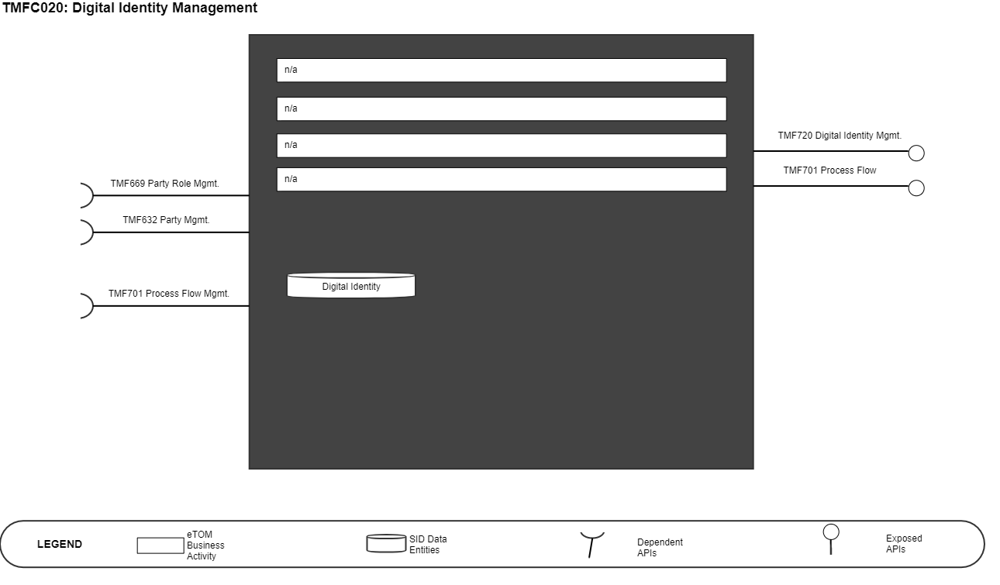
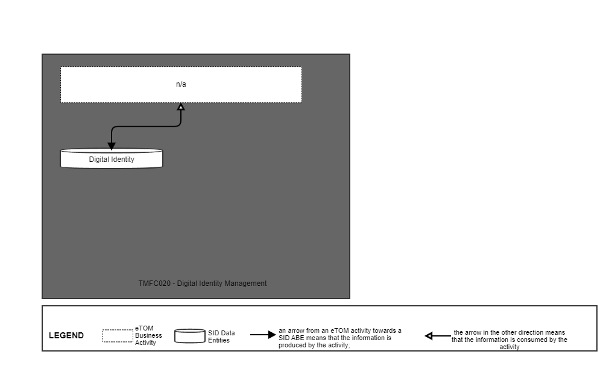
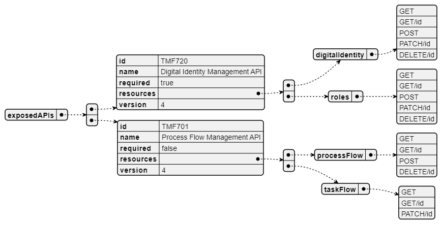
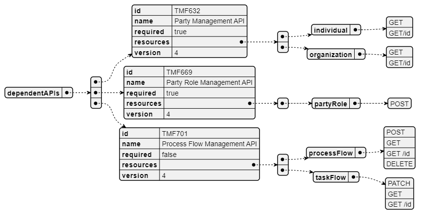
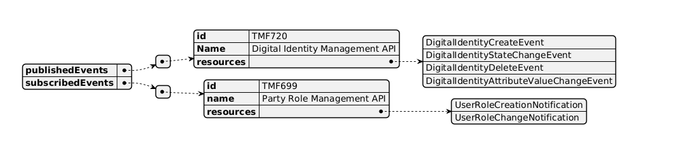

# 1. Overview

| Component Name | ID | Description | ODA Function Block |
| --- | --- | --- | --- |
| Digital Identity Management | TMFC020 | The Digital Identity Management is responsible for the parties (customers, employees, partners) and resources authentication. | Party Management |

*([PlantUML source](media/digital-identity-management-architecture.puml))*

# 2. eTOM Processes, SID Data Entities and

Functional Framework Functions

## 2.1. eTOM business activities

eTOM business activities this ODA Component is responsible for:

| Identifier | Level | Business Activity Name | Description |
| --- | --- | --- | --- |
| n/a | 2 | n/a | Note: create JIRA issue to eTOM team to have process for Digital Identity Management |

## 2.2. SID ABEs

SID ABEs this ODA Component is responsible for:

| SID ABE Level 1 | SID ABE Level 2 (or set of BEs) |
| --- | --- |
| Digital Identity | n/a |

## 2.3. eTOM L2 - SID ABEs links

*([PlantUML source](media/etom-sid-digital-identity-links.puml))*

## 2.4. Functional Framework Functions

| Function ID | Function Name | Function Description | Sub-Domain Functions Level 1 | Sub-Domain Functions Level 2 |
| --- | --- | --- | --- | --- |
| 1025 | Application Access | Application Access provide access interfaces with authentication and authorization control for the requests and responses related to the application’s functionality, including event logging and usage statistics. | Identification and Permission Management Identification and Authentication | Identification and Authentication Identification and Permissions |
| 906 | PKI and Digital Certificates Systems Integration | PKI and Digital Certificates Systems Integration provides integration to Public Key Infrastructure Systems that provides digital certificates, and the support to use public keys and digital certificates. | Identification and Permission Management Identification and Authentication | Identification and Authentication Identification and Permissions |
| 899 | Single Sign- On Access Control | Single Sign-On Access Control grant access in cooperation with central Authentication and Authorization functions to secure the most updated security. | Identification and Permission Management Identification and Authentication | Identification and Authentication Identification and Permissions |
| 897 | Building Access Control | Building Access Control checks, stops or allow physical access to facilities according to access roles and rules. | Identification and Authentication | Permission Control |
| 898 | Application Security Management | Application Security Management administrates the roles and rules that applies to getting the right to use an application. | Identification and Authentication | Permission Definition |
| 1240 | Identity Verification | Identity Verification (aka authentication) establishes that an actor (i.e., a person or a resource) is who they purport to be using one or several credentials. According to the reliability of the credentials used the authentication has a level of authentication such as a biometric credential (i.e., facial recognition or fingerprint) or multi-factor credential with a high level of authentication or a network credential with a low level of authentication. Note: each permission specifies the minimum level of authentication required. | Identification and Permission Management | Identification and Authentication |
| 1247 | Credentials Establishment | Credentials Establishment creates and/or modifies credentials and associates them with the Digital Identity that will be using them. Credentials can include username/passcode combinations, biometrics, and physical and/or logical passkeys. Note: A Digital Identity aims to enable identifying Party, Party Roles or Resource Roles. | Identification and Permission Management | Digital Identity Management |
| 1248 | Credentials Query | Credentials Query provides the ability to retrieve non- protected information about the Digital Identity of credentials or about the credentials themselves (e.g.name, photo, badge number, token ID, credentials valid dates, etc.). | Identification and Permission Management | Digital Identity Management |

# 3. TM Forum Open APIs & Events

The following part covers the APIs and Events; This part is split in 3: • List of Exposed APIs - This is the list of APIs available from this component. • List of Dependent APIs - In order to satisfy the provided API, the component could require the usage of this set of required APIs. • List of Events (generated & consumed ) - The events which the component may generate are listed in this section along with a list of the events which it may consume. Since there is a possibility of multiple sources and receivers for each defined event.

## 3.1. Exposed APIs

The following diagram illustrates API/Resource/Operation:

*([PlantUML source](media/exposed-apis-structure.puml))*

| API ID | API Name | Mandatory / Optional | Operations |
| --- | --- | --- | --- |
| TMF720 | Digital Identity | Mandatory | • GET • GET/Id • POST • PATCH/id • DELETE/id |
| TMF688 | Event Management | Optional | event • GET • GET/id |
| TMF701 | Process Flow Management | Optional | processFlow • GET • GET/id • POST • DELETE/id taskFlow: • GET • GET/id • PATCH/id |

## 3.2. Dependent APIs

Following diagram illustrates API/Resource/Operation:

*([PlantUML source](media/dependent-apis-structure.puml))*

| API ID | API Name | Mandatory / Optional | Operation |
| --- | --- | --- | --- |
| TMF632 | Party Management | Conditional Mandatory (if Party Role is not provided) | individual • GET • GET/id organization • GET • GET/id |
| TMF669 | Party Role Management | Conditional Mandatory (if Party Management is not provided) | partyRole • POST |
| TMF701 | Process Flow Management | Optional | processFlow • POST • GET • GET/id • DELETE taskFlow • PATCH • GET • GET/id |
| TMF688 | Event Management | Optional | event • GET • GET/id |

## 3.3. Events

The diagram illustrates the Events which the component may publish and the Events that the component may subscribe to and then may receive. Both lists are derived from the APIs listed in the preceding sections.

*([PlantUML source](media/events-structure.puml))*

# 4. Machine Readable Component Specification

Refer to the ODA Component table for the machine-readable component specification file for this component.
