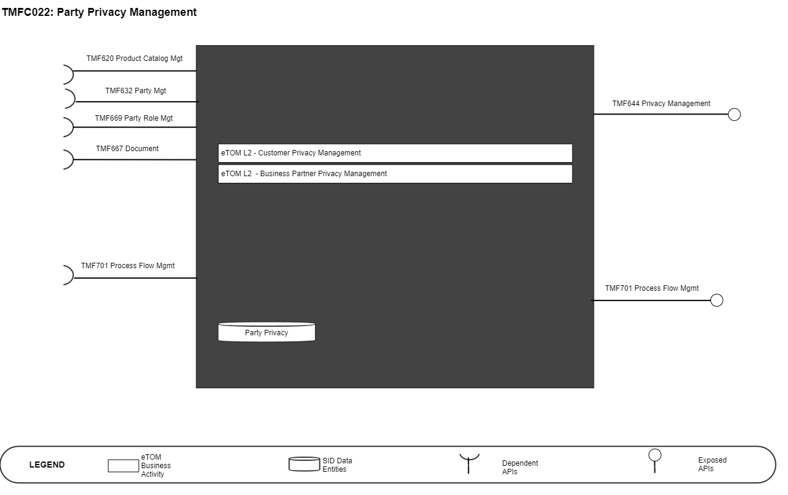
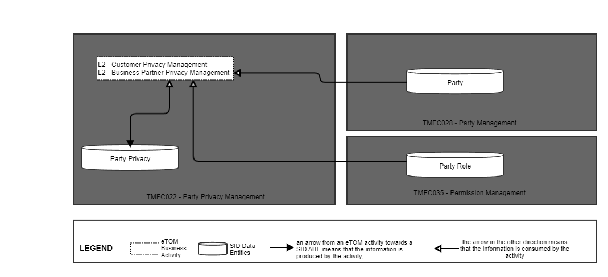
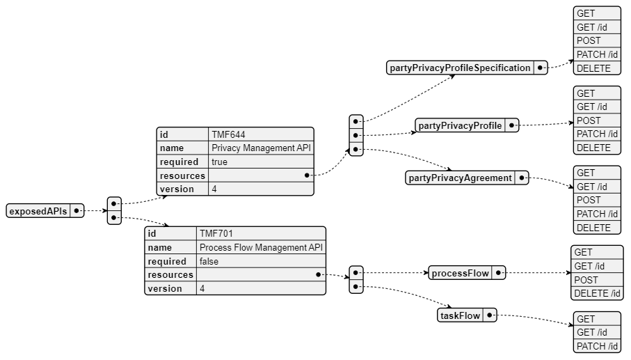
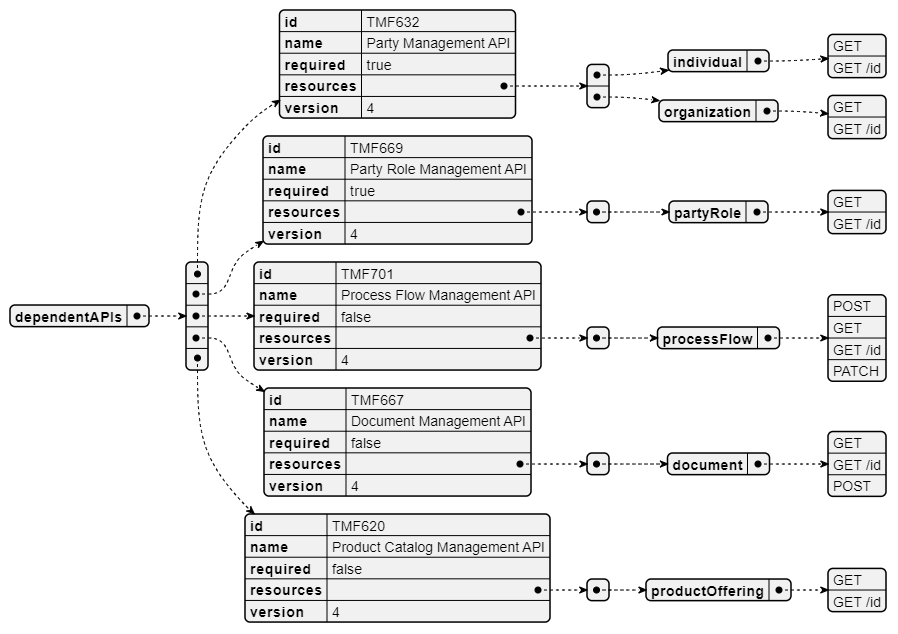
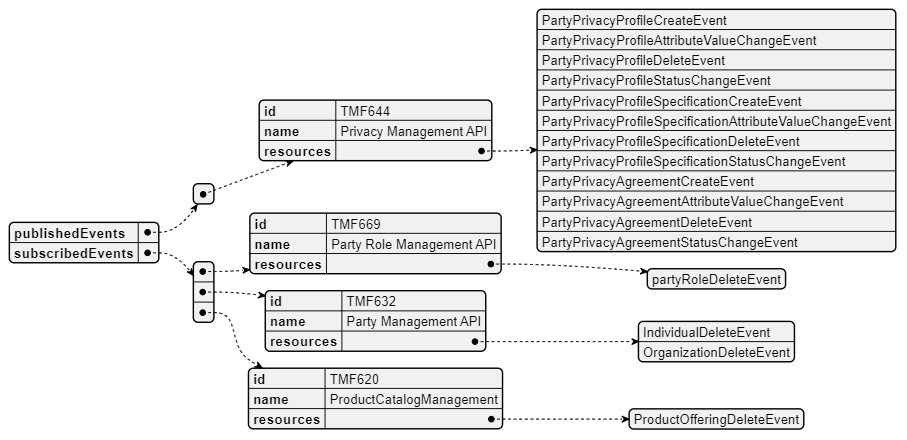

# 1. Overview

| Component Name | ID | Description | ODA Function Block |
| --- | --- | --- | --- |
| Party Privacy Management | TMFC022 | The Party Privacy Management component aims to • define the Privacy Policy rules established by the CSP, according to applicable regulations, such as GDPR in Europe, • apply these rules to each Party interacting with the CSP and to all of their personal information and personally identifiable information (PII), according to the role(s) played by the Party, • register explicit opt-in and opt-out given by Parties regarding the usage of some of their personal information for dedicated purpose, such as marketing. | Party Management |

*([PlantUML source](media/party-privacy-management-architecture.puml))*

# 2. eTOM Processes, SID Data Entities and

Functional Framework Functions

## 2.1. eTOM business activities

eTOM business activities this ODA Component is responsible for:

| Identifier | Level | Business Activity Name | Description |
| --- | --- | --- | --- |
| 1.3.21 | L2 | Customer Privacy Management | Customer Privacy Management processes manage the privacy requirements of customers in accordance with customers' information privacy requirements, and regulatory mandates. These processes help to: • Define the Customer Privacy Management scope, • Define the information that constitutes Personally Identifiable Information (personal identifiable information) where Privacy Policy applies, • Define Default Privacy requirements for each type of personal identifiable information, • Capture Customers explicit consent and define with Customers a Privacy Policy according to their wishes and the processing entities default Privacy Policy possible values, • Modify/update Privacy Policy according to future needs or requirements, • Enforce the Customer Privacy Policy and ensure that Customer information is managed correctly according to stated privacy policies, • Communicate relevant personal identifiable information processing standards to third parties with whom the information is shared. |
| 1.6.22 | L2 | Business Partner Privacy Management | Business Partner Privacy Management processes manage the privacy requirements of business partners in accordance with information privacy requirements, and regulatory mandates. These processes help to: • Define the Business Partner Privacy Management scope • Define the information that constitutes Personally Identifiable Information (personal identifiable information) where Privacy Policy applies. |

## 2.2. SID ABEs

SID ABEs this ODA Component is responsible for:

*: if SID ABE Level 2 is not specified this means that all the L2 business entities must be implemented, else the L2 SID ABE Level is specified. Note: To trace the validation of the Party Privacy Profile by the Party, the Party Privacy ABE currently includes a PartyPrivacyAgreement BE, defined as a specialization of Agreement. But any of the complexity of the Agreement ABE is necessary here - no Agreement Items, no Agreement Authorization - only a global Approval is necessary.

| SID ABE Level 1 | SID ABE L1 Definition | SID ABE Level 2 (or set of BEs)* | SID ABE L2 Definition |
| --- | --- | --- | --- |
| Party Privacy | The Party Privacy Profile ABE contains all entities used by the Party Privacy Management process for specifying • the information concerned by Privacy rules, • the Privacy rules themselves, • and the choices made by Parties for their own Privacy. |   |   |

## 2.3. eTOM L2 - SID ABEs links

*([PlantUML source](media/etom-sid-party-privacy-links.puml))*

## 2.4. Functional Framework Functions

| Function ID | Functional Framework Function | Function Description | Aggregate Function Level 1 | Aggregate Function Level 2 |
| --- | --- | --- | --- | --- |
| 664 | Privacy Profile Type Creation | Privacy Profile Type Creation provides a privacy dashboard function to define and create the privacy profile types by categorizing the Data Subject Parties, and defining the elements and of the Privacy for the Privacy Profile Type, both initial and additional for future evolution. Note: Profiles Type are defined according to the Country Privacy Authority such as National Protective Security Authority (NPSA) for UK. | Privacy Development | Privacy Definition Management |
| 665 | Privacy Profile Rules Configuration | Privacy Profile Rules Configuration provides a Privacy Dashboard function to define default and updated values for the Privacy Profile including the values for the Privacy Rules, and the default Privacy Profile for each Privacy Profile Type. Note: Profiles Type are defined according to the Country Privacy Authority such as | Privacy Development | Privacy Definition Management |
| 666 | External Access Privacy Data Browsing Access | Privacy Data Browsing Access provides a Privacy Dashboard access to Privacy Data Browsing used to provide the "Data Subject Party" the ability to view the current privacy profile attributes, of the Privacy Profile, both associated default values of rules defined, and the current values of rules. | Privacy Management | Privacy Repository Management |
| 667 | External Access Privacy Data Updating Access | Privacy Data Updating Access provides a Privacy Dashboard function that provides an access possibility for the Party to alter the Privacy Profile, with authorized values. | Privacy Management | Privacy Repository Management |
| 668 | Privacy Consent Agreement Obtaining | Privacy Consent Agreement Obtaining function is used to obtain consent from the "Data Subject Party" at the time of a change to the Privacy Profile. This can be initiated by the "Data Subject Party" at creation of new usage, or by the Service when delivering a new scenario. | Privacy Management | Privacy Repository Management |
| 945 | Record Retention Management | Record Retention Management of data and information monitor and assures compliance with the retention aspects of federal and state laws, legal requirements and expectations as well as the enterprise policies and procedures. | Privacy Management | Privacy Control |

# 3. TM Forum Open APIs & Events

The following part covers the APIs and Events; This part is split in 3: • List of Exposed APIs - This is the list of APIs available from this component. • List of Dependent APIs - In order to satisfy the provided API, the component could require the usage of this set of required APIs. • List of Events (generated & consumed ) - The events which the component may generate are listed in this section along with a list of the events which it may consume. Since there is a possibility of multiple sources and receivers for each defined event.

## 3.1. Exposed APIs

The following diagram illustrates API/Resource/Operation:

*([PlantUML source](media/exposed-apis-structure.puml))*

| API ID | API Name | API Version | Mandatory / Optional | Resource | Operations |
| --- | --- | --- | --- | --- | --- |
| TMF644 | Privacy Management | V4 | Mandatory | partyPrivacyProfile Specification | GET GET /id POST PATCH DELETE |
|   |   |   |   | partyPrivacyProfile | GET GET /id POST PATCH DELETE |
|   |   |   |   | partyPrivacyAgree ment | GET GET /id POST PATCH DELETE |
| TMF688https: //raw.githubu sercontent.co m/tmforum- apis/TMF688- Event/master/ TMF688- Event- v4.0.0.swagg er.json | Event | V4.0.0 | Optional |   |   |
| TMF701 | Process Flow | V4 | Optional | processFlow | GET GET /id POST DELETE |
|   |   |   |   | taskFlow | GET GET /id PATCH |

## 3.2. Dependent APIs

Following diagram illustrates API/Resource/Operation:

*([PlantUML source](media/dependent-apis-structure.puml))*

| API ID | API Name | API Version | Mandatory / Optional | Resource | Operation(s) | Rationales |
| --- | --- | --- | --- | --- | --- | --- |
| TMF620 | Product Catalog Management | v4 | Optional | productOfferi ng | GET GET /id | n/a |
| TMF632 | Party Management | v4 | Mandatory | individual | GET GET /id | a Party Privacy Profile must be validated by the Party. |
|   |   |   |   | organization | GET GET /id |   |
| TMF667 | Document | v4. | Optional | document | GET GET /id POST | n/a |
| TMF669 | Party Role Management | v4 | Mandatory | partyRole | GET GET /id | a Party Privacy Profile is associated to a Party Role (mandatory) |
| TMF672 | User Role Permission Management | v4.0.0 | Mandatory | permission | GET GET /id |   |
|   |   |   |   | userRole | GET GET /id |   |
| TMF688 | Event | v4.0.0 | Optional |   | Get |   |
| TMF701 | Process Flow | v4 | Optional | processFlow | GET GET /id POST DELETE | n/a |

Note: TMF669 V5 will permit to manage a resource partyRoleSpecification too (useful to be able to associate a Party Privacy Profile Type to a Party Role specification). Note: TMF651 Agreement Management is not included as dependent API. Even if it is currently part of the resource model of the TMF644 Party Privacy API, a simplification is requested at TMF644 level, as in the Party Privacy ABE.

## 3.3. Events

The diagram illustrates the Events which the component publishes and the Events that the component subscribes to and then receives. Both lists are derived from the APIs listed in the preceding sections. The type of event could be: • Create : a new resource has been created (following a POST). • Delete: an existing resource has been deleted. • AttributeValueChange: an attribute from the resource has changed - event structure allows to pinpoint the attribute. • InformationRequired: an attribute should be valued for the resource preventing to follow nominal lifecycle - event structure allows to pinpoint the attribute. • StateChange: resource state has changed.

*([PlantUML source](media/events-structure.puml))*

Note: Published events are the same for Privacy Management V4 and V5

# 4. Machine Readable Component Specification

Refer to the ODA Component Map on the TM Forum website for the machine-readable component specification files for this component.
