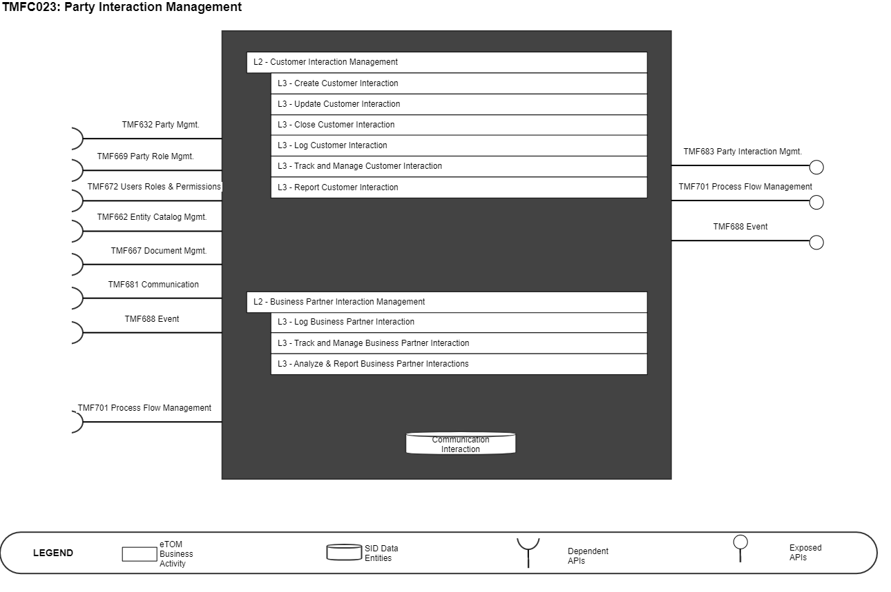
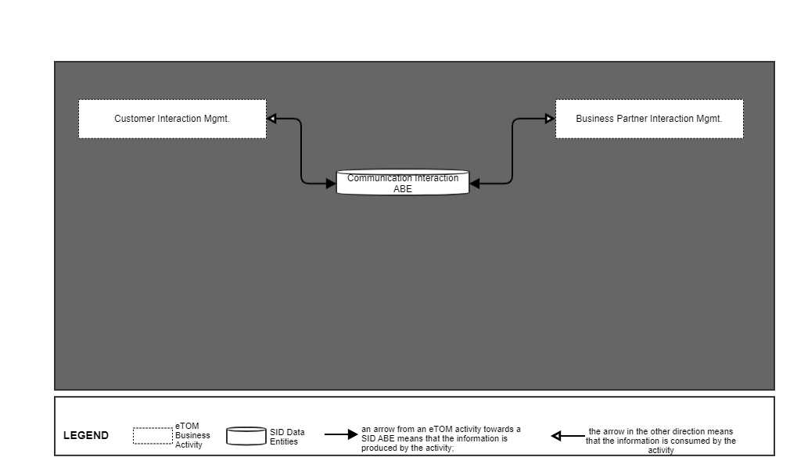
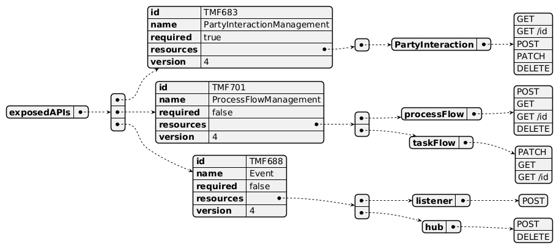
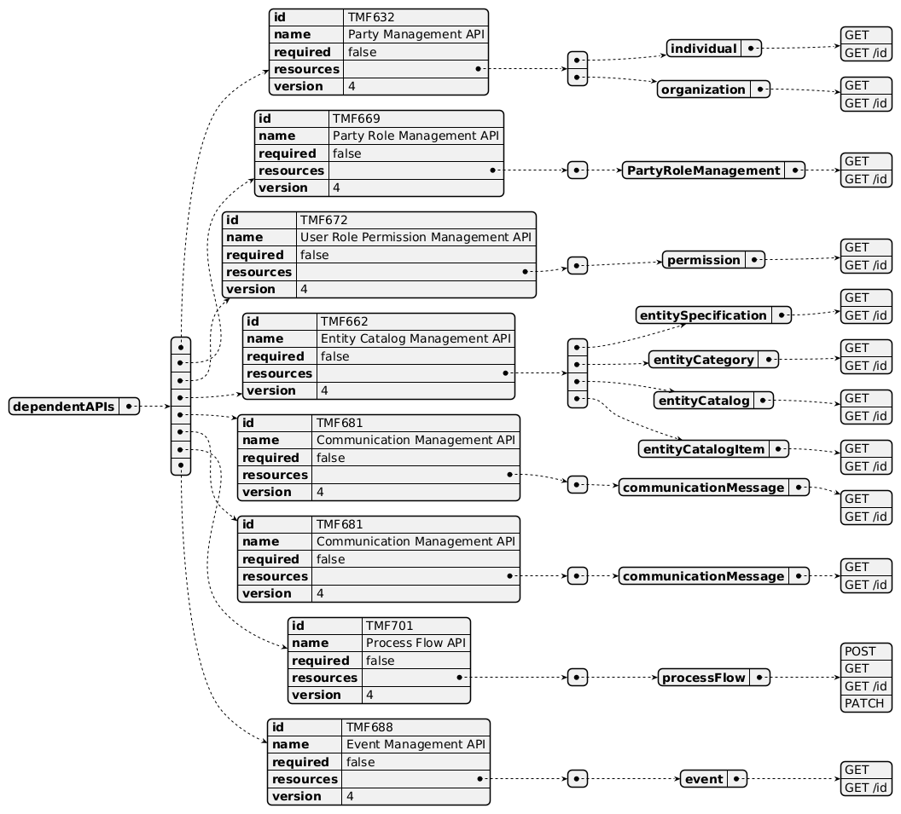
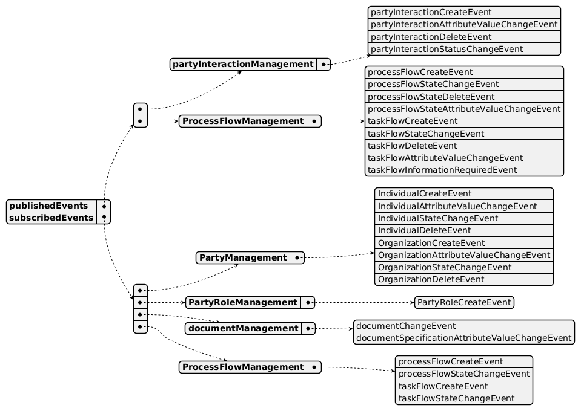

# 1. Overview

| Component Name | ID | Description | ODA Function Block |
| --- | --- | --- | --- |
| Party Interaction Management | TMFC023 | Party Interaction deals with the initial greeting and welcoming of a new contact. This will typically be the first component in a customer experience journey, shared by unassisted (self-service, retail kiosk) or assisted (call center, retail store) channels. It will identify known Parties or new Parties and react appropriately to propose available actions. It records all the interactions for the Parties from all channels. | Party Management |

*([PlantUML source](media/party-interaction-management-architecture.puml))*

# 2. eTOM Processes, SID Data

Entities and Functional Framework Functions

## 2.1. eTOM business activities

eTOM business activities this ODA Component is responsible for.

| Identifier | Level | Business Activity Name | Description |
| --- | --- | --- | --- |
| 1.3.5 | 2 | Customer Interaction Management | Manage interactions between the customer and the enterprise. Interactions can be triggered by the customer or by the enterprise |
| 1.3.5.1 | 3 | Create Customer Interaction | Create a record that logs the customer interaction. |
| 1.3.5.2 | 3 | Update Customer Interaction | Update the customer interaction. |
| 1.3.5.3 | 3 | Close Customer Interaction | Close the customer interaction. |
| 1.3.5.4 | 3 | Log Customer Interaction | Record and maintain all information about the customer interaction. |
| 1.3.5.6 | 3 | Track and Manage Customer Interaction | Ensure that Customer Interactions are managed and tracked efficiently. |
| 1.3.5.7 | 3 | Report Customer interaction | Monitor the status of a customer interaction. |
| 1.6.9 | 2 | Business Partner Interaction Management | Manage interactions between parties and the enterprise. Interactions can be triggered by the enterprise (as a result of a query or complaint) or by a Business Partner (for example sending bills or other notifications.) |
| 1.6.9.1 | 3 | Log Business Partner Interaction | Record and maintain all information about the Business Partner interaction. |
| 1.6.9.3 | 3 | Track and Manage Business Partner Interaction | Ensure that Business Partner Interactions are managed and tracked efficiently to meet the Business Partner interaction policies and SLA requirements. |
| 1.6.9.5 | 3 | Analyze & Report Business Partner Interactions | Perform all required analysis on closed requests and on Business Partner contacts and generate related reports |

## 2.2. SID ABEs

SID ABEs this ODA Component is responsible for:

| SID ABE Level 1 | SID ABE Level 2 (or set of BEs)* |
| --- | --- |
| Communication Interaction ABE |   |

*: if SID ABE Level 2 is not specified this means that all the L2 business entities must be implemented, else the L2 SID ABE Level is specified.

## 2.3. eTOM L2 - SID ABEs links

eTOM L2 vS SID ABEs links for this ODA Component.

*([PlantUML source](media/etom-sid-communication-interaction-links.puml))*

## 2.4. Functional Framework Functions

| Function ID | Function Name | Function Description | Sub-Domain Functions Level 1 | Sub-Domain Functions Level 2 |
| --- | --- | --- | --- | --- |
| 93 | Customer Behavior Tracking | Customer Behavior Tracking function monitor the customer behavior through the customer interaction, public communication, and use of products. | Welcome and Interaction | Customer Interaction Management |
| 163 | Contact Queuing | Contact Queuing; Contact Queuing provides the means to queue the contact until such time that a suitable agent comes available to work the contact. | Welcome and Interaction | Customer Interaction Management Queue Management |
| 165 | Customer Support Collaboration Access | Customer Support Collaboration Access provides the means for customer to agent or agent to support online chatting | Welcome and Interaction | Customer Interaction Management |
| 168 | Voice Channel Contact Routing | Voice Channel Contact Routing function provides the means for a customer to speak to a service representative, including the mechanism to query the customer (e.g. – IVR) on the nature of their request, and routing of the contact to the best available agent with the skills required for the contact and presents to the agent selected call information. | Welcome and Interaction | Customer Interaction Management Voice Channel Contact Routing |
| 189 | Customer Interaction Information Capturing | Customer Interaction Information Capturing captures customer interaction event data from all channels (agent interaction/notes, web/device click analytics, retail transactions, etc.), including receiving information from Customer Interaction Collection & Storage | Welcome and Interaction | Customer Interaction Management |
| 191 | Customer Relationship/Context Event Data Accumulation | Customer Relationship/Context Event Data Accumulation provides an ability to accumulate and map customer interaction event data from all channels (agent interaction/notes, web/device click analytics, retail transactions, etc.), including received information from Customer Interaction Collection & Storage | Welcome and Interaction | Customer Interaction Management |
| 196 | Customer Interaction Logging | Customer Interaction Logging provides collection and storage of all contact events with the customer via all channels whether unassisted (self service, retail kiosk) or assisted (call center, retail store). All types of interactions, including interaction history order history, trouble ticket history, billing collection history, case management, etc... The Store of any communications in any current or future form including Fax, IVR, email, Page, text, online chat, social media, and postal mail. The storage of all inbound and outbound interactions with the customer. | Welcome and Interaction | Customer Interaction Management |
| 239 | Recommendation to Customer Notification | Recommendation to Customer Notification provides necessary hooks to reach out to the customer via preferred channel such as SMS, email or Social media For Inbound, Self-Service or Call Center touch points can get recommendation and a guided action flow to complete the suitable customer treatment (ex. Credit Adjustment handled by agent, or bill dispute initiation via self-service) | Welcome and Interaction | Customer Interaction Management Customer Context Management |
| 1041 | Partner Interaction Journalizing | Partner Interaction Journalizing provides collection & storage of all contact events with the partner via all channels whether unassisted (self service, retail kiosk) or assisted (call center, retail store). | Business Partner Welcome and Interaction | Business Partner Interaction Management |

# 3. TM Forum Open APIs & Events

The following part covers the APIs and Events; This part is split in 3: • List of Exposed APIs - This is the list of APIs available from this component. • List of Dependent APIs - In order to satisfy the provided API, the component could require the usage of this set of required APIs. • List of Events (generated & consumed ) - The events which the component may generate is listed in this section along with a list of the events which it may consume. Since there is a possibility of multiple sources and receivers for each defined event.

## 3.1. Exposed APIs

Following diagram illustrates API/Resource/Operation:

*([PlantUML source](media/exposed-apis-structure.puml))*

| API ID | API Name | Mandatory / Optional | Operations |
| --- | --- | --- | --- |
| TMF683 | Party Interaction Management | Mandatory | partyInteraction: • GET • GET /id • POST • PATCH • DELETE |
| TMF701 | Process Flow Management | Optional | processFlow: • POST • GET • GET /id • DELETE taskFlow: • PATCH • GET • GET /id |
| TMF688 | Event | Optional | listener: • POST hub: • POST • DELETE |

## 3.2. Dependent APIs

Following diagram illustrates API/Resource/Operation:

*([PlantUML source](media/dependent-apis-structure.puml))*

| API ID | API Name | Mandatory / Optional | Operations |
| --- | --- | --- | --- |
| TMF632 | Party Management | Optional | Get |
| TMF669 | Party Role Management | Optional | Get |
| TMF672 | Users Roles & Permissions | Optional | Get |
| TMF662 | Entity Catalog Management | Optional | Get |
| TMF667 | Document Management | Optional | Get |
| TMF681 | Communication Management | Optional | Optional |
| TMF701 | Process Flow Management | Optional | Get, Post, Patch |
| TMF688 | Event | Optional | Get |

## 3.3. Events

The diagram illustrates the Events which the component may publish and the Events that the component may subscribe to and then may receive. Both lists are derived from the APIs listed in the preceding sections.

*([PlantUML source](media/events-structure.puml))*

# 4. Machine Readable

Component Specification Refer to the ODA Component table for the machine-readable component specification file for this component. While we are building this over the lifespan of this document, the file can be found here as well: TMForum-ODA-Ready-for-publication/1Beta2/TMFC023- PartyInteractionManagement/TMFC023-PartyInteractionManagement.yaml at main · tmforum-rand/TMForum-ODA-Ready-for-publication (github.com)
