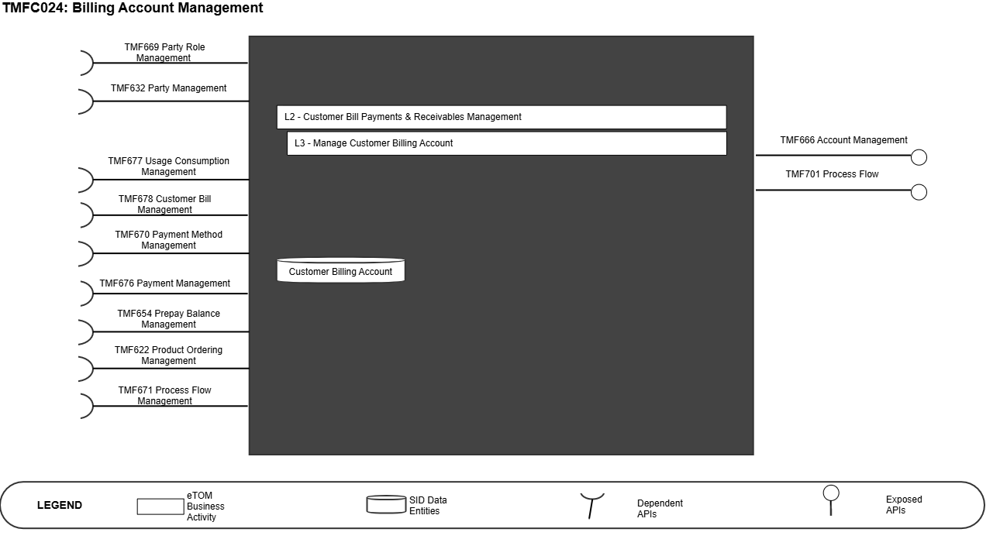
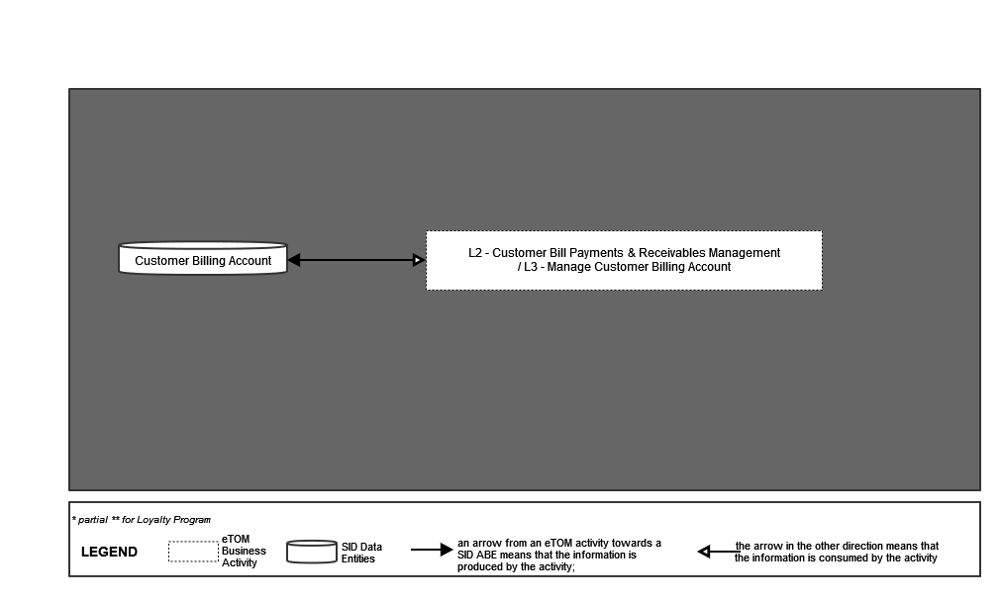
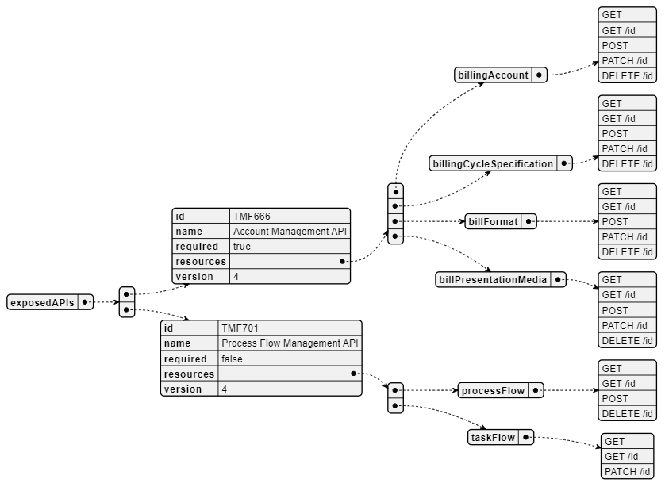
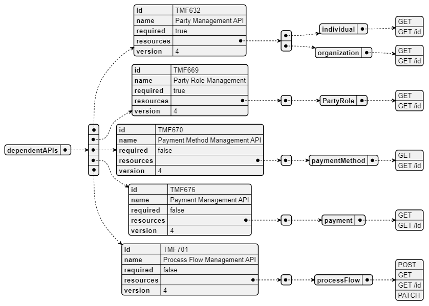
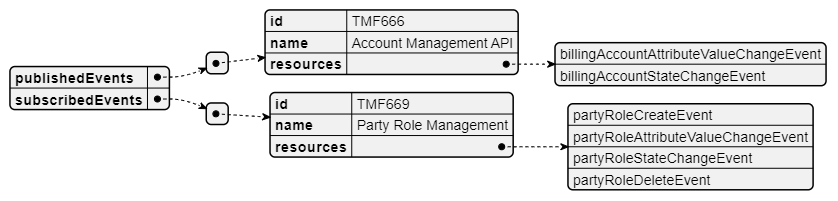

# 1. Overview

| Component Name | ID | Description | ODA Function Block |
| --- | --- | --- | --- |
| Billing Account Management | TMFC024 | The billing account management component aims to provide all the needed functionalities to create, configure and modify billing accounts. BAM component has the goal to support and handle the following capabilities/ functionalities. • Set-up/ creation of Billing account • Associate payment plan(s) • Associate payment method(s) - optional • Account taxes/ fees exception management • Define account associations • Provide account balance details • Set-up Billing contacts • Set-up Billing preferences (e.g., bill cycle frequency, invoice media type, invoice template option, etc.) | Party Management |

*([PlantUML source](media/billing-account-management-architecture.puml))*

# 2. eTOM Processes, SID Data Entities and

Functional Framework Functions

## 2.1. eTOM business activities

eTOM business activities this ODA Component is responsible for:

| Identifier | Level | Business Activity Name | Description |
| --- | --- | --- | --- |
| 1.3.10 | L2 | CustomerBill Payments & Receivables Management | Ensure that enterprise revenue is collected through pre-established collection channels and put in place procedures to recover past due payments. |
| 1.3.10.1 | L3 | Manage Customer Billing Account | Ensure effective management of the customer’s billing account as it relates to the products purchased and consumed throughout the appropriate billing cycle. |

## 2.2. SID ABEs

SID ABEs this ODA Component is responsible for:

| SID ABE Level 1 | SID ABE Level 2 (or set of BEs) |
| --- | --- |
| Customer Billing Account | Customer Billing Account |

## 2.3. eTOM L2 - SID ABEs links

*([PlantUML source](media/etom-sid-billing-account-links.puml))*

## 2.4. Functional Framework Functions

| Function ID | Function Name | Function Description | Sub-Domain Functions Level 1 | Sub-Domain Functions Level 2 |
| --- | --- | --- | --- | --- |
| 77 | Billing Account Information Configuration | Billing Account Information Configuration updates specific billing account information such as customer bill periods, bill media options, etc. | Invoice Management | Billing Account Administration |
| 73 | Billing Account Reporting | Billing Account Reporting; Grouping charges/statement/accounts for the purpose of creating a report | Invoice Management | Billing Account Administration |
| 76 | Billing Account Structure Configuration | Billing Account Structure Configuration modifies billing accounts based on various account constructs. | Invoice Management | Billing Account Administration |
| 75 | Billing Accounts Creation | Billing Accounts Creation provides the ability to create billing accounts based on various account constructs. Account creation can also be automated with orders received | Invoice Management | Billing Account Administration |
| 248 | Customer Billing | Customer Billing Hierarchies Management provide an internet technology driven interface to undertake billing functions | Invoice Management | Billing Account Administration |
|   | Hierarchies Management | directly for management of hierarchies driven billing operations for e.g. corporate customers |   |   |

# 3. TM Forum Open APIs & Events

The following part covers the APIs and Events; This part is split in 3: • List of Exposed APIs - This is the list of APIs available from this component. • List of Dependent APIs - In order to satisfy the provided API, the component could require the usage of this set of required APIs. • List of Events (generated & consumed) - The events which the component may generate are listed in this section along with a list of the events which it may consume. Since there is a possibility of multiple sources and receivers for each defined event.

## 3.1. Exposed APIs

The following diagram illustrates API/Resource/Operation:

*([PlantUML source](media/exposed-apis-structure.puml))*

| API ID | API Name | Mandatory / Optional | Operations |
| --- | --- | --- | --- |
| TMF666 | Account Management | Mandatory | billingAccount: • GET • GET /id • POST • PATCH • DELETE billingCycleSpecification: • GET • GET /id • POST • PATCH • DELETE billFormat: • GET • GET /id • POST • PATCH • DELETE billPresentationMedia: • GET • GET /id • POST • PATCH • DELETE |
| TMF688 | Event Management | Optional | processFlow: • GET • GET /id • POST • DELETE taskFlow: • GET • GET /id • POST • DELETE |
| TMF701 | Process Flow Management | Optional | listener: • POST hub: • POST • DELETE |

## 3.2. Dependent APIs

Following diagram illustrates API/Resource/Operation:

*([PlantUML source](media/dependent-apis-structure.puml))*

| API ID | API Name | Mandatory / Optional | Operation | Rationale |
| --- | --- | --- | --- | --- |
| TMF632 | Party Management | Mandatory | - individual: - GET - GET /id - organization: - GET - GET /id | Billing Account must be related to at least one Party |
| TMF669 | Party Role Management | Mandatory | - partyRole: - GET - GET /id | Party Role access based control |
| TMF672 | UserRolesPermissions | Mandatory | Get |   |
| TMF670 | Payment Method Management | Optional | - paymentMethod: - GET - GET /id |   |
| TMF676 | Payment Management | Optional | - payment: - GET - GET /id |   |
| TMF701 | Process Flow Management | Optional | - processFlow: - POST - GET - GET /id - PATCH |   |
| TMF688 | Event Management | Optional | Get |   |

## 3.3. Events

The diagram illustrates the Events which the component may publish and the Events that the component may subscribe to and then may receive. Both lists are derived from the APIs listed in the preceding sections.

*([PlantUML source](media/events-structure.puml))*

# 4. Machine Readable Component Specification

Refer to the ODA Component Directory for the machine-readable component specification file for this component.
