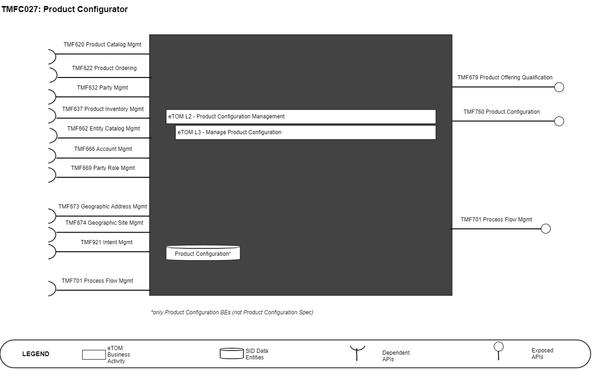
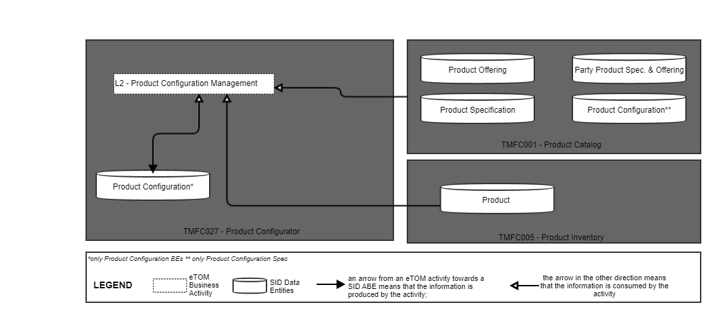
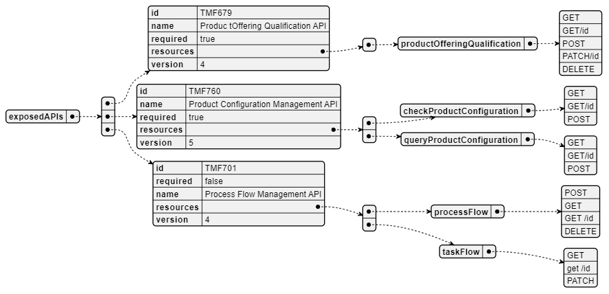
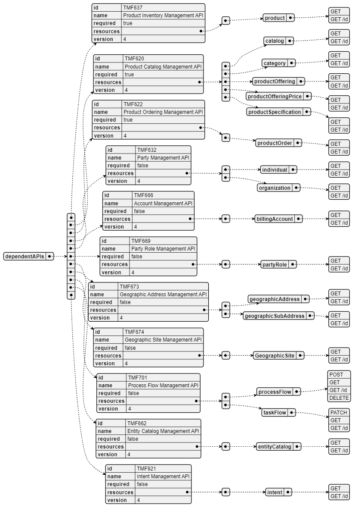
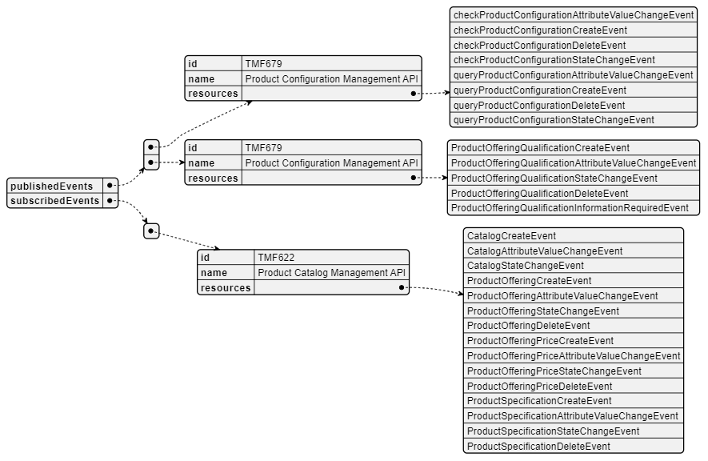

# 1. Overview

| Component Name | ID | Description | ODA Function Block |
| --- | --- | --- | --- |
| Product Configurator | TMFC027 | The Product Configurator aims to provide sales representatives and customers with fast and error-free product qualification and product configuration capabilities across all channels. It uses mostly the Product Catalog and the Product Inventory information, and is able to execute and check all types of Product Catalog policy rules (e.g. packaging rules, commercial pre-requisite rules, pricing rules, consistency rules between characteristic values). It can also use Party related information, such as the age of the customer, or specific contextual information, such as the channel. It can be triggered in contexts such as product order capture, shopping cart or quote management. It supports the Product Order Capture and Validation component (TMFC002) to: • Establish commercial offering eligibility, and to provide alternative product offerings in case of ineligible product offering selection • Leads the configuration of selected eligible product offerings according to the context. Product configuration includes computation of characteristics values, allowed values, bundled and related product offering, pricing and discounts | Core Commerce Management |

*([PlantUML source](media/product-configurator-architecture.puml))*

# 2. eTOM Processes, SID Data Entities and

Functional Framework Functions

## 2.1. eTOM business activities

eTOM business activities this ODA Component is responsible for:

| Identifier | Level | Business Activity Name | Description |
| --- | --- | --- | --- |
| 1.2.5 | L2 | Product Configuration Management | Configuration Management configures or creates a new version of a configuration for an entity, such as a product,service or resource, as defined by a configuration specification. This process also modifies a configuration and values for configuration parameters, and removes a configuration. |
| 1.2.5.2 | L3 | Manage Product Configuration | Manage Product Configuration business activity is in charge of creating, maintaining, controlling, changing and reporting Product Configuration according to Product Configuration Plans. Manage Product Configuration will establish and maintaining consistency of a product's performance, functional, and physical attributes within the limits defined by product requirements, product design, and operational information throughout the Products Lifecycle. |

## 2.2. SID ABEs

SID ABEs this ODA Component is responsible for:

| SID ABE Level 1 | SID ABE L1 Definition | SID ABE Level 2 (or set of BEs)* |   | SID ABE L2 Definition |
| --- | --- | --- | --- | --- |
| Product Configurati on | A Product Configuration (also referred to as a Product Profile) defines how a Product operates or functions. A Product Configuration may contain one or more parts, and each part may contain zero or more fields. Each field may have attributes that are statically or dynamically defined. Some of these fields have fixed values, while others provide values from which a choice or choices can be made (e.g. using the EntitySpec/Entity and/or CharacteristicSpec/CharacteristicValue patterns) 1 | ProductConfigurati on | A representati on of how a Product operates or functions in terms of characteristi cs and related Product(s). |   |

1 As in GB922 Product v23.0 document the definition of the ABE Product Configuration is a copy of the Configuration ABE pattern defined in GB922 Common v23.0, it is here adapted to the product level only. *: if SID ABE Level 2 is not specified this means that all the L2 business entities must be implemented, else the L2 SID ABE Level is specified.

## 2.3. eTOM L2 - SID ABEs links

*([PlantUML source](media/etom-sid-product-configuration-links.puml))*

## 2.4. Functional Framework Functions

1 TMFC027 Product Configurator covers the part related to Product Catalog rules checking. Stock control part is done by TMFC002 Product Order Capture & Validation 2 TMFC027 Product Configurator covers the part related to Product Catalog rules checking at commercial and functional eligibility levels. Technical eligibility controls are triggered by TMFC002 Product Order Capture & Validation

| Function ID | Functional Framework Function | Function Description | Aggregate Function Level 1 | Aggregate Function Level 2 |
| --- | --- | --- | --- | --- |
| 55 | Price & Discount Calculation | Price and Discount Calculation applies pricing and discounting rules and algorithms in the context of the assembled information concerning Products (i.e. instances of Product). | Rating and Follow up | Tariff Calculation and Rating |
| 182 | Inter Product Dependency Identification | Inter-Product Dependency Identification identifies product dependencies, binds new order to purchased product or point to the dependent product required | Product Configuration & Activation | Offer and Product Configuration |
| 205 | Customer Order Eligibility Validation | Customer Order Eligibility Validation function validates that the Offer & products specified on the Customer Order, are eligible from a commercial and functional point of view. It includes: • Commercial Eligibility with commercial compatibility with the already customer installed Offers • Functional Eligibility with the customer's already installed Products (corresponding to ProductSpecification). | Customer Order Management | Customer Order Eligibility Validation |
| 207 | Offer and Product Configuration | The Offer and Product Configuration function enables the configuration of the commercial offer chosen by the customer. The configuration recovers the choice of an option, the choice of the characteristics values for the Product Specification including installation preferences... It can be based on product configurator using a rule engine. It can be used at the same time by Selling, Order Establishment or Develop Sales Proposal Business activities. | Product Configuration & Activation | Offer and Product Configuration |
| 262 | Product Availability Checking 1 | Product Availability Checking function provide an internet technology driven interface for the customer to undertake a product availability check. E.g., that the product offering is active for sales, the equipment(s) specified in the customer order are on stock. | Customer Order Management | Customer Order Eligibility Validation |
| 274 | Quote Price Support Access | Quote Price Support Access provides self empowered fulfillment function to provide an internet technology driven interface for the customer to get a Quotation price. | Customer Order Management Fulfillment Integration Management | Customer Order Quotation Customer Fulfillment Access Management |
| 278 | Customer SLA Preferences Capturing | Customer SLA Preferences Capturing captures the customer's SLA preferences e.g., as part of the fulfillment. | Product Configuration & Activation | Offer and Product Configuration |
| 300 | Discount Calculation | Discounts Calculation determines charge discounts based on pricing plan; including discounts on recurring, one time, and usage charges. Discounts may be applied at different levels such as cross product, cross location, or cross customer (all customers that are part of a given group plan – some affiliation). The discounts can be apportioned across multiple events. | Rating and Follow up | Tariff Calculation and Rating |
| 320 | Customer Product Proposal Creation | Customer Product Proposal Creation proposes according to what the customer presently has as part of what can be further provided to the customer including bundling, product proposals, etc. | Product Configuration & Activation | Offer and Product Configuration |
| 379 | Product Customization Offering Management | Product Customization Offering Management provides the necessary functionality to manage the customer personalized proposals, taking into account the customer location, needs, current products, as well as the service provider's products, sales emphasis and targets, etc. | Sales Management | Opportunity Management |
| 727 | Product Offer to Customer Verification 2 | Product Offer to Customer Verification enables and verifies the configuration of the commercial offer chosen by the customer. The configuration consist of technical, functional, and commercial prerequisites and preferences. | Customer Order Management | Customer Order Eligibility Validation |
| 928 | Solution Design Creation | Solution Design Creation function combine/configure the emerged solution based on the existing solution, planned changes and newly designed features (e.g., for site connectivity services) Selecting relevant Products and Services from Catalog – Browse and select entries from a catalog that might be relevant to the set of captured requirements into the design. | Sales Management | Opportunity Management |
| 930 | Automatic Solution Validation | Obtains configuration constraints from the catalog and validates the correctness of the design against them. | Sales Management | Opportunity Management |
| 931 | Solution Pricing | The Solution Pricing function is concerned with assuring that the designs are priced consistent with pricing used for billing. The common product catalog provides an initial price base for the components that are in the solution vs. the existing configuration at the customer location. | Sales Management | Opportunity Management |
| 932 | Calculation Rules Retrieval | Calculation Rules Retrieval function gives support for tariffication rules including discounting rules. It supports that discounting rules and guidelines are provided as to standard levels of discounts/promotions that can be provided to the customer. Special discount arrangements can be obtained by following an escalation process. There is workflow functionality to help manage discount escalation. | Sales Management | Opportunity Management |
| 933 | Price/Cost Optimization Price Optimization | Price Optimization enables sales to effectively evaluate the customer, generate recommendations for price decreases and increases, and set negotiation guidelines based on our cost. This includes the application of non-standard pricing. | Sales Management | Opportunity Management |

# 3. TMF OPEN APIs & Events

The following part covers the APIs and Events; This part is split in 3: • List of Exposed APIs - This is the list of APIs available from this component. • List of Dependent APIs - In order to satisfy the provided API, the component could require the usage of this set of required APIs. • List of Events (generated & consumed ) - The events which the component may generate is listed in this section along with a list of the events which it may consume. Since there is a possibility of multiple sources and receivers for each defined event.

## 3.1. Exposed APIs

Following diagram illustrates API/Resource/Operation:

*([PlantUML source](media/exposed-apis-structure.puml))*

| API ID | API Name | API Vers ion | Manda tory / Option al | Operations |
| --- | --- | --- | --- | --- |
| TMF679 | Product Offering Qualifica tion | V4 | Mandat ory | productOfferingQu alification: • GET • GET /id • POST • PATCH • DELETE |
| TMF760 | Product Configur ation | V5 | Mandat ory | checkProductQual ification: • GET • GET /id • POST queryProductQuali fication: • GET • GET /id • POST |
| TMF688https://raw.githubusercont ent.com/tmforum-apis/TMF688- Event/master/TMF688-Event- v4.0.0.swagger.json | Event | V4.0. 0 | Option al | listener: • POST hub: • POST • DELETE |
| TMF701 | Process Flow | V4.0. 0 | Option al | processFlow: • POST • GET • GET /id • DELETE taskFlow: • GET • GET /id • PATCH |

## 3.2. Dependent APIs

The following diagram illustrates API/Resource/Operation:

*([PlantUML source](media/dependent-apis-structure.puml))*

| API ID | API Name | Mandatory / Optional | Operations | Rationales |
| --- | --- | --- | --- | --- |
| TMF637 | Product Inventory Management API | Mandatory | product: - GET - GET /id | Check required to verify any product inventory related to the party. |
| TMF620 | Product Catalog Management API | Mandatory | catalog: - GET - GET /id category: - GET - GET /id productOffering: - GET - GET /id productOfferingPrice: - GET - GET /id productSpecification: - GET - GET /id | Product configuration must rely on product catalog information. |
| TMF622 | Product Ordering Management API | Mandatory | productOrder: - GET - GET /id | Product configurator must produce a product order. |
| TMF632 | Party Management API | Optional | individual: - GET - GET /id organization: - GET - GET /id | n/a |
| TMF662 | Entity Catalog Management API | Optional | entityCatalog: - GET - GET /id | n/a |
| TMF666 | Account Management API | Optional | billingAccount: - GET - GET /id | n/a |
| TMF669 | Party Role Management API | Optional | partyRole: - GET - GET /id | n/a |
| TMF672 | User Roles Permissions | Optional | permission: - GET - GET /id userRole: - GET - GET /id | n/a |
| TMF673 | Geographic Address | Optional | geographicAddress: - GET - GET /id geographicSubAddress: | n/a |
|   | Management API |   | - GET - GET /id |   |
| TMF674 | Geographic Site Management API | Optional | geographicSite: - GET - GET /id | n/a |
| TMF688 | Event | Optional | event: - GET - GET /id | n/a |
| TMF701 | Process Flow | Optional | processFlow: - POST - GET - GET /id - DELETE taskFlow: - PATCH - GET - GET /id | n/a |
| TMF921 | Intent Management API | Optional | intent: - GET - GET /id | n/a |

NOTE: Geographic Location Management API (TMF675) is available in Beta version. As soon as the interface will be published it will be added to the table and to the overview.

## 3.3. Events

The diagram illustrates the Events which the component publishes and the Events that the component subscribes to and then receives. Both lists are derived from the APIs listed in the preceding sections. The type of event could be: • Create : a new resource has been created (following a POST). • Delete: an existing resource has been deleted. • AttributeValueChange: an attribute from the resource has changed - event structure allows to pinpoint the attribute. • InformationRequired: an attribute should be valued for the resource preventing to follow nominal lifecycle - event structure allows to pinpoint the attribute. • StateChange: resource state has changed.

*([PlantUML source](media/events-structure.puml))*

# 4. Machine Readable Component Specification

Refer to the ODA Component table for the machine-readable component specification file for this component.
