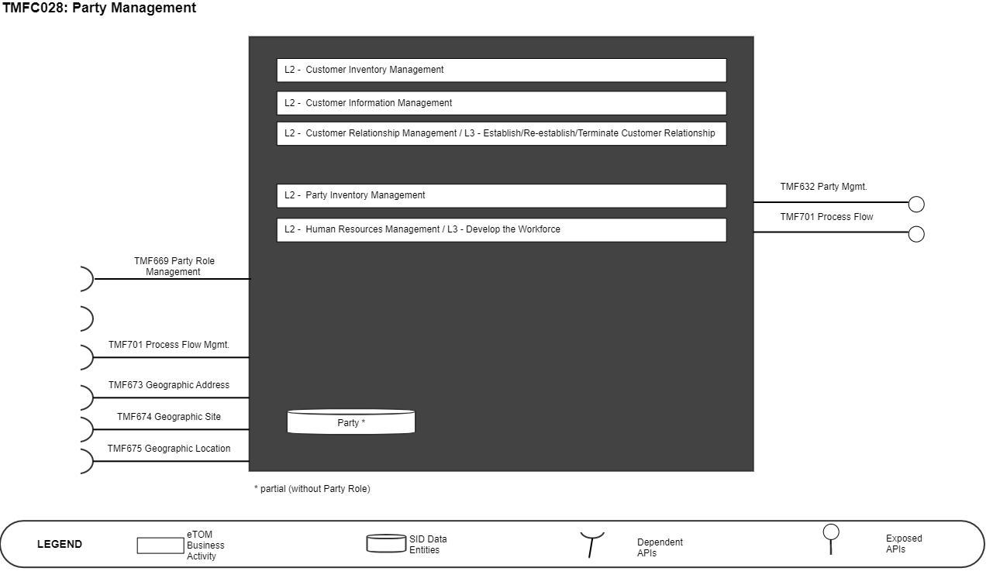
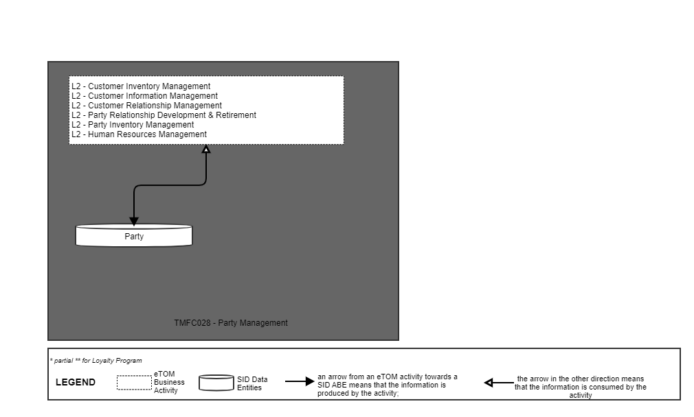
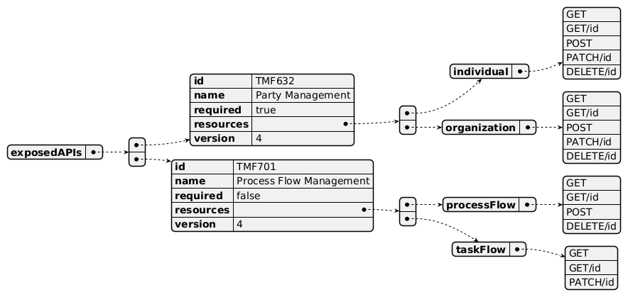
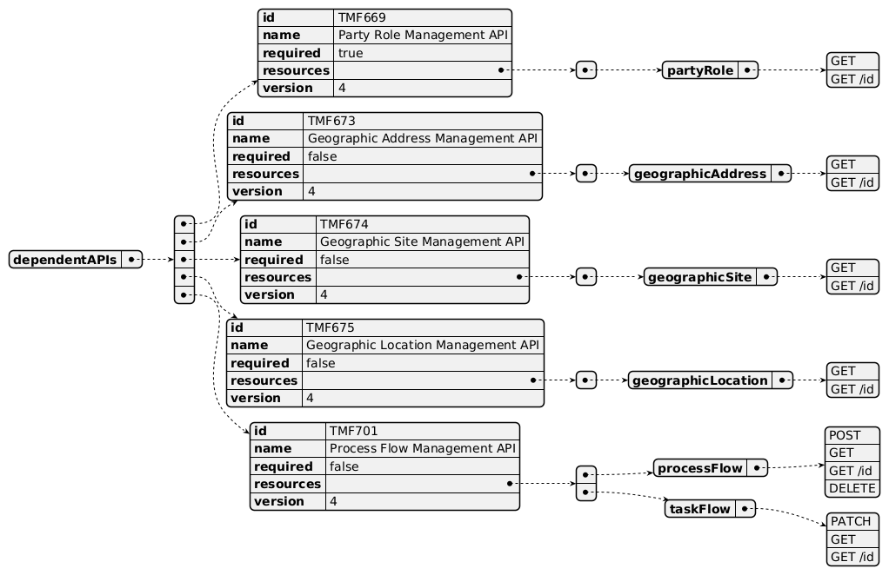
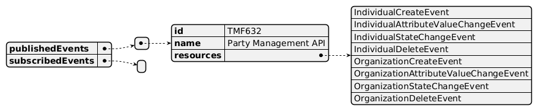

# 1. Overview

| Component Name | ID | Description | ODA Function Block |
| --- | --- | --- | --- |
| Party Management | TMFC028 | The Party Management component is responsible for the capture, validation, and management of Parties. A Party may be an individual or organization that has a relationship with an enterprise. In this context it is responsible for the end-to-end lifecycle of: Individual, Organization and its related sub-entities, Contact Medium, Currency and tax exemption certificates, Identification, and Community. | Party Management |

*([PlantUML source](media/party-management-architecture.puml))*

# 2. eTOM Processes, SID Data

Entities and Functional Framework Functions

## 2.1. eTOM business activities

eTOM business activities this ODA Component is responsible for:

| Identifier | Level | Business Activity Name | Description |
| --- | --- | --- | --- |
| 1.3.16 | 2 | Customer Inventory Management | Establish, manage, and administer the enterprise's customer inventory, as embodied in the Customer Inventory Database, and monitor and report on the usage and access to the customer inventory, and the quality of the data maintained in it. Note: validate if the "Customer Inventory Shortcomings" (L3) should be into the scope of this component. |
| 1.3.6 | 2 | Customer Information Management | Manage customer information after customer contracts or associated service orders have been finalized and during the order completion phase. Ensure that any customer information required by other CRM processes is updated as part of the customer order completion. Note: validate with eTOM team why CIM is an L2 and not an L3 of Customer Inventory Mgmt. |
| 1.3.4 | 2 | Customer Relationship Management | Manage the relationship of the Customer and the enterprise. |
| 1.3.4.2 | 3 | Establish Customer Relationship | Verify the customer identity and manage the customer identity across the Enterprise. |
| 1.3.4.3 | 3 | Re-establish Customer Relationship | Re-establish customer relationship. |
| 1.3.4.4 | 3 | Terminate Customer Relationship | Manage termination as appropriate |
| 1.6.3 | 2 | Party Relationship | Manage the lifecycles of parties with whom the enterprise has a relationship. Relationship with new parties may be required to broaden the services an enterprise offers, to improve performance, for |
|   |   | Development & Retirement | outsourcing and out-tasking requirements, and so forth. |
| 1.6.3.1 | 3 | Party Relationship Management | Support the lifecycles (development and retirement) of an enterprise's relationships with parties. |
| 1.6.3.1.5 | 4 | Collect Party data | Collect data about a Party and/or a Party playing a role. Data includes basic Party data, identification data, contact data, and additional attributes. |
| 1.6.21 | 2 | Party Inventory Management | Manage the administration of the enterprise's Party inventory. |
| 1.7.7 | 2 | Human Resources Management | This process element represents part of the overall enterprise, modeled in business process terms, and can be applied (ie “instantiated") with other similar process elements for application within a specific organization or domain. The Human Resources Management process grouping provides the human resources infrastructure for the people resources that the enterprise uses to fulfil its objectives. |
| 1.7.7.2 | 3 | Develop the Workforce | This process element represents part of the overall enterprise, modeled in business process terms, and can be applied (ie “instantiated") with other similar process elements for application within a specific organization or domain. Support the definition of the organization of the enterprise and coordinate its reorganizations. |

## 2.2. SID ABEs

SID ABEs this ODA Component is responsible for:

| SID ABE Level 1 | SID ABE Level 2 (or set of BEs) |
| --- | --- |
| Party | • Party • Contact Medium • Currency and tax exemption certificates • Party Identification • Community |

## 2.3. eTOM L2 - SID ABEs links

*([PlantUML source](media/etom-sid-party-links.puml))*

## 2.4. Functional Framework Functions

| Function ID | Function Name | Function Description | Sub-Domain Functions Level 1 | Sub-Domain Functions Level 2 |
| --- | --- | --- | --- | --- |
| 369 | Customer Data Fencing | Customer Data Fencing provides a security function that will allow e.g., VNO agents or Dealers to view only their own customers. In some cases, the network provider will use the same BSS environment to serve several VNOs (multi tenancy) | Customer Information Support | Customer Information Management |
| 225 | Customer Details Management | Customer Details Management; Managing customer details - E.g., name, contact persons for this customer, account managers for this customer, addresses (residence, billing, service address, etc.), contact phone numbers (landline, mobile, fax, etc.) | Customer Information Support | Customer Information Management |
| 400 | Customer Information Management | Customer Information Management is a generic function for customer information that also includes functionality for data fencing if accessed by Partner's online access function to make them self- sufficient and avoid the need for them to call the call center for Customer creation and management. | Customer Information Support | Customer Information Management |
| 282 | Customer Information Presentation | Customer Information Presentation displays relevant customer information, such as name, account and lifetime value on a persistent customer dashboard. | Customer Information Support | Customer Information Management |
| 226 | Customer Preferences Administration | Customer Preferences Administration administrates customer proprietary information preferences (CPNI), email versus US Mail, how to be contacted (based on type of communication), web look and feel, do not solicit me. Personalization allows delivery of services that more closely match the customer's need. | Customer Information Support | Customer Information Management |
| 364 | Customer/Prospect Data Acquisition | Customer/Prospect Data Acquisition obtains all necessary information to make a sale. The prospect could be a new or current customer. Customer/Prospect Data Acquisition includes information about the service location, billing address, demographic information about the customer, any existing products and services the customer currently has, as well as the customer's needs (requirements). | Customer Information Support | Customer Information Management |
| 92 | Customer Relation Map Exposure | Customer Relation Map Exposure maps the customer relation/context to systems such as call center or self-service touch | Customer Information Support | Personalize Customer Profile |
| 233 | Customer Actions Profile Updating | Customer Actions Profile Updating updates customer profiling based on implicit and explicit actions, transactions (ex., deriving actual channel preference from a customer whose implicit preference is SMS, not email) | Customer Information Support | Collect & Qualify Customer Information |
| 195 | Customers Hierarchy and Group Management | Customer Hierarchy and Group Management function stores the customer hierarchy and/or groups such as company, relationships and household structures. Manages complex customer relationships such as an individual who performs multiple roles, or hierarchies such as complex Corporate structures. This function should be able to deal with several levels of complexity from single service accounts to multinational corporations. Hierarchies are defined by an account type and its relationships with parent and child accounts. | Customer Information Support | Collect & Qualify Customer Information |
| 122 | Customer Information Searching | Customer Information Searching search the existing customer base using various criteria (name, address, subscriber number, equipment id, billing account number, etc.) and find the customer record to add the order (using Customer Information Management). | Customer Information Support | Collect & Qualify Customer Information |
| 91 | Customer Profile Updating | Customer Profile Updating function concerns the management of our knowledge of the individual customer to keep or produce an up-to-date, accurate and legally compliant Customer information. It will incorporate into the customer profile, all relevant information gathered through all contacts with the customer | Customer Information Support | Collect & Qualify Customer Information |
| 121 | Registration | Customer Registration registers a new customer if this is a new customer (using Customer Information Management). | Customer Information Support | Collect & Qualify Customer Information |
| 124 | Guided Customer Information Capturing | Guided Customer Information Capturing provides a step-by-step guide at the channel to capture the specific information items to be collected (e.g. customer identification, required product / order and the pertinent data for the order). Including Validation guidance – for each information element, may provide set of valid input | Customer Information Support | Collect & Qualify Customer Information |
| 1036 | Partner Profile Enquiry and Filtering | Partner Profile Enquiry and Filtering function provide the necessary functionalities to inquire stored profiles including filtering to both ensure access based on authority levels and for the convenience for the reader. | Business Partner Management | Business Partner Inventory Management |
| 1037 | Partner Profile Storage | Partner Profile Storage function secure data availability and integrity for the partner profile management. | Business Partner Management | Business Partner Inventory Management |
| 746 | Partner Workflow Management | Partner Workflow Management function provide workflow and orchestration for supplier/partner management activities. | Business Partner Management | Business Partner Inventory Management |
| 1032 | Partner Group and Hierarchy Definition | Partner Group and Hierarchy Assigning assigns partners to relevant groups and hierarchies and make the grouping available to the concerned organizations within the enterprise | Business Partner Management Business Partner Welcome and interaction | Business Partner Support & Readiness |
| 1033 | Partner Group and Hierarchy Assigning | Partner Group and Hierarchy Definition defines and creates partner group types and hierarchy criteria in line with the partner strategy to support partner collaboration with the different organization of the enterprise. | Business Partner Management Business Partner Welcome and interaction | Business Partner Support & Readiness |
| 1035 | Partner Preferences Management | Partner Preferences Management function provide the necessary functionalities to manage partner preferences and partner information details in collaboration with the partner. This includes management of the stored profile information including creation, updating and deletion as well as lifecycle management by supervision of validity and recency. | Business Partner Management Business Partner Welcome and interaction | Business Partner Support & Readiness |
| 1034 | Partner Profile Management | Partner Profile Management function provide the necessary functionalities to manage partner information details for internal usages. This includes management of the stored profile information including creation, updating and deletion as well as lifecycle management by supervision to keep information valid and up to date. | Business Partner Management | Business Partner Support & Readiness |

# 3. TM Forum Open APIs & Events

The following part covers the APIs and Events; This part is split in 3: • List of Exposed APIs - This is the list of APIs available from this component. • List of Dependent APIs - In order to satisfy the provided API, the component could require the usage of this set of required APIs. • List of Events (generated & consumed ) - The events which the component may generate is listed in this section along with a list of the events which it may consume. Since there is a possibility of multiple sources and receivers for each defined event.

## 3.1. Exposed APIs

The following diagram illustrates API/Resource/Operation:

*([PlantUML source](media/exposed-apis-structure.puml))*

| API ID | API Name | Mandatory / Optional | Opeartions |
| --- | --- | --- | --- |
| TMF632 | Party Management | Mandatory | individual: - GET - GET/id - POST - PATCH/id - DELETE/id organization: - GET - GET/id - POST |

| API ID | API Name | Mandatory / Optional |   | Opeartions |
| --- | --- | --- | --- | --- |
|   |   |   | - PATCH/id - DELETE/id | - PATCH/id |
| TMF688 | Event Management | Optional |   |   |
| TMF701 | Process Flow Management | Optional |   | processFlow: - GET - GET/id - POST - DELETE/id taskFlow: - GET - GET/id - PATCH/id |

## 3.2. Dependent APIs

Following diagram illustrates API/Resource/Operation:

*([PlantUML source](media/dependent-apis-structure.puml))*

| API ID | API Name | Mandatory / Optional | Operations | Rationale |
| --- | --- | --- | --- | --- |
| TMF672 | User Roles And Permissions | Mandatory | Get | n/a |
| TMF669 | Party Role Management | Optional | partyRole: - GET - GET /id | n/a |
| TMF701 | Process Flow Management | Optional | processFlow: - POST - GET - GET /id - DELETE taskFlow: - PATCH - GET - GET /id taskFlow: - PATCH - GET - GET /id | n/a |
| TMF688 | Event Management | Optional | Get | n/a |
| TMF675 | Geographic Location Mgmt. | Optional | geographicLocation: - GET - GET /id | n/a |
| TMF674 | Geographic Site Mgmt. | Optional | geographicSite: - GET - GET /id | n/a |
| TMF673 | Geographic Address Mgmt. | Optional | geographicAddress: - GET - GET /id | n/a |

## 3.3. Events

The diagram illustrates the Events which the component may publish and the Events that the component may subscribe to and then may receive. Both lists are derived from the APIs listed in the preceding sections.

*([PlantUML source](media/events-structure.puml))*

# 4. Machine Readable

Component Specification Refer to the ODA Component table for the machine-readable component specification file for this component.
