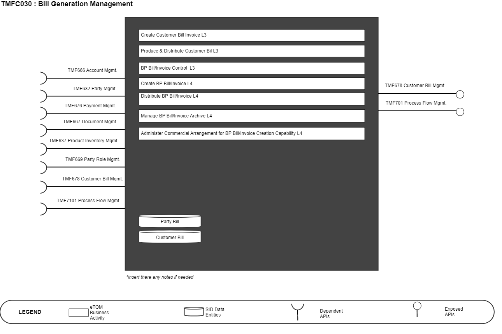
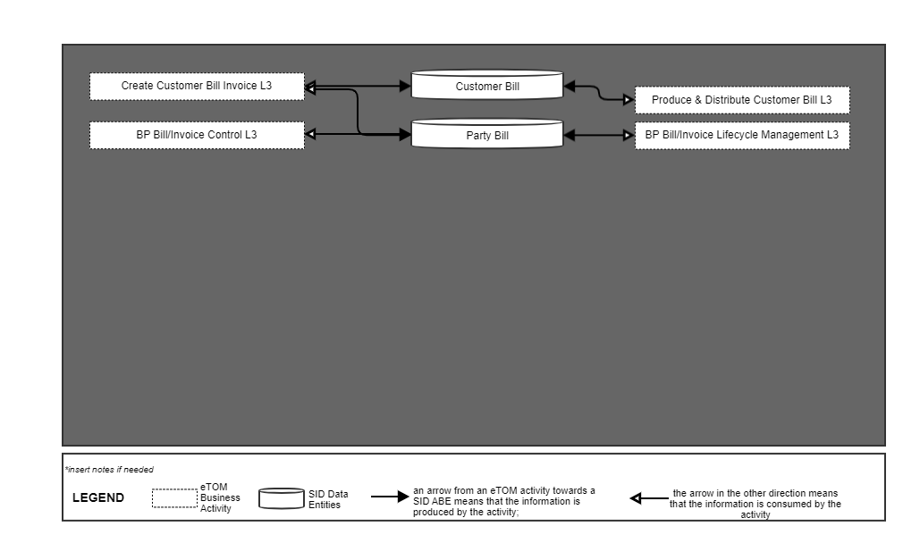
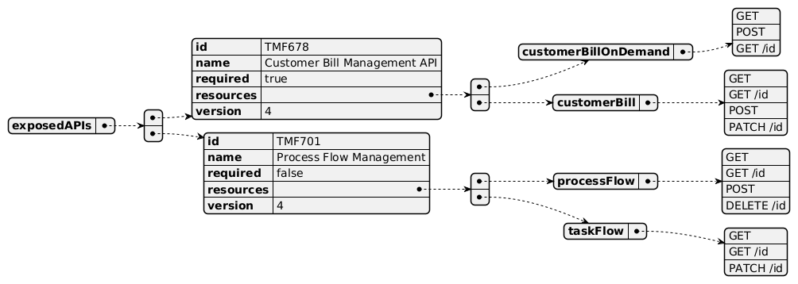
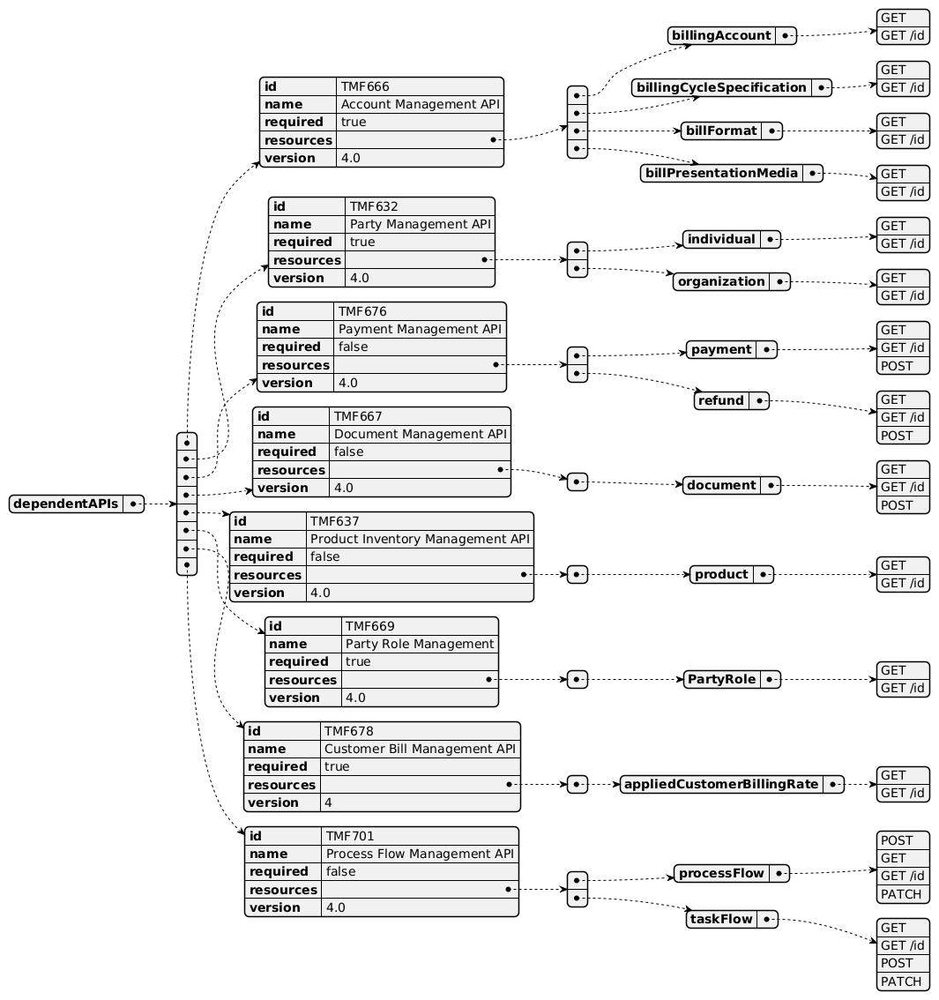
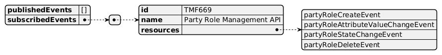

# 1. Overview

| Component Name | ID | Description | ODA Function Block |
| --- | --- | --- | --- |
| Bill Generation Management | TMFC030 | Bill generation management .manages the party invoice management. It addresses the invoice formatting, presentation and dispatching to the proper means of communication. | Party Management |

# 2. eTOM Processes and SID Data Entities

## 2.1. eTOM business activities

*([PlantUML source](media/bill-generation-management-architecture.puml))*

eTOM business activities this ODA Component is responsible for.

| Identifier | Level | Business Activity Name | Description |
| --- | --- | --- | --- |
| 1.3.9 | L2 | Customer Bill Invoice Management | Ensure the bill invoice is created, physically and/or electronically produced and distributed to customers, and that the appropriate taxes, discounts, adjustments, rebates and credits for the products and services delivered to customers have been applied. |
| 1.3.9.2 | L3 | Create Customer Bill Invoice | Production of a timely and accurate invoice in accordance with the specific billing cycles and reflective of the final charges for services, together with any adjustments, delivered to the customer by the Service Provider and respective other parties. |
| 1.3.9.2.1 | L4 | Render & Format Customer Invoice | Render and format the customer bill invoice. |
| 1.3.9.2.2 | L4 | Deliver Electronic Invoice | Deliver the electronic copy of an invoice to customers. |
| 1.3.9.2.3 | L4 | Verify Customer Invoice Quality | Verify Customer invoice quality before distribution to the customer in electronic form and the process responsible for physical invoice production and distribution. |
| 1.3.9.2.4 | L4 | Manage Customer InvoiceQuality Archive | Store the customer invoice for a period of time is to address regulation and/or internal requirements, during which they can be accessed to support any customer or regulator agency inquiries on bill invoices. |
| 1.3.9.3 | L3 | Produce & Distribute Customer Bill | Physical production and distribution of bills to customers in accordance with the specified billing cycle. |
| 1.3.9.3.1 | L4 | Co-ordinate Billing Insertion | Co-ordinate with promotional processes for any billing insertions to be included with the bill. |
| 1.3.9.3.2 | L4 | Establish & Manage Bill Production Cycle | Establish and manage the physical bill production cycle. |
| 1.3.9.3.3 | L4 | Deliver Invoice Information | Deliver the invoice information to the physical production processes. |
| 1.3.9.4 | L3 | Pricing, Discounting, Adjustments & Rebates Application | Ensure that the bill invoice is reflective of all the commercially agreed billable events and any bill invoice adjustments agreed between a Service Provider and the customer. |
| 1.3.9.4.2 | L4 | Apply Pricing, Discounting, Adjustments & Rebates to Customer Account | Determine the customer account or customer specific pricing, charges, discounts, and taxation that should be delivered to the invoice(s) for the customer. |
| 1.6.15 | L2 | BP Bill/Invoice Management | Business Partner Bill/Invoice Management manages the Business Partner bill/invoice process, controls bills/invoices, manages the lifecycle of bills/invoices. A bill is a notice for payment which is supposed to be preceded by an invoice in most cases. |
| 1.6.15.2 | L3 | BP Bill/Invoice Control | Establish and maintain Business Partner bill invoice formats, maintain lists of parties who are eligible for receiving bills/invoices, and define the billing cycles. |
| 1.6.15.2.1 | L4 | Establish & Maintain BP Bill Invoice Format | Establish and maintain BP bill invoice formats, and any interaction with specific parties to modify the format. |
| 1.6.15.2.2 | L4 | Maintain Bill Invoice BP List | Maintain lists of parties who are eligible for receiving bills/invoices. |
| 1.6.15.2.3 | L4 | Define BP Billing Cycle | Define the billing cycles and their dates according to cash flow needs as established by financial management processes. |
| 1.6.15.3.2 | L4 | Create BP Bill/Invoice | Produce a timely and accurate bill/invoice in accordance with a specific billing cycle, on demand after the purchase of an offering, on request by a BP, and so forth. Ensure that a bill/invoice is reflective of the final charges for products, together wit |
| 1.6.15.3.2 | L4 | Create BP Bill/Invoice | Produce a timely and accurate bill/invoice in accordance with a specific billing cycle, on demand after the purchase of an offering, on request by a BP, and so forth. Ensure that a bill/invoice is reflective of the final charges for products, together wit |
| 1.6.15.3.3 | L4 | Distribute BP Bill/Invoice | Provide bills/invoices to one or more parties and ensure the delivery of bills/invoices to one or more parties. |
| 1.6.15.3.4 | L4 | Manage BP Bill/Invoice Archive | Store a BP bill/invoice for a period of time to address regulation and/or internal requirements, during which it can be accessed to support any BP, such as a government/regulator agency or internal BP, inquiries about a bill/invoice. |
| 1.6.15.3.5 | L4 | Receive BP Bill/Invoice | Receive and record the bill/invoice from a BP . Compare a BP bill/invoice against all transactions with the BP that would result in a bill/invoice being sent to the enterprise. Manage the interactions between a BP and an enterprise. Approve a BP bill/invo |
| 1.6.15.3.6 |   | Administer Commercial Arrangement for BP Bill/Invoice Creation Capability | Establish the requirements for, and manage the agreed commercial arrangements with, appropriate outsourced parties of the creation capabilities. |

## 2.2. SID ABEs

SID ABEs this ODA Component is responsible for:

*: if SID ABE Level 2 is not specified this means that all the L2 business entities must be implemented, else the L2 SID ABE Level is specified.

| SID ABE Level 1 | SID ABE Level 2 (or set of BEs)* |
| --- | --- |
| Party Bill ABE | n/a |
| Customer Bill ABE | n/a |

## 2.3. eTOM L2 - SID ABEs links

eTOM L2 vS SID ABEs links for this ODA Component.

*([PlantUML source](media/etom-sid-bill-links.puml))*

## 2.4. Functional Framework Functions

| Function ID | Function Name | Function Description | Sub-Domain Functions Level 1 | Sub- Domain Functions Level 2 |
| --- | --- | --- | --- | --- |
| 62 | Invoice Items Listing | Invoice Items Listing lists all invoice items for a specific invoice. | Invoice Management | Invoicing |
| 63 | Invoice Listing | Invoice Listing function will list all invoices for a customer both over time and for customers with multiple invoices. | Invoice Management | Invoicing |
| 65 | Bill Image Presentation | Bill Image Presentation provides presentation of an exact bill image or after invoking a transactional document generation function. | Invoice Management | Invoicing |
| 309 | Invoice Balance Calculation | Provides the means to calculate the balance due for an invoice/bill. | Invoice Management | Invoicing |
| 310 | Invoice Charges Compilation | Invoice Charges Compilation assembles charges (including charge distribution- charges incurred by other customers), credits, taxes, fees and adjustments that affect the balance due. | Invoice Management | Invoicing |
| 312 | Invoice Detail Collection | Provides appropriate levels of detail regarding items on the invoice. This detail is provided to revenue reporting and/or Bill Format &; Render. | Invoice Management | Invoicing |
| 311 | Invoice Totals Calculation | Provides subtotals and totals at various levels. | Invoice Management | Invoicing |
| 329 | Invoice Tax Calculation | "Invoice Tax Calculation provides the necessary functionality to calculate taxes, including surcharges and fees, where applicable. This function can occur within the Invoicing application or through the use of an external Tax module." | Invoice Management | Invoicing |

# 3. TMF OPEN APIs & Events

The following part covers the APIs and Events; This part is split in 4: • List of Exposed APIs - This is the list of APIs available from this component. • List of Dependent APIs - In order to satisfy the provided API, the component could require the usage of this set of required APIs. • List of Events (generated & consumed ) - The events which the component may generate is listed in this section along with a list of the events which it may consume. Since there is a possibility of multiple sources and receivers for each defined event. <Note to be inserted into ODA Component specifications: If a new Open API is required, but it does not yet exist. Then you should include a textual description of the new Open API, and it should be clearly noted that this Open API does not yet exist. In addition a Jira epic should be raised to request the new Open API is added, and the Open API team should be consulted. Finally, a decision is required on the feasibility of the component without this Open API. If the Open API is critical then the component specification should not be published until the Open API issue has been resolved. Alternatively if the Open API is not critical, then the specification could continue to publication. The result of this decision should be clearly recorded.>

## 3.1. Exposed APIs

Following diagram illustrates API/Resource/Operation:

*([PlantUML source](media/exposed-apis-structure.puml))*

| API ID | API Name | Mandatory / Optional | Operations |
| --- | --- | --- | --- |
| TMF678 | Customer Bill Management | Mandatory | customerBillOnDemand • GET • GET /id • POST customerBill • GET • GET /id • POST • PATCH /id : |
| TMF701 | Process Flow Management | Optional | processFlow: • GET • GET /id • POST • DELETE /id taskFlow: • GET • GET /id • PATCH /id |

## 3.2. Dependant APIs

Following diagram illustrates API/Resource/Operation potentially used by the product catalog component:

*([PlantUML source](media/dependent-apis-structure.puml))*

| API ID | API Name | Mandatory / Optional | Operations |
| --- | --- | --- | --- |
| TMF666 | Account Management API | Mandatory | billingAccount: • GET • GET /id billingCycleSpecification: • GET • GET /id billFormat: • GET • GET /id billPresentationMedia: • GET • GET /id |
| TMF632 | Party Management API | Optional | individual: • GET • GET /id organization: • GET • GET /id |
| TMF676 | Payment Management API | Optional | payment: • GET • GET /id • POST refund: • GET • GET /id • POST |
| TMF667 | Document Management API | Optional | document: • GET • GET /id • POST |
| TMF637 | Product Inventory Management API | Optional | product: • GET • GET /id |
| TMF669 | Party Role Management API | Optional | partyRole: • GET • GET /id |
| TMF678 | Customer Bill Management API | Mandatory | appliedCustomerBillingRate: • GET • GET /id |
| TMF701 | Process Flow Management API | Optional | processFlow: • POST • GET • GET /id • PATCH /id taskFlow: • GET • GET /id • POST • PATCH /id |

## 3.3. Events

The diagram illustrates the Events which the component may publish and the Events that the component may subscribe to and then may receive. Both lists are derived from the APIs listed in the preceding sections.

*([PlantUML source](media/events-structure.puml))*

The type of event could be: • Create : a new resource has been created (following a POST). • Delete: an existing resource has been deleted. • AttributeValueChange: an attribute from the resource has changed - event structure allows to pinpoint the attribute. • InformationRequired: an attribute should be valued for the resource preventing to follow nominal lifecycle - event structure allows to pinpoint the attribute. • StateChange: resource state has changed.

# 4. Machine Readable Component Specification

Refer to the ODA Component table for the machine-readable component specification file for this component.
