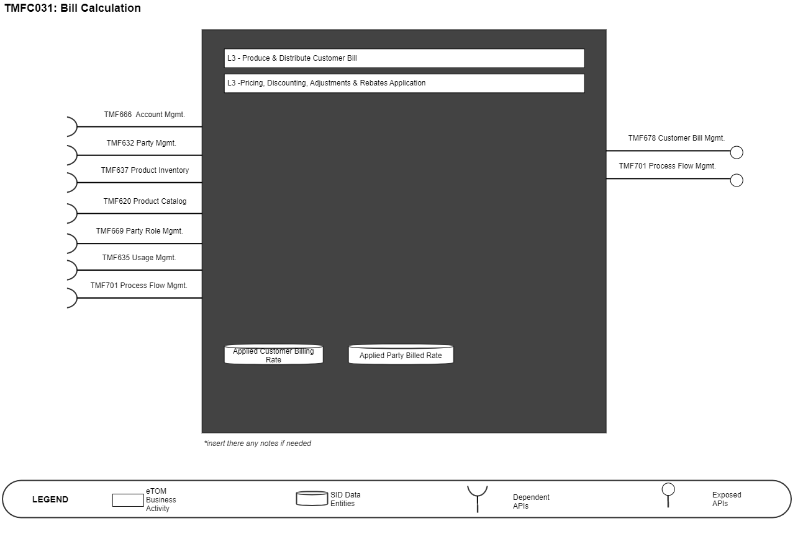
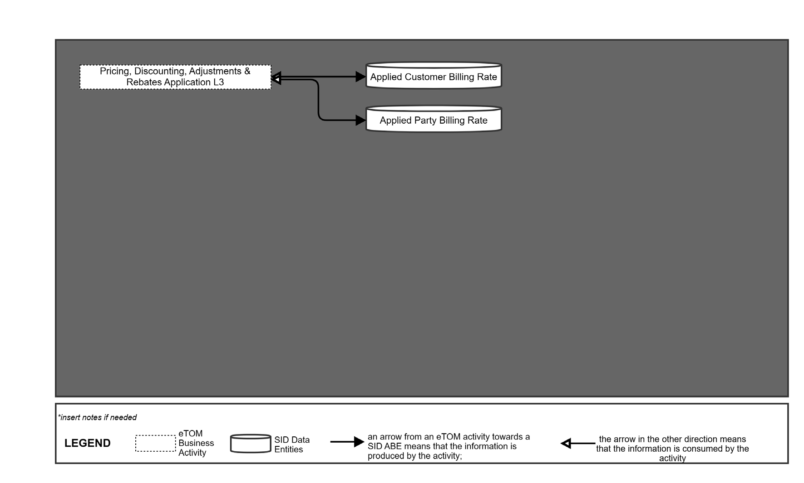
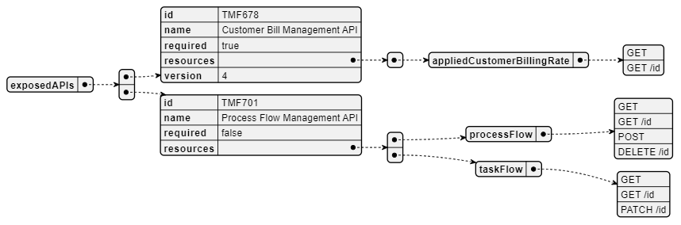
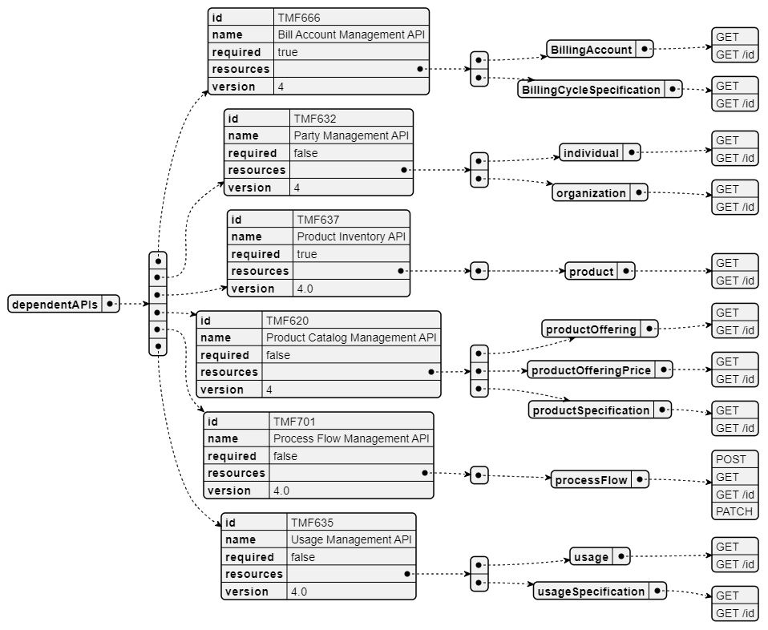
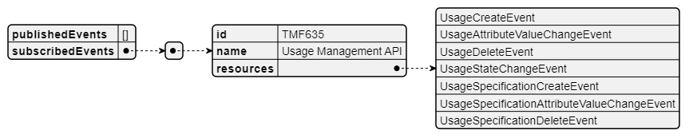

# 1. Overview

| Component Name | ID | Description | ODA Function Block |
| --- | --- | --- | --- |
| Bill Calculation | TMFC031 | The Bill Calculation processes all charges against billing accounts during bill cycles. Bill Calculation can be executed both on a cyclic basis and on demand. It performs calculations with bill compilation of charges, credits, fees & taxes, including pro rata, at various levels, such as product and/or account level that have been generated since the last run for that account, applying promotions and discounts as well. | Core Commerce Management |

*([PlantUML source](media/bill-calculation-architecture.puml))*

# 2. eTOM Processes and SID Data Entities

## 2.1. eTOM business activities

eTOM business activities this ODA Component is responsible for.

| Identifier | Level | Business Activity Name | Description |
| --- | --- | --- | --- |
| 1.3.9 | L2 | Customer Bill Invoice Management | Ensure the bill invoice is created, physically and/or electronically produced and distributed to customers, and that the appropriate taxes, discounts, adjustments, rebates and credits for the products and services delivered to customers have been applied. |
| 1.3.9.4 | L3 | Pricing, Discounting, Adjustments & Rebates Application | Ensure that the bill invoice is reflective of all the commercially agreed billable events and any bill invoice adjustments agreed between a Service Provider and the customer. |
| 1.3.9.4.1 | L4 | Obtain Billing Events | Accept billing events that have been collected, translated, correlated, assembled, guided and service rated before determining the information would be applied to the customer’s bill invoice(s). |
| 1.3.9.4.2 | L4 | Apply Pricing, Discounting, Adjustments & Rebates to Customer Account | Determine the customer account or customer specific pricing, charges, discounts, and taxation that should be delivered to the invoice(s) for the customer. |
| 1.3.9.4.3 | L4 | Apply Agreed Customer Bill Adjustment | Apply and review any adjustment agreed in the previous billing period and make these included to the bill invoice. |
| 1.6.15 | L2 | BP Bill/Invoice Management | Business Partner Bill/Invoice Management manages the Business Partner bill/invoice process, controls bills/invoices, manages the lifecycle of bills/invoices. A bill is a notice for payment which is supposed to be preceded by an invoice in most cases. |
| 1.6.15.1 | L3 | BP Bill/Invoice Process Management | Make certain that there is capability so that the Bill Invoice Management processes can operate effectively and design and develop an enterprise's invoicing process. |
| 1.6.15.3 | L3 | BP Bill/Invoice Lifecycle Management | Ensure bills/invoices are created, physically and/or electronically produced and distributed to parties, and that the appropriate taxes, discounts, adjustments, rebates and credits for the products delivered to parties have been applied. |
| 1.6.15.3.1 | L4 | Apply BP Pricing, Discounting, Adjustments & Rebates | Ensure that a bill/invoices is reflective of all the commercially agreed billable events and any bill/invoice adjustments agreed between an enterprise and a BP. |
| 1.6.15.3.5 | L4 | Receive BP Bill/Invoice | Receive and record the bill/invoice from a BP . Compare a BP bill/invoice against all transactions with the BP that would result in a bill/invoice being sent to the enterprise. Manage the interactions between a BP and an enterprise. Approve a BP bill/invoice |

## 2.2. SID ABEs

SID ABEs this ODA Component is responsible for:

| SID ABE Level 1 | SID ABE Level 2 (or set of BEs)* |
| --- | --- |
| Applied Customer Billing Rate ABE | n/a |
| Applied Party Billing Rate ABE | n/a |

*: if SID ABE Level 2 is not specified this means that all the L2 business entities must be implemented, else the L2 SID ABE Level is specified.

## 2.3. eTOM L2 - SID ABEs links

eTOM L2 vS SID ABEs links for this ODA Component.

*([PlantUML source](media/etom-sid-bill-calculation-links.puml))*

## 2.4. Functional Framework Functions

*Discounting may apply to different levels and for this component it refers to end of cycle discounts that cannot be managed or applied in Product Configurator or Product Usage Management.

| Function ID | Function Name | Function Description | Aggregate Function Level 1 | Aggregate Function Level 2 |
| --- | --- | --- | --- | --- |
| 67 | Usage Summary and Details Presentation | Usage Summary and Details Presentation presents usage summary and details (billed and non- billed) for a specific time period. | Invoice Management | Invoicing |
| 87 | Billing Event Processing Guiding | Billing Event Processing Guiding support for a consistent processing. | Invoice Management | Invoicing |
| 316 | Billing Administration | The Billing Administration function manages the data that are necessary to perform the bill calculation: billing cycle data, management of runs, groups and cycles of invoicing. | Invoice Management | Invoicing |
| 399 | Billing Management Integration | Billing Management Integration provide a Virtual Network Operators online access function to make them self-sufficient for Billing management. Including the use of VNO/Dealer data fencing. | Invoice Management | Invoicing |
| 32 | Billing Initialization | Billing Initialization initializes the bill and sends to the Bill Calculation application the required information for accounts that are going to be processed. | Invoice Management | Invoicing |
| 72 | Billing Account Price Plan Determining | Billing Account Price Plan Determining associates a charge record with the appropriate price plan. | Invoice Management | Billing Account Administration |
| 70 | Charge To Billing Account Distribution | Charge To Billing Account Distribution identifies the related prepaid or postpaid billing account for a given charge (recurring, one time, usage). | Invoice Management | Billing Account Administration |
| 69 | Charge To Billing Account Identification | Charge To Billing Account Identification associates incurred charge to the billing account liable for its payment. | Invoice Management | Billing Account Administration |
| 68 | Charges to Billing Statement Identification | Charges to Billing Statement Identification identifies what charges are to be included in the statement. | Invoice Management | Billing Account Administration |
| 158 | Commitment Tracking Result Determining | Commitment Tracking Result Determining determines the outcome of the evaluation (financial benefits or penalties) in the context of the gathered data for commitment tracking. | Rating and Follow up | Bill Calculation |
| 159 | Commitment Tracking Terms & Conditions Evaluation | Commitment Tracking Terms & Conditions Evaluation evaluates the terms and conditions in the context of the gathered data for commitment tracking. | Rating and Follow up | Bill Calculation |
| 160 | Commitment Tracking Data Collection | Commitment Tracking Data Collection collects data to be used in the evaluation of the terms and conditions to monitor financial commitments between the customer and the provider. | Rating and Follow up | Bill Calculation |
| 256 | Customer Bill Usage and Charges Viewing | Customer Bill Usage and Charges Viewing provides an internet technology driven interface to the customer to undertake Usage and charges comparison and unbilled charges view directly for themselves. | Rating and Follow up | Bill Calculation |
| 89 | Billing Event Aggregation | Billing Event Aggregation is part of the Billing Event Processing to supply aggregated billing events to the Billing System. | Invoice Management | Invoicing |
| 90 | Billing Event Processing Analyzing | Billing Event Processing Analyzing provides billing event analysis and billing event aggregations analysis to control the usage data sent to the Billing System. | Invoice Management | Invoicing |
| 183 | Bill Charges Aggregation | Bill Charges Aggregation function determines charges (including recurring, one time and usage charges) for purchased products and services in a given bill run based on the customer price plan set at time of the customer order/contract negotiation. | Rating and Follow up | Bill Calculation |
| 60 | Split Bill Charge Distribution | Split Bill Charge Distribution provides charge and event distribution to support a split bill. | Rating and Follow up | Tariff Calculation and Rating |
| 184 | Currency Conversion | Currency Conversion identifies the required currency conversion if any needed to appropriately bill the customer. | Rating and Follow up | Bill Calculation |
| 61 | On Demand Bill Calculation | On Demand Bill Calculation function will invoke a bill calculation on demand for e.g. a purchase. | Rating and Follow up | Bill Calculation |
| 300 | Discounts Calculation* | Discounts Calculation determines charge discounts based on pricing plan; including discounts on recurring, one time, and usage charges. Discounts may be applied at different levels such as cross product, cross location, or cross customer (all customers that are part of a given group plan – some affiliation). The discounts can be apportioned across multiple events. | Rating and Follow up | Tariff Calculation and Rating |
| 55 | Price and Discount Calculation* | Price and Discount Calculation applies pricing and discounting rules and algorithms in the context of the assembled information concerning Products (i.e. instances of Product). | Rating and Follow up | Tariff Calculation and Rating |

# 3. TMF OPEN APIs & Events

The following part covers the APIs and Events; This part is split in 3: • List of Exposed APIs - This is the list of APIs available from this component. • List of Dependent APIs - In order to satisfy the provided API, the component could require the usage of this set of required APIs. • List of Events (generated & consumed ) - The events which the component may generate is listed in this section along with a list of the events which it may consume. Since there is a possibility of multiple sources and receivers for each defined event.

## 3.1. Exposed APIs

Following diagram illustrates API/Resource/Operation:

*([PlantUML source](media/exposed-apis-structure.puml))*

| API ID | API Name | API Version | Mandatory / Optional | Operations |
| --- | --- | --- | --- | --- |
| TMF678 | Customer Bill Management | 4 | Mandatory | appliedCustomerBillingRate: • GET • GET /id |
| TMF701 | Process Flow Management | 4 | Optional | processFlow: • GET • GET /id • POST • DELETE /id taskFlow: • GET |

Note: TMF678 only for applied customer bill resource

## 3.2. Dependent APIs

Following diagram illustrates API/Resource/Operation potentially used by the product catalog component:

*([PlantUML source](media/dependent-apis-structure.puml))*

| API ID | API Name | API Version | Mandatory / Optional | Operations | Rationales |
| --- | --- | --- | --- | --- | --- |
| TMF6 66 | AccountManagem ent | 4 | Mandatory | billingAccount: GET, GET /id,POST, PATCH /id, DELETE /id billingCycelSpecific ation: GET, GET /id,POST, PATCH | Billing Account and Billing Cycle information required to understand what BillingAccount to apply the |

| API ID | API Name | API Version | Mandatory / Optional | Operations | Rationales |
| --- | --- | --- | --- | --- | --- |
|   |   |   |   | /id, DELETE /id billingFormat: GET, GET /id, POST, PATCH /id, DELETE /id billing PresentationMedia: GET, GET /id, POST, PATCH /id, DELETE /id | customer rate to and the Billing Cycle period. |
| TMF6 32 | PartyManagement | 4 | Optional | individual: GET, GET /id organization: GET, GET /id |   |
| TMF6 37 | Productinventory | 4 | Mandatory | product: GET, GET /id | To retrieve installed product and price information to determine the applied rate. |
| TMF6 20 | Product Catalog | 4 | Optional | productOffering: GET, GET /id productOfferingPric e: GET, GET /id productSpecificatio n: GET, GET /id |   |
| TMF6 69 | PartyRoleManage ment | 4 | Optional | partyRole: GET, GET /id |   |
| TMF6 35 | Usage Management | 4 | Optional | usage: GET, GET /id usageSpecification: GET |   |
| TMF7 01 | ProcessFlowMan agement | 4 | Optional | processFlow: GET, GET /id, POST, PATCH /id |   |

## 3.3. Events

The diagram illustrates the Events which the component may publish and the Events that the component may subscribe to and then may receive. Both lists are derived from the APIs listed in the preceding sections.

*([PlantUML source](media/events-structure.puml))*

# 4. Machine Readable Component Specification

Refer to the ODA Component table for the machine-readable component specification file for this component.
