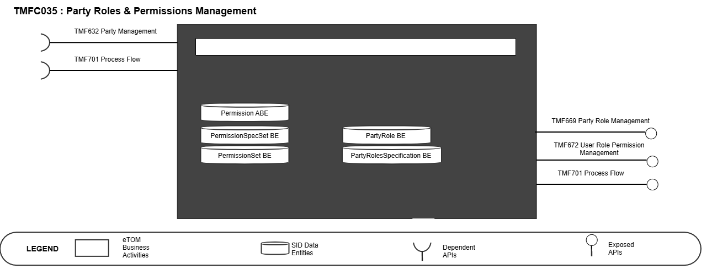
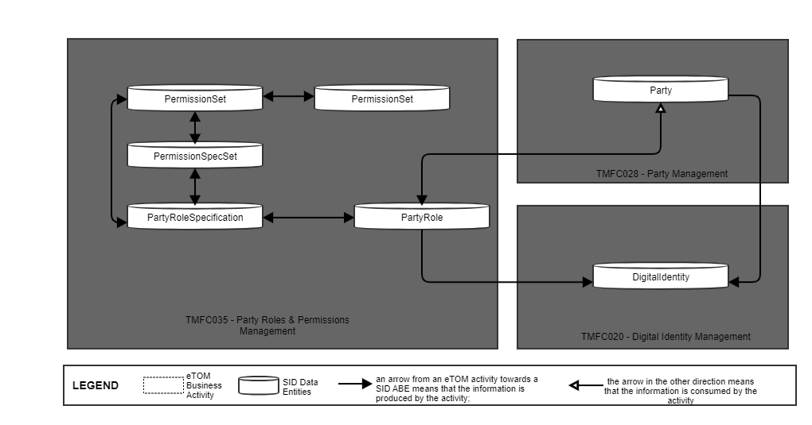
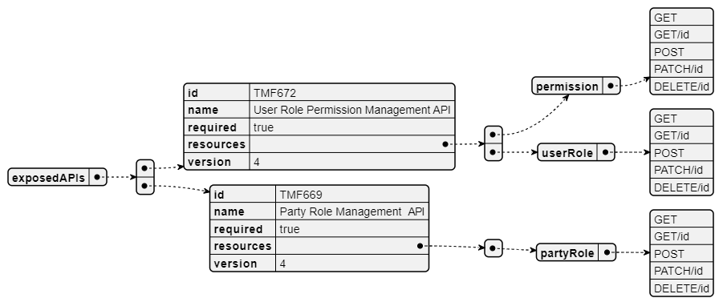
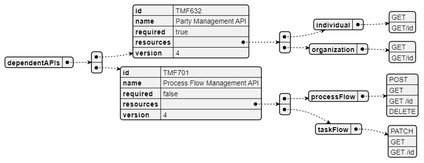
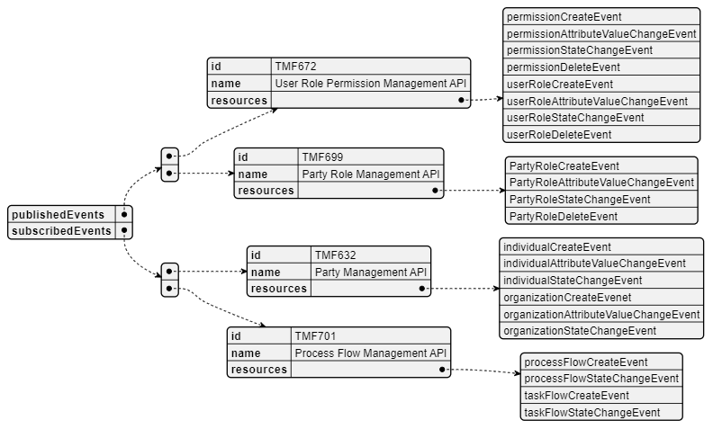

# 1. Overview

| Component Name | ID | Description | ODA Function Block |
| --- | --- | --- | --- |
| Party Roles & Permissions Management | TMFC035 | Party Roles & Permissions Management component aims to manage and expose roles and related permissions. Permissions Management component allows to: • create, modify, and delete permissions. • delegate permissions When a specific role is assigned, a set of permissions is inherited. | Party Management |

*([PlantUML source](media/permissions-management-architecture.puml))*

# 2. eTOM Processes, SID Data Entities and

Functional Framework Functions

## 2.1. eTOM business activities

eTOM business activities this ODA Component is responsible for.

## 2.2. SID ABEs

SID ABEs this ODA Component is responsible for:

*: if SID ABE Level 2 is not specified this means that all the L2 business entities must be implemented, else the L2 SID ABE Level is specified.

| SID ABE Level 1 | SID ABE Level 2 (or set of BEs)* |
| --- | --- |
| Party ABE | Permission Set Specification BE |
|   | Permission Set BE |
|   | Permission BE |
|   | Party Role BE |
|   | Party Roles Specification BE |
| Customer Party ABE |   |
| Business Partner Party Role |   |
| Enterprise Party Role |   |
| Market Sales Party Roles ABE |   |
| Service Party Roles ABE |   |
| Resource Party Roles ABE |   |

## 2.3. eTOM L2 - SID ABEs links

eTOM L2 vS SID ABEs links for this ODA Component.

*([PlantUML source](media/etom-sid-permission-role-links.puml))*

## 2.4. Functional Framework Functions

| Function ID | Function Name | Function Description | Aggregate Function Level 1 | Aggregate Function Level 2 |
| --- | --- | --- | --- | --- |
| 899 | Single Sign- On Access Control | Single Sign-On Access Control grant access in cooperation with central Authentication and Authorization functions to secure the most updated security. | Identification and Permission Management | Identification and Authentication |
| 906 | PKI and Digital Certificates Systems Integration | PKI and Digital Certificates Systems Integration provides integration to Public Key Infrastructure Systems that provides digital certificates, and the support to use public keys and digital certificates. | Identification and Permission Management | Identification and Authentication |
| 1025 | Application Access | Application Access provide access interfaces with authentication and authorization control for the requests and responses related to the application’s functionality, including event logging and usage statistics. | Identification and Permission Management | Identification and Authentication |
| 897 | Building Access Control | Building Access Control checks, stops or allow physical access to facilities according to access roles and rules. | Identification and Permission Management | Permission Control |
| 900 | Authorization Control Management | Authorization Control Management sets and administrates the Role and Rule based access to functions. | Identification and Permission Management | Permission Control |
| 898 | Application Security Management | Application Security Management administrates the roles and rules that applies to getting the right to use an application. | Identification and Permission Management | Permission Definition |
| 260 | Anonymous User Account Creation | Anonymous User Account Creation provides account creation for anonymous user account, either through external customer self empowered fulfillment function or internal customer support access. | Identification and Permission Management | Digital Identity Management |
| 1181 | Party Role Assignment | n/a | Identification and Permission Management | Role and Permission Assignment / Configuration |
| 1182 | Permission Perimeter Configuration | n/a | Identification and Permission Management | Role and Permission Assignment / Configuration |

# 3. TM Forum Open APIs & Events

The following part covers the APIs and Events; This part is split in 3: • List of Exposed APIs - This is the list of APIs available from this component. • List of Dependent APIs - In order to satisfy the provided API, the component could require the usage of this set of required APIs. • List of Events (generated & consumed ) - The events which the component may generate is listed in this section along with a list of the events which it may consume. Since there is a possibility of multiple sources and receivers for each defined event.

## 3.1. Exposed APIs

Following diagram illustrates API/Resource/Operation:

*([PlantUML source](media/exposed-apis-structure.puml))*

| API ID | API Name | API Version | Mandatory / Optional | Operations |
| --- | --- | --- | --- | --- |
| TMF672 | User Role Permission Management | 4 | Mandatory | GET Permission (Permission, UserRole) GET/id Permission POST Permission PATCH Permission DELETE Permission GET UserRole GET/id UserRole POST UserRole PATCH UserRole DELETE UserRole |
| TMF669 | Party Role Management | 4 | Mandatory | GET partyRole GET/id partyRole POST partyRole PATCH partyRole DELETE partyRole |
| TMF701 | Process Flow | 4 | Optional | n/a |

## 3.2. Dependent APIs

Following diagram illustrates API/Resource/Operation potentially used by the product catalog component:

*([PlantUML source](media/dependent-apis-structure.puml))*

| API ID | API Name | API Version | Mandatory / Optional | Operations | Rationales |
| --- | --- | --- | --- | --- | --- |
| TMF632 | Party Management | 4 | Mandatory | GET induvidual / organization GET/ID induvidual / organization | All roles and identities need to be accosiated with a valid and current Party data object. |
| TMF701 | Process Flow | 4 | Optional | na |   |

## 3.3. Events

The diagram illustrates the Events which the component may publish and the Events that the component may subscribe to and then may receive. Both lists are derived from the APIs listed in the preceding sections.

*([PlantUML source](media/events-structure.puml))*

# 4. Machine Readable Component Specification

Refer to the ODA Component table for the machine-readable component specification file for this component.
