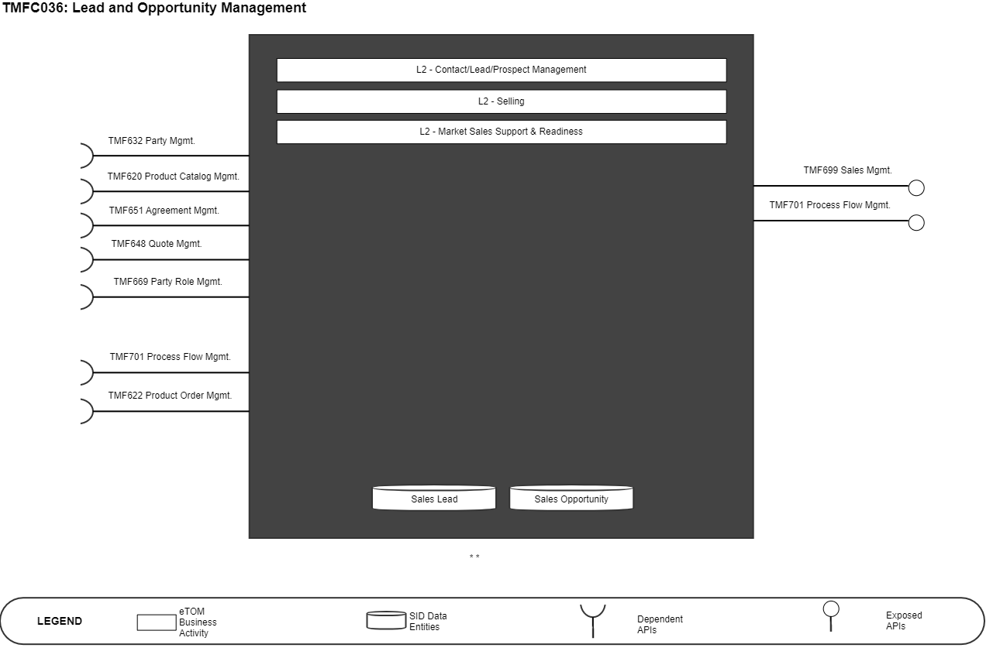
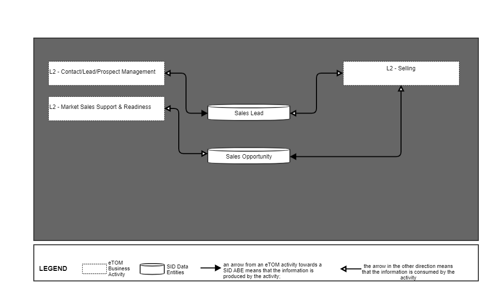
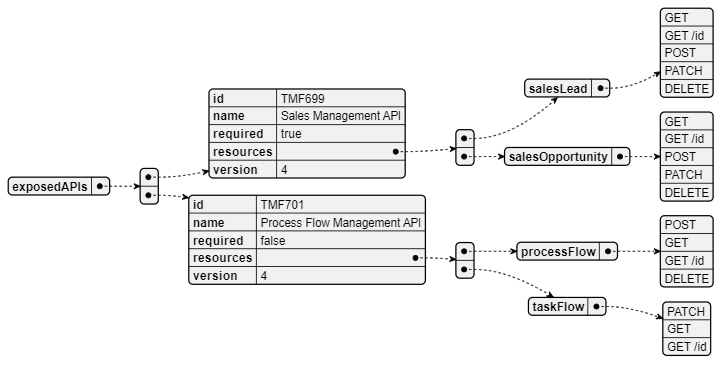
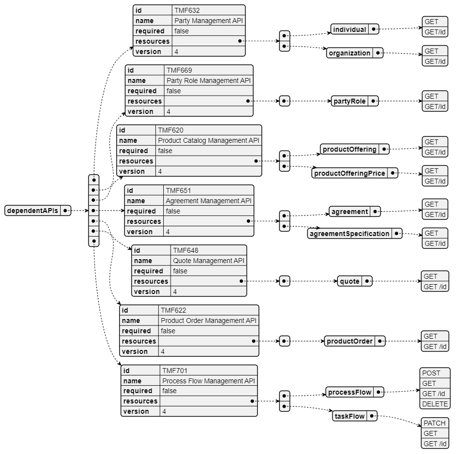
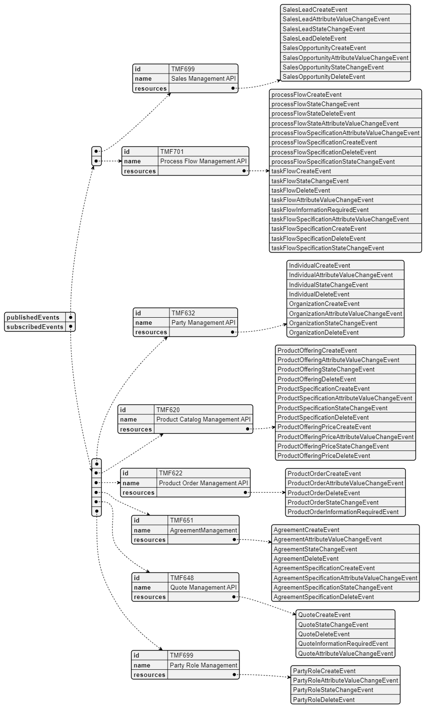

# 1. Overview

| Component Name | ID | Description | ODA Function Block |
| --- | --- | --- | --- |
| Lead and Opportunity Management | TMFC036 | Lead and Opportunity Management component provides the functionality for lead and opportunity capture, qualification, reporting, and support during the pre-sales stage. | Party Management |

*([PlantUML source](media/lead-and-opportunity-management-architecture.puml))*

# 2. eTOM Processes, SID Data

Entities and Functional Framework Functions

## 2.1. eTOM business activities

eTOM business activities this ODA Component is responsible for.

| Identifier | Level | Business Activity Name | Description |
| --- | --- | --- | --- |
| 1.1.11 | 2 | Contact/Lead/Prospect Management | Develop the appropriate relationships with contacts, leads, and prospects with the intent to convert them to consumers, such as customers, or providers, such as partners, of an enterprise's offerings. |
| 1.1.11.1 | 3 | Manage Sales Contact | Manage all sales contacts between potential or existing parties and the enterprise. |
| 1.1.11.2 | 3 | Manage Sales Lead | Collect and administer a sales lead and the associated probabilities of the lead becoming a prospect. |
| 1.1.11.3 | 3 | Manage Sales Prospect | Match a sales prospect with the most appropriate products and ensure that a prospect is handled appropriately. |
| 1.1.9 | 2 | Selling | Responsible for managing prospective customers, for qualifying and educating customers, and matching customer expectations Managing prospective parties with whom an enterprise may do business, such as potential existing or new customers and partners, for qualifying and educating them, and ensuring their expectations are met. |
| 1.1.9.1 | 3 | Qualify Selling Opportunity | Ensure that a sales prospect is qualified in terms of any associated risk and the amount of effort required to achieve a sale. |
| 1.1.9.3 | 3 | Acquire Sales Prospect Data | Capture and record all pertinent sales prospect data required for qualifying an opportunity and for the initiation, realization, and deployment of the agreed sales proposal. |
| 1.1.7 | 2 | Market Sales Support & Readiness | Market Sales Support & Readiness processes ensure the support capability is in place to allow the CRM Fulfillment, Assurance and Billing processes to operate effectively. |
| 1.1.7.2 | 3 | Support Selling | Administer and manage the operation of the various sales channels and to ensure that there is capability (for example, information, materials, systems, and resources) to support the Selling processes. |
| 1.1.7.5 | 3 | Manage Sales Accounts | Manage the sales accounts assigned to the sales channel on a day-day basis. |

## 2.2. SID ABEs

SID ABEs this ODA Component is responsible for:

*: if SID ABE Level 2 is not specified this means that all the L2 business entities must be implemented, else the L2 SID ABE Level is specified. ** Sales Lead and Sales Opportunity are currently BEs in Sales Lead and Opportunity ABE Level 1 but refer to SID JIRA asking to create 2 ABEs Level 2.

| SID ABE Level 1 | SID ABE Level 2 (or set of BEs)* |
| --- | --- |
| Sales Lead and Opportunity ABE | Sales Lead ** |
|   | Sales Opportunity ** |

## 2.3. eTOM L2 - SID ABEs links

eTOM L2 vS SID ABEs links for this ODA Component.

*([PlantUML source](media/etom-sid-lead-opportunity-links.puml))*

## 2.4. Functional Framework Functions

| Function ID | Function Name | Function Description | Sub-Domain Functions Level 1 | Sub-Domain Functions Level 2 |
| --- | --- | --- | --- | --- |
| 394 | Sales Aids Support | Sales Aids Support provides job aids functions to access active aids like template or wizard types of context-aware scripting to e.g. aid lead qualification as an example. | Sales Management | Opportunity Management |
| 372 | Sales Opportunity Management | Sales Opportunity Management creates, manages, and develop sales opportunities for customers. | Sales Management | Opportunity Management |
| 375 | Funnel Assigning | Funnel Assigning provides the necessary functionality to assign sales personnel to leads within a given funnel/pipeline. | Presales Management | Sales Lead Management |
| 374 | Funnel Creation | Funnel Creation provides the necessary functionality to create a new sales funnel or pipeline | Presales Management | Sales Lead Management |
| 376 | Funnel Leads Tracking | Funnel Leads Tracking provides the necessary functionality to track and manage the funnel process of the various leads and opportunities. | Presales Management | Sales Lead Management |
| 726 | Sales Lead Capturing | Sales Lead Capturing handles the generation of leads. A lead can be generated from many sources and customer interactions including the result of a targeted marketing campaign. Potential customer information is obtained from external sources or from internally generated data. | Presales Management | Sales Lead Management |

# 3. TM Forum Open APIs & Events

The following part covers the APIs and Events; This part is split in 3: • List of Exposed APIs - This is the list of APIs available from this component. • List of Dependent APIs - In order to satisfy the provided API, the component could require the usage of this set of required APIs. List of Events (generated & consumed )- The events which the component may generate is listed in this section along with a list of the events which it may consume. Since there is a possibility of multiple sources and receivers for each defined event.

## 3.1. Exposed APIs

Following diagram illustrates API/Resource/Operation:

*([PlantUML source](media/exposed-apis-structure.puml))*

| API ID | API Name | Mandatory / Optional |   | Operations |
| --- | --- | --- | --- | --- |
| TMF699 | Sales Management API | Mandatory | salesLead: - GET - GET /id - POST - PATCH |   |
| TMF701 | Process Flow Management | Optional | processFlow: - POST - GET - GET /id - DELETE taskFlow: - PATCH - GET - GET /id |   |
| TMF688 | Event Management | Optional |   |   |

## 3.2. Dependent APIs

Following diagram illustrates API/Resource/Operation:

*([PlantUML source](media/dependent-apis-structure.puml))*

| API ID | API Name | Mandatory / Optional | Operations | Rationales |
| --- | --- | --- | --- | --- |
| TMF632 | Party Management | Optional | individual: - GET - GET/id organization: - GET - GET/id | n/a |
| TMF620 | Product Catalog Management | Optional | productOffering: - GET - GET/id productOfferingPrice: - GET - GET/id | n/a |
| TMF651 | Agreement Management | Optional | agreement: - GET - GET/id agreementSpecification: - GET - GET/id | n/a |
| TMF648 | Quote Management | Optional | quote: - GET - GET /id | n/a |
| TMF669 | Party Role Management | Optional | partyRole: - GET - GET/id | n/a |
| TMF701 | Process Flow Management | Optional | processFlow: - POST - GET - GET /id - DELETE taskFlow: - PATCH - GET - GET /id | n/a |
| TMF688 | Event Management | Optional | Get, Get Id |   |
| TMF622 | Product Order Mgmt | Optional | productOrder: - GET - GET /id | n/a |

## 3.3. Events

The diagram illustrates the Events which the component may publish and the Events that the component may subscribe to and then may receive. Both lists are derived from the APIs listed in the preceding sections.

*([PlantUML source](media/events-structure.puml))*

# 4. Machine Readable

Component Specification Refer to the ODA Component Directory for the machine-readable component specification file for this component.
