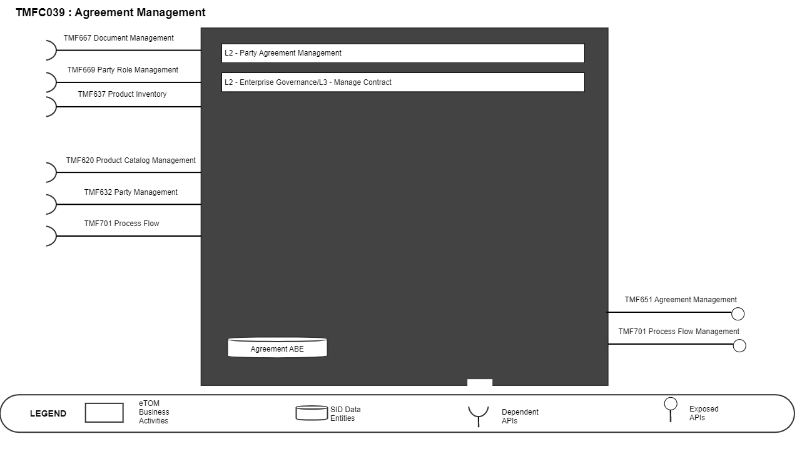
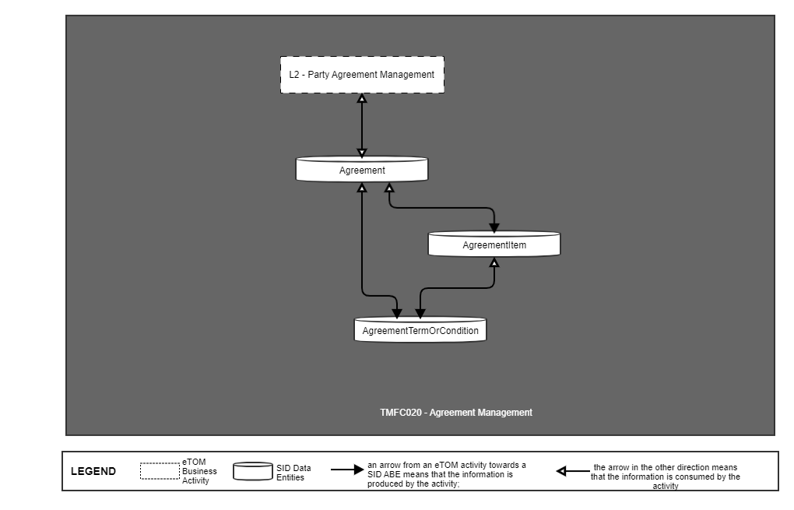
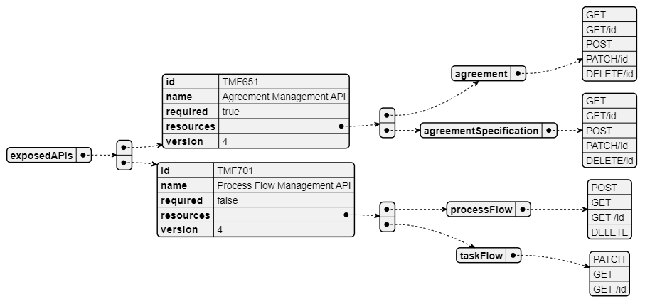
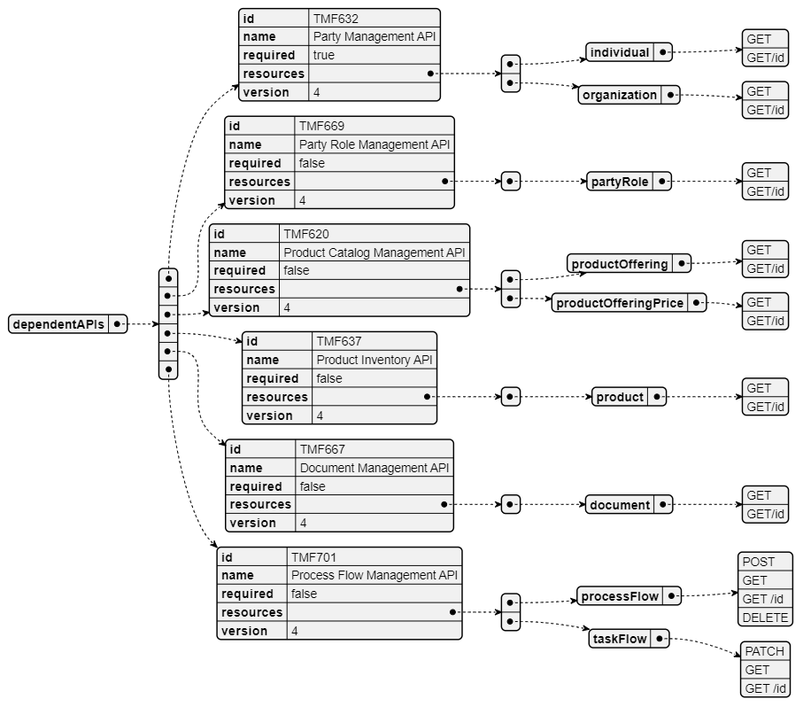
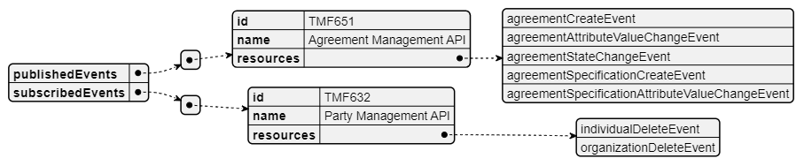

# 1. Overview

| Component Name | ID | Description | ODA Function Block |
| --- | --- | --- | --- |
| Agreement Management | TMFC039 | Agreement Management component is responsible for creating, storing, editing, and tracking agreed arrangements with related terms and conditions over a lifecycle. The component manages offers, records acceptance, and associated considerations and intentions to establish agreements as legally binding. As well this components provides workfows and templates that facilitates collaboration, communication, and negotiation of agreements between parties, and administers the specificities related to translate agreements into contracts, when it is required. It provides a secure storage, version control, compliance management, and renewal notifications for agreements. | Party Management |

*([PlantUML source](media/agreement-management-architecture.puml))*

# 2. eTOM Processes, SID Data Entities and

Functional Framework Functions

## 2.1. eTOM business activities

eTOM business activities this component is responsible for are:

| Identifier | Level | Business Activity Name | Description |
| --- | --- | --- | --- |
| 1.6.5 | L2 | Party Agreement Management | Party Agreement Management manages all aspects of agreements with parties, including customers. Agreements include: • Purchasing agreements for products, services, and resources that meet the enterprise’s needs • On-boarding agreements for a Party's offerings • Service Level Agreements with one or more other parties • Agreements to use a Party as a sales channel • Reusable template agreements that can be used to create any of the above. |
| 1.7.14 | L2 | Enterprise Governance | Enterprise Governance business process manage activities that ensure accountability and control of the strategic direction of the organization. |
| 1.7.14.5 | L3 | Manage Contract | Manage Contract business activity is in charge of managing agreements, from their creation through to their execution by chosen party, as well as the termination of contracts. Manage Contract business activity cover tasks that include managing contract creation, execution of contracts, analysis of contracts to maximize operational and financial performance and reducing financial risk. |

## 2.2. SID ABEs

SID ABEs this component is responsible for are:

eTOM L2 - SID ABEs links

| SID ABE Level 1 | SID ABE L1 Definition | SID ABE Level 2 (or set of BEs) | SID ABE L2 Definition |
| --- | --- | --- | --- |
| Agreement ABE | One form of business interaction in which Parties (for example, Service Providers or Customers) engage is an agreement. An agreement is a contract or arrangement, either written or verbal and sometimes enforceable by law, such as a service level agreement or a customer price agreement. An agreement involves a number of other business entities, such as Products, Services, and/or Resources. | Agreement | A type of BusinessInteraction that represents a contract or arrangement, either written or verbal and sometimes enforceable by law. |
|   |   | AgreementItem | The purpose for an Agreement expressed in terms of a Product, Service, Resource, and/or their respective specifications, inherited from BusinessInteractionItem. |
|   |   | AgreementTermO rCondition | Aspects of the Agreement not formally specified elsewhere in the Agreement and that cannot be captured elsewhere in a formal notation, or automatically monitored and require a more human level of management. |
|   |   | AgreementAuthori zation | BusinessParticpant responsible for approving an Agreement. |
|   |   | AgreementApprov al | A group of AgreementAuthorizations required from the BusinessParticipants involved in the Agreement. |

*([PlantUML source](media/etom-sid-agreement-links.puml))*

## 2.3. Functional Framework Functions

| Function ID | Function Name | Function Description | Aggregate Function Level 1 | Aggregate Function Level 2 |
| --- | --- | --- | --- | --- |
| 1026 | Partner Collaboration Constraints Collection | Partner Collaboration Constraints Collection function collect external and internal constraints that can impact a partner collaboration. The partner strategy definition is impacted by various factors, like partner’s geographical location, governmental regulatory, product and services offered etc. The function also provides capability to consider security and financial risks, environmental and legal issues and existing agreements etc. | Purchasing Strategy Management | Purchasing Strategy Definition |
| 1045 | Partner Agreement Tracking | Partner Agreement Tracking function keeps the association of the partner product offerings with the agreements and tracks anomalies for single products | Business Partner Management | Business Partner Agreement Management |
| 1043 | Partner Agreement Storage and Searching | Partner Agreement Storage and Searching function provide the ability to view Partner's existing agreements, search for partner agreements based on meta-data and to search text strings within agreements. The data can also be mined for partner strategy, negotiation, workflow, and interaction purposes. | Business Partner Management | Business Partner Agreement Management |
| 1044 | Partner Agreement Implementation | Agreement Implementation function provides support for the implementation of the agreement’s terms and conditions to be used by related organizations during operations. | Business Partner Management | Business Partner Agreement Management |
| 1042 | Partner Agreement Creation | Partner Agreement Creation function provide the functionality to automate the creation of an agreement based on templates or from scratch. The function allows us to create and maintain predefined agreement options and templates with terms and conditions (e.g., pricing information, payment clauses, legal texts, etc.) for different purposes and services. | Business Partner Management | Business Partner Agreement Management |
| 1180 | Customer Framework Agreement Approval | Customer Framework Agreement Approval Function manages all approval of Party Roles involved in the Framework Agreement (Customer Roles as well as CSP roles). | Sales Management | Framework Agreement Management |
| 1179 | Customer Framework Agreement Definition | The Customer Framework Agreement Definition Function consists in defining the agreement that describes the commitments and company features valid for associated customer orders. | Sales Management | Framework Agreement Management |
| 363 | Product Agreement Storage | Product Agreement Storage provides functionality necessary to store and make available the Product Agreements. This function allows: • to instantiate or update Product Agreement approved by the customer with their party involved, their configuration, their approvals and their status, • to update Product Agreements status, • to search and read Product Agreements. | Product Agreement Management | Product Agreement Storage |
| 361 | Product Agreement Implementation | Product Agreement Implementation function provides functionality pertaining to the implementation of the Product Agreement (a.k.a. contract) across fulfillment, assurance, and billing according to Product Agreement Specification. A Product Agreement represents the approval by the Customer and the Vendor of all term or conditions of a ProductOffering. | Product Management | Product Agreement Implementation |
| 653 | Contract Management | Contract Management, including establishment, modification, and termination. | Business Partner Management | Business Partner Agreement Management |
| 1042 | Partner Agreement Creation | Partner Agreement Creation function provides the functionality to automate the creation of an agreement | Business Partner Management | Business Partner Agreement Management |
| 1043 | Partner Agreement Storage and Searching | Partner Agreement Storage and Searching function provides the ability to view Partner's existing agreements, search for partner agreements based on meta-data and to search text strings within agreements. The data can also be mined for partner strategy, negotiation, workflow and interaction purposes. | Business Partner Management | Business Partner Agreement Management |
| 1044 | Partner Agreement Implementation | Agreement Implementation function provides support for the implementation of the agreement’s terms and conditions to be used by related organizations during operations. | Business Partner Management | Business Partner Agreement Management |
| 1045 | Partner Agreement Tracking | Partner Agreement Tracking function keeps the association of the partner product offerings with the agreements and tracks anomalies for single products or group of products of the partner. | Business Partner Management | Business Partner Agreement Management |

# 3. TMF OPEN APIs & events

The following part covers the APIs and Events; This part is split in 3: • List of Exposed APIs - This is the list of APIs available from this component. • List of Dependent APIs - In order to satisfy the provided API, the component could require the usage of this set of required APIs. • List of Events (generated & consumed ) - The events which the component may generate is listed in this section along with a list of the events which it may consume. Since there is a possibility of multiple sources and receivers for each defined event.

## 3.1. Exposed APIs

Following diagram illustrates API/Resource/Operation:

*([PlantUML source](media/exposed-apis-structure.puml))*

NOTE: "Resources Model coverage" element has been added to the table

| API ID | API Name | Mandatory / Optional | Operations |
| --- | --- | --- | --- |
| TMF651 | Agreement Management API | Mandatory | agreement: - GET - GET/id - POST - PATCH/id - DELETE/id agreementSpecification: - GET - GET/id - POST - PATCH/id - DELETE/id |
| TMF669 | Process Flow Management API | Optional | processFlow: - POST - GET - GET /id - DELETE taskFlow: - PATCH - GET - GET /id |
| TMF688 | Event | Optional | n/a |

## 3.2. Dependent APIs

Following diagram illustrates API/Resource/Operation:

*([PlantUML source](media/dependent-apis-structure.puml))*

The APIs called by this component and provided by other components are:

| API ID | API Name | Mandatory / Optional | Operation | Rationale |
| --- | --- | --- | --- | --- |
| TMF632 | Party Management API | Mandatory | individual: - GET - GET/id organization: - GET - GET/id | From TMF651_Agreement resource schema, where Agreement vs RelatedPArty relationship is listed as 1,..* |
| TMF672 | User Roles & Permissions | Mandatory | get |   |
| TMF669 | Party Role Management API | Optional | partyRole: - GET - GET/id | n/a |
| TMF620 | Product Catalog Management API | Optional | productOffering: - GET - GET/id productOfferingPrice: - GET - GET/id | n/a |
| TMF637 | Product Inventory API | Optional | product: - GET - GET/id | n/a |
| TMF667 | Document Management API | Optional | document: - GET - GET/id | n/a |
| TMF701 | Process Flow Management API | Optional | processFlow: - POST - GET - GET /id - DELETE taskFlow: - PATCH - GET - GET /id | n/a |
| TMF688 | Event | Optional | get |   |

## 3.3. Events

The diagram illustrates the Events which the component may publish and the Events that the component may subscribe to and then may receive. Both lists are derived from the APIs listed in the preceding sections.

*([PlantUML source](media/events-structure.puml))*

# 4. Machine Readable Component Specification

Refer to the ODA Component table for the machine-readable component specification file for this component.
