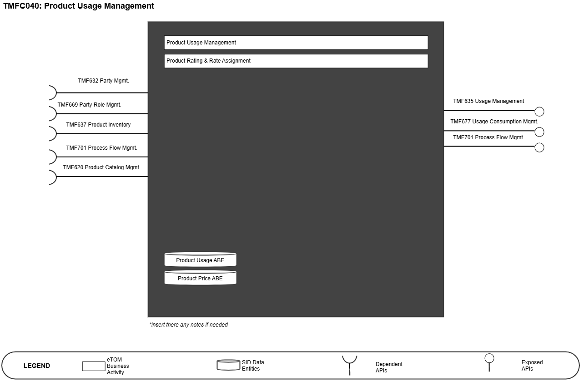
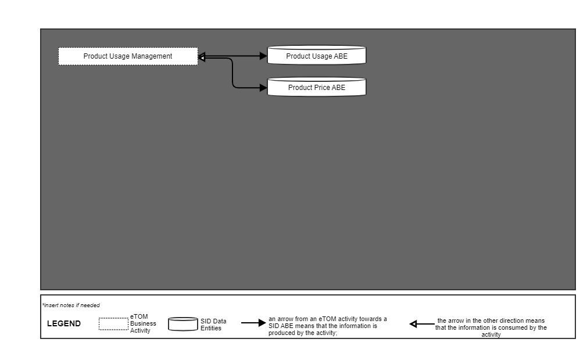
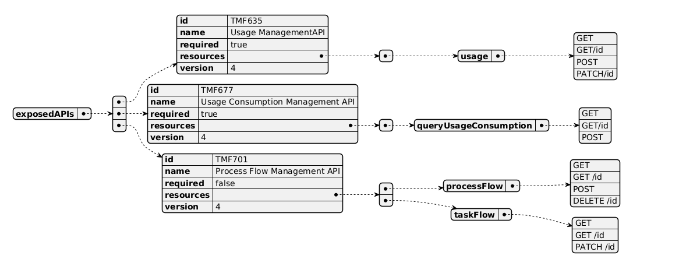
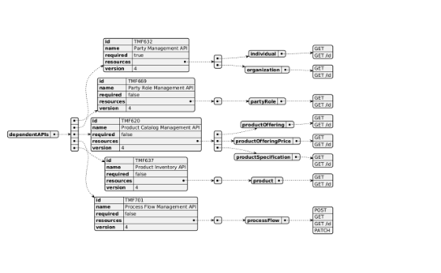
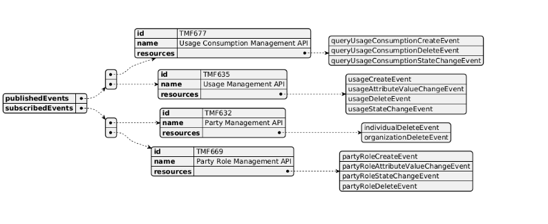

# 1. Overview

| Component Name | ID | Description | ODA Function Block |
| --- | --- | --- | --- |
| Product Usage Management | TMFC040 | The Product Usage Components provides standardized mechanisms for product usage management (creation, update, retrieval, import and export of a collection of usages) and Product Rating & Rate Assignment by assigning a value (monetary or other) to an event in the context of a product, a party (customers and partners) and payer. | Core Commerce Management |

*([PlantUML source](media/product-usage-management-architecture.puml))*

# 2. eTOM Processes and SID Data Entities

## 2.1. eTOM business activities

eTOM business activities this ODA Component is responsible for.

| Identifier | Level | Business Activity Name | Description |
| --- | --- | --- | --- |
| 1.2.16 | L2 | Product Usage Management | The Product Usage management processes encompass the functions required to guide, distribute, mediate, summarize, accumulate, and analyze Product Usage records. These processes may occur in real-time, near real-time (i.e. just at the end of the usage), or may be executed on a periodic basis. Based on Service Usage, this process aims at identifying Product Usage. For example, for a Video on Demand where you can watch a video as many time as you want during 72 hours, several Service Usages might have been tracked (each time the user watches the video) and only one Product Usage will be identified for all Service Usages in the 72 hours after the first watch. The guiding processes ensures that the Product Usage records used in the billing processes are appropriately related to the correct customer billing account and products. The Product Usage records are edited and if necessary reformatted (mediated) to meet the needs of subsequent processes. The billing event records may also be enriched with additional data during this process. |
| 1.2.16.1 | L3 | Product Usages | The Enrich Product Usages processes will augment the product usage records by adding data to the records from sources such as customer, product, or other reference data. |
| 1.2.16.1.1 | L4 | Add Product Usage Data | Add data to the records from sources such as customer, product, or other reference data to augment the product usage records. |
| 1.2.16.1.2 | L4 | Assign Product Usage Price | Assign a price to product usage without consideration of specific product or customer information. The assigned price may be used to enrich the product usage record. |
| 1.2.16.2 | L3 | Guide and Assign Product Usages | The Guide Product Usages processes ensure that the event records used in the billing process relate to the correct customer billing account and products. A specific product usage record may be related to multiple customer billing accounts and subscribed products. Distribution of product usage records to other processes may also occur. |
| 1.2.16.2.1 | L4 | Assign Product Usages | Ensure that the Product Usages used in the billing process relate to the correct Product. |
| 1.2.16.2.2 | L4 | Distribute Product Usage | Distribute billing event records to other processes. |
| 1.2.16.2.3 | L4 | Guide Product Usages | Guide Product Usages process is in charge of identifying Product Usages based on Service Usages. For example, for a Video on Demand where you can watch a video as many time as you want during 72 hours, several Service Usages might have been tracked (each time the user watches the video) and only one Product Usage will be identified for all Service Usages in the 72 hours after the first watch. |
| 1.2.16.3 | L3 | Mediate Product Usages | The Mediate Product Usages process edits and reformats the data record to meet the needs of a recipient application. |
| 1.2.16.3.1 | L4 | Edit Product Usages | Edit the data record for recipient applications. |
| 1.2.16.3.2 | L4 | Reformat Product Usages | Reformat the data record for recipient applications. |
| 1.2.16.4 | L3 | Report Product Usage Records | The purpose of the Report Product Usage Record processes is to generate reports on Product Usage records based on requests from other processes. These processes produce reports that may identify abnormalities, which may be caused by fraudulent activity or related to customer complaints. Investigation of problems related to these product usage records is also part of this process. These processes also support other processes such as customer review of product usages (pre-billing and post- billing). |
| 1.2.16.4.1 | L4 | Generate Product Usage Report | Generate reports on product usage records based on requests from other processes. |
| 1.2.16.4.2 | L4 | Investigate Product Usage Related Problem | Investigate problems related to product usage records. |
| 1.2.16.4.3 | L4 | Support Product Usage Related Process | Support other processes such as customer review of product usages (pre-billing and post-billing). |
| 1.2.17 | L2 | Product Rating & Rate Assignment | The purpose of Product Rating & Assignment is to rate a value (monetary or other) to Product Usage or a set of Product Usages and assign the result to a Product and a Billing Account. The charge may be either a credit or a debit and can be handled either online or offline. Online charging is performed in real-time, requiring an authorization component which may affect how the service is rendered and enables an operator to provide prepaid services to its customers. Whereas offline charging is performed after the service is rendered and is not required to be done in real-time and generally relates to subscription based products. |
| 1.2.17.1 | L3 | Perform Rating | Process responsible for calculating the value of a product usage or a set of product usages, before, during or after the rendering of the service, based on parameters of the request (type, quantity, etc.), parameters of the customer/subscriber (tariffs, price plans, accumulated usage, contracts, etc.) and other parameters (time-of-day, taxes, etc.). The same request maybe rated differently for different subscribers based on their purchased offers or agreements. |
| 1.2.17.2 | L3 | Aggregate Items For Rate Assignment | This process is responsible for accumulating contributing items, which can be quantities, values (monetary or other) or both. Aggregation can occur over time or can be initiated to gather a “snapshot” of the items at a point in time. |
| 1.2.17.3 | L3 | Manage Customer Assignment HierarchyManaging the charging relationships among subscribers. | Customer hierarchies are commonly used for corporate customers, family plans or other type of affinity groups. This process manages the assignment relationships among subscribers, e.g. sharing, inheriting or restricting balances, price plans and discounts. Thereby assuring that a charge is added to or subtracted from the correct account balance. |
| 1.2.17.4 | L3 | Provide Advice of Rate | The activity of Provide Advice of Rate (aka Advice of Charge) is responsible for providing advice on rates, in real-time or offline, an estimate or value of the rate for a specific usage request. The advice is usually based upon performing a full rating process for the request. |
| 1.2.17.5 | L3 | Apply Rate Level Discounts | This process applies discounts to product prices at an individual product level. A discount may be expressed as a monetary amount or percentage, and modifies a price for a product. When a discount is expressed as a percentage, the discounting process determines the discount calculated in relation to the price for the product. The discount may be displayed as a separate entry on the bill or may be combined with the rate for the product to only show as one entry. Discounts may be a one-time event or may have some duration (days, months, life of product, etc.). Discounts may apply to a specific customer or be generally available based on selection of products (for example - bundles). Discounting structures may involve tiers, tapers, or thresholds. |

## 2.2. SID ABEs

SID ABEs this ODA Component is responsible for:

*: if SID ABE Level 2 is not specified this means that all the L2 business entities must be implemented, else the L2 SID ABE Level is specified. ** In the context of this component, it relates to the usage events and not the management of the ProductUsageSpecification. The ProductUsageSpecification is maintained by TMFC001 Product Catalog Management component. *** In the context of Usage; related to UsageProdPriceCharge and related ProdPriceAlteration.

| SID ABE Level 1 | SID ABE Level 2 (or set of BEs)* |
| --- | --- |
| Product Usage ABE** |   |
| Product Price ABE*** |   |

## 2.3. eTOM L2 - SID ABEs links

eTOM L2 vS SID ABEs links for this ODA Component.

*([PlantUML source](media/etom-sid-product-usage-links.puml))*

# 3. Functional Framework Functions

** Consumption is exposed through TMF677 and Usage details through TMF635.

| Function ID | Function Name | Function Description | Aggregate Function Level 1 | Aggregate Function Level 2 |
| --- | --- | --- | --- | --- |
| 253 | Customer Usage and Charges Report Access | Customer Usage and Charges Report Access provides an internet technology driven interface to the customer to access web based reports for (historical) usage and charges directly for themselves. | Product Usage Management Rating and Follow up | Rating and Follow up Bill Calculation |
| 55 | Price and Discount Calculation | Price and Discount Calculation applies pricing and discounting rules and algorithms in the context of the assembled information concerning Products (i.e. instances of Product). | Product Usage Management Rating and Follow up | Rating and Follow up Tariff Calculation and Rating |
| 125 | Charging Event Accumulation | Charging Event Accumulation function accumulates events that provide measurements that will be used in the charge calculation (e.g. used allowance). | Product Usage Management Rating and Follow up | Rating and Follow up Tariff Calculation and Rating |
| 126 | Event Charge/Credit Calculation | Event Charge/Credit Calculation calculates event-level charges/credits (one time, recurring, and usage). | Product Usage Management Rating and Follow up | Rating and Follow up Tariff Calculation and Rating |
| 127 | Calculated Charges/Credits Proration | Calculated Charges/Credits Proration provides proration of calculated charges/credits. The function handles partial rating of a period. | Product Usage Management Rating and Follow up | Rating and Follow up Tariff Calculation and Rating |
| 128 | Late Arrival Usage Charges/Credits Recalculation | Late Arrival Usage Charges/Credits Recalculation provides recalculation of charges/credits based on information received later (e.g. from the Service Level Agreement function, delayed call detail record file arrival, delayed order arrival). Recalculation may be necessary: pre-billing (prior to Bill Calculation), during the Bill Calculation process, and/or post-billing. | Product Usage Management Rating and Follow up | Rating and Follow up Tariff Calculation and Rating |
| 186 | Charging/Rating Recalculation | Charging/Rating Recalculation function recalculates the charges, when appropriate, across product, location, or customer, and considerations based on business rules. | Product Usage Management Rating and Follow up | Rating and Follow up Tariff Calculation and Rating |
| 300 | Discounts Calculation | Discounts Calculation determines charge discounts based on pricing plan; including discounts on recurring, one time, and usage charges. Discounts may be applied at different levels such as cross product, cross location, or cross customer (all customers that are part of a given group plan – some affiliation). The discounts can be apportioned across multiple events. | Product Usage Management Rating and Follow up | Rating and Follow up Tariff Calculation and Rating |
| 67 | Usage Summary and Details Presentation | Usage Summary and Details Presentation presents usage summary and details (billed and non-billed) for a specific time period.** | Invoice Management | Invoicing |
| 85 | Billing Event Processing Distribution | Billing Event Processing Distribution function for correlation and distribution of usage data for processing of e.g. bill, customer and product. To supply relevant usage data to the Billing System. | Invoice Management | Invoicing |
| 86 | Billing Event Processing Enrichment | Billing Event Processing Enrichment with complementing data e.g. product or location information to supply relevant information to the Billing System. | Invoice Management | Invoicing |

# 4. TMF OPEN APIs & Events

The following part covers the APIs and Events; This part is split in 3: • List of Exposed APIs - This is the list of APIs available from this component. • List of Dependent APIs - In order to satisfy the provided API, the component could require the usage of this set of required APIs. • List of Events (generated & consumed ) - The events which the component may generate is listed in this section along with a list of the events which it may consume. Since there is a possibility of multiple sources and receivers for each defined event. The Product Usage Management Component relate to usage and the API TMF635 Usage Managment is in evolution as it mix concerns on product, service and resource levels. With version 5 of Open APIs, there is a major evolution of Usage APIs so that there will be a distinct usage API per Product, Service, and Resource: • TMF767 Product Usage • TMF727 Service Usage • TMF771 Resource Usage These will replace the existing TMF635 Usage Management that will stop with v4 and not be migrated to v5. The Product Usage Management component relates to the usage on Product Level so in future iterations, the TMF767 will be included.

## 4.1. Exposed APIs

Following diagram illustrates API/Resource/Operation:

*([PlantUML source](media/exposed-apis-structure.puml))*

| API ID | API Name | Mandatory / Optional | Operations |
| --- | --- | --- | --- |
| TMF635 | Usage Management | Mandatory | usage: GET, GET /id, POST, PATCH/id |
| TMF677 | Usage Consumption Management | Mandatory | queryUsageConsumption: GET, GET /id, POST |
| TMF701 | Process Flow Management API | Optional | processFlow: GET, GET /id, POST, DELETE /id taskFlow: GET, GET /id, PATCH /id |

## 4.2. Dependant APIs

Following diagram illustrates API/Resource/Operation potentially used by the product catalog component:

*([PlantUML source](media/dependent-apis-structure.puml))*

| API ID | API Name | Mandatory / Optional | Operations | Rationale |
| --- | --- | --- | --- | --- |
| TMF632 | Party Management | Mandatory | individual: GET, GET /id organization: GET, GET /id | To be able to guide the Product Usage to the appropriate Party and its related products. |
| TMF669 | Party Role Management | Optional | partyRole: GET, GET /id |   |
| TMF620 | Product Catalog Management API | Mandatory Optional | productOffering: GET, GET /id productOfferingPrice: GET, GET /id productSpecification: GET, GET /id |   |
| TMF637 | Product Inventory | Mandatory | product: GET, GET /id | To retrieve installed product and price information to determine the rate to assign. |
| TMF701 | Process Flow Management | Optional | processFlow: GET, GET /id, POST, PATCH |   |

## 4.3. Events

The diagram illustrates the Events which the component may publish and the Events that the component may subscribe to and then may receive. Both lists are derived from the APIs listed in the preceding sections.

*([PlantUML source](media/events-structure.puml))*

# 5. Machine Readable Component Specification

Refer to the ODA Component table for the machine-readable component specification file for this component.
