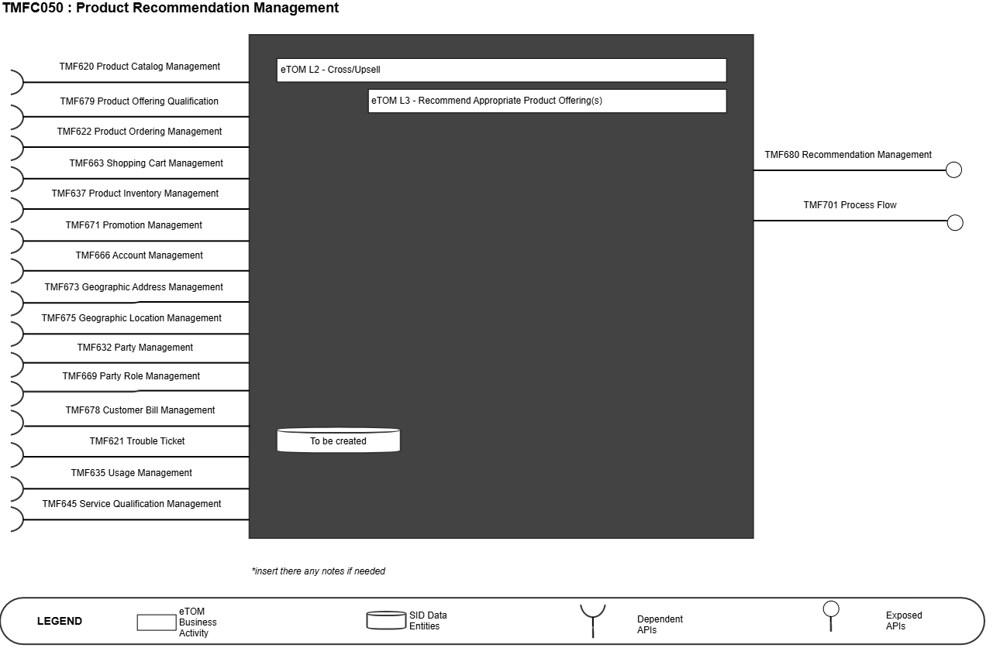
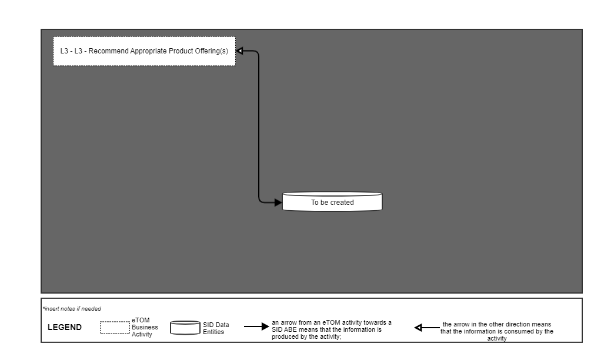
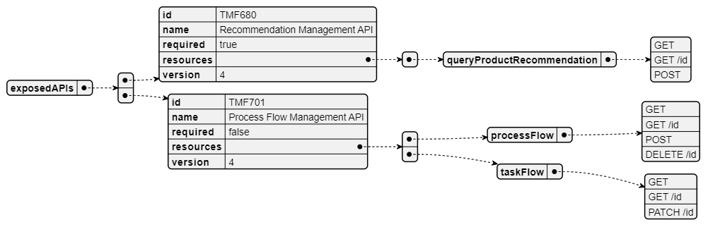
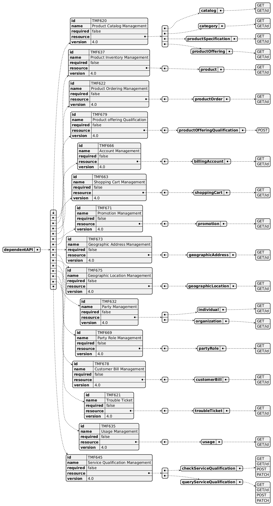
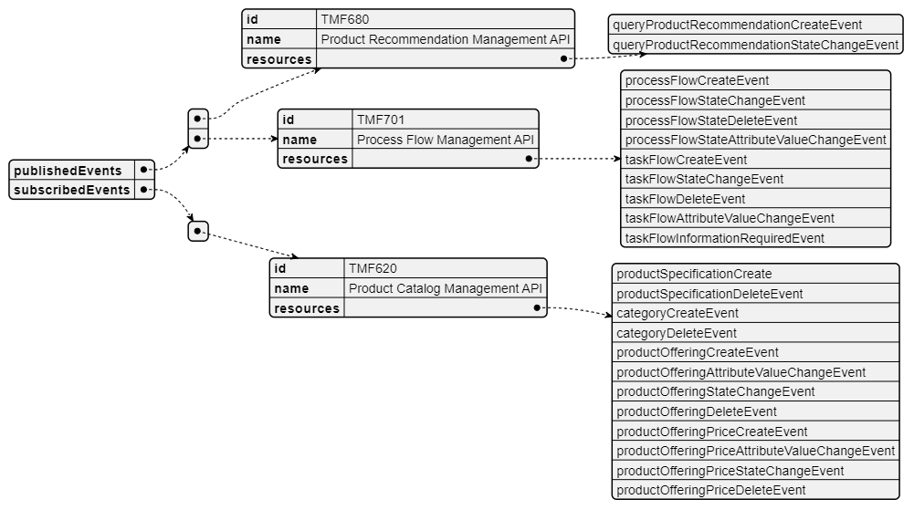

# 1. Overview

1. TAC-208 IG1171 (update) Component Definition to v4.0.0 and incorporate IG1245 Principles to Define ODA Components

# 2. [TAC-250] IG 1171 Improvements Some observations & recommendations. - TM Forum JIRA

# 3. [TAC-214] Interface Standardization needs all 3 stages of process to be developed - TM Forum JIRA

# 4. [TAC-226] Overview - TM Forum JIRA

# 5. ODA-846 Summary of ODA component Template enhancements for 14th Sep Review

| Component Name | ID | Description | ODA Function Block |
| --- | --- | --- | --- |
| Product Recommend ation Management | TMF C050 | Product Recommendation component is responsible for evaluating and providing product offering/specfication recommendations based on the history and real-time context of a party and marketing strategy. | Intelligence Management |

*([PlantUML source](media/product-recommendation-management-architecture.puml))*

2. eTOM Processes, SID Data Entities and Functional Framework Functions

## 2.1. eTOM business activities

eTOM business activities this ODA Component is responsible for.

| Identifier | Level | Business Activity Name | Description |
| --- | --- | --- | --- |
| 1.1.9.4 | L2 | Cross/Up Sell | Cross/Up Sell ensures that the value of the relationship between the customer or other party and an enterprise is maximized by selling additional, or more of the existing, product offerings. The ongoing analysis of customer or other party trends, such as usage, problems, complaints, is used to identify when the current offerings may no longer be appropriate or when the opportunity for a larger sale arises. Based on the data collected, more appropriate or other offering(s) may be recommended to the customer or other party. |
| 1.1.9.4.2 | L3 | Recommend Appropriate Product Offering(s) | Recommend Appropriate Product Offering(s) recommends more appropriate or other product offering(s) to the customer or other party that may be based on the results of Analyze Customer or Other Party Trends or based on known other offerings that represent an upsell. For example, a potential new partner may be offered the opportunity to have there logo and contact information added to an enterprise's application that manages a IoT device. |

## 2.2. SID ABEs

SID ABEs this ODA Component is responsible for:

*: if SID ABE Level 2 is not specified this means that all the L2 business entities must be implemented, else the L2 SID ABE Level is specified. Note: There is need to create Product Recommendation Management BE in SID.

## 2.3. eTOM L2 - SID ABEs links

eTOM L2 vS SID ABEs links for this ODA Component.

*([PlantUML source](media/etom-sid-recommendation-links.puml))*

## 2.4. Functional Framework Functions

| Function ID | Function Name | Function Description | Aggregate Function Level 1 | Aggregate Function Level 2 |
| --- | --- | --- | --- | --- |
| 1196 | Product Specification & Offering Simulation | Product Specification & Offering Simulation Function simulates Product Specification configuration and Product Offerings on the real traffic of the customer thanks to Tariff Calculation and Rating. | Product Operational Analysis | Pushed Offer Management |
| 1195 | Pushed Offer Identification | Pushed Offer Identification Function identifies offers adapted to the customer needs including personalized offers. Based on a customer's individualized knowledge (Marketing one to one), the aim is to elaborate for each customer according to his needs and recent action individualized Product Specifications & Offerings. | Product Operational Analysis | Pushed Offer Management |

3. TM Forum Open APIs & Events The following part covers the APIs and Events; This part is split in 3: List of Exposed APIs - This is the list of APIs available from this component. List of Dependent APIs - In order to satisfy the provided API, the component could require the usage of this set of required APIs. List of Events (generated & consumed ) - The events which the component may generate is listed in this section along with a list of the events which it may consume. Since there is a possibility of multiple sources and receivers for each defined event. <Note note to be inserted into ODA Component specifications: If a new Open API is required, but it does not yet exist. Then you should include a textual description of the new Open API, and it should be clearly noted that this Open API does not yet exist. In addition, a Jira epic should be raised to request the new Open API is added, and the Open API team should be consulted. Finally, a decision is required on the feasibility of the component without this Open API. If the Open API is critical then the component specification should not be published until the Open API issue has been resolved. Alternatively if the Open API is not critical, then the specification could continue to publication. The result of this decision should be clearly recorded.>

## 3.1. Exposed APIs

Following diagram illustrates API/Resource/Operation:

*([PlantUML source](media/exposed-apis-structure.puml))*

| API ID | API Name | API Version | Mandatory / Optional | Operations |
| --- | --- | --- | --- | --- |
| TMF680 | Recommendation Management | 4 | Mandatory | GET GET/id POST |
| TMF701 | Process Flow API | 4 | Optional | GET GET/id POST |

## 3.2. Dependent APIs

Following diagram illustrates API/Resource/Operation potentially used by the product recommendation management component:

*([PlantUML source](media/dependent-apis-structure.puml))*

| API ID | API Name | API Version | Mandatory / Optional | Operations | Rationales |
| --- | --- | --- | --- | --- | --- |
| TMF620 | Product Catalog Management | 4 | Mandatory | - catalog: - GET - GET /id - category: - GET - GET /id - productSpecification: - GET - GET /id - productOffering: - GET - GET /id - productOfferingPrice: - GET - GET /id |   |
| TMF637 | Product Inventory Management | 4 | Optional | - product: - GET - GET /id |   |
| TMF622 | Product Ordering Management | 4 | Optional | - productOrder: - GET - GET /id |   |
| TMF679 | Product Offering Qualification | 4 | Optional | - productOfferingQualification: - GET - GET /id |   |
| TMF666 | Account Management | 4 | Optional | - billingAccount: - GET - GET /id |   |
| TMF663 | Shopping Cart Management | 4 | Optional | - shoppingCart: - GET - GET /id |   |
| TMF671 | Promotion Management | 4 | Optional | - promotion: - GET - GET /id |   |
| TMF673 | Geographic Address Management | 4 | Optional | - geographicAddressManagement: - GET - GET /id |   |
| TMF675 | Geographic Location Management | 4 | Optional | - geographicLocationManagement: - GET - GET /id |   |
| TMF632 | Party Management | 4 | Optional | - individual: - GET - GET /id - organization: - GET - GET /id |   |
| TMF669 | Party Role Management | 4 | Optional | - partyRole: - GET - GET /id |   |
| TMF678 | Customer Bill Management | 4 | Optional | - customerBill: - GET - GET /id |   |
| TMF621 | Trouble Ticket | 4 | Optional | - troubleTicket: - GET - GET /id |   |
| TMF635 | Usage Management | 4 | Optional | - usage: - GET - GET /id |   |
| TMF645 | Service Qualification Management | 4 | Optional | checkServiceQualification: -Get -Get /id -Post -Patch |   |

## 3.3. Events

The diagram illustrates the Events which the component may publish and the Events that the component may subscribe to and then may receive. Both lists are derived from the APIs listed in the preceding sections.

*([PlantUML source](media/events-structure.puml))*

4. Machine Readable Component Specification Refer to the ODA Component table for the machine-readable component specification file for this component or click the link Recommendation_Manag ement V1.1.yaml. 5. References

## 5.1. TMF Standards related versions

| Standard | Version(s) |
| --- | --- |
| SID | 24.0 |
| eTOM | 24.0 |
| Functional Framework | 24.0 |

## 5.2. Jira References

JIRA request for creating the SID entity for queryRecommendationManagement : [ISA-1194] SID Entity for queryRecommendationManagement - TM Forum Jira JIRA request for improving the function description of 1196: [FX-1227] Improvement of the description for function id 1196 - Product Specification & Offering Simulation - TM Forum Jira JIRA request for improving the function description of1195: [FX-1228] Improvement of the description for function id 1195 - Pushed Offer Identification - TM Forum JIRA

## 5.3. Further resources

1. IG1228: please refer to IG1228 for defined use cases with ODA components interactions.
