# Introduction

This use case illustrates an Order Capture and Validation process, driven by the Product Catalog model and content, and the set of related ODA components and TMF Open APIs.

This use case follows TMFS001 and TMFS002.

## Context or Background

This use case is based on the organization of the Production functional block in several domains each of them being responsible for a set of services (CFS specification), for which the domain implementation is able to manage fulfillment, assurance and usage processes.

As described in IG1167 ODA Functional Architecture Exploratory Report, the Orange implementation scenario for the Production block called these domains "factories".

Each domain or factory exposes to the Core Commerce Management functional block its services specifications (CFS specification) to permit it to define the commercialized products and packaged offers (Product specification and Product Offerings).

We will consider in this use case several services provided by different factories:

- Landline Access, managed by the Access Factory

- Landline Connectivity, managed by the Network Services Factory

- TV channels, managed by the Soft Services Factory

- Box and Shipping Conditions, managed by the Supply Chain Factory

According to ODA principles, the Core Commerce Management is totally agnostic of technical solutions (RFS specification) managed by the factories to deliver their services. It uses the services definitions (CFS specification) of each factory to define the commercialized products (Product specificaiton).

In some cases the technology can be a marketing or business argument - so it is also possible to instantiate services associated to a specific technology and related products, as we do here for the Fiber Access.

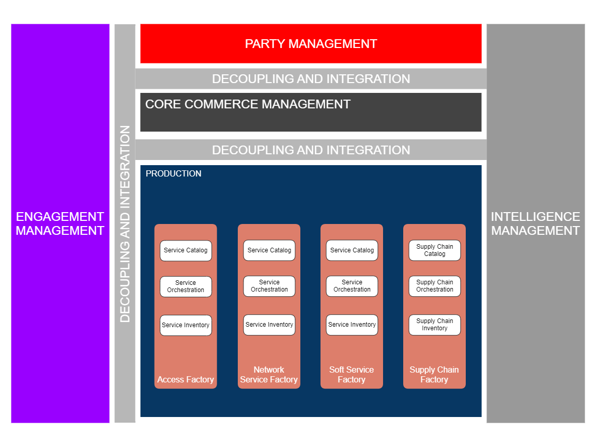
*([text description](media/oda-functional-architecture-overview.text-description.md))*

## Objective of the use case

The objective of this use case is to illustrate with a complex business process, an order capture and validation, the capabilities defined by ODA functional architecture, and provided by the ODA components and Open APIs.

- Engagement Management - Process layers decoupling and native multi-channel capabilities : the order capture and validation process managed by the different components involved -mostly Product Order Capture and Validation and Product Configurator - drive the GUI layer using the Process Flow API (TMF701). So the Engagement Management can be a web portal, a mobile app or other, the process is shared between the channels.

- Core Commerce Management - Production decoupling: the main information shared by these 2 functional blocks correspond to the service layer

- CFS specification at catalog level for Product specification definition, as illustrated in TMFS012

- service order for the delivery process has illustrated in TMFS004

-  Process delegation and decoupling: Product Order Capture & Validation (TMFC002), the component in charge of the end-to-end process,  will delegate the sub-processes it is not directly responsible for to the dedicated components

- the configuration of the order is the responsibility of Product Configurator (TMFC027)

- the creation of the billing account is the responsibility of Billing Account Management (TMFC024)

- etc

- Date driven process: the order capture process is totally driven by the Product Catalog model and content.

## Scope and assumptions

### Scope

In this use case, John Smith, the front-end user decides to order a Fiber Contract.

The Product Order is automatically initiated with the mandatory product offerings included in the contract - and the default configuration values of the related products. Then he chooses among the optional product offerings proposed in the contract those that he wants to order, and update the default configuration values of the products if needed.

The Front-End is not precised as the same behaviour is expected for any channel (web portal or mobile app - and even with very few adaptations a CSR in a call center or a shop).

### Assumptions

- In this use case we consider that the CSP decided to use the Fiber technology as a sales argument - so he makes it explicit in the contract names, and for the technical eligibility test. This is possible and common because B2C customers are well aware that Fiber technology exists, permits higher speeds and is not available in every location because a new Fiber network takes time to be deployed. B2C customers also know that Fiber contracts are more expensive.

Another possibility would be to name contracts as "High speed Internet offers", and at technical eligibility level to only share with B2C customers a range of speeds available in a specific location. So Fiber and ADSL technologies are only explicit at technical solution level (RFS specification).

These 2 options are possible and consistent with ODA architecture and decoupling principles, and with the Catalog information model. CSP business owners can choose.

- We also consider that John Smith, the front-end user is already known by the CSP - as a person with a front-end user role and a digital identity - and that he is already identified and authenticated (as described in TMFS001).

Moreover, we consider that John Smith checked the technical availability of fiber access at his address (as described in TMFS002).

- As a B2C customer, all the prices indicated to John Smith are including tax. As in the catalog we have prices excluding tax plus the related tax rate, each price including tax displayed is calculated on the fly.

- During the Order Capture and Validation process we illustrate the update of the Product Inventory, as possible at different steps, and at least at the end of the process (with an "initialized" status or equivalent). This will permit to always have a full view of the customer's products - even if they are not all yet delivered. It is important for the customer relationship management, and also to be able to treat a new order consistently. It is especially important in case of products which have a long delivery process - we cannot wait for the closure of an order to accept a new one. And so the configuration phase of the order, managed by the Product Configurator, will always have the same behaviour, that is applying the Product Catalog rules to the order in progress and to the existing products in the Product Inventory. 

# Description

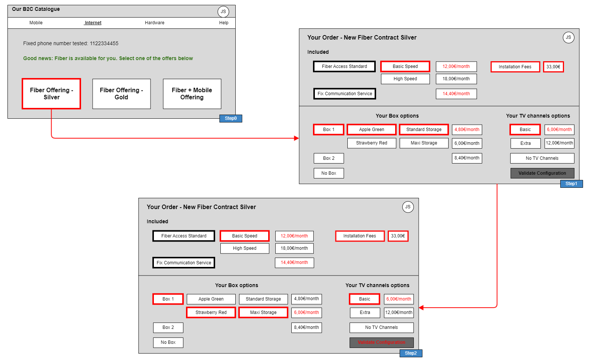
*([text description](media/order-configuration-ui-mockup-step0-2.text-description.md))*

- Step 1

- As John Smith chooses to start an order, a new interaction item is created

- Based on the choice of a contract, a product order configuration is displayed, according to the Product Catalog description of the contract

- mandatory or optional product offerings, with default options selected

- possible configuration values of the product characteristics, with default values selected

- product offering pricing rules applied to selection (in red)

- The front-end user can change any configurable value of the product characteristics, and he can also unselect any option, with an immediate impact on the prices displayed

- Step 2

- John Smith changes the characteristics values of the Box he wants, color and storage. The price is immediately updated (in red)

- Then he validates the global configuration of his order.

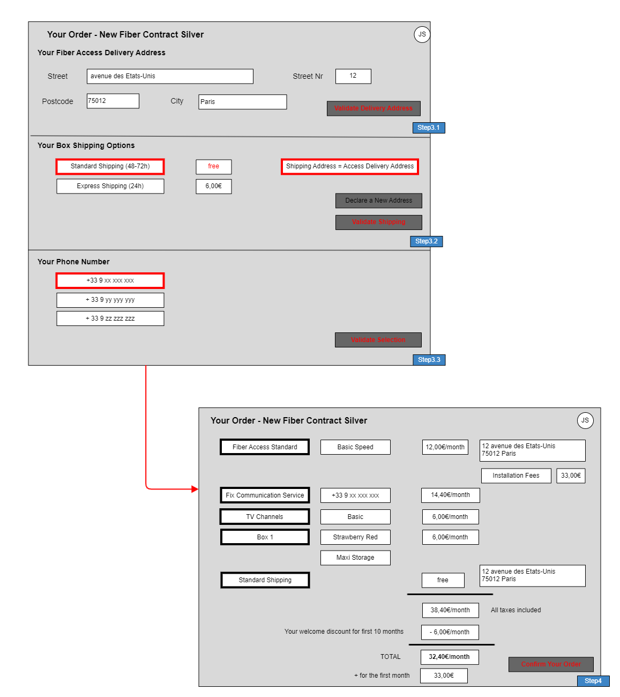
*([text description](media/order-configuration-ui-mockup-step3-4.text-description.md))*

- Step 3.1

- As the contract includes an access product, Product Configurator indicated that a geographic address must be provided. So the Front-End now requests a delivery address.

- John Smith enters his address and validates it.

- Step 3.2

- And as John Smith selected a Box product, Product Configurator also indicated that a shipping offer must be selected. So the Front-End displays the shipping options: Express or Standard, with default value Standard pre-selected and delivery address pre-selected too as the shipping address

- John Smith has the possibility to declare another shipping address, but here he chooses to confirm the delivery address as shipping address.

- Step 3.3

- 3 phone numbers are proposed to configurate the Fix Communication service. John Smith validates the first number choice.

- Step 4

- All the items of the Product Order (or Shopping Card) are summarized, with their configured characteristics and prices. Potential discounts and fees are also displayed.

- John Smith is asked to validate his Product Order configuration (or Shopping Card), what he does.

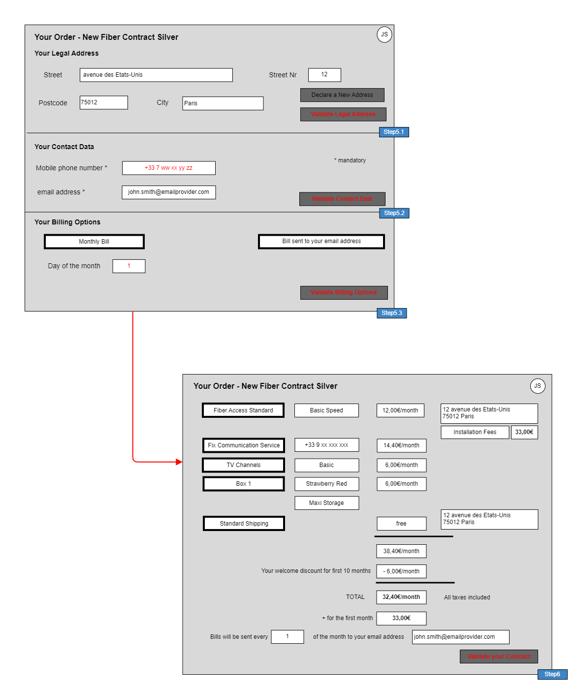
*([text description](media/order-configuration-ui-mockup-step5-6.text-description.md))*

- Step 5: To finish the order capture process, more information can be requested depending on the Product Order content and related Product Catalog rules, or depending on the already available Party information. In our current example :

- An appointment will be necessary to install the Fiber Access (not yet represented)

- A Billing Account will also be necessary to collect recurrent charges described in the Product Catalog for at least one product offering included in the contract (business rule). Some parameters can be proposed to the choice of the customer, such as the day of the month to start the billed period (or even the bill frequency) and the contact method used to send the bill - described in Step 5.3

- With this contract subscription John Smith will be given a new Customer Party Role, and so the CSP needs more information such as his legal address in case of dunning process, and his mobile phone in case of contact needed during the delivery process - described in Steps 5.1 and 5.2

- The CSP also needs proofs of information related to John Smith's identity and legal address and so legal documents, such as Identity Card or Passport are requested (not yet represented)

- Step 6: All information related to the contract are summarized, and the final validation of the contract is done by John Smith

Note: in a next version, it is planned to add certification steps for

- the contact means, by sending an email or an SMS with a code to copy in the front-end

- the person identity and legal address by providing and controlling official documents such as identity card or passport and proof of address.

# Information View

## Global Catalog view

This view details the Fiber Contract Silver product offering, with all the mandatory or optional product offerings included in this contract, and the product specification commercialized by each atomic product offering. For each product specification the characteristics and possible values are described, and the default values too. At product offering level several product offering price rules are proposed, some of them depending on the configuration of the product commercialized.

The CFS, RFS and Resource specification levels of the catalog will be more detailed in TMFS004 related to the delivery process.

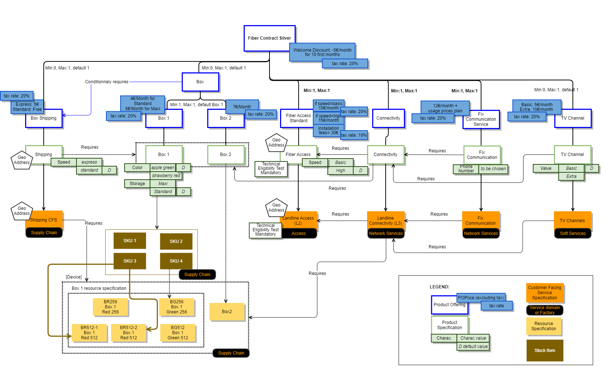
*([PlantUML source](media/global-catalog-view.puml))*

Notes:

- SID 21.0 included Stock Item definition as an 'intermediate' object between ProductSpec and ResourceSpec (in order to 'hide' logistic complexity from product level). A stock item is identified via EAN (European Article Numbering) or SKU (Stock Keeping Unit). The Stock Item as defined in the SID is not present in API Stock Management (TMF687) - refer to §5.2 Impacts identified.

- SID doesn't allow yet defining prerequisite relationship between ServiceSpec and ResourceSpec. - refer to §5.2 Impacts identified.

The usage prices associated to the Fix Communication Product Offering are for example (partial):

| Product Usage specification | Usage Product Offering Price Charge (excluding tax) | Tax Product Offering Price Alteration (tax rate) |
| --- | --- | --- |
| Data | 1 € per Mo | 20% |
| Voice for national fix number | 0,1 € per minute | 20% |
| Voice for mobile in Europe | 0,5 € per minute | 20% |

## Product Order view

This view represents the product order initialized at the end of Step2, according to the configuration validated by John Smith.

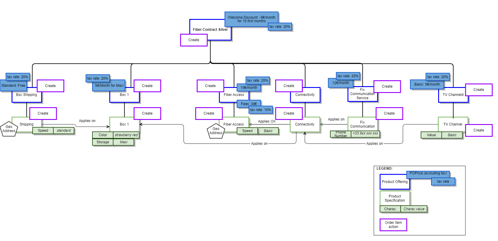
*([PlantUML source](media/product-order-view.puml))*

Note: in a next version the detailed structure of the product order and its links with the products instantiated in the Product Inventory will be detailed.

# Sequence diagrams

Note: Sequence Diagrams will be updated in the next version to take into account changes in the catalog view and order items (new Fix Communication Product Offering and Installation Fees for Fiber Access).

##  Step 1 - Build the default order configuration screen

- John Smith picks a Product Offering to start order capture (step 0)

- The Party Interaction Management component initiates an interaction item to trace the order capture starting

- Then it delegates the order capture process responsibility to the Product Order Capture- & Validation component. In the request, it passes all contextual information already captured (ProductOfferingId, CheckServiceQualificationId, etc...).

- Order Capture process determines, depending on product offering selected & action, if a service qualification (SQ) is requested.

- In this example, service qualification has been done in previous step and checkServiceQualification.id is provided in the Order Capture process launch. This requires having a component storing service qualifications. Alternative is to trigger again a new service qualification from Order Capture process.

- A configuration session is initialized by Product Order Capture & Validation

- The Product Configuration API drives the configuration of new product offerings and modification of existing products for various user engagement channels. The Product Configuration API uses product catalog data, policy data, and existing product inventory data to assist engagement management systems with product configuration. Product configuration may include setting and restricting characteristic values, enforcing min/max on bundle offering groups and options, and calculation of prices and discounts. The Product Configuration API features 2 distinct resources:

- QueryProductConfiguration

- CheckProductConfiguration

- Notes :

- ProductConfiguration API is a Task based API, so meant to be stateless, that means no ProductConfiguration entity can be stored and retrieved any time : the full ProductConfiguration has to be passed in input by the API Client in order to be computed.

- Nevertheless, it should be possible to store a product configured in a ProductOrder or a ShoppingCart any time during the order process. It should be possible to store a product with a valid or invalid configuration (with appropriate status on the cart item or order item), so that end user can save their work and return to it on a different occasion

- In addition, there is a way to propose a light persistence of the ProductConfiguration during the order capture process. This permits to save bandwidth and Engagement Management computing resources.

- Product Configurator can manage a configuration session only during an order capture process, using the ProductConfiguration id. That means after first POST /queryProductConfiguration, a ProductConfiguration entity can be created, with an id that permits, during this session, to update it using the standard query task, but passing only the delta, from Client to Server.

- At the end of the order capture process, the ProductConfiguration entity should be deleted. All the latest configuration data (selected product characteristics) should be stored in the Product Order or in the Shopping Cart, in order to be retrieved later if the same customer wants to retrieve and complete his order based on the latest configuration data.

- This Use Case is proposed with this option, but as it can be done without, we put in italic the *ProductConfiguration.id* to indicate that it's optional.

- It's still possible to retrieve the latest configurations tasks (GET /queryProductConfiguration, GET /checkProductConfiguration) if Product Configurator implements persists tasks.

- Back end process sent back the information to the front-end that a configuration session is ready for use.

- The Front-End displays the default configuration and pre-selects the default values.

- A Product Order (or a Shopping Cart) is initialized by the process with all collected information and default values defined in the Product Catalog for the selected Product Offering.

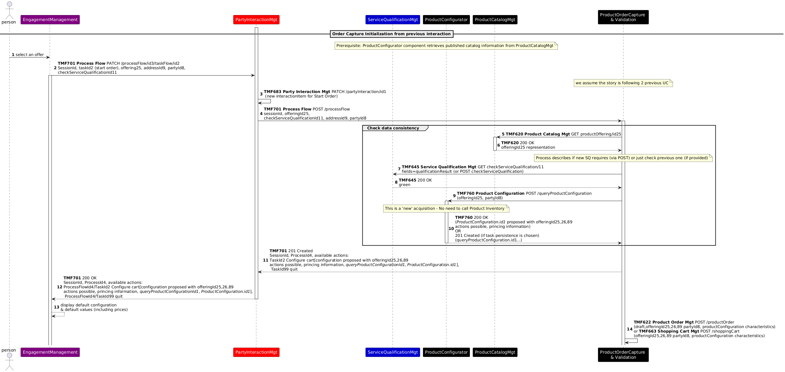
*([PlantUML source](media/order-configuration-screen-sequence.puml))*

##  Step 2 - Change configuration values and validate

- John Smith looks at the proposed configuration based on default values - and related prices

- He prefers to change the configuration values for Box 1

- The Front-End deals directly with the Product Configurator to check user choices, display impacts on prices but also possible other selection, configuration - or configuration issue  

- John Smith validates the proposed configuration - and related prices

Note: to be studied in a next version - how to store a configuration step to be able to interrupt the process and retrieve the configuration later to continue it (store Product Configuration ? use Product Order or Shopping Cart ?)

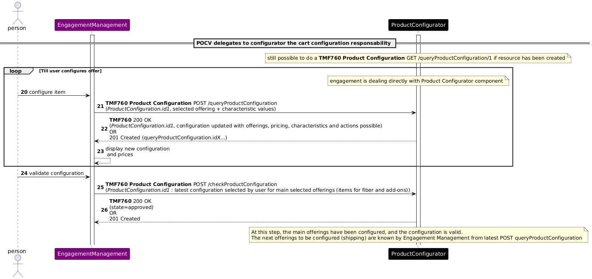
*([PlantUML source](media/configuration-values-validate-sequence.puml))*

##  Step 3 - Provide Delivery Address and Choose Shipping Options

- As the contract includes an access product, Product Configurator indicated that a geographic address must be provided. So the Front-End requests a delivery address and it triggers the controls of the provided address (address correct, known precise enough).

- And as John Smith selected a Box product, Product Configurator also indicated that a shipping offer must be selected. So the Front-End displays the shipping options: Express or Standard, with default value Standard pre-selected and access geographic address pre-selected too as the shipping address

- John Smith validates the default shipping options

- Then all the items of the Product Order (or Shopping Cart) are summarized, with their configured characteristics and prices including discounts.

- And John Smith validates his Product Order configuration (or Shopping Cart).

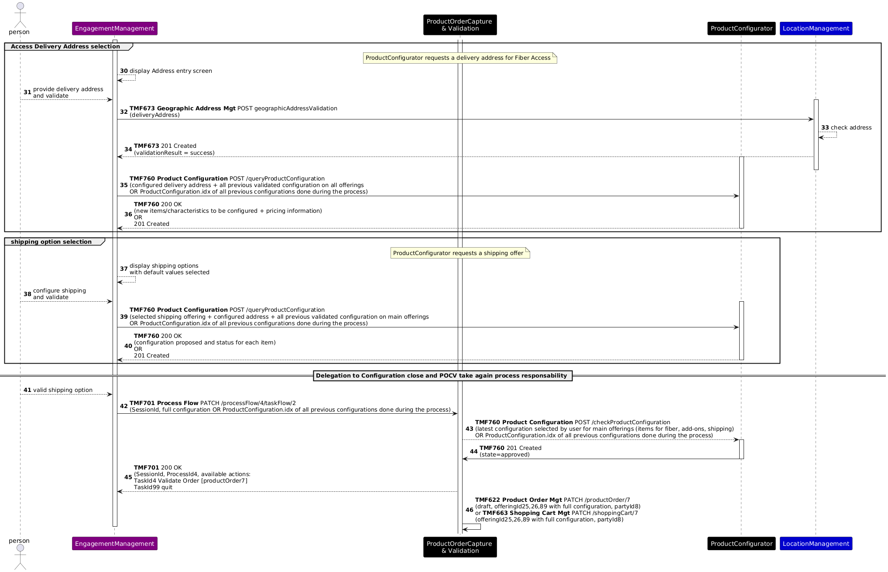
*([PlantUML source](media/delivery-address-shipping-sequence.puml))*

##  Step 4 - Validation of the Product Order items

- All the items of the Product Order (or Shopping Cart) are summarized, with their configured characteristics and prices including discounts.

- And John Smith validates his Product Order configuration (or Shopping Cart). 

- From a process perspective, the shopping cart is 'translated' in a product order (entity) (if shopping cart is used)

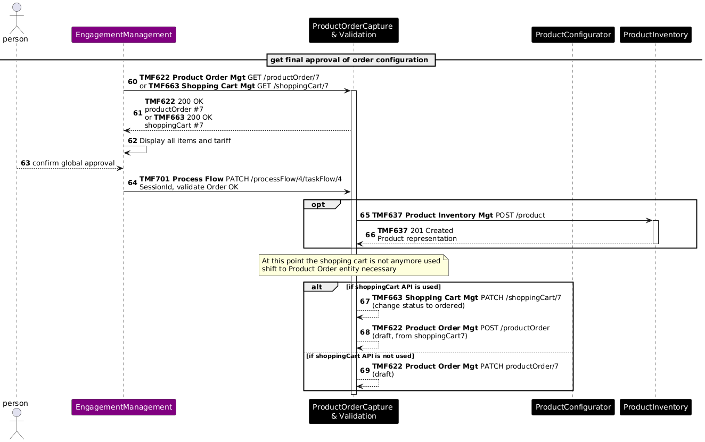
*([PlantUML source](media/order-items-validation-sequence.puml))*

** **

##  Step 5 - Customer Information required

- Depending on the product offerings selected (and associated action) the ProductOrderCaptureValidation component identifies all required contextual information required like

- an appointment if installation on site is required

- a billing account if recurring charge or usage charge are present

- a payment if at least one product offering requests an immediate payment

- party information such as legal address or contact means

- ...

- From the information providing by the process, the front-end displays the screen to capture this data 

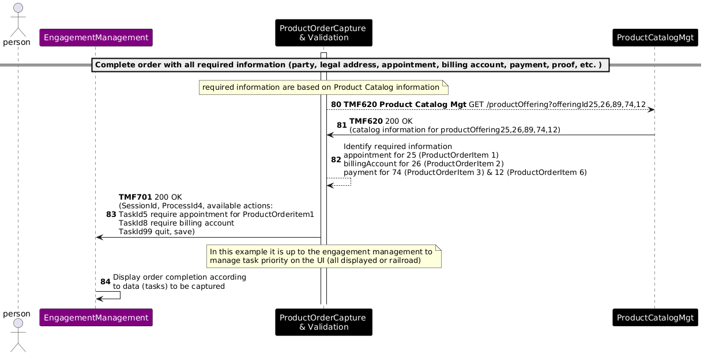
*([PlantUML source](media/complete-order-required-info-sequence.puml))*

- Appointment Management is not displayed in this release

- Party Management information is not detailed in this release

- Payment is not detailed in this release

- Billing Account Management is not detailed in this release

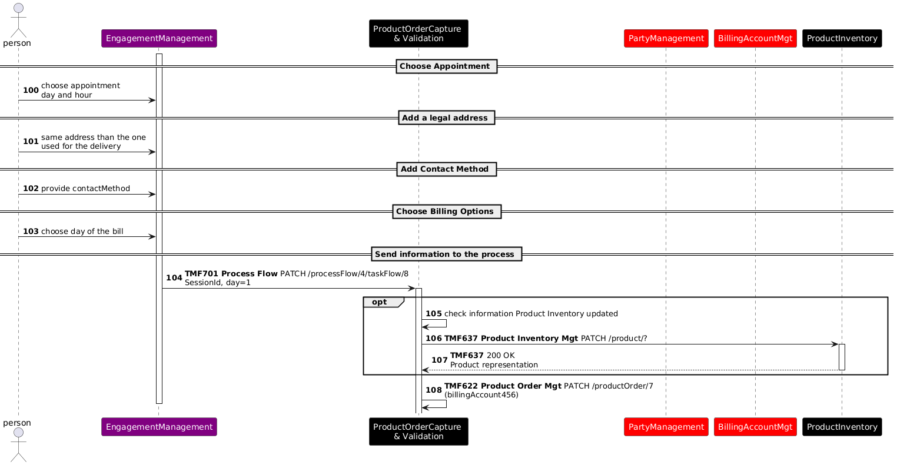
*([PlantUML source](media/appointment-address-billing-sequence.puml))*

## Step 6 - Order confirmation and completion

- Once all data is captured on Step 5, user can click on "Confirm your data" to complete the order processing.

- User confirms the order - the order state shifts to acknowledged.

- At this stage, if the product inventory has not been created earlier, it is created.

- ProductOrderCaptureValidation component is making a final check and shift the order to 'inProgress. accepted' state if ok.

- Optionally, ProductOrderCaptureValidation could trigger stock reservation, in particular if the box has to be picked up in store by the customer.

- Events are launched in order to trigger order delivery.

- ProductOrderCaptureValidation component process is completed and a new welcome process is launched to support follow up interaction with the user.

 

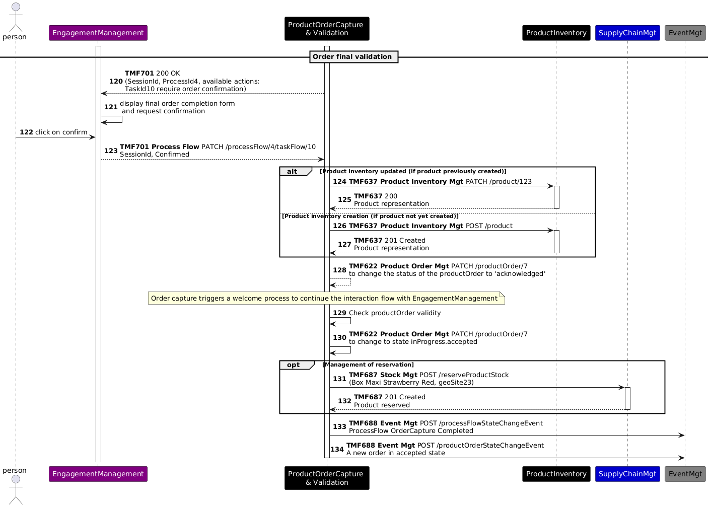
*([PlantUML source](media/order-final-validation-sequence.puml))*

At the end of these steps, we will have the following information in the Product Inventory:

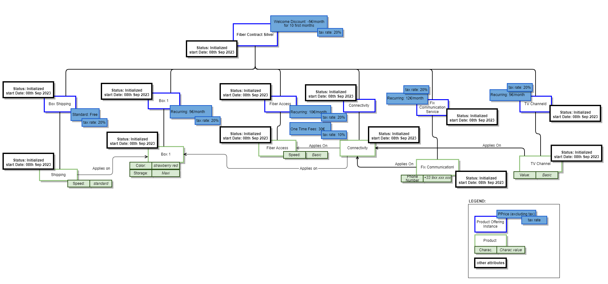
*([PlantUML source](media/product-order-instance-view.puml))*

# Conclusion

## Lessons learned

Even if the use case still needs to be detailed, especially at step 5 - Customer Information required, this version illustrates all the decoupling, sub-process delegations and data driven capabilities initially planned.

## Impacts identified

| Project | Jira identifier |
| --- | --- |
| API | AP-3771 - Service Qualification - Add an appointment required in the response  backlog → CANCELLED   *([text description](media/done-checkmark-icon.text-description.md))* New JIRA : [AP-6200] TMF645 - Add additional information in the response - TM Forum JIRA |
| API | AP-3772 - Introduce Stock Item identifier concept in Stock API  done   *([text description](media/done-checkmark-icon.text-description.md))* |
| API | AP-3773 - Add a Task to generate ProductOrder from ShoppingCart  done   *([text description](media/done-checkmark-icon.text-description.md))* |
| API | TMF620 Product Catalog API: treat impacts of the SID Jira tickets ISA-898 on the API resource model |
| API | TMF633 Service Catalog API: treat impacts of the SID Jira tickets ISA-899 on the API resource model |
| SID | [ISA-898] Product Specification ABE - Add attributes to manage technical eligibility check and geographic address need - TM Forum JIRA |
| SID | [ISA-899] Service Specification ABE - Add attributes to manage technical eligibility check and geographic address needs - TM Forum Jira |
| SID | [ISA-905] Add a relationship between CFS Spec and Resource Spec - TM Forum JIRA |

As many APIs will be modified with the V5 transformation, sequence diagrams will need to be checked when the APIs V5 are published.

Note: TMF620 Product Catalog API V5 offers now the capability to define a global min/max cardinality between bundle and bundled product offerings.

