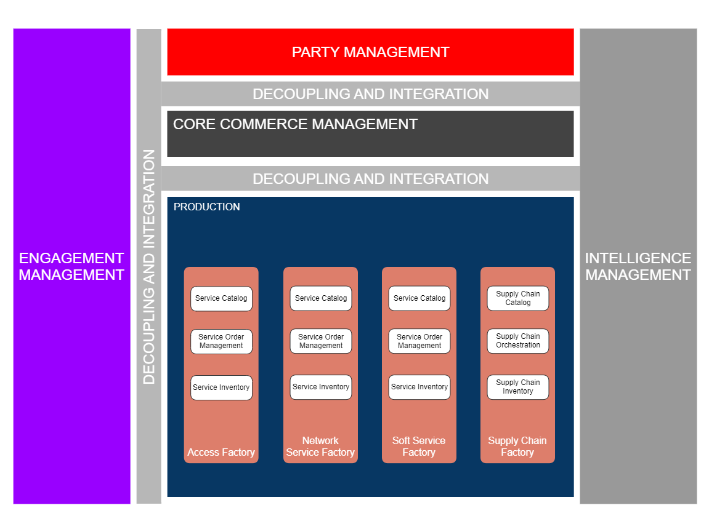
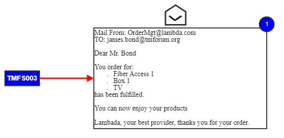
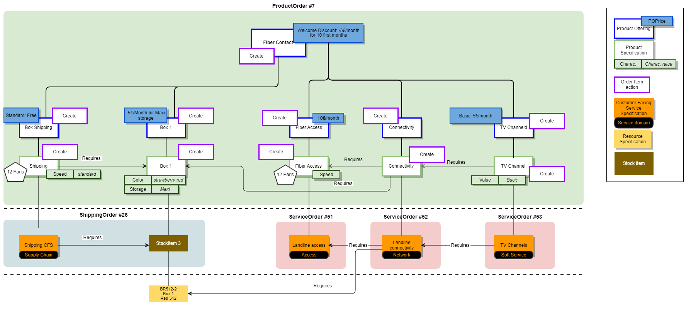
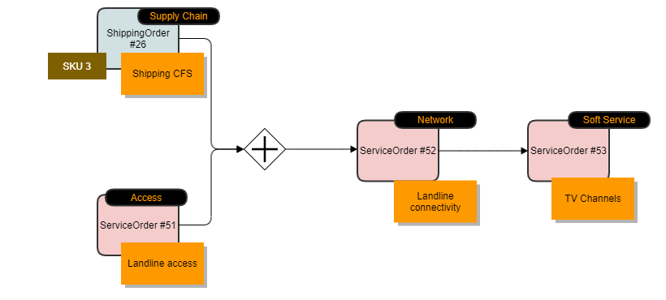
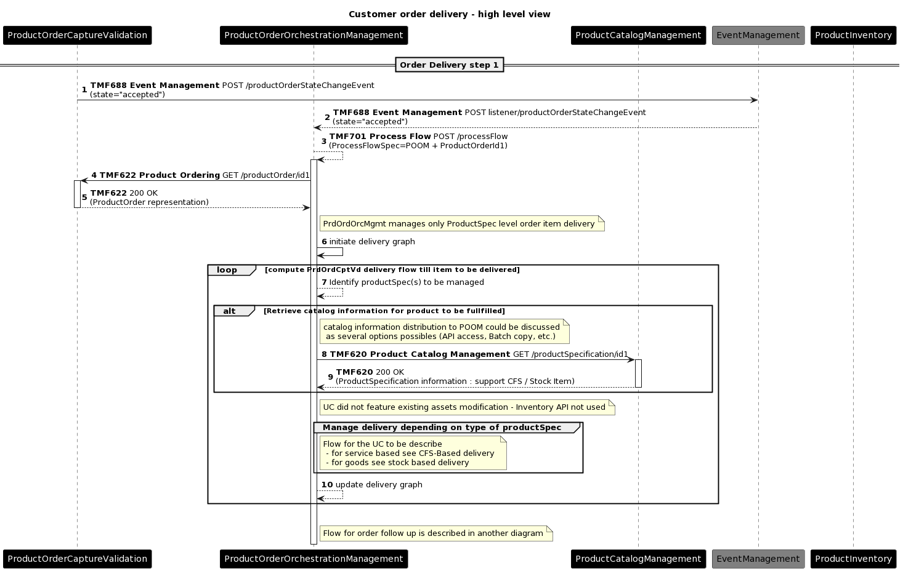
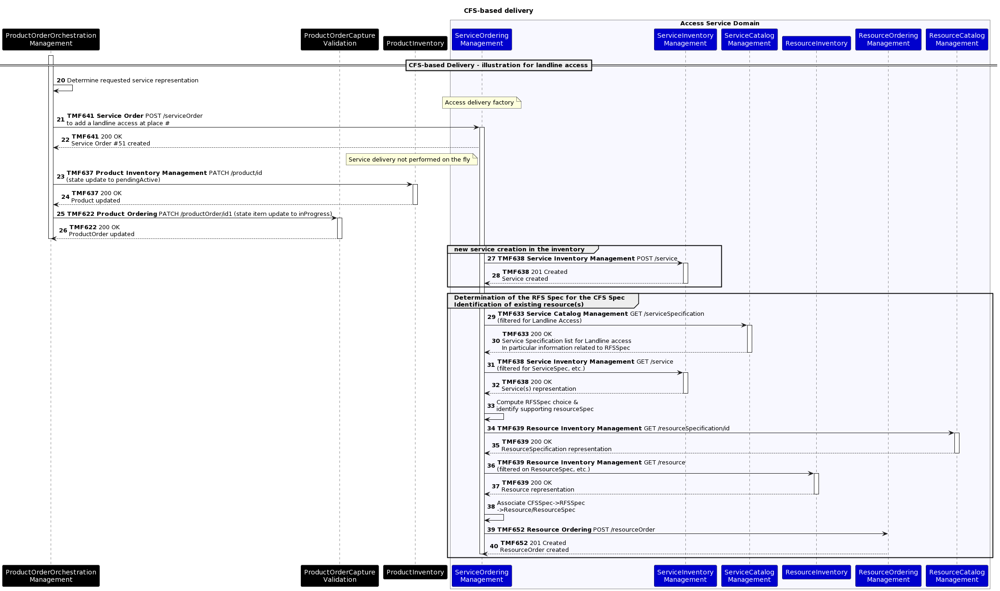
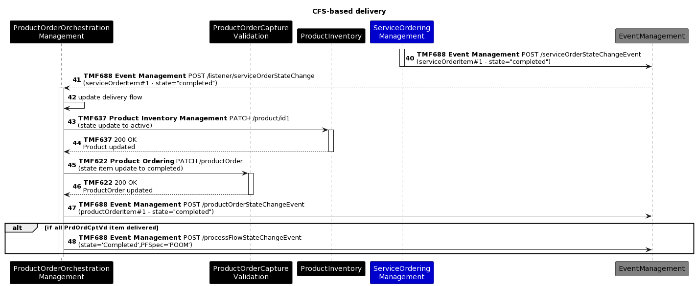
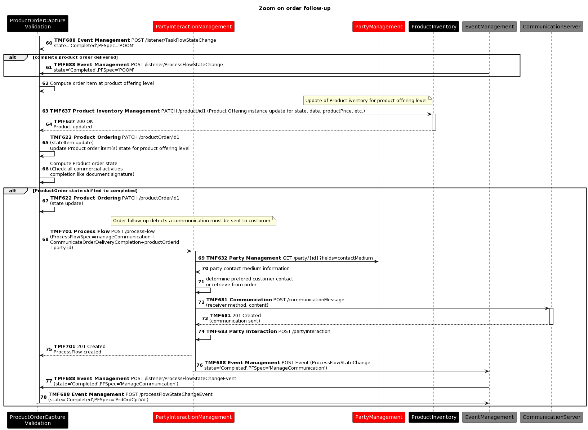
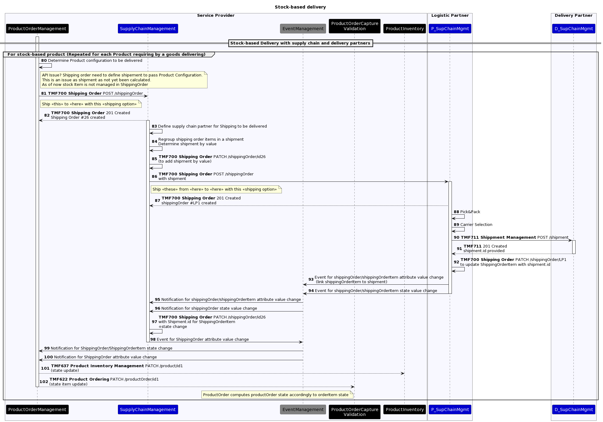
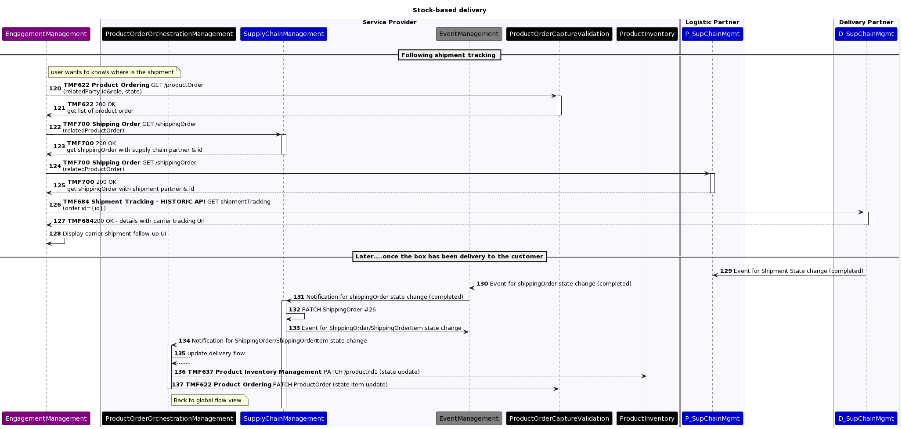

# Introduction

This use case illustrates the delivery of a customer order, driven by the catalog model and content, and the set of related ODA components and TMF Open APIs. 

This use case follows TMFS003.

## Context or Background

This use case is based on the organization of the Production functional block in several domains each of them being responsible of a set of services (CFS specification), for which the domain implementation is able to manage fulfillement, assurance and usage processes.

As described in IG1167 ODA Functional Architecture Exploratory Report, the Orange implementation scenario for the Production block called these domains "factories".

Each domain or factory exposes to the Core Commerce Management functional block its services specificaitons (CFS specification) to permit it to define the commercialized products and packaged offers (Product specification and Product Offerings).

We will consider in this use case several services provided by different factories:

- Landline Access, managed by the Access Factory

- Landline Connectivity, managed by the Network Services Factory

- TV channels, managed by the Soft Services Factory

- Box and Shipping Conditions, managed by the Supply Chain Factory

According to ODA principles, the Core Commerce Management is totally agnostic of technical solutions (RFS specification) managed by the factories to deliver their services. It uses the services definitions (CFS specification) of each factory to define the commercialized products (Product specificaiton).

In some cases the technology can be a marketing or business argument - so it is also possible to instantiate services associated to a specific technology and related products, as we do here for the Fiber Access.

*([text description](media/oda-functional-architecture-overview.text-description.md))*

## Objective of the use case

The objective of this use case is to illustrate with the delivery of a customer order, including different factories/domains, the capabilities defined by the ODA functional architecture, and provided by the ODA components and Open APIs.

- Core Commerce Management - Production decoupling: the main information shared by these 2 functional blocks correspond to the service layer

- CFS specification at catalog level for Product specification definition, as illustrated in TMFS012 (or Stock Item definition for tangible products)

- Product specification - CFS specification relationship usage at global orchestration level by TMFC003 Product Order Delivery Orchestration and Management (POOM) - or Product Specification - Stock Item relationship for tangible products

-  Process delegation and decoupling: TMFC003 Product Order Delivery Orchestration and Management (POOM), the component in charge of the global orchestration of the delivery process, will delegate the sub-processes it is not directly responsible for to the dedicated components

- the delivery of a tangible product is the responsability of the Supply Chain (TMFC032)

- the delivery of an intangible product is the responsability of the Service Order Management component (TMFC007) of the related factory/domain.

- etc

- Date driven process: the order delivery process is totally driven by the Product Catalog and the Service Catalog models and contents

## Scope and assumptions

### Scope

Several steps are described:

- The global orchestration of the delivery of the products ordered by the customer

- The delegation of the delivery of tangible products to the supply chain

- The delegation of the delivery of products based on CFS to a service order delivery system

- The detailed orchestration of the delivery of the service order

- The closure of the customer order, after the delivery of each product.

- The interaction triggered to inform the customer that his order is fulfilled

### Assumptions

The delivery process is entirely driven by the catalog model and information:

- no product offering level information is needed for the delivery process

- the product catalog is explicit and describes all the products that need to be delivered (even if they are free of charges)

- each product described in the use case corresponds to an atomic product in the SID model (no composite product used here)

- each intangible product specification is based on a CFS specification, and associated to the factory/domain in charge of its delivery

- each tangible product specification is associated to a set of stock items and to the supply chain system for its delivery.

- functional pre-requisite relationships are defined between product specifications and used by the global orchestration process to build and manage the delivery graph

- Service Order Management components (TMFC007) are responsible for the entire lifecycle of service orders

- Product Order Delivery Orchestration and Management component (TMFC003) triggers the update of the status of the product order items and their related product inventory items, according to the correct execution of the delivery process

- Product Order Capture and Validation component (TMFC002) is in charge of the closure of the product order, according to the delivery of each customer order item, but also the respect of commercial conditions such as the contract document is signed by the customer, or proof of identity are provided by the customer.

# Description

Order fulfillment and confirmation to customer

*([text description](media/order-fulfillment-email-mockup.text-description.md))*

# Information View

## Global catalog view

*refer to comment in TMFS003 about order structure ("**Same comment about the order structure as in UC3 - need product order as container, and the structure is by the order items not by the products.")*

## Order delivery view

*([PlantUML source](media/order-delivery-view-product-order.puml))*

Orchestration of orders:

*([text description](media/order-fulfillment-sequencing-diagram.text-description.md))*

# Sequence diagrams

## High level view

Following diagram shows the high level view for delivery of the product order. Additional diagrams are provided for each delivery depending on the 'support' entity (CFS or stock-based).

- An "Order Capture Completed" or "ProductOrderStateChange" (to inProgress.accepted) event from Product Order Capture Validation (POCV) triggers order delivery process

- Assumption: Product Order Orchestration Management (POOM) did not own a catalog copy but instead query the catalog in real time.

- POOM is only in charge of the delivery of the order item at product specification level.

- POOM delivery graph is built from 'constraint' (*requires* link) between order item.

- POOM manages the orchestration of the Service Order / Shipping Order accordingly as SOM and logistic system are not "aware" of this orchestration.

*([PlantUML source](media/order-delivery-high-level-sequence.puml))*

## Step 2

Zoom on delivery for product Specification based on Service Specification - This flow uses the landline access as example.

### Step 2.1: From ProductOrder to RFS Service determination (including resource identification)

- For this service, the service order is triggered to the Access Domain Service Order Management (SOM). Note that other factories will be used for the 3 other services.

- SOM uses Service Catalog to identify potential RFS specification, based on that, SOM determines the RFS to use for this particular CFS delivery, and then SOM identify if existing resource instance could be re-used.

Note: add a Service Qualification check in the next version

*([PlantUML source](media/cfs-based-delivery-sequence.puml))*

At this stage we do not illustrate further the Resource delivery and the Service order update from the ROM.

### Step 2.2: Product Order & inventory update once delivery done

- Once a service order item delivered (or fails), the SOM triggers an event (State change event)

- This event is listened to by POOM component.

- POOM triggers accordingly Product inventory & Product order update

- POOM also triggers an event change.

*([PlantUML source](media/cfs-based-delivery-completion-sequence.puml))*

## Step 3

Zoom on order follow-up (performed by the Product Order Capture & Validation)

*([PlantUML source](media/order-follow-up-zoom-sequence.puml))*

## Step 4

The step 4 focuses on the delivery of 'goods' product involving the supply chain.

In this example we describe a delivery with 2 partners for the Service Provider (SP):

- A warehouse partner - The SP has the management of the supply chain but the goods themselves are stored in a partner warehouse. The warehouse partner has the responsibility to manage the stock but also to prepare the shipment at SP request.

- A shipping Partner - This partner has the responsibility to move goods from point A to point B under defined shipping options. 

In our example the warehouse partner triggers directly the shipping partner to expedite shipment (assumption)

Note: this step will be reviewed in a next version, and harmonized with TMFS008. Shipping and logistics partners may well have its own standards governed by other SDOs, since they are not unique to communications industry.

### Shipping Order & Shipment definition

In this part:

- POOM triggers a ShippingOrder to SP supply chain. The Shipping order should describe the product configuration (

*([text description](media/warning-icon.text-description.md))*
** following SID it should be stockItem**), place where it must delivered and what are the shipping condition. The reference of the productOrder is passed.

- *([text description](media/warning-icon.text-description.md))*
 As of now product configuration is defined through ShippingOrder→ shippingOrderItem → Shipment - this is an issue because POOM cannot compute the shipment (this is Logistic responsability) so we need a link shippingOrderItem → ProductConfiguration/stockItem.

- *([text description](media/question-mark-icon.text-description.md))*
 Is really the shippingOrder the right API for the interaction between POOM and the supply chain?

- SP Supply chain identifies if and which logistic partner will be involved. Then SP Supply chain computes the shippment to be done by regrouping ShippingOrderItems.

- SP Supply chain triggers to Logistic Partner a Shipping Order with Shipment described

- Logistic Partner picks the goods and then packs them following shipment decription.

- Logistic Partner triggers shippment request to transport partners and then updates the shipping order with the link(s) to the shipment. 

*([text description](media/warning-icon.text-description.md))*
 reference of the productOrder should be added in the shipment

- Events are triggering on shipment and are used to updat the shipping orders.

- POOM updates accordingly the product inventory and the product order.

*([PlantUML source](media/stock-based-delivery-sequence.puml))*

### Shipment tracking management

In this second part:

- We illustrate how "any" user on the UI can query to know where the package is.

- Then we illustrate the shipping completion with event going from the transport partner to the POOM.

- Product Inventory & Product order are updated accordingly.

*([PlantUML source](media/shipment-tracking-sequence.puml))*

# Conclusion

## Lessons learned

This use case illustrate how the delivery of a multi-products order can be globally orchestrate at Core Commerce level, by a Product Order Delivery Orchestration and Management component (TMFC003) and delegated to several factories or domains in Production.

It also demonstrates the capabilities of the global catalog model to drive the delivery process.

## Impacts identified

- [[ISA-905] Add a relationship between CFS Spec and Resource Spec - TM Forum Jira](https://projects.tmforum.org/jira/browse/ISA-905)

- trace Jira related to APIs 

- TMF700 Shipping Order Management

- TMF711 Shipment Management

