# Introduction

## Context or Background

This use case** is a continuation of use cases TMFS003 and TMFS004**:

- TMFS003 illustrates the order capture for a fiber contract, describing the fiber contract in the product catalog, a product order of this fiber contract, and the resulting product inventory.

- TMFS004 addresses the order delivery, and the update of the product inventory.

## Objective of the use case

This use case details the **calculation of billable items **and the **preparation of the first invoice post-order delivery**. It focuses on the mechanisms for cost calculation and invoice presentation.

- **Next Version Highlights: ** In a next version, we could add a sequence diagram to illustrate intermediate bill preparation.

## Scope and assumptions

### Scope

TMFS005 Illustrates the billable items calculation and the bill presentation for:

- Recurring costs

- One-time costs 

- Usage-based costs 

- Discounts 

- Taxes

As part of preparing the first invoice, we will illustrate the calculation of prorated amounts for recurring costs.

**Please note: Invoice delivery is out of scope for this use case.**

### Assumptions

- Costs are due from the date a product status is updated to activated. We consider here that all the products are activated at the same date.

- Recurring costs are billed in advance.

- The first bill is produced according to the billing cycle corresponding to the billing account associated to the Fiber Contract

- The first bill includes the costs related to the period between the activation date of the products and the starting date of the billing period. This corresponds to the operator choice, for example another scenario could be to trigger the first bill directly after activation.

- Taxation is a complex topic, and the approach taken in this use case involves calculating taxes as part of the billing process. This approach aligns with certain regulatory frameworks where charges are exclusive of tax. However, it's important to note that this is an operator choice, and in some cases, regulations may require charges to be inclusive of tax. 

-  The bill also includes the rating of service usage based on the collected CDRs, considering the specification of these usages in the catalog and the applied taxes.

-  The bill generation is triggered by a timer according to the billing cycle 

# Description

We illustrate here the production of monthly bills, based on bill cycles associated to each billing account, and that takes into account differently the different types of charges. As an example, the bill corresponding to month N will cover:

- **Recurring fees:** These are fixed fees that occur every month, such as a subscription. They are usually paid in advance, so correspond to month N.

- **One-time fees:** These are unique fees that are charged only once (e.g., activation fees) and occurred since the last bill. They correspond to month N-1.

- **Usage fees:** These are charges based on your use of the services since the last bill. They correspond to month N-1.

If a new contract is subscribed during month N - or modified during this period - we consider in this use case that the impacts are covered by the month N+1 bill.

Note: Other choices could be done by CSPs. For example, some CSPs could prefer to produce a dedicated bill, covering the period between the delivery date of the new products and the standard monthly bill date. Other CSPs could propose to the customer to choose the starting date of his billing period.

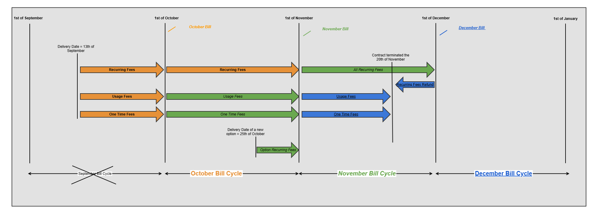
*([text description](media/billing-cycle-timeline.text-description.md))*

For the first bill covering the month of October, we also take into account the period before the beginning of the month. As the products are activated on September 13th, the October bill will include:

- Prorated charges for the period from September 13th to September 30th,

- October's recurring fees, as they are usually billed in advance,

- Usage Fees related to September

- One time Fees also related to September.

To illustrate the second bill, covering the month of November, we consider that a new option of the contract has been ordered and delivered the 25th of October, so the November bill will include:

- November's recurring fees, as they are usually billed in advance,

- Prorated charges related to the new option for the period from October 25th to October 31st,

- Usage Fees related to October

- One time Fees also related to October, if any.

When the contract is cancelled by the customer, here November 20th, the last bill related to December will include:

- Refund of prorated recurring charges related to the period from November 20th to November 30th, as they were paid by advance with the November bill.

- Usage Fees related to November

- One time Fees also related to November, if any.

Each bill cycle not only defines the period of charges to take into account to prepare the bill, but it also defines:

- The bill sending date,

- The payment deadline,

- The date of reminders in case of non-payment,

- The date of the bank automatic debits (if it is the payment mean chosen by the customer),

- The dates of usage limitations measures in case of non-payment (service restriction, additional fees),

- ...

Bill Life Cycle:

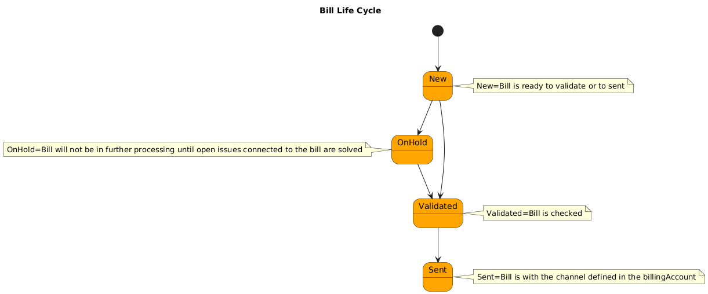
*([text description](media/bill-life-cycle-state-diagram.text-description.md))*

# Information View

##  Inputs

The product inventory view is the output produced by the previous use cases TMFS003 and TMFS004. It includes the Product Prices calculated during the order capture process. Their starting date has been initiated as a result of the order delivery, as the active status of the product and product offering instances. 

The inventory view has been updated to include tax rate values that are dependent on the product price type. A 20% tax is levied on recurring prices, while a 10% tax is imposed on one-time fees.

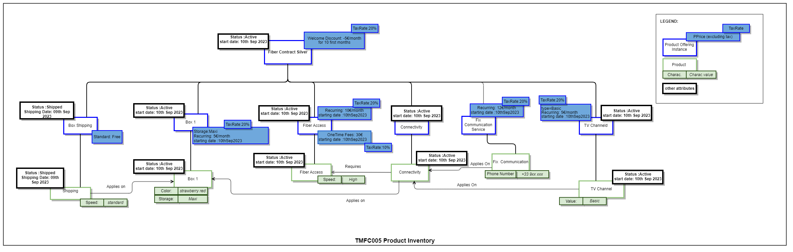
*([PlantUML source](media/product-inventory-view.puml))*

The diagram below illustrates the link between the active products that will be charged to John's billing account, which has been assigned a billing cycle. It also highlights that John as a customer holds a fiber contract and has been assigned a billing account.

To each product offering instance is assigned one (or several) price(s) and a corresponding tax rate described as an alteration.

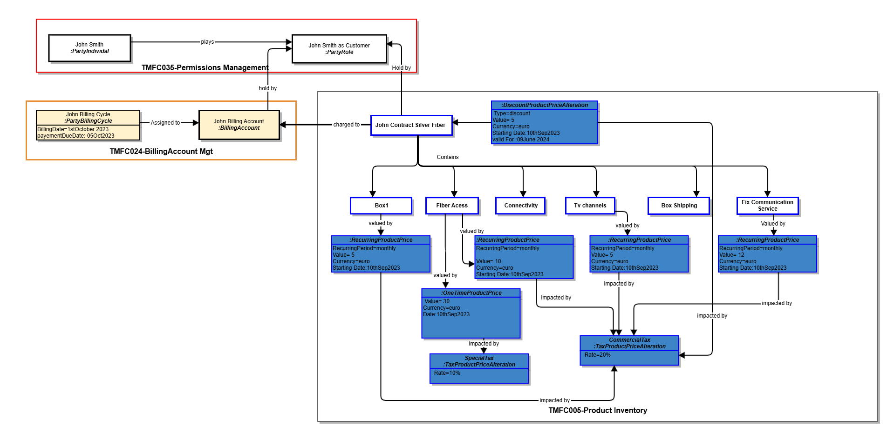
*([PlantUML source](media/customer-contract-billing-view.puml))*

## Applied Customer Billing Rate Information view:

The diagram outlines how the billable items relating to the first invoice are generated, using the product prices described in the product inventory, the billing cycle and performing pro-rata temporis calculations

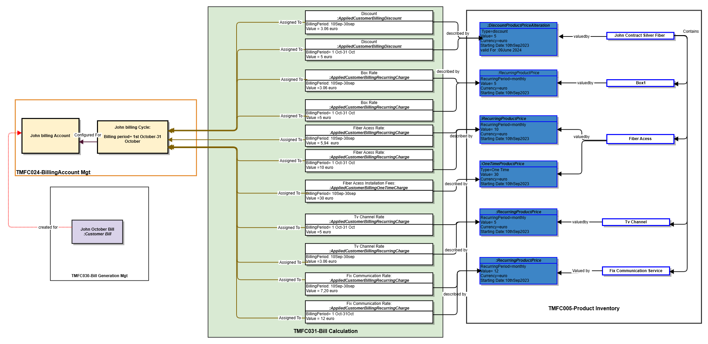
*([PlantUML source](media/applied-customer-billing-rate-view.puml))*

Please note :

- Monthly discount: -5 €

- Daily discount: -5€ / 30 days ≈ -0.17€ per day

- Calculate total discount: Discount for 18 days: -0.17€/day * 18 days = -3.06€

- Monthly Price:5 €

- Price per day: 5 € / 30 days ≈ 0.17 € per day 

- Amount for 18 days: 0.17 €/day *18 days = 3.06 €

- Monthly Price:10 €

- Price per day: 10 € / 30 days ≈ 0.33 € per day

- Amount for 18 days: 0.33 €/day * 18 days = 5.94 €

## Applied Customer Billing Taxe Rate Information View :

In order to calculate the elements required for generating the first invoice in the diagram below, we proceed with the calculation of the tax value. This tax value is **applied to** the pre-calculated **'appliedCustomerBilling charge**'. The sum of '**appliedCustomerBilling taxe rate**' and '**appliedCustomerBilling charge**' corresponds to the price already displayed to customers during Order Capture (for an entire billing period).

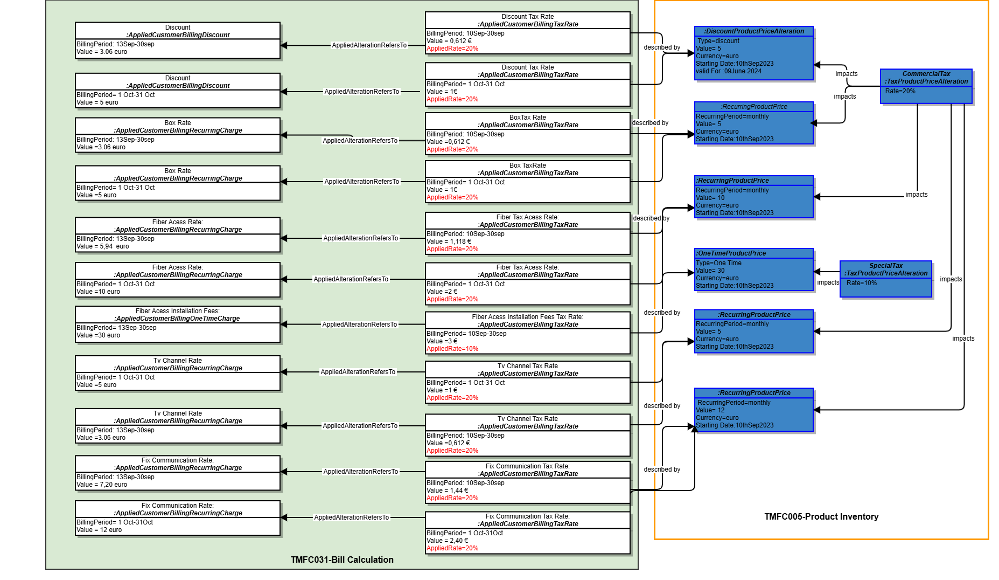
*([PlantUML source](media/applied-customer-billing-tax-rate-view.puml))*

## Product Usage Rating & Bill Generation :

 The data model below will rely on the following usage table, which is an input from TMFS003.

| Product Usage specification | Usage Product Offering Price Charge (excluding tax) | Tax Product Offering Price Alteration (tax rate) |
| --- | --- | --- |
| Data | 1 € per Mo | 20% |
| Voice for national fix number | 0,1 € per minute | 20% |
| Voice for mobile in Europe | 0,5 € per minute | 20% |

This diagram illustrates a process for rating usage records related to "fix communication" product. It involves several steps like :

- Identifying and retrieving service usage records associated with the "fix communication" product. These records capture information about the specific usage of the product, such as duration, data consumption, or other relevant metrics.

- Based on the retrieved service usage records, new product usage records are created. These records serve as the foundation for the rating process, providing a structured representation of the usage data.

- The calculated usage ratings are determined by applying specific rating criteria to the product usage records. These criteria may involve factors such as:

- The Usage product offer price defined in the product catalog is used to determine the base rate for each usage record.

- Applicable taxes  

- Specific metrics, such as usage duration or data consumption...

- Based on the Calendar Event generated by the Bill Generation Component, the bill will be generated for specific billing accounts that have a cycle aligned with the Calendar Event date.

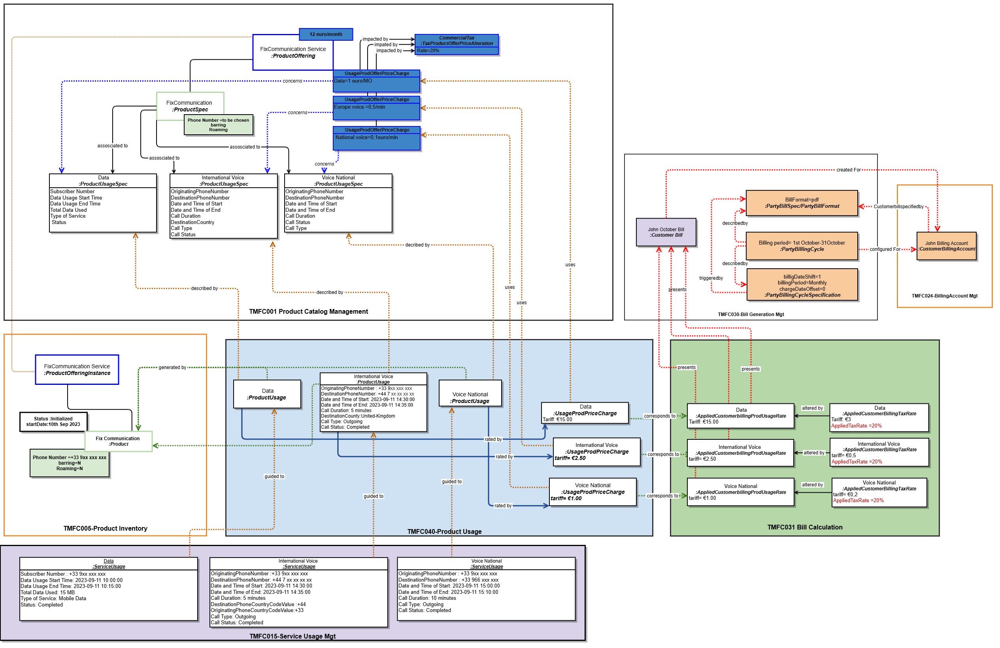
*([PlantUML source](media/usage-rating-bill-generation-view.puml))*

# Sequence diagrams

In our use case, we've selected the event that triggers the calculation of the billable items (excluding usages) to be the change in the product item status. Specifically, when the product item status changes from 'Created' or 'Initialized' to 'Active' - or from 'Active' to 'Inactive'.

These events will be consumed by the** 'Bill Calculation Management**' component and initiate its internal process for creating the **Applied Customer Billing Rate** item. It permits to prepare as soon as possible the inputs for the next bill along the way, and not be obliged to wait the beginning of the bill cycle.

It is important to note that The 'Bill Calculation Management' component is subscribing to events signaling status changes for product inventory items of **'product offering' **type.

These events trigger the calculation of the** initial invoice items upon a transition to the 'Active' status, and the final refund invoice items upon a transition to the 'Inactive' status**.

For intermediate bills, the triggering event might be a calendar-based event or business rules.

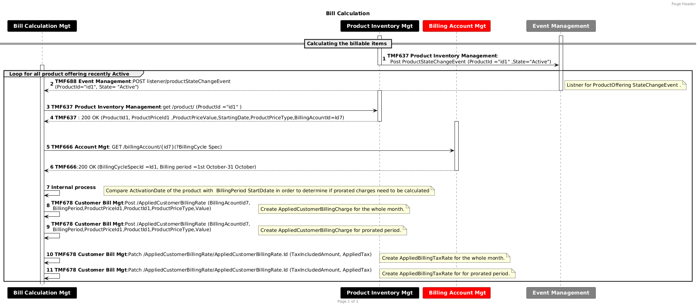
*([PlantUML source](media/bill-calculation-billable-items-sequence.puml))*

TMF 678 :In our use case, to fulfill the functional requirement of creating and updating AppliedCustomerBillingRate using the TMF 678 API, we need to introduce 'POST' actions for creation and 'PATCH' actions for updates, exposed internally to the 'bill calculation' component. (Jira Ticket Created)

- Usage Record Rating:

In the diagram below,we start with a CDR that has been created and validated as a consequence of a "ServiceUsage" generated by the service usage management component. This CDR is sent as an event to the product usage management component which will initialize a "ProductUsage" records based on information collected form the inventory and the catalog. These records are then rated, and the resulting data serves as a trigger for the calculating the "AppliedCustomerBillingRate". We are using the TMF727 and the TMF767 APIs in V5 which will replace the TMF635 as it is being deprecated

This scenario demonstrates a usage-based trigger designed to track consumption with the highest possible precision. However, other triggers could also be considered, such as:

- A time-based trigger, where charges are calculated at regular intervals (e.g., weekly event).

Or we may expand the main scenario by:

- An event-driven trigger, where usage is rated again due to changes in the customer's subscription, contract, or promotions applied.

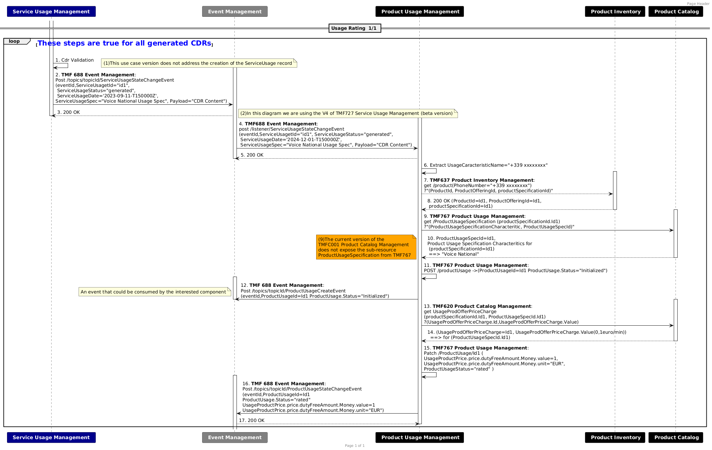
*([PlantUML source](media/usage-rating-sequence.puml))*

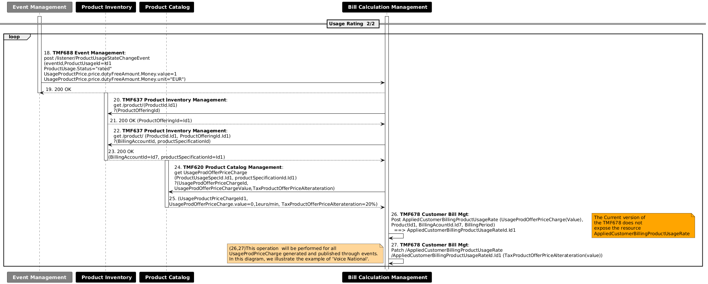
*([PlantUML source](media/usage-rating-continued-sequence.puml))*

**Bill Generation Diagram is described below:**

In the diagram below, the invoice generation process is triggered by a calendar event configured at the bill generation management component, while knowing that other methods or triggers could also be implemented to initiate this process.

- A threshold-based trigger, where billing is initiated once a predefined consumption limit is reached. (as a prequisitie : usage has alrealdy been rated ) ==>this scenario serves as a complementary approach enabling the generation of an intermediate bill.

In our example below, we will describe John's invoice generation on October 1st.

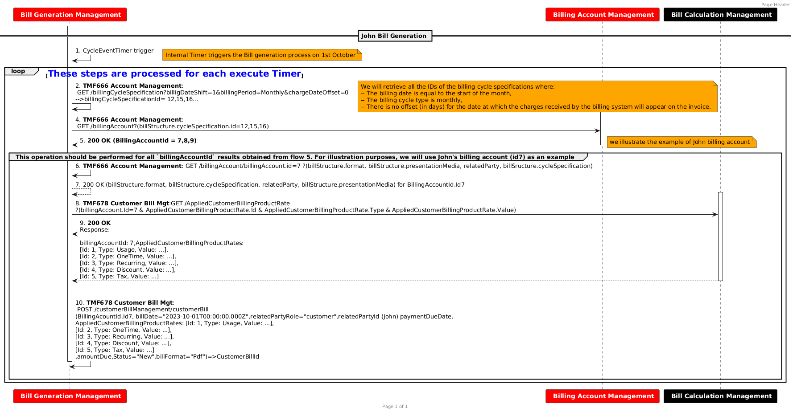
*([PlantUML source](media/john-bill-generation-sequence.puml))*

# Conclusion

## Lessons learned

- Billing calculation scenarios are highly customizable, allowing each operator to tailor them to their specific business requirements.

- The Bill calculation management component employs internal processes and rules to handle the initialization of the first invoice, intermediate invoices, and subsequent post-billing tasks.

- The triggering of the bill can be initiated from a calendar event as described in the example of this use case version, but could have other types such as a termination order, or reaching a well-defined consumption threshold to which an intermediate bill is associated.

## Impacts identified

| Project | Jira identifier |
| --- | --- |
| API | [AP-6883] TMF678 - add POST, PATCH, DELETE operations on appliedCustomerBillingRate - TM Forum JIRA |
| API | [AP-6884] TMF678 - specialize applicationCustomerBillingRate - TM Forum JIRA |
| API | Evolution of Usage APIs from v4 to v5: |
| API | The Current version ofthe TMF678 does not expose the resourceAppliedCustomerBillingProductUsageRate ->covered by [AP-6884] TMF678 - specialize applicationCustomerBillingRate - TM Forum JIRA |
| API | TMF767 :Replace "received" by "initialized" for ProductUsage Status. → Update willbe done without Jira Ticket |
| Oda-Component | The current version of theTMFC001 Product Catalog Management does not expose the sub-resource ProductUsageSpecification from TMF767 ->decision to be made to determine whether productUsageSpecification remains in TMF767 or will move to TMF620  AP-4783 - Move/rename UsageSpecification from TMF635 Usage Management to TMF620 Product Catalog  backlog   *([text description](media/done-checkmark-icon.text-description.md))* |

# Appendix

To effectively manage events, a foundation for data exchange between producers and consumers must be established. This call flow diagram illustrates the essential steps involved in configuring the consumer-producer relationship. Producers must first configure topics to categorize and organize their events. Once topics are defined, producers can generate and emit events aligned with these categories. Consumers then subscribe to specific topics of interest, enabling them to receive and process relevant events efficiently. This foundational setup ensures seamless event delivery and consumption.

**T**his diagram provides a simplified overview of an event-driven architecture based on the TMF688 standard. It illustrates the fundamental interactions between a Producer, an Event Management (Broker), and a Consumer. This diagram serves as a reference model for designing and implementing event-driven systems.

- **Components and Interactions:**

- **Producer:**

-  The Producer initiates the process by creating a topic on the Event Management Broker. This topic acts as a channel for specific types of events.

-  The Producer publishes events to the created topic. Each event is associated with an event type and carries specific data.

- **Event Management (Broker):**

- The Broker handles the creation and management of topics, as well as the processing of subscriptions from consumers.

-  It delivers events to subscribed consumers based on their specified filters and interests.

- **Consumer:**

-  The Consumer subscribes to specific topics of interest (or Events), providing a callback URL to receive event notifications.

-  The Broker sends events to the Consumer's callback URL. The Consumer processes the received events and performs necessary actions.  

- **Event Management and Alternative Implementation Scenarios**

We will describe two possible scenarios for event management :

- Centralized Scenario: Where event management is handled by a dedicated component (Event Management) using the standard TMF 688 API.

- Point-to-Point Scenario: Where events are consumed and published directly via the notification sub-resource of a given API, without relying on a central event broker.

In the diagram below, we clearly illustrate that event management is** centralized within the Event Management component,** utilizing the TMF 688 API as the standard interface for event handling.

However, it is important to note that in certain implementations, some event brokers—such as Kafka or others—do not expose the standard API (TMF 688) but instead provide their own proprietary APIs for event handling.

- 

- **Centralized Scenario:**

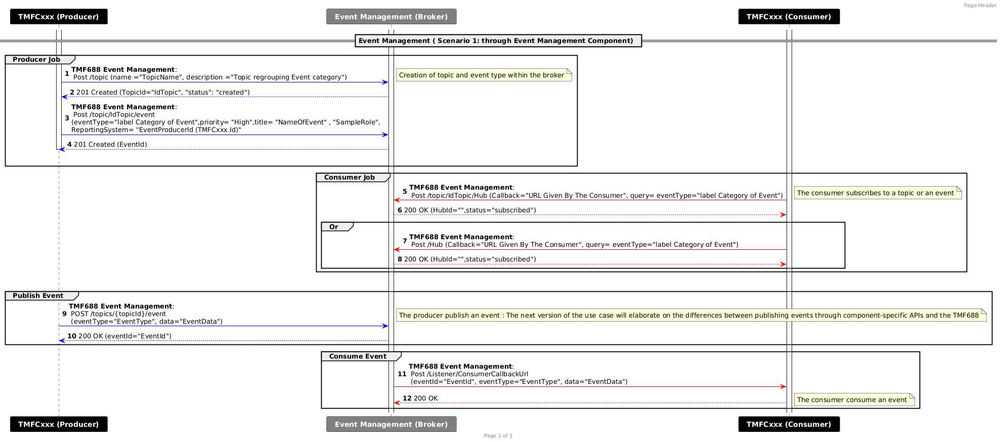
*([PlantUML source](media/event-management-centralized-scenario-sequence.puml))*

Additionally, we present a second diagram, which illustrates an alternative scenario. In this case, event consumption and publication are handled through the** notification sub-resource of a given API**, rather than relying on a centralized event management component. This represents a point-to-point integration model, where events are consumed and published directly between services without a centralized event broker.

- 

- ** Point-to-Point Scenario:**

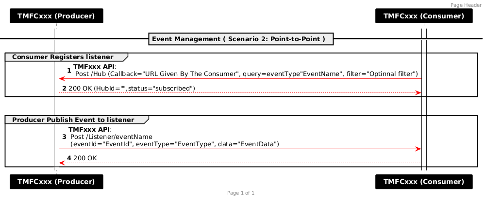
*([PlantUML source](media/event-management-point-to-point-scenario-sequence.puml))*