# Introduction

## Context or Background

As part of specifying ODA Components, there is a need to determine the boundaries of components related to usage and balance management and on the same time relate to other standards such as 3GPP for charging of mobile connectivity. This use case intend to explore the relationships between ODA Components, SID, Open APIs and 3GPP to map and translate how the different functions overlay, interact, and what the boundaries are to generic global component definitions. The use case will be input to Component Specification work related to, but not limited to Usage Management (Product/Service/Resource), Service Balance Management, and Product Usage Management. Open APIs in consideration relates to Usage Management, Usage Consumption and what today is called Prepay Balance Management ([API-4165](https://projects.tmforum.org/jira/browse/AP-4165?filter=-2) raised to rename the API to remove the customer type reference). 

## Objective of the use case

The objective of this use case is to illustrate the behavior of usage and balance management and how it varies depending on the product and service definitions for mobile services. It explores how 3GPP relates and is mapped within ODA to Components and Open APIs. 

The primary audience is for people who look to understand components related to usage and balance management, their boundaries, interactions, and how they relate to 3GPP for mobile connectivity. With the current limited definition of the area it will bring clarity and be able to be used as input to drive ODA Component specifications. 

 As output, like for other IG1228 use cases, we will contribute to TMF projects via Jira if we identify missing or incomplete assets.

## Scope, assumptions and considerations

### Scope

Our first goal is to illustrate, and we will do this iteratively:

- a simple case of one user with one device and where the user and the paying party is the same

- how usage events are managed, processed, and included in balances

- the behavior of balances that are impacting services (quota management)

- how usage and balances can be retrieved for self-service and customer care (future)

- how balances are refreshed in the beginning of new period (future)

In a future release we could extend (or create new related use cases) to illustrate more aspects as needed to fulfill the objective. Example areas could be:

- Monetary balances

- Top-ups of balances 

- User defined thresholds and notifications

- Shared balances/allowances among users

- Complex pricing such as startup fees and more

- ...

### Assumptions

The use case considers usage of 4G/5G based mobile subscription and is based on UC008 with enhancements to illustrate the behavior of Usage and Balance Management.

- **3GPP**

- 3GPP** **is the Standards Organization that specifies the cellular telecommunications technologies across radio access, core networks and service capabilities and this also includes technology covering charging. 

- The Charging Architecture is specified in TS 32.240 and covers both the new Service Based Architecture introduced with 5G as well as 4G and prior standards. It deals with both online charging where the service is not authorized by the network until the charging system has given input and offline charging where the network provides the service no matter what and only records it after the fact for post-processing. 

- 5G is still under development and all services are not yet under the new Service Based Architecture. This means that for now we live in a transition until all mobile services has moved over to the Service Based Architecture. So far the domains of Data including Network Slicing, Edge and IMS are defined but the definition of the interfaces for Voice and SMS services are yet to be specified. 

- As this use case relates to 3GPP and the charging system as defined by them, this document will use and relate to some 3GPP terminologies such as Account Balance Management Function (ABMF), Rating Function (RF), Online Charging System (OCS), Charging Function (CHF), Converged Charging System CCS and more. These terminologies and others used are expanded upon in the Appendix. 

- **Our Use Case**

- The assumption is that the usage is coming in through a 4G Online Charging System (OCS) or 5G Converged Charging System (CCS) (see more in Appendix). 

- While the use case intends to align with the charging aspects defined by 3GPP the key focus is to represent the flow across the ODA Components to illustrate the behavior of usage and balance management. Simplifications and generalization will be made in relevant places to keep the focus on the interactions of the generic ODA components while still aligning with 3GPP. An example of abstraction is that the use cases will focus on the behavior of the usage and not on the signaling in the network that takes place to realize the service. 

- A selective set of usage scenarios will be used to show different types of behaviors. This will not cover the full set of a 4G/5G network usage scenarios.

- The service, balance, and pricing characteristics and expected behaviors are further described in Section #3. 

- The use case focus on behavior of the product regarding usage and balance management and is intended to be customer agnostic (prepaid, postpaid, mix). 

- The renewal process of a balance is done in a postpaid setup to explore the renewal process on service level without involving the commercial side that would be required in the case of a prepaid scenario. Top-ups and Auto Top-ups are out of scope. 

- How the user pays (pre-pay, postpaid, mix) is not important and out of scope as the focus is on the product behavior on usage and balance management and not on the customer type. 

# Description

To explore the behavior of Usage and Balance Management a set of scenarios have been developed to illustrate and use as examples for subsequent sequence diagrams. These scenarios provide a high level description, steps, and comments on what is to be accepted. 

| Scenario | Description | Details | Comment |
| --- | --- | --- | --- |
| Data with extra product | Data possible through quota management and allowed | End user attempts to use data | The event's value is established to serve as input to balance and session management. Balance management no block. |
| Data with extra product but limited balance | Data possible up to the balance then blocked | End user attempts to use data | The event's value is established to serve as input to balance and session management and in this case will influence the length of the session. |
| Data with no balance remaining | Data not allowed | End user attempts to use data | The event's value is established to serve as input to balance and session management and in this case the balance is depleted and the session denied. |
| National Voice with extra product | Voice Call deducted in full from balance | End user starts a national voice call | The event's value is established to serve as input to balance management. Balance management. |
| National Voice with extra product limited balance | Voice Call deducted first from balance and then rated with 1 Euro/10 minute increment | End user starts a national voice call | Mix balance management and pay as you go |
| Retrieve current balances | For self-service or customer care, the balances are retrieved and displayed |   | Self Service/Customer Care |
| Balance renewal | Renewal of balances as a new period begins, and the balance is defined as recurring |   | Balance Renewal |

# Information View

## Catalog View

The catalog view used in this use case is a subset of the catalog view described in UC008. This view is enriched with information useful for this use case such as Product Offering Prices, Balance Management rules, rating rules and more. 

Main Offering: 

- Mobile Line with National Voice and SMS as part of the base package - both are pay as you go options with price per call or price per SMS

Extended / Optional Offerings:

- Extra National Voice - recurring balance with no block

- Extra International Voice - one time balance with block

- Extra SMS - one time balance with no block

- Extra Data - recurring balance with block

### Product Catalog View

For this use case Product Specification Characteristics has been added to provide examples of the type of characteristics required for usage and balance management. Below details have been added about the prices for the mobile line including monthly recurring fee as well as pricing details of national voice and SMS usage. For the optional offerings characteristics are added for recurring fees, one off charges but also at product specification level characteristics for balances including balance amount, rules around recurrence and if the service is blocked or not if the balance is depleted. 

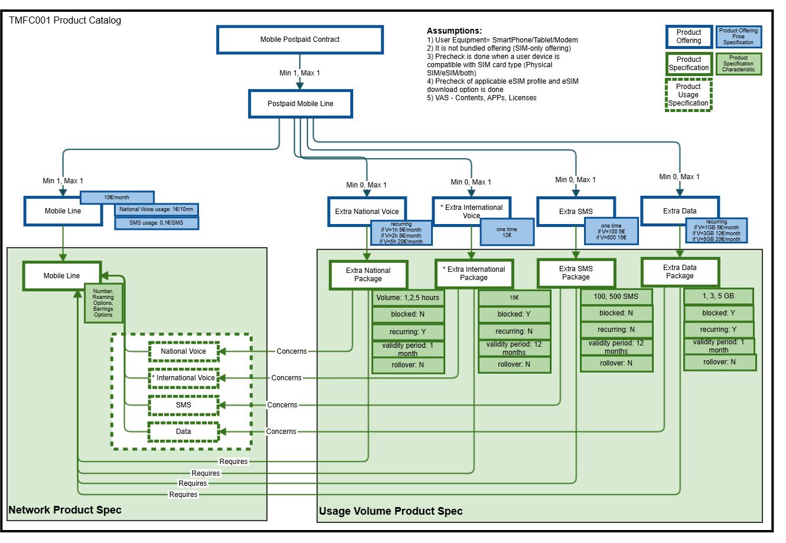
*([PlantUML source](media/product-catalog-view.puml))*

### Service Catalog View

The service catalog has been further enhanced to show what information is required for the Service Specification Characteristics where the Service Balance Rules and Usage Management Rule specifications exemplified below are a subset. Here we have added further details that are required on the Service Level. For the package products and related CFS specification, the balance characteristics are further detailed to instruct the behavior of how to treat a balance, such as start date, renewal periods, if the balance is to expire or roll over to next month. For usage, we have added details on how to determine the value of usage based on chargeable increments.  For voice, we have said that each chargeable increment between 8 AM - 8 PM is 60 seconds and other times 30. This means that a voice call that lasts for 1 minute 25 seconds will be charged as 120 seconds between 8 AM and 8 PM and 90 seconds the other times. This will impact the value of the event to make both a reservation and for the final debit of a balance. 

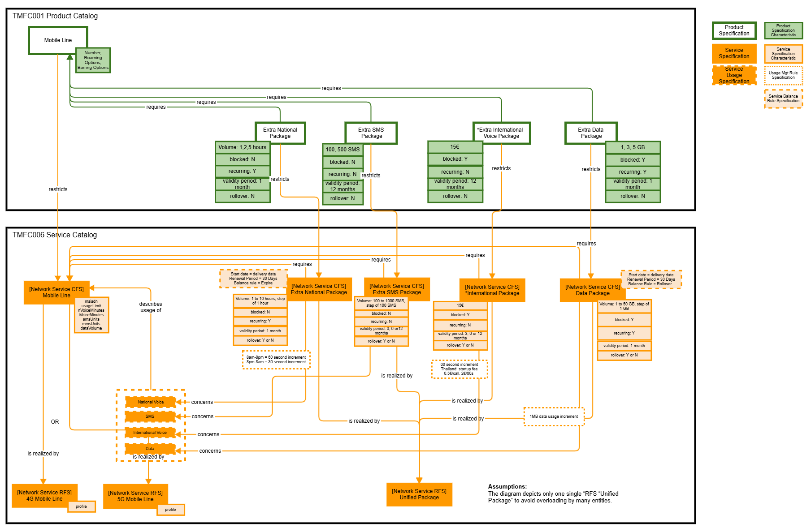
*([PlantUML source](media/service-catalog-view.puml))*

## Product Order Structure

A product order is released by the Product Order Capture and Validation component with 3 product-specification-level order items with configuration values chosen by the customer, and the related commercial order items related to product offerings.

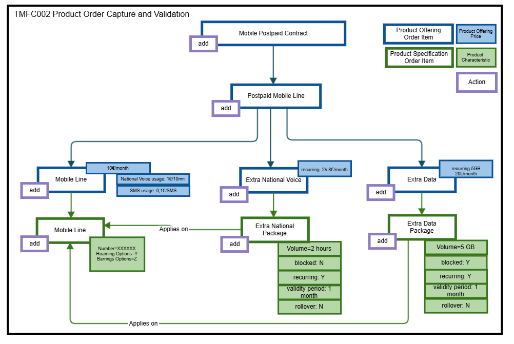
*([PlantUML source](media/product-order-structure-view.puml))*

## Product & Service Inventories

After the delivery of the product order, the information available in the Product Inventory is:

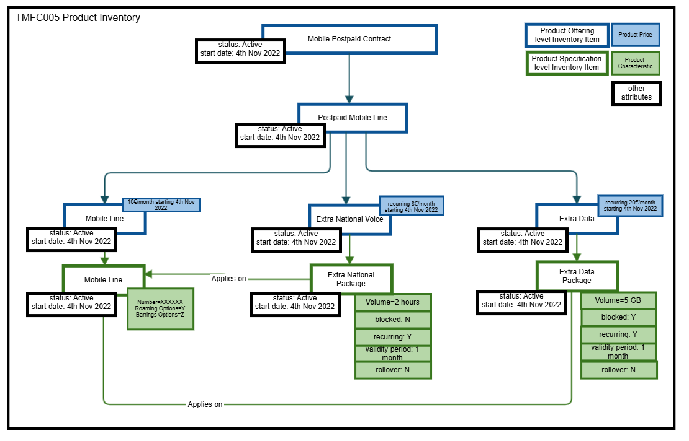
*([PlantUML source](media/product-inventory-view.puml))*

After the delivery of the product order, the information available in the Product and Service levels Inventories are:

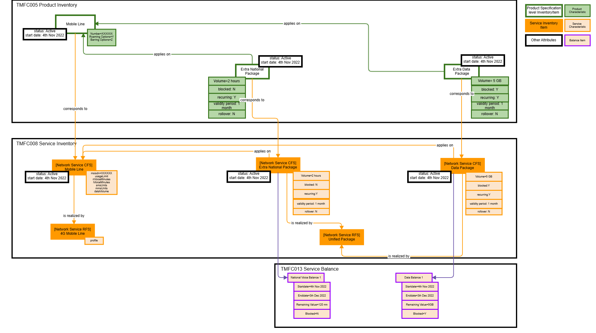
*([PlantUML source](media/product-service-balance-inventory-view.puml))*

Note: the balance management rules are not duplicated in the inventory view as they are directly available at catalog level.

The Balance Item listed above is the run time balance that will be debited as usage comes in. The first Balance item is initiated during the provisioning process as the service is instantiated, and it may hold the same value as in the product/service or for example have rules applied for proration of the amount for a given period (for example bill). If the balance is of a recurring type, then a new balance will have to be created for the new period. Management of balances, especially for renewals, is something that the Service Balance Management component will need to manage. A new balance will be initiated at the end of the renewal period for recurring packages, and the previous balance will be expired or rolled over, depending on the package characteristics. How this is solved can be implemented in different ways, but it is part of the responsibility of this component.

# Sequence Diagrams

The sequence diagrams uses 3GPP functions of the Converged Charging System (see appendix for details) in combination with identified and mapped ODA Components. The following table provides an overview of the 3GPP functions used and referred to in the sequence diagrams:

| Name | Part of | Description |
| --- | --- | --- |
| CCS/OCS_ChargingFunction | Converged Charging System (see appendix) | Function that manages events and sessions and interfaces over SBA with other network functions |
| CCS/OCS_AccountBalanceMgmt | Converged Charging System (see appendix) | Function that holds balances - monetary or non-monetary |
| CCS/OCS_RatingFunction | Converged Charging System (see appendix) | Function that determines the value of an event - monetary or non-monetary |
| CCS/OCS_ChargingDataFunction | Converged Charging System (see appendix) | Function that stores Charging Data Records (CDRs) until completion and forwards it to Charging Gateway Function for distribution |
| CCS/OCS_ChargingGatewayFunction | Converged Charging System (see appendix) | Function that stores completed CDRs and make them available for downstream systems |

## Sequence Diagram for data with extra product

The first set of sequence diagrams aims to show how a data session may be processed with a first setup, an extension of service before completion. The unit of measure for the balance and the associated reservations and debits are volume of data.

### First Reservation 

The following sequence diagrams show a simplified view of a successful reservation of a data session.

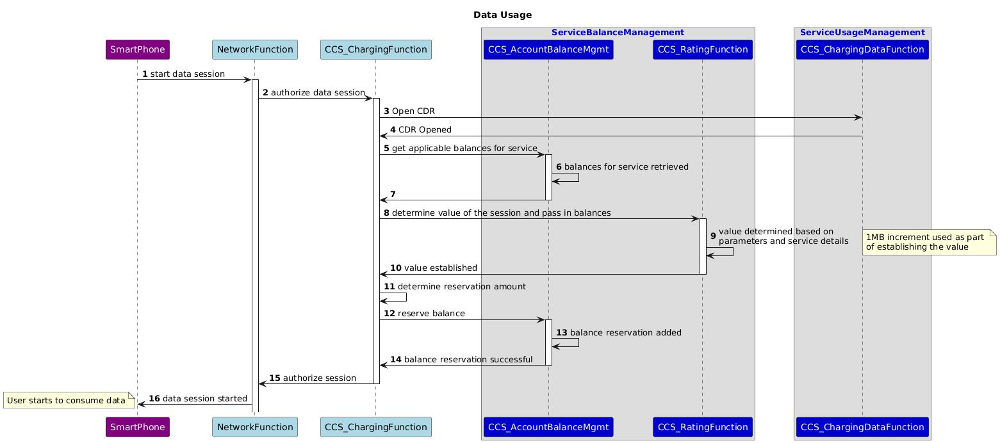
*([PlantUML source](media/data-first-reservation-sequence.puml))*

### Reservation Extension

When reservations are about to end a new request will come into extend the reservation unless the session is finished. The following sequence diagram is a continuation of the first reservation showing the extension:

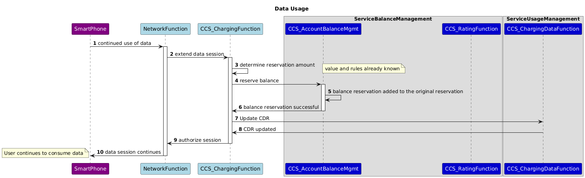
*([PlantUML source](media/data-reservation-extension-sequence.puml))*

### End of session

As a session ends, a final debit request will come from the network to debit the actual used amount and potentially release any unused reservation. 

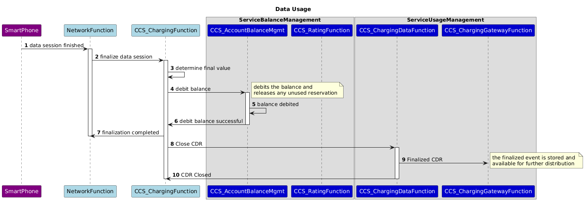
*([PlantUML source](media/data-end-of-session-sequence.puml))*

At the end of the session the information available at Product and Service inventories level are:

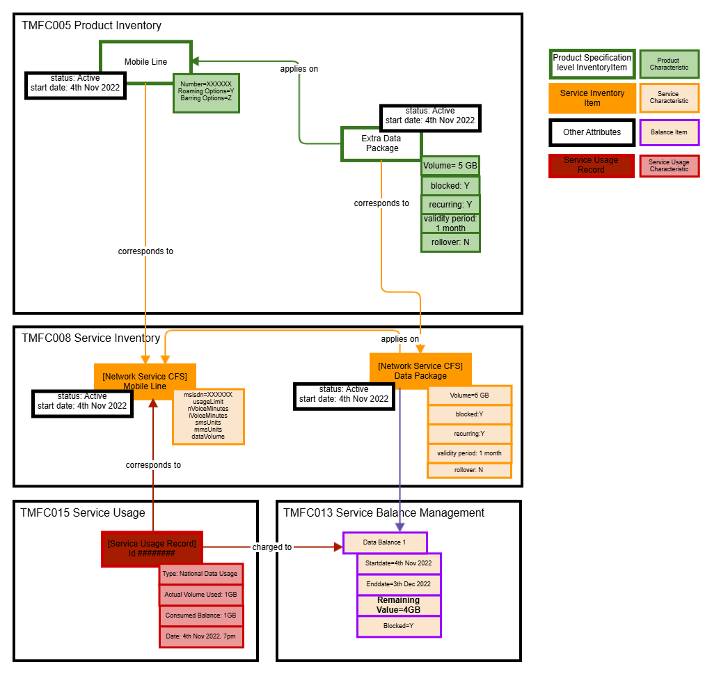
*([PlantUML source](media/data-end-of-session-inventory-view.puml))*

## Sequence Diagram for data with extra product and limited balance

In this scenario the balance available is limited so the reservation amount will have to be adjusted to account for the limitation instead of using a default reservation amount (defaults are normally a configured amount define by the service provider and is the maximum that is to be reserved). The unit of measure for the balance and the associated reservations and debits are volume of data.

 

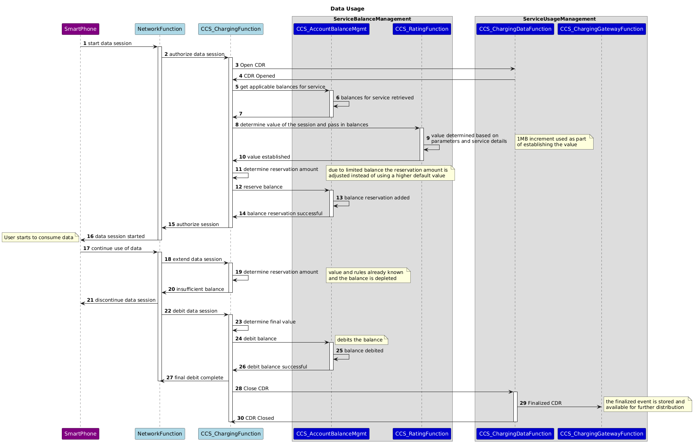
*([PlantUML source](media/data-limited-balance-sequence.puml))*

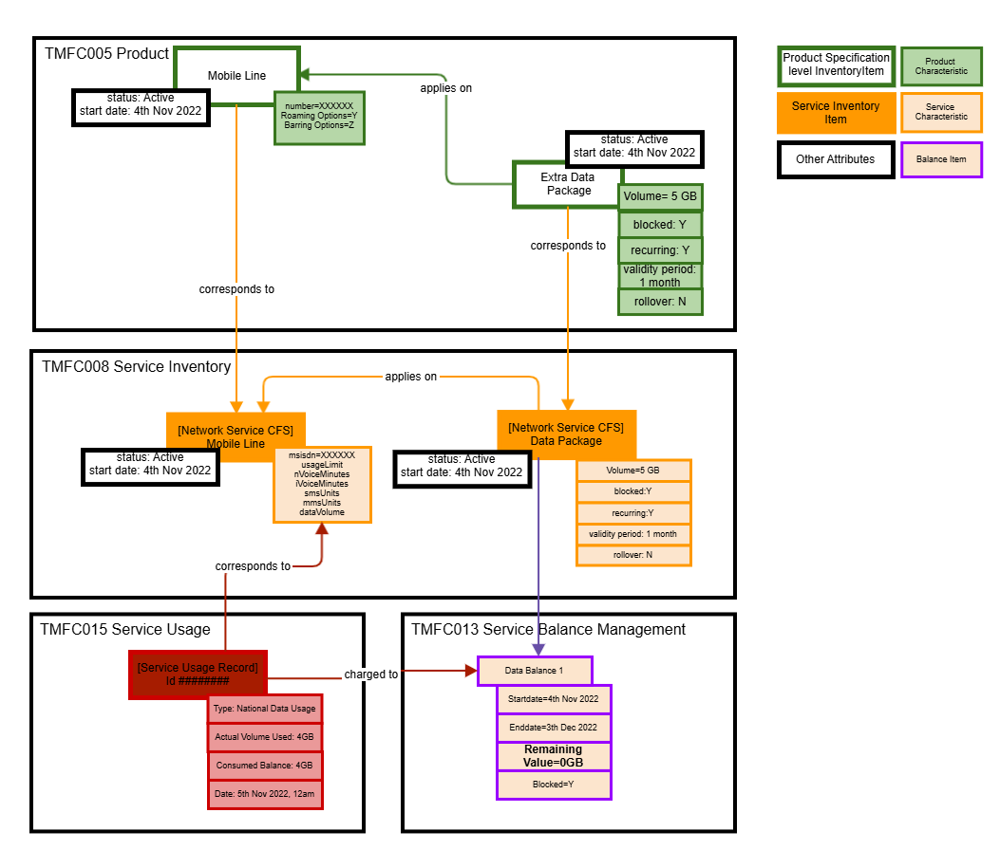
*([PlantUML source](media/data-limited-balance-inventory-view.puml))*

## Sequence diagram for data with extra product and depleted balance

In this scenario, there is no balance available, and the service will be blocked immediately. The unit of measure for the balance and the associated reservations and debits are volume of data.

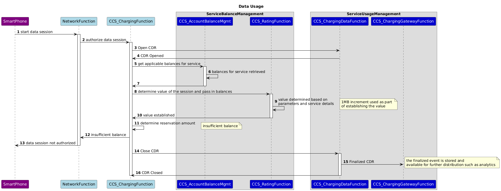
*([PlantUML source](media/data-depleted-balance-sequence.puml))*

## Sequence diagram for national voice with extra product

Voice is also a session based type of event and will follow a similar pattern to the Data session scenarios (see appendix for more details). In this case we will demonstrate what happens when  a voice call is made over a time period where the value of the event differs. For the product example, the time of day is taken into account in order to determine the value to influence how much of the balance is to be used (8am-8pm = 60 s increment, 8pm-8am = 30 s increment):

- At the beginning of every 60s after 8AM and prior to 8 PM, deduct 60s from the balance.

- At the beginning of every 30s after 8 PM and prior to 8AM, deduct 30s from the balance

| Start Time | 7:55:05 PM |
| --- | --- |
| End Time | 8:09:23 PM |
| Actual Duration | 14m 18s |
| Consumed balance | 14m 30s |

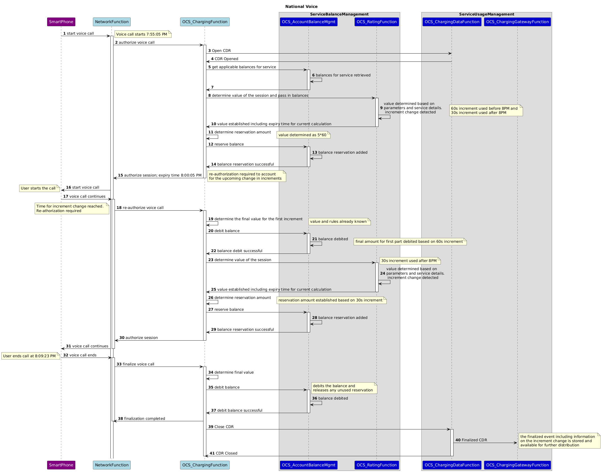
*([PlantUML source](media/national-voice-extra-product-sequence.puml))*

This example is intended to illustrate the logic applied as there are various implementation choices regarding the interaction between the Charging System and the network function. In reality, an aim is to optimize the signaling between the network and the charging function and limit it as much as possible. As the above case is for a non-blocking scenario, it is possible that the choice of implementation will opt for just one large reservation leading to only a need for the start of the call and the finalization of the call where the finalization will still take the logic in steps 17-31 into account. However, the purpose of this use case is to show an example of consumption of a balance based on varying information during a session and in this case a voice call. 

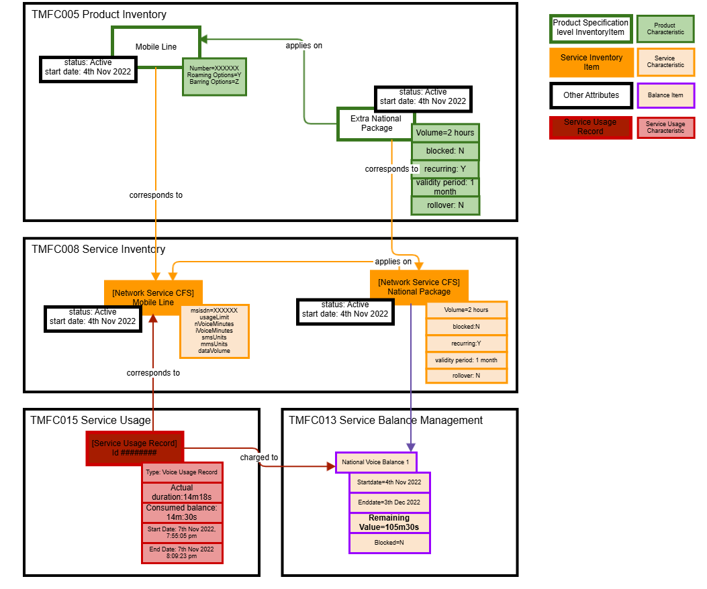
*([PlantUML source](media/national-voice-post-call-inventory-view.puml))*

## National Voice with extra product limited balance

In this scenario the user has a limited balance remaining to be used and will then be charged according to the default product setup until such a time that the balance is renewed. On the product level the user has the Mobile Line with product characteristics for National Voice and the Extra National Voice offer with a balance that is not blocked once depleted. Once the balance is used it will allow the call to continue but now charged for that part of the call based on the Mobile Line product offering price that defines it as1€/10 minutes for National Usage.

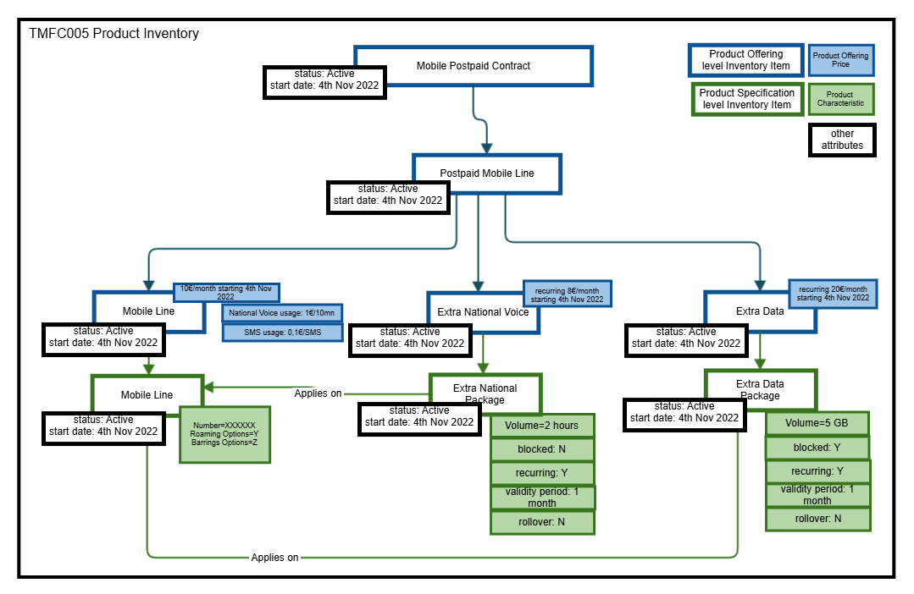
*([PlantUML source](media/national-voice-limited-balance-product-inventory-view.puml))*

On the Service level, this is the representation of the starting point for the scenario with 1 min 30 seconds remaining balance for National Voice. As this is depleted it will revert back to price per minute as defined by the Mobile Line product.

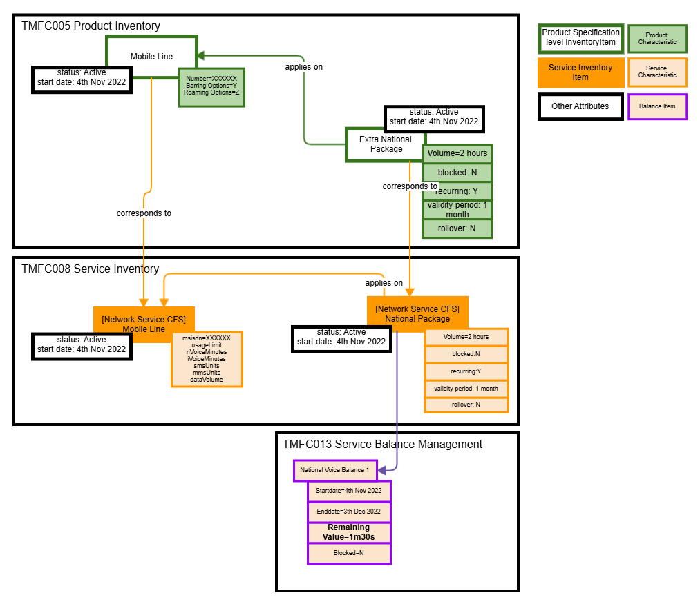
*([PlantUML source](media/national-voice-limited-balance-starting-point-view.puml))*

| Start Time | 8:30:55 |
| --- | --- |
| End Time | 8:39:03 |
| Actual Duration | 8m 8s |
| Consumed balance | 1m 30s |
| Duration for price calculation | 6m 38s |
| Usage Charge | 0.66€ |

In the sequence diagram below, the OCS Rating Function is implied in two scenarios - one to calculate the value to deduct from the balance and one to calculate the price for the remainder of the call. As such the function  has been given two denominations to distinguish the relationship to the applicable component.

 

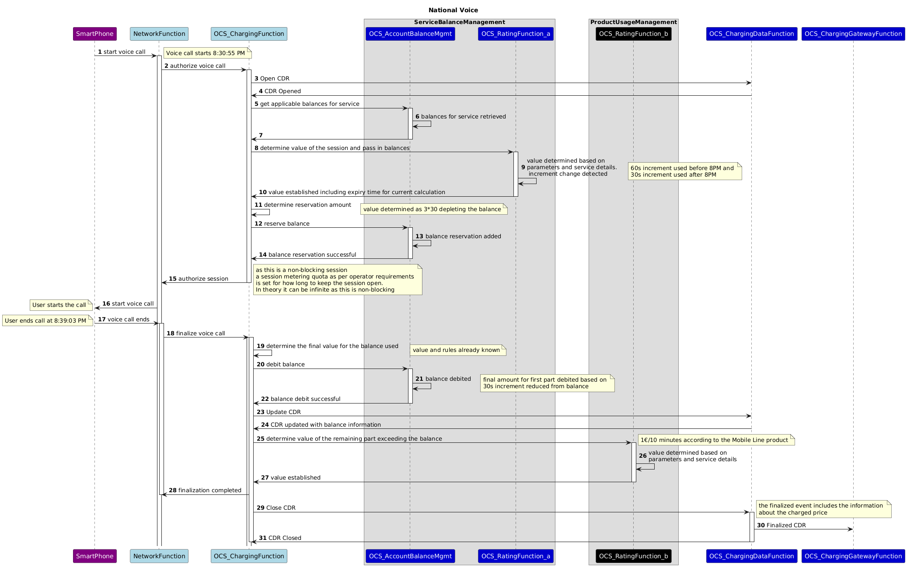
*([PlantUML source](media/national-voice-limited-balance-sequence.puml))*

With this scenario we illustrate how Service and Product interacts and the output is a service record, that contains the information on balance used and the price for the remaining call. The price applied can be acknowledged as the final price or be re-rated in subsequent processes and applied to the customer's account - this is an operator choice.

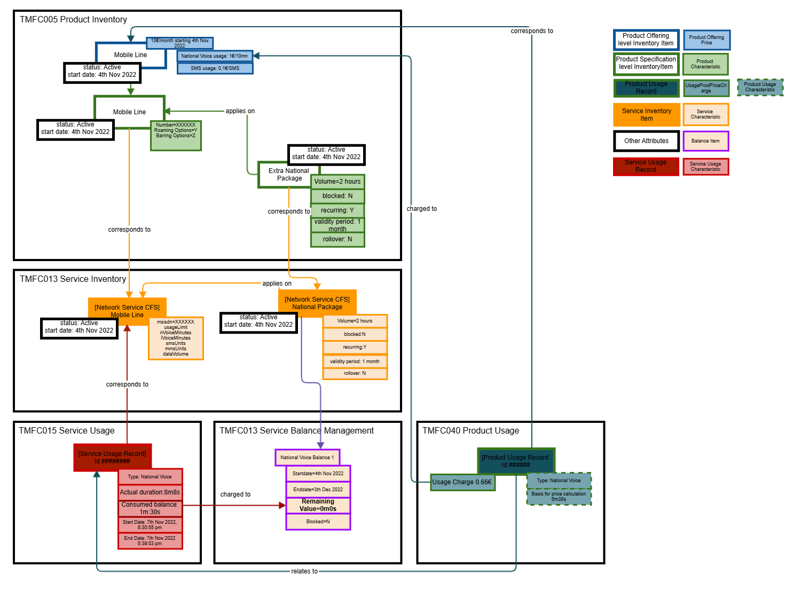
*([PlantUML source](media/national-voice-limited-balance-final-view.puml))*

# Conclusion

## Lessons Learned

The work to describe and identify components within the usage and balance management area is iteratively created to determine the relationships to ODA Components or Open APIs that have not been established or been fully identified. It is recognized that a global view of the components in this space is needed, but when we take the case of mobile communication there is also a need to relate to the standards of 3GPP that specifies how the network, and the Charging System interacts to enable services and to account and charge for usage (retail & wholesale).

### ODA & 3GPP Relationship

This use case has so far explored and identified the following:

- TMFC013 Service Balance Management Component to have a clear correlation to the Account Balance Management Function in 3GPP where northbound interfaces such as set balance, retrieve balance etc. will be supplemented by TM Forum APIs in further evolution of scenarios and sequence diagrams. 

- The OCS/CCS Rating function defined by 3GPP can act in two modes: 

- As part of TMFC013 Service Balance Management, to establish the value in the context of the Service Balance Rule Specification (UsageVolumeChargingRule in SID)

- As part of TMFC040 Product Usage Management, to establish a price in the context of Product Offering Price

- 3GPPs CCS Charging Gateway Function and Charging Data Function defined by 3GPP will output Service Usage with more or less information: 

- For offline mode (not depicted in use case but briefly described in the Appendix), it creates the CDRs with the information provided by the network functions 

- As part of TMFC013 Service Balance Management, it creates CDRs including any balances consumed

- As part of TMFC040 Product Usage Management, it creates CDRs including product rates applied

### SID

In current TM Forum assets, the product definition of the balance product are referred to in SID as a UsageProductVolumeSpec that represents a pre-defined quantity (monetary or non-monetary) to be sold to a Party. When a Party has bought the UsageVolumeProduct and starts to use the service, the related usage will be debited from a UsageVolumeBalance by applying UsageVolumeChargingRules to determine the value to deduct. If the use of a service is controlled by the UsageVolumeProductSpecification then the NetworkProductSpec should have the attribute is UsageMonitoring set to true. In SID this is only used for blocking and referring to prepaid. It is a very black and white attribute where modern use of balances are not limited to customer types (prepaid, postpaid....) and the quota management mechanism is more nuanced to not only allow for blocking, but also throttling (to the new period, for a grace period or for a grace balance). 

The challenge with SID today is that the UsageVolumeBalance and its associated UsageProductVolumeSPec are only described at product level, associated to UsageProductVolumeSpec. The Service Balance Management component is placed in the Production block as it does the service control towards the network. With this in mind the actions on the UsageVolumeBalance should be performed on Service level (CFS). 

###  Open APIs

TMF654 Prepay Balance Management API has the responsibility to manage and track balances (resource = bucket).  The origin use-case of balances started with Prepay users that pay up front before using services. Today it is common to have more flexible views on users and the use case is extended to other types of users where applicable. Products are defined that use balances to provide certain service behavior. What all these products have in common is that the users must have sufficient balance to use these services and each use of the service will be evaluated to allow or to deny service fully or provide an alternative action (for example throttling). (Note: JIra ticket raised already to rename the API to remove Prepay.)  When it comes to the way a balance is renewed, there is a difference between a postpaid and a prepaid recurring scenario:

- For a postpaid product with a recurring balance, the new balance is automatically created and the cost of it is included in the product. 

- For a prepaid product that has a recurring balance, the balance renewal will have to start with attaining the payment of the renewal before the balance can be renewed. A workflow will have to be in place were the renewal request is initiated first, then the payment is attained (according to the chargeable Party's preference), and upon payment the balance is renewed. 

Looking at the operations of TMF654, the API is responsible for the creation of the balance (bucket) as well as actions on such as reserve, transfer, adjust balances as well as topping up. On one side you have the consumption of the balance through reserve and adjust and other side you have the manipulation of available balance through topup and transfer. It is a mix of commerce and service level processes with different needs and purposes. In the User Guide, it states that the bucket is created as part of the fulfillment process where a set of bucket entities are to track the balance for the service that the products is composed of. It also indicates that the TopUpBalance resource, is the one that charges or re-charges the balance. Each bucket is to have a unique identifier and can be associated with one or many products. The ID of the bucket is unique so that it can be referenced when an action is performed on the balance. 

According to the description of the API, the fulfillment process will create the bucket(s) as per the product specification and then topped up. If that is the case, then the first Balance created will have an ID but no amount, and a second action is required to invoke the TopUpBalance. However, looking at the Bucket Resource, it is possible to set the first remaining balance with the initial amount directly and fits our use case and what we have depicted in the Service Inventory.

In addition to setting the first balance, some of the balances in the use case are to be recurring, meaning that there will be an internal process to create a new balance for a new period according to a set of characteristics. In the use case we have modeled them as Product and Service characteristics. In terms of TMF654, the Bucket resource that holds the balance does not have this information, instead this is found as attributes on the TopUpBalance resource, but there are also some missing run-time aspects: 

| Attribute | Attribute Description | Comment |
| --- | --- | --- |
| isAutoTopup | A boolean. Indicates if the topup requested is an autotopup (to be processed periodically). | In our use case we have depicted this as a characteristic of the Product down to Service level and hold as a characteristic. It is possible that an indicator should be on the balance in order for the Service Balance Management Component be in charge of driving the creation of new balance periods and interact with the Service Inventory to get the necessary characteristics. |
| numberOfPeriods | An integer. For autotopup indicates the number of occurrences of the period the recharge operation must be executed. If not included then no limit is set to stop the execution of the topup every period. | The TopUpBalance indicates the possibility of a top-up with the characteristic of only being valid for a finite number of periods. That can too be a characteristic of the balance, but what is missing is a remainingNumberOfPeriods that when first instantiated will hold the numberOfPeriods set by the TopUp and then at renewal of a balance decrement the attribute until depleted. Once depleted the isAutoTopup indicator should be set to false. (Note: The assumption is that a user may want to know how many periods remain and be able to query it.) |
| recurringPeriod | A string. For autotopup indicates the periodicity for the recharge operation (monthly, weekly, ). | Just like isAutoTopup we set this as a characteristic of the Product down to Service. |

Below is an updated inventory diagram where the TMF654 attributes related to balance (bucket) and renewal has been added: 

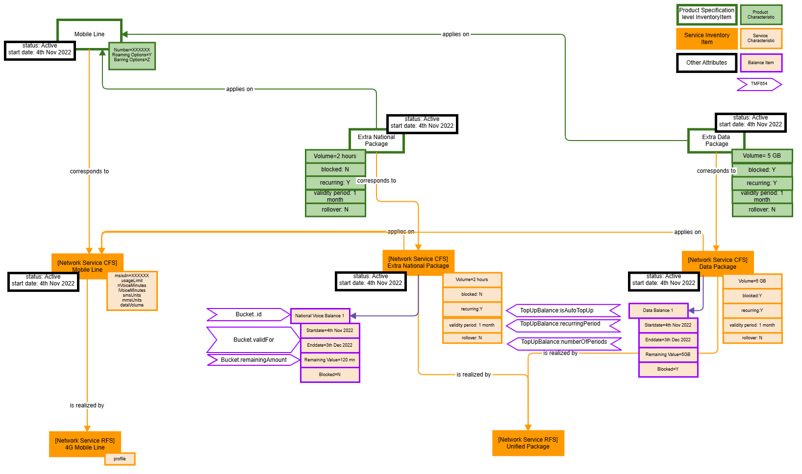
*([PlantUML source](media/tmf654-balance-inventory-view.puml))*

TopUpBalance is to solve more for a prepaid product than a postpaid, however the attributes used and required for topping up either scenario are closely related, and it is important that we determine where these attributes should be placed and separate the commerce side from the service side. This also relates to the evolution of SID and this API needs to evolve in line with the evolution Service Balances as well as the possibility to describe the balances in terms of Product and Service. In a next iteration of the use case a renewal scenario will be described and this requires clarity on where the necessary data is located and how this can be triggered. 

When it comes to run time use of the service and possible balance consumption as in our scenarios, a balance can be reserved using the ReserveBalance resource but in version 4.0 there is no use case for how a ReserveBalance is debited (in full or partial). In theory this could then be done by posting an AdjustBalance to deduct the balance and deleting the ReserveBalance. However, an improvement ticket has been approved and implemented in the 4.1 Swagger (pre-production) where the AdjustBalance resource has been updated with a relationship ReserveBalance with the possibility to use this for debiting a reserve balance in full or partial. 

###  TMFC013 Service Balance Management

In IG1242, the current Production domain depicting order and orchestration does not include how the Service Balance Management is instantiated with the balance. In our use case we have used product and service characteristics to describe the balances. One possible option is that Service Balance Management is provisioned by the Service Order component that will provide it with necessary details to be able to manage the balance but also to be able to drive the renewal process. The following is a suggestion of the updated Product domain diagram: 

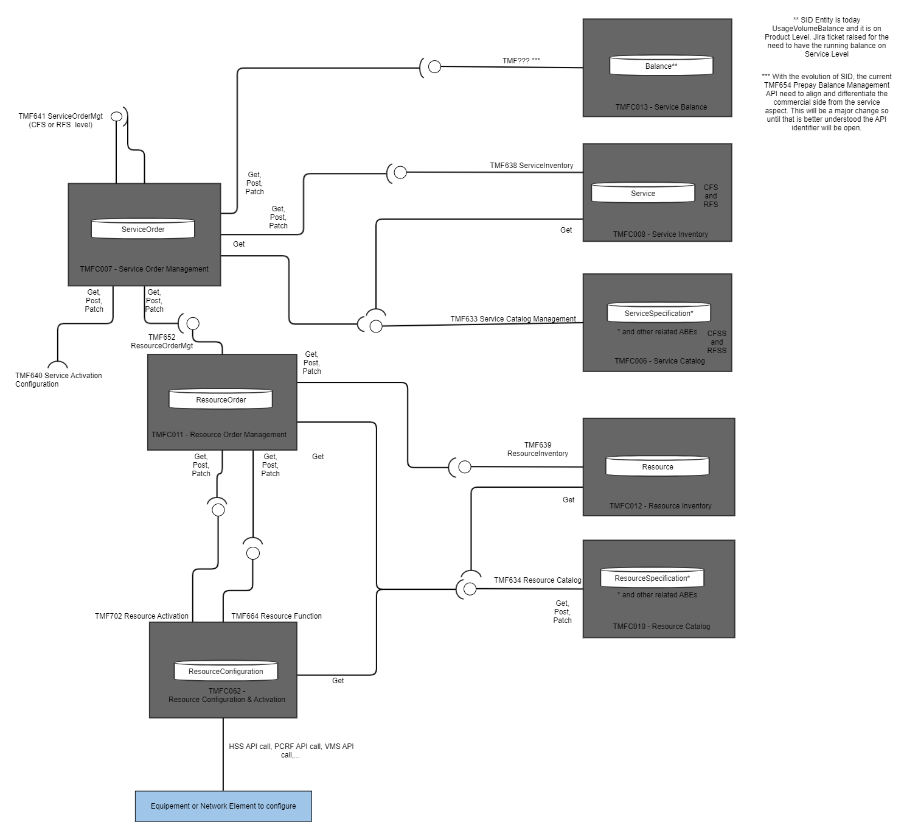
*([PlantUML source](media/service-balance-management-component-diagram.puml))*

In addition to the provisioning flow, the renewal process of balances also needs to be considered in detail as the process for a recurring balance for a postpaid subscription vs a prepaid auto top-up differs greatly. The Service Balance Management component needs to have the process to manage its balance as per the specification of the product. For a postpaid scenario the cost of the balance is most likely part of a recurring charge and thus there is no need to charge the user for the renewal as it is already part of the product. This means that the Service Balance Management component can manage the renewal process according to the definition of the product. For prepaid there is more involved as there is a need to 1.) charge the user and 2.) get the payment **before **the new balance can be instantiated. In the evolution of ODA towards a catalog based approach, it might be worth re-visiting this flow to see how this could be done by defining the top ups as products and have the renewal process for prepaid be driven as a product order in the commerce layer and instantiating a new balance as the top-up renewal is successful. It would be worth having a separate use case that looks at prepaid scenarios and top ups, as that is not in the scope of this use case. 

## Impacts Identified

Information Framework:

- Service control (debit & credit) is performed on the Service level, but in SID today, all volume related actions are done on Product level.  Jira ticket: [[ISA-1129] UsageVolumeBalance should also exist in Service (CFS) domain - TM Forum JIRA](https://projects.tmforum.org/jira/browse/ISA-1129) has been created to investigate the need to have the control done on service level.

- The definition of IsMonitoring = True should be revisited to be customer type agnostic and allow for other policies than blocking. The above Jira ticket ISA-1129 is updated to reflect this.

Open APIs:

- TMF654 Prepay Balance Management, needs to be aligned with the evolution of SID (see above) and specification of TMFC013 Service Balance Management. The Bucket resource needs to have the necessary information to be able to manage the resource including renewal. Jira ticket: [ AP-6328](https://projects.tmforum.org/jira/browse/AP-6328?src=confmacro) - TMF654 - alignment with End to end Use Cases, Information Framework and Components ** backlog ** 

Components

- IG1242 Production Domain to include Service Balance Management.

# Appendix 

## Appendix A - Prepaid Top Ups as products

As part of investigating a global way of describing the use of Usage Volume Products independent on customer type, here is a suggestion on how Prepaid Top Ups can be modelled using the product concept. 

For a new customer the first thing they need is a start package that gives them the access to the service and with that they will choose the type of top up they want to start with. In case a subscriber chooses a recurring top up, that top up will be active until canceled or changed. In the case a one-time top up is chosen, that will be valid for its period and then another top up can be chosen or even a recurring. 

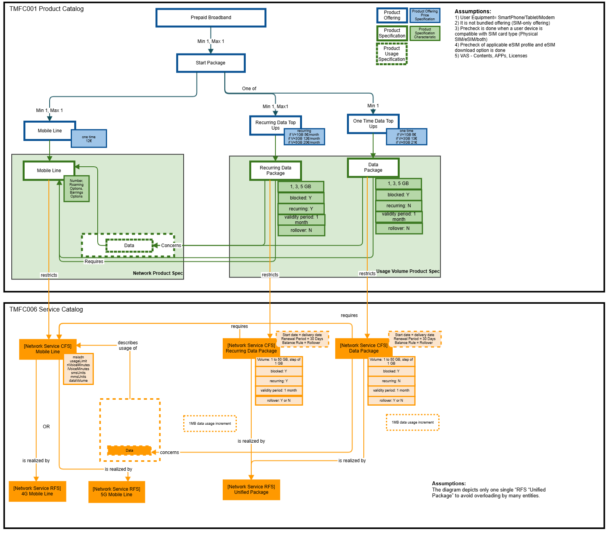
*([PlantUML source](media/prepaid-topups-catalog-view.puml))*

This is an example of a start package purchase with a one-time top up: 

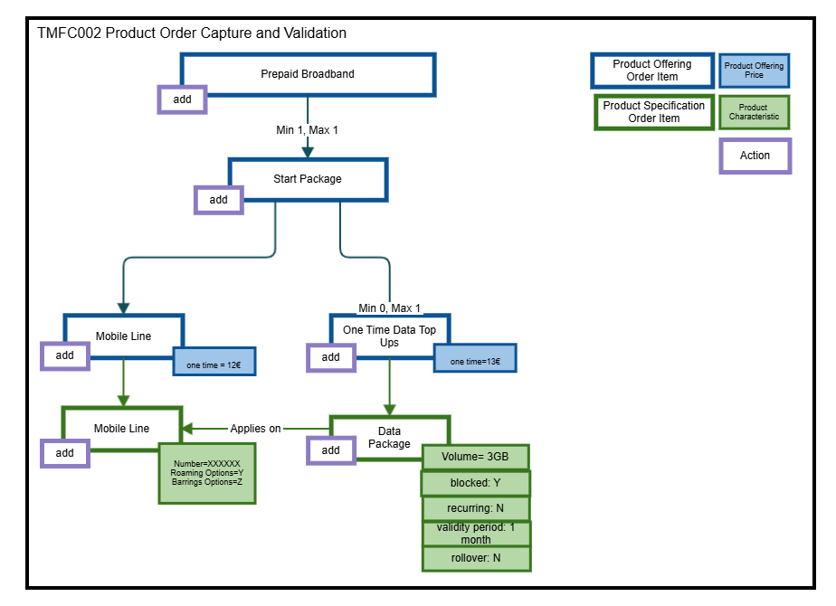
*([PlantUML source](media/prepaid-start-package-order-view.puml))*

This is the Product and Service inventory instantiation after the order is completed.

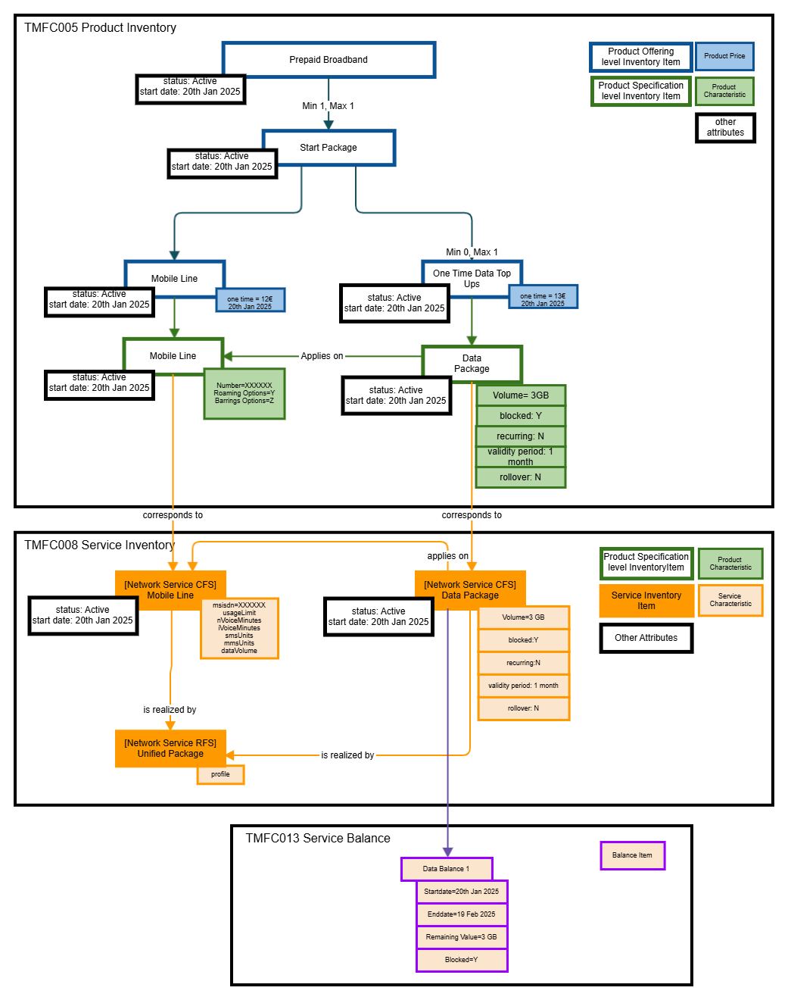
*([PlantUML source](media/prepaid-start-package-inventory-view.puml))*

## Appendix B - High Level Overview of 3GPP Charging Architecture

### Background

3GPP is the Standards Organization that specifies the cellular telecommunications technologies across radio access, core networks and service capabilities. To support the service, 3GPP has recognized the need for charging and accounting to support the shared network architecture so that end users can be charged for their usage and network sharing partners can be allocated their share of the cost related to the shared network (TS 22.101).

Within 3GPP it is the SA Working Group 5 Management, Orchestration and Charging that is responsible for covering the area of charging with its related aspects such as Quota Management and Charging Data Records (CDRs) generation. The requirements and principles related to this area are defined in TS 22.115. There are several requirements in the document and here are a few to exemplify:

- Details about the information to be collected that ensures correct settlement between different commercial roles

- Mechanisms for allowing cost control for services and supporting prepay services (services that are paid up front and then consumed originating from the Prepaid customer segment but today common across customer types)

- Support for inter-operator charging as well as fraud control

With the requirements a set of high-level principles assist in guiding the requirements further and go into more details to cover the various types of services, their characteristics,  user aspects of charging and usage scenarios within the mobile network, including cross-overs to other interrelated technologies such as IP based networks, 3d party service providers and more.

The Charging Architecture is specified in TS 32.240 and covers both the new Service Based Architecture introduced with 5G as well as 4G and prior standards.  The Charging Architecture is illustrated by a set of functions that together deliver the charging mechanisms required to meet the vast number of use cases to supports both retail and wholesale. To support the various forms of charging, support is provided for both offline scenarios where events are collected from the network and passed along after the fact as well as online scenarios where usage can be authorized prior to providing the service.

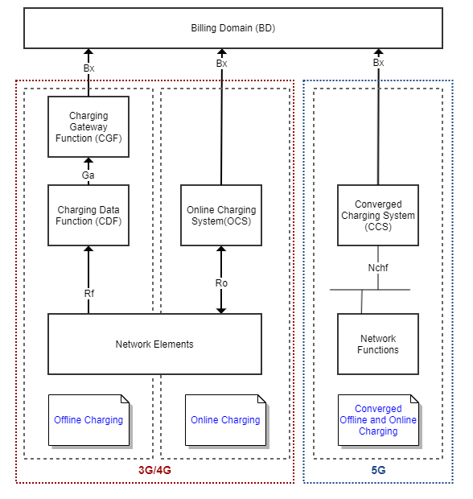
*([PlantUML source](media/3gpp-charging-architecture-overview.puml))*

The Converged Charging System is where 3GPP is heading, but as all network functions are not yet moved over to 5G, we will see that the old and the new architecture will live side by side during the transition and move to 5G. With the evolution of the 5G standards we see that more and more services will be moved to the service based architecture. Data based services were first out to use the 5G interfaces over SBA and now more and more services such as Edge and IMS are moved. The voice domain is still outstanding but as it is moved to the 5G architecture the Converged Charging Architecture will be ready to take this on the interfaces with its unique parameterization is defined. 

With Use Case 9 in mind we are focusing on the aspects of online charging defined by 3GPP in TS 32.240 as "charging mechanism where charging information can affect, in real-time, the service rendered and therefore a direct interaction of the charging mechanism with bearer/session/service control is required". With the term real time, 3GPP defines this as: "real-time charging and billing information is to be generated, processed, and transported to a desired conclusion in less than 1 second." For our purpose we will generalize and simplify the complexity of the communication between the Network Elements/Network Functions and the Charging System and concentrate on online charging scenarios delivered by the Online Charging System OCS and the Converged Charging System CCS. 

### Online Charging System

The following is a representation of the functions that build up the Online Charging system and how it interacts with the network on a generic level: 

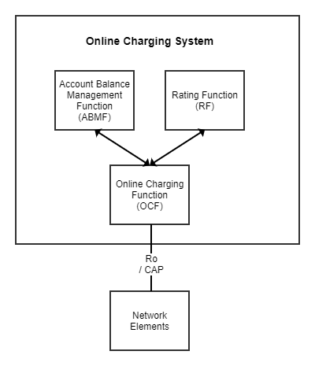
*([PlantUML source](media/online-charging-system-functions.puml))*

As online charging is used to authorize the service prior to the actual usage, the OCF relies on the Rating Function to determines the value of the event (monetary or non-monetary) and the Account Balance Management Function to keep track and manage available balances. Looking at a simple scenario of an event with a demand on quota/balance, the event will come into OCF that will interact with the Rating Function to determine the resource value and interact with the  ABMF to determine if there is balance available to be able to allow the service.

Events coming in from the network can be classified as two types: Event Based and Session Based. Simply put, Event Based charging is for events that can be identified as single events up front and Session Based charging is for events that don't up front have a start and finish and instead will have to be treated as initial setup, increments and terminations. An example of a case for Event Based charging is SMS whereas Voice and Data both are Session Based. The Online Charging Functions supports and handles the distinct process around each of the two types. For Use Case 9 we have decided to start by focusing on Voice and Data, and we will hence focus on Session Based Charging patterns. In the case of Voice the OCS will be utilized and in the case of Data the CCS (see below) will be used. 

For example, a voice package may provide the user with a number of minutes to consume for a defined subset of voice calls and this total to be consumed will be held as the account balance. When a session starts the Rating Function will interpret the service asked for and will indicate how it should be valued. This may include interpretation of the type of usage, charging increments to be used such as 60 second increments, as well as information that will indicate an upcoming tariff change due to changing conditions and hence a need for a new tariff to be established in future requests. (Note Tariff in the terms of 3GPP TS 32.296 is described as "set of parameters defining the network utilization charges for the use of a particular bearer / session / service".) If balance is available the reservation will be made and the network will authorize its use until either the end of the call within the reservation given or when the reservation is reaching its end. If the voice call ends before the reservation is up, a new request will be passed into the Online Charging System to finalize the session and debit the Account with the actual value of the call taking the start and actual end into account and releasing any unused reservation. 

CDR Generation for Online Charging

CDRs may be generated for online charging scenarios. 3GPP suggests alternatives, but it is up to the implementor do decide on the ultimate architecture. One approach is a parallel offline and online event management, and another is to have a CDF/CGF employed by the Online Charging Function to be able to generate the CDRs and have them transferred to the billing domain for further processing.

An example of an extended Online Charging architecture to include CDR generation can be found here:

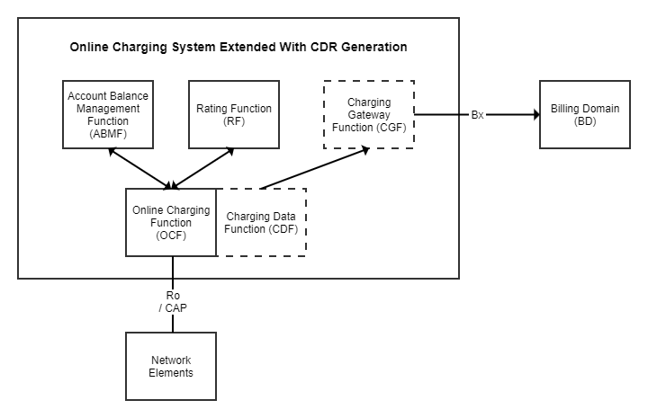
*([PlantUML source](media/online-charging-system-cdr-generation.puml))*

When an event comes into the OCF, an CDR is opened by the CDF that will maintain the CDR state until the completion of the online charging request. Upon completion the CDR is closed, and the CDF transfers the CDR to the CGF for further distribution to the Billing Domain.

### Converged Charging System (CCS) for 5G

The CCS is an evolution where offline and online charging capabilities are combined into one and part of the Service Based Architecture introduced with 5G. How this applies to charging is described in TS 32.240 with the new operations and interface in TS 32.290 Telecommunication management; Charging management; 5G system; Services, operations and procedures of charging using Service Based Interface (SBI). A key aspect and evolution with CCS is that chargeable events are created through the CCS and not by the individual network functions. 

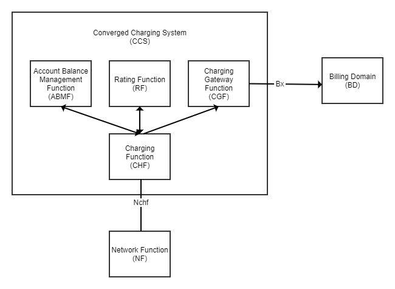
*([PlantUML source](media/converged-charging-system-5g.puml))*

Network Functions interact over the Nchf interface for converged charging or offline charging and for the Policy Control Function (PCF) it uses the interface for spending limit control. 

The Charging Function is connected to the Network Functions over the Service Based Interface Nchf. Just like in the case of the OCS, the Rating Function determines the resource value of the event (monetary or non-monetary) and the Account Balance Management Function is the home of the balance. The difference to the OCS is that the CCS has not only a responsibility for handling online charging but also to forward usage events to the billing domain, and it does that through the Charging Gateway Function. 

 CDR generation with CCS in offline mode

Prior to 5G the Network Elements created the events and stored them locally before pushing it out for further processing.  With 5G the Network Functions will rely on the CCS for any CDRs to be generated.

When the CCS is called in offline mode, the Network Functions will connect with CHF over Nchf to create CDRs. For Post Event Charging, after service delivery, the network function invoke CHF to create the event with all details in a singular call. For Session Based Charging, the network function will invoke CHF multiple times to create, update and close the event. 

CCS Session Based Charging

In 3GPP the patterns and sequence of events for how a session based usage event is managed is described in detail in TS 32.296 (this is true for both OCS and CCS). In 3GPP it is recognized that for rating to determine a resource value, counters are needed to be able to establish that value. An example of a counter that is not a balance, is a counter for a tiered rating scenario of events accumulated across that are required to determine the value of the event. For example if the event qualifies for the first tier it will have one value but if the accumulated total is beyond the first tier it will qualify for the second tier and another value. These counters can either be provided by ABMF with the account balances (Class A) or they can alternatively be colocated with the Rating Function itself (Class B). (ABMF always holds the account balances in both cases and should not be confused with rating counters needed to determine the value.) The behavior of when balances/counters are retrieved varies for the two patterns and so does the invocation of the Rating function. 

As the CCS also is responsible for the creation of CDRs and passing these to the Billing Domain the following two sample sequence diagrams have been created showcasing the sequence of events for an initial session setup, one incremental update and a termination for Class A and B respectively including the creation of the CDR. The term used in both use cases for the action to determine the value is named Tariff request in the diagram using the term from 3GPP as defined in 3GPP TS 32.296.

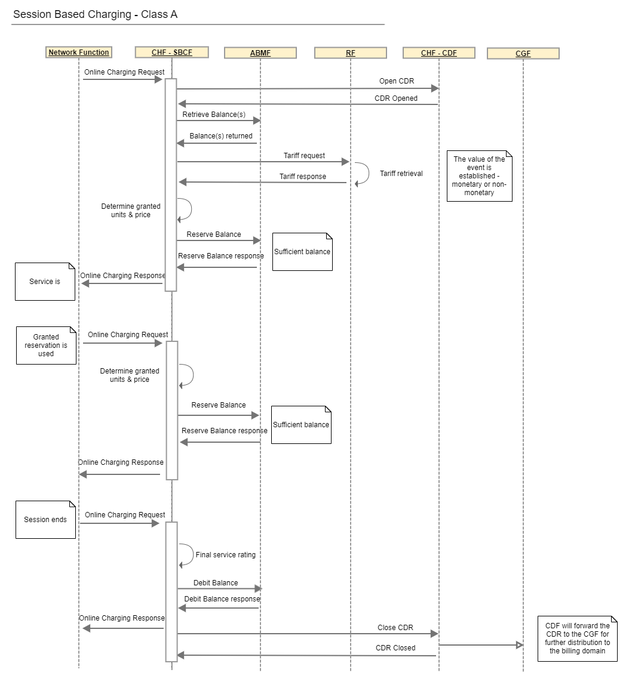
*([PlantUML source](media/ccs-session-based-charging-class-a-sequence.puml))*

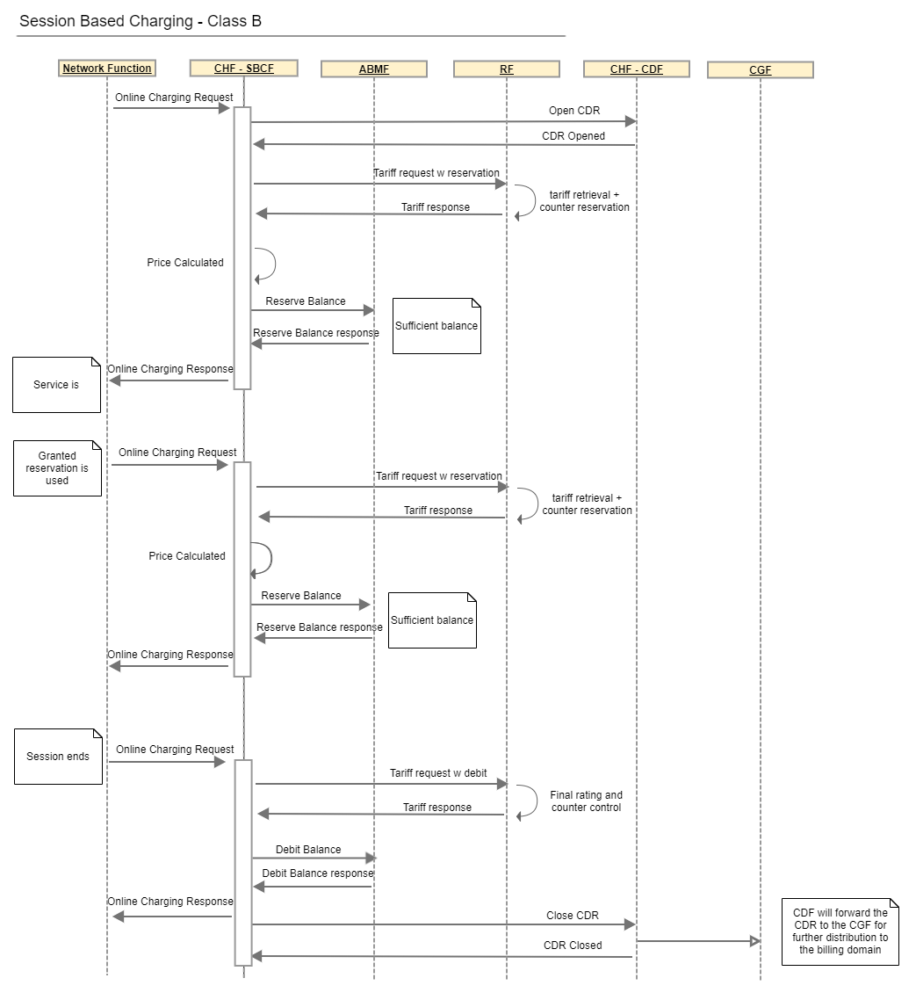
*([PlantUML source](media/ccs-session-based-charging-class-b-sequence.puml))*

**Legend**:

| Abbreviation | Description | Comment |
| --- | --- | --- |
| CHF- SBCF | Charging Function - Session Based Charging Function | The function that understand the mechanisms for session based events as opposed to the Event Based Charging Function. These are both part of the Online Charging Function specified in TS 32.296. |
| ABMF | Account Balance Management Function | The function that is the master of balances - be it monetary or non-monetary |
| RF | Rating Function | Determines the value in monetary and non-monetary units for an event |
| CHF - CDF | Charging Function - Charging Data Function | The CDRs generation functionality for charging events received via Nchf |
| CGF | Charging Gateway Function | The gateway interaction with the Billing Domain that in 3GPP is the part of the CSP network outside of the Core that deals with CDRs coming out from the charging functions. The domain covers not only billing but can include any area interesting in CDRs such as analytics. |

CCS Event Based Charging

Event based charging is just like session-based charging described in detail in TS 32.296. It is possible to have event-based charging with immediate debit (Immediate Event Charging, IEC) or using the two-step approach of reservation and debit in two steps (Event Charging with Unit Request, ECUR).

The following sample sequence diagrams have been created to illustrate the two methods of Event based charging for Class A and B respectively including the creation of the CDR. The term used to determine the value for event based charging is Price and is in alignment with the 3GPP term used.

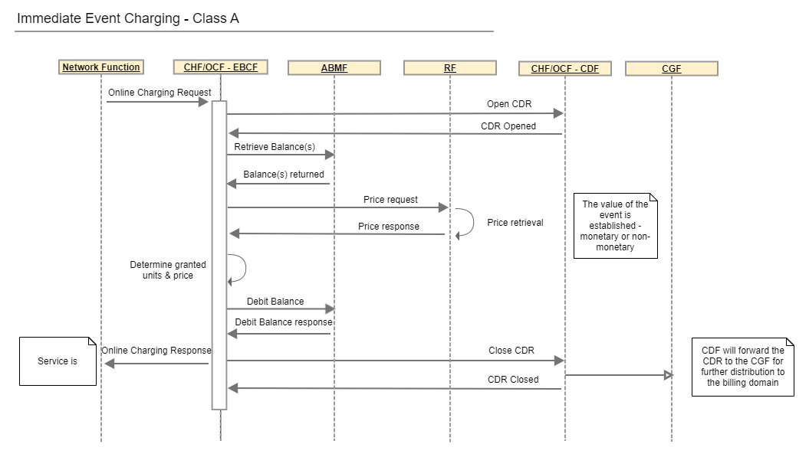
*([PlantUML source](media/iec-class-a-sequence.puml))*

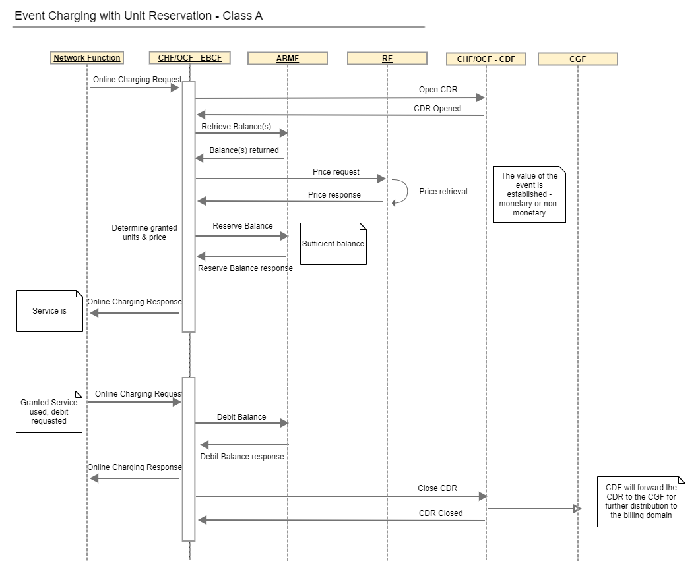
*([PlantUML source](media/ecur-class-a-sequence.puml))*

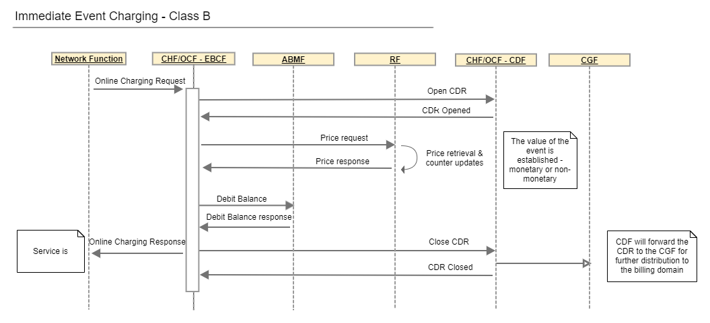
*([PlantUML source](media/iec-class-b-sequence.puml))*

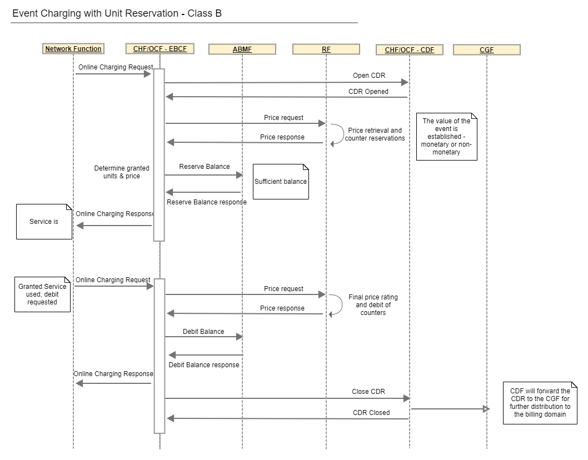
*([PlantUML source](media/ecur-class-b-sequence.puml))*

**Legend**:

| Abbreviation | Description | Comment |
| --- | --- | --- |
| CHF/OCF- SBCF | Charging Function/Online Charging Function - Session Based Charging Function | The function that understand the mechanisms for session based events as opposed to the Event Based Charging Function. These are both part of the Online Charging Function specified in TS 32.296. |
| ABMF | Account Balance Management Function | The function that is the master of balances - be it monetary or non-monetary |
| RF | Rating Function | Determines the value in monetary and non-monetary units for an event |
| CHF/OCF - CDF | Charging Function/Online Charging Function - Charging Data Function | The CDRs generation functionality for charging events received via Nchf |
| CGF | Charging Gateway Function | The gateway interaction with the Billing Domain that in 3GPP is the part of the CSP network outside of the Core that deals with CDRs coming out from the charging functions. The domain covers not only billing but can include any area interesting in CDRs such as analytics. |

