# List of Figures

Figure 1: (Primary) fallout process	11

Figure 2: (Secondary) fallout process	12

Figure 3: Happy path	14

Figure 4: Fallout path with resolution	16

Figure 5: Fallout path without resolution	18

Figure 6: Fallout path with resolution	20

Figure 7: Order fallout lifecycle	21

Figure 8: Product catalog	23

Figure 9: Service and resource catalog	23

Figure 10: Resource catalog	23

Figure 11: Order structure	24

# Introduction

This document presents a solution for addressing fallout analysis and treatment in the execution of product, service, and resource orders. The proposed solution leverages the ODA architecture and the assets defined in the TM Forum frameworks. Although the framework on which the different scenarios outlined here are developed around the activation of mobile services, this approach can be extended to the activation or modification of any other type of service.

## Context or background

In the current TMF assets (R23.0), the concept of "fallout" is addressed in 2 places:

A level(3) business process called "Manage Customer Order Fallout" is defined in the Customer Domain. Its parent process is "Customer Order Processing Management". It is described as:

| Manage Customer Order Fallout business activity controls orders that have failed during the fullfillment stage of a customer order process. Manage Order Fallout identify any failed customer order, investigates fallout causes, implements resolution of fallouts, and where required may escalate fallouts based on business and customer expectations. This process deals with managing (monitoring, identifying, assigning, and reporting) orders fallouts due to exceptions in the processing stage. This could be due to many reasons including flight time concerns (e.g. capacity, outages etc. These scenarios lead to the need to manage exceptions that demand interventions that are not part of the standard customer order fulfilment lifecycle. It includes assessing order fallout for root cause and identification of preventive and corrective actions. |
| --- |

The process features several child processes:

- Identify customer order fallout.

- Investigate customer order fallout

- Resolve customer order fallout

- Escalate customer order fallout

No equivalent process exists in the other Frameworx Domains. The level(3) processes "Track & Manage Service Provisioning" and "Track & Manage Resource Provisioning", in the Service and Resource domains, mention the "jeopardy status" of service and resource orders.

The Functional Framework (GB1033) identifies ten leve(3) functions in the Shared Domain that refer to "Fallout":

- Fallout Correction Management:

- Fallout Rule Based Error Correction.

- Fallout Automated Correction

- Fallout Correction Information Collection

- Fallout Manual Correction Queuing

- Fallout Orchestration

- Pre-populated Fallout Information Presentation

- Fallout Repository Management:

- Fallout Dashboard System Log-in Accessing

- Fallout Management to Fulfillment Application Accessing

- Fallout Notification

- Fallout Reporting

Those functions are placed under the "Fallout Management" level(1) aggregated function and organized in two leve(2) agregated functions: "Fallout Correction Management" and "Fallout Repository Management".

The Information Framework does not define any entity named "fallout". TMF641 (Service Ordering Management API) defines a ServiceOrderErrorMessage and implies the existence of a service order error. The equivalent has been defined in the version 5 of both the TMF622 (Product Ordering Management API) and the TM652 (Resource Order Management API).

In the current ODA component specification work (TAC-163), both TMFC002 (Product Order Capture & Validation) and TMFC003 (Product Order Delivery Orchestration & Delivery) include the fallout functions and the L3 business process. TMFC007 (Service Order Management) does not yet include any reference to fallout, and it is expected that future versions of this component will address fallout management. Work on TMFC011 (Resource Order Management) has not yet started.

##  Objectives of the use case

The main objectives to be achieved with this use case are the following: 

- To design a consistent approach to fallout across all types of orders. The current situation is quite heterogeneous across the Customer/Product, Resource, and Service domains.

- To clarify whether fallout management is within the scope of the different order management components or whether a separate component is required. If so, for which functions?

- To determine whether there is a need for a specific information model and API.

The main audience for this use case is people who want to understand how to apply the ODA architecture to the detection, analysis, and handling of fallouts within the execution of product, service, and resource orders. In particular, the ODA components that would be necessary and how they would interact with each other, through Open APIs, to solve this problem.

##  Scope and assumptions

### Scope

We can consider that, in general, a fallout is [an unpleasant result or effect of an action or event](https://dictionary.cambridge.org/es/diccionario/ingles/fallout).

Taking this definition into the context of the TMForum order fulfillment, a new definition comes up:

**An order fallout is an undesirable situation that occurs during the execution of an order which would partially or totally prevent its completion.**

Therefore, a fallout can potentially be experienced by any order management component, i.e. Product Order Capture and Validation ("POCV"), Product Order Delivery Orchestration Management ("PODOM"), Service Order Management ("SOM") and Resource Order Management ("ROM").

Once the fallout occurs and is detected by the component in which it happens, its treatment starts and the order might change its status, depending on the rest of the activities that are being executed.

The order management component which has raised the fallout must decide what are the next steps to be executed in the order, considering the fallout resolution status.

####  Types of fallouts

A large variety of situations could trigger fallouts. They include:

- **Resource unavailability: **Any resource needed to provide a product or service is not available, or it is in the wrong status.

- **Network activation**: The actions or commands needed to activate or modify a network resource are failing.

- **Installation:** The manual process for installing and testing a service cannot be concluded properly.

- **Order decomposition and orchestration**: Both the internal decomposition and orchestration processes of a product, service or resource order fails.

As will be seen in the following sections, this use case is illustrated with an order for the delivery of a mobile offer. Under this context, a wide variety of fallout situations might occur, such us:

- Resource unavailability, like phone numbers (MSISDN) or SIM cards.

- Network activation failures due the following reasons:

- Subscribers that already exist, or are in the wrong state, in network resources like the HSS, PCR, AAA, etc.

- Incorrectly configured network profiles.

- The order decomposition and orchestration failures might occur for many reasons. A couple of examples might be the following:

- Inventory elements needed to decompose an order do not exist, or are in an unexpected status.

- The catalog logic that allows the decomposition of an order is wrong, or it expects characteristics that are not in the order.

### Assumptions

To elaborate that treatment in this use case we are considering the following assumptions:

- A fallout could be experienced even if the order continues in progress.

- An order item can experience multiple fallouts and still continue execution. Indeed, an order item can consist of multiple independent threads and each thread might experience a fallout. If execution eventually stalls, the order item is blocked and transitions to state "Held". No further fallouts can be raised before the order item resumes execution.

- An order only reaches the held state if there is any order item in held status and no items in progress.

- The held status of an order item is notified upstream (i.e., from ROM to SOM and from SOM towards POOM) if the concerned order management is not able to continue execution of the order item. The decision to change the state is driven by logic that is internal to the order management component.

- Initially, the fallout is analyzed to determine whether it can be treated automatically or manually. The mechanisms used for automatic fallout analysis and treatment are outside the scope of this use case, but might range from simple rule engines to sophisticated AI systems.

- The fallout treatment ends up as Completed with one of the following resolution results:

- **Resolved**: The cause of the fallout has been fixed.

- **Not Resolved**: It is assumed that the issue cannot be fixed.

# Description

## Overview

An order management process consists, at its most detailed level, as sequences of activities. A fallout process is initiated if the "main" process cannot complete an activity because a (specified) exception occurred. Not every exception might initiate a fallout management process. The concept of fallout embeds the possibility of a resolution (see also lifecycle below). If such resolution is considered to be impossible by the component or if the component considers the exception to be temporary, a fallout process might be unnecessary. The fallout process could be managed by the software component that implements the activity or by a different component. This subject is addressed in chapters 3.2 and 3.3.

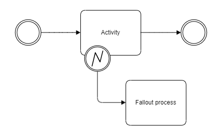
*([text description](media/primary-fallout-process-diagram.text-description.md))*

Figure 1: (Primary) fallout process

We assume that the order management will communicate the occurrence of the exception by raising a specific event. In the case of service orders, the serviceOrderExceptionEvent (as specified in [AP-2873](https://projects.tmforum.org/jira/browse/AP-2873?src=confmacro) - Add event for serviceOrderErrorMEssage ** in progress **) with a ServiceOrderErrorMessage sub-resource payload could be a candidate. Similar events should be made available at product order and resource order level. This is further discussed in chapter 3.2 and 3.3.

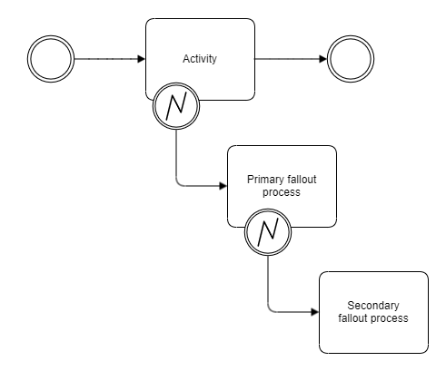
*([text description](media/secondary-fallout-process-diagram.text-description.md))*

Figure 2: (Secondary) fallout process

It might happen that the (primary) fallout process runs into issues of its own and raises secondary fallouts. Hence, nested fallouts with relationships to each other might be raised. The automatic resolution of such cases becomes increasingly complex and manual treatment is an option that must be available to cope with situations beyond a certain level of complexity.** **This aspect is further discussed in chapters 5.1.1.2 and 5.1.2.3.

## HSS activation fallout scenario

The following will explain in detail the behavior of each order and their order items during the appearance and treatment of an order fallout raised in a Resource Order Management component when it tries to create a new HSS profile for a mobile line service delivery. Specifically, the error raised by the HSS is that a subscriber with the same MSISDN already exists. This type of error might occur for different reasons:

The subscriber has been wrongly created during a data migration process, or has not been removed during a service termination process. In this case the resolution is simple: remove the wrong subscriber and retry the order item (see chapter 5.1.1).

- The subscriber is being used because we can find activity related to it (usage records). In this case, the fallout might be a symptom of several underlying problems:

- The MSISDN was free during the order capture, but there is already a service and a product associated to it which is being billed. This might be a symptom of a malfunction in the number inventory or the integration with it. The solution might be to change the status of the original number and the automatic selection of a new one and retry the order, or even the creation of the HSS subscriber with that number and to continue the order.

- There is no active service or product associated to the number, which might be a symptom of an assurance problem. In this case, perhaps a manual intervention might be required to investigate the case before doing anything.

Before examining the fallout situation, it is useful to visualize the happy paths, as illustrated in use case 008.

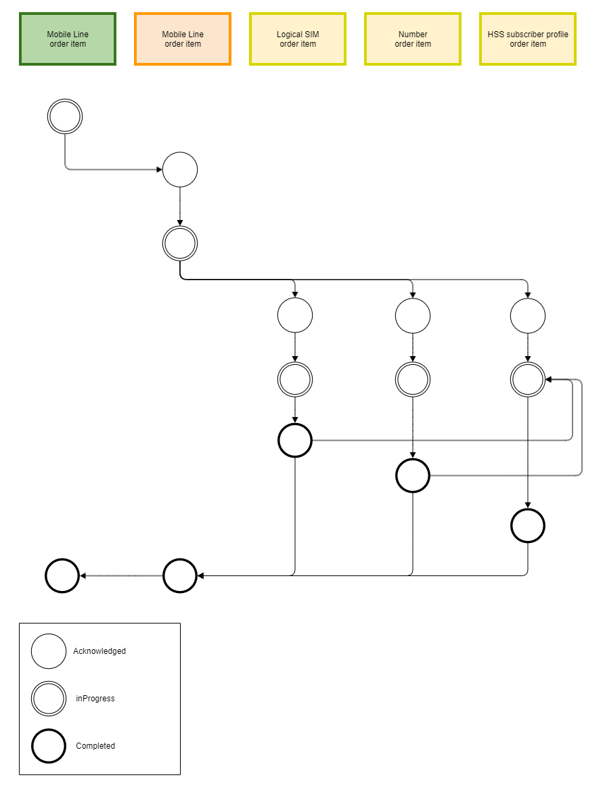
*([text description](media/happy-path-state-diagram.text-description.md))*

Figure 3: Happy path

The figure shows the happy path for the mobile line product order item. The following patterns are apparent:

- An Acknowledged order item follows an inProgress order item at the "higher" layer.

- The execution of an order item does not start before execution of the preceding order items has completed (dotted line)

- An order item is Completed only if the related order items at the "lower" layer are Completed.

Use case 008 has also implemented some "consistence" rules (term employed by TMF641 & TMF622) between order item states and order states. Those rules are derived from the lifecycle in TMF622. Additional rules are proposed here. Although such rules are not key to the current use case, they are an interesting by-product.

The following shows the path when a fallout is raised during completion of the HSS subscriber profile order item:

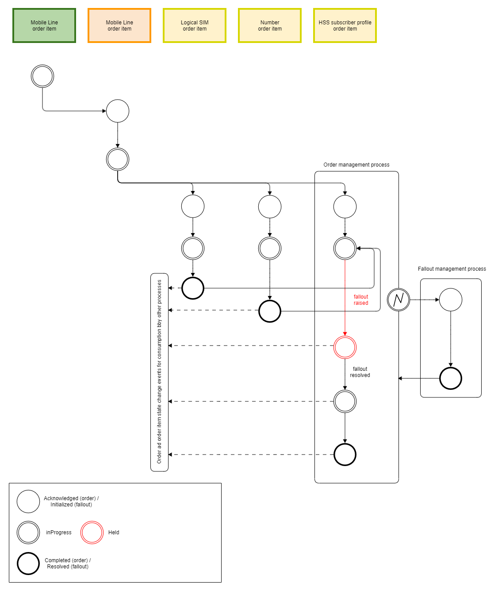
*([text description](media/fallout-path-with-resolution-state-diagram.text-description.md))*

Figure 4: Fallout path with resolution

A fallout is experienced while the resource order item is in state 'InProgress'. As a result, it transitions to state 'Held'. This transition is however dependent on the business logic implemented in the resource order management component. If the transition occurs, the state change is notified to other components. The latter will process this notification according to their own logic. This logic might involve processing of the orderExceptionEvents associated with the fallout. This version of the use case does not address how other components process order and order item state change events raised by the component experiencing the fallout. It only ensures that those events are raised.

After resolution of the fallout, the resource order item transitions again to state inProgress and resumes normal execution. The same observations apply to notification of this state change.

The resource order item could also transition to state 'Failed'. However, this state is final, and no recovery is possible. This could also happen in case the resource order management component was void of any logic and aimed at simple activations. In that case the service order management might need to solve the fallout situation and issue a new resource order after resolution. In this example, we assume that the order management component estimates that recovery is possible and that the 'Held' state is the most appropriate.

The sequence diagrams address two variants of this scenario, depending on whether the fallout can be resolved automatically i.e. without user intervention (chapter 5.1.1) or whether it requires user intervention (chapter 5.1.2). 

Though this is not key to the use case, we would also transition the complete resource order to state Held, in application to the following consistence rule: An order is in state Held if at least one order item is in state Held and the remaining order items cannot progress, because:

- Either their state is final (e.g., this is the case for the resource order as the Logical SIM and Number order items are in a final state); OR

- They depend on the Held order items (e.g., the CFS order might transition to Held because the mobile line CFS order item has been transitioned to Held and all other CFS order items depend on it).

This consistence rule is used in the sequence diagrams below.

The following shows the path when the fallout cannot be resolved (the state change events are not depicted, they follow figure 7):

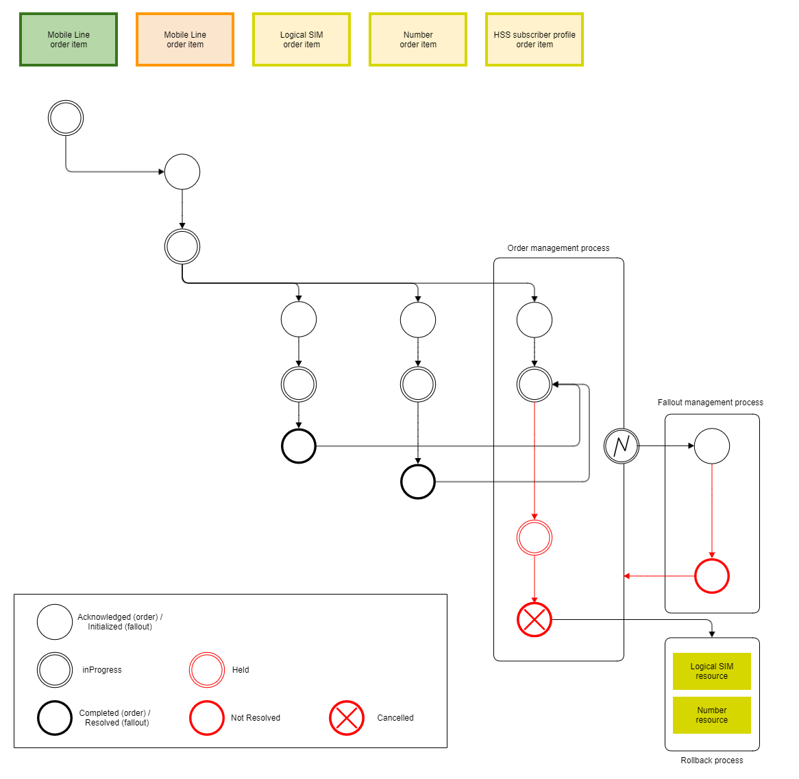
*([text description](media/fallout-path-without-resolution-state-diagram.text-description.md))*

Figure 5: Fallout path without resolution

If the fallout cannot be resolved, the HSS Subscriber Profile order item cannot be completed. Following the TMF652 (Resource Order Management API) lifecycle strictly, the only possible states are 'Cancelled' and 'AssessingCancellation' (the state 'Failed' cannot be reached from the state 'Held'). Here we assume that the resource order management component estimates that the issue cannot be solved and that the order item shall be cancelled. As a result of this resource order item cancellation, we would set the whole resource order state is to Cancel (new consistence rule). Though the resource order is cancelled, it contains 2 completed resource order items. As per the TMF652 lifecycle, the resource order items cannot be rolled back because their state is final. The rollback will be done directly on the resources, following a resource lifecycle. Chapter 5.1.3 covers the sequence diagrams for this scenario. 

Whereas the fallout use case is completed at this stage (i.e., the fallout has traversed its lifecycle), the situation is not solved satisfactorily from a product and customer perspective. The product order has not yet reached its final state. Although this is out of scope, we believe that similar mechanisms will work at each order management level. The issue experienced at resource layer might eventually trigger an exception and fallout management process at service and/or product order management level.

## Service order decomposition fallout scenario

This section details a scenario where the decomposition of the service order in resource orders fails due to a misconfiguration in the catalog. During the processing of a CFS, and once the RFS to be delivered is decided, the service order management will execute the decomposition logic that, based on the service and resource catalogs configuration, generates a resource order translating the service level characteristics into resource level characteristics.

At that point, this logic might fail for several reasons:

- Unexpected data types for some of the characteristics.

- Unexpected values for some characteristics not detected during the order validation process.

- Wrong relationships between RFSs and Resources.

- Etc.

In this case we describe a failure translating the msisdn characteristic of the service, which is an alphanumeric string with the value +34 555 66 77 88, to the msisdn characteristic of the Number resource, whose data type in the catalog is a number.

This failure raises a service order exception and a fallout. The analysis of the fallout determines that is not possible to resolve the problem automatically, leading to a manual resolution that consists in a change in the resource catalog configuration modifying the data type of the characteristic msisdn to string. The fallout ends up with a completed status, which causes a retry of the decomposition process in the service order management component.

The following depicts the path when a fallout is raised during the decomposition of the Mobile Line order item into the main resource order:

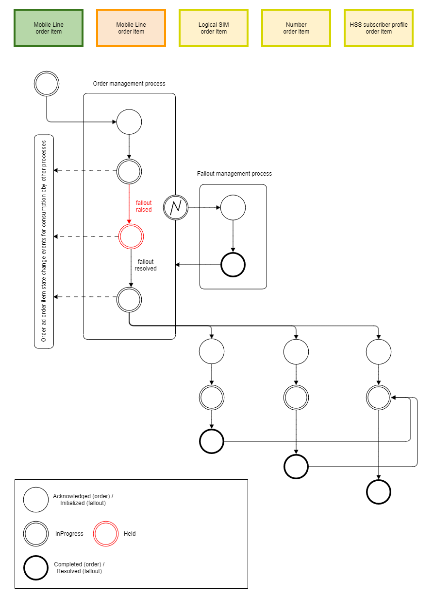
*([text description](media/decomposition-fallout-path-state-diagram.text-description.md))*

Figure 6: Fallout path with resolution

# Information View

## Fallout lifecycle

We make the assumption that a fallout management process follows the lifecycle proposed in the next figure. The lifecycle state is however not sufficient for order management to resume execution of the order processing. E.g., the fallout management process could be completed with various results (successful resolution of the fallout or failure to resolve the fallout).

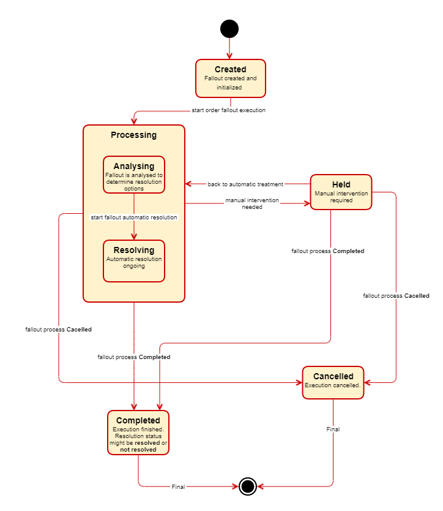
*([text description](media/fallout-lifecycle-state-diagram.text-description.md))*

Figure 7: Order fallout lifecycle

- When a fallout situation occurs in an order management component, a fallout process is created, and it remains in the **Created** status until its treatment starts.

- The fallout **processing** starts with an analysis to determine whether an automatic resolution is possible or instead has to be handled manually. Likewise, during this analysis it might be concluded that there is no possible resolution, which could lead to the completion of the fallout.

- If an automatic resolution is feasible, the fallout starts the activities to fix the problem. At this point, the fallout might be completed, or it might realize that a manual intervention is needed.

- If a manual intervention is required, the fallout moves to the **Held** status. From here on, the human operators have to act and decide whether the fallout should be completed or go back to the automatic processing.

- In case the process ends up with an explicit cancellation by the operator it would reach the **Cancelled **status.

- If the fallout process finishes the **Completed** status is achieved. In this case, the resolution status could be **resolved** or **not resolved**.

## Catalog view

The catalog proposed for this use case is a mobile offer based on a simplification of the UC008's catalog, which illustrates the delivery process for a postpaid mobile offer.

The following diagram depicts in detail the product catalog configuration:

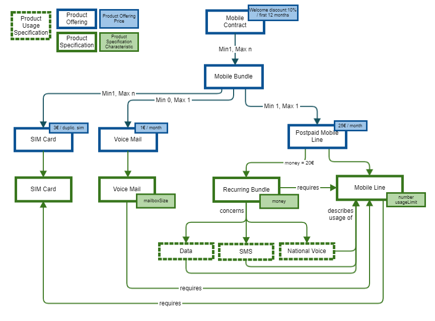
*([PlantUML source](media/product-catalog-view.puml))*

Figure 8: Product catalog

As we can see in the diagram, the mobile bundle is made up of the following elements:

- The postpaid mobile line offer, which is composed of the mobile line product and a recurring bundle for national voice, sms and data usages.

- An optional voice mail product, related to the main mobile line product.

- A SIM card product, required by the mobile line product.

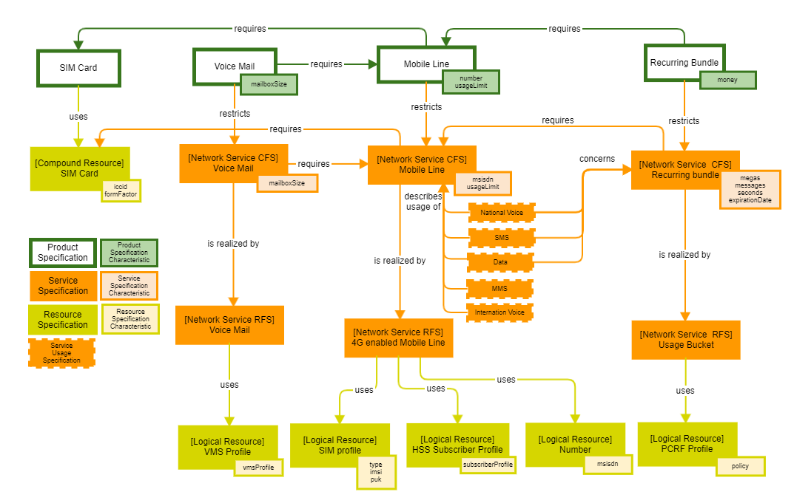
*([PlantUML source](media/service-resource-catalog-view.puml))*

Figure 9: Service and resource catalog

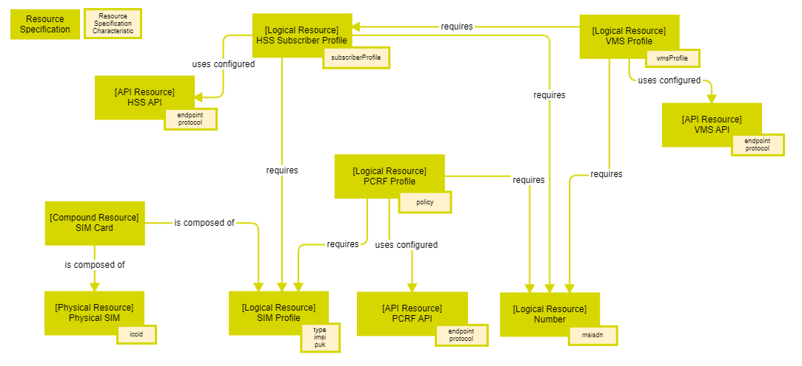
*([PlantUML source](media/resource-catalog-view.puml))*

Figure 10: Resource catalog

## Order structure

The following order structure represents a product order based on the catalog configuration presented in the previous section. The product order would be decomposed in one resource order to supply the physical equipment, and one service order for mobile services. Each CFS of the mobile service order is decomposed in an RFS, which in turn would launch a resource order.

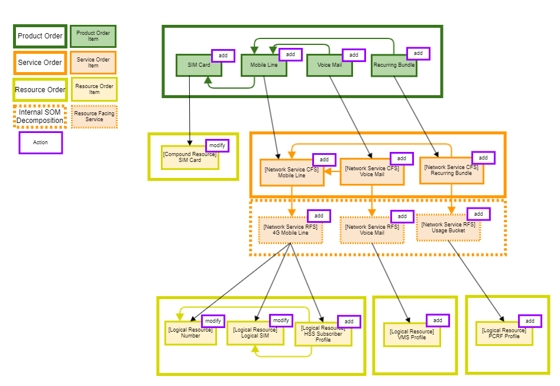
*([PlantUML source](media/order-structure-view.puml))*

Figure 11: Order structure

# Sequence diagrams

## HSS activation fallout scenario

### Sequence diagrams for successful, automatic resolution of the fallout

#### Order fallout detection

The sequence diagram starts before the HSS subscriber profile is activated. The related resource order item is in state "inProgress". The interested reader can refer to IG1228 UC008 for details on the sequences prior to the fallout (in particular figure 6.4.2.1 of UC008).

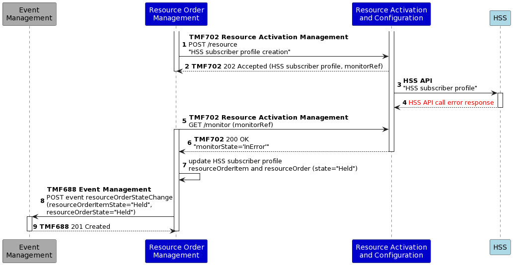
*([PlantUML source](media/hss-fallout-detection-sequence.puml))*

Notes:

- We use the same Resource Activation and Configuration component as use case 008 (proposed in [TAC-280](https://projects.tmforum.org/jira/browse/TAC-280?src=confmacro) - Service & Resource Orchestration ** in progress **and referenced as TMFC030 in the TAC project). The interaction of the Resource Activation and Configuration component with the Resource Catalog Management and Resource Inventory components, required for getting the HSS API endpoint, are not shown in the figure, as they are not material to this use case (they fit between sequences 2 and 3 of the above).

- We use the asynchronous capability of TMF702 (Resource Activation Management API), by analogy with the asynchronous capability of TMF640 (Service Activation Management API). However the current (beta) swagger of TMF702 does not (yet) allow it and the extension is proposed in [AP-4055](https://projects.tmforum.org/jira/browse/AP-4055?src=confmacro) - Support asynchronous response in TMF702 ** open **. The diagram only indicates the TMF702 GET /monitor call that returns a final monitor state (InError or Completed) and does not indicate the calls that return the InProgress state. The same applies to all sequence diagrams in the remainder of the document that use the asynchronous capability of TMF702.

- We suppose that the resource order (item) states are transitioned to "Held". 

At this point of the discussion, we need to decide whether the handling of the exception and resolution of the underlying causes can be performed in the Resource Order Management component or not. The argument is driven by the complexity of the analysis required.

The resolution of the order fallout in this scenario entails the following analysis:

- Does an active HSS subscriber profile with this MSISDN and specification already exist in the resource inventory? Actually ROM knows the answer to this question as it created previously a HSS subscriber profile in the inventory (see IG1228 use case 008 diagrams). Hence if ROM was to execute this process, this check might be optional.

- Does an active mobile line service with this MSISDN and specification already exist in the resource inventory?

- Does an active mobile line product with this number and specification already exist in the product inventory?

- Is this MSISDN and specification associated with usage in the resource usage management?

Even for this simple case, the analysis involves a range of production components, as well as one core commerce component. For more complex cases, the breadth of required components and associated data might even be larger. If this process was to be executed by ROM, it would mean that e.g., TMF637 (Product Inventory Management) needed to be a dependant API for ROM. This seems contrary to the principle of decoupling between production and core commerce domains. As a consequence this fallout resolution management process cannot be executed within the production domain, and a fortiori not within ROM. It speaks for a separate fallout management component, potentially located in the intelligence management block. This argument does not prevent basic fallout management capabilities being part of the order management components. But in general, we cannot make the case for fallout management being completely performed within order management. In the remainder of this use case, we therefore consider a dedicated fallout management component.

#### Order fallout creation

The next issue concerns the interaction between the order management and fallout management components. We use the resourceOrderException event to signal the occurrence of the exception. Such event does not yet exist. Its introduction is contemplated for the service domain (see [AP-2873](https://projects.tmforum.org/jira/browse/AP-2873?src=confmacro) - Add event for serviceOrderErrorMEssage ** in progress **). The alignment between TMF641 (Service Order Management) and TMF652 (Resource Order Management API) will extend the event to the resource domain (see [AP-4078](https://projects.tmforum.org/jira/browse/AP-4078?src=confmacro) - Improve resourceorder with jeopardy, errorMessage and milestone ** open **). This exception uses the resourceOrderErrorMessage to communicate the details of the exception to external systems. TMF641 links the existence of the OrderErrorMessage to an error that causes a status change in the order. Though this is also the case here (the resource order (item) transitioned to "Held"), this condition might need to be relaxed i.e. an error and related message might not necessarily entail an order (item) status change.

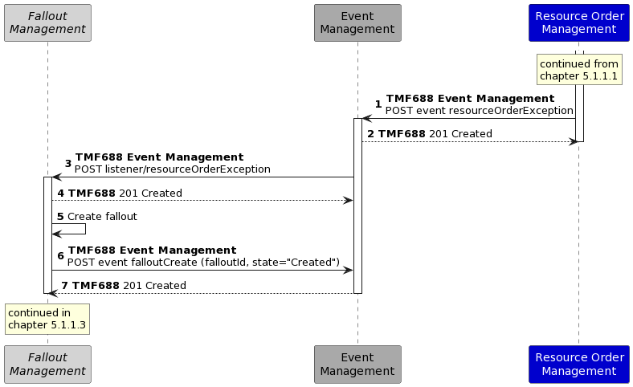
*([PlantUML source](media/hss-fallout-creation-sequence.puml))*

In the above (as well as in the remainder of this use case), we rely exclusively on events (using the Event Management API TMF688) with payloads specified in TMF652 (for the resource order error message). On the basis of the information contained in the resourceOrderErrorMessage, the Fallout Management component decides on the process to be carried out. This could be as simple as mapping an error code to an instance of a process library. The decision process could also involve complex mechanisms and support differentiation by suppliers of a Fallout Management component. The information model of the resourceOrderErrorMessage (by analogy with the serviceOrderErrorMessage) certainly supports a simple mapping. More complex decisions might require an extension of this information model.

The fallout lifecycle follows the process lifecycle described in chapter 4.1. It could be completed with a successful resolution or a failed resolution. 

#### Order fallout analysis

In the remainder we distinguish between the fallout analysis and fallout resolution phases of the process. These phases could also be realised by multiple processes, depending on implementation. However order management is only aware of a single process.

In this particular scenario, the fallout analysis sequence diagram would be as follows:

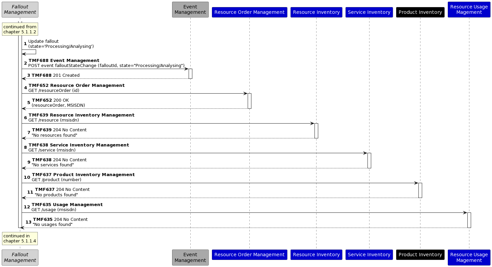
*([PlantUML source](media/hss-fallout-analysis-sequence.puml))*

It follows the analysis described in chapter 5.1.1.1. The Fallout Management component tries to determine whether the MSISDN is associated with a resource, service, product or usage event:

- Initially, it only has a reference to the resource order that has failed, it gets the details of the order to obtain the MSISDN of the resource that have not been created.

- Subsequently, it queries the resource, service and product inventories to determine whether any active inventory entity is associated with the MSISDN.

- Finally, it tries to find usage events associated with that number to determine if there is network traffic associated with the number, indicating thereby that the number is in use.

#### Order fallout resolution

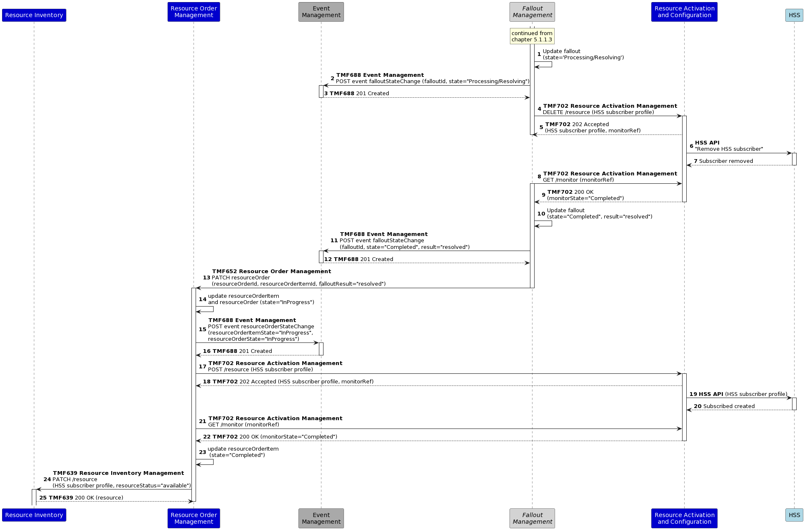
*([PlantUML source](media/hss-fallout-resolution-sequence.puml))*

Notes:

- Once the fallout management process is completed, the Fallout Management component needs to communicate the result of the process (as described in chapter 5.1.1.2). In this case, the result is "resolved".

- The current (beta) version of TMF702 does not allow asynchronous behavior for delete operations (nor does TMF640). We suppose, however, that this is available.

- The process has reached a point that is equivalent to the one of figure 6.4.2.1 in use case 008. It then branches back to the downstream sequences in use case 008.

### Sequence diagrams for successful, manual resolution of the fallout

#### Order fallout detection

This sequence diagram is identical to the one of chapter 5.1.1.1. 

#### Order fallout creation

This sequence diagram is identical to the one of chapter 5.1.1.2. 

#### Order fallout analysis

The types of checks performed are identical to the one of chapter 5.1.1.3. However the responses are different. In the sequence diagram of chapter 5.1.1.3, all responses returned a status code 204. Any deviation from this result (e.g., a 200 status code in one of the responses) might be interpreted by the fallout management as an indication that an automatic resolution is not possible. Of course more complex processes could be supported by the fallout management component (e.g., it might be able to automatically resolve the misconfiguration indicated by the 200 response). The key point is that a limit exists to automatic resolution of the fallout. This limit might be reached quickly or not, depending on the capabilities and sophistication of the fallout management component. Once this limit is reached and crossed, the component will consider a manual resolution.

#### Order fallout resolution

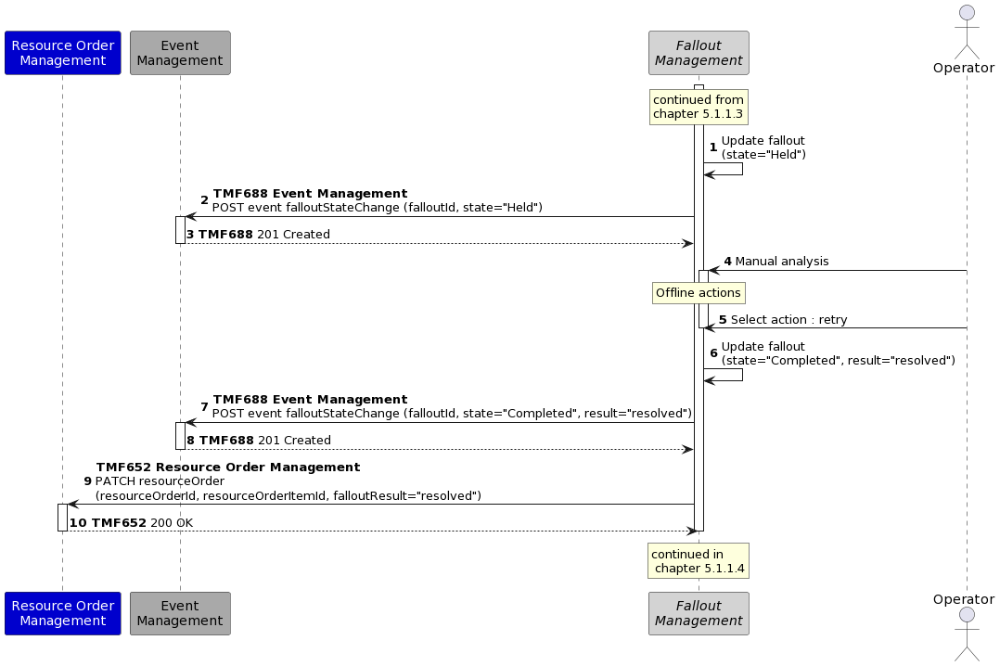
*([PlantUML source](media/hss-fallout-manual-resolution-sequence.puml))*

Notes:

- In the first run of the fallout analysis process (5.1.2.3), the fallout management component reaches the conclusion that an automatic resolution is not possible. The component transitions the fallout to manual resolution.

- The event signaling the manual resolution might trigger additional workflows not shown here (e.g., email alerts, ...)

- The operator will log on to the fallout management component and perform a manual analysis of the information provided. An example of such a dashboard is shown below. This analysis might be followed by actions performed offline (i.e. outside the sequence diagram) on specific systems. After those actions, the order manager selects a possible action in the dashboard. In this example, we illustrate a "retry" option.

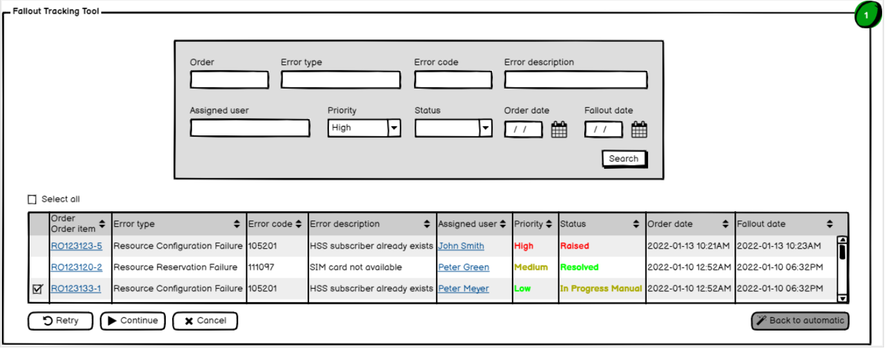
*([text description](media/fallout-tracking-tool-mockup.text-description.md))*

- The "retry" option will trigger the conclusion of the fallout treatment, which will reach the completed status with the result "resolved".

- The resource order management component receives an API call with the neccesary information to retry the action that originally failed and continue with the execution of the order.

### Sequence diagrams for unsuccessful resolution of the fallout

#### Order fallout detection

This sequence diagram is identical to the one of chapter 5.1.1.1. 

#### Order fallout creation

This sequence diagram is identical to the one of chapter 5.1.1.2.

#### Order fallout analysis

This sequence diagram is identical to the one of chapter 5.1.1.3. 

#### Order fallout completion

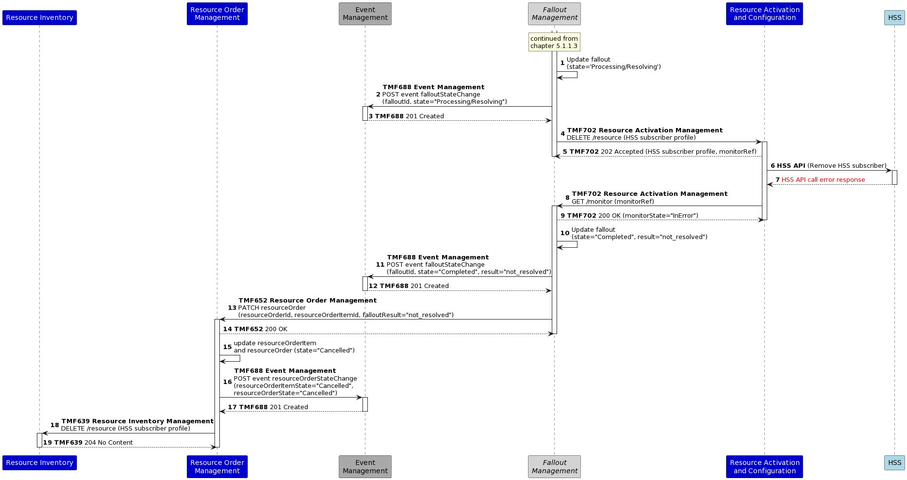
*([PlantUML source](media/hss-fallout-completion-unsuccessful-sequence.puml))*

From this point onwards, the process diverges from the use case 008. Resources need to be rolled back (see below) and the cancellation of the resource order flows to SOM and modifies the downstream sequences in use case 008. The latter is out of scope of this use case.

#### Rollback

An extra step is required if the fallout cannot be resolved and the resource order is cancelled, namely the rollback of the resources that have already been configured as a result of completed resource order items that are part of the resource order.

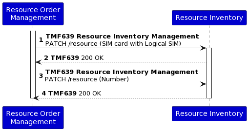
*([PlantUML source](media/hss-fallout-rollback-sequence.puml))*

Notes:

- The rollback is quite simple in this case and only involves inventory updates (see use case 008 for the sequences that processed the SIM card and number resource order items).

- Use case 008 also discusses the shipment of tangible products, including a physical SIM card. The rollback of the logical SIM card might also trigger some rollback processes at product level. This is out of scope.

## Service order decomposition fallout scenario

### Sequence diagrams for successful, manual resolution of the fallout

#### Order fallout detection

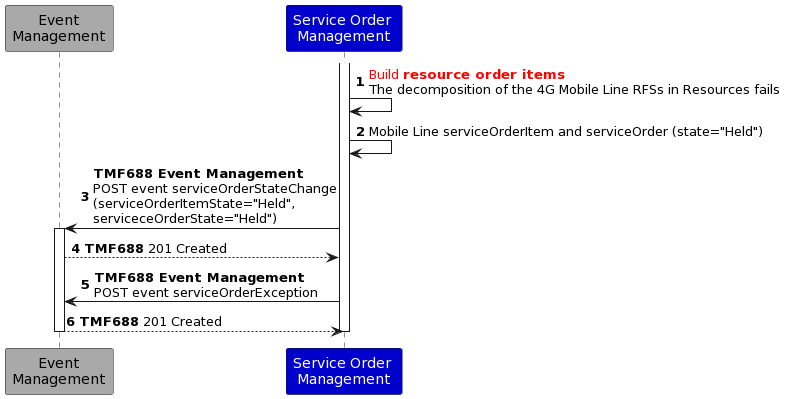
*([PlantUML source](media/decomposition-fallout-detection-sequence.puml))*

Notes:

- The decomposition of the RFS into a Resource Order fails.

- ROM cannot continue executing the service order item related with the mobile line, so it reaches the status Held. The whole order also gets Held, because the exception of the other service order items depends on the completion of this one.

- SOM raises two events to notify the order change of status and the exception.

#### Order fallout creation

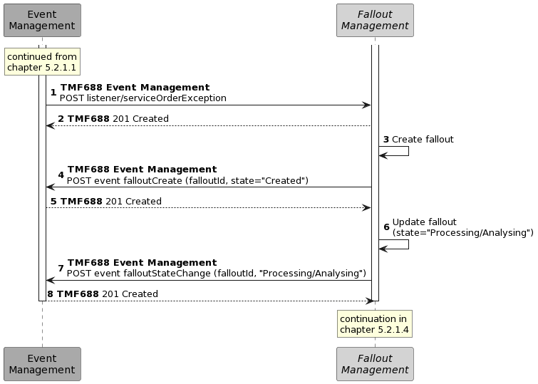
*([PlantUML source](media/decomposition-fallout-creation-sequence.puml))*

Notes:

- The fallout management component is listening to the exception events raised by any order management component. When it detects the event sent by SOM, it immediately creates and initializes a new fallout. The creation of the fallout is notified through an event.

- The fallout automatic processing and analysis starts, which is also notified through an event.

#### Order fallout analysis

Analysing the information received through the exception raised by the Service Order Management, the Fallout Management component is not able to identify the error occurred nor an automatic resolution process for it. Therefore, the fallout starts the manual analysys and resolution treatment which has to be assigned to an operator.

#### Order fallout resolution

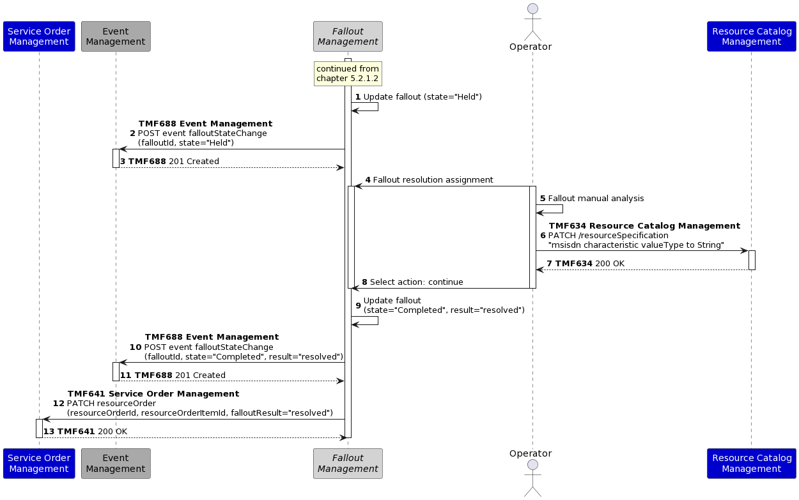
*([PlantUML source](media/decomposition-fallout-resolution-sequence.puml))*

The fallout management process continues after deciding that there is no automatic resolution available for this failure. Therefore, fallout reaches the ‘Held’ status:

- The fallout is assigned to an operator, which analyses the problem and identifies a solution.

- The solution is manually applied by the operator. In this case, he decides to modify the data type of the resource specification characteristic ‘msisdn’ to alphanumeric in the resource catalog. This would avoid the original data conversion problem that raised the fallout.

- The operator informs about the action to be executed, and the fallout is set to Completed.

- SOM would receive a message indicating that the fallout process has finished and the result of it. Then, it will try to execute again the decomposition of the service order. 

# Conclusions

## Lessons learned

The main conclusion derived from the development of this use case is the need for a dedicated component responsible for the detection, analysis, and resolution (automatic or manual) of fallouts, initially within the execution of orders, but potentially within any other business process prone to failures requiring correction. 

The main characteristics that this component should have been the following: 

- It should be able to actively listen to the behavior of any other component in the architecture to identify problems in their execution. 

- It would need to have the ability to act against potentially any other component (standard ODA or legacy) through any type of interface. Those components are not restricted to any functional block. 

- It should be flexible enough to be adapted to any business environment.  

- It should provide simple or more sophisticated configuration capabilities like DL/ML to detect and analyze any potential fallout. 

- It should provide configuration capabilities to resolve known fallouts automatically. 

- It should provide capabilities for manual resolution when the fallout is not known or supported by the system. 

Given the complexity that this component must address and its potential interaction with numerous components and systems, it is advisable to place it within a cross-functional block. This, in addition to the analytics and automatic learning capabilities described above, makes it a good candidate to be in the Intelligence Management functional block. 

Additionally, because of the need for this component, a new Open API should also be defined, to be provided by it, as well as SID entities to maintain its information structures.

## Impacts identified

- [AP-2873](https://projects.tmforum.org/jira/browse/AP-2873?src=confmacro) - Add event for serviceOrderErrorMEssage ** in progress ** 

- [TAC-280](https://projects.tmforum.org/jira/browse/TAC-280?src=confmacro) - Service & Resource Orchestration ** in progress ** 

- [AP-4055](https://projects.tmforum.org/jira/browse/AP-4055?src=confmacro) - Support asynchronous response in TMF702 ** open ** 

- [AP-4078](https://projects.tmforum.org/jira/browse/AP-4078?src=confmacro) - Improve resourceorder with jeopardy, errorMessage and milestone ** open ** 

- [ISA-389](https://projects.tmforum.org/jira/browse/ISA-389?src=confmacro) - Improve Manage Order Fallout (1.3.3.8) description and decomposition ** done ** 

*Other impacts need to be formalized in next versions, such as:*

- *add of the proposed ODA component in the inventory (IG1252)*

- *review TMFC002 and TMFC007 mappings*

- *add a new SID ABE*

- *add a new API*

