# Introduction

This use case intends to comprehensively examine the ODA components involved and interactions between them in the ordering of complex products, particularly within the framework of the automated CPQ journey. The use case will specifically focus on the SASE Service as an illustrative example.

SASE concept was initially defined by Gartner in 2019 as a solution that delivers converged network and security as a service capabilities, including SD-WAN, SWG (Secure Web Gateway), CASB (Cloud Access Security Broker), NGFW (Next Generation Firewall) and zero trust network access (ZTNA). Currently, SASE is available on the market as vendor specific solutions. SASE is primarily delivered as a service and enables zero trust access based on the identity of the device or entity, combined with real-time context and security and compliance policies. SASE supports branch office, remote worker and on-premises secure access use cases. There are multiple vendor-specific solutions on the market. MEF organization takes an effort to expand upon the Gartner SASE concept by defining a standard SASE Service that combines Security Functions and network connectivity.

In the course of order capture journey, the customer will initiate the process by configuring the root SASE product offering according to their specific requirement. During the configuration process customer is expected to specify the parameters of the product offering (where required) to meet its individual needs.

The system dynamically generates a price quote based on the configured product offering. The pricing mechanism takes into account the selected specifications, chosen or configured characteristics for them, combination of specifications and any other additional customization chosen by the customer during the configuration process.

## Context or Background

Sales automation obtains higher importance as complexity and expected flexibility of the commercial offers grows.

SASE involves multiple product dependencies and tiers. Each SASE quote can require high level of customization and involve multiple price point, checking multiple rules, allowed combinations and bundles, serviceability at selected locations and other. Correct quote preparation is essential to avoid errors and fallout during customer order fulfillment. That can be facilitated with advanced automated offerings configuration and quotes generation for a customized product. It can greatly increase sales efficiency and end user satisfaction.

Advanced automated offerings configuration and quotes generation involves multiple steps like product and quote configuration, service design, product inventory check, quote eligibility check, serviceability check, automated cost and price calculation, quote approval, proposal and contract negotiation, sign and other sub-steps. In a highly decomposed ODA architecture that would presume high level of ODA components interaction. At least it would involve Product Order Capture & Validation, Product Catalog Management, Product Configurator, Location Management, Product Inventory, Product Order Delivery Orchestration and Management, and also Party Management, Billing Account Management, Party Interaction Management as well as not yet defined ODA components from Engagement Management domain etc.

Hence, there is a good reason for using tools providing configure, price, quote capabilities to generate quotes for customized SASE service order.

## Objective of the use case

The use case intends to investigate the possibility to construct clear ODA components interaction logic using TMF Open APIs that would correspond to the process of automated offerings configuration and quotes generation for SASE service. This study also aims to reveal existing gaps in context of the use case, identify potential impact and ODA framework extension.

From the customer perspective the user story can be described as follows:

| Business context | Since the arrival of cloud computing traditional enterprises' security architecture becomes less efficient as many security functions tend to be hosted outside of organization's cloud. That led to the development and growing popularity of SASE solutions. A service provider wants to harness this trend and come up with its own SASE offerings for Enterprise |
| --- | --- |
| AS AN | Enterprise customer |
| I NEED TO | have the reliable, clear, assisted and consistent way of configuring SASE service offering preferably expressing only my intent to do so |
| SO THAT I | before placing an order can have visibility if I connect my branch offices, remote workers understanding the scope of security options with associated pricing visibility on various volume discount and promotions applied to my scope of offerings and estimate my budget in order to connect all required branch offices and remote workers applying required SASE security |

## Scope and assumptions

### Scope

The use case includes:

- Example Product Catalog structure for SASE Service including Main and Extended/Optional offerings

- Sequence diagrams depicting the process of quote management, order capture and validation with the focus on Product Order Capture and Validation component

For the first release our goal is to illustrate on the high level ODA components interaction during

- Quote creation based on existing catalog

- Eligibility checks (e.g. Markets/Location, Distribution Channel, Technical Availability)

- Picking up Product Offerings with options

- Resulted price calculation

- Approval by customer and check-out

- Product Order placing

Later we could extend the case with details on

- Verification and validation of the customer billing account, credit check etc.

- Agreement creation

### Assumptions

General assumptions:

- Sunny day scenario is considered (i.e. no fall-out scenario, no eligibility check error scenario)

- Party exists and Party Role as Customer is in place

- Customer does not update but orders a new SASE Service

- Interactions with other service providers are out of scope

- CSP besides being a SASE Service provider is also a provider of Underlay Connectivity

- Underlay Connectivity supports policy based networking technology

- Actor accesses from the customer locations various target resources that might be hosted in the CSP or public cloud or customer premises. Target resources located in the cloud are not accounted for the quotation as Actors (Target Actors as per MEF).

Pre-conditions:

- Product offerings are configured

- Prices, discounts, pricing rules and conditions for the product offerings are configured

- Products specification and related technical dependencies are configured

- Customer information and account already exists

Out of scope of the first release:

- Interaction with billing and rating components

- Interaction with Hyperscalers is out of scope

- Partner interaction to check and negotiate Underlay Connectivity is out of scope

- Partner Underlay connectivity is out of scope

Additional (detailed) assumptions (please refer to the scenario description and the catalog)

- If CSP being both SASE Service Provider and Underlay Connectivity Provider can not cover certain subscriber locations, Underlay connectivity becomes a responsibility of the customer. In that case CSP exposes its SASE Edge (located in SASE Provider Network) to the Internet and take off responsibility from itself. In that case it becomes a customer responsibility. CSP does not anyhow check customer commitment that Underlay Connectivity is sufficient for subscribed performance of the SASE Service

- In case the customer selects a location where Underlay Connectivity to that customer exists that connectivity is deemed to be sufficient to support being subscribed performance of the SASE Service

- If CSP Underlay Connectivity does not exist at desired location it does not restrict the customer from selecting desired location (the customer will bear responsibility in that case)

- Actor accesses from the customer locations various target resources that might be hosted in the CSP or public cloud or customer premises. Target resources located in the cloud are not accounted for the quotation as Actors (Target Actors as per MEF).

# Description

| Actor | The Customer, The System (Channel Management, Navigation Management, Product Order Capture & Validation, Product Catalog Management, Product Configurator, Product Inventory, Product Order Delivery Orchestration and Management) |
| --- | --- |
| Pre-conditions | Party exists and Party Role as Customer is in place Product offerings are configured Prices, discounts, pricing rules and conditions for the product offerings are configured Products specification and related technical dependencies are configured Underlying Infrastructure of CSP to offer SASE service is in place Underlying Infrastructure of the Partner and agreement with the required partner is in place |
| Begins When | The Customer wishes to order a new SASE Service and visits a portal integrated with Channel Management |
| Description | Customer logs in at the portal (available via Channel Management) Customer start creating a quote by clicking a button System checks whether selected Customer Account is present , validates his ID and picks its name and category Customer fills in initial eligibility parameters (e.g. region, required delivery date) System performs initial eligibility checks System opens the main Configure, Price, Quote Cart page. The catalog content is filtered according to eligibility criteria System creates the Quote in the ‘In progress’ state Customer makes guided product offering selection Customer selects the product offering options and/or specifies product offerings configurations Customer also provides specific locations of access connection endpoints System adds Offering as a Quote Item to the specified locations Customer submits the request for qualification by the System System performs technical qualification and reports back about qualification pass. System applies pricing rules, discounts and calculates final quotation price Customer approves the quote and proceeds to check-out Customer makes final check and submits the quote for the delivery System initiates Product Order delivery |
| Ends when | System accepted configured Quote and informs the Customer that Order has been successfully placed. |
| Post-conditions | Quote is Accepted Order is placed |

For the sake of easier readability illustrative simplified SASE product catalog structure is taken. 

In that context simplified SASE service architecture diagram looks as follows

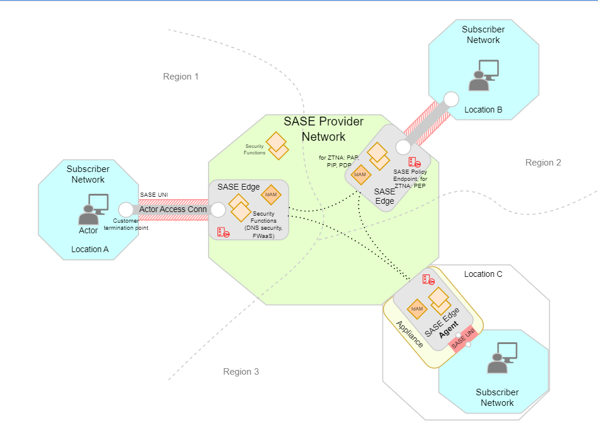
*([text description](media/sase-service-architecture-diagram.text-description.md))*

Actor is granted access and is monitored according to the multiple SASE policies. Actor could be

- A User using Application running on the Device (i.e., a person)

- An Application running on the Device (e.g., autonomous application)

- A Device (e.g., sensor)

Actor accesses the SASE Provider network at SASE Edge via Actor Access Connection. SASE Edge applies policies to the Actor according to his ID. SASE Edge is better placed at closest to the Actor location. SASE Edge capabilities can be provided by the Agent installed on customer premises at the Device or Appliance. Actor Access Connection provides **overlay connectivity** to the Actor and can be implemented in variety of ways and can be established for each Actor's SASE Session or pre-established in advance. The far end of the Actor Access connection is SASE Provider's Network Termination Point within closest to the Actor SASE Edge.

Actor Access Connection uses underlay connectivity supporting policy based networking technology

For the use case illustration following MEF 117 Security Functions have been taken

- DPF - DNS Protocol Filtering

- DNF - DNS Name Filtering

- PDNS - Protective Domain Name Service

- MBSF - Middle Box Security Function

- IPPF - IP, Port and Protocol Filtering

- MD+R - Malware Detection and Removal

## SASE Offering description

In practice SASE offering will be a complex offering. SASE is an overlay type of service. It could rely on multiple public or private underlay connectivity provided by different service providers to establish communication between SASE functions and Actors. SASE service provider can have partnership relations with those providers to control quality of provided SASE service. In the case of connectivity to subscriber site (where Actors are located) SASE service provider might not always have partnership with underlay connectivity service provider and, therefore can not control quality of provided SASE services.

SASE presumes combination of Secured Service Edge functions providing security capabilities and a network access using Underlay Connectivity. SD-WAN being an overlay service in itself can also play a role of Underlay Connectivity for SASE 

Current commercially available SASE service offerings are offered as vendor-specific solutions (e.g. Palo Alto Networks, Zscaler, Cloudflare, Juniper, Fortinet, Cato, Perimeter81, Cisco, Akamai, Versa) offering a set of security capabilities (proprietary, not-standardized) like Secure Web Gateway (SWG), Cloud Access Security Broker (CASB), Data Loss Prevention (DLP), DNS Filter, (DNF), Remote Browser Isolation (RBI), Zero Trust Network Access (ZTNA), Firewall as a Service (FWaaS) generally available across multiple countries.

In the given use case SASE Offering:

- Reuses standardized MEF SASE definitions (please refer to the section References, MEF117) that do not cover the whole scope of commercially available on the market vendor-specific security capabilities

- Applies to multiple site locations of the customer

Note: MEF envisioned definition of SASE Product but current work is at the stage of "Attributes and Service Definitions". Therefore given product catalog view is not anyhow complete or claims to be aligned with MEF standard definitions of SASE product model that do not yet exist at product level.

SASE Contract Offering

Initially, when the customer starts browsing the eligible offerings he specifies country and a list of regions where he plans to have a SASE service. 

CSP decides to restrict SASE Contract offering availability to certain regions (by catalog configuration). It can be a reflection of actual CSP SASE underlying infrastructure coverage or CSP commercial policy.

That, as well as channel, product category (set by the system based on customer role - B2B customer) is taken into account to filter out relevant offerings as well as to set specific prices dependent on these conditions.

Once the customer selects "SASE Contract" as an offering to configure, the System presents "SASE Contract" root offering with a base price plan options. "SASE Contract" has associated price plan (Silver, Gold, Platinum) that is dependent on specified by the user number of Actors (characteristic of that offering). Depending on the selection he sees estimation of monthly recurrent charge. At this point previously obtained information on customer regions is also taken into account.

Additionally, customer may specify a contract term (2 years, 3 years) to get overall discount on all offerings

"SASE Contract" offering has 7 child offerings. Some of them are location specific some are not. Location specifies the customer premise civic address. Customer chooses child offerings and specifies their quantity

The total quantity of location specific offerings (SASE Edge Agent and Actor Access Connection) shall not exceed the specified number of Actors. Actors are connected to the SASE Provider network either through SASE Edge Agent or Actor Access Connection. Therefore, for available regions selected by the customer for "SASE Contract" offering at least one location specific offering needs to be selected.

Actor Access Connection

The typical use case for ordering Actor Access Connection is an access of an individual person to the SASE Service. Actor Access Connection terminates at SASE Edge located in the cloud of SASE Provider Network. That SASE Edge will need to support expected performance of the given Actor Access Connection. Actor Access Connection is expected to be terminated at the closes SASE Edge.

Depending on the location of SASE Edge there might be different associated regional cost rates (e.g., cloud infrastructure support fees, tax rates, etc.)

The invoked resource usage of SASE Edge and associated regional support cost rates are expected to be compensated with differentiated charge of "Actor Access Connection" offering.

Therefore, for each "Actor Access Connection" offering the customer specifies a location. The customer also selects desired Actor Access Connection Plan (monthly recurrent charge depending on bandwidth and region)

The system obtains in advance all locations where customer has Underlay Connectivity from the CSP. That list of locations is presented to the customer. If the customer does not see desired location in that list he can specify its own location. In that case he commits that Underlay Connectivity is sufficient to support being subscribed performance of the SASE Service.

SASE Edge Appliance with Agent SW

The typical use case for ordering SASE Edge Appliance with Agent SW is an access to the SASE Services of a group of persons, applications, devices located within a certain premise. SASE Edge Agent SW provides SASE Edge functionality. The given offering presumes as well a device (or appliance) that runs that Agent SW. The functionality of Actor Access Connection becomes internal to the device. In the given case it is assumed that appliance is rented out by the CSP to the customer with certain monthly recurrent charge. 

SASE Edge Agent needs to communicate with other SASE Edge located in the CSP network. It will invoke certain resource usage in CSP network. Depending on the location there might be different associated regional cost rates. These costs are expected to be compensated with differentiated charge of "SASE Edge Appliance with Agent SW" offering.

Therefore, for each "SASE Edge Appliance with Agent SW" offering the customer specifies a location. Depending on the planned usage there are different SASE Agent Access Plan options (monthly recurrent charge)

The system obtains in advance all locations where customer has Underlay Connectivity from the CSP. That list of locations is presented to the customer. If the customer does not see desired location in that list he can specify its own location. In that case he commits that Underlay Connectivity is sufficient to support being subscribed performance of the SASE Service.

It is also assumed that for the regions where CSP does not have SASE Edge in the cloud the customer has to buy SASE Edge Agent (SW or SW + Appliance)

SASE Edge Agent SW

That offering is identical to the "SASE Edge Appliance with Agent SW" offering with the exception that it does not include an appliance to run on. That offering might be interesting to the customer who has certain own devices at the disposal that are capable to run SASE Agent SW. In that case there is no device rental fee but SASE Agent Access Plan is still applied.

As well as for "SASE Edge Appliance with Agent SW" offering the customer specifies a location by selecting one of the existing locations prompted by the CSP or specifying its own desired location.

Subscriber Underlay Connectivity (**characteristic** of location specific offerings and product specification)

That characteristic does not have a price. It is used to present to the customer information about Underlay Connectivity. Location (place) information is taken from the inventory or from the input of the user. In case Underlay Connectivity was earlier provided by CSP for that location, then the Type of connectivity is ON-NET and location information is taken from the inventory. At this point the customer may specify e.g., a desired SASE consumed bandwidth of the virtual interface at site location. This data will later be used for service qualification check to decide on technical eligibility.

If the user chooses 3rd party connectivity as a Subscriber Underlay Connectivity, then the customer is asked to provide commitment for existing 3rd party Underlay connectivity and then the Type of connectivity is OFF-NET

ZTNA Corporate

SASE Service by its definition presumes controlling and specifying security access policies for each individual Actor. As SASE Service main target market is B2B market it is assumed that access to the corporate resources will be required for each Actor. Therefore, this offering is mandatory.

That offering is selected to be non location specific. However, e.g. policy enforcement functionality of ZTNA do need to be run at the edge that is location specific, other administrative elements of ZTNA are not required to be location specific. Hence, for the sake of offering simplification it is assumed that location will not be taken into account for ZTNA. 

ZTNA Cloud Apps

That offering is deemed to provide an option of an access to the services and resources provided by Hyperscalers. Presumably, the customer might wish to provide such type of capability not to each of its Actors. Therefore, that offering is optional. If selected the customer needs to specify desired number of Actors that will access Hyperscalers' Cloud Applications.

Depending on the selected number different monthly rates per Actor are offered according to ZTNA Plan

DNS Security

That offering provides a grouping of DNS Security functions as defined in MEF 117 (DPF - DNS Protocol Filtering, DNF - DNS Name Filtering, PDNS - Protective Domain Name Service). 

As DNS security is deemed to be a core security capability that offering is assumed to be mandatory for all Actors.

DNS Security capabilities are assumed to be provided by the CSP as a cloud service. Depending on the usage and selected base price plan (Silver, Gold, Platinum) different charging rates are applied according to DNS Security price plan

FWaaS

That offering provides a grouping of Firewall Security functions as defined in MEF 117 (DNF - DNS Name Filtering, PDNS - Protective Domain Name Service, MBSF - Middle Box Security Function, IPPF - IP, Port and Protocol Filtering, MD+R - Malware Detection and Removal). Considering the fact that DNF and PDNS are already covered with mandatory DNS Security offering, the offering catalog presumes only grouping of additional offerings (MBSF - Middle Box Security Function, IPPF - IP, Port and Protocol Filtering, MD+R - Malware Detection and Removal).

FWaaS capabilities are assumed to be provided by the CSP as a cloud service. 

The given offering is provided as selectable option. The customer is required to specify number of Actors. Depending on that number, the usage and selected base price plan (Silver, Gold, Platinum) different charging rates are applied according to FWaaS price plan

Offering Constraints

- In perspective of this use case the offering is restricted by the Country. It means that every country will have different terms of operations and offerings.

- Region specifies the area of the SASE offering coverage by the SASE Provider Network. In addition to this it is assumed that every Region can have a different offering price.

- For each location customer needs to have either SASE Edge Agent or Actor Access Connection.

## Customer Journey screen flow

1. The User representing a B2B customer accesses B2B eCommerce page and selects "Sign In" (or Log In) action

2. The User is prompted to enter credentials. User enters credentials and proceeds

3. The User is prompted to go ahead with selection of a main Offer to be configured

4. The portal prompts to provide Country and Regions where the new product is planned to be used. It narrows the list of available offerings and helps to apply correct pricing

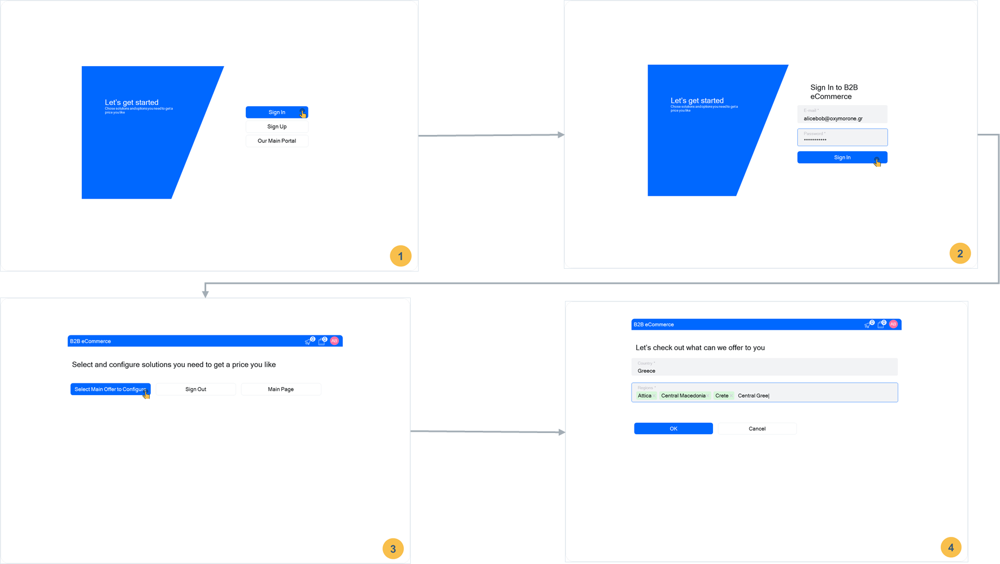
*([text description](media/customer-journey-signin-region-mockup.text-description.md))*

5. The system runs in the back-end eligibility checks and/or recommendations lookup applying collected information about the customer, country and region list he provided. It returns result to the portal that renders the result placing SASE offering on the first place. The user selects SASE offering and proceeds

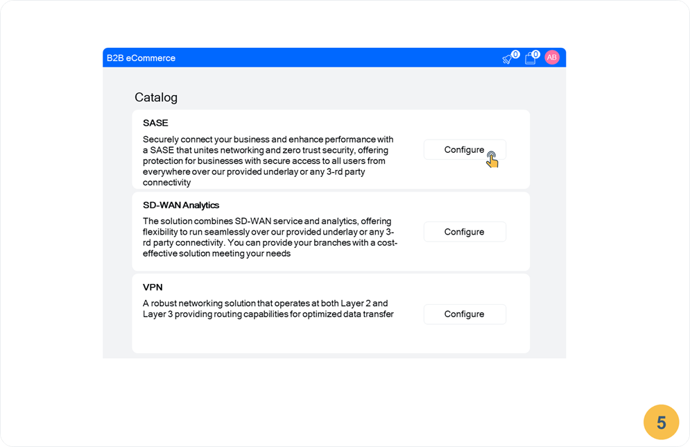
*([text description](media/customer-journey-catalog-selection-mockup.text-description.md))*

6. Before rendering this screen the system queried the inventory and location management functionality to collect the data about all locations the customer is having within specified regions. By this time the system has built in the backend the structure of the offerings, what information is required to be configured and what are the constraints for configuration values and selections. First, the system prompts to fill the root offering characteristics. Depending on the number of Actors user enters the portal switches the radio button below Silver/Gold/Platinum plan for the user to be informed of expected charges. User enters desired number (35), contract term and proceeds.

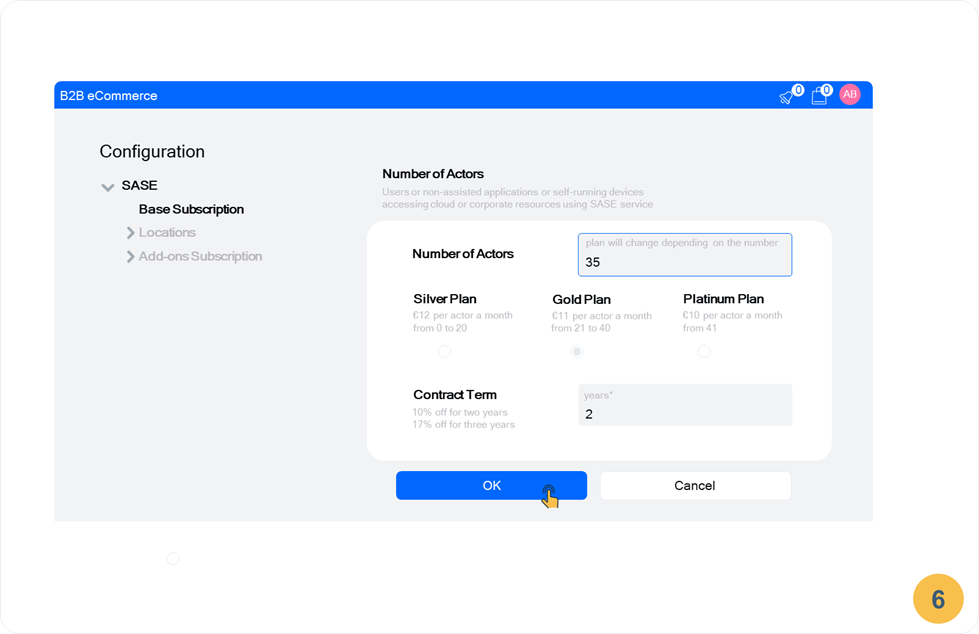
*([text description](media/customer-journey-base-subscription-mockup.text-description.md))*

7. Note: the system has collected already inventory information about existing locations. The system prompts the user to pick-up one of the existing (On-Net) location or, alternatively, provide Off-Net location connected with 3rd party operator. When rendering the screen the system reads addresses and names of the sites related to the locations. The user ticks desired locations out of existing and adds Off-Net locations by typing site name and address.

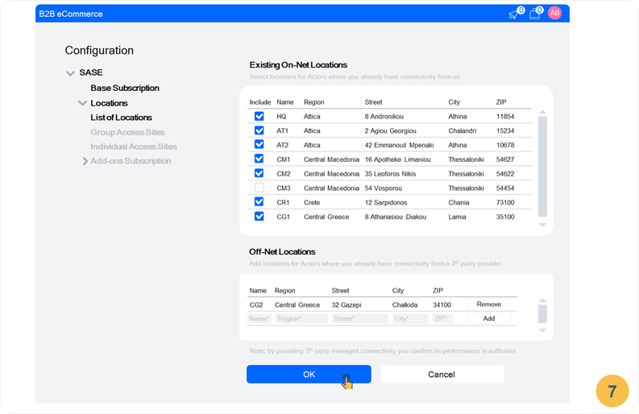
*([text description](media/customer-journey-locations-mockup.text-description.md))*

8. First the system prompts the user to select locations that will be used for the access by a group of Actors through SASE Agent. The name of location is a selection from drop-down list of locations collected at previous dialog screen. User selects whether he needs an appliance together with SASE Agent software or not (in a later case, customer would use its own appliance). Also, user selects the bandwidth he expects to consumer at the selected location. The bandwidth values are limited to the ones defined in the price plan. The displayed monthly recurrent charge depends on several conditions: selected plan (Silver, Platinum, Gold), Region of location and selected bandwidth. Once user is done he proceeds further.

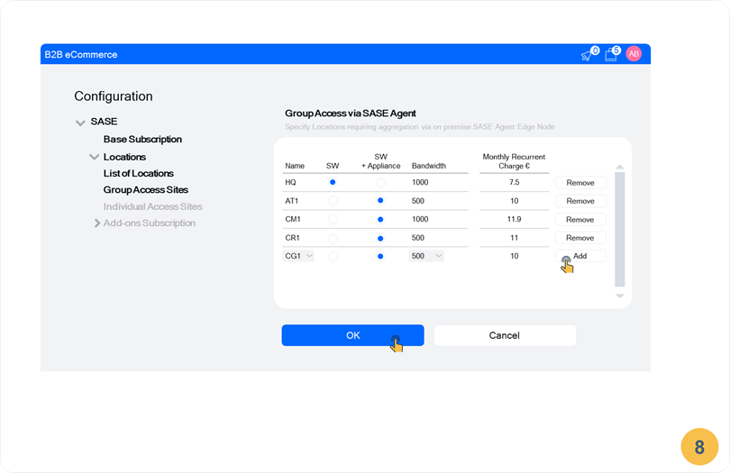
*([text description](media/customer-journey-group-access-mockup.text-description.md))*

9. The system prompts the user to configure access for individual Actors who will be using Actor access connection. The user pick-ups remaining locations from the drop-down list and sets expected consumption bandwidth. The displayed monthly recurrent charge similarly to Group Access configuration depends on selected plan (Silver, Platinum, Gold), Region of location and selected bandwidth. Once user is done he proceeds further.

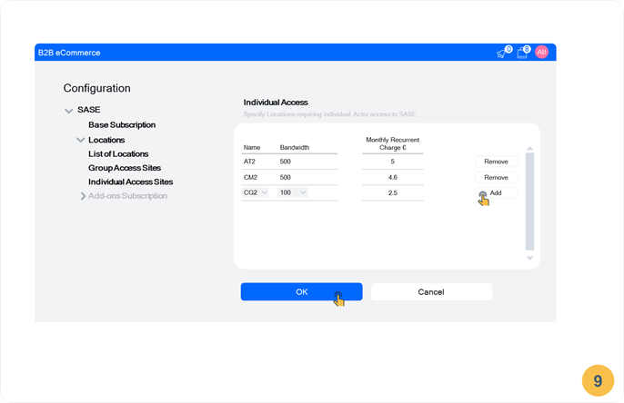
*([text description](media/customer-journey-individual-access-mockup.text-description.md))*

10. Next Add-ons subscriptions are started to be configured. Corporate ZTNA is configured as mandatory with no additional fee and will be provided to all Actors of the Customer. Cloud Apps ZTNA is an optional capability and can be selected for up to total number of Actors specified by the user (35).

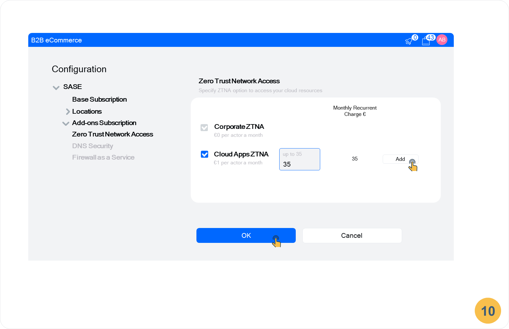
*([text description](media/customer-journey-ztna-addon-mockup.text-description.md))*

11. DNS security is a pre-selected option provided to all Actors. The displayed monthly recurrent charge corresponds to the price plan selected by the user (Gold)

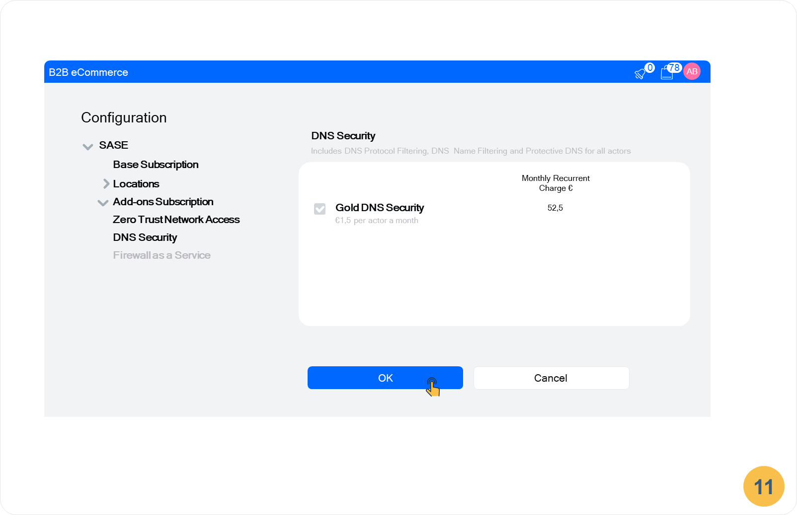
*([text description](media/customer-journey-dns-security-mockup.text-description.md))*

12. Firewall as a Service is a selectable option and can be taken for various number of Actors (up to the total number of Actors of the customer). The user may see the charging fees per plan. User decides to go with 15 Actors that correspond to a Silver price plan of FWaaS.

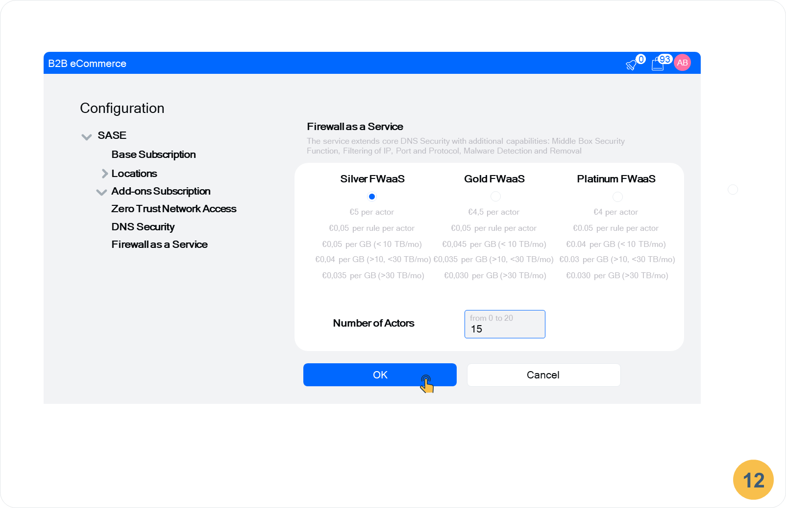
*([text description](media/customer-journey-fwaas-mockup.text-description.md))*

13. Once the last Add-on has been configured the system prompts the user to review the configuration before it will be submitted for a qualification checks and approval. The user reviews and submits the configuration. The system performs validations, qualification and approval. 

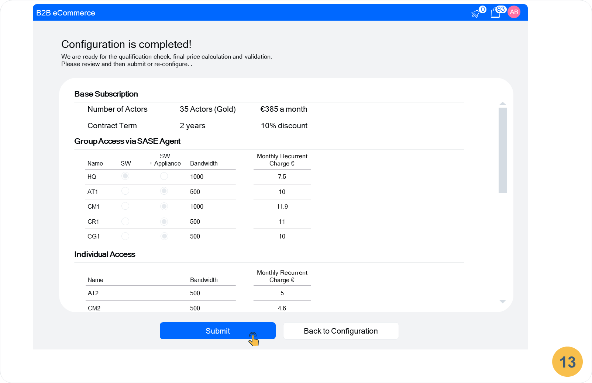
*([text description](media/customer-journey-review-configuration-mockup.text-description.md))*

14. Once approval is done the system display the approved quote with a final price and information about discount. The user reviews the quote and accepts it for the order.

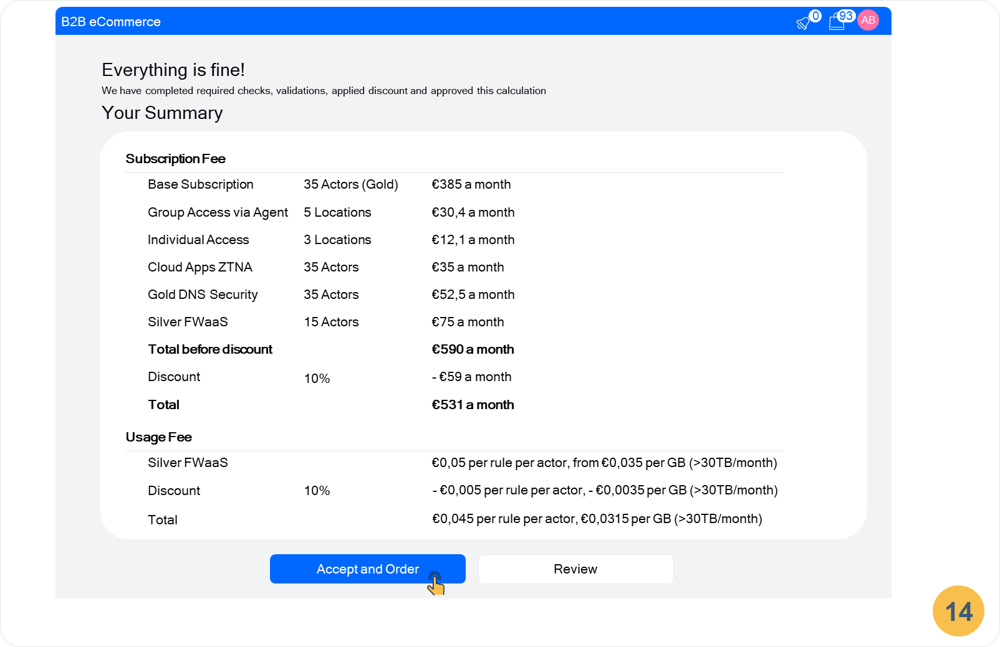
*([text description](media/customer-journey-final-quote-mockup.text-description.md))*

# Information View

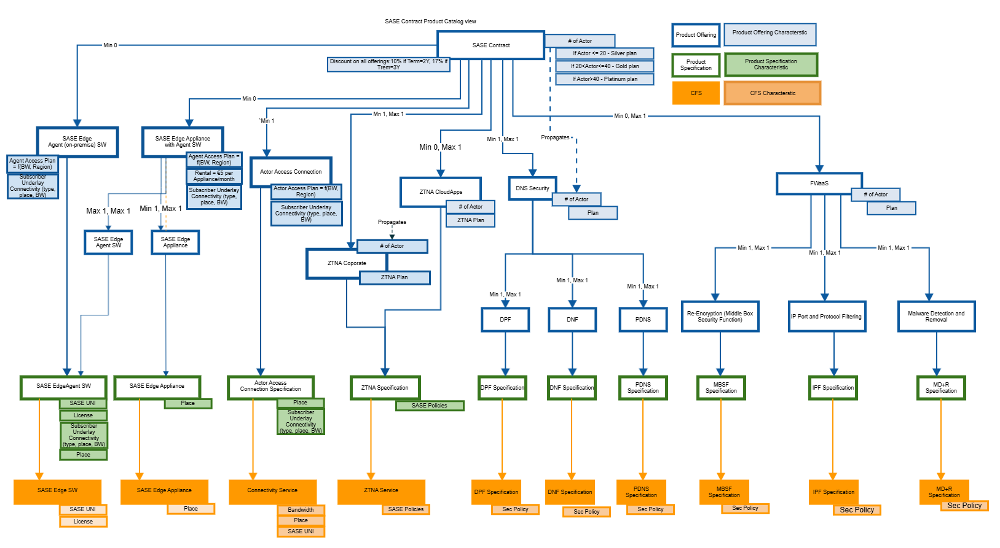
*([PlantUML source](media/sase-contract-catalog-view.puml))*

SASE is a strongly identity centric service. All Actors (User, Application, Device) must be identified, authenticated and authorized to access and use SASE according to their roles and permissions (for more details refer to [MEF 118 MEF 118.1 Zero Trust Framework for MEF Services](https://www.mef.net/resources/mef-118-1-zero-trust-framework-for-mef-services/)).  SASE provides access to digital resources in a digital realm and Actors' Identities are Digital Identities.

It is required that each Actor (based on the number of Actor selected) is provisioned accordingly. It includes creation and/or assignment of Identities, Roles and Permissions to use SASE products.

It is to be done during the “SASE order” delivery phase. Given use case covers Order Capture phase, so this is out of scope and, therefore, Product Catalog view does not include Actor related entities. 

Following documents can be referred to study possible relationship of Actor (Application, Device, User) to “SASE Product Inventory”, “Logical Resource”, “Digital Identity”. “Party Roles and Permissions” and "Party".

- [TMF 931 Open Gateway Onboarding and Ordering Component Suite](https://www.tmforum.org/oda/open-apis/directory/open-gateway-onboarding-and-ordering-component-suite-TMF931). The case has the similar conditions. Please refer to "Entities modelling" in the Introduction section. There Digital Identity is being utilized to identify Application (Logical Resource). Digital Identity is being created by result of approval of Application on-boarding (approval of APIs usage by the Application)

- Information Framework [Figure LR.01 - Logical Resource ABE Related Entities](https://www.tmforum.org/MODA/EARoot/EA4/EA2/EA6/EA3/EA3/EA2571.htm). Actor-Application and Actor-Device could be represented as Logical Resource having a Logical Resource Role of Product User of a SASE child products. These logical resources could be owned by Party Role engaged by one of the Party of SASE Subscriber (organization representative).

- [TMFS001: Use Case: New Party – Create your account](https://projects.tmforum.org/wiki/pages/viewpage.action?pageId=305609151) for creation of Actor-User Party. It could be considered as one of the possibility for creation of Actor-User Party having Digital Identity. Actor-User could be represented as Party having a role of Product User of a SASE child products.

# Price plans

1. Actors

|   | Silver | Gold | Platinum |
| --- | --- | --- | --- |
| Actor | €12 /mo per actor | €11 /mo per actor | €9 /mo per actor |
|   |   |   |   |
| FWaaS | Max (70 €/month; 5 €/month*number of actors) | Max (140 €/month; 4.5 €/month*number of actors) | Max (240 €/month; 4 €/month*number of actors) |
|   | €0.05 per Rule/month per actor | €0.05 per Rule/month per actor | €0.05 per Rule/month per actor |
|   | €0.05 per GB (< 10 TB/mo) | €0.045 per GB (< 10 TB/mo) | €0.04 per GB (< 10 TB/mo) |
|   | €0.04 per GB (>10, <30 TB/mo) | €0.035 per GB (>10, <30 TB/mo) | €0.030 per GB (>10, <30 TB/mo) |
|   | €0.035 per GB (>30 TB/mo) | €0.030 per GB (>30 TB/mo) | €0.030 per GB (>30 TB/mo) |
|   |   |   |   |
| DNS Security | Max (20; 2 €/month*number of actors) | Max (45; 1.5 €/month*number of actors) | 1 €/month*number of actors |
|   | €0.70 per 1 mln queries (if > 3 mln q/mo) | €0.60 per 1 mln queries (if > 6 mln q/mo) | €0.50 per 1 mln queries (if > 9 mln q/mo) |

2. ZTNA Plan

| ZTNA Corporate | €0 per Actor/month |
| --- | --- |
| ZTNA Cloud Apps | €1 per Actor/month |

3. Actor Access Connection Plan

| Region 1 | Region 2 | Region 3 |
| --- | --- | --- |
| BW 100 Mbit/s: €3 per Actor/month | BW 100 Mbit/s: €2.5 per Actor/month | BW 100 Mbit/s: €2.3 per Actor/month |
| BW 500 Mbit/s: €6 per Actor/month | BW 500 Mbit/s: €5 per Actor/month | BW 500 Mbit/s: €4.6 per Actor/month |
| BW 1000 Mbit/s: €9 per Actor/month | BW 1000 Mbit/s: €7.5 per Actor/month | BW 1000 Mbit/s: €6.9 per Actor/month |

4. SASE Agent Access Plan

| Region 1 | Region 2 | Region 3 |
| --- | --- | --- |
| BW 500 Mbit/s: €6 per Agent/month | BW 500 Mbit/s: €5 per Agent/month | BW 500 Mbit/s: €4.6 per Agent/month |
| BW 1000 Mbit/s: €9 per Agent/month | BW 1000 Mbit/s: €7.5 per Agent/month | BW 1000 Mbit/s: €6.9 per Agent/month |

# Sequence diagrams

**Generic note:**

Engagement Management is responsible for specific graphical user interface journey, proper transformation of user entered information into requests to back-end system (SoR, System of Resources) as well as respective backward requests transformation from the back-end system for user to provide some input or make a selection out list of options. 

Back-end system may provide in a single response a complex set of information containing a long list of selections and possible configuration actions. Engagement Management is driving the GUI journey and configuration sequence based on the inputs provided by the back-end system. GUI can present the configuration per region or as whole, but the details are left for implementation (exact GUI journey is implementation dependent)

The Party Interaction component being a part of back end system in general serves as an anchor for user initiated activities. Depending on the procedure chosen by the user it can delegate that procedure fulfillment to the other component in the back-end system. Engagement Management is assumed mostly to contact Party Interaction first for the back-end system to track and store the last user activity. Engagement Management can also directly access back-end system if managed resources are not required to be created, i.e. it can query some data or trigger task execution.

## Sequence Diagram #1 (User Logs In; User Data and Role are obtained)

User is interested in SASE and decides to configure the quote to place the order. He accesses the CSP quotation e-commerce portal. As further responses need to be tailored by specific policies depending on the user the system first needs to collect user data. The system has not yet identified the customer and starts the procedure of user authentication and its role and data. 

Upon user request to access quotation page Engagement Management generates a request to Party Interaction that triggers Quote Page process. 
Party Interaction requests in return to provide selection of possible action. In order to proceed further with accessing a quote page user needs to identify himself.
Once that choice is provided back to Party Interaction it delegates the process of user identification to the Digital Identity component and requests it to provide back the result once all information is obtained.
Digital Identity first starts check credential task for which it queries user credentials. For that it informs Party Interaction including its task id that needs it. Party Interaction forwards this request (responses) to Engagement Management providing task id of Digital Identity. User enters its credentials, Digital Identity check them and collects Party and Role information from Party Management and Party Roles and Permissions Management components based on the retrieved digital identity data.

Digital Identity reports back to Party Interaction collected information.
As user identified Party Interaction triggers the next task prompting user to select main offering to configure. The selection options as well as user data are sent to Engagement Management.

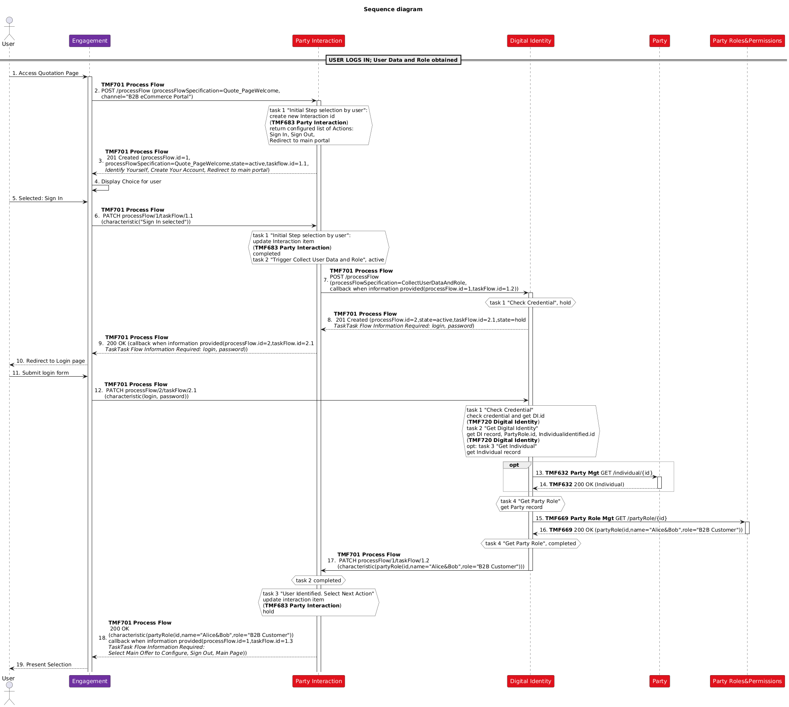
*([PlantUML source](media/user-login-role-sequence.puml))*

## Sequence Diagram #2 (User sets remaining eligibility parameters, views presented eligible offerings)

User decides to proceed with selection of the main offering to configure.

User is assumed to see only intended offerings with intended price. For that Engagement Management first gets list of product categories from Product Catalog. Having the knowledge of the request channel (B2B) and user data including party role (B2B customer) it picks-up offerings of proper category (B2B offerings). Additionally as it also impact offering availability and price it prompts the user to provide desired country and regions.

Once user sets these data, Engagement Management triggers the process of collecting eligible offerings by calling Product Configurator. Engagement Management provides all necessary eligibility parameters for Product Configurator to build a filtered list of relevant offerings with relevant pricing and availability. These parameters include Party id, Party Role, product category (B2B offerings), Country and List of Regions.
Based on that parameters Product Configurator collects information from Product Catalog, constructs list of eligible offerings and returns it back to Engagement Management. "SASE Contract" appears to be in the list of these offerings

Having this list, Engagement Management present these offerings for the user

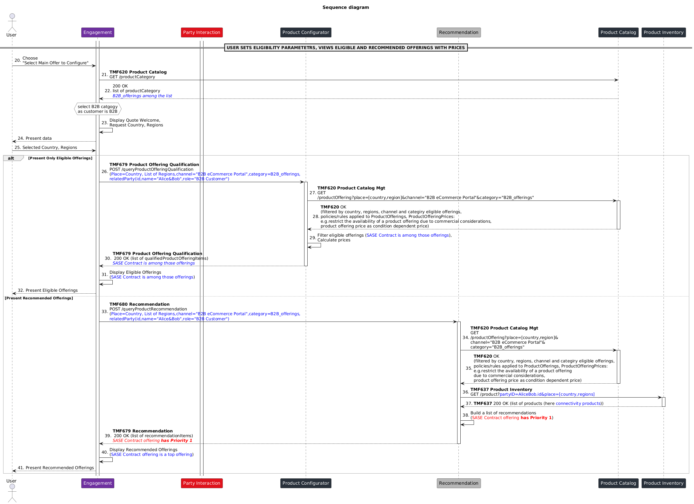
*([PlantUML source](media/eligibility-offerings-sequence.puml))*

##  Sequence Diagram #3 (Quote Configuration. Quote Items computation)

User pick ups "SASE Contract" offering to configure.

Engagement Management updates Party Interaction with the user made choice (Configure "SASE Contract")

Party Interaction triggers Quote configuration task and delegates it to Product Order Capture and Validation. Party Interaction provides Product Order Capture and Validation with all collected so far details about the user. With this delegation request Party Interaction also asks Product Order Capture and Validation to provide back configured quote once it is completed.

Product Order Capture and Validation initializes the quote by creating initial quote item (partially configured root item "SASE Contract"). 

In order to build the configuration it requests Product Configurator with id of "SASE Contract" and provides information about user set Country and Regions.

Product Configurator obtains information from Product Catalog, identifies possible product dependencies, identifies that there are location dependent offerings that may rely on existing Underlay Connectivity and requests Product Inventory of existing customer products of Underlay Connectivity.

In return it gets a list of existing products and their references of locations. Next it resolves site names and addresses at Location Management, builds configuration (parameters to set) and a list of child offerings to display for selection. Then it also starts preparation of each child offering configuration (parameters to set, locations to chose from or specify desired location).

In result Product Configurator constructs a configuration that includes all allowed actions, possible selections and parameters to be set for root and all child offerings of "SASE Contract". That configuration is returned back to Product Order Capture and Validation that directs it to the Party Interaction indicating task id that is on hold as additional information is required. 

Party Interaction forwards this request (responses) to Engagement Management providing as well task id of Product Order Capture and Validation for Engagement Management to respond back directly to Product Order Capture and Validation.

Engagement Management build GUI representation to collect all required choices and settings from the user.

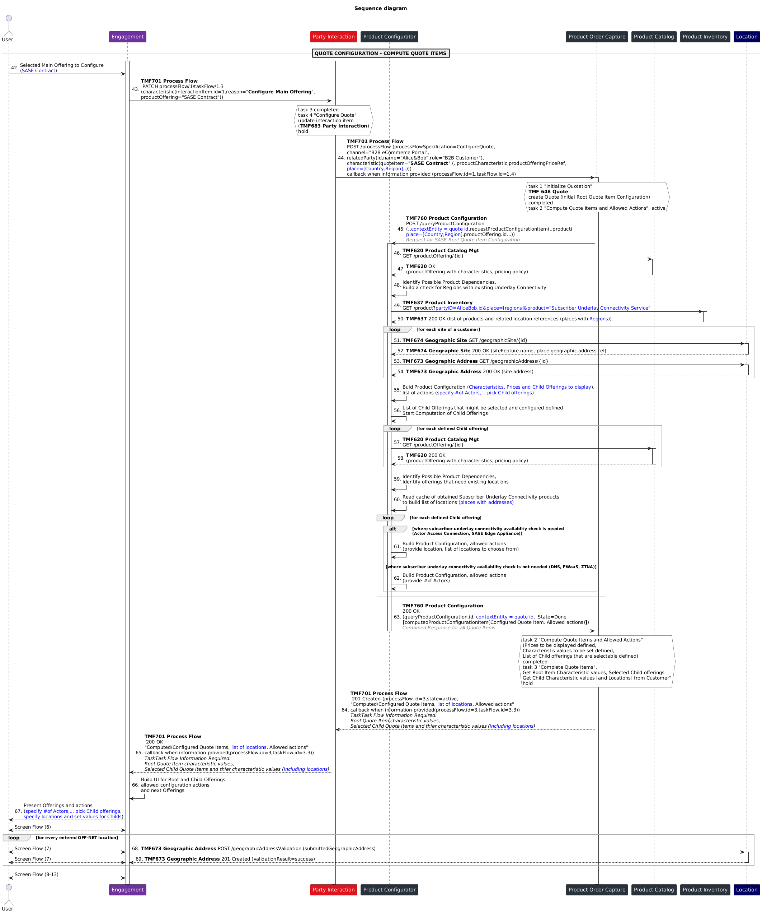
*([PlantUML source](media/quote-configuration-computation-sequence.puml))*

## Sequence Diagram #4 (Quote Configuration. Complete Configuration and Accept)

User makes all required selections, sets required parameters sequentially from root and all selected child offerings.

Engagement Management updates Product Order Capture and Validation with these data.

Product Order Capture and Validation requests Product Configurator to configure the quote. It provides information about all made choices and set parameters.

Product Configurator computes configuration for all quote items applying specified user inputs. For those location specific items where the user provided data for OFF-NET Subscriber Underlay Connectivity, Product Configurator validates address data with Location management and returns it back to Product Order Capture and Validation.

Product Order Capture and Validation requests Service Qualification to check if selected ON-NET Subscriber Underlay Connectivity is available to deliver the service. 

Product Order Capture and Validation updates the Quote and triggers to Product Configurator resulted quote configuration check. Product Configurator performs the check and returns result to Product Order Capture and Validation.

Product Order Capture and Validation updates the Quote with the state "Approved" and requests Engagement Management for user to accept the quote.

User Accepts the Quote, Product Order Capture and Validation updates the Quote with the state "Accepted" and responses back to Party Interaction with the fully configured Quote.

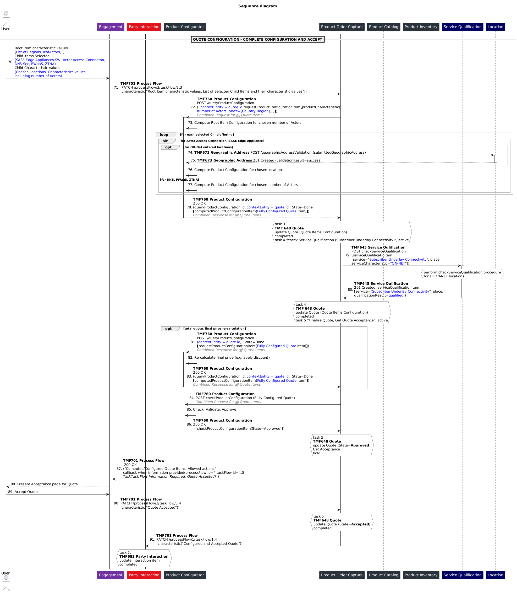
*([PlantUML source](media/quote-configuration-complete-accept-sequence.puml))*

# Conclusion

## Lessons learned

### Product Configuration. Persistent but not only temporary

There is scope to enhance

- Product Configurator functional capabilities by allowing persistent product configurations that would evolve during the process of configuration. Evolving implies modification. Currently, this scenario is not covered in TMF760 Product Configuration Management API User Guide. In case modification is required the API client needs to keep full context of partially configured product configuration and create a new product configuration in Product Configurator. In case API client does not anchor all customer channels it would disrupt user experience. Also, passing a full context of partially configured product configuration in a payload of API calls from API client to Product Configurator will not be efficient.

- Product Configuration API by allowing PATCH operation on QueryProductConfiguration entity resource. Currently, PATCH operation is missing. Considering there could be multiple iterations steps to configure the product, passing entire product configuration in a payload of API calls from API client to Product Configurator will not be efficient.

Also, TMFC027 Product Configurator is stated to cover 1.2.5.2. Manage Product Configuration Business Process. 1.2.5.2. Manage Product Configuration includes as well 1.2.5.2.4 Change Product Configuration which includes Add/**Modify (altering or amending existing product configuration object**)/Delete Configuration object.

Besides, in TMFS003 it was also noted: "it should be possible to store a product configured in a ProductOrder or a ShoppingCart any time during the order process. It should be possible to store a product with a valid or invalid configuration (with appropriate status on the cart item or order item), so that end user can save their work and return it as and when required."

Note:

Refer the Jira AP-5293 for the Persistent QueryProductConfiguration resource.

### Party Interaction role in Process Flow

Party Interaction Management in the current state is assumed to not only record the party interactions but also define during that interactions the journey (Welcome ProcessFlow in TMFS001: "Frontend asks the Process Flow API which task needs to be performed by the next step of the process", Welcome ProcessFlow in TMFS003: "ProductOrderCaptureValidation component process is completed and a new welcome process is launched to support follow up interaction with the user"). Currently that "journey" responsibility is not explicitly defined for TMFC023 Party Interaction: "This will typically be the first component in a party/individual experience journey"

Therefore, it needs enhancement. One possibility is to split journey and interactions responsibilities between two different components. The other possibility is to strictly define the scope of Party Interaction management to clarify that it is covering both the party interaction and journey management.

Also, there is a need for differentiating between the journey and interaction. The single interaction might have multiple journeys within it.

### Managing several ProcessFlows from end-to-end context

Dependencies between processes cannot be resolved without knowledge of the E2E context. Currently provided illustrative use cases (TMF701 Process Flow API User Guide, TMFS001) do not clearly answer how handover from 2nd to 3rd and from 3rd to 4th ProcessFlow could happen. 

An end-to-end business objective is achieved by a consistent end-to-end journey presuming stitching of several ProcessFlows. Back-to-back dependencies at each ProcessFlows cannot address the end-to-end context. Also, with the time, it might become complex and unmanageable. 

Therefore, there is need for to drive end-to-end process and control back-to-back handover between specific process flows. It may rely on a Central Catalog where these back-to-back rules (high-level, not detailed) can be managed. Central catalog approach will also help in de risking the possibility of loops and duplication of calls from end-to-end context. The risk of loops and duplication might happen in case a context specific and important for a taking over ProcessFlow is lost or not supported by handing over ProcessFlow or earlier run ProcessFlows. For instance, the logic of a ProcessFlow running in Core Commerce ODA Function Block may call sub-ProcessFlow in Production Management or Party Management ODA Block to perform a check or validation. The next ProcessFlow may presume performing the same checks or validations. However, if proper context is not passed to the next ProcessFlow, it may call the same sub-process for the same purpose. Whereas end-to-end control allows to trigger ProcessFlows with a proper context based on the awareness of the purpose of each ProcessFlow business objective.

### ProcessFlow API and delegation

Callbacks

In the current approach, “Callback” in ProcessFlow API is achieved through PATCH Operation in the TaskFlow resource. This is widely used in TMFS001 and TMFS003 use cases. The resource model neither in TMF 701 Process Flow v4.0.0 nor in a draft TMF 701 Process Flow v5.0.0 does not explicitly support that mechanism. The v5.0.0 does include relatedProcessFlow resource, but its model is still not specific enough for the “callback” information.

The returned "Callback" contains TaskFlow resource URI of a task expecting the result - “PATCH /processFlow/{processFlowId}/taskFlow/{id}”. Based on this, client has to create the URI to call the PATCH operation where processFlowId and “id” of the task flow are variables.

While this approach works, it will be good to define a specific resource in the response with the details of the “callback”. There is also a possibility to provide the URI as link implemented for Monitor pattern as mentioned in chapter 2 of API guideline. 

Process/Task Handler

When delegating a specific ProcessFlow it is not clear based on what criteria delegating ODA component would select delegable ODA component to run delegated ProcessFlow. The information resource model neither in TMF 701 Process Flow v4.0.0 nor in a draft TMF 701 Process Flow v5.0.0 does not clarify that.

To address that issue probably it make sense to introduce Process (and maybe Task) Handler (or Owner) role attribute or, alternatively, Process/Task Context Specialization attribute to allow capable function to takeover process/task execution.

As each ODA Function Block (Party, Core Commerce, Production) is a group of functions aimed to support purpose focused business processes, that kind of specialization could be relevant and useful.

TaskFlow value

Also, current diagram presumes 201 response would also contain information request about next selected action. However, as per existing TMF 701 Process Flow API specification (v4.0.0) that type of information is expected to be a content of a specific task (taskFlow1.1 in given case). Existing model of API presumes only taskFlow references are kept at processFlow resource level but not values of related taskFlow attributes (in v5.0.0 values of Tasks can also be included). As a workaround "characteristic" attribute of processFlow is assumed until API is improved.

### Support for Task resource APIs

In the current state TaskFlow PATCH supports only PATCH / 200 OK synchronous operations. The suggestion is to enhance the API to support 201 for async operation too.

TMF630 API Design Guidelines tell a task operation MUST return a 200 OK if successful and the full representation or a 204 No content otherwise. There are deviations from that guideline in a some of the APIs.

E.g. in TMF 679 Product Offering Qualification you may find “If the indicator [InstantSyncQualification] is true then the response code of 200 indicates the operation is successful otherwise a task is created with a response 201”.

In TMF 673 Geographic Address Validation, Geographic Address Validation resource is a task and has respective states (TaskStateType: inProgress, terminatedWithError, done) but querying Address Validation presumes 201 but not 200 response. A direct call is from BFF/Engagement Management is shown in sequence diagram. However, as per IG1167 ODA Functional Architecture Exploratory Report, Engagement Management is not supposed to create a resource, which is supposed to happen in case of 201 response.

There is a need to specify explicitly that Geographic Address Validation is a task resource

## Impacts identified

