# Executive Summary

This document outlines a standardized approach to wholesale broadband, focusing on access network services—particularly Fiber to the Home (FTTH)—where telecommunications providers sell network access to retail service providers who then serve end customers.

The industry is undergoing significant change, driven by increased fiber infrastructure investment and regulatory pressure to enable open access to networks. This shift is transforming traditional incumbent-led models into more competitive, multi-provider ecosystems, requiring clearer standardization of wholesale relationships, processes, and interfaces.

The use case aims to demonstrate how wholesale broadband scenarios can be implemented using TM Forum’s Open Digital Architecture (ODA), supported by standard Open APIs and modular components. It addresses both wholesale providers and retail partners, helping them understand onboarding, product modelling, and operational integration required to establish scalable and automated partnerships.

The scope focuses on Level 2 Bitstream services and defines the interaction model between wholesale (Seller) and retail (Buyer) CSPs. A key architectural principle is the separation of their respective systems, enabled through dedicated Buyer and Seller Gateways that standardize communication using TMF Open APIs and TMF Open API .

Ultimately, this work provides a foundation for industry-wide standardization, enabling interoperable, cost-effective solutions and accelerating the adoption of open wholesale broadband ecosystems.

# Introduction

Wholesale broadband refers to the sale of broadband services or network access by a telecommunications company, internet service provider (ISP), or network operator to other businesses, ISPs, or resellers. These resellers or smaller ISPs, in turn, offer broadband services to end customers, such as residential users, businesses, or organizations.

Telecommunication networks are typically divided in a hierarchical model.

- Core Networks: Act as the backbone of the entire telecommunications infrastructure, connecting metro networks and providing high-speed, high-capacity data transmission over long distances with technologies like UDWDM and OTN.

- Metro Networks: Serve metropolitan or regional areas, connecting access networks to core networks. They handle high-capacity data transport within cities using technologies like Metro Ethernet and DWDM. Serve as a bridge between access and core networks, providing high-capacity, low-latency connections within metropolitan areas.

- Access Networks: Focus on connecting individual users to the network, using technologies that are suitable for shorter distances and lower capacities. Access networks differ for fixed and mobile services

Wholesale does exist in all 3 of these networks. This use case however concentrates on the wholesale / wholebuy of relationships in the access networks for fixed line services.

The primary function of access networks is to connect end-users (residential, business, or mobile users) to the broader telecommunications network. They provide the "last mile" connectivity between the customer and the service provider’s network. Access networks typically cover smaller geographic areas, such as neighborhoods, buildings, or campuses. They are designed to reach individual users directly.

Common technologies used in access networks include:

- DSL (Digital Subscriber Line)

- Fiber to the Home (FTTH)

- Cable Modem

- Fixed Wireless

- Mobile networks (e.g., 4G, 5G)

- Wi-Fi in residential or business environments

Mobile Networks and Wi-Fi are not in the scope of this use case. Wholesale Broadband could apply to all the remaining technologies, although the focus will be mainly on FTTH.

Access networks are often tree or star-topology based, where multiple endpoints (users) are connected to a central point (like a local exchange or a street cabinet). Access networks generally have lower bandwidth capacities compared to metro networks, as they are tailored to individual or small group usage rather than bulk data transport.

## Context or Background

Contrary to Core Networks and Metro Networks, Access Networks have historically been owned by incumbents that build most of the copper infrastructure when they were still government monopolies. Due to this historic context, regulators have defined country specific business models and APIs for this domain. The context is changing heavily in the sense that many more newer players are building fiber infrastructure. Access infrastructures are often subsidized. To avoid over-construction in some (urban) areas and under-construction in other (rural) areas, regulators are now more interested in regulating open access to this subsidized infrastructure. There are two major business models for providing open access. Most regulators seem to focus on the relationship between Wholesale CSP and Retail CSP.

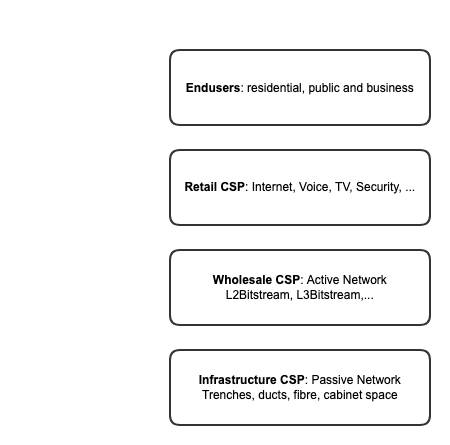

*([text description](media/business-model-layers-diagram.text-description.md))*

The workgroup wholesale broadband aims to provide standardization for this use case using TM Forum ODA assets.

Many of the current assets of the TM-Forum are really focused on the internal IT of the CSP. Using these standards like openAPI to integrate 3rd parties opens its own challenges that need to be looked at.

## Objective of the use case

The goal of the Use Case is to show how a complex scenario like wholesale broadband can be built using the features of the ODA functional architecture, supported by ODA components and Open APIs.

The audience for this use case is enterprise architects, product managers at both wholesaler and partner to understand the requirements for both parties.

- As a wholesaler, I need to understand the onboarding process so that I can build a solution for the onboarding of new partners

- As a wholesaler, I need to understand the components of the product model so that I can create profitable offers for partners

- As a wholesaler, I need to understand the operational processes so that I can automate the solution

- As a Buyer, I need to understand the onboarding process so that I can build a solution for the onboarding of new partners

- As a Buyer I need to understand the components of the product model so that I understand how that integrates with my retail product portfolio

- As a Buyer I need to understand the operational processes so that I can integrate the wholebuy process with my internal operational processes

It is important that this use case is defined as an international guideline for relationships between wholesalers and wholebuyers so that solution providers can provide affordable standardized solutions that benefit the whole industry.

## Scope and assumptions

### Scope

This use case focuses on the network interconnection and operational processes between a wholesale CSP (the Seller) and a Retail CSP (the Buyer) for L2-Bitstream products.

The roadmap begins with defining the current scope in detail, ensuring both the Seller and Buyer clearly understand their roles and responsibilities. Future releases of this document will expand the scope to include L3-Bitstream and L1-Access-Line products.

### Assumptions

The Buyer and Seller will each utilize their own ODA implementation, prohibiting direct communication between their respective ecosystems. To facilitate this, two new platforms are introduced: a Buyer Gateway and a Seller Gateway. The Buyer Gateway integrates with the Buyer's ODA using standard TMF OpenAPI interfaces and communicates with the Seller Gateway via a Specialized Open API tailored to this use case. Similarly, the Seller Gateway integrates with the Seller's ODA using standard TMF OpenAPI interfaces.

# Description

This document describes three key stages essential for enabling and managing Wholesale Broadband services in a B2B2X environment:

- **Operational Stage – Product Order Journey & Product Offering Qualification Journey**: Covers the full lifecycle from product eligibility to service provisioning and in-life operations.

- **Network Interconnection Stage**: Focuses on automating ENNI setup between Seller and Buyer networks for secure and scalable service delivery.

- **Onboarding Phase**: Establishes a repeatable process for partner integration, enabling rapid service co-creation and orchestration.

## Onboarding phase

The **Onboarding Stage** for B2B2X (Business-to-Business-to-Consumer/Enterprise) focuses on establishing a streamlined, scalable process to integrate partners into a digital ecosystem, enabling the rapid deployment of multi-party services. This phase involves defining partnership types, roles, and agreements, and leverages TM Forum’s Open APIs and frameworks—such as the **Ecosystem Playbook**—to ensure interoperability and automation.

Key activities include:

- Partner registration and validation

- Integration of service catalogs

- Co-creation of bundled offerings

- Establishment of secure, zero-touch orchestration for seamless service activation

The scope of this stage emphasizes:

- Reducing time-to-market

- Enhancing trust through governance and compliance

- Simplifying complex billing and settlement processes

Ultimately, this enables CSPs and partners to efficiently deliver innovative, industry-specific solutions.

This stage is the scope of a separate document [TMFS019: Use Case: Partner On-boarding with Agreement Management](https://projects.tmforum.org/wiki/display/ETEO/TMFS019%3A+Use+Case%3A+Partner+On-boarding+with+Agreement+Management) and is not elaborated as part of this document.

## Network Interconnection Stage

The **Network Interconnection Stage** for B2B2X, with a focus on **External Network-to-Network Interface (ENNI) ordering**, is centered on automating and streamlining the establishment of standardized, interoperable connections between the Seller’s and Buyer’s networks. This stage is critical for enabling seamless service delivery across organizational boundaries.

Leveraging industry standards such as **TM Forum’s Open APIs** (e.g., TMF622 for product ordering) and **Mplify** **Lifecycle Service Orchestration (LSO)** framework, this phase includes:

- Defining ENNI specifications (e.g., bandwidth, latency, QoS) within partnership agreements

- Initiating automated ENNI order requests

- Validating compatibility through service qualification

- Orchestrating provisioning across multi-domain networks

The scope emphasizes:

- **Zero-touch automation**

- **Real-time order tracking**

- **Compliance with MEF standards**

These capabilities ensure secure, scalable, and rapid deployment of ENNI connections with minimal manual intervention, supporting efficient B2B2X service delivery.

## Operational Stage – Product Order Journey & Product Offering Qualification Journey

The **Operational Stage** represents the **main product order journey** for Wholesale Broadband services, encompassing the full lifecycle from initial provisioning to in-life service changes and issue resolution. It ensures that services are delivered, modified, and maintained efficiently, with a focus on automation, accuracy, and customer-centricity.

### Product Offering Qualification Journey

The **Product Offering Qualification Journey** is the foundational step that informs and enables the **Product Ordering **process. It ensures that the Buyer understands which wholesale products are eligible for their customers, based on specific criteria such as location and network capabilities.

Key activities include:

- **Eligibility Check**

- The Buyer provides location details (e.g., address, postal code)

- The Seller assesses service availability based on access technology, network coverage, and infrastructure capabilities

- **Understanding Available Products**

- A standardized product model is used to identify accessible broadband products

- Ensures consistency and simplifies product selection

- **Product Offering List**

- The Seller returns a list of eligible wholesale products or product offerings for the specified location

- Includes options such as Wholesale Broadband Access Lines, Broadband Profiles, Transport Configurations, and ENNI Options

- **Product Selection Preparation**

- The Buyer reviews the qualified products

- Selects those that align with customer needs and business requirements

This journey reduces errors, streamlines product selection, and ensures alignment with both technical and business objectives. It empowers the Buyer to make informed, data-driven decisions that meet customer demands while adhering to the Seller’s capabilities.

### Product Ordering Journey

The **Product Ordering Journey** builds upon the outcomes of the **Product Offering Qualification Journey**, transitioning from identifying eligible products to placing orders for the required components. It ensures all necessary elements are in place to establish seamless connectivity between the Customer Premises and the Buyer's Network.

The ordering process is divided into two main categories:

- **Foundational Infrastructure Orders**

- Covers the core physical and logical infrastructure required

- **Customer-Specific Configuration Orders**

- Addresses tailored configurations based on individual customer needs

Key components of the ordering process include:

- **Address Validation and Selection**

- Supports pre-shared address lists, real-time integration, and use of a common registry

- **Product Order Execution**

- Initiates provisioning of new broadband connections or service modifications

- Follows a standardized, automated process for consistency and traceability

- **In-Life Service Operations**

- **Upgrade/Downgrade**: Supports POQ and ordering for bandwidth or service changes

- **ISP Migration (Access Takeover)**: Includes qualification, approval, and order handling

- **Order Management**: Enables cancellation, change of installation date, and other adjustments

- **Problem Handling**

- Trouble ticket creation and resolution

- Optional appointment scheduling and ticket cancellation workflows

This comprehensive and standardized journey ensures a consistent, automated, and customer-centric experience across the entire service lifecycle.

# Information View 

## Products Understanding 

Standardizing the FTTH value chain within wholesale broadband requires looking at the network diagram and then identifying the equipment, components, products and services affected. A typical wholesale broadband network for FTTH, along with equipment and responsibilities can be seen in the diagram below. Also illustrated are the key Wholesale Broadband product elements.

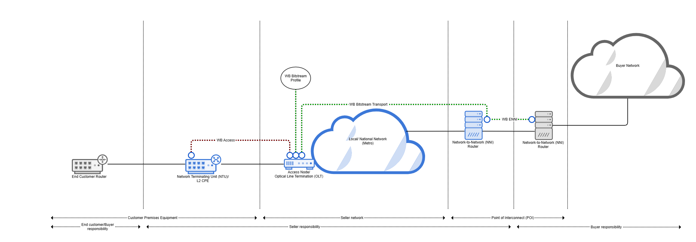

*([text description](media/wholesale-broadband-network-topology-diagram.text-description.md))*

Figure 1: High Level Design for Level 2 Bitstream Products

##  Wholesale Broadband Product Element Model

### Network Elements of a Broadband Network

To connect the Customer Premises to the Buyer's Network, the following elements are traversed from left to right:

- Wholesale Broadband Access:
Provides the physical connection using a specific access technology, such as FTTC, FTTB, FTTP, ADSL, or VDSL, from the customer premises to the access node. 

- Wholesale Broadband Bitstream Profile:
Defines the logical and service attributes of the access line, specifying how it connects to the Metro Network. This includes bandwidth, (UNI) VLAN tagging, and authentication methods, ensuring efficient network integration.

- Wholesale Broadband Bitstream Transport:
Wholesale Broadband Bitstream Transport establishes the data path between the Wholesale Broadband Bitstream Profile and the Wholesale Broadband External Network-to-Network Interface (ENNI). 

- Wholesale Broadband ENNI:
Acts as the interconnection point between the networks of the Seller and the Buyer, facilitating seamless communication and data exchange across the two networks.
It is important to note that the ENNI product is ordered separately and must be provisioned prior to placing broadband orders. While some Sellers have the provisioning already in place for their clients, others require the ENNI to be ordered explicitly.
The two normal types of ENNIs are:

- Shared Transport: Typically used in B2C scenarios, allowing multiple profiles to share the same transport path on an access node.

- Dedicated Transport: Typically used in B2B scenarios, providing a dedicated transport path for a single Wholesale Broadband Profile.

This structured architecture ensures efficient and scalable connectivity between the customer premises and the Buyer network, enabling diverse use cases for both residential and business customers.

### Core Wholesale Broadband Products

A deep understanding of the Wholesale Broadband (WB) product from both technical and commercial perspectives is essential to arrive at a working model. Key product specifications, attributes, and characteristics were identified and analyzed for each stage of the operational journey. Grouping all fields relevant for wholesale broadband in a single product could result in a proliferation of Product Offerings from a single Seller. After an iterative process the project landed on the following product specifications, linked by relationships.

On top of the ProductSpecifications that are derived from the above network elements, additional ProductSpecifications are required for handling Installation and Service Level.

- Wholesale Broadband ENNI:
Serves as the interconnection point between the networks of the Seller and the Buyer, ensuring seamless communication and data exchange between the two parties.

- Wholesale Broadband Access:
Represents an access line of a specific access technology, such as FTTX, or  DSL, providing the physical connection to the end customer premise.

- Wholesale Broadband Bitstream Profile:
Defines how the access line connects to the metro network, specifying the service parameters and connection attributes necessary for efficient network integration.

- Wholesale Broadband Bitstream Transport:
Establishes the path between the Wholesale Broadband Profile and the Wholesale Broadband ENNI (External Network-Network Interface). This transport can have different configurations:

- Shared Transport: Typically used for most Wholesale Broadband Profiles on a particular Access Node, ideal for B2C services.

- Dedicated Transport: Configured for a specific Wholesale Broadband Profile, usually tailored for B2B services.

- Wholesale Broadband Access Installation:
Covers the physical and technical processes required to install the WB Access Line, including on-site engineering work and activation.

- Wholesale Broadband Additional Work:
Refers to any extra engineering or network configuration tasks that may be needed beyond standard installation processes, ensuring a complete and functional service.

- Wholesale Broadband Care:
Provides ongoing support and assurance services for Wholesale Broadband products, addressing issues such as fault management, maintenance, SLAs and customer care.

These WB product components establish a robust, adaptable product model aligning with technical requirements and business goals, facilitating seamless service delivery and operational efficiency.

**Important Note:** To fulfill an order, it is essential to have at least the Wholesale Broadband Access product in place to define the type of access technology required (e.g., ADSL or Fiber), and the Wholesale Broadband Bitstream Profile product to specify the bandwidth and service parameters needed. These two products form the minimum foundation for any Wholesale Broadband order, ensuring clarity and alignment throughout the fulfillment process.

These WB product elements establish a robust, adaptable product model aligning with technical requirements and business goals, facilitating seamless service delivery and operational efficiency.

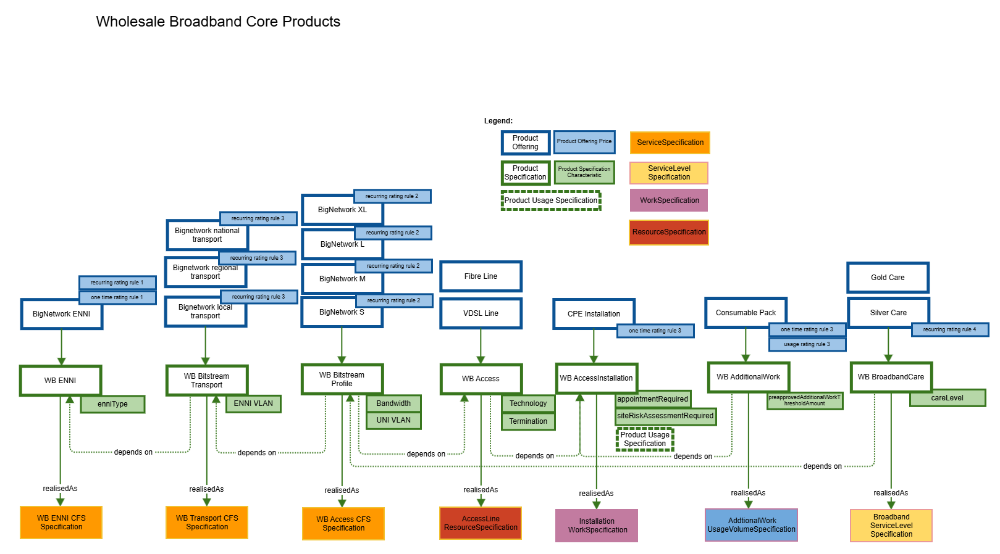

*([PlantUML source](media/wholesale-broadband-core-products-view.puml))*

Figure 2: WholeSale Broadband Core Products 

## Detailed Product Specifications

Note: The fields of the Product Specifications are currently a work in progress and may undergo changes until the final publication of the Wholesale Broadband Specialized Open APIs.

###  Wholesale Broadband Access

The Wholesale Broadband Access Line is an InfrastructureProductSpec. It is realized as the ResourceCollection that defines the path between a physical port in the customer premise and a physical port on the Access Node. The actual details are defined by technology and line termination.

Properties

*([text description](media/wb-access-properties-title.text-description.md))*

 Key Fields of the Wholesale Broadband Access

- Access Technology Configuration: This object represents the configuration of the access technology, specifying the technical and service attributes. The key fields or object included are : 

- Technology: Defines the supported access technology as an enumeration of values such as  ADSL, VDSL, FTTC, FTTB, FTTP.

- Protocol: Specifies the supported protocols as an enumeration of values, including 10G-PON (G.987), GPON (G.984), Higher Speed PON (G.9804), XGS-PON (G.9807), ADSL (G.992), VDSL (G.993).

- Network Termination: This object provides details about the network termination handover point at the customer premises and includes these key fields :

- id: The unique identifier of the network termination handover point.

- portId:Identifies the specific port utilized for the service.

- type: The type of socket or device at the handover point (e.g.,ONT,MDU,Socket).

- handoverConnectorType: The type of physical connector, such as RJ-11, RJ-45, LC, SC, FC, TAE, MMD, E2000.

- model: The model of the network termination device.

- serialNumber: The serial number of the network termination device, which serves as the customer-facing identifier (tag or label). It can either match the system-generated ID or be a unique identifier specific to the device.

- Remote AUCID: Represents the unique identifier of the Access Line, generated by the Access Provider.

- Reverse Powering Required: A boolean field that defines whether the DSLAM requires reverse powering.

- Category: Specifies the category of the product.

- Place: Defines the geographical or physical location associated with this transport product. 

These fields ensure that WB Access is configured and managed efficiently, aligning with technical requirements and service-level expectations to deliver seamless broadband access to end customers.

### Wholesale Broadband Bitstream Profile

The Wholesale Broadband Bitstream Profile is a key component within the wholesale broadband ecosystem, defining the technical and service attributes required to deliver broadband services over an access line. It establishes the configuration that bridges the physical access line and the service layer, ensuring that data transport adheres to agreed specifications and meets performance requirements.

This profile plays a crucial role in configuring and managing broadband services across various customer segments. By specifying how the access line integrates with the metro network and defining key service attributes, it ensures seamless interoperability between Sellers and Buyers. The Wholesale Broadband Bitstream Profile facilitates efficient service delivery, aligns technical configurations with business requirements, and supports scalability to accommodate future growth and evolving demands.

 Properties

*([text description](media/wb-bitstream-profile-properties-title.text-description.md))*

 Key Fields of the Wholesale Broadband Bitstream Profile

- uniVlanTag: Represents the VLAN tagging configuration at the User Network Interface (UNI), defining how traffic is tagged for segmentation and management.

- bandwidth: Defines the bandwidth profile, including committed (CIR) and peak (PIR) rates, to manage data throughput and ensure quality of service.

- authenticationMethod: Specifies the method used for authenticating the buyer (Service Provider) by the access provider, such as PPPoE Intermediate Agent or DHCP Relay Agent.

### Wholesale Broadband Bitstream Transport

The Wholesale Broadband Transport is a product required only when the Broadband ENNI is located on the metro network rather than directly on the Access Node. Different Sellers provide varying configurations: some offer ENNI exclusively on the Access Node, others on the metro network, and some provide both options. Broadband transport can be classified into two types:

- Dedicated Transport is predominantly used in B2B scenarios, dedicated transport ensures a specific path for each service. It is ordered alongside each Wholesale Broadband Access Product and Wholesale Broadband Bitstream Profile to meet the specific needs of the business customer.

- Shared Transport is commonly used in B2C scenarios, shared transport allows for overbooking within the transport network. It is typically ordered in conjunction with the ENNI.

Properties

*([text description](media/wb-transport-properties-title.text-description.md))*

Key Fields of Wholesale Broadband Bitstream Transport

Below are the key fields associated with the transport resource:

- Reach Type: Defines the geographic scope of the transport service (e.g., local, regional, or national).

- Enni Vlan Tag: Represents the VLAN tagging configuration used for the transport.

- vlanTagging: Specifies the VLAN tagging method applied, with supported values including "Single Tagging" and "Double Tagging".

- sTag: Represents the VLAN Service Tag, identifying the outer VLAN in the tagging hierarchy.

- cTag: Represents the VLAN Customer Tag, identifying the inner VLAN assigned to the customer in standard VLAN setups.

- Supporting Resource(Enni): An array of ENNI refs interfaces associated with the transport product. But this could be in the future any other Resource that Seller is giving

- Category: Specifies the category of this transport product.

These fields collectively ensure that the Wholesale Broadband Bitstream Transport resource is configured to meet technical, geographical, and service-specific requirements, enabling efficient and scalable data transfer across networks.

### Wholesale Broadband ENNI

The Wholesale Broadband ENNI (External Network-to-Network Interface) is a critical NetworkProductSpec that serves as the interconnection point between the networks of the Seller and the Buyer, ensuring seamless communication and data exchange between the two parties. This product facilitates interoperability and is a foundational component for delivering wholesale broadband services. The Wholesale Broadband ENNI Product is ideal for various scenarios, including:

- Enabling regional, national, or local interconnections through metro networks.

- Supporting B2C and B2B use cases, integrated with shared or dedicated transport services.

- Facilitating ISP migrations and other wholesale processes requiring a well-defined and reliable interface.

The Wholesale Broadband ENNI Product is essential for enabling efficient, scalable, and reliable interconnectivity, ensuring that Sellers can optimize operations while delivering high-quality services to their partners.

To achieve the high bandwidth requirements the Wholesale Broadband ENNI uses one or more physical links. These are modeled separately as Wholesale Broadband ENNI Link. The Wholesale Broadband ENNI usually combines the bandwidth of these links using ethernet bonding technique.

 Properties

*([text description](media/wb-enni-properties-title.text-description.md))*

 Key Fields of the Wholesale Broadband ENNI Product:

- Interconnection Point: Acts as the gateway between the Seller and Buyer networks, enabling compatibility and smooth communication.

- VLAN Tagging Scheme: Supports single-tagging (C-TAG) and double-tagging (S-TAG for outer and C-TAG for inner VLAN), offering flexibility for traffic management and segregation.

- Number of Links: Defines the number of physical or logical links available for interconnection.

- LACP Support: Includes support for Link Aggregation Control Protocol (LACP) to enhance link reliability and increase throughput.

- Physical Layer Options: Provides flexibility in choosing the physical interface of the ENNI, tailored to service requirements.

- Protection Scheme: Offers redundancy and failover options to ensure service continuity in case of link failures.

- Maximum Frame Size: Supports a maximum frame size of up to 1526 bytes, accommodating Ethernet frames with additional VLAN tags.

- Dark Fibre Support: Allows integration with dark fibre infrastructure where required, for dedicated and high-performance connectivity.

- Product Type: Categorizes the ENNI based on its intended use or configuration to meet specific business needs.

# Sequence diagrams

## Onboarding Stage

The onboarding phase for B2B2X (Business-to-Business-to-Consumer/Enterprise) focuses on establishing a streamlined, scalable process to integrate partners (Wholeseller and Wholebuyer) into a digital ecosystem, enabling rapid deployment of multi-party services. This phase encompasses defining partnership types, roles, and agreements, leveraging TM Forum's Open APIs and frameworks like the Ecosystem Playbook to ensure interoperability and automation. Key activities include partner registration, product catalog integration, co-creation of bundled offerings, and setting up secure, zero-touch orchestration for seamless service activation. The scope emphasizes reducing time-to-market, enhancing trust through governance and compliance, and simplifying complex billing and settlement processes, ultimately enabling CSPs and partners to deliver innovative, industry-specific solutions efficiently.

This stage is the scope of a separate document [TMFS019: Use Case: Partner On-boarding with Agreement Management](https://projects.tmforum.org/wiki/display/ETEO/TMFS019%3A+Use+Case%3A+Partner+On-boarding+with+Agreement+Management) and is not elaborated as part of this document.

## Network Interconnection Stage

The network interconnection phase for B2B2X, with a focus on External Network-to-Network Interface (ENNI) ordering, centers on automating and streamlining the process of establishing standardized, interoperable connections between the Seller's network and Buyer's networks. Leveraging TM Forum’s Open APIs (e.g., TMF652 for resource ordering) and MEF’s LSO (Lifecycle Service Orchestration) framework, this phase involves defining ENNI specifications, such as bandwidth, latency, and QoS requirements, within partnership agreements. Key activities include initiating automated ENNI order requests, validating compatibility through service qualification, and orchestrating provisioning across multi-domain networks. The scope emphasizes zero-touch automation, real-time order tracking, and compliance with MEF standards to ensure secure, scalable, and rapid deployment of ENNI connections, enabling seamless B2B2X service delivery with minimal manual intervention.

### Interconnection Network

Before placing orders for Wholesale Broadband, the Seller’s and Buyer’s networks must be interconnected. The Seller typically provides high-level network documentation, including a list of GeographicSites categorized as WholesaleBroadbandInterconnectionPoint. These sites, where External Network-to-Network Interfaces (ENNIs) can be ordered, serve as the interconnection points for service handoff. The mechanism by which the Buyer extends their network to these points is outside the scope of this use case. Typically, separate ENNIs are required for B2C Broadband (using shared transport) and B2B Broadband (using dedicated transport).

The documentation also includes GeographicSites categorized as AccessNode. Each AccessNode is reachable via one or more WholesaleBroadbandInterconnectionPoint sites. Transport pricing may vary based on bandwidth and the distance between an AccessNode and the corresponding WholesaleBroadbandInterconnectionPoint.

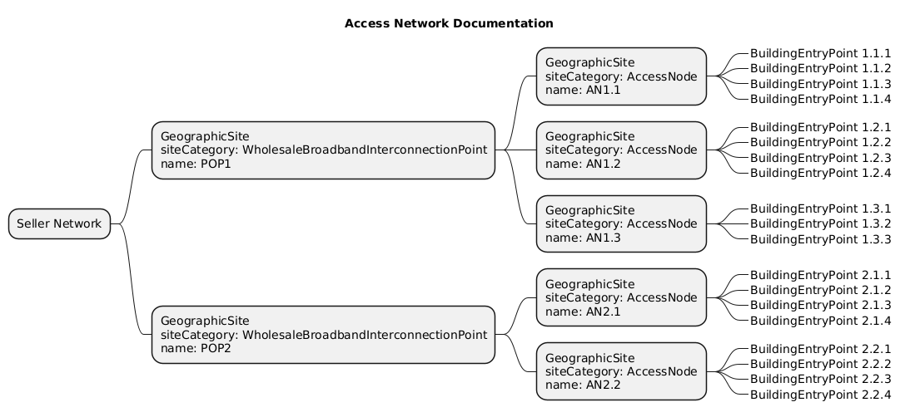

*([PlantUML source](media/access-network-documentation-view.puml))*

###  Interconnection Orders

This category focuses on establishing the core infrastructure required to enable connectivity:

- Broadband ENNI (Optional): The Buyer orders one or more Broadband ENNI interfaces to create interconnection points with the Seller's network. It is a prerequisite for ordering the other WB products.  The Broadband ENNI depends on one or more Interfaces or ENNIPorts (Infrastructure product). The ordering process should also allow adding or deleting ENNIPorts. Technically the service uses bonding to joint the ENNIPorts. For redundany, the ENNIPorts can be spread over two Interconnection points.

- Broadband Transport (Optional) :

- If shared transport is required, the Buyer orders Broadband Transport to the relevant Access Nodes.

- This step is not necessary if only dedicated transport is used, as dedicated transport is provisioned during customer-specific orders.

This type of order ensures that the foundational infrastructure is in place to support the subsequent customer-specific orders. For Many CSP this is currently not an automated order process but we will include it in this document for completeness.

###  Broadband ENNI Order Use case

The Seller only offers ENNI interconnections in the GeographicSite with siteCategory: **WholesaleBroadbandInterconnectionPoint. **The ProductOfferingQualification for this use case should therefore provide information in which **WholesaleBroadbandInterconnectionPoint **ENNI Products can be ordered. An ENNI is typically used to interconnect two service providers or networks, often involving LACP for bonded Ethernet links to provide high bandwidth and redundancy.

An ENNI Product can be offered over two **WholesaleBroadbandInterconnectionPoint**, in order to provide geo-reduncancy for the service. The Seller side uses in that case MLAG to bond ports across two switches for redundancy, while the Buyer side could be a single device, another MLAG setup, or a different bonding configuration.

In this context where an ENNI (External Network-to-Network Interface) interconnection is offered where MLAG (Multi-Chassis Link Aggregation) is used on the Seller side for redundancy, the Buyer side of the bonding link does not strictly require the same brand of devices. However, there are important technical and interoperability considerations to ensure the setup works correctly. Below is a concise explanation tailored to your use case:

**Please note:** *Broadband** ENNI is a product spec according to our product model that can be ordered directly by the buyer. However, there is an alternative use case where the buyer may instead choose to select the supported resources (ENNIs) for the Broadband Transport product.*

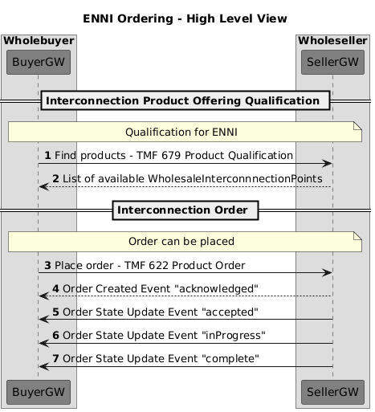

*([PlantUML source](media/enni-ordering-high-level-sequence.puml))*

### Broadband Transport Order Use Cases 

Pre-Provisioned ENNI in Product Qualification

In this particular use case, the External Network-to-Network Interface (ENNI) that the buyer intends to use has already been provisioned and made available to them in advance. Rather than requesting a new ENNI as part of the ordering process, the buyer includes the details of this pre-existing ENNI in the Product Qualification Request. This approach allows the system to evaluate the feasibility of the service based on the provided ENNI. As a result, the Product Offering Qualification (POQ) process responds with a list of Access Nodes that are reachable from the specified ENNI, enabling the buyer to make informed decisions about service deployment and connectivity options.

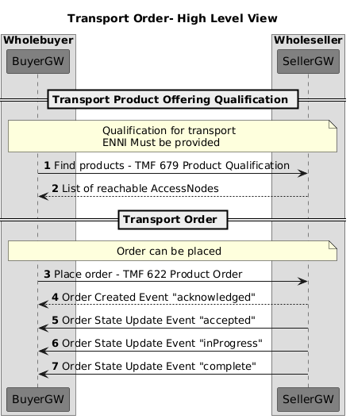

*([PlantUML source](media/transport-order-preprovisioned-enni-sequence.puml))*

Buyer-Selected ENNIs for Broadband Transport Ordering 

In this use case, the buyer is not relying on a pre-provisioned ENNI but instead wishes to actively select from a list of supported ENNIs that are compatible with the Broadband Transport product. During the ordering process, the system provides the buyer with visibility into the available ENNIs that can be used to establish connectivity. The buyer can then choose the most appropriate ENNI(s) based on their specific service requirements, location, or network design preferences.

Once the selection is made, the chosen ENNI details are included as part of the order submission. This approach offers greater flexibility and control to the buyer, allowing them to tailor the transport solution to their operational needs. It also ensures that the order is aligned with the supported infrastructure, streamlining provisioning and reducing the risk of configuration mismatches.

**For reference**, an example of the POQ (Product Offering Qualification) response that supports this use case can be found in section **4.4.3.1.1 POQ Request**. This example illustrates how the system returns a list of supported ENNIs and reachable Access Nodes, enabling the buyer to make informed selections during the ordering process.

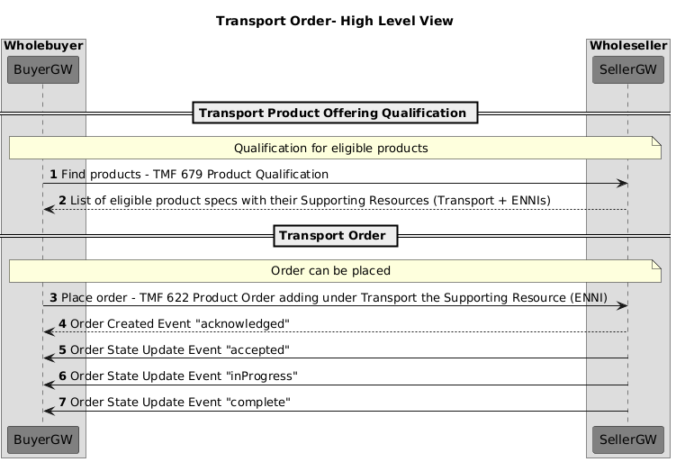

*([PlantUML source](media/transport-order-buyer-selected-enni-sequence.puml))*

## Operational Stage: Product Ordering Journey

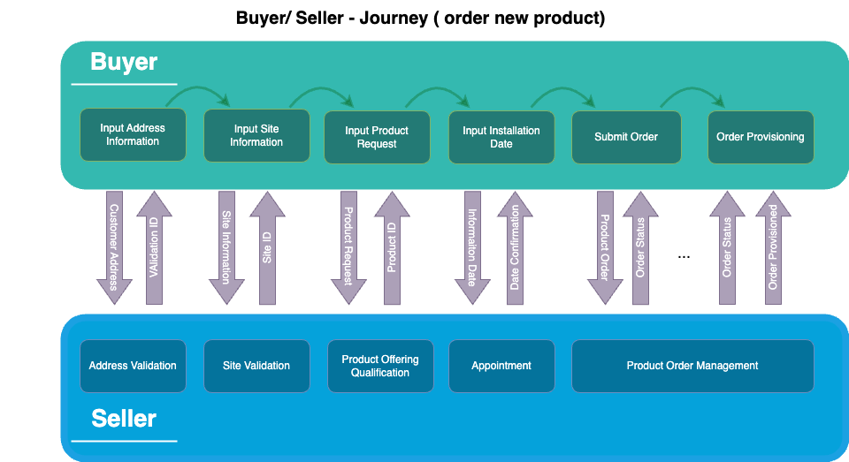

*([text description](media/buyer-seller-order-journey-diagram.text-description.md))*

Figure 3: Buyer/Seller - Journey (order new product)

- The Product Ordering Journey for Wholesale Broadband services is a structured approach that ensures all necessary components are in place to establish seamless connectivity between the Customer Premises and the Buyer's Network. It builds upon the outcomes of the Product Offering Qualification Journey, transitioning from determining eligible products to placing orders for the required components. This journey is categorized into two distinct types of orders: Foundational Infrastructure Orders and Customer-Specific Configuration Orders. 

**Important Note**: A critical prerequisite for fulfilling any Wholesale Broadband order is having the Wholesale Broadband Access product, which defines the required access technology (e.g., ADSL or FIBER), and the Wholesale Broadband Bitstream Profile product, which specifies the bandwidth and service parameters. These foundational products are essential for ensuring clarity and alignment throughout the ordering and fulfillment process.

###  Product Offering Qualification Journey

The Product Ordering Journey is directly informed by the Product Offering Qualification Journey, which identifies eligible products for the Buyer to order. By aligning these journeys, the Buyer transitions seamlessly from understanding available products to placing the necessary orders, ensuring a cohesive and efficient service provisioning experience.

Before proceeding to the Product Ordering Process, the Buyer embarks on the Product Offering Qualification Journey. This journey is a crucial step in determining which wholesale products are eligible for their customers based on specific criteria, primarily related to location and network capabilities.

 Key Steps in the Qualification Journey

- Eligibility Check:
The Buyer provides location details (e.g., address, postal code) to the Seller to assess service availability.
Specific criteria, such as access technology, network coverage, and infrastructure capabilities are used to evaluate product eligibility at the given location.

- Understanding Products Available at the Location:
Identifying which broadband products are accessible at the specified location is a critical step.
This process relies on the definition of the product model, developed by project members to provide a clear and structured list of products.
The standardized product model ensures consistency and simplifies the selection of eligible products, enabling informed decisions.

- Product Offering List:
Based on the eligibility check and product model, the Seller generates a list of available wholesale products for the specified location.
This list includes options such as Wholesale Broadband Access Lines, Wholesale Broadband Profiles, Wholesale Broadband Transport Configurations, and ENNI Options.

- Product Selection Preparation:
The Buyer reviews the returned list of qualified products and determines which ones align with their customers' needs and business requirements.
This preparation ensures that the Buyer is ready to move into the Product Ordering Journey, selecting the specific products necessary for service provisioning.

Significance of the Qualification Journey

The Product Offering Qualification Journey ensures that the Buyer fully understands the products available for their customers, reducing potential errors and optimizing the ordering process. By leveraging the standardized product model, this journey enhances consistency, streamlines product selection, and ensures that subsequent phases are aligned with technical and business requirements.
This journey empowers the Buyer to make informed, data-driven decisions, ensuring that their chosen products meet customer demands while adhering to the Sellers' capabilities.

### Individual EndUser Orders

This category focuses on the configurations and activations required to deliver services to individual customers. For products like FTTP (Fiber to the Premises), the following components are almost essential:

- Broadband Access Line (Mandatory): Establishes the physical connection from the Customer Premises to the Access Node, providing the foundational link for service delivery.

- Broadband Profile (Mandatory): Defines the logical attributes and service parameters of the access line, such as bandwidth, authentication method, and VLAN configurations, ensuring the service meets customer requirements.

- Broadband Transport (Optional - For Dedicated Transport):

- If dedicated transport is required, it must be included in this order to create a specific and secure path between the Broadband Profile and the ENNI.

This type of order ensures that all customer-specific configurations are implemented, enabling end-to-end service delivery that is efficient, scalable, and tailored to meet customer expectations.

## Operational Stage: New Wholesale Broadband Product Order 

### High Level View

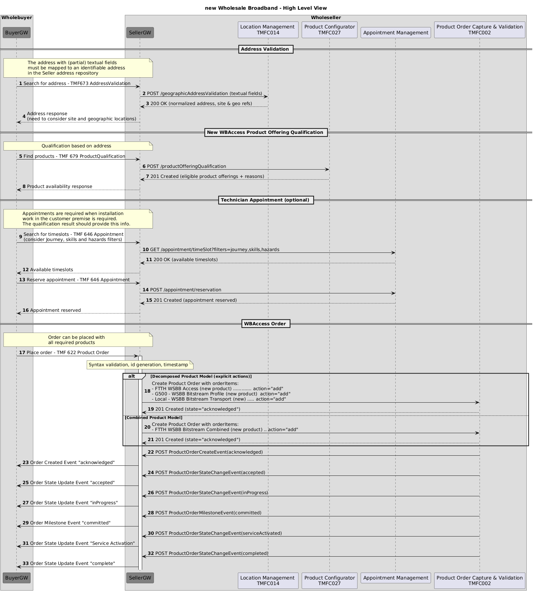

*([PlantUML source](media/new-wholesale-broadband-high-level-sequence.puml))*

### Address Validation and Selection

Address Validation is a complex operation that may include many calls to a Location Management component.

Three main scenarios are described below.

- **Preshared**: In this scenario the addresses are provided in bulk from the wholeseller to the wholebuyer. The Wholesbuyer is no responsible to provide address search capabilities to its internal processes. In this case synchronous responses for AddressValidation Task are possible.

- **Real time integration**: In this scenario the wholebuyer uses the Location Manager of the wholesaler. 

- **Common registry**: In some countries and regions there are official location management (adddress) registries available to both parties, allowing them both to perform address selection or validation internally.

Preshared Addresses

The presharing of Addresses and even of Network relevant sites with their status (areaPlanned, homesPassed, homesReady,...) and available products is common a common practise. Historically this was often via file exchanges. This scenario focusses on presharing with TMF OpenAPI.

The presharing of Addresses can be implemented using CQRS pattern where Notifications are used to keep the local copy of the Addresses of the Buyer in sync with the database of the Seller.

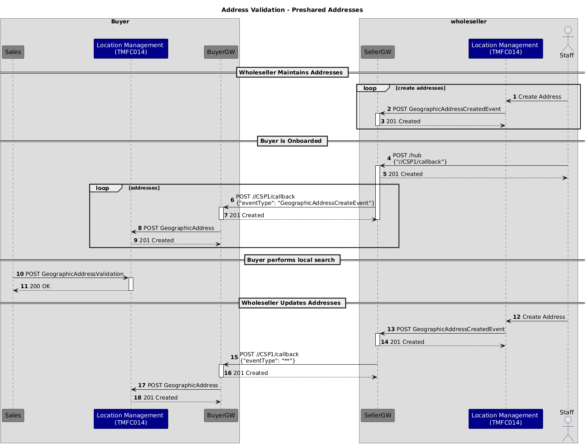

*([PlantUML source](media/address-validation-preshared-sequence.puml))*

Real-time Integration

In this scenario the Wholebuyer uses the address database of Wholeseller directly.

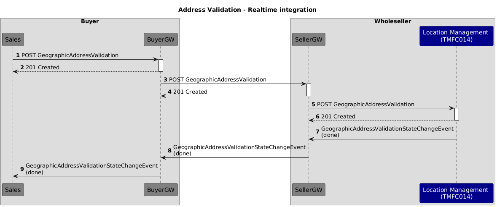

*([PlantUML source](media/address-validation-realtime-sequence.puml))*

Common registry

In this scenario a common registry of addresses provides unique identifiers for all addresses in the country. This registry can be provided by authorities or by 3rd parties.

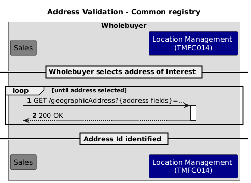

*([PlantUML source](media/address-validation-common-registry-sequence.puml))*

### ProductOfferingQualification for Initial Provide

Common

The below flow uses the task flow with notifications.

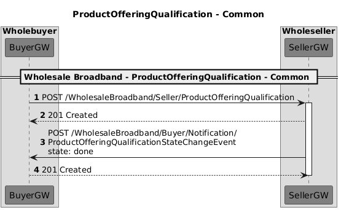

*([PlantUML source](media/product-offering-qualification-common-sequence.puml))*

POQ Request

To maximize effectiveness in a domain-specific context, we must define message semantic requirements that may extend beyond the capabilities of a generic OpenAPI specification. For instance, if a Buyer seeks to query, "Provide Product Offerings for Products available at service address X," the Product Offering Qualification (POQ) API must precisely articulate this request, ensuring alignment with TM Forum’s domain-specific standards and semantics.

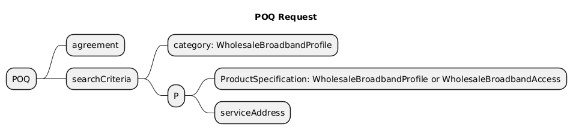

*([text description](media/poq-request-structure-diagram.text-description.md))*

The category is Optional.

The searchCriteria MUST be used to define the query. Two option are supported:

- search for ProductOfferings with ProductSpecification = WholesaleBroadbandAccess

- search for ProductOfferings with ProductSpecification = WholesaleBroadbandProfile

In both cases the **serviceAddress **must be provided as part of the searchCriteria.

The agreement  SHOULD be present if filtering of offers based on Master Agreement is required. An alternative for this is to use Oauth to identify the Buyer. In that case the agreement is optional.

Task completion

The task can be completed synchonuously (with the result in the reponse) or asynchronuously (with the the result in a Notification).

The task completion should not only return a list of Wholesale Broadband (WB) Profiles but also include the dependencies for each profile to ensure comprehensive information.

The current QueryProductOffering OpenAPI Specification (OAS) only provides references to items in a flat structure, which can create ambiguity when constructing a ProductOrder from the response.

To address this, we propose embedding an array of qualifiedProductOffering within each productOfferingQualificationItemRelationship. This approach enhances clarity in communication, albeit with a slightly more verbose message.

For example, a natural language response might be:

"We offer three options:

- A 1Gbps download / 500Mbps upload plan, requiring XGS-PON access

- A 500Mbps download / 200Mbps upload plan, also dependent on XGS-PON access

- A 100Mbps download / 30Mbps upload plan, supporting either XGS-PON or VDSL access"

This response can be translated into a structured message as follows.

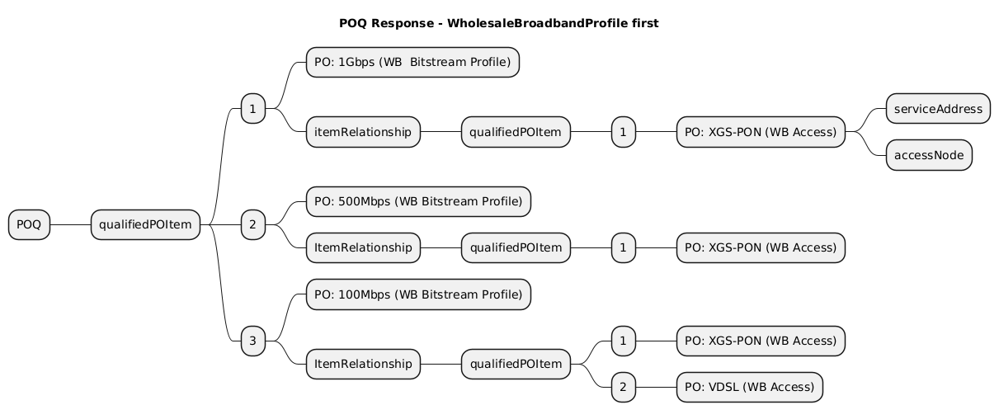

*([text description](media/poq-response-profile-first-structure-diagram.text-description.md))*

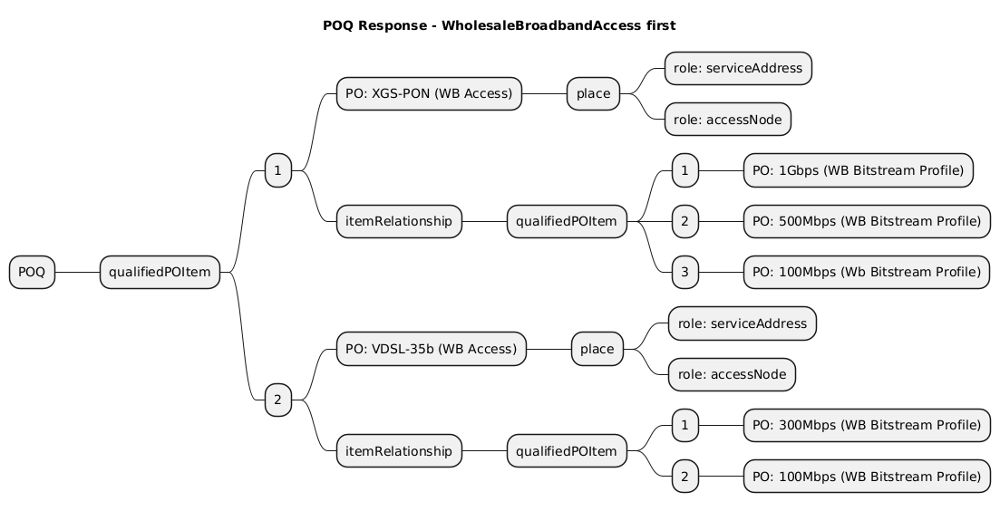

*([text description](media/poq-response-access-first-structure-diagram.text-description.md))*

The response should include dependencies that are not obviuous to the buyer. Examples:

- An additional FieldOperationsProduct for buildingEntryPoint is required

- An additional FieldOperationsProduct for in-house cabling is required

The response specifically does not include other dependencies that are common knowledge between Seller and Buyer, because they are defined in the Agreement and/or ProductCatalog. Examples:

- An ProductOrder is only valid if they include a ServiceLevelProduct. A ServiceLevelProduct defines the care level that the seller must provide for this service.

- An ProductOrder will be rejected if no tranport exist between ENNI and the accessNode

- It is always possible to add a FieldOperationsProduct for the installation of a CPE

The response should also include information about specific ENNI resources that the Seller can present as selectable options to the Buyer—enabling the Buyer to choose from the available ENNIs applicable to the given WB Bitstream Transport Profile.

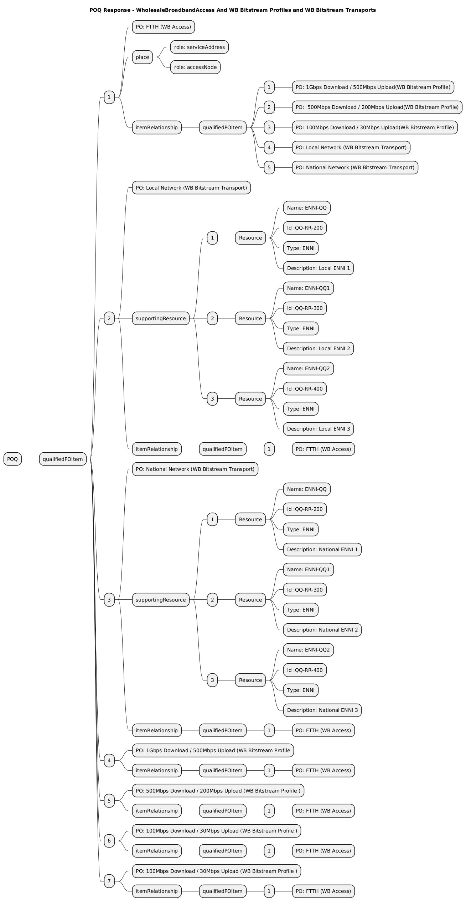

*([text description](media/poq-response-access-profiles-transports-structure-diagram.text-description.md))*

Seller view

In some countries, Sellers have historically shared regular extracts of their network coverage with Buyer partners. However, this practice raises security concerns, as Sellers may expose sensitive network details to potential competitors.

A preferred solution is to provide Buyers with a Product Offering Qualification (POQ) interface, which can be rate-limited to prevent scraping operations.The POQ process can be implemented either as **a two-phase interaction **or as a **single-call** operation, depending on the desired integration model.

**In the single-call mode**l, the Seller provides comprehensive metadata about available Product Offerings, including associated service capabilities  and their Supported Resources and constraints. For example, in the context of Wholesale Broadband (WB) Transport Exposure, the Seller may expose a list of supported Resources - ENNIs as selectable (but non-purchasable) resources. This enables the Buyer to tailor their request based on available interconnect options.

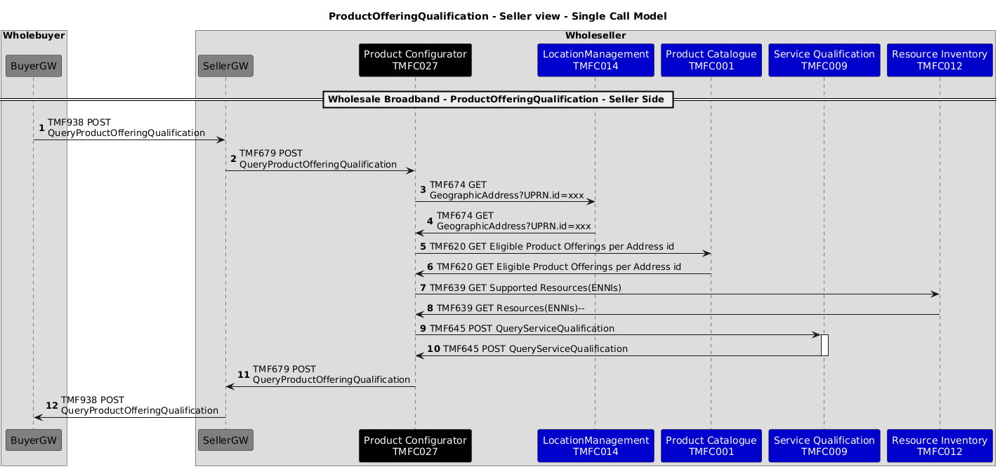

*([PlantUML source](media/poq-seller-single-call-sequence.puml))*

**In the two-phase model:**

- **Phase 1** performs a technical feasibility assessment based on the Seller’s network topology and service availability. It returns a list of viable Product Offerings along with relevant supporting Resources (ENNIs) from Resource Inventory that the Buyer can select from.

- **Phase 2** performs a commercial eligibility check, typically by validating the technically feasible offerings against those permitted under the Buyer’s Framework Agreement. Only Product Offerings that satisfy both technical and commercial criteria are returned to the Buyer.

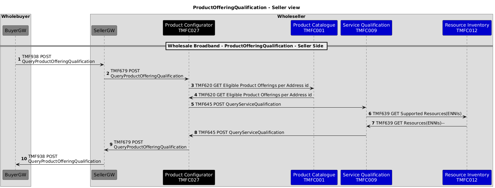

*([PlantUML source](media/poq-seller-two-phase-sequence.puml))*

Buyer View

The buyer wants a ServiceQualification that prefers generating feasible services using their own network if that exists. If no own network exists the ServiceQualification should interogate one of more Buyers for available PartnerProductOfferings that can be used to realise the service. Once the Partners have provided answers the most suitable productOffering can be selected.

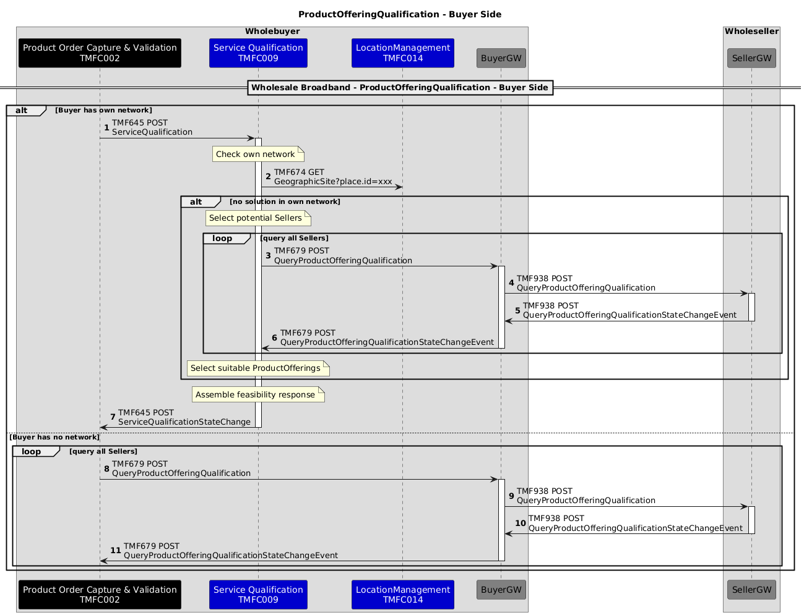

*([PlantUML source](media/poq-buyer-side-sequence.puml))*

## Operational Stage: New Wholesale Broandband Product Order

### High Level View

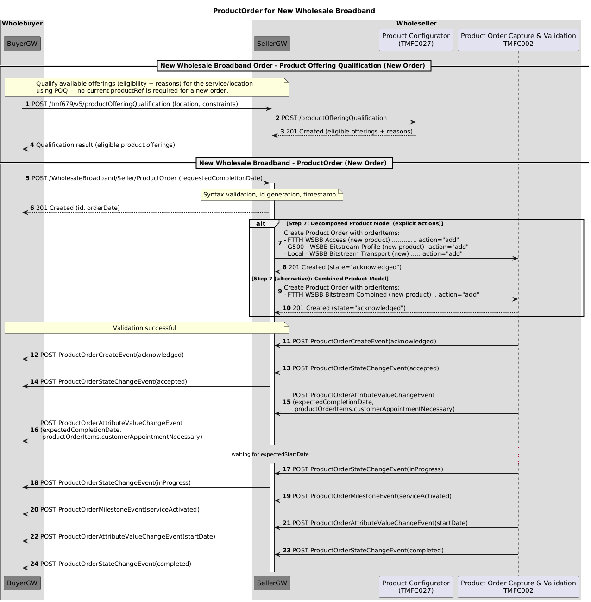

*([PlantUML source](media/new-wholesale-broadband-order-sequence.puml))*

## Operational Stage: Upgrade/Downgrade

### High Level View

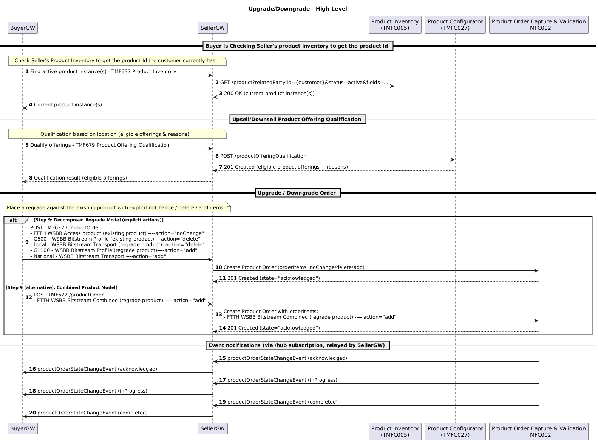

*([PlantUML source](media/upgrade-downgrade-high-level-sequence.puml))*

### ProductOfferingQualification for Upgrade/Downgrade

Common

The flow used for the API call remains as above, but the actual message content is different.

POQ Request

A ProductRef for the existing product is provided so the the qualification can return what alternatives can be offered.

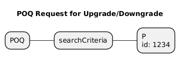

*([text description](media/poq-request-upgrade-downgrade-structure-diagram.text-description.md))*

### ProductOrder for Upgrade/Downgrade

The sequence is similar to the one in NewL2Bitstream

The difference is only the type and number of ProductOrderItems:

Modify WB Profile

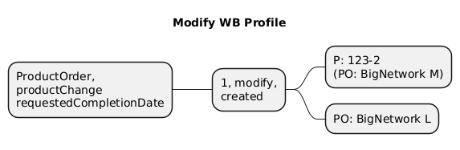

*([text description](media/modify-wb-profile-structure-diagram.text-description.md))*

Modify Access Technology (with installation)

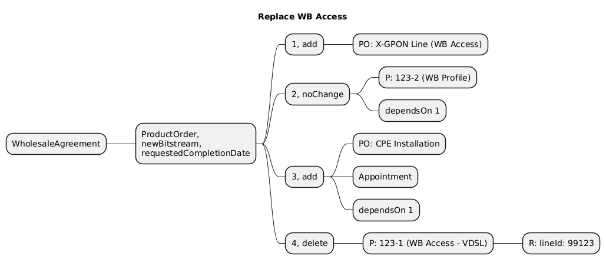

*([text description](media/replace-wb-access-structure-diagram.text-description.md))*

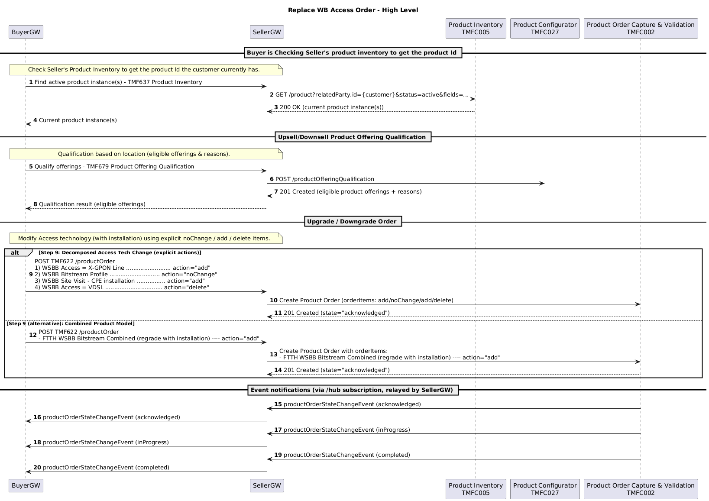

*([PlantUML source](media/replace-wb-access-order-sequence.puml))*

## Operational Stage: Cease Order (Cancel existing Products and Stop Service )

### High Level View 

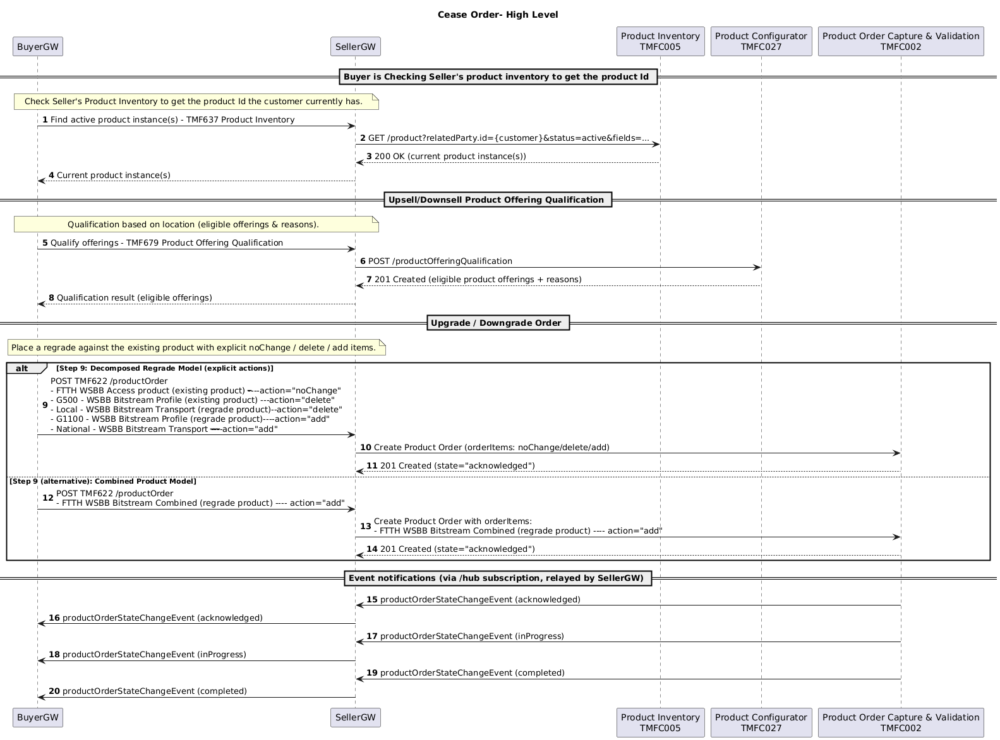

*([PlantUML source](media/cease-order-high-level-sequence.puml))*

## Operational Stage: Cancel Inflight Order (cancellation by buyer) 

### Overview

This document describes the buyer-initiated product order cancellation use case within a wholesale fibre access context. It outlines the end-to-end interaction between the Buyer Gateway and Seller Gateway, together with the internal buyer and seller system behaviours that support cancellation processing.

The use case is based on TMF Open APIs and related TM Forum standards, focusing on gateway-to-gateway integration. Internal orchestration steps within buyer and seller domains are provided as implementation guidance and are not part of the formal standard.

### Sequence Diagrams

The sequence diagrams in this section illustrate the interactions between the Buyer Gateway, Seller Gateway, Product Order Management, Product Inventory, and Billing systems during a buyer-initiated order cancellation. For reference, each interaction in the diagram is described in the accompanying step-by-step table, which provides a brief explanation of the purpose and context of each message.

### High-Level View

This diagram illustrates the high-level interaction between a Buyer Gateway and a Seller Gateway when a buyer requests the cancellation of a product order.

### High Level View

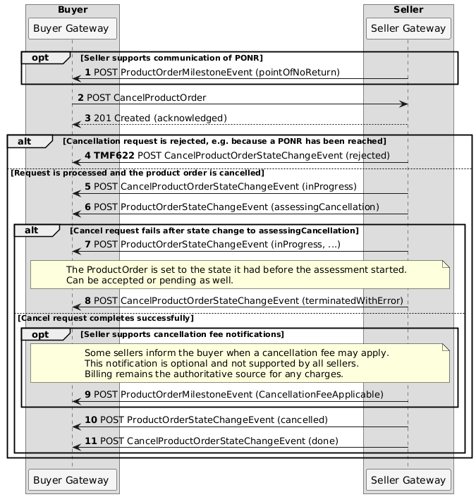

*([PlantUML source](media/cancel-inflight-order-high-level-sequence.puml))*

The table below describes each of the steps of the sequence diagram above.

| # | Interaction | Description |
| --- | --- | --- |
| 1 | Seller → Buyer: POST ProductOrderMilestoneEvent (pointOfNoReturn) | Optional notification that the order reached point-of-no-return (PONR) |
| 2 | Buyer → Seller: POST CancelProductOrder | Buyer requests cancellation of the product order |
| 3 | Seller → Buyer: 201 Created (acknowledged) | Seller acknowledges receipt of the cancellation request |
| 4 | Seller → Buyer: POST CancelProductOrderStateChangeEvent (rejected) | Cancellation request is rejected (e.g. PONR already reached) |
| 5 | Seller → Buyer: POST CancelProductOrderStateChangeEvent (inProgress) | Cancellation request accepted and processing started |
| 6 | Seller → Buyer: POST ProductOrderStateChangeEvent (assessingCancellation) | Order enters assessment phase for cancellation |
| 7 | Seller → Buyer: POST ProductOrderStateChangeEvent (inProgress, …) | Order state restored after failed cancellation attempt |
| 8 | Seller → Buyer: POST CancelProductOrderStateChangeEvent (terminatedWithError) | Cancellation process fails with error |
| 9 | Seller → Buyer: POST ProductOrderMilestoneEvent (CancellationFeeApplicable) | Optional notification that a cancellation fee may apply |
| 10 | Seller → Buyer: POST ProductOrderStateChangeEvent (cancelled) | Product order successfully cancelled |
| 11 | Seller → Buyer: POST CancelProductOrderStateChangeEvent (done) | Cancellation process completed successfully |

### Product Order and Cancel Order Lifecycle Transitions

The table below describes how the lifecycle of the ProductOrder entity and the CancelProductOrder entity interact during an order cancellation process. It shows how the CancelProductOrder states drive the corresponding ProductOrder state transitions, including both the error path and the successful cancellation path.

| Step | CancelProductOrder State | ProductOrder State | Interaction / Trigger | Description |
| --- | --- | --- | --- | --- |
| 1 | acknowledged | inProgress (or current state) | Cancel order request submitted | The buyer submits a cancellation request using the cancelProductOrder operation. The seller acknowledges the request and creates a CancelProductOrder entity. |
| 2 | rejected | unchanged | Cancellation validation fails | The seller determines that the order cannot be cancelled (e.g., PONR reached or business rules prevent cancellation). The cancellation request is rejected and the ProductOrder lifecycle remains unchanged. |
| 3 | inProgress | assessingCancellation | Cancellation accepted | The seller accepts the cancellation request and transitions the ProductOrder to assessingCancellation while operational and business checks are performed. |
| 4 | terminatedWithError | restored to previous state | Cancellation fails | If cancellation cannot be completed after the assessment phase, the CancelProductOrder process terminates with an error and the ProductOrder returns to the state it had before the cancellation attempt began. |
| 5 | inProgress | pendingCancellation | Cancellation execution begins | If cancellation is confirmed, the seller proceeds with cancellation tasks such as stopping provisioning, updating product inventory, cancelling billing subscriptions, and releasing resource reservations. |
| 6 | done | cancelled | Cancellation completed | All cancellation activities complete successfully and the ProductOrder transitions to the cancelled state. The seller sends final state change notifications confirming that the order has been cancelled and the cancellation process has completed. |

### Buyer View

This diagram illustrates the buyer-side handling of a TMF product order cancellation, focusing on how the BuyerGW and internal systems interact with seller events. It shows how the buyer initiates cancellation, processes state change notifications, and updates order, billing, and fulfilment systems in response to seller-driven lifecycle events.

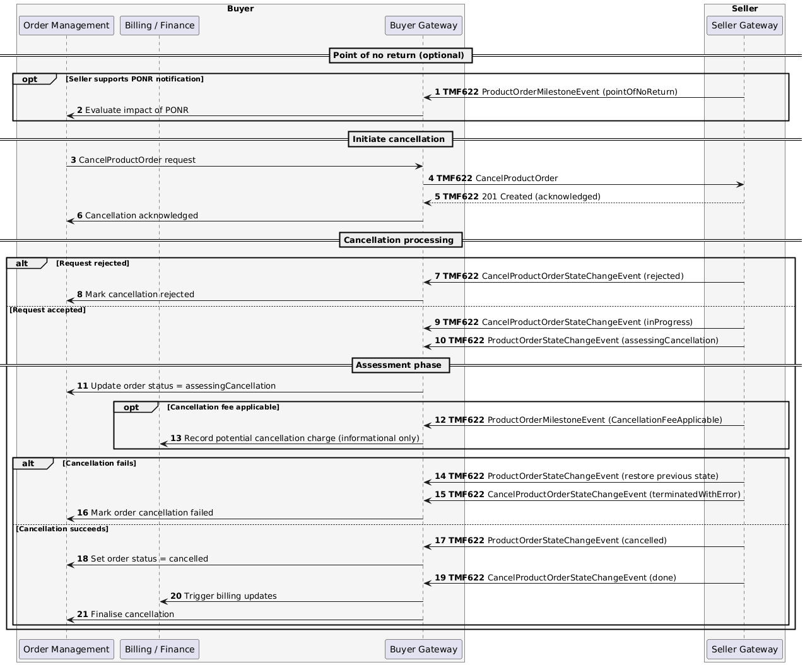

*([PlantUML source](media/cancel-inflight-order-buyer-view-sequence.puml))*

The table below describes each of the steps in the sequence diagram above.

| # | Interaction | Description |
| --- | --- | --- |
| 1 | Seller → Buyer: TMF622 ProductOrderMilestoneEvent (pointOfNoReturn) | Optional PONOR notification |
| 2 | Buyer Order Management → BuyerGW: Evaluate impact of PONOR | Internal impact analysis |
| 3 | Buyer Order Management → BuyerGW: CancelProductOrder request | Buyer initiates cancellation |
| 4 | BuyerGW → SellerGW: TMF622 CancelProductOrder | Cancellation request sent to seller |
| 5 | SellerGW → BuyerGW: TMF622 201 Created (acknowledged) | Request acknowledged |
| 6 | BuyerGW → Order Management: Cancellation acknowledged | Internal acknowledgement |
| 7 | SellerGW → BuyerGW: TMF622 CancelProductOrderStateChangeEvent (rejected) | Rejection path (if applicable) |
| 8 | BuyerGW → Order Management: Mark cancellation rejected | Update internal status |
| 9 | SellerGW → BuyerGW: TMF622 CancelProductOrderStateChangeEvent (inProgress) | Cancellation processing started |
| 10 | SellerGW → BuyerGW: TMF622 ProductOrderStateChangeEvent (assessingCancellation) | Assessment phase entered |
| 11 | BuyerGW → Order Management: Update order status = assessingCancellation | Internal status update |
| 12 | SellerGW → BuyerGW: TMF622 ProductOrderMilestoneEvent (CancellationFeeApplicable) | Optional fee notification |
| 13 | BuyerGW → Billing/Finance: Record potential cancellation charge | Informational billing update |
| 14 | SellerGW → BuyerGW: TMF622 ProductOrderStateChangeEvent (restore previous state) | Failure rollback path |
| 15 | SellerGW → BuyerGW: TMF622 CancelProductOrderStateChangeEvent (terminatedWithError) | Cancellation failed |
| 16 | BuyerGW → Order Management: Mark order cancellation failed | Internal update |
| 17 | SellerGW → BuyerGW: TMF622 ProductOrderStateChangeEvent (cancelled) | Successful cancellation state |
| 18 | BuyerGW → Order Management: Set order status = cancelled | Internal order completion |
| 19 | SellerGW → BuyerGW: TMF622 CancelProductOrderStateChangeEvent (done) | Cancellation completed |
| 20 | BuyerGW → Billing/Finance: Trigger billing updates | Billing reconciliation triggered |
| 21 | BuyerGW → Order Management: Finalise cancellation | Close order lifecycle |

### Seller View

This sequence diagram describes the Seller-side processing of a product order cancellation request in more detail. It shows how the Seller Gateway, Product Order Management, Product Inventory, and Billing systems collaborate to process the request and keep the buyer informed through events.

This sequence diagram shows a seller-side implementation for processing TMF622 product order cancellation in a wholesale fibre access context. The internal seller-side flows (order capture, inventory, billing, and fulfilment steps) are informative guidance only and are not part of the standard.

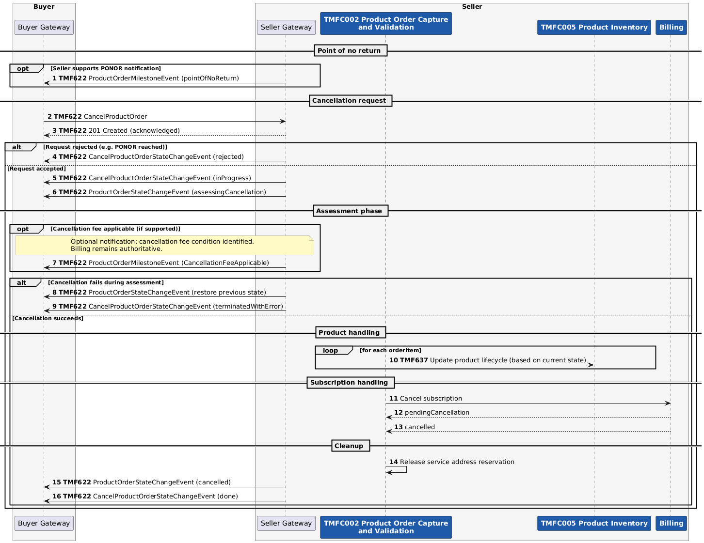

*([PlantUML source](media/cancel-inflight-order-seller-view-sequence.puml))*

The table below describes each of the steps in the sequence diagram above.

| # | Interaction | Description |
| --- | --- | --- |
| 1 | Seller → Buyer: TMF622 ProductOrderMilestoneEvent (pointOfNoReturn) | Optional PONOR notification |
| 2 | Buyer → Seller: TMF622 CancelProductOrder | Cancellation request |
| 3 | Seller → Buyer: TMF622 201 Created (acknowledged) | Request acknowledged |
| 4 | Seller → Buyer: TMF622 CancelProductOrderStateChangeEvent (inProgress) | Cancellation processing starts |
| 5 | Seller → Buyer: TMF622  ProductOrderStateChangeEvent (assessingCancellation) | Assessment phase |
| 6 | Seller → Buyer: TMF622 ProductOrderMilestoneEvent (CancellationFeeApplicable) | Optional fee applicability notification |
| 7 | Seller → Buyer: TMF637 Update product lifecycle | Start product handling per order item |
| 8 | Internal (POM → PIM): Update product status | Inventory update per order item |
| 9 | Internal (POM → PIM): Update product status | Loop continues per order item |
| 10 | Internal (POM → Billing): Cancel subscription | Start billing cancellation |
| 11 | Billing → POM: pendingCancellation | Billing acknowledges |
| 12 | Billing → POM: cancelled | Subscription closed |
| 13 | Internal (POM): Release service address reservation | Cleanup action |
| 14 | Seller → Buyer: TMF622 ProductOrderStateChangeEvent (cancelled) | Order completed |
| 15 | Seller → Buyer: TMF622 CancelProductOrderStateChangeEvent (done) | Cancellation finished |

## Operational Stage: Work Line Take Over

### High Level View

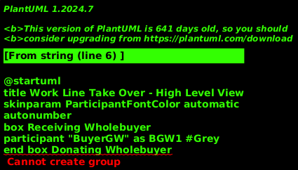

*([text description](media/work-line-take-over-high-level-view.text-description.md))*

## Operational Stage: Work Line Take Over ( Gaining Provider Led Switch Order)

### High Level View

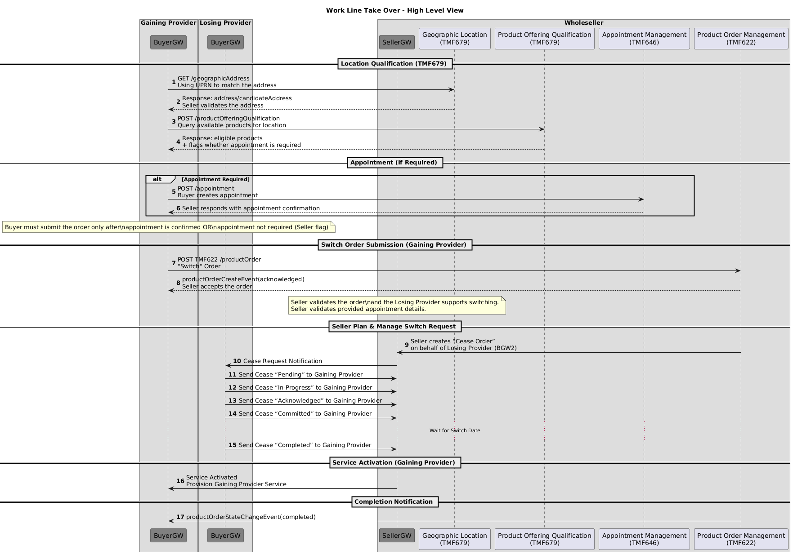

*([PlantUML source](media/work-line-take-over-gaining-provider-switch-sequence.puml))*

### ProductOfferingQualification for ISP Migration

Common

The flow used for the API call remains as above, but the actual message content is different.

POQ Request

### Approval for ISP migration

Common

In case of ISP migration, the losing ISP must formally agree to the migration process. The regulator usually has an interest in limiting the allowable reasons for rejecting a migration agreement. The agreement between Buyer and Seller can further limit the allowable reasons.

## Operational Stage: Change of installation date

To be detailed in a future release of this document.

## Operational Stage: Assurance - Product testing

To be detailed in a future release of this document.

## Operational Stage: Assurance - Ticketing

To be detailed in a future release of this document.

# Conclusion

## Lessons learned

### Impacts identified

*During the early stages of defining the use cases, we identified and started aligning to a TMFC002 Product Order Capture and Validation component supporting the TMF645 Service Qualification API. However, as the usecases evolved, it became clear that in its latest release this component has stopped using any more this API *

- eTOM:

- OpenAPI:

- Component:

- [ TAC-841](https://projects.tmforum.org/jira/browse/TAC-841?src=confmacro) - Wholesale Broadband Gateway ** pending information **

