# Executive Summary

This Use Case - Partner Onboarding and Agreement Management - defines the various agreement types that need to be established among Entities (CSP) and their Suppliers for delivering complex B2B2X solutions to end customers. Entities can be Communication Service Providers (CSPs) and their Suppliers delivering complex B2B2X based Product Offerings, or Digital Marketplaces (both Type 1 and Type 2) and their stakeholder ecosystem of customers and suppliers. 

To realize these solutions there are two types of agreements involved. Using the Entity as the point of reference:

- Agreements between the Entity and the Suppliers which deal with the buy side of the Supply chain i.e. Agreements that are created during the Supplier / Business Partner onboarding and agreements that help take crucial decisions during the onboarding process.

- Agreements between the Entity and the end customer which deal with the sell side which are not always mandatory e.g. Memorandum of Understanding but will be useful in complex B2B2X solutions.

This use case focuses on the agreements among the Entity and the Suppliers (Item 1 above). Other use cases notably TMFS020 address the Customer Entity agreements /contracts (Item 2 above).

This use case starts with an ideation phase among the Entity and multiple potential Suppliers and finishes when a FrameworkAgreement(type= LegalContract) and supporting agreements have been signed among them, but before any Product or Contracts with end Customer have been agreed. 

This subsequent stage of Customer Contracts is defined in [TMFS020: Use Case: Multi Domain B2B2X Contract. ](https://projects.tmforum.org/wiki/display/ETEO/TMFS020%3A+Use+Case%3A+Multi+Domain+B2B2X+Contract+Management)

# Introduction

** B2B2X Use Case scenarios** 

The aim of the B2B2X set of use cases is to define a consistent approach to design, implement, operate and monetize offers based on / relying on / that consist in, partners' assets.

The following use cases (from TMFS019 to TMFS024)  illustrate, through several configurations (Partnerings, ProductOfferings) how TM Forum Frameworks support interaction and digitalization between all stakeholders.
*Ed Note: In this use case the stakeholders are the Entity (CSP) and Partner /Suppliers, These are the preferred terms throughout as they are specializations of the term Stakeholder, a concept which works best for Digital Marketplaces having many Customers and Suppliers.*

The current set of B2B2X use cases cover:

- ***Partner On-boarding with Agreement Management (TMFS019A and B)***
For example, the Entity (a Communication Service Provider) will manage FrameworkAgreement(type= LegalContract),  Framework Agreements and Implementation Agreements with ad hoc Suppliers (SDWAN Vendors, Cloud Providers, SSE Editors, ...) to be able to provide a SASE solution to its customers.

- ***Multi Party Contract Management for a large enterprise (TMFS020)***
For example, the Entity (a Communication Service Provider)

-  Describes in its catalog a SASE Solution, based on its own assets and assets provided by its Suppliers.

-  On board a Customer from Intent to its first order (through Framework Agreement, Opportunities...).

- ***Orchestration of a multi party, multi domain, multi tenant Product Offering sold as a solution (TMFS021)***Defines the ordering process among Customer Entity and Suppliers for delivering an instance of an end Customer Product Offering (Provisioning).

- ***Cross domain event correlation, event to incident (TMFS022)***
Defines assurance services provided by B2B2X Solutions.

- ***Multi party Usage Management and Charging (TMFS023)***
Defines processes raising charges incurred by Customer in a B2B2X Solution.

- ***Settlement with partner for Type 2 Marketplaces (TMFS024)***
Defines processes and mechanisms for sharing revenues among Intermediaries (Entity) and Suppliers. 

There are additional related use cases arising from joint work with GSMA on Open Gateway initiative in TMFS026 and with work on Wholesale Broadband Fibre Access in TMFS018.

For Partnering and Agreement management, several configurations are proposed: 

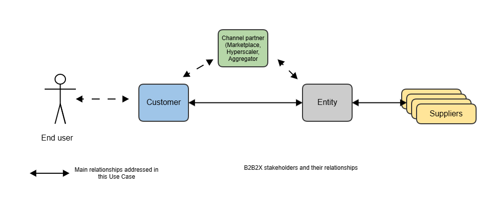
*([text description](media/b2b2x-stakeholder-relationships-overview.text-description.md))*

***Fig 1-1 Overview of Partnering Models between B2B2X SupplierRole, Intermediary (EntityRole) and CustomerRole***

*Ed Note: *

- *In practice, end user customers (roles) have relationships with multiple Entity Role and their Suppliers (roles), so this diagram is a simplification of a** **generalized B2B**n**2X**m** model.*
*Such models can be constructed by use of multiple instances of this simplified model.*

- *To simplify descriptions we use terms Customer, Entity and Supplier to refer to the roles **performed** by organizations/parties*

The EntityRole  e.g. performed by a CSP,  will provide an Offer (ProductOffering) to the Customer Role which is based upon its own and Suppliers' assets.

This figure shows the main relationships (**↔**), but other relationships can exist and / or have to be managed.

The focus for this use case is the onboarding of Suppliers by the intermediary (Entity)  and the formation of Agreements of several types (defined in TMF651 Agreement Management API and SID Agreement Model).

In this use case scenario, a number of complexities arise from alternative business practices:

- The agreement with the customer by the intermediary (Entity) is separate from the agreement(s) with the Suppliers.

- For this scenario the assumption is that Legal Contract/FrameworkAgreement(type= LegalContract) are in place with suppliers before Product Offering instances are offered to Customers
This is the primary focus of this use case scenario.

- Suppliers may all sign a FrameworkAgreement(type= LegalContract) with the Intermediary (Entity) but the Legal Contract /FrameworkAgreement(type= LegalContract) for each partner may have additional specific legal clauses such as geographical restrictions on products sales.

- After the FrameworkAgreement(type= LegalContract) instance has been agreed by the Entity(CSP) and the Suppliers it is necessary to organize signatures on copies/instances of the FrameworkAgreement(type= LegalContract).

- The Entity (CSP) will issue separate FrameworkAgreement(type= LegalContract) instances to each supplier for signature.

- Get signatures between the Entity (CSP) and the Supplier. The Supplier FrameworkAgreement and might have specific Product Offerings tied to them at the time of signature or later.

- Amendments to relationships between  FrameworkAgreement(type= LegalContract) to specific ProductOfferings, ImplementationAgreements may occur at any time and need to be supported.

## Context or Background

To illustrate Partner On-Boarding with Agreement Management, we propose to use the following configuration for a SASE Service delivered by the Entity(CSP) : 

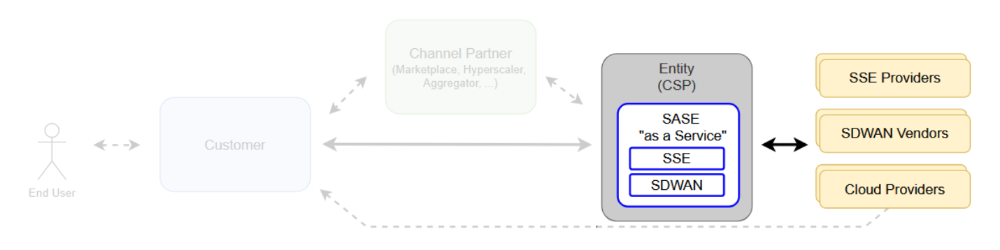
*([text description](media/sase-entity-supplier-relationships-focus.text-description.md))*

**Figure 1.2 Focus on Entity (CSP) Supplier relationships for SASE Product Offering**

The focus is on Entity / Supplier relationships, meaning, an Entity (a Communication Service Provider aka CSP) wants to provide to its Customers SASE Solution including assets provided by external Suppliers (SSE Providers, SDWAN Vendors, Cloud Providers). The Entity has to organize relationships with its Suppliers to fulfill its strategy.

## Objective of the use case

The objective of this use case is to illustrate, through Entity (the CSP) / Supplier FrameworkAgreement management, a standard approach to establishing Partnering Agreements. This enables organizations to formally capture the AgreementItem parts of an Agreement that cover Business, Commercial, Operational and Financial models (see TR211), and Terms and Conditions in a common structure . This permits participants to create plug and play ecosystems and to create and maintain machine processable Agreements that address all aspects of a FrameworkAgreement(type= LegalContract) including partner specific terms and conditions, limitations and options. 

The same Agreement standards should also work for complex enterprise or government contracts as well as for traditional wholesale contracts.

## Scope and assumptions

### Scope

This use case describes interactions between a CSP and its Suppliers to establish a FrameworkAgreement (type= LegalContract) that will support

- Products bought from Suppliers

- Terms & conditions regarding CSP's Customers (acceptance, ...)

- Operating model between CSP and its Suppliers regarding their relationship through all process (from catalog management to analytics going through customer order management, assurance, usage, billing, ...)

- Implementing this FrameworkAgreement (Partner/Suppliers' on-boarding)

Once this step has completed and  FrameworkAgreement implemented and signed, the CSP will be able to manage its own catalog and commercialize solutions to its customers (and order ad hoc assets from its Suppliers), as described in use cases TMFS020 and TMFS012.

### Assumptions

**Pre-Requisites for this Use Case:**
The Business Opportunity, Product ideation and the Supplier/Partner Identification activities have happened before this Use Case.

And optionally a 'Memorandum of Understanding', if required, has been agreed/signed between the Entity and the suppliers. 

# Description

Recent work in the Information Framework aka Shared Information and Data (SID)  team on Agreement Model ABE enhancements, and in the TMF651 Agreement Management API Data Model have set out the types of Agreements and their relationships with other SID Business Entities. 

There are several agreement types that are produced and managed in this use case:

- FrameworkAgreement Specification / Template development (TM Forum).

- Optional Memorandum of Understanding which are considered to be nonContractual-Agreements but may be signed.

- FrameworkAgreement instances developed by 'foundation' Partners/Suppliers.

- FrameworkAgreement(type= LegalContract) /Legal Contract instances between CSP and Suppliers that reference subordinate FrameworkAgreement instances.
*Ed Note Legal Contract is often used as an informal synonym for FrameworkAgreement(type= LegalContract) in the SID*

- Signed FrameworkAgreement(type= LegalContract) /Legal Contract between ecosystem's Partner Suppliers - i.e a set of bi-lateral FrameworkAgreement(type= LegalContract)s

- FrameworkAgreement instances presented to Customers by CSP - described in TMFS020 MultiDomainB2B2X Contract Management

- Addition and removal of Product Offering Specification to FrameworkAgreement /Legal Contract instances.

- Addition and removal of Partners/Suppliers from FrameworkAgreement instances

- Creation and attachment of Implementation Agreement instances to FrameworkAgreement(type= LegalContract) /Legal Contract

There are a series of scenario sub use cases, derived from IG1317 Process Requirements (section 6) which have well-defined entry and exit criteria related to various Agreement types. 

These sub use case scenarios can be run in multiple sequences depending on the business practices. Each subscenario ends up with a defined set of agreements and a processes for updating them.

**Sub scenarios/processes**

| Use Case | Proposed title | Activity | Entry Criteria | Exit Criteria | IG1317 B2B2X Process |
| --- | --- | --- | --- | --- | --- |
| TMFS019-1 | Browse supplier catalog | Support IG1317 ideation requirement 'Product ideation (with partners) or Business Opportunity Ideation' | Partner/Entity Identity to be disclosed to supplier catalog | Memorandum of Understanding Optional | Product ideation (with partners) or Business Opportunity Ideation |
| TMFS019-2 | Foundation 'Partner/Supplier' Framework Agreement | Define instance of Partner Supplier Framework Agreement whose Framework Items cover TMF211 aspects: Business Model Contractual Model Operating Model Financial Model that are common for all customers, partners and products under the Framework Agreement | Framework Agreement Specification Entities - 'Foundation' Partner/Suppliers identified. | Completed Framework Agreement Instance All 'foundation' Stakeholders/ Partners agreed. ( for signature) | Partner enrollment and onboarding |
| TMFS019-3 | Partner/ supplier FrameworkAgreement(type= LegalContract)/ Legal Agreement Instance | Define instance of FrameworkAgreement(type= LegalContract) (Legal Agreement) referencing Framework Agreement Instance, in some cases adding Implementation Agreements (Spec and instances?) | FrameworkAgreement(type= LegalContract)/ (LegalContract)) Specification (template) | Complete FrameworkAgreement(type= LegalContract) (Legal Contract) Instance Optionally contained other Framework Agreement Instances (type={other})and Implementation Agreement instances | Agreement management during and after the partner onboarding |
| TMFS019D | FrameworkAgreement(type= LegalContract)//Legal Contract Signing | Organise signature of FrameworkAgreement(type= LegalContract) (Legal Contract) amongst supporting ecosystem Partner/Supplier | Complete FrameworkAgreement(type= LegalContract) (Legal Contract)  Instance Initial Partner Supplier list | Signed partner/supplier FrameworkAgreement(type= LegalContract) (Legal Contract)  Instance Individual Partner/Supplier role information captured and agreed | Agreement management during and after the partner onboarding |
| TMFS019-5 | FrameworkAgreement(type= LegalContractAmendment) Management: Amendment. | FrameworkAgreement(type= LegalContractAmendment) Amendments: Add Product Offering Specifications to FrameworkAgreement(type= LegalContract), Change T&C. Add remove Partners/Suppliers ? | FrameworkAgreement(type= LegalContract) | Updated FrameworkAgreement(type= LegalContract) Management Agreement Items, Terms and Conditions, documents and attachment? | Agreement management before, during and after the partner onboard |
| ------------ | ImplementationAgreement Instance | Assumption is additional ImplementationAgreement are created in TMFS020 | ImplementationAgreement Specification | ImplementationAgreement instance |   |

**Table 2-1  TMFS019 Sub processes with Entry and Exit Criteria **

Note The remaining IG1317 B2B2X Process Requirements are covered in subsequent Use cases TMFS020, TMFS021, TMFS022, TMFS023, & TMFS024.

- Partner Product )Offering) Management (with relationship to the Agreement)

- Complex Solution Selling (Customer facing)

- Orchestration and delivery (Customer facing)

- Partner settlement (with relationship to the Partner FrameworkAgreements)

The following figure provides an overview of the main steps that are involved in Partner FrameworkAgreement definition:

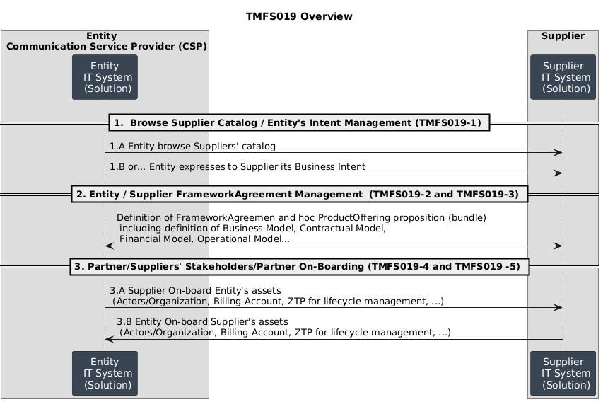
*([PlantUML source](media/tmfs019-three-step-overview-sequence.puml))*

**Figure  2.1 Overview of main stages in Partner Onboarding and Agreement management - with reference to SubScenarios**

Where

- Step 1 Defines scope and modus operandi.

- Step 2 defines FrameworkAgreement(type= LegalContract) and supporting Framework Agreements

- Step 3 realizes partner onboarding including signatures.

For example, to provide solutions to its Customers, a CSP organizes with each of its Suppliers/Partners signed instances of FrameworkAgreement(type=LegalContract)s.

While the relationship is stabilized between each Supplier/Partner/, a FrameworkAgreement(type= LegalContract) will be defined. This use case describes FrameworkAgreement and how relationships are managed between each Partner/Supplier (Partner On-Boarding). Once Framework-Agreement and On-boarding is realized, Products can be used regarding contracts boundaries.

Note: The on-boarding and AgreementManagement process is a crucial step to support "in-life" operations in parallel, thus meeting the increasingly sophisticated needs of customers.

To do so, Partnership On boarding / FrameworkAgreement(type= LegalContract)s need to be captured in a systemic, repeatable and machine processable form, what has been agreed between the Entity and its Supplier/Partners, and is used to drive the development, configuration and operation of Reusable Component Solutions. 

The following five aspects represent the five FrameworkAgreement/FrameworkAgreementItems resulting from Partner Onboarding (this is sourced from TR211 with some minor adaptions).

- **Customer / market offering proposition – **defining** **the value proposition for end customers which includes the combination of offerings from the CSP or Marketplace and its partners e.g. a solution concept for which the overall agreement needs to capture all the requisites to enable the solution. This stage can use the industry standard Osterwalder Value Proposition and Business Model Canvases analysis method to capture the business model requirements as inputs to creation of the Partnership Agreement. The Value Proposition canvas as it outlines an approach to define the end customer’s needs, in terms of “pains and gains” which make it easier to define the various parts of a solution offering.

- **Business Model **required to** **enable the offering model, including business roles, service interactions and product/service relationships that partners hold within a value chain or fabric e.g. Instant messaging, access networks, Cloud Service, etc.

- **Contractual Model **including business rules and policies, terms and conditions.

- **Financial Model **including revenue principles and flows including rebates and dispute resolution.

- **Operational Model **including both functional and non-functional requirements - such as process performance, reliability, etc The Agreement Type  = Operational Model is created for every Partner and sometimes a partner will have more than one Operational Model, because the Operational Model changes based on the product Offering (unless the offerings that the Partner brings to the Marketplace are very similar).

# Views

## Information View

This use case - Partner Onboarding and Agreement Management - defines processes that result in the definition of several Agreement entities that are used to control and regulate subsequent B2B2X use cases for fulfilling assuring and billing / settlement services delivered to end Customers.

The models summarized below provide basic attributes for the entities defined. Full descriptions of these models are in Appendix 6.

Operationally more detailed attributes are needed in FrameworkAgreement(type= LegalContract)s and Implementation Agreements, and flexibility is needed in utilizing additional Attributes 

A Companion TMFS019 Part 2 suggests how these additional attributes can be practically created by TM Forum, or a member, and /or sourced from other industry groups such as legal groups working on standardized ontologies of legal terms. It also describes how these attribute extensions can be incorporated into TM Forum Open APIs.

## Overview SID Agreement Model (2026)

The Information Framework aka Shared Information and Data Model (SID) is updating its Agreement Model.

The main features of these 'work-in-progress' changes are:

- Separation of Agreements from Business Interactions (difference between a process and an information entity regulating a process).

- Separation of ContractualAgreements ( abstract) from nonContractualAgreements. 

- Introduction of a number of Agreement types, such as FrameworkAgreements between CSP/ intermediary and its suppliers.

 It also defines key entities defined during Partner Onboarding and Agreement Management that define and regulate the operation of the subsequent use cases covering end user contract management, fulfillment, assurance and billing settlement processes.

The main entities defined (in SID25.5) that are relevant to this use case are:

- **Agreement: **An agreement is a mutual understanding or arrangement between two or more parties. It can be formal, like a legally binding contract,or informal, such as a verbal commitment.
*Ed Note SID25.5 definition is incorrect as it refers to a Business Interaction /Processes *: A type of BusinessInteraction that Represents a contract or arrangement, either written or verbal and sometimes enforceable by law.

- **Contractual Agreement: ** A type of Agreement governed by laws or any type of legal rules. Aka a Legal Contract. A FrameworkAgreement(type= LegalContract) is a Contract.

- **A NonContractual-Agreement** is a specific type of agreement that is not governed by laws or legal rules. It corresponds either to an informal agreement or an internal agreement. e.g, Memorandum of Understanding.

- **FrameworkAgreement: **Defines the general rules under which the Organization and third parties (that are not part of the same registered company than the Organization) will work together. A Framework-Agreement can be established between an Organization and a Customer (generally B2B or B2B2X), an Organization and its Supplier or Partner.

- **Implementation Agreement**: An agreement between parties (that are not entities of the same registered company) related to the delivery of ProductOfferingInstances and associated Products.

Note the term partnering and partnership are not defined in the SID 25.5. Partnership can be considered to be a type of FrameworkAgreement(type= LegalContract).

A synopsis of the current SID Agreement Model is in the Appendix 6.2. It is subject to change.

## Overview Agreement Management API TMF651 model  

The published version of Agreement Management API TMF651 is at version 4. A draft version 5 has been created which introduces some concepts: 

- It keeps the resource hierarchy as simple as possible to avoid complexities introduced in SID through use of inheritance hierarchies. 

- Agreement and AgreementItem are the principal resources modelled, and it is assumed that the other types of Agreement modelled in the SID are modelled as types of Agreement.

- It introduced the notion of Documents and Attachments. The OASIS eContract model also uses the same metaphor to represent current Legal Contracts. Best practices seem to be to model entities created by the Contract signatories in Documents, and add Attachments that contain for references to, or material provided by third parties e.g. specialist industry groups, to the FrameworkAgreement(type= LegalContract).

## Overview of Information entities used in TMFS019 stages

### Step 1 - Browse Supplier Catalog / Entity's Intent Management (illustration based on SDWAN Solution)

The information focused in this step is Product Offerings.

During the 1st step, the Entity will access to Supplier's Product catalog (1.1) or will be proposed an ad hoc ProductOffering pattern regarding its intent.

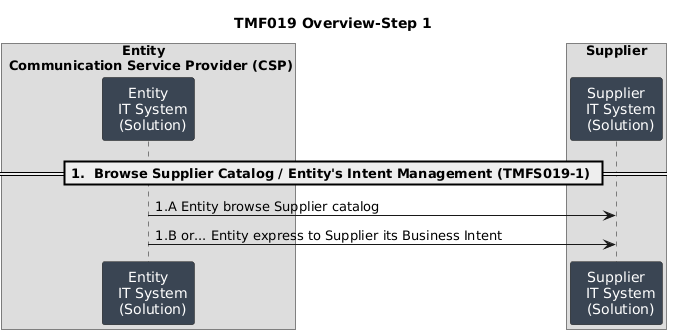
*([PlantUML source](media/browse-supplier-catalog-intent-management-sequence.puml))*

**Figure 3.1  Browse Supplier Catalog / Entity's Intent Management**

Whatever, this catalog or this ProductOffering can be Atomic (an only Product) or composed of several Atomic items.

At Supplier level, below is the illustration of SDWAN Solution (aka Composed ProductOffering) that could be proposed to the Customer.

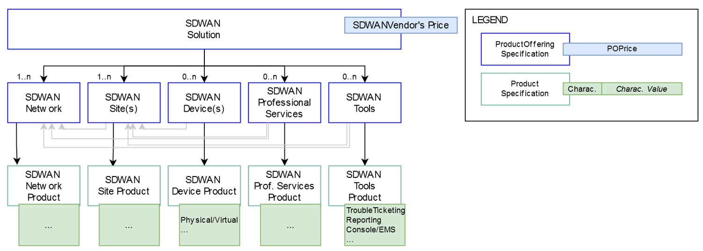
*([PlantUML source](media/sdwan-solution-product-offering-decomposition.puml))*

**Figure 3.2 Illustration of Supplier ProductOffering**

Through this simplified modeling we can see that the Supplier can propose:

-  SDWAN assets (network, sites, devices, ...)

-  Add-ons (professional services, tools, ...)
that can be dedicated to SDWAN or available for other kind of Products / Solutions.

Specific instantiation of Product / Product Offering can be described by the Supplier for the Entity (the CSP).

As an overview we could propose the following simplified representation

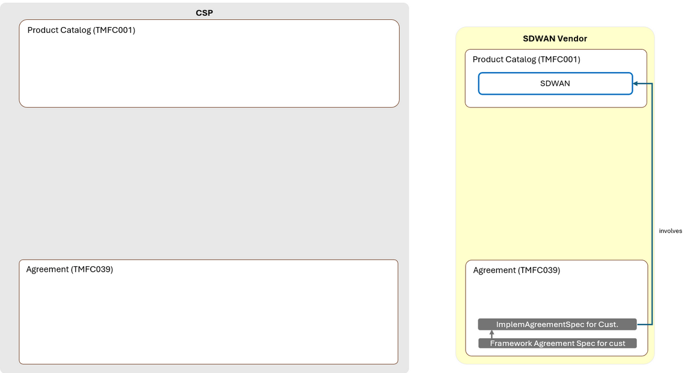
*([PlantUML source](media/csp-sdwan-vendor-catalog-agreement-view.puml))*

**Figure 3.3 Illustration for information view for Entity (the CSP) and the SDWAN Vendor (step 1)**

### Step 2 Entity / Supplier FrameworkAgreement Management 

The information focus in this step is Agreements FrameworkAgreement(type= LegalContract), Framework-Agreement and Agreement-Items.

During Step 2, Entity (the CSP) and the Supplier (here SSE Provider) define the scope and their modus operandi: 

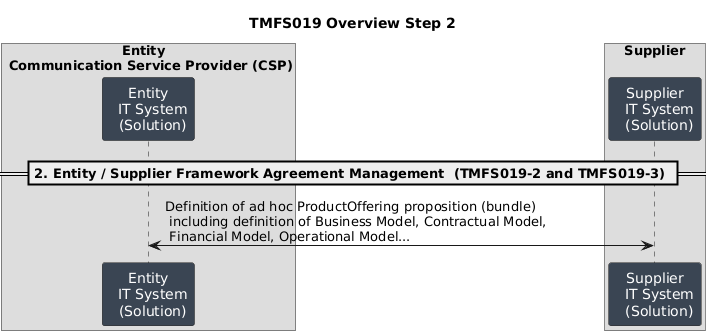
*([PlantUML source](media/entity-supplier-framework-agreement-step2-sequence.puml))*

**Figure 3.4 Entity Supplier FrameworkAgreement**

Agreement conditions can lead to the definition of a dedicated Product Catalog and the description of Terms and Conditions.

The simplified illustration proposed here shows that: 

- the Entity (the CSP) is responsible of Framework Agreement definition 
   *the Suppliers have an image of this Framework Agreement in its IT System*

- The Entity manages in its IT System a view of Suppliers Products/ProductOfferings committed through Framework Agreement

While  FrameworkAgreement(type= LegalContract) will be signed between the CSP and its Suppliers, this catalog modeling will be implemented in the CSP's IT, regarding agreement conditions

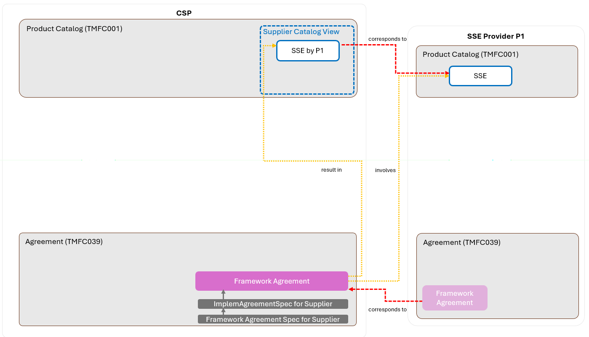
*([PlantUML source](media/csp-sse-provider-catalog-agreement-view.puml))*

**Figure 3.5 Illustration for information view for Entity (the CSP) and the SSE Provider (step 2)**

Regarding this agreement, ad hoc elements will be designed in both system give access to ad hoc actors (individuals, APP for API, ...).

### Step 3 Partner/Supplier On-Boarding  

The information focus in this step is signed FrameworkAgreement(type= LegalContract) with supporting Framework-Agreements and Implementation agreements.

Once all commercials and technical aspects are addressed and systems & process broadly agreed, Framework Agreement Management model has to be implemented manually (if few volumes are waited) or digitally / automatically (for more volumes and / or time to market constraints). 

During this step, each Partner/Supplers will be on-boarded into the Entity's Partner ecosystem.

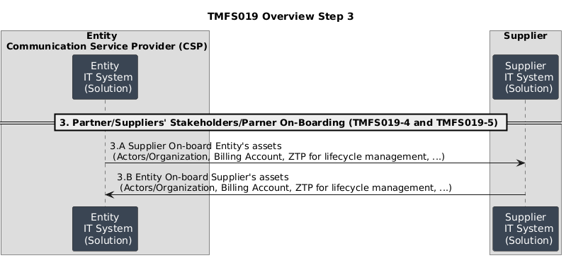
*([PlantUML source](media/partner-supplier-onboarding-step3-sequence.puml))*

**Figure 3.6 Partner Supplier Onboarding**

*For further study:  Add in components, processes and steps being defined in TMFS026 regarding Party Management.*

# Diagrams

## Sequence diagrams

This Partner Onboarding and Agreement Management process is complicated by the existence of multiple alternative approaches where each alternative is driven by reasonable business practices.

The consequence is that there is not a single simple high level linear process for each of the steps forming this use case. The alternatives can be captured by use of activity diagrams that formally capture these alternative sequences but using common Sub  process that are represented later in this section as API flows between ODA Components. 

This section shows both high-level activity charts supported by conventional TM Forum Open API sequence charts.

##  Activity Diagrams for FrameworkAgreement(type= LegalContract) and Framework-Agreement definition 

This activity diagram addresses the following sub processes for TMFS019 defined in Section 2.

***For Further Study:  ***Activities below are the internal view of the Entity driving the Partner Onboarding and Agreement Management process and production of associated FrameworkAgreements. The precise location of the API interactions (Step 1, 2 and 3 ) between Entity(CSP) and Suppliers needs review and validation when the information content of Framework Agreements has been established  (TMFS019B Part 2).

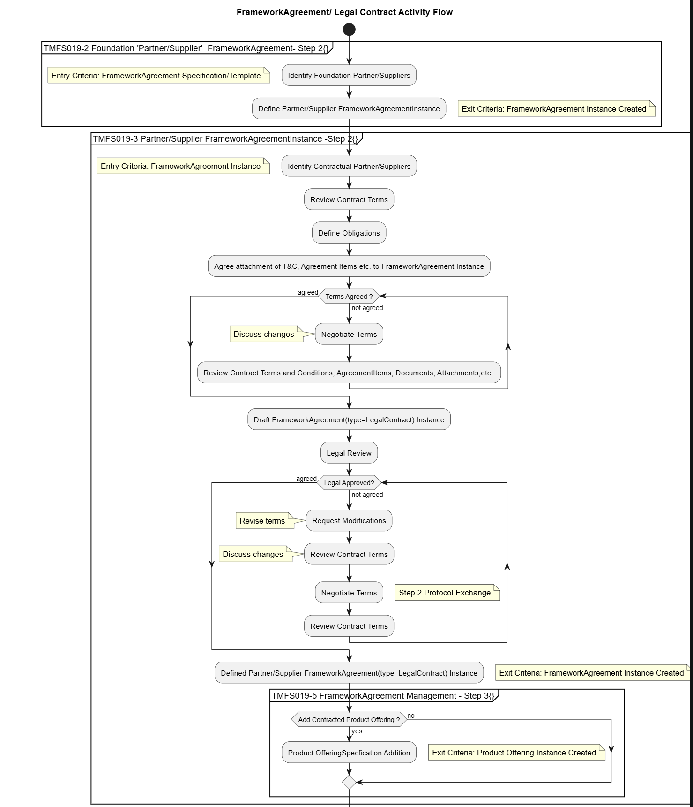
*([text description](media/framework-agreement-legal-contract-activity-flow-part1.text-description.md))*

**Figure 4.1 Framework Agreement / Legal Contract Activity Flow**

This activity chart shows how the TMFS019A sub scenario processes can be operated to support alternative process flows serving different business practices 

Each Sub Scenario process shows the entrance and exit criteria and an overview of the internal logic. Detailed Sequences charts for these are later in this section.   

There are some variations to the processes: 

- ProductOfferings may be bound to the FrameworkAgreement(type= LegalContract) at the time of signing, or later.

- Use of Framework Agreements is optional.

- FrameworkAgreement(type= LegalContract)s optionally can contain: Framework Agreements, AgreementItems, Documents and Attachments

- The Partners signing a FrameworkAgreement(type= LegalContract) may not be the same as those who defined the Framework Agreement Instance.

- Amendments to FrameworkAgreement(type= LegalContract) and Supporting parts may occur after the original signing. 

The key point is the exit criteria is always a signed FrameworkAgreement(type= LegalContract) with supporting parts including: Framework Agreements, AgreementItems, Documents and Attachments.

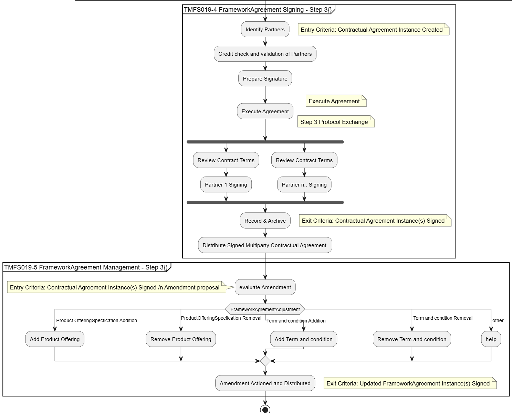
*([text description](media/framework-agreement-signing-and-management-activity-flow-part2.text-description.md))*

**Figure 4.2 Activity diagram for TMFS019A Sub Scenario processes Step 3 focus**

*Ed Note Puml Files in Activity diagrams above are available in the attached document comment files.*

## Step 1 Browse Catalog exemplar TMFS019-1

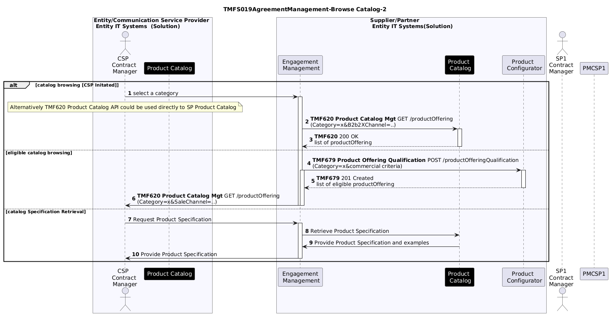
*([PlantUML source](media/browse-supplier-catalog-exemplar-sequence.puml))*

***Fig 4.2.1   Browse Supplier Catalog sequence example***

For further study: 

- Define relationships between the Entity(CSP), Product Catalog and components such as Party Management, Agreement Manager, and Engagement Management  

- Define relationships with  [TMFS026: Use Case: Open Gateway & Operate APIs _Modified Template Draft - End to end ODA - TM Forum Confluence](https://projects.tmforum.org/wiki/pages/viewpage.action?pageId=354695441)  Section 2

## Step 2 Entity Supplier High-Level FrameworkAgreement Definition Process TMFS019-2

 In developing this activity diagram, it has been necessary to define precisely the entrance and exit criteria for each of the Use Case Sub processes. These criteria are primarily based on the asset definitions needed to start the sub processes and the state of the assets when the process finishes - exit criteria.

These are documented in the earlier **table Table 2-1  TMFS019 Sub processes with Entry and Exit Criteria **

In this stage, Framework-Agreement instance will be defined between the CSP and its Providers / Partners.

This Framework Agreement will involve:

-  actors (party management, roles & rights, credentials if required.

-  catalog (regarding ProductOffering)

-  agreement

The aim here is to describe process between Partner/ Suppliers (stakeholders) (tbd). 

Detailed agreement formation and definition definition process exemplar:

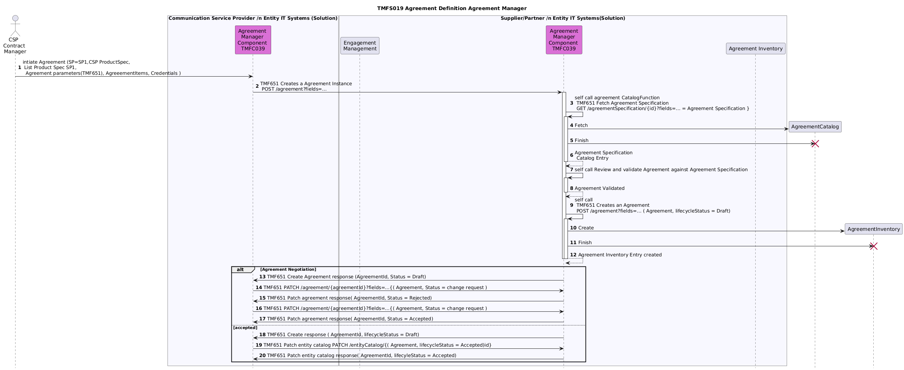
*([PlantUML source](media/agreement-definition-component-level-sequence.puml))*

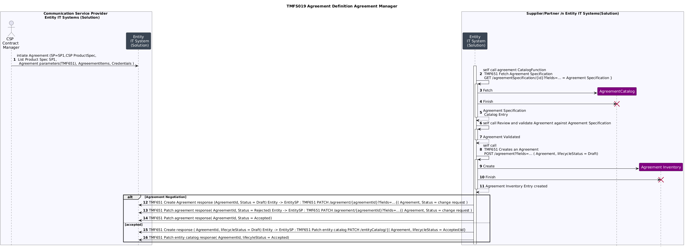
*([PlantUML source](media/agreement-definition-simplified-sequence.puml))*

**Fig 4.2.2  TMFS019 Agreement Definition Exemplar**

*Ed Notes: relationship with Party Management and Engagement Management for CSP is for further study.*

Open Issues

- Does the communication between Agreement Management components in CSP and SP need to go through engagement management?

TMFC039 Agreement Management Component draft implies the inventory for agreement (inventory) is contained within the Agreement Management Component but the specification i.e .Agreement Catalog is not within the current TMFC039 specification.

- The TMF651 API can support either configuration.

## High Level Framework Agreement Management process (tbc)

In this stage, 

- CSP's actors / system (APP, ...) will be declared in Provider eco system to be able to access to ad hoc process / data
for example trouble ticket solution to create, update, consult trouble ticket related to InstalledProducts engaged in the relationship

- Provider (operational model 1 & 2), Partner (operational model 2)' actors / systems (APP, ...) will be declared in CSP ecosystem to be able to access to ad hoc process / data 
for example usage / analytics solutions to fulfill ad hoc data in CSP eco system

For example, Operational processes from TMF931 list processes that a Channel Partner (aka CSP for our Use Case) can generate, through Operate API, in its Providers eco system

-  Application Owner on boarding,

-  Application (APP) management,

-  Service API order, management, ...

See dedicated use case TMFS026 for more information.

# Conclusion

## Lessons learned

The key learning points from developing this Use Case Scenario include:

- It is critical for effective B2B2X Partnering to have a consistent framework for defining Agreements and Contracts that can be used for wide range of B2B2X scenarios supporting diverse business models.
An initial view of the B2B2X Framework was published in:

- [Online B2B2X Partnering Step-by-Step Guide R18.0.1 (TR211)](https://www.tmforum.org/resources/technical-report/tr211-online-b2b2x-partnering-step-by-step-guide-r18-0-0/)

- This set out repeatable scalable patterns for form business partnering agreements

- [IG1317 ODA DSE Platform Extensions & Patterns for B2B, B2B2X & Partner Ecosystems ](https://www.tmforum.org/resources/introductory-guide/ig1317-oda-dse-platform-extensions-patterns-for-b2b-b2b2x-partner-ecosystems-v3-0-0/)v3.0.0 which takes TR211 to the architectural implementation level including the notion of Digital Service Enablement

- Arising from this study, those frameworks are supported by implementation artifacts which include 

- This use case scenario TMFS019A.

- Information Model (SI ) extensions to support Agreements and Contracts.

- API : [Agreement Management API TMF651-v4.0](https://www.tmforum.org/oda/open-apis/directory/agreement-management-api-TMF651/v4.0)

- ODA Component: [Agreement Management | TM Forum ODA Component Directory](https://www.tmforum.org/oda/directory/components-map/party-management/TMFC039)

- :Concrete attributes/ characteristics extensions to support the Agreement API:

-  Contract attributes: The development of this use cases required investigation of work in sources active in the Legal and commercial spheres.
It is important that Contract attributes are aligned with industry best practice to allow B2B2X solutions to work in industry verticals such as Construction, Logistics, IoT etc.

- Agreements: In particular Implementation Agreement require Telecom specific attributes and characteristics which are at the next level of detail as compared with SID and API core Data Models.
Such extensions need to be documented in use case specific detail. As an example, see [TMFS018: Use Case: Wholesale Broadband v1.0.0 E2E-699](https://projects.tmforum.org/wiki/display/ETEO/TMFS018%3A+Use+Case%3A+Wholesale+Broadband+v1.0.0+E2E-699) 
and recorded in a formal ontology specifications and controlled vocabularies.  Candidates are defined the annex to this document.  Other TM forum examples are in IG1253  and  IG1379 Metadata Driven Automation.

## Impacts identified

Associated with this use case is a proposal to updates and additions to TM Forum Information Framework classes mostly focused on Agreement and related entities.

Both the Information Framework (GB922) Agreement ABE models and the TMF651 Agreement Management API are evolving, and it is likely that this document will need to be adjusted to reflect those changes.

# Appendix

There are several current work items in progress and historical collaboration team results that are used in the definition of the main use case.

These appendices describe the: 

- The current SID Agreement Model proposal covering Agreement, AgreementItem, FrameworkAgreement(type= LegalContract), Framework Agreement Implementation Agreement.
The details of the proposed changes are in [ISA-1197](https://projects.tmforum.org/jira/browse/ISA-1197) [Review Agreement Concept](https://projects.tmforum.org/jira/browse/ISA-1197) and [ISA-757](https://projects.tmforum.org/jira/browse/ISA-757)  [Review SID Agreement ABE](https://projects.tmforum.org/jira/browse/ISA-757)

- The TMF651 Agreement Management API model proposals for Version 5 

- The Partnership Management API TMF688 which maybe be deprecated in favour of new Collaboration Management APIs.

## SID Agreement Model 

This section provides a summary of the main features of the SID Agreement models in [ISA-757](https://projects.tmforum.org/jira/browse/ISA-757)

**Agreements**

Based on current SID team discussion the relevant models for Agreement and Agreement Specifications are: 

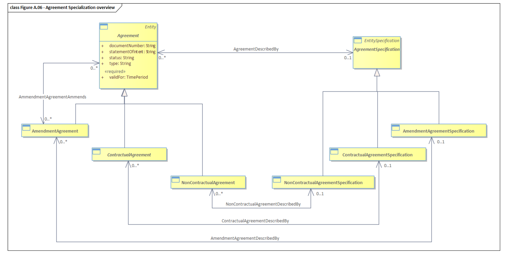
*([PlantUML source](media/agreement-main-specializations-class-diagram.puml))*

**Figure 6.1 Agreement - Main Specializations**

This shows

- The separation of Specifications from entities instances which is a SID established convention. This allows definition of relationships among instances and among specifications to be different.

- An AmendmentAgreement allows changing terms or conditions defined in a previously validated version of an Agreement. It may concern any type of agreement. So, it inherits directly from Agreement.

- A FrameworkAgreement(type= LegalContract) is a type of Agreement governed by laws or any type of legal rules. A FrameworkAgreement(type= LegalContract) is a Contract aka as Legal Agreement.

- A NonContractual-Agreement is a specific type of agreement that is not governed by laws or legal rules. It corresponds either to an informal agreement or an internal agreement.

- Both agreement and Contractual Agreement are modelled as Abstract classes.

**Non-Contractual Agreement**

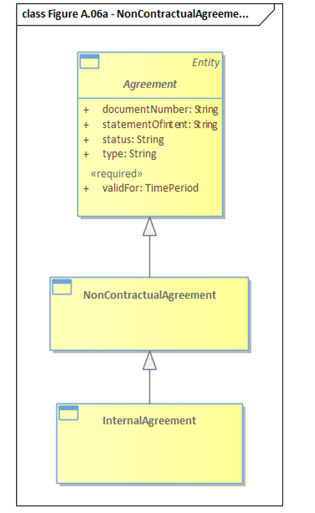
*([PlantUML source](media/non-contractual-agreement-specializations-class-diagram.puml))*

**Figure 6.2 Non-Contractual Agreement Specializations**

NonContractual-Agreement is considered as an concrete BE. So, it can be used to represent some additional types of non legally binding agreements that are not identified as subclasses.

Example: –A Memorandum Of Understanding (MOU) is type of agreement between several parties that could be in different registered companies. This type of agreement is in almost all cases non-binding.

An InternalAgreement is a specific type of NonContractual-Agreement that can occur between two (or more) entities of the same registered company. These entities can correspond to different establishments or services in the same company.

**Contractual Agreement**

Key Contractual Agreement concept are shown in the following diagram 

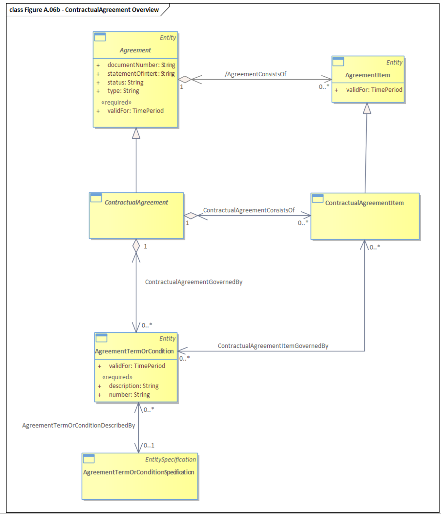
*([PlantUML source](media/contractual-agreement-overview-class-diagram.puml))*

**Figure 6.3 Contractual Agreement Overview **

ContractualAgreements are bound by Terms and Conditions.  In addition, individual items (ContractualAgreementItems) that make up a ContractualAgreement may be bound by their own set of terms and conditions.  Terms and Conditions can include such things as exclusions, legal issues, and contract termination clauses.  The figure depicts the relationships that Contractual-Agreements have with Terms and Conditions.

AgreementTermsOrConditionSpecification specifies a set of Terms or Conditions that can formally apply to an ContractAgreementSpecification.

In OASIS eContract some of these entities Terms and Conditions, Agreement Items are captured in a legal document metaphor that has Documents and Attachments to a Legal Contract (aka FrameworkAgreement(type= LegalContract)) which is also supported in TMF 651 Agreement API described later.

**Contractual Agreement Types**

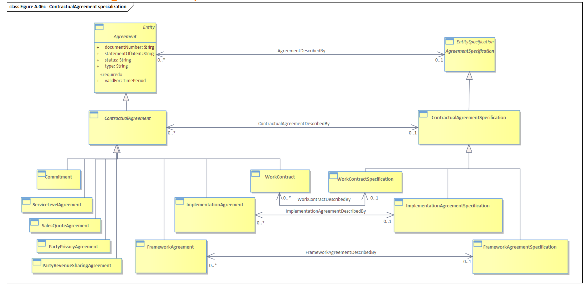
*([PlantUML source](media/contractual-agreement-specialization-class-diagram.puml))*

**Figure 6.4 Contractual Agreement specialization**

**Types of Contractual Agreement **

- A Commitment is a detailed description of the mutual agreement between parties about services, products, resources or some other kind of deliverable that has to be provided by the party playing the role of a Commitment fulfiller to the party, playing the role of a Commitment procurer.

- A Service Level Agreement (SLA) is a type of ContractualAgreement that represents a formal negotiated agreement between two parties designed to create a common understanding about products, services, priorities, responsibilities, and so forth.

- A SalesQuoteAgreement is a type of ContractualAgreement. It enables tracking the approval made by a Party playing the role of Customer of a technical & commercial proposal (materialized as an SalesQuote) from the Company. Once approved by the Company and the Customer, the SalesQuote becomes a type of ContractualAgreement represented as an SalesQuoteAgreement.

- A PartyPrivacyAgreement is a type of Contractual-Agreement. It enables tracking the approval of the company's Privacy conditions, made by the Party either globally for a PartyPrivacyProfile or just for a specific PartyPrivacyProfileCharValue.

**Framework Agreement**

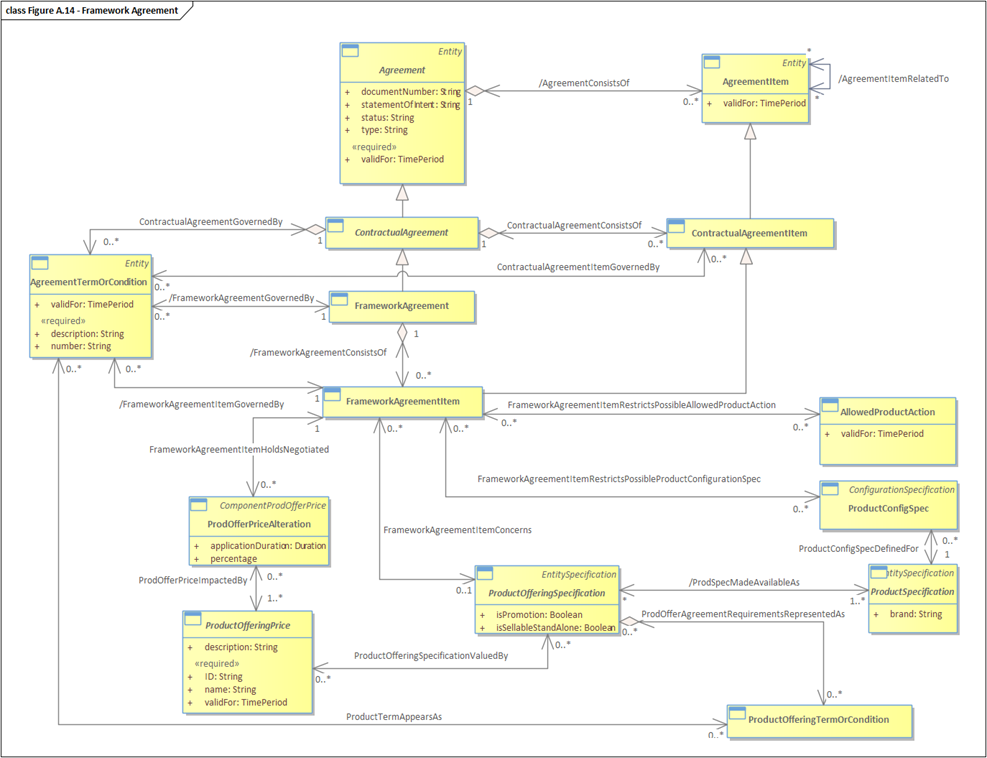
*([PlantUML source](media/framework-agreement-class-diagram.puml))*

**Figure 6.5 Framework Agreement **

Key concepts:

- A Framework-Agreement (aka Master Service Agreement) depending on company vocabulary) defines the general rules under which the Organization and a third party will work together.

- A Framework-Agreement can be established between an Organization and a Customer (generally B2B or B2B2X), an Organization and its Supplier or Partner. The latter being the focus of this use case.

- A Framework-Agreement can include a set of FramewokAgreementItems that may concern, for example, negotiated Prices of ProductOfferingSpecification, Restriction on ProductSpecification Characteristics possible values through ProductConfigSpec, Restriction on AllowedProductAction, Ethic clauses, Security clauses, Privacy clauses, Nondisclosure clauses, Payment clauses, Revenue share clause, Liquidated damages, Responsibility, Target customers…

Optionally but not used in this use case::

- CustomerProductOrders can be associated to Framework-Agreement through an ImplementationAgreement. There is no direct relationship between Framework-Agreement and CustomerProductOrder.

- ProductOfferingInstances and Product can be associated to Framework-Agreement through an ImplementationAgreement. There is no direct relationship between Framework-Agreement and ProductOfferingInstance and Product.

**Framework Agreement example - CSP ( entity) Catalog**

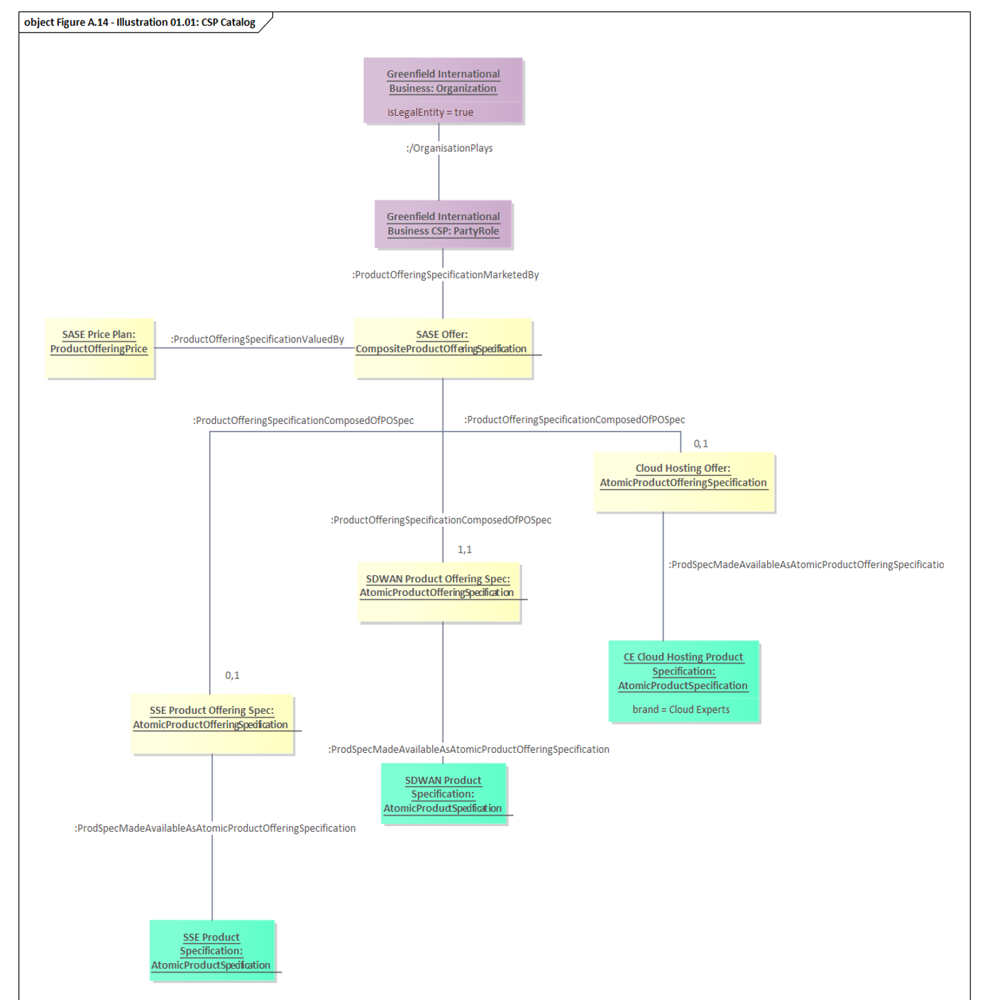
*([PlantUML source](media/framework-agreement-csp-catalog-example-object-diagram.puml))*

**Figure 6.6 Framework Agreement example - CSP Catalog**

This example shows the catalog that will be used for the illustration of FrameworkAgreement and ImplementationAgreement.

- The company Greenfield International Business plays the role of CSP.

- As a CSP, it markets a SASE offer (CompositeProductOfferingSpecification).

- This composite offer includes 3 atomic offers:

- SDWAN AtomicProductOfferingSpecification,

- SSE AtomicProductOfferingSpecification

- Cloud Hosting AtomicProductOfferingSpecification.

- In real life, all these ProductOfferingSpecifications correspond to complex CompositeProductOfferingSpecification. To simplify the explain the modeling concepts, it has been decided to represent here AtomicProductOfferingSpecification with associated AtomicProductSpecification.

- Cloud Hosting AtomicProductOfferingSpecification corresponds to a ProductSpecification provided by Cloud Experts supplier. The description of the supplier offer is provided in Figure A.14 - Illustration 01.02: CSP Catalog - Supplier Offer.

**Framework Agreement CSP Catalog to Supplier Offer example**

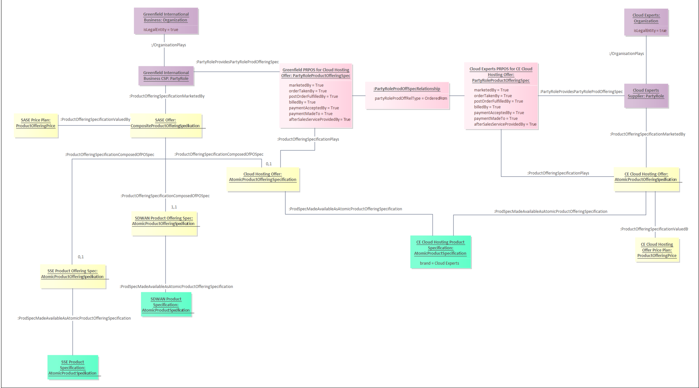
*([PlantUML source](media/framework-agreement-csp-catalog-supplier-offer-example-object-diagram.puml))*

**Figure 6.7 Framework Agreement CSP Catalog to Supplier offer example **

This example shows  the catalog that will be used to  illustrate Framework-Agreement and ImplementationAgreement.

- The company Greenfield International Business plays the role of CSP.

- As a CSP, it markets a SASE offer (CompositeProductOfferingSpecification).

- This composite offer includes 3 atomic offers:

- - SDWAN AtomicProductOfferingSpecification,

- - SSE AtomicProductOfferingSpecification

- - Cloud Hosting AtomicProductOfferingSpecification.

- In real life, all these ProductOfferingSpecifications would correspond to complex CompositeProductOfferingSpecification. To simplify the understanding of the modeling concepts, we decided to represent here AtomicProductOfferingSpecification with associated AtomicProductSpecification.

- Cloud Hosting AtomicProductOfferingSpecification corresponds to a ProductSpecification provided by Cloud Experts supplier.

- Cloud Expert can either sell this product:

- - to its customer through its CE Cloud Hosting AtomicProductOfferingSpecification,

- - to Greenfield International Business customers through Greenfield International Business.

**Implementation Agreement**

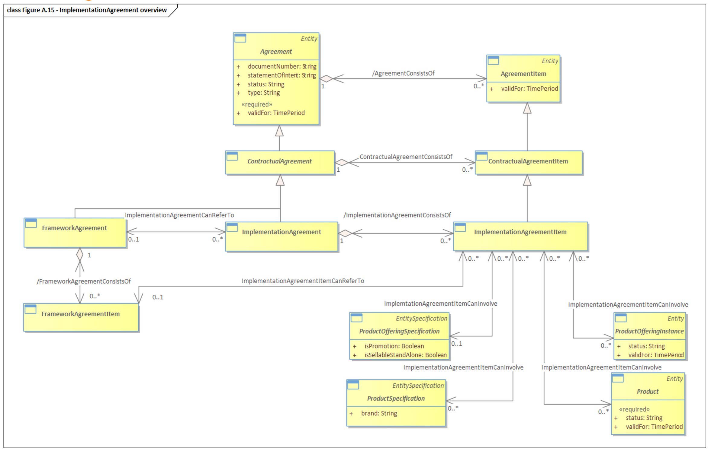
*([PlantUML source](media/implementation-agreement-overview-class-diagram.puml))*

**Figure 6.8 Implementation Agreement Overview**

An ImplementationAgreement corresponds to a Contractual-Agreement related to the delivery of ProductOfferingInstances and their associated Products.

An ImplementationAgreement can be related to a Framework-Agreement. In this Case, it benefits from the conditions negotiated within the Framework-Agreement (ProductOfferingPrice, AgreementTermOrCondition, AgreementItemPrice…).

**Implementation Agreement Details**

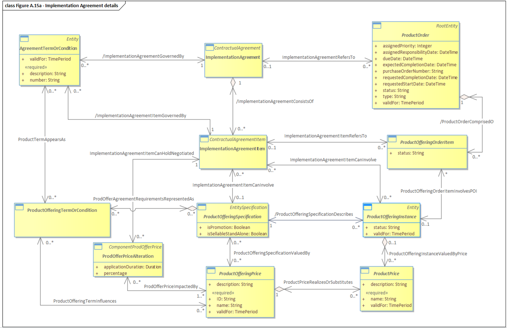
*([PlantUML source](media/implementation-agreement-detail-class-diagram.puml))*

**Figure 6.9 Implementation Agreement Detail**

- An ImplementationAgreement is a type of Contractual-Agreement related to the delivery of ProductOfferingInstances and their associated Products.

- In a stable status, an ImplementationAgreement shall refer to 1 to several ProductOrder. The same applies for ImplementationAgreementItem. It shall refer to 1 to several ProductOfferingOrderItem that correspond to the ordering of ProductOfferingSpecification associated to the ImplementationAgreement.

- Note: As the ImplementationAgreement may be created before the ProductOrder, the cardinality shown in this diagram is 0..*. But in a stable state, an ImplementationAgreement refers to at least 1 ProductOrder. The same applies to ImplementationAgreementItem.

- As CustomerProductOrder  / CustomerProductOfferingOrderItem and BusinessPartnerProductOrder / BusinessPartnerProductOfferingOrderItem inherit from ProductOrder / ProductOrderItem, the relationships with ImplementationAgreement / ImplementationAgreementItem described in this figure are also valid for CustomerProductOrder / CustomerProductOfferingOrderItem and BusinessPartnerProductOrder / BusinessPartnerProductOfferingOrderItem.

- The ImplementationAgreement can redefine, for the associated ProductOrder, some Terms or Conditions (AgreementTermOrCondition) and Prices (ProdOfferPriceAlteration) even if the ImplementationAgreement is associated to a Framework-Agreement in which terms, conditions and prices were already agreed.

**Implementation Agreement Example - Implementation Agreement between CSP (Entity) and Supplier **

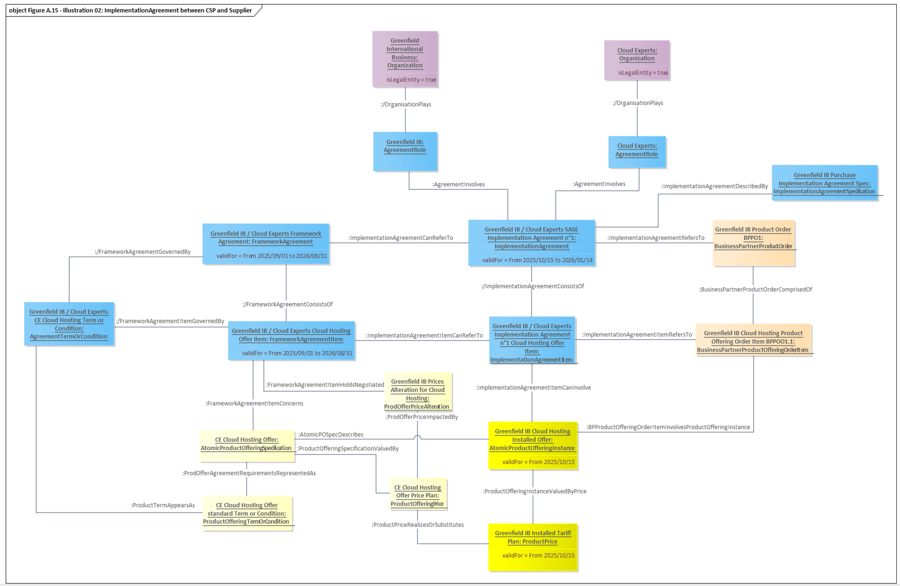
*([PlantUML source](media/implementation-agreement-csp-supplier-example-object-diagram.puml))*

**Figure 6.10 Implementation Agreement example - Implementation Agreement between CSP (Entity) and Supplier **

This example illustrates an Implementation Agreement between Greenfield International Business (Greenfield IB) and Cloud Experts for the order of a Cloud Hosting offer.

- After the approval of the first sale made by Greenfield IB to MEF Systems (ImplementationAgreement between CSP and Customer),
Greenfield IB ordered Cloud Hosting Offer from Cloud Experts in order to be able to deliver the SASE Offer to MEF Systems.

- According to Greenfield IB process, an ImplementationAgreement has to be generated to formalize the purchase of the Cloud Hosting Offer before placing the corresponding BusinessPartnerProductOrder to Cloud Experts.

- An ImplementationAgreement is created between Greenfield IB and Cloud Experts for the delivery of Cloud Hosting Offer and Product.

- The ImplementationAgreement is produced by Greenfield IB based on its standard Purchase ImplementationAgreementSpec.

- The ImplementationAgreement and the ImplementationAgreementItem refer to the approved Framework-Agreement and Framework-AgreementItem.

- The Implementation Agreement is valid for 2 months (corresponds to the estimated time required to deliver the Cloud Hosting Product and Offer to Greenfield IB) from the 15th of October 2025. It is formalized through a Document that includes all elements (not represented in this figure to limit its size).

- In this example, the ImplementationAgreement has one ImplementationAgreementItem.

- This ImplementationAgreementItem concerns Cloud Experts BusinessPartnerProductOfferingOrderItem related to Cloud Experts Cloud Hosting Offer.

- This CustomerProductOfferingOrderItem will deliver a Cloud Hosting Offer instance to Greenfield IB.

- With the Framework-AgreementItem related to Cloud Hosting offer, Greenfield IB benefits from specific prices alteration (ProdOfferPriceAlteration) that impact the Cloud Hosting offer price plan (ProductOfferingPrice) and be formalized as an Installed Tariff (ProductPrice) specific for Greenfield IB.

**Framework agreement and Sales Opportunity**

In most of the B2B and B2B2X cases, before accepting any CustomerOrder from a prospect, a Framework-Agreement has to be established.

- A Framework-Agreement defines the general rules under which the Organization and third parties (that are not part of the same registered company than the Organization) will work together.

- As Framework-Agreement production requires workload and negotiation on ProductOfferingSpecification prices and / or Terms or Conditions and also general rules under which the Organisation and third parties will work together, it may not be established for a prospective customer before the creation of a first SalesOpportunity  So, the first SalesOpportunity for a prospective customer may trigger the production of a Framework-Agreement.

- In the case of a Framework-Agreement not concerning prospective customer or customer, a first SalesOpportunity is not needed to create a Framework-Agreement.

- Once a Framework-Agreement is validated and agreed by the CSP and its prospective customer or customer, SalesOpportunity may be created based on the elements negotiated in this Framework-Agreement. At least the initial SalesOpportunity that triggered the production of the Framework-Agreement is associated with it.

- SalesOpportunityItem concerns 1 ProductOfferingSpecification. As for Framework-Agreement, the first SalesOpportunityItem will trigger the creation of a corresponding Framework-AgreementItem.

- Once Framework-Agreement is approved, its Framework-AgreementItem will be used to produce SalesOpportunityItem.

These are the key entities defined and used during the processes within the partner Onboarding and Agreement Management Use Case.

## TMF651 Agreement Management API v5

[Agreement Management API TMF651-v5.0](https://www.tmforum.org/oda/open-apis/directory/agreement-management-api-TMF651/v5.0)

The use cases in this API that underpins the Agreement formation processes refer to use cases in TMF668 Partnership Agreement API 

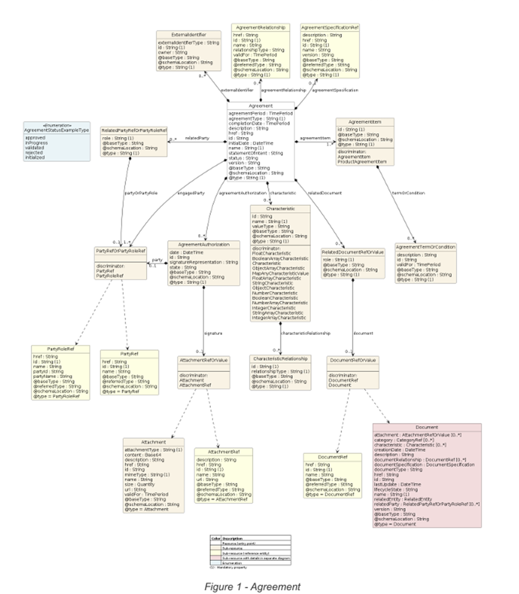
*([PlantUML source](media/core-agreement-api-resource-model-class-diagram.puml))*

**Figure 6.11  Core Agreement API Resource Model**

The key entities are:

- Agreement and Agreement type

- Agreement Items

- AgreementTermorCondition

- Document

- Attachment

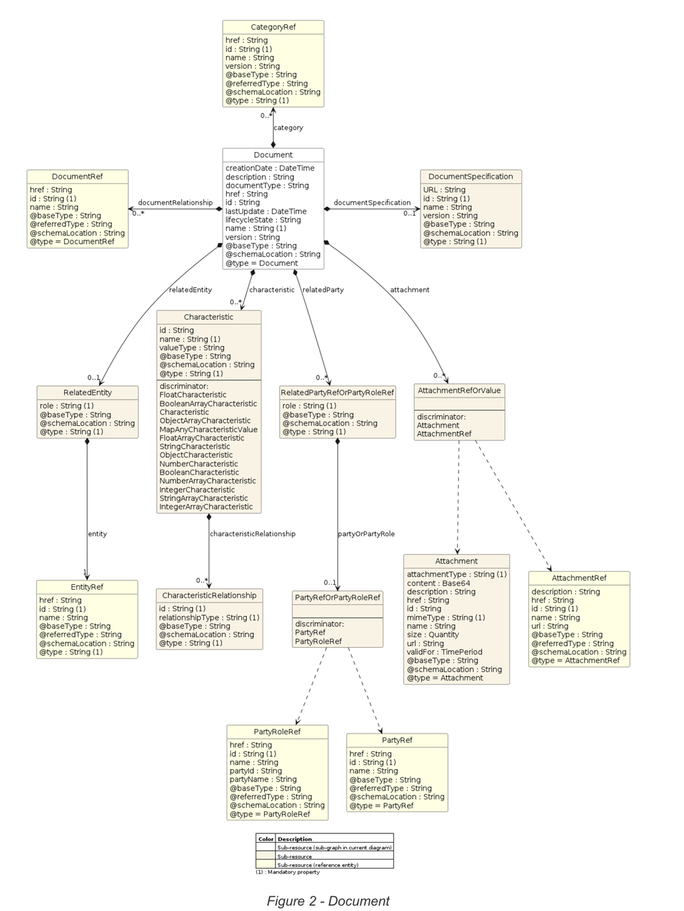
*([PlantUML source](media/document-attachment-resource-model-class-diagram.puml))*

**Figure 6.12 Document/ Attachment Resource Model**

## TMF668 Partnership Management API

[Partnership Management API TMF668-v4.0](https://www.tmforum.org/oda/open-apis/directory/partnership-management-api-TMF668/v4.0) includes some simple use cases. However, these are mostly focused on partners connecting to an ecosystem and making product offering available.

Partnership is not defined in The SID, but it is reasonable to interpret it as an type of Contractual-Agreement as it does not have properties or attributes that differ from ContractualAgeement.  Partnership can be considered a as ContractualAgrement with Type set equal to string Partnership.

This API needs to be reviewed and integrated, or updated, to align with this Use Case. However, there is a review taking place to align four related APIs namely:

- T[MF792 Collaboration Model Management API](https://projects.tmforum.org/wiki/display/AP/TMF792+Collaboration+Model+Management+API?src=contextnavpagetreemode)

- [TMF793 Collaboration Management API](https://projects.tmforum.org/wiki/display/AP/TMF793+Collaboration+Management+API?src=contextnavpagetreemode)

- [Partnership Management API TMF668-v4.0](https://www.tmforum.org/oda/open-apis/directory/partnership-management-api-TMF668/v4.0) and v5

- [Agreement Management API TMF651-v4.0](https://www.tmforum.org/oda/open-apis/directory/agreement-management-api-TMF651/v4.0) and v5

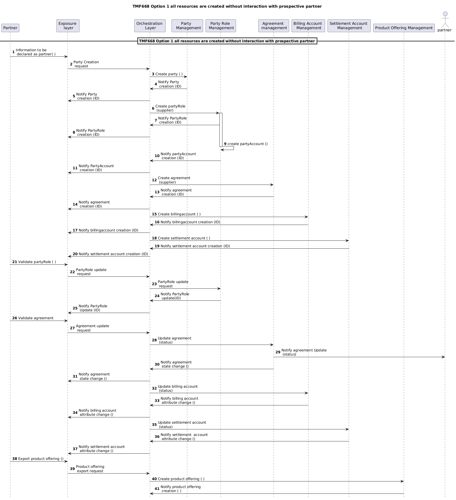
*([PlantUML source](media/tmf668-option1-partner-onboarding-sequence.puml))*

# Terms & Abbreviations Used within this Document

## Terminology

| Term | Definition | Source |
| --- | --- | --- |
| Partnership | A Partnership is an association of several stakeholders who, while each maintaining their autonomy, agree to pool their efforts in order to achieve a shared objective related to a clearly identified problem or need in which they have an interest, a responsibility, a motivation, or even an obligation. NOTE not modelled in the SID | TMF071 v16 andIG1265 ODA: Partnership Digital Service Enablement v1.0.0 |
| Stakeholder | Dictionary definition: | Not defined in TMF071 |
| Partner | A SID Party Role | SID |
| Supplier | A SID Party Role | SID |

