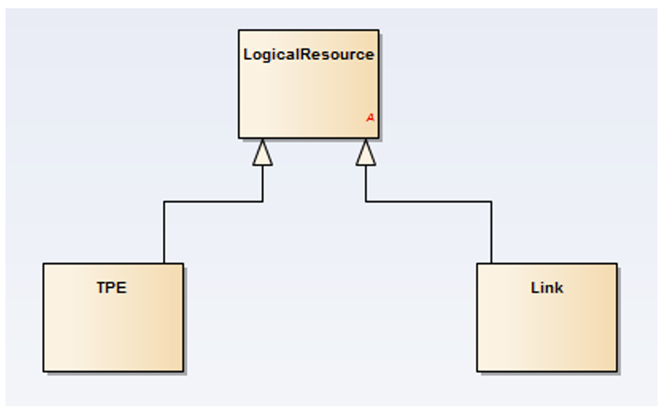
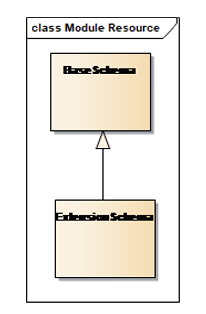
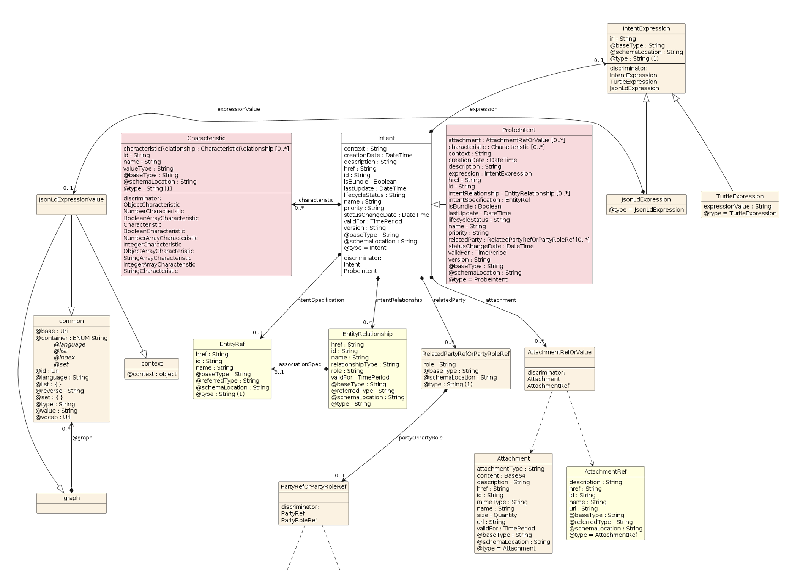
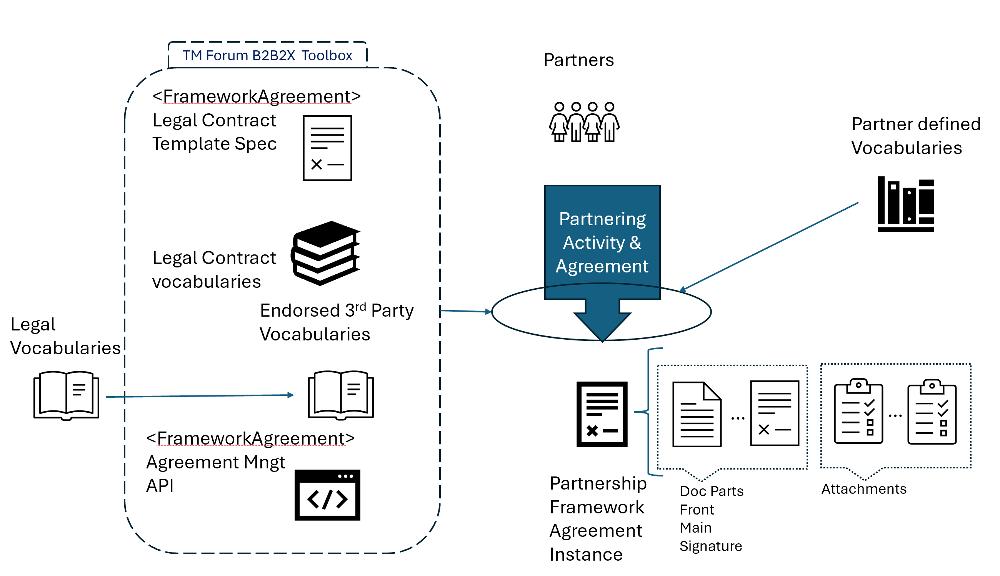
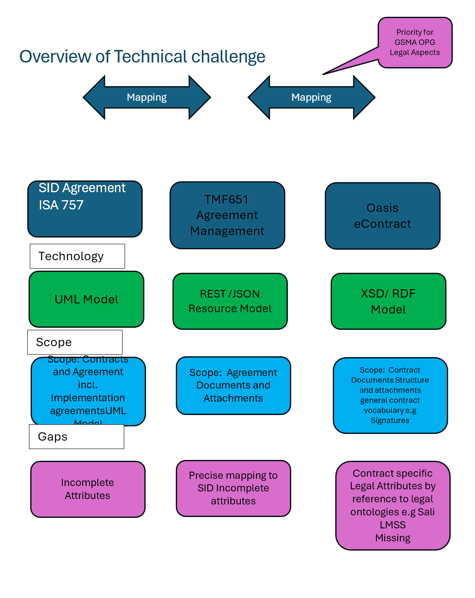
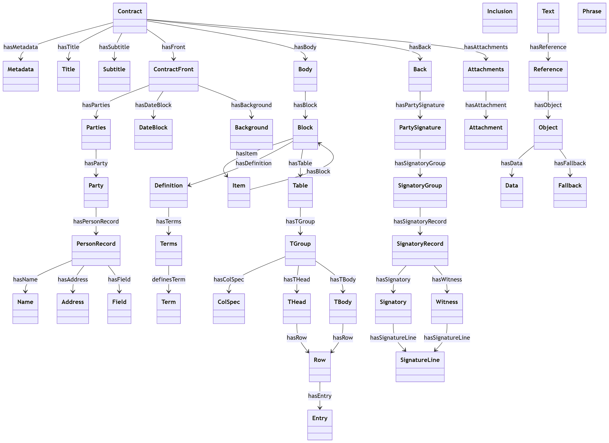
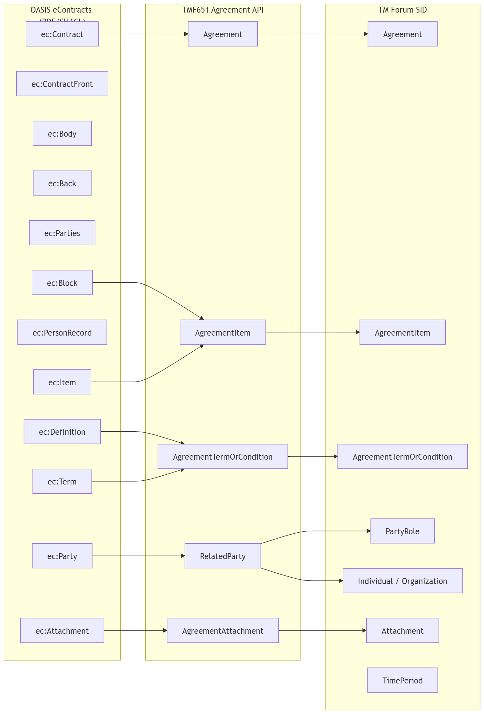
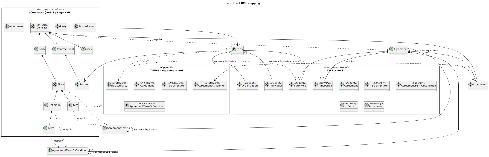

# Executive Summary

The use case TMFS019 Part 1 Onboarding with Agreement Management sets out the processes needed to form agreements of various types between an Intermediary Entity (CSP) and their Suppliers.

It uses results from the Information Framework aka SID Agreement ABE, and TMF 651 Agreement Management API, which set out the structure for Agreements of several types, including Framework-Agreement, Implementation-Agreement and Internal-Agreements. 

However, for practical use, parts of these Agreements, especially Framework-Agreements require additional attributes/characteristics to be defined and incorporated into the API payload. For Legal Aspects of Contractual Agreement reference to standards developed in multiple Legal Industry Groups is required.

This Part 2 provides examples of best practice to add this data/information which might arise from many sources: legal industry standards, telecom practices, member company practices and the TM Forum. The approach is based on concepts arising from the W3C Semantic Web initiatives.

It describes Proposed Ontologies Ontology elements and Code List for Agreements, the methodology options and principles for adding extensions, and examples of extensions with an initial focus on Legal Aspects that need to be incorporated into Framework-Agreements which is a requirement arising from the TM Forum Work on GMSA Open Gateway Project.

Other examples will be added as they are identified and contributed by members. 

It is expected this document will develop over time, and that some of the TM Forum Controlled content will migrate to formal Ontologies mastered in GitHub and/or at an TM Forum controlled URL/IRI.

# Introduction

## Context or Background

The use case TMFS019 Part 1 Onboarding with Agreement Management sets out the processes needed to form agreements of various types between an intermediary Entity (CSP) and their Suppliers.

Using results from the Information Framework aka SID Agreement ABE and TMF 651 Agreement Management API it is possible to model business concepts such as:

- Agreement and Agreement-Type

- Agreement Items,

- AgreementTermOrCondition

- Document

- Attachment

and a set of SID Agreement types such as: 

- ContractualAgreement

- Framework-Agreement

- Internal-Agreement

- Implementation-Agreement 

- Others, etc.

Whilst the SID results do address the structural aspects of Agreements of many types, the practical use of APIs requires adding additional attributes and characteristics to form practical Contractual-Agreements and Framework-Agreements. 

As there are a wide range of Parties forming Contractual- and Internal-Agreements, in many business contexts and jurisdictions, it is challenging specifying all the possibilities in the core Agreement API since: 

- It requires a range of skills across multiple disciplines, ranging from legal and procurement, to engineering.

- Every additional Attribute requirement could need the API schemas to be updated, requiring a new API versions and Compatibility Test Kit(CTK) to be generated, and re-certification of APIs.

- The volume of such changes is potentially very high (prior experience with Telecom Exchange/Marketplace have indicated that typical change volume could be measured in 100's of changes per month). 
and where resolving these extensions is time-critical for the business proposing them.

*Ed Note this Part 2 focuses on Information and data modelling so many sections of the standard use case template are not relevant to this part.*

## Business requirements

 It is reasonable to assume that the requirements for API data model extensions are:

- Support the processes and principles outlined in the 'Onboarding partner and Agreement Management'  Use case TMFS019 for the formation of practical and useable Agreements for B2B2X scenarios with an initial focus on Framework Agreements.

- Support for the processes described in IG1317 ODA DSE Platform extensions & Patterns for B2B, B2B2X and partner ecosystems v4.1.0   Sections [6. Here ](https://projects.tmforum.org/wiki/pages/viewpage.action?pageId=295934228) 

- Allow API users to be able to extend API data models independently of TM Forum in a standardised way without requiring changes to the core APIs.

- Support changes from multiple sources, such as legal bodies, using their standards 'as is' without translation wherever possible. 

This implies the need for an 'open world' model as typified by the W3C Semantic Web Ref 3

## Objective of the use case

TMFS019 Part 2 focuses solely on the methodology and principles, mechanisms and ontologies for adding attributes and characteristics to the Agreements formed in TMFS019 Part 1 On-Boarding  Partners and Agreement Management scenario.

This document is a best practice recommendation with examples. 

Whilst the initial creation, modification and deletion of the Agreement (CRUD) is within the use case TMFS019, the examples in Section 6 of IG1317 show that modifications and additions are made to agreements during later use cases e.g. TMFS020 Multi Domain B2B2X Contract Management (cRUd),

The current expectation is that the lifecycle of an Agreement is independent of individual use cases that describe process steps for B2B2X, including:  TMFS019 /020/021/022/023/024 and TMFS026.

## Scope and assumptions

### Scope

This Part focuses on identifying and curating /ratifying sources of Attribute specifications to support the Agreement structure proposed in TMFS019 and their inclusion and use in the TMF651 Agreement Management API.

*Ed Note: In this version we document in data dictionary style tables. Once some stability has been achieved we will translate them into formal semantic Web RDF specifications using the Turtle syntax which can be translated **losslessly** to JSON-LD by multiple tools and **services and** then incorporated into TMF651 API implementations. This follows the best practices established in the Intent Ontology work (IG1253) in the Autonomous Networks project.*

### Assumptions

For use of TMF 651 Agreement Management API in establishing and maintaining Framework Agreements (aka Legal Contracts):

- API users to be able to extend API data models independently of TM Forum in a standardised way without requiring changes to the core APIs.

- Support changes from multiple sources such as legal bodies using their standards 'as is' by reference, and without translation wherever possible.

- The support for SID Agreement types will in be achieved in TMF651 through the @type @referedtype extension mechanism and supporting JSON extensions for each agreement type. 

- A primary concern is to ensure adding these data ontologies to TMF651 does not break backward compatibility, whilst being able to capture the SID model Class Names.

# Description

## Organization of contents

The following sections address four aspects:

- Section 3: Structuring of agreements and their ontologies into specific views: Contractual, Business, Financial and Operational Models following TR211 Partnering Onboarding guide and their alignment/integration with IF/SID and API models.

- Section 3: The identification of ontologies required to support each view, and detailed ontology elements for each ontology. Note some maybe specified and governed by TM Forum, and others may reference Ontologies and their elements governed by other organizations.

- Section 6: The mechanisms for adding ontology elements to the Agreement Open API TMF651 reusing mechanism recommended in TMF921 for TIO Ontology.

- For further study: Appendices for TM Forum governed ontologies that provide RDF(Resource Description Framework) descriptions of Ontology vocabulary elements, and their JSON equivalents. Ultimately these will be replicated in an TM Forum managed  GitHub repository.

##  Ontology 

Ontologies allow for open world models where vocabularies from multiple sources can be federated and evolved. These are unlike UML models that have a fixed scope, a single source of governance and where federation is achieved by adaptions rather than by direct reference.

The description in this section is based on W3C Semantic Web Ontologies viewpoint.

### What an Ontology Is (W3C View)

Ontologies are a subclass of the looser concept of a **vocabulary** which is a **collection of defined terms** used to describe a domain. A vocabulary provides:

- A list of terms (classes, properties, codes, labels)

- Human‑readable names and definitions

- Sometimes identifiers (URIs)

Vocabularies may include **little or no formal semantics** beyond naming and basic descriptions. They are often used to ensure people and systems use the **same words for the same things**, reducing ambiguity and inconsistency.

 Ontologies are a stricter subclass of vocabulary. In the **W3C Semantic Web**, an **ontology** is a *formal, machine‑interpretable specification of a shared conceptualization of a domain*. It defines:

- **Classes** (types of things)

- **Properties** (relationships and attributes)

- **Constraints and axioms** (rules that govern how concepts relate)

Ontologies allow data to have **explicit meaning** that machines can process, reason over, and integrate across systems, rather than relying on implicit human interpretation. [[w3.org]](https://www.w3.org/OWL/), [[en.wikipedia.org]](https://en.wikipedia.org/wiki/Web_Ontology_Language)

### Core W3C Standards Used for Ontologies

RDF (Resource Description Framework)

- RDF is the **foundational data model** of the Semantic Web.

- It represents knowledge as **triples**: *subject – predicate – object*, identified using URIs.

- RDF enables data to be linked and merged across sources on the Web. [[w3.org]](https://www.w3.org/OWL/), [[atlan.com]](https://atlan.com/know/rdf-vs-owl/)

| RDF answers: “What facts exist?” |
| --- |

RDFS (RDF Schema)

- RDFS extends RDF with basic modeling constructs:

- rdfs:Class

- rdfs:subClassOf

- rdfs:domain / rdfs:range

- It enables simple taxonomies and type hierarchies. [[stackoverflow.com]](https://stackoverflow.com/questions/1740341/what-is-the-difference-between-rdf-and-owl)

| RDFS answers: “What types and hierarchies exist?” |
| --- |

OWL (Web Ontology Language)

- OWL is the **W3C ontology language** designed to represent **rich and complex domain models**.

- Built on RDF, OWL adds **formal semantics and logic-based constructs**, such as:

- Class equivalence and disjointedness

- Property characteristics (functional, inverse, transitive)

- Cardinality constraints and logical restrictions

- OWL supports **automated reasoning**, allowing systems to infer new facts and detect inconsistencies. [[w3.org]](https://www.w3.org/OWL/), [[atlan.com]](https://atlan.com/know/rdf-vs-owl/)

| OWL answers: “What must be true, what is equivalent, and what can be inferred?” |
| --- |

### Ontologies in the Semantic Web Architecture

In the W3C **Semantic Web stack**, ontologies play a central role:

- RDF provides the **graph-based data model**

- OWL provides the **formal semantics** for shared meaning

- SPARQL queries RDF/OWL graphs

- Reasoners exploit OWL semantics to infer implicit knowledge [[w3.org]](https://www.w3.org/OWL/), [[stackoverflow.com]](https://stackoverflow.com/questions/1740341/what-is-the-difference-between-rdf-and-owl)

Ontologies are published as **OWL documents on the Web**, where they can:

- Reuse or import other ontologies

- Be independently governed and evolved

- Enable interoperability across organizations and domains [[w3.org]](https://www.w3.org/OWL/)

### Why W3C Ontologies Matter

According to W3C, ontologies enable:

- **Interoperability** across heterogeneous data sources.

- **Shared vocabularies** with unambiguous semantics.

- **Machine reasoning** (classification, consistency checking, inference).

- Evolution of knowledge independent of application code [[w3.org]](https://www.w3.org/OWL/), [[en.wikipedia.org]](https://en.wikipedia.org/wiki/Web_Ontology_Language).

This makes ontologies foundational for **linked data, knowledge graphs, AI reasoning, and semantic interoperability** on the Web.

## Controlled Code Lists 

B2B and B2B2X solutions often have a requirement for Controlled Code Lists ( vocabularies) which are governed lists of values that evolve over time and where use of prescriptive static design time API use of enumerations are too rigid. Common examples include, Currency Codes, Country codes, Customs Code lists. Post Codes, standard types of shipping documents, Provinces within Canada and China, States in USA , countries subject to GDPR regulations, etc.

 A** Controlled Code List** is a formally defined and governed set of permissible values used to populate a data element or attribute. Each value is typically represented by a **code** (often machine‑oriented) and an associated **term or label** (human‑readable), with optional definitions, synonyms, and metadata. The primary purpose of a controlled code list is to ensure **consistency, clarity, and interoperability** in how data values are represented and exchanged across systems. [[cdisc.org]](https://www.cdisc.org/standards/terminology/controlled-terminology), [[en.wikipedia.org]](https://en.wikipedia.org/wiki/Controlled_vocabulary). 

Controlled Code Lists are a practical realization of the broader concept of **controlled vocabularies**, in which only predefined, approved values may be used. By restricting free‑text entry and eliminating uncontrolled variations (such as synonyms, homonyms, spelling differences, or local jargon), controlled code lists reduce ambiguity and improve data quality. [[lisedunetwork.com]](https://www.lisedunetwork.com/what-is-controlled-vocabulary/), [[en.wikipedia.org]](https://en.wikipedia.org/wiki/Controlled_vocabulary)

In standards‑based data models, a Code List does not define *what* data should be collected; instead, it defines **how a specific data item must be expressed if it is collected**. This distinction is emphasized in regulatory and industry standards, where controlled code lists enable consistent interpretation of submitted or shared data across organizations, tools, and jurisdictions. [[cdisc.org]](https://www.cdisc.org/standards/terminology/controlled-terminology)

Controlled Code Lists often include:

- A unique identifier for the list

- Enumerated values with stable codes

- Preferred labels and optional synonyms

- Formal definitions and usage notes

- Versioning and governance metadata

They are typically **managed, versioned, and published by an authoritative body**, allowing updates while preserving backward compatibility and auditability. Examples are widely used in domains such as clinical research, government statistics, libraries, and enterprise metadata catalogs, where comparability and semantic alignment across datasets are essential.

# Agreement Structuring Views

## Information Data View

The primary purpose of this document is to define detailed Agreement related ontologies and their elements (equivalent of a data dictionary) that can be incorporated into the TMF651 Agreement API operations and notifications and support the SID Agreement Model concepts. The mapping of SID models to TMF651 is an active debate and this version makes an assumptions (section 1.4.2) about the mappings which will need to be revisited once those discussions mature.

The key focus of this document is the structure /grouping of Ontologies and their elements and the exact mapping to the TMF651API which may evolve as that work evolves.

The primary focus in this version is on FrameworkAgreement (@type=LegalContract). 

The assumption is that FrameworkAgreement will be structured in a similar way to the OASIS eContract which uses a legal document metaphor.

The mapping assumed in this version is captured in this table -it will be updated to track changes in TMF651 and Information Framework /SID 

Ed Note

- The exact mappings to TMF651 resource model in this table is likely to change as the team identifies optimization options.

-  Use of Code List may be optimized with use of Enumerated Code List. However, we need a technical contribution and review to see if that has the flexibility to meet the requirements in Section 1.2, notably ability to simply extend for domain and organization specific purposes without requiring generation of a new API version. 

| SID | Definition (SID) | TMF651 | OASIS eContract | Notes |
| --- | --- | --- | --- | --- |
| Agreement | An Agreement represents a contract or arrangement, either written or verbal and sometimes enforceable by law, such as a Memorandum of understanding or a Framework agreement. An agreement can involve a number of other business entities, such as product offerings, products, services, and resources and/or their specifications. | Agreement |   |   |
| AgreementItem | The purpose for an Agreement that, depending on Agreement Specialization can be expressed in terms of a ProductOfferingSpecification and/or ProductSpecification or ServiceSpecification or ResourceSpecification and / or specific elements that could be part of an Agreement like compliance, ethic, confidentiality, invoicing, payments... Please note that AgreementItem has also a validFor attribute. This attribute exists at AgreementItem level because its validity period can be different from the Agreement validity period. | Agreement Items | FrontPage\|ContractFront Body Back |   |
| FrameworkAgreement(@type=legalContract) | A FrameworkAgreement defines the general rules under which the Organization and third parties (that are not part of the same registered company than the Organization) will work together. A FrameworkAgreement can be established between an Organization and a Customer (generally B2B or B2B2X), an Organization and its Supplier or Partner… | Agreement (@type=LegalContract\|FrameworkAgreement) |   |   |
| Framework AgreementItem | A FrameworkAgreement can include a set of FrameworkAgreementItems that may concern, as examples, negotiated Prices of ProductOfferingSpecification, Restriction on ProductSpecification Characteristics possible values through ProductConfigSpec, Restriction on AllowedProductAction, Ethic clauses, Security clauses, Privacy clauses, Non disclosure clauses, Payment clauses, Revenue share clause, Liquidated damages, Responsibility, Target customers… | AgreementItem (@type= Business  Model)* |   | Business Model Ontologies individual element captured as AgreementItem Term or Condition |
|   |   | AgreementItem(@type=Contractual Model)* |   |   |
|   |   | AgreementItem@type=(Financial Model)* |   |   |
|   |   | AgreementItem(@type=Operational Model)* |   |   |
| AgreementAuthorization | Represents the authorization of an Agreement through its signature. | Agreement Authorization |   |   |
| Not used |   |   |   |   |
| Non Contractual Agreement |   | Agreement Type= Non contractual Agreement? |   |   |
| Non Contractual AgreementItem |   | ? |   |   |
| Implementation Agreement |   | ? |   |   |
| Implementation AgreementItem |   | ? |   |   |
| Contractual Agreement |   | Abstract |   |   |
| Contractual AgreementItem |   | Abstract |   |   |

**Table 3.1 Mapping between SID, Agreement API and Oasis eContract (work in progress)**

Key: * concept from [Online B2B2X Partnering Step by Step Guide R18.0.1 (TR211) – TM Forum](https://www.tmforum.org/resources/technical-report/tr211-online-b2b2x-partnering-step-by-step-guide-r18-0-0/) Ref 4

### OASIS eContract extension to Contractual Agreement models 

to be added in later version.

# Ontologies to support Framework Agreement

TR211 On line partnering guide identified four ontology groupings ( each may have multiple ontologies and code lists within them):

- **Business Model **including business roles, service interactions and product/service relationships that partners hold within a value chain or fabric e.g. Instant messaging, access networks, Cloud Service, etc.

- **Contractual Model **including business rules and policies, terms and conditions.

- **Financial Model **including revenue principles and flows including rebates and dispute resolution.

- **Operational Model **including both functional and non-functional requirements - such as process performance, reliability, etc.

A starter set of  ontologies, elements and code lists are captured below and will evolve over time.

Elements are typically specific examples of TermsOrConditions and all are optional. unless the element  is specifically modelled in the SID  or Open APIs
Some TermsOrConditions will have values that are constrained by 'Controlled Code List';  for example, permitted Country Code values will be defined by ISO 3166. PartyRoles ar defined By TM Forum.

These lists will be extended over time.

## Business Model Ontologies, Elements and Controlled Code Lists

### Overview

The concept of a Business Model in TR211 captures all the Party PartyRoles and relationships that are cooperating  to achieve the overall provision of an e2e  service to an end user.

This use case is solely concerned with the Agreement between the CSP as a intermediary and its suppliers i.e a set of supplier consumer relationships. 

The relationships between the end customer and the CSP Intermediary, and how that is mapped onto the products and services from the suppliers is decided by the CSP and may not be finalised until the proceses described in  [TMFS020: Use Case: Multi Domain B2B2X Contract Management v1.2.0 (E2E-833)](https://projects.tmforum.org/wiki/pages/viewpage.action?pageId=328581128) ihave completed.

There is no need for the CSP Intermediary to share the entire ecosystem business model with the Suppliers. Only the parts of the Agreement that related to the Supplier B2B agreement aspects  need to be shared with the Supplier using the TMF651 Agreement Management  API. 

Neverthess the CSP intermediary will need to manage the entire Business Model internally within its Agreement Management system.

Conventions: 

<>  containment relationship

>> general directed relationship

A|B  A and B are equivalent synonyms.

### Business Roles Specifications (TR211) BM1

*TMF 651 Placement:*

Agreement(@type= Business  Model)*   <>  PartyRefOrPartyroleRef >>PartyRole

Ontology: Party Role 

**(Controlled Code List  from TR211) **
(Ed Note we need some naming conventions for Code List Abbreviations mes which aren't in TR211  i.e Abreviation Guideline, String Length, Upper Camel Case, etc)

| Agreement API | Party or Role | Value | Definition |
| --- | --- | --- | --- |
| RelatedPartyRefOrRole (@type= Party\|Role] | Aggregator | Ag | Like an Integrator, but collects together several similar services rather than integrating several different services |
|   | Advertiser | V | A business publicizing their name and services.  See BV2C. |
|   | Bank | N | Any trusted business that gives a mechanism for one party to pay another |
|   | Business | B | Any company or individual that sets out either to make a profit or to provide services. |
|   | Clearing House | CLH | An Ecosystem Enabler (see below) where all the A and B parties are in the same business: B2E2B |
|   | Consumer | X | A customer in the Frameworx sense, so either a person or a business that consumes services. |
|   | Co-seller | CoS | One of two more suppliers who agree to market their services together. |
|   | Customer | C | An end customer, normally a single person |
|   | Distributor | D | An intermediary who passes on goods or services almost unchanged.  See B2D2C. |
|   | Ecosystem Enabler | E ENR | An intermediary who works with many similar supplying businesses, and many similar consuming businesses |
|   | Engaged Party | EP | Potential term for any Party participating in an ecosystem or value fabric.  This term is not used in this document. |
|   | Franchisee | F FCH | An intermediary business that buys goods and services from a single franchisor B and sells them on using B’s brand |
|   | Franchisor | Fe FHR | The business owning the brand and operational know-how for multiple, similar franchises.  The franchisor sells services through franchises, which are contracts with partner franchisees. |
|   | Integrator | G  INT | An intermediary that collects services from several different suppliers and joins them up to add value. |
|   | Intermediary | M | Any business that passes on the same services from one party to another.  The intermediary is the M partner in A2M2B or B2M2X.  B and X in B2M2X all have contracts with M, but probably not directly with one another (except B2K2X). Reseller is another word for intermediary |
|   | Operator | OPR | Common parlance for any business that provides (operates) an ongoing service.  For example, a Communications Service Provider, CSP Service Provider is another term for Operator.  There is an implication that the service provided is ongoing, rather than one-off (services rather than goods).  CSP and DSP are more specific classes of providers. |
|   | Partner | PNR | Applies to two or more businesses with a contractual relationship.  This informal term implies some sharing of both risk and reward.  Often combined with Supplier in Frameworx as Supplier/Partner (S/P). |
|   | Purchaser | PUR | A consuming business |
|   | Producer | PvR | General provider of Products and/or Services |
|   | Retailer | RTL | A business that sells directly to people.  The customers of this business are individual people rather than other businesses. A Tenant is a retailer that takes advantage of an Ecosystem to deliver its services |
|   | Supplier | SPL | A general term for a business that provides goods or services.  Often combined with partner in Frameworx as Supplier/Partner (S/P). Provider (P) is another word for Supplier |
|   | Wholesaler | WSR | A business that sells to other businesses, not normally to end customers.  B in B2M2X or M in A2M2B for any intermediary roles M. |

**Table 4.1 Controlled Code List for Party /PartyRole (Proposal) BM1**

Observation

This set ot PartyPoles is larger than the SID / API and team need to decided if SID API partyRoles need to be extended or left as extenson sthough scham extension approach described in secton 6.2.

### Business Model  Specifications (TR211) template BM2

This Business Model template is  taken from TR211 captures everytoing about a a Business Model. Not all of this infomation needs to be exchanged with Suppliers in TMFS019.

It mostly captures the relationships among Party Roles realizing an ecosytem Business Model

Convention:

Item  entity in TMF651  

 Information not needed for the CSP-Supplier TMFS019 use case

| Digital services partnership Model Design Worksheet | Digital services partnership Model Design Worksheet | Digital services partnership Model Design Worksheet | Digital services partnership Model Design Worksheet | Digital services partnership Model Design Worksheet |
| --- | --- | --- | --- | --- |
| Offer | Description of the end-customer/user service being delivered: e.g.:  HD TV/movies streamed to mobile devices with zero bandwidth quota. Requires partnership between offer retailer, content provider, CSP.  Agreement(@type=BusinessModel) <> RelatedDocumentRefOrValue(@type=?) <>DocumentRefOrValue >>Document | Description of the end-customer/user service being delivered: e.g.:  HD TV/movies streamed to mobile devices with zero bandwidth quota. Requires partnership between offer retailer, content provider, CSP.  Agreement(@type=BusinessModel) <> RelatedDocumentRefOrValue(@type=?) <>DocumentRefOrValue >>Document | Description of the end-customer/user service being delivered: e.g.:  HD TV/movies streamed to mobile devices with zero bandwidth quota. Requires partnership between offer retailer, content provider, CSP.  Agreement(@type=BusinessModel) <> RelatedDocumentRefOrValue(@type=?) <>DocumentRefOrValue >>Document | Description of the end-customer/user service being delivered: e.g.:  HD TV/movies streamed to mobile devices with zero bandwidth quota. Requires partnership between offer retailer, content provider, CSP.  Agreement(@type=BusinessModel) <> RelatedDocumentRefOrValue(@type=?) <>DocumentRefOrValue >>Document |
|   | Role Type\| PartyRole | Role Type\| PartyRole | Provider \|Party Name | Provider \|Party Name |
| Partner 1  only Suppliers needed for TMS019 | Type of role being played, e.g.: Offer retailer Code list BM1 | Type of role being played, e.g.: Offer retailer Code list BM1 | Name of party providing role, e.g.: All-you-can-eat-HD.com partyName partyId : Antartic Telecom | Name of party providing role, e.g.: All-you-can-eat-HD.com partyName partyId : Antartic Telecom |
| Relationship | Business model relationship – e.g.: Sold-through  Financial Model Code List FM1,FM2, FM£ | Business model relationship – e.g.: Sold-through  Financial Model Code List FM1,FM2, FM£ | Name(s) of party relationship refers to: Code List BM1 End-customer partyRole | Name(s) of party relationship refers to: Code List BM1 End-customer partyRole |
| Contact/ reference | Contact details for responsible PoC in partner e.g.: tsceales@aycehd.com | Contact details for responsible PoC in partner e.g.: tsceales@aycehd.com | Status | Planned, Active, Withdrawn – e.g.: Planned Status list from SID or TMF651 ( not identical at this timed |
| Lifecycle stage types | Onboarding | Adding Value | Adding Value | Delivery |
| Lifecycle stage types | Selection from table A above | Selection from table B above | Selection from table B above | Selection from table C above |
|   | Role Type\| PartyRole | Role Type\| PartyRole | Provider Provider Party NameParty Name | Provider Provider Party NameParty Name |
| Partner 2 | Type of role being played, e.g.: Content Provider | Type of role being played, e.g.: Content Provider | Name of party providing role e.g.: Hidef.com | Name of party providing role e.g.: Hidef.com |
| Relationship | Business model relationship – e.g.: Sell-through | Business model relationship – e.g.: Sell-through | Name(s) of party relationship refers to: Partner 1 | Name(s) of party relationship refers to: Partner 1 |
| Contact/ reference | Contact details for responsible PoC in partner e.g.:jobloggs@hidef.com | Contact details for responsible PoC in partner e.g.:jobloggs@hidef.com | Status | Planned, Active, Withdrawn – e.g.: Planned |
| Lifecycle stage types | Onboarding | Adding Value | Adding Value | Delivery |
| Lifecycle stage types | Selection from table A above | Selection from table B above | Selection from table B above | Selection from table C above |
|   | Role Type \| PartyRole | Role Type \| PartyRole | Provider Party Name | Provider Party Name |
| Partner n | Type of role being played, e.g.: Cloud Broker, Internet Store Provider, Bandwidth Provider | Type of role being played, e.g.: Cloud Broker, Internet Store Provider, Bandwidth Provider | Name of party providing role | Name of party providing role |
| Relationship | Business model relationship – e.g.: Sell-through | Business model relationship – e.g.: Sell-through | Name(s) of party relationship refers to | Name(s) of party relationship refers to |
| Contact/ reference | Contact details for responsible PoC in partner | Contact details for responsible PoC in partner | Status | Planned, Active, Withdrawn |
| Lifecycle stage types | Onboarding | Adding Value | Adding Value | Delivery |
| Lifecycle stage types | Selection from table A above | Selection from table B above | Selection from table B above | Selection from table C above |
|   |   |   |   |   |

**Table 4. 2 Business Model template identifies informaton required for  TMFS019 use case**

## Contractual Model Ontologies, Elements and Controlled Code Lists

Conventions:

<> Containment relationship
>> General directed relationship

### ContractualModel: ContractCore Frontpage Ontology (CM1)

SID is SID Model

TMF651API  is API representation

| Proposed Agreement type  ( IF/SID  and TMF 651) | Category | Attribute | Mandatory | Description | Note Source |
| --- | --- | --- | --- | --- | --- |
| SID: FrameworkAgreement>> Contractual Model>>Frontpage TMF651API: Agreement(@type= FrameworkAgreement\|LegalContract) <>AgrementItem (@type=Frontpage) >>attribute(ContractID) | (Data) Contract Core | Contract ID | Yes | Unique identifier of the data contract. | GB1086A Data Product and Contract Specification |
| SID: Framework Agreement>> Contractual Model>>Frontpage TMF651 API: Agreement(@type= FrameworkAgreement\|LegalContract) <>AgreementItem (@type=Frontpage) >>attribute(ContractName) | (Data) Contract Core | Contract Name | Yes | Human-readable name of the contract. | GB1086A Data Product and Contract Specification |
| SID: Framework Agreement>> Contractual Model>>Frontpage TMF651 API: Agreement(@type= FrameworkAgreement\|LegalContract) <>AgreementItem (@type=Frontpage) >>attribute(Version) Alt TMF651 API: Agreement(@type=FrameworkAgreement\|LegalContract)  >>attribute(Version) | (Data) Contract Core | Version | Yes | Contract version number (semantic versioning recommended). | GB1086A Data Product and Contract Specification |
| SID: Framework Agreement>> Contractual Model>>Frontpage TMF651 API: Agreement(@type= FrameworkAgreement\|LegalContract) <>AgreementItem (@type=Frontpage) >>attribute(ContractType) | (Data) Contract Core | Contract Type | Yes | Operational API / Batch Data Product / Streaming / Event / Feature / Hybrid. List Needs alignment with SID | GB1086A Data Product and Contract Specification |
| SID: Framework Agreement>> Contractual Model>>Frontpage TMF651 API: Agreement(@type= FrameworkAgreement\|LegalContract) <>AgreementItem (@type=Frontpage) >>attribute(Producer) | (Data) Contract Core | Producer Entity | Yes | Domain or entity publishing the data product. | GB1086A Data Product and Contract Specification |
| SID: Framework Agreement>> Contractual Model>>Frontpage TMF651 API: Agreement(@type= FrameworkAgreement\|LegalContract) <>AgreementItem (@type=Frontpage) >>attribute(Consumer) | (Data) Contract Core | Consumer Entity | Yes | Approved consuming entity or domain. | GB1086A Data Product and Contract Specification |
| SID: Framework Agreement>> Contractual Model>>Frontpage TMF651 API: Agreement(@type= FrameworkAgreement\|LegalContract) <>AgreementItem (@type=Frontpage) >>attribute(EffectiveDate) Alt TMF651 API: Agreement(@type=FrameworkAgreement\|LegalContract)   >>attribute(InitialDate\|Completion Date?) | (Data) Contract Core | Effective Date | Yes | Date from which the contract becomes valid. | GB1086A Data Product and Contract Specification |
| SID: Framework Agreement>> Contractual Model>>Frontpage TMF651 API: Agreement(@type= FrameworkAgreement\|LegalContract) <>AgreementItem (@type=Frontpage) >>attribute(ExpiryDate) Alt TMF651 API: Agreement(@type= FrameworkAgreement\|LegalContract)  >>attribute(Completion Date?) | (Data) Contract Core | Expiry / Review Date | Optional | Review or renewal date. | GB1086A Data Product and Contract Specification |
| SID: Framework Agreement>> Contractual Model>>Frontpage>> Atrribute( Change type) TMF651 API: Agreement(@type= FrameworkAgreement\|LegalContract) <>AgreementItem (@type=Frontpage) >>attribute(Change type) | (Data) Contract Core | Change Type | Optional | Breaking / Non-breaking / Patch update. | GB1086A Data Product and Contract Specification |
| SID: Framework Agreement>> Contractual Model>>Frontpage TMF651 API: Agreement(@type= FrameworkAgreement\|LegalContract) <>AgreementItem (@type=Frontpage) >>attribute(Status) Alt TMF651 API: Agreement(@type=FrameworkAgreement\|LegalContract)  >>attribute(status) | (Data) Contract Core | Status | Optional | Draft / Active / Deprecated / Retired. | GB1086A Data Product and Contract Specification |
| SID: Framework Agreement>> Contractual Model>>Frontpage TMF651 API: Agreement(@type= FrameworkAgreement\|LegalContract) <>AgreementItem (@type=Frontpage) >>attribute(ContractOwner) TMF651 API: Agreement(@type= FrameworkAgreement\|LegalContract)<>RelatedPartyRefOrRole(@type= Party\|Role] role=ContractOwner | (Data) Contract Core | Contract Owner | Yes | Accountable person for contract compliance. | GB1086A Data Product and Contract Specification |
| SID: Framework Agreement>> Contractual Model>>Frontpage TMF651 API: Agreement(@type= FrameworkAgreement\|LegalContract) <>AgreementItem (@type=Frontpage) >>attribute(ApprovalAuthority) TMF651 API: Agreement(@type= FrameworkAgreement\|LegalContract)<>Agreement Authorization <>RelatedPartyRefOrRole(@type= Party\|Role] role=Approval Autnhority Alt:TMF651 API: Agreement(@type=FrameworkAgreement\|LegalContract)  <>AgreementItem (@type=Frontpage) >>attribute(ApprovalAuthority) | (Data) Contract Core | Approval Authority | Optional | Governance body approving the contract. | GB1086A Data Product and Contract Specification |
| Agreement( type=contractual)>>AgreementItem(Type=governance) | Governance | Data Steward | Optional | Assigned data steward responsible for governance. |   |
|   |   | Metadata Completeness Requirement | Optional | Mandatory metadata fields before activation. |   |
|   |   | Lineage Visibility Requirement | Optional | Upstream and downstream traceability requirements. |   |
|   |   | Retention Policy | Optional | How long data must be retained. |   |
|   |   | Archival Policy | Optional | Archival storage and access rules. |   |
|   |   | Audit Logging Requirement | Optional | Mandatory audit trail tracking. |   |
|   |   | Regulatory Alignment | Optional | GDPR / APRA / HIPAA / etc. |   |
|   |   | Policy Inheritance Model | Optional | Whether domain-level governance policies apply. |   |
| Agreement(type=Operational) Agreemntitem(type=security) | Access Policies | Access Model | Optional | RBAC / ABAC / Policy-based / Token-based. |   |
|   |   | Access Approval Workflow | Optional | Manual / Automated / Domain-based approval. |   |
|   |   | Access Scope | Optional | Field-level / Row-level / Dataset-level / API-level. |   |
|   |   | Credential Type | Optional | API key / OAuth / Service principal / IAM role. |   |
|   |   | Multi-tenant Isolation | Optional | Tenant-level separation rules. |   |
|   |   | Access Expiry Rules | Optional | Time-bound access validity. |   |
|   |   | Consumer Obligations | Optional | Logging, caching, redistribution constraints. |   |
| Agreement(type=Operational) Agreementitem(type=securitity) | Security Policies | Encryption at Rest | Optional | Encryption standards used (AES-256 etc.). |   |
| Agreement(type=Operational) Agreementitem(type=securitity) | Security Policies | Encryption in Transit | Optional | TLS version requirements. |   |
| Agreement(type=Operational) Agreementitem(type=securitity) | Security Policies | Key Management Standard | Optional | KMS usage policy. |   |
| Agreement(type=Operational) Agreementitem(type=securitity) | Security Policies | Vulnerability Scan Requirement | Optional | Security scanning frequency. |   |
| Agreement(type=Operational) Agreementitem(type=securitity) | Security Policies | Penetration Testing Requirement | Optional | Required testing compliance. |   |
| Agreement(type=Operational) Agreementitem(type=securitity) | Security Policies | Incident Notification SLA | Optional | Time to notify consumers of breaches. |   |
|   | Privacy Policies | Personal Data Indicator | Yes | Whether PII exists (Yes/No). |   |
|   | Privacy Policies | Consent Requirement | Optional | Required consent conditions. |   |
|   | Privacy Policies | Data Minimization Rules | Optional | Fields allowed for sharing. |   |
|   | Privacy Policies | Purpose Limitation | Optional | Allowed usage purposes. |   |
|   | Privacy Policies | Anonymization Requirement | Optional | Masking / Aggregation rules. |   |
|   | Privacy Policies | Right to Erasure Support | Optional | Deletion handling process. |   |
|   | Privacy Policies | Cross-Border Transfer Rules | Optional | Jurisdictional compliance conditions. |   |
| Agreement(type=contractual Agreementitem(type=change) | Lifecycle Management | Lifecycle Stage | Optional | Design / Active / Deprecated / Retired. |   |
| Agreement(type=contractual Agreementitem(type=change) | Lifecycle Management | Deprecation Notice Period | Optional | Notice duration before removal. |   |
| Agreement(type=contractual Agreementitem(type=change) | Lifecycle Management | Version Upgrade Policy | Optional | Mandatory vs optional upgrade. |   |
| Agreement(type=contractual Agreementitem(type=change) | Lifecycle Management | Breaking Change Protocol | Optional | Consumer notification & migration path. |   |
| Agreement(type=contractual Agreementitem(type=change) | Lifecycle Management | Sunset Policy | Optional | Archival or deletion steps. |   |
| Agreement(type=contractual Agreementitem(type=change) | Lifecycle Management | Consumer Migration Support | Optional | Support commitments during upgrades. |   |
| Agreement(type=contractual Agreementitem(type=reporting) | Observability Metrics | Data Freshness Metric | Optional | Time since last update. |   |
| Agreement(type=contractual Agreementitem(type=reporting) | Observability Metrics | Volume Drift Monitoring | Optional | Detection of abnormal volume changes. |   |
| Agreement(type=contractual Agreementitem(type=reporting) | Observability Metrics | Data Quality Score | Optional | Aggregated DQ metric. |   |
| Agreement(type=contractual Agreementitem(type=reporting) | Observability Metrics | SLA Compliance Rate | Optional | % adherence to SLA. |   |
| Agreement(type=contractual Agreementitem(type=reporting) | Observability Metrics | API Latency Metric | Optional | Measured response time. |   |
| Agreement(type=contractual Agreementitem(type=reporting) | Observability Metrics | Error Rate | Optional | % failed requests or records. |   |
| Agreement(type=contractual Agreementitem(type=reporting) | Observability Metrics | Consumer Usage Metrics | Optional | Consumption volume & pattern tracking. |   |
|   | Monitoring & Reporting | Monitoring Dashboard Link | Optional | Link to observability dashboard. |   |
|   | Monitoring & Reporting | Alerting Mechanism | Optional | Email / PagerDuty / Slack etc. |   |
|   | Monitoring & Reporting | Incident Reporting Process | Optional | Escalation workflow. |   |
|   | Monitoring & Reporting | Monthly Compliance Report | Optional | Governance compliance reporting cadence. |   |
|   | Monitoring & Reporting | Audit Trail Repository | Optional | Storage location for audit logs. |   |
|   | Monitoring & Reporting | Performance Reporting Frequency | Optional | Weekly / Monthly reporting frequency. |   |

**Table 4.1 Contractual Model Ontology- Core **

### ContractualModel: Contract Core Legal Terms and Conditions Ontology (CM2)

*Ed Note Maybe better to combined **individull** elements into a single **onject** **e.g** **externalOntologyReference**..*

| Proposed Agreement Type  ( IF/SID  and TMF 651) and subresources | Category | Attribute | Mandatory | Description | Note Source |
| --- | --- | --- | --- | --- | --- |
| SID: FrameworkAgreement>> Contractual Model>>TermAndCondition TMF651API: Agreement(@type= FrameworkAgreement\|LegalContract) <>AgrementItem (@type=Body) <>AgreementTermOrConditon(@type=IssuerId) | Term and Condition | IssuerId | Yes | GUID  Unique identifier of the issuing organization of the T&C | GB1086A |
| SID: FrameworkAgreement>> Contractual Model>>TermAndCondition TMF651API: Agreement(@type= FrameworkAgreement\|LegalContract) <>AgrementItem (@type=Body) <>AgreementTermOrConditon(@type=IssuerName) | Term and Condition | IssuerName | Optional | String with Issuer name typically company of SDO name | GB1086A |
| SID: FrameworkAgreement>> Contractual Model>>TermAndCondition TMF651API: Agreement(@type= FrameworkAgreement\|LegalContract) <>AgrementItem (@type=Body) <>AgreementTermOrConditon(@type=OntologyElementIRI) | Term and Condition | Ontology ElementIRI | Optional? | IRI for OntologyElement | GB1086A |
| SID: FrameworkAgreement>> Contractual Model>>TermAndCondition TMF651API: Agreement(@type= FrameworkAgreement\|LegalContract) <>AgrementItem (@type=Body) <>AgreementTermOrConditon(@type=OntologyIRI) | Term and Condition | OntologyIRI | Yes mandatory | IRI to Issuer Ontology ( IRI of last internal node before leaf noide of the Ontology Element) | GB1086A |
| SID: FrameworkAgreement>> Contractual Model>>TermAndCondition TMF651API: Agreement(@type= FrameworkAgreement\|LegalContract) <>AgrementItem (@type=Body) <>AgreementTermOrConditon(@type=RegistrarId)) | Term and Condition | RegistrarId | Optional | unique Id identified of the Registrar government registration code, DUNS, VAT/GST , IRI/URL | GB1086A |
| SID: FrameworkAgreement>> Contractual Model>>TermAndCondition TMF651API: Agreement(@type= FrameworkAgreement\|LegalContract) <>AgrementItem (@type=Body) <>AgreementTermOrConditon(@type=RegistrarName) | Term and Condition | RegistrarName | Mandatory if registarId provided | Registration Authority Name String May be URL/IRI | GB1086A |
| TMF651API: Agreement(@type= FrameworkAgreement\|LegalContract) <>AgreementItem (@type=Body) <>AgreementTermOrConditon(@type=OntologyElementName) | Term and Condition | OntologyElement Name | Optional? | Ontology element name ( must be leadf node) | GB1086A |
| TMF651API: Agreement(@type= FrameworkAgreement\|LegalContract) <>AgreementItem (@type=Body) <>AgreementTermOrConditon(@type=OntologyName) | Term and Condition | OntologyName | Optional | Ontology Name may be the complete root to ast internal node before leaf noide of the Ontology Element) | GB1086A |

**Table 4.2.2 Contractual Model Ontology referencing external Organizations' Ontologies of Legal Terms and Conditions**

### Legal Term and Condition Examples

There are several well established Legal Groups developing Ontologies for  Legal Terms and Constions  
As these require Domains skills lying outside the TM Forum it makes sense to reference such bodies of work 'as is' and without translation as many are alreacy publishing in RDF formats .

Known sources include:

| Content Source | URL | Comment |
| --- | --- | --- |
| w3c community report | Data Privacy Vocabulary (DPV) | Community report not w3c standard but very useful ontology and vocabulary for Data privacy T&Cs and how to organize such information |
| SALI  (US) | SALI Welcome  Modern Legal Daa Standards | comprehension owl rdf ontology in Legal Matter Standard Specification (LMSS) |
| EU | eProcurement Ontology - EU Vocabularies - Publications Office of the EU eContract.rdf |   |
|   | ODRL Information Model 2.2open Digital rights |   |
|   | Data as product ontology Data Product Ontology (DPROD) |   |
|   | opendatacz/public-contracts-ontology: Public Contracts Ontology |   |
|   | GoodRelations Language Reference |   |
|   | public-contracts-ontology/public-contracts.rdf at master · opendatacz/public-contracts-ontology |   |
|   | Government (CKAN - The open source data management system ) |   |
| Liquid Legal | Liquid-Legal-Institute/Legal-Ontologies: A list of selected resources, methods, and tools dedicated to legal data schemes and ontologies. |   |
| various | Smart contract - Wikipedia |   |
| TMF931 | TMF931 regional privacy requirements - Open API Project - TM Forum Confluence |   |
| OASIS | OASIS eContract Legal ML |   |
| Trade Facilitation and E-business(UN/CEFACT) | Trade Facilitation and E-business(UN/CEFACT) \| UNECE | XML based vocabularies for many industry verticals in ebXML Core Components see ebXML - Core Components |
| Example Legal contract UK | Joint Venture Agreement - LegalContracts.co.uk |   |
| More on Commercial aspects | Terms and Conditions for Online Marketplace \| Zegal |   |
| Legal, procurement, sales and finance | The Leader in CLM \| Icertis |   |
| Amazon? | Using standardized contracts in AWS Marketplace - AWS Marketplace | AWS provides the same terms for all sellers in their marketplace.  This sets out the rules which sellers need to abide by if they use the AWS marketplace. In a sense this bypasses an MSA type process - but of course this does not need to contemplate partnering of sellers. AWS delegate the seller to buyer contracting and agreement, but AWS also provide recommended templates for sellers to use as bilateral contracts with buyers. |

 SALI example

SALI have a libarary - The Legal Matter Standard Specification (LMSS) defiing  around 10.5k Legal terms and conditions.

Curently their work is being re-structur d into an on-line browserable experience and to define a  hierarchical ( taxonomy)orgnization to assist browsing their Legal Matter Strandard Specfication (LMSS).  To do this they are reissuing the IRI's for each element in their ontology.

***Common path name: ***

TMF651API: Agreement(@type= FrameworkAgreement|LegalContract) <>AgreementItem (@type=Body)....

| Proposed Agreement type (IF/SID  and TMF 651) | Mandatory | description | ...path | Value |
| --- | --- | --- | --- | --- |
| IssuerId | Yes | GUID  Unique identifier of the issuing organization of the T&C | ../AgreementTermOrConditon(@type=IssuerId) | https;//sali.org |
| IssuerName | Optional | String with Issuer name typically company or SDO name | .../AgreementTermOrConditon(@type=IssuerName) | SALI Alliance |
| RegistrarId | Optional | Unique Id identifer of the Registrar: | .../AgreementTermOrConditon(@type=registrarID) | https://www.iana.org |
| RegistrarName | Mandatory if RegistrarId provided | Registration Authoroty Name I | .../AgreementTermOrConditon(@type=registrarID | internet Assigned Numbers Authority |
| OntologyIRI | Yes mandatory | IRI to Issuer Ontology | .../AgreementTermOrConditon(@type=Ontolog IRI) | LMSS Viewer  https://viewer.sali.org |
| OntologyName | Optional | Ontology name | .../AgreementTermOrConditon(@type=OntologyName) | The Legal Matter Standard Specification (LMSS) |
| Ontology ElementIRI | Mandatory | IRI for OntologyElement | .../AgreementTermOrConditon(@type=Ontology ElementIRI) | http://lmss.sali.org/R153Tv1X1AyYIr4xBxbE2l |
| OntologyElementName | Optional | Ontology Element name | .../AgreementTermOrConditon(@type=OntologyElementName) | Tax Detail/TaxRatePercent |

**Table 4.2.1  Example TMF651 Agreement Mangement v5 structure for representing SALI  taxonomy example (based on Resource model)**

Some observations

- This structure could be a bit verbous so introducing c=some convention might be helpful. For example:

- maybe advantagous to group  Ontologies and Ontology Elements  ( JSON Objects )

- SALI have introduced hierarchical ontologies with varying number of levesls Compressing Ontology to be the lowest internal node in the Taxonomy might save space and is simple to navigate

- Ontology element should always be the leaves on the taxonomy tree.

## Financial Model Ontologies, Elements and Controlled Code Lists

This is based on the TR217 concepts of Revenue Models.

These controlled code list can also used in the BM2 Business Model template.

###  Revenue Financial Models Code List FM1

The lsit order of the Models below follows TR217.

| TR217 v0.3 proposed term | Notes |
| --- | --- |
| A2M2B | Business A to intermediary M to business B: Business A sells (goods or) services S to an intermediary[1] business M, which sells them on to another business B.  B can either consume these services or sell them on to yet another business or an end customer. Similar to B2B2C |
| AB2C: | Co-market :A and B know that their services work well together and agree to market one another’s products |
| B2M2X | Business B to intermediary M to (business or customer) X.  This term includes both A2M2B and B2M2C> This is a general term in Business B sells (goods or) services to an intermediary business M which sells them on to an end customer or another business X.  If it is useful to specify whether X is an end customer or another business, one can use B2M2C or A2M2B instead. |
| B2D2C: | Distributor: The Distributor D sells services S from B on to C: The role of D is sometimes called sell through or resell. |
| B2D2C \| B2G2C | The middle party, Distributor D or Integrator G, resells services from B to C. There is no contractual relationship directly between B and C. A distributor D resells (goods or) services almost unchanged.  An integrator G collects services from one or more B partners and adds value by integrating them, perhaps adding services of its own. |
| A2E2B | Ecosystem Enabler: Suppose that many supplying businesses A provide similar services to a business B.  For example, the businesses A are actual contact centers or home agents, and the businesses B are virtual contact centers E = Ecosystem Enabler!  In A2E2B, the businesses A and B each have contracts with E but not with one another.  E.g. The A parties are physical contact centers, the B parties are virtual contact centers, and E enables B. B2E2B is similar, except that all the parties are in a similar business.  E.g. Roaming partners for mobile comms, with E being the clearing house. |
| B2E2B: | Clearing house : simialr to B2E2B is similar, except that all the parties are in a similar business.  E.g. Roaming partners for mobile comms, with E being the clearing house. |
| B2F2C: | Franchisee: This is a variant of B2D2C.  A large, successful business B offers franchises to intermediary businesses, F.  B has the services S, the brand and the marketing.  The franchisee F distributes S. |
| B2G2C | Sell with.  The Integrator, G integrates services from a partner B. Both B and G retain a contractual relationship directly with C. Business B sells services S to an integrator business G (rokertor).  The integrator G combines the services S with further services T, and sells them on to customer C |
| B2K2C | Broker: Many competing businesses, B offer similar services to a customer C.  C could choose one such business B themself, but often it is hard for C to assess the market to find which business will suit them best.  Therefore, C goes to a broker K instead (K in roker), and K suggests an appropriate supplier B for C. |
| B2P | Purchaser:  B’s main business is selling services S to customers C. B also sells different, derived services T to Purchasing Partners P. e.g. A CSP B sells anonymized communication statistics to P. |
| BG2C: | Sell with;  Two businesses, B and G, join forces to sell a single combined service to the customer, C.  B and G provide complementary services, S and T.  G is responsible for integrating the services, which makes this similar to B2G2C.  The difference is that C pays B directly, rather than indirectly through G.  [TR211_PartnerGuide] calls this co-sell or sell with. |
| BV2C: | Advertiser: This model is unusual because, from the customer’s point of view, the service is often free. B provides a service S to C.  Instead of paying B, the customer agrees to receive advertisements.  Then the advertiser V pays B.  Typically, C will hear from many different advertisers while enjoying the service S. |
| Bank | Bank: Two customers organize a transaction between them using a banking business, N.  Both customers are customers of N and trust N. The main service, S does not flow though the bank.  Therefore, if we wanted an acronym for this it would be just C2C, not C2N2C.  Of course, the bank is providing a service to each customer, a banking service, R |
| P2B | Provider: Provider P sells services R to business B.  Business B sells services S to its customers C (or perhaps to another business, B2X).  The services R and S are totally different. B’s main business is selling services S to customers C. As part of the cost of doing that business, B buys different services R from a Providing Partner P. e.g. A CSP, P provides billing services to digital newspaper business B. |

**Table 4.3.1  Revenue Sharing Models**

### Standardized Financial Models Charging Code List FM2

| Code | Charging Models ( Code List FM 2) |
| --- | --- |
| OTC | One time charge (OTC) |
| RC | Recurring Charge (RC) |
| UC | Usage Charge (UC) |
| TC | Termination Charge |
| DSCT | Discounts |

**Table 4.3.2  Revenue Charging Code List  **

### Financial Model Payment Model Code List FM3

| Code | Payment models ( Code List FM 3) |
| --- | --- |
| PPD | Prepaid |
| BRC | Billing |
| SA | Self-assessment |
| BoBo | Billing on behalf of |
| INsPRM | Insurance Partnership Revenue Models |

**Table 4.3.3 Payment Model Code List  **

###  Standardized Revenue Sharing Model Code List

| Code | Revenue Sharing Model ( Code List FM 4) |
| --- | --- |
| FLAt | Flat Rate model |
| PCNT | Percentage model |
| PROG | Progressive model |
| TIER | Tier Rate model |
| CMTT | Commitment model |
| ReCMTT | Recurring Commitment model |
| COST+ | Cost Plus model |
| ReCST | Recurring Cost model |
| GRPm | Group model |
| MPEND | Multi-party at end model |
| MPFNT | Multi-party at front model |
| MPMXD | Multi-party at mixed model |

**Table 4.3.5 Revenue Sharing Model Code List**

## Operational Model Ontologies, Elements and Controlled Code Lists

Further  study needed but at this stage a list of  ODA Use cases sequences supported by the agreement and the supporting APIs is probably sufficient.

The operational Model is ikely to be populated during the operation of 

[TMFS020: Use Case: Multi Domain B2B2X Contract Management v1.2.0 (E2E-833](https://projects.tmforum.org/wiki/pages/viewpage.action?pageId=328581128)

This contract management process will determine the: 

- Product offerings needed

- The opeational processes that are needed support the Business Model / Contractual model for the specfic Contract Management Agrement as a CSP provider

### OperationalsUse Case /API list  Operational Ontology  OM1

The ontology is the set of columns  ( elements) and most colums are selections from Controlled Code Lists maitained by the TM Forum. 

The table below  show examples:

| Consumer Party | Consumer PartyRole | Provider /Suppler Party | Provider /Suppler Partyrole | Use case Name | Use case Identifier | IRI | API used |
| --- | --- | --- | --- | --- | --- | --- | --- |
| name string | Code List BM1 | name string | Code List BM1 | namestring | Code List  UC list | IG1228 - End to end ODA - TM Forum Confluence | from  OpenAPI Directory |
| Antartica Telecom | Customer | Tahiti ServCo | Provider | Prospect to Order for SASE | TMFS026 | Case: Prospect to Order for the SASE, (CPQ) | TMF760 Product Configuration TMF673 Geo Address TMF648 Quote TMF645 Service Qual TMF701 Process Flow |
| Antartica Telecom | Customer ( | Alaska NetCo | Provider | Wholesale Broadband | TMF018 | TMFS018: Use Case: Wholesale Broadband | TMF729 Product Qualification TMF720 Product Order |
| TBA ........ |   |   |   |   |   |   |   |

**Fig 4.4.1 Operational Model Ontology (Proposal) OM1**

## Data Contract proposals from GB1086A - exemplar mapping

Proposed mappings to B2B2x TR211 based proposal ( some have been curated into the earlier ontologies )

 May be some opportunity to consolidate some items into JSON objects to make representation more compact,

Items in Red need review

| SID: FrameworkAgreement>> Contractual Model>>Frontpage TMF651API: Agreement(@type= FrameworkAgreement\|LegalContract) <>AgrementItem (@type=Frontpage) >>attribute(ContractID) | (Data) Contract Core | Contract ID | Yes | Unique identifier of the data contract. | GB1086A Data Product and Contract Specification |
| --- | --- | --- | --- | --- | --- |
| SID: Framework Agreement>> Contractual Model>>Frontpage TMF651 API: Agreement(@type= FrameworkAgreement\|LegalContract) <>AgreementItem (@type=Frontpage) >>attribute(ContractName) | (Data) Contract Core | Contract Name | Yes | Human-readable name of the contract. | GB1086A Data Product and Contract Specification |
| SID: Framework Agreement>> Contractual Model>>Frontpage TMF651 API: Agreement(@type= FrameworkAgreement\|LegalContract) <>AgreementItem (@type=Frontpage) >>attribute(Version) Alt TMF651 API: Agreement(@type=FrameworkAgreement\|LegalContract)  >>attribute(Version) | (Data) Contract Core | Version | Yes | Contract version number (semantic versioning recommended). | GB1086A Data Product and Contract Specification |
| SID: Framework Agreement>> Contractual Model>>Frontpage TMF651 API: Agreement(@type= FrameworkAgreement\|LegalContract) <>AgreementItem (@type=Frontpage) >>attribute(ContractType) | (Data) Contract Core | Contract Type | Yes | Operational API / Batch Data Product / Streaming / Event / Feature / Hybrid. List Needs alignment with SID | GB1086A Data Product and Contract Specification |
| SID: Framework Agreement>> Contractual Model>>Frontpage TMF651 API: Agreement(@type= FrameworkAgreement\|LegalContract) <>AgreementItem (@type=Frontpage) >>attribute(Producer) | (Data) Contract Core | Producer Entity | Yes | Domain or entity publishing the data product. | GB1086A Data Product and Contract Specification |
| SID: Framework Agreement>> Contractual Model>>Frontpage TMF651 API: Agreement(@type= FrameworkAgreement\|LegalContract) <>AgreementItem (@type=Frontpage) >>attribute(Consumer) | (Data) Contract Core | Consumer Entity | Yes | Approved consuming entity or domain. | GB1086A Data Product and Contract Specification |
| SID: Framework Agreement>> Contractual Model>>Frontpage TMF651 API: Agreement(@type= FrameworkAgreement\|LegalContract) <>AgreementItem (@type=Frontpage) >>attribute(EffectiveDate) Alt TMF651 API: Agreement(@type=FrameworkAgreement\|LegalContract)   >>attribute(InitialDate\|Completion Date?) | (Data) Contract Core | Effective Date | Yes | Date from which the contract becomes valid. | GB1086A Data Product and Contract Specification |
| SID: Framework Agreement>> Contractual Model>>Frontpage TMF651 API: Agreement(@type= FrameworkAgreement\|LegalContract) <>AgreementItem (@type=Frontpage) >>attribute(ExpiryDate) Alt TMF651 API: Agreement(@type= FrameworkAgreement\|LegalContract)  >>attribute(Completion Date?) | (Data) Contract Core | Expiry / Review Date | Optional | Review or renewal date. | GB1086A Data Product and Contract Specification |
| SID: Framework Agreement>> Contractual Model>>Frontpage>> Atrribute( Change type) TMF651 API: Agreement(@type= FrameworkAgreement\|LegalContract) <>AgreementItem (@type=Frontpage) >>attribute(Change type) | (Data) Contract Core | Change Type | Optional | Breaking / Non-breaking / Patch update. | GB1086A Data Product and Contract Specification |
| SID: Framework Agreement>> Contractual Model>>Frontpage TMF651 API: Agreement(@type= FrameworkAgreement\|LegalContract) <>AgreementItem (@type=Frontpage) >>attribute(Status) Alt TMF651 API: Agreement(@type=FrameworkAgreement\|LegalContract)  >>attribute(status) | (Data) Contract Core | Status | Optional | Draft / Active / Deprecated / Retired. | GB1086A Data Product and Contract Specification |
| SID: Framework Agreement>> Contractual Model>>Frontpage TMF651 API: Agreement(@type= FrameworkAgreement\|LegalContract) <>AgreementItem (@type=Frontpage) >>attribute(ContractOwner) TMF651 API: Agreement(@type= FrameworkAgreement\|LegalContract)<>RelatedPartyRefOrRole(@type= Party\|Role] role=ContractOwner | (Data) Contract Core | Contract Owner | Yes | Accountable person for contract compliance. | GB1086A Data Product and Contract Specification |
| SID: Framework Agreement>> Contractual Model>>Frontpage TMF651 API: Agreement(@type= FrameworkAgreement\|LegalContract)<>Agreement Authorization <>RelatedPartyRefOrRole(@type= Party\|Role] role=Approval Autnhority Alt:TMF651 API: Agreement(@type=FrameworkAgreement\|LegalContract)  <>AgreementItem (@type=Frontpage) >>attribute(ApprovalAuthority) | (Data) Contract Core | Approval Authority | Optional | Governance body approving the contract. | GB1086A Data Product and Contract Specification |
|   | Access Policies | Access Model | Optional | RBAC / ABAC / Policy-based / Token-based. |   |
|   | Access Policies | Access Approval Workflow | Optional | Manual / Automated / Domain-based approval. |   |
|   | Access Policies | Access Scope | Optional | Field-level / Row-level / Dataset-level / API-level. |   |
|   | Access Policies | Credential Type | Optional | API key / OAuth / Service principal / IAM role. |   |
|   | Access Policies | Multi-tenant Isolation | Optional | Tenant-level separation rules. |   |
|   | Access Policies | Access Expiry Rules | Optional | Time-bound access validity. |   |
|   | Access Policies | Consumer Obligations | Optional | Logging, caching, redistribution constraints. |   |
|   | Security Policies | Encryption at Rest | Optional | Encryption standards used (AES-256 etc.). |   |
|   | Security Policies | Encryption in Transit | Optional | TLS version requirements. |   |
|   | Security Policies | Tokenization / Masking Rules | Optional | Sensitive data masking rules. |   |
|   | Security Policies | Key Management Standard | Optional | KMS usage policy. |   |
|   | Security Policies | Vulnerability Scan Requirement | Optional | Security scanning frequency. |   |
|   | Security Policies | Penetration Testing Requirement | Optional | Required testing compliance. |   |
|   | Security Policies | Incident Notification SLA | Optional | Time to notify consumers of breaches. |   |
|   | Privacy Policies | Personal Data Indicator | Yes | Whether PII exists (Yes/No). |   |
|   | Privacy Policies | Consent Requirement | Optional | Required consent conditions. |   |
|   | Privacy Policies | Data Minimization Rules | Optional | Fields allowed for sharing. |   |
|   | Privacy Policies | Purpose Limitation | Optional | Allowed usage purposes. |   |
|   | Privacy Policies | Anonymization Requirement | Optional | Masking / Aggregation rules. |   |
|   | Privacy Policies | Right to Erasure Support | Optional | Deletion handling process. |   |
|   | Privacy Policies | Cross-Border Transfer Rules | Optional | Jurisdictional compliance conditions. |   |
|   | Lifecycle Management | Lifecycle Stage | Optional | Design / Active / Deprecated / Retired. |   |
|   | Lifecycle Management | Deprecation Notice Period | Optional | Notice duration before removal. |   |
|   | Lifecycle Management | Version Upgrade Policy | Optional | Mandatory vs optional upgrade. |   |
|   | Lifecycle Management | Breaking Change Protocol | Optional | Consumer notification & migration path. |   |
|   | Lifecycle Management | Sunset Policy | Optional | Archival or deletion steps. |   |
|   | Lifecycle Management | Consumer Migration Support | Optional | Support commitments during upgrades. |   |
| SID: FrameworkAgreement>> Contractual Model>>Frontpage TMF651API: Agreement(@type= FrameworkAgreement\|LegalContract) <>AgrementItem (@type=Frontpage) >>attribute(ContractID) | (Data) Contract Core | Contract ID | Yes | Unique identifier of the data contract. | GB1086A Data Product and Contract Specification |
| SID: Framework Agreement>> Contractual Model>>Frontpage TMF651 API: Agreement(@type= FrameworkAgreement\|LegalContract) <>AgreementItem (@type=Frontpage) >>attribute(ContractName) | (Data) Contract Core | Contract Name | Yes | Human-readable name of the contract. | GB1086A Data Product and Contract Specification |
| SID: Framework Agreement>> Contractual Model>>Frontpage TMF651 API: Agreement(@type= FrameworkAgreement\|LegalContract) <>AgreementItem (@type=Frontpage) >>attribute(Version) Alt TMF651 API: Agreement(@type=FrameworkAgreement\|LegalContract)  >>attribute(Version) | (Data) Contract Core | Version | Yes | Contract version number (semantic versioning recommended). | GB1086A Data Product and Contract Specification |
| SID: Framework Agreement>> Contractual Model>>Frontpage TMF651 API: Agreement(@type= FrameworkAgreement\|LegalContract) <>AgreementItem (@type=Frontpage) >>attribute(ContractType) | (Data) Contract Core | Contract Type | Yes | Operational API / Batch Data Product / Streaming / Event / Feature / Hybrid. List Needs alignment with SID | GB1086A Data Product and Contract Specification |
| SID: Framework Agreement>> Contractual Model>>Frontpage TMF651 API: Agreement(@type= FrameworkAgreement\|LegalContract) <>AgreementItem (@type=Frontpage) >>attribute(Producer) | (Data) Contract Core | Producer Entity | Yes | Domain or entity publishing the data product. | GB1086A Data Product and Contract Specification |
| SID: Framework Agreement>> Contractual Model>>Frontpage TMF651 API: Agreement(@type= FrameworkAgreement\|LegalContract) <>AgreementItem (@type=Frontpage) >>attribute(Consumer) | (Data) Contract Core | Consumer Entity | Yes | Approved consuming entity or domain. | GB1086A Data Product and Contract Specification |
| SID: Framework Agreement>> Contractual Model>>Frontpage TMF651 API: Agreement(@type= FrameworkAgreement\|LegalContract) <>AgreementItem (@type=Frontpage) >>attribute(EffectiveDate) Alt TMF651 API: Agreement(@type=FrameworkAgreement\|LegalContract)   >>attribute(InitialDate\|Completion Date?) | (Data) Contract Core | Effective Date | Yes | Date from which the contract becomes valid. | GB1086A Data Product and Contract Specification |
| SID: Framework Agreement>> Contractual Model>>Frontpage TMF651 API: Agreement(@type= FrameworkAgreement\|LegalContract) <>AgreementItem (@type=Frontpage) >>attribute(ExpiryDate) Alt TMF651 API: Agreement(@type= FrameworkAgreement\|LegalContract)  >>attribute(Completion Date?) | (Data) Contract Core | Expiry / Review Date | Optional | Review or renewal date. | GB1086A Data Product and Contract Specification |
| SID: Framework Agreement>> Contractual Model>>Frontpage>> Atrribute( Change type) TMF651 API: Agreement(@type= FrameworkAgreement\|LegalContract) <>AgreementItem (@type=Frontpage) >>attribute(Change type) | (Data) Contract Core | Change Type | Optional | Breaking / Non-breaking / Patch update. | GB1086A Data Product and Contract Specification |
| SID: Framework Agreement>> Contractual Model>>Frontpage TMF651 API: Agreement(@type= FrameworkAgreement\|LegalContract) <>AgreementItem (@type=Frontpage) >>attribute(Status) Alt TMF651 API: Agreement(@type=FrameworkAgreement\|LegalContract)  >>attribute(status) | (Data) Contract Core | Status | Optional | Draft / Active / Deprecated / Retired. | GB1086A Data Product and Contract Specification |
| SID: Framework Agreement>> Contractual Model>>Frontpage TMF651 API: Agreement(@type= FrameworkAgreement\|LegalContract) <>AgreementItem (@type=Frontpage) >>attribute(ContractOwner) TMF651 API: Agreement(@type= FrameworkAgreement\|LegalContract)<>RelatedPartyRefOrRole(@type= Party\|Role] role=ContractOwner | (Data) Contract Core | Contract Owner | Yes | Accountable person for contract compliance. | GB1086A Data Product and Contract Specification |
| SID: Framework Agreement>> Contractual Model>>Frontpage TMF651 API: Agreement(@type= FrameworkAgreement\|LegalContract)<>Agreement Authorization <>RelatedPartyRefOrRole(@type= Party\|Role] role=Approval Autnhority Alt:TMF651 API: Agreement(@type=FrameworkAgreement\|LegalContract)  <>AgreementItem (@type=Frontpage) >>attribute(ApprovalAuthority) | (Data) Contract Core | Approval Authority | Optional | Governance body approving the contract. | GB1086A Data Product and Contract Specification |
|   | Access Policies | Access Model | Optional | RBAC / ABAC / Policy-based / Token-based. |   |
|   | Access Policies | Access Approval Workflow | Optional | Manual / Automated / Domain-based approval. |   |
|   | Access Policies | Access Scope | Optional | Field-level / Row-level / Dataset-level / API-level. |   |
|   | Access Policies | Credential Type | Optional | API key / OAuth / Service principal / IAM role. |   |
|   | Access Policies | Multi-tenant Isolation | Optional | Tenant-level separation rules. |   |
|   | Access Policies | Access Expiry Rules | Optional | Time-bound access validity. |   |
|   | Access Policies | Consumer Obligations | Optional | Logging, caching, redistribution constraints. |   |
|   | Security Policies | Encryption at Rest | Optional | Encryption standards used (AES-256 etc.). |   |
|   | Security Policies | Encryption in Transit | Optional | TLS version requirements. |   |

**Table 4.5  ext=rat of Data Contract proposals from GB1086A - exemplar mapping**

# Example of extension to form Framework-Agreement 

Based on use of open world model and use of SALI  legal ontology and type extension for TMF651 TR211.

To be added based on extended examples for section 4.2.3. Legal Term and Condition Examples

# API Data Model extension methodology options and mechanisms

Arising from the assumption and requirements for API users to extend APIs attributes the following are candidate mechanisms are for users of APIs to extend attributes. 

##  API Guidelines Polymorphic extension schema based 

### Summary

The API Guidelines

[TMF630 REST API Design Guidelines v4.2.0 – TM Forum](https://www.tmforum.org/resources/specifications/tmf630-rest-api-design-guidelines-4-2-0/) Part 2

Describes the concept of polymorphic Collections/types, the principles and mechansms for an implementing organsation to extend both attributes and schemas. 

For this document we propose to solely consider schemas extensions as indivual attribute extension with name value pairs can be opaque which is not desirable  when trying to get agreements among partners.

### Polymorphic Collection Concept 

This example is taken from TMF630 Part 2

*([PlantUML source](media/polymorphic-collection-logical-resource-class-diagram.puml))*

**Fig 6.1.2 Concept of Polymorphic Collection **

This example shows how the concept of Logical Resource can be extended ( by inheritance) to define: 

- “Tpe” represents the collection of all Tpe resources (Termination Point Encapsulation ) 

- while “Link” represents the collection of all the “Link” resources

Because they are inherited the Tpe and Link can perform all the operations and have all the attributes of the Logical Resource - hence they are polymorphic with Logical Resource .
 At the specification level such API extensions are supported by defined reserved API Rest Collection attributes :

- @type is a reserved resource attribute (ID is another reserved resource attribute). The value of the @type attribute is the same as the name of the resource.
For example, a link entity will have an “@type”=”Link” attribute.

-  @type scoping is implicit to the declaration of the collection type.

- @baseType of an entity can be used to represent the collection of all entities with the same base type.
 For example, the “logicalResource” collection will scope both the “Tpe” and “Link” resources.

- The subtype can be used to represent the collection of all entities of a subtype

- When querying on a base collection type, all concrete resource representations compatible with the base type are returned.
Objects of abstract resources are never returned (since by definition an abstract resource cannot be instantiated). 

<<Add example in Appendix 6.1 >>

## Schema Based Extension Pattern 

Various extension mechanisms are supported:

- Extending the basic schema of an entity like Product to create a subclass; in that case all the mandatory attributes and relationships of the base schema should be present in the extension.

- Adding characteristics to define a run time extension

- Adding relationships

Use of extensions with opaque name value pairs is not recommended 

*([PlantUML source](media/extension-schema-to-base-schema-class-diagram.puml))*

**Fig 6.2.1 Concept of Extension Schema to base Schema**

This approach introduces an additional REST resource reserved type

- @schemaLocation is a reserved attribute (like @type and id),it provides a link to the schema which
describes a REST resource.

Constraints on the Extension Schema are: 

- An extension schema MUST include all the attributes of the base schema.

The following example shows how a physical resource can be extended with new attributes
(operatingState attribute) at run-time  ( we need to change to an B2B Example like adding set of jurisdiction terms and conditions to a eContract Document)

Extension Schema Example

| { "id": "45", "href": "/resourceInventoryManagement/physicalResource/45", "publicIdentifier": "07467223333", "@type": "Equipment", "@baseType": "PhysicalResource", "@schemaLocation": "/resourceInventoryManagement/schema/Equipment.yml", "category": "Category 1", "lifecyleState": "Active", "manufactureDate": "2007-04-12", "serialNumber": "123456745644", "versionNumber": "11", "operatingState": "Working", "resourceSpecification": { "id": "6", "href": "/resourceCatalogManagement/resourceSpecification/6", "@type": "PhysicalResourceSpecification" }, "relatedParty": [{ "role": "Manufacturer", "id": "43", "href": "/PartyManagement/individual/43" }], "resourceAttachment": [{ "href": "/documentManagement/document/123" }], "note": [{ "text": "something about this resource" }], "place": { "id": "1979", "href": "/genericCommon/place/1979", "name": "Main Office", "role": "default delivery" } } |
| --- |

**Fig 6.1.2 Code example of Extension Schema**

### Pros

- Relatively simple

- Changes under control of extending organization

### Cons

- OAS extension and API production managed by the organization extending the API.

- No standard methodology for publishing specification extensions. 

- Extended API may need a DevOps cycle for it to be incorporated in the deployed solution (depends in part on how much checking is done in API Gateway and whether certification for extensions is required).

## API Guidelines Part 8 

The API guidelines  

[tmf630-api-design-guidelines/design-guidelines-part8.adoc at main · tmforum-rand/tmf630-api-design-guidelines](https://github.com/tmforum-rand/tmf630-api-design-guidelines/blob/main/design-guidelines-part8.adoc)

and the how-to in 'IG1353 TM Forum API Developer’s Handbook'  [GitHub - tmforum-rand/ig1353-api-developers-guide: A "How To" Guide for API Authors to develop TMForum Open-APIs: What, Where and How · GitHub](https://github.com/tmforum-rand/ig1353-api-developers-guide/tree/main)

 Is about to be introduced in version 5.  It provides for rigorous specification of a conformant API by formal extension and removal of API operations and addition of strongly typed schema extensions.

<<Ed Note we need to review following against rules and principles in TMF630 part 8 and also IG1353>>

### Pros

- Allows specification of conformance testable specifications 

-  Particularly useful when use case requires  a very tightly defined API that is stable over time. For example in regulated telecom wholesale and the agreements are in a multiparty industry body supporting regulatory requirements.
This is a subset of the Contractual Agreements being considered  these use cases where flexibleity to change is more important

- OAS extension and API production managed published by industry group such as TM Forum, or  nationally appointed regualtory body.  Works when requirements are known, stable and need public agreement.

### Cons

- Need to publish publishing specficatil extensions eith in Tmf orum or a recognised industry group e.g national regulator.

- Requires extensions to be created by use of TM Forum Open API tools

- Unsuitable for situation where agreements need to change rapidly and frequental  to meet commercial and operational changes.

- Extended API may need a DevOps cycle for it to be incorporated in the deployed solution (depends in part on how much checking is done in API Gateway)

## Open world formal ontology extensions

### Summary of Use of formal Semantic Web ontologies in TM Forum.

For B2B2X it can be necessary to create agreements using standardised ontologies from multiple industry bodies. e.g. Legal and Geospatial. 

The most comprehensive TM Forum example of practical use of formal Ontologies following the W3C Semantic Web and Open World principles (add references) is the work from the AN team on Intent Management in IG253 and TrR290 thru TR295  -see [Intent - TM Forum](https://www.tmforum.org/toolkits/intent/)  toolkit and summarised in:

-  [IG1358 Intent Based Operation User Guide v1.1.0 – TM Forum](https://www.tmforum.org/resources/introductory-guide/ig1358-intent-based-operation-user-guide-v1-1-0/) and

- [Intent in Autonomous Networks v1.3.0 (IG1253) – TM Forum](https://www.tmforum.org/resources/introductory-guide/ig1253-intent-in-autonomous-networks-v1-3-0/)

This work defines a TM Forum Intent ontology for formally defined Intent expressions, and supporting queries and notificatons, and incorporates by reference formal ontologies from W3C and the Dublincore group.

This is an example of the Open World model where multiple groups define specialist ontologies that can be redily incorporated by reference into other ontologies . It is a distributed governance scheme that does not require a centralised registry.

### Pros

- Highly flexible way to combine data information and knowledge from multiple independent specialist source of ontologies.

- Change management wholly under the control of organization creating extensions - no dependency on third parties 

### Cons

- Requires specialist skill and knowledge to create and consume formal W3C Semantic Wed specification.

- Some skilled personnel to use with Resource Description Framewoek(RDF) Terse Triple Language (.ttl) and Web Ontology language (OWL) tools.** **

- API ( gateway) realisation needs to have a caching strategy and mechanisms for ingesting third party rdf specifications.
One cannot assume the publisher of the specification will support high volumes of queries at low latency if schema specification is fetched for every b2B2X transaction i.e. queries for every transaction
Ed Note: Electronic Business XML  ebXML had a similar requirement for caching third party XML schemas.

### Example of use of RDF based ontologies and incorporation in TM Forum Open ApI

This is an extract of the implementation method for supporting formal rdf bsed ontologies used in the [Intent Management API TMF921-v5.0](https://www.tmforum.org/open-digital-architecture/open-apis/intent-management-api-TMF921/v5.0)

*([PlantUML source](media/tmf921-intent-model-class-diagram.puml))*

**Fig 6.4.4 Intent Model in TMF921**

The key things to note are the Intent Expression and the disicriminator for selecting Turtle and JSON_LD 

An example of a intent expression  from TMF921  is shown below   We need to replace with e2eODA B2B2X example

TMF921 example use of json LD

| { "id": "20011", "href": "https://mycsp.com:8080//tmf-api/intentManagement/v5/intent/20011", "creationDate": "2022-07-04T15:40:47.797Z", "description": "An intent resource", "lastUpdate": "2022-07-04T15:40:47.797Z", "lifecycleStatus": "Active", "name": "IntentA", "statusChangeDate": "2022-07-04T15:40:47.797Z", "version": "1.0", "priority": "1", "isBundled": false, "context": "Autonomous services", "expression": { "expressionValue": { "@context": { "name": "http://rdf.data-vocabulary.org/#name", "ingredient": "http://rdf.data-vocabulary.org/#ingredients", "yield": "http://rdf.data-vocabulary.org/#yield", "instructions": "http://rdf.data-vocabulary.org/#instructions", "step": { "@id": "http://rdf.data-vocabulary.org/#step", "@type": "xsd:integer" }, "description": "http://rdf.data-vocabulary.org/#description", "xsd": "http://www.w3.org/2001/XMLSchema#" }, "@graph": [ { "@id": "_:b0", "http://www.w3.org/2006/time#inXSDDateTimeStamp": { "@type": "xsd:dateTime", "@value": "'2022-12-01T10:30:10+10:00'" } }, { "@id": "http://www.example.org/IntentDrivenAutonomousNetworksCatalyst#R1_PSE_Res_Slice_Inte nt1_Report_1", "@type": "http://tio.models.tmforum.org/tio/v1.0.0/IntentCommonModel#IntentReport", "http://tio.models.tmforum.org/tio/v1.0.0/IntentCommonModel#currentIntentHandlingSta te": { "@id": "http://tio.models.tmforum.org/tio/v1.0.0/IntentCommonModel#StateDegraded" }, "http://tio.models.tmforum.org/tio/v1.0.0/IntentCommonModel#currentIntentUpdateState ": { "@id": "http://tio.models.tmforum.org/tio/v1.0.0/IntentCommonModel#StateNoUpdate" }, "http://tio.models.tmforum.org/tio/v1.0.0/IntentCommonModel#hasExpectationReport": [ { "@id": "http://www.example.org/IntentDrivenAutonomousNetworksCatalyst#PSE_Exp_R1Slice_deliv ery_report" }, { "@id": "http://www.example.org/IntentDrivenAutonomousNetworksCatalyst#PSE_Exp_R1Slice_prope rty_report" }, { "@id": "http://www.example.org/IntentDrivenAutonomousNetworksCatalyst#PSE_Exp_R1Slice_repor ting_report" } ], "http://tio.models.tmforum.org/tio/v1.0.0/IntentCommonModel#reportNumber": 1, "http://tio.models.tmforum.org/tio/v1.0.0/IntentCommonModel#reportTimestamp": { "@id": "_:b0" }, "http://tio.models.tmforum.org/tio/v1.0.0/IntentCommonModel#reportsAbout": { "@id": "http://www.example.org/IntentDrivenAutonomousNetworksCatalyst#R1_PSE_Res_Slice_Inte nt1" }, "http://tio.models.tmforum.org/tio/v1.0.0/IntentManagementOntology#intentHandler": { "@id": "http://www.example.org/IntentDrivenAutonomousNetworksCatalyst#IntentManagerABC_R" }, "http://tio.models.tmforum.org/tio/v1.0.0/IntentManagementOntology#intentOwner": { "@id": "http://www.example.org/IntentDrivenAutonomousNetworksCatalyst#IntentManagerXYZ_S" }, "http://www.w3.org/2000/01/rdf-schema#comment": "'Intent'" } ] }, "iri": "http://tio.models.tmforum.org/tio/v2.0.0/IntentCommonModel/", "@baseType": "Expression", "@schemaLocation": "https://mycsp.com:8080/tmf api/schema/Common/JsonLdExpression.schema.json", "@type": "JsonLdExpression" }, "validFor": { "endDateTime": "2023-04-12T23:20:50.52Z", "startDateTime": "2022-07-04T15:40:47.797Z" }, "@baseType": "", "@schemaLocation": "https://mycsp.com:8080/tmf api/schema/Common/Intent.schema.json", "@type": "Intent" } |
| --- |

**Table 6.4.4 GB 921 example of onlology based extension**

# Conclusion

## Lessons learned

IThis straw proposal is to initiate the discussion on what  and how to represent in TMF651 the elements needed in the Partnering Agreement . The initial focus is  on Legal Terms and Conditions within a Legal Contract | Framework Agreement.

Llike other ontology related work- such as AN Inetnt Ontology TIO -  it will evolve.

Specifically we need conventions on  how to name. place and group partnering elements for this use case.

Orgnaising Ontologies Ontologiy elements and code lists is surprising tricky when the source material come from diverse sources. For example  

- SALI ( Legal Matters Specification Standard(LMSS )ontology hass been restructured into a hierarchy of contained Ontologies ( has a relationship) and the IRI fopr the nintology element ( Leaf) have been change to arbitary GUID as opposed to having embeded taxomory in the IRI names

- TR217 Financial model Some code list have embedded semantics  e.g. A2E2B

## Impacts identified

Conventions and guidelines are needed for:

- Extending Agreement Model to support different stakeholder and Use Cases

- Defining controlled abbreviations including  Controlled Code list recognising that not all sources will follow TM Forum Conventions

- Optimising API Payloads by use of code list in API posibly by use of extnesible ENUMS.

IG1317 introduces notion of a Technical Agreement. The relationship with SID Implementation Agreement  and Operational Model needs to be studied.

Defintions used across SID APIS TR 211 RR217 and IF 1317 need to be curatred and aligned in a future sprint

# Appendix

## Supporting GSMA and other industry groups use and extend TMF Partner onboarding and  Agreement Management

B2B2X Partnering requires many things to be agreed between partners before business transactions start.

To make B2B2X business efficient and scalable the legal framework remains a bottleneck. This needs automation  based on reusing and configuring parameters of many standardised business capabilities, some exposed as standardised services though Open APIs.  These parameters are used to configure the processes, systems and services provided by each partner. Some of these parameters may be captured in product Catalog Specifications.

Notion of Legal Contract and legal aspects arising from these two liaisons:

- [2025-Nov-19: LS on Legal aspects in Operate APIs GSMA](https://projects.tmforum.org/wiki/display/TFLP/2025-Nov-19%3A+LS+on+Legal+aspects+in+Operate+APIs+GSMA)

- [2025-Dec-16: GSMA LS on enabling vetting of onboarding information](https://projects.tmforum.org/wiki/display/TFLP/2025-Dec-16%3A+GSMA+LS+on+enabling+vetting+of+onboarding+information)

The notion is ‘Business model as a Service’ where the partnership activity defines the Partnering Legal Contract and supporting Agreements which automatically configure the operational processes, systems and APIs;  including those for ordering, repair and billing.

Note: TM Forum SID defines the concept of Legal Contract using the synonym  Framework Agreement.
*Ed Note **Whiist** Agreement and/or Contractual Agreement might be more intuitive both are modelled as abstract in the SID Model.*

TM Forum On-Line Partnering guide TMF211 Identifies 5 aspects to such agreements:

- Business Model

- Contractual Model

- Operating Model

- Financial agreement

- Product and services that are covered by these agreements

This section is focused on the requirements for:

- Agreeing and creating a Legal Contract defined as Framework Agreement in the SID which is a type of Agreement in the SID Agreement Model (see Annex A extract) ;

- Standardised vocabularies for defining terms and content used as attributes /parameters in content of Legal Agreement /Framework Agreementexposed by Open API TMF651 Agreement Management.

### Legal Contract and Legal Aspect Requirements

 Legal Contracts are modelled in the SID as Contractual Agreement a type of Agreement. Currently the SID does not currently define comprehensive attributes for Agreements or Contractual Agreements.

TMF651 Agreement Management API introduces a Document and Attachment concept which provides a bridge to current legal documentation practices. Currently it does not define detailed legal aspects / characteristics.

Requirements that need to be addressed include:

[REQ1] **Specification of an practical set of APIs and associated models and vocabularies** that shall allow the construction and agreement of Legal Contracts based on legal terms used in multiple jurisdictions.

[REQ3] **TM Forum Legal Contract/** **Framework Agreement Template** Shall be based on Legal and telecom industry best practice.

e.g. Framework agreements, implementation agreements  
OASIS eContract is an example of such a legal contract template that is machine processible.

[REQ4] **Legal Contract Aspects:** these shall be based on legal association vocabularies incorporate unchanged into Open APIs. Legal Contracts need to include terms covering many jurisdictions of which several are defined by well established legal association examples include

[LMSS/LICENSE at main · sali-legal/LMSS · GitHub](https://github.com/sali-legal/LMSS/blob/main/LICENSE)   Legal Matter Standard Specification using and RDF Owl based standards. There are over 10500 entries in this vocabulary and there is continuous additions and changes over time.
Editor note: translating these vocabularies into API schema is an enormous task and an substantial ongoing maintenance commitment of minimal benefit.

Rationale: API DevOps cycle involves substantial member effort and takes time. It is infeasible to do this for all commercial  partnering agreements in timescales needed for commercial Partnering Contract Agreements.

[REQ6] **Partnering Framework Agreement Status**. And agreed status model is needed for the progression of Legal Contractual Agreement Status.
 *Note term state can be confused with legal jurisdiction concept of a state.*

### Agreement Activity

The following diagram shows the high-level activity of creating a partnership Legal Contract Contractual Agreement Instance incorporating Legal Aspect vocabularies  from: partners, TM  Forum and endorsed third Parties.

 

*([text description](media/agreement-activity-legal-vocabulary-flow.text-description.md))*

**Fig 8.1.1 Agreement Activity**

Several  legal vocabularies (ontologies) exist where the majority are specified in Semantic Web formats such as rdf owl.  The reason this approach is used is that Semantic Wed standards promote an open world model where specifications from many organisations can be incorporated and combined simply and with low friction.

TM Forum APIs already support use of Semantic Web specifications in TMF921 Intent Management API which enable run time changes without triggering an API DevOps Cycle.

### Legal Aspect vocabularies

Example include ( further research needed)

- SALI Legal Matter Standard Specification (LMMS) 
[LMSS/LICENSE at main · sali-legal/LMSS · GitHub](https://github.com/sali-legal/LMSS/blob/main/LICENSE)

- [Liquid-Legal-Institute/Legal-Ontologies: A list of selected resources, methods, and tools dedicated to legal data schemes and ontologies.](https://github.com/Liquid-Legal-Institute/Legal-Ontologies)

- [eProcurement Ontology - EU Vocabularies - Publications Office of the EU](https://op.europa.eu/en/web/eu-vocabularies/dataset/-/resource?uri=http://publications.europa.eu/resource/dataset/eprocurement-ontology) [rdf](https://op.europa.eu/o/opportal-service/euvoc-download-handler?cellarURI=http%3A%2F%2Fpublications.europa.eu%2Fresource%2Fdistribution%2Feprocurement-ontology%2F20250625-0%2Frdf%2Fowl%2FeContract.rdf&fileName=eContract.rdf)

- Data as product ontology [Data Product Ontology (DPROD)](https://ekgf.github.io/dprod/)

- [opendatacz](https://github.com/opendatacz/public-contracts-ontology)[/public-contracts-ontology: Public Contracts Ontology](https://github.com/opendatacz/public-contracts-ontology)

- [Joint Venture Agreement - LegalContracts.co.uk](https://www.legalcontracts.co.uk/contracts/joint-venture-agreement/)

- [ODRL Information Model 2.2](https://www.w3.org/TR/odrl-model/)open Digital rights

- [International Data Spaces Information Model](https://international-data-spaces-association.github.io/InformationModel/docs/index.html)

- [Terms and Conditions for Online Marketplace | Zegal](https://zegal.com/en-gb/terms-and-conditions-for-online-marketplace/)

- [Data Privacy Vocabulary (DPV)](https://w3c.github.io/dpv/2.2/dpv/)

- [GoodRelations](https://www.heppnetz.de/ontologies/goodrelations/v1.html)[ Language Reference](https://www.heppnetz.de/ontologies/goodrelations/v1.html)

- [public-contracts-ontology/public-](https://github.com/opendatacz/public-contracts-ontology/blob/master/public-contracts.rdf)[rdf](https://github.com/opendatacz/public-contracts-ontology/blob/master/public-contracts.rdf)[at master · ](https://github.com/opendatacz/public-contracts-ontology/blob/master/public-contracts.rdf)[opendatacz](https://github.com/opendatacz/public-contracts-ontology/blob/master/public-contracts.rdf)[/public-contracts-ontology](https://github.com/opendatacz/public-contracts-ontology/blob/master/public-contracts.rdf)

- [OASIS ](https://docs.oasis-open.org/legalxml-econtracts/CS01/XMLSchema/)[eContract](https://docs.oasis-open.org/legalxml-econtracts/CS01/XMLSchema/)Legal ML

- Government ([CKAN - The ](https://ckan.org/)[open source](https://ckan.org/)[data management system](https://ckan.org/) )

 

*([text description](media/model-mapping-challenges-overview.text-description.md))*

**Fig 8.1.2  Model Mapping challenges**

## Example of use of API collection reserved types 

<<take from 630 part 2 pg 4 and 5>>

## OASIS eContract represented in RDF 

The OASIS eContract has been natively created in an XML Schema.

For Open World use, an RDF representation of the XML schema is useful for placing Contractual  and Legal terms and condition as attibutes and schemas derived from legal sources  that are natively published in RDF.

This diagram shows the principal containment relationships in the  RDF representation. 

*([PlantUML source](media/oasis-econtract-rdf-containment-class-diagram.puml))*

**Fig 8.3.1  Containment relationships for concepts entities es in the RDF representation of OASIS eContract ( normative version in XML schema)**

### Copilot proposed mapping 

The question arises as the mapping of this view to SID and Agreement API view Issue is Agreement is Abstract as is Contractual Agreement so need to edit int Frameworx agreemtn

*([PlantUML source](media/oasis-econtract-sid-agreement-mapping-diagram.puml))*

** Fig 8.3.2  Containment relationships**

### eContract  UML mapping

*([PlantUML source](media/econtract-uml-mapping-class-diagram.puml))*

**Fig 8.3.2  OASIS eContract represented in UML**

### eContract in RDF

The  rdf representation  of the eContract is recorded in this code block 

| #This is a rdf version of the OASIS Published XML Schema for eContract #COPYRIGHT #The eContracts Core Schema is Copyright 2006, OASIS Open # All Rights Reserved. # The eContracts Core Schema is derived from the BNML Standard Schema. #The BNML Standard Schema is Copyright 2000-2005, Elkera Pty Limited. #All Rights Reserved. #The copyright holders grant an unlimited perpetual, non-exclusive, #royalty-free, world-wide right and license to copy, publish and #distribute the eContracts Schema in any way, and to prepare #derivative works that are based on or incorporate all or part of the #eContracts Core Schema. #The copyright holders make no representation about the suitability of #the eContracts Core Schema for any purpose. It is provided # "as is" without express or implied warranty. #If you create a derivative work in any way from the eContracts #Core Schema, you must rename the schema files in accordance #with the Customization guidelines in the eContracts Specification at: #http://www.oasis-open.org/committees/tc_home.php?wg_abbrev=legalxml-econtracts. #If your derivative work is not a subset or variant under the eContracts #Specification, you may not use "eContracts" in the name of your #derivative work. #This eContracts-core.rnc file contains all element definitions for #the eContracts schema that are not included from another namespace. #VERSION HISTORY #OASIS Technical Commitee Specification 1.0, 27 April 2007 @prefix ec:   <urn:oasis:names:tc:eContracts:1:0#> . @prefix dc:   <http://purl.org/dc/elements/1.1/> . @prefix xi:   <http://www.w3.org/2001/XInclude#> . @prefix xsd:  <http://www.w3.org/2001/XMLSchema#> . @prefix rdf:  <http://www.w3.org/1999/02/22-rdf-syntax-ns#> . @prefix rdfs: <http://www.w3.org/2000/01/rdf-schema#> . @prefix owl:  <http://www.w3.org/2002/07/owl#> . @prefix sh:   <http://www.w3.org/ns/shacl#> . @prefix skos: <http://www.w3.org/2004/02/skos/core#> . ################################################################# # Ontology header ################################################################# ec: a owl:Ontology ; rdfs:label "OASIS eContracts 1.0 (RDF/SHACL projection)" ; rdfs:comment "Classes, properties and validation shapes derived from eContracts Core XSD (legalxml-econtracts). Enumerations are modeled with SKOS; cardinalities with SHACL." . ################################################################# # Classes (elements with complexType) ################################################################# # Core structure ec:Contract          a rdfs:Class . ec:ContractFront     a rdfs:Class . ec:Body              a rdfs:Class . ec:Back              a rdfs:Class . ec:Attachments       a rdfs:Class . ec:Attachment        a rdfs:Class . ec:Metadata          a rdfs:Class . # Front matter / parties ec:DateBlock         a rdfs:Class . ec:Parties           a rdfs:Class . ec:Party             a rdfs:Class . ec:PersonRecord      a rdfs:Class . ec:Background        a rdfs:Class . # Content building blocks ec:Title             a rdfs:Class . ec:Subtitle          a rdfs:Class . ec:Item              a rdfs:Class . ec:Block             a rdfs:Class . ec:Text              a rdfs:Class . ec:Inclusion         a rdfs:Class . # Inline semantics, definitions, references ec:Definition        a rdfs:Class . ec:Terms             a rdfs:Class . ec:Term              a rdfs:Class . ec:Name              a rdfs:Class . ec:Address           a rdfs:Class . ec:Date              a rdfs:Class . ec:Note              a rdfs:Class . ec:NoteInline        a rdfs:Class . ec:Field             a rdfs:Class . ec:Object            a rdfs:Class . ec:Data              a rdfs:Class . ec:Fallback          a rdfs:Class . ec:Reference         a rdfs:Class . ec:Citation          a rdfs:Class . ec:Phrase            a rdfs:Class . ec:Conditional       a rdfs:Class . ec:Em                a rdfs:Class . ec:StatutoryEm       a rdfs:Class . ec:Strike            a rdfs:Class . ec:Sub               a rdfs:Class . ec:Sup               a rdfs:Class . # Tables ec:Table             a rdfs:Class . ec:TGroup            a rdfs:Class . ec:ColSpec           a rdfs:Class . ec:THead             a rdfs:Class . ec:TBody             a rdfs:Class . ec:Row               a rdfs:Class . ec:Entry             a rdfs:Class . # Signatures ec:PartySignature    a rdfs:Class . ec:SignatoryGroup    a rdfs:Class . ec:SignatoryRecord   a rdfs:Class . ec:Signatory         a rdfs:Class . ec:Witness           a rdfs:Class . ec:SignatureLine     a rdfs:Class . # XInclude reuse xi:Include           a rdfs:Class . ################################################################# # Object properties (containment/relationships) ################################################################# # Contract skeleton ec:hasMetadata     a rdf:Property ; rdfs:domain ec:Contract ;       rdfs:range ec:Metadata . ec:hasTitle        a rdf:Property ; rdfs:domain ec:Contract, ec:Table ; rdfs:range ec:Title . ec:hasSubtitle     a rdf:Property ; rdfs:domain ec:Contract ;       rdfs:range ec:Subtitle . ec:hasFront        a rdf:Property ; rdfs:domain ec:Contract ;       rdfs:range ec:ContractFront . ec:hasBody         a rdf:Property ; rdfs:domain ec:Contract ;       rdfs:range ec:Body . ec:hasBack         a rdf:Property ; rdfs:domain ec:Contract ;       rdfs:range ec:Back . ec:hasAttachments  a rdf:Property ; rdfs:domain ec:Contract ;       rdfs:range ec:Attachments . ec:hasAttachment   a rdf:Property ; rdfs:domain ec:Attachments ;    rdfs:range ec:Attachment . # Parties & front/back matter ec:hasParties      a rdf:Property ; rdfs:domain ec:ContractFront, ec:Contract ; rdfs:range ec:Parties . ec:hasParty        a rdf:Property ; rdfs:domain ec:Parties ;        rdfs:range ec:Party . ec:hasDateBlock    a rdf:Property ; rdfs:domain ec:ContractFront, ec:Back ; rdfs:range ec:DateBlock . ec:hasBackground   a rdf:Property ; rdfs:domain ec:ContractFront ;  rdfs:range ec:Background . # Blocks/items/text/inclusions ec:hasItem         a rdf:Property ; rdfs:domain ec:Block ;          rdfs:range ec:Item . ec:hasBlock        a rdf:Property ; rdfs:domain ec:Item, ec:Definition, ec:Entry, ec:Row ; rdfs:range ec:Block . ec:hasText         a rdf:Property ; rdfs:domain ec:Title, ec:Text, ec:SignatureLine ; rdfs:range ec:Text . ec:hasInclusion    a rdf:Property ; rdfs:domain ec:Item, ec:Block, ec:Body, ec:Back, ec:Entry ; rdfs:range ec:Inclusion . ec:hasXiInclude    a rdf:Property ; rdfs:domain ec:Item, ec:Block, ec:Entry ; rdfs:range xi:Include . # Definitions/terms ec:hasDefinition   a rdf:Property ; rdfs:domain ec:Body, ec:Block ; rdfs:range ec:Definition . ec:hasTerms        a rdf:Property ; rdfs:domain ec:Definition ;     rdfs:range ec:Terms . ec:definesTerm     a rdf:Property ; rdfs:domain ec:Definition, ec:Terms ; rdfs:range ec:Term . # Person record ec:hasPersonRecord a rdf:Property ; rdfs:domain ec:Party ;          rdfs:range ec:PersonRecord . ec:hasName         a rdf:Property ; rdfs:domain ec:PersonRecord ;   rdfs:range ec:Name . ec:hasAddress      a rdf:Property ; rdfs:domain ec:PersonRecord ;   rdfs:range ec:Address . ec:hasField        a rdf:Property ; rdfs:domain ec:PersonRecord, ec:SignatureLine, ec:Text ; rdfs:range ec:Field . # References/objects/notes ec:hasReference    a rdf:Property ; rdfs:domain ec:Text, ec:Phrase, ec:Block ; rdfs:range ec:Reference . ec:hasCitation     a rdf:Property ; rdfs:domain ec:Reference ;      rdfs:range ec:Citation . ec:hasObject       a rdf:Property ; rdfs:domain ec:Text ;           rdfs:range ec:Object . ec:hasData         a rdf:Property ; rdfs:domain ec:Object ;         rdfs:range ec:Data . ec:hasFallback     a rdf:Property ; rdfs:domain ec:Object ;         rdfs:range ec:Fallback . # Tables ec:hasTable        a rdf:Property ; rdfs:domain ec:Body, ec:Block ; rdfs:range ec:Table . ec:hasTGroup       a rdf:Property ; rdfs:domain ec:Table ;          rdfs:range ec:TGroup . ec:hasColSpec      a rdf:Property ; rdfs:domain ec:TGroup ;         rdfs:range ec:ColSpec . ec:hasTHead        a rdf:Property ; rdfs:domain ec:TGroup ;         rdfs:range ec:THead . ec:hasTBody        a rdf:Property ; rdfs:domain ec:TGroup ;         rdfs:range ec:TBody . ec:hasRow          a rdf:Property ; rdfs:domain ec:THead, ec:TBody ; rdfs:range ec:Row . ec:hasEntry        a rdf:Property ; rdfs:domain ec:Row ;            rdfs:range ec:Entry . # Signatures ec:hasPartySignature   a rdf:Property ; rdfs:domain ec:Back ;            rdfs:range ec:PartySignature . ec:hasSignatoryGroup   a rdf:Property ; rdfs:domain ec:PartySignature ;  rdfs:range ec:SignatoryGroup . ec:hasSignatoryRecord  a rdf:Property ; rdfs:domain ec:SignatoryGroup, ec:PartySignature ; rdfs:range ec:SignatoryRecord . ec:hasSignatory        a rdf:Property ; rdfs:domain ec:SignatoryRecord ; rdfs:range ec:Signatory . ec:hasWitness          a rdf:Property ; rdfs:domain ec:SignatoryRecord ; rdfs:range ec:Witness . ec:hasSignatureLine    a rdf:Property ; rdfs:domain ec:Signatory, ec:Witness, ec:Entry ; rdfs:range ec:SignatureLine . ################################################################# # Datatype properties (attributes) ################################################################# # common.attributes ec:id            a rdf:Property ; rdfs:range xsd:ID . ec:lang          a rdf:Property ; rdfs:range xsd:language . # standard.class, common.number.attribute, condition.attribute ec:class         a rdf:Property ; rdfs:range xsd:string . ec:number        a rdf:Property ; rdfs:range xsd:string . ec:condition     a rdf:Property ; rdfs:range xsd:string . # stop-contents.attribute ec:stopContents  a rdf:Property ; rdfs:range xsd:token .  # values: "below" # orient.attribute ec:orient        a rdf:Property ; rdfs:range xsd:token .  # values: portrait \| landscape # text attributes ec:textflow      a rdf:Property ; rdfs:domain ec:Text ; rdfs:range xsd:token .  # values: runon ec:xmlSpace      a rdf:Property ; rdfs:domain ec:Text ; rdfs:range xsd:token .  # default "default" # Reference attributes ec:href              a rdf:Property ; rdfs:domain ec:Reference ; rdfs:range xsd:anyURI . ec:printUrl          a rdf:Property ; rdfs:domain ec:Reference ; rdfs:range xsd:boolean . ec:destinationType   a rdf:Property ; rdfs:domain ec:Reference ; rdfs:range xsd:string . ec:destinationLang   a rdf:Property ; rdfs:domain ec:Reference ; rdfs:range xsd:string . # Term attributes ec:abbreviation   a rdf:Property ; rdfs:domain ec:Term, ec:Entry ; rdfs:range xsd:string . # Field attributes ec:label          a rdf:Property ; rdfs:domain ec:Field ; rdfs:range xsd:string . ec:name           a rdf:Property ; rdfs:domain ec:Field ; rdfs:range xsd:string . ec:type           a rdf:Property ; rdfs:domain ec:Field ; rdfs:range xsd:string . ec:source         a rdf:Property ; rdfs:domain ec:Field ; rdfs:range xsd:string . ec:action         a rdf:Property ; rdfs:domain ec:Field ; rdfs:range xsd:string . ec:length         a rdf:Property ; rdfs:domain ec:Field ; rdfs:range xsd:string . # Object/Data attributes ec:objType        a rdf:Property ; rdfs:domain ec:Object ; rdfs:range xsd:string . ec:scale          a rdf:Property ; rdfs:domain ec:Object ; rdfs:range xsd:string . ec:rotate         a rdf:Property ; rdfs:domain ec:Object ; rdfs:range xsd:string . ec:src            a rdf:Property ; rdfs:domain ec:Data ;   rdfs:range xsd:string . ec:height         a rdf:Property ; rdfs:domain ec:Data ;   rdfs:range xsd:integer . ec:width          a rdf:Property ; rdfs:domain ec:Data, ec:Inclusion ; rdfs:range xsd:string . # Table attributes ec:frame          a rdf:Property ; rdfs:domain ec:Table ;  rdfs:range xsd:token . # enum values below ec:colsep         a rdf:Property ; rdfs:domain ec:Table, ec:TGroup, ec:Entry, ec:ColSpec ; rdfs:range xsd:boolean . ec:rowsep         a rdf:Property ; rdfs:domain ec:Table, ec:TGroup, ec:Row, ec:Entry, ec:ColSpec ; rdfs:range xsd:boolean . ec:pgwide         a rdf:Property ; rdfs:domain ec:Table ;  rdfs:range xsd:boolean . ec:summary        a rdf:Property ; rdfs:domain ec:Table ;  rdfs:range xsd:string . ec:titleAttr      a rdf:Property ; rdfs:domain ec:Table ;  rdfs:range xsd:string . ec:cols           a rdf:Property ; rdfs:domain ec:TGroup ; rdfs:range xsd:NMTOKEN . ec:align          a rdf:Property ; rdfs:domain ec:TGroup, ec:Entry, ec:ColSpec ; rdfs:range xsd:token . # enum table align ec:valign         a rdf:Property ; rdfs:domain ec:THead, ec:TBody, ec:Row, ec:Entry ; rdfs:range xsd:token . # enum table valign ec:colnum         a rdf:Property ; rdfs:domain ec:ColSpec ; rdfs:range xsd:NMTOKEN . ec:colname        a rdf:Property ; rdfs:domain ec:ColSpec, ec:Entry ; rdfs:range xsd:NMTOKEN . ec:colwidth       a rdf:Property ; rdfs:domain ec:ColSpec ; rdfs:range xsd:string . ec:namest         a rdf:Property ; rdfs:domain ec:Entry ; rdfs:range xsd:NMTOKEN . ec:nameend        a rdf:Property ; rdfs:domain ec:Entry ; rdfs:range xsd:NMTOKEN . ec:morerows       a rdf:Property ; rdfs:domain ec:Entry ; rdfs:range xsd:NMTOKEN . ec:isRowHeader    a rdf:Property ; rdfs:domain ec:Entry ; rdfs:range xsd:boolean . # Inclusion attributes ec:incAlign       a rdf:Property ; rdfs:domain ec:Inclusion ; rdfs:range xsd:token . # ShortAlignment # ec:orient reused for Inclusion too # Signature attributes ec:partyId            a rdf:Property ; rdfs:domain ec:PersonRecord, ec:PartySignature ; rdfs:range xsd:string . ec:personRecordId     a rdf:Property ; rdfs:domain ec:Signatory ; rdfs:range xsd:string . ec:layout             a rdf:Property ; rdfs:domain ec:PartySignature ; rdfs:range xsd:token . # enum values below ec:alignRecords       a rdf:Property ; rdfs:domain ec:SignatoryGroup ; rdfs:range xsd:token . # enum horiz/vert ec:brace              a rdf:Property ; rdfs:domain ec:SignatoryGroup, ec:SignatoryRecord ; rdfs:range xsd:token . # enum block-only ec:alignSignatoryWitness a rdf:Property ; rdfs:domain ec:SignatoryRecord ; rdfs:range xsd:token . # enum horiz/vert # Block numbering type ec:numberType     a rdf:Property ; rdfs:domain ec:Block ; rdfs:range xsd:token . # enum values below ################################################################# # SKOS vocabularies for XSD enumerations ################################################################# # ListItemNumberTypes (block.number.type) ec:ListItemNumberTypeScheme a skos:ConceptScheme ; skos:prefLabel "List item numbering" . ec:numbering-manual      a skos:Concept ; skos:inScheme ec:ListItemNumberTypeScheme ; skos:prefLabel "manual" . ec:numbering-none        a skos:Concept ; skos:inScheme ec:ListItemNumberTypeScheme ; skos:prefLabel "none" . ec:numbering-disc        a skos:Concept ; skos:inScheme ec:ListItemNumberTypeScheme ; skos:prefLabel "disc" . ec:numbering-line        a skos:Concept ; skos:inScheme ec:ListItemNumberTypeScheme ; skos:prefLabel "line" . ec:numbering-number      a skos:Concept ; skos:inScheme ec:ListItemNumberTypeScheme ; skos:prefLabel "number" . ec:numbering-loweralpha  a skos:Concept ; skos:inScheme ec:ListItemNumberTypeScheme ; skos:prefLabel "loweralpha" . ec:numbering-upperalpha  a skos:Concept ; skos:inScheme ec:ListItemNumberTypeScheme ; skos:prefLabel "upperalpha" . ec:numbering-lowerroman  a skos:Concept ; skos:inScheme ec:ListItemNumberTypeScheme ; skos:prefLabel "lowerroman" . ec:numbering-upperroman  a skos:Concept ; skos:inScheme ec:ListItemNumberTypeScheme ; skos:prefLabel "upperroman" . # ShortAlignment (left/center/right) ec:ShortAlignmentScheme a skos:ConceptScheme ; skos:prefLabel "Short alignment" . ec:align-left    a skos:Concept ; skos:inScheme ec:ShortAlignmentScheme ; skos:prefLabel "left" . ec:align-center  a skos:Concept ; skos:inScheme ec:ShortAlignmentScheme ; skos:prefLabel "center" . ec:align-right   a skos:Concept ; skos:inScheme ec:ShortAlignmentScheme ; skos:prefLabel "right" . # LongAlignment (left/center/right/justify) ec:LongAlignmentScheme a skos:ConceptScheme ; skos:prefLabel "Long alignment" . ec:align-justify a skos:Concept ; skos:inScheme ec:LongAlignmentScheme ; skos:prefLabel "justify" . # Table horizontal alignment ec:TableAlignScheme a skos:ConceptScheme ; skos:prefLabel "Table align (horizontal)" . # reuse align-left/center/right/justify # Table vertical alignment ec:TableValignScheme a skos:ConceptScheme ; skos:prefLabel "Table valign (vertical)" . ec:valign-top     a skos:Concept ; skos:inScheme ec:TableValignScheme ; skos:prefLabel "top" . ec:valign-middle  a skos:Concept ; skos:inScheme ec:TableValignScheme ; skos:prefLabel "middle" . ec:valign-bottom  a skos:Concept ; skos:inScheme ec:TableValignScheme ; skos:prefLabel "bottom" . # Orientation values ec:OrientScheme a skos:ConceptScheme ; skos:prefLabel "Page orientation" . ec:orient-portrait  a skos:Concept ; skos:inScheme ec:OrientScheme ; skos:prefLabel "portrait" . ec:orient-landscape a skos:Concept ; skos:inScheme ec:OrientScheme ; skos:prefLabel "landscape" . # Table frame values (top, bottom, topbot, all, sides, none) ec:TableFrameScheme a skos:ConceptScheme ; skos:prefLabel "Table frame" . ec:frame-top     a skos:Concept ; skos:inScheme ec:TableFrameScheme ; skos:prefLabel "top" . ec:frame-bottom  a skos:Concept ; skos:inScheme ec:TableFrameScheme ; skos:prefLabel "bottom" . ec:frame-topbot  a skos:Concept ; skos:inScheme ec:TableFrameScheme ; skos:prefLabel "topbot" . ec:frame-all     a skos:Concept ; skos:inScheme ec:TableFrameScheme ; skos:prefLabel "all" . ec:frame-sides   a skos:Concept ; skos:inScheme ec:TableFrameScheme ; skos:prefLabel "sides" . ec:frame-none    a skos:Concept ; skos:inScheme ec:TableFrameScheme ; skos:prefLabel "none" . # Inclusion align (ShortAlignment reused) # Textflow values ec:TextflowScheme a skos:ConceptScheme ; skos:prefLabel "Text flow" . ec:textflow-runon a skos:Concept ; skos:inScheme ec:TextflowScheme ; skos:prefLabel "runon" . # Signature enums ec:PartySignatureLayoutScheme a skos:ConceptScheme ; skos:prefLabel "PartySignature layout" . ec:layout-right-column-only  a skos:Concept ; skos:inScheme ec:PartySignatureLayoutScheme ; skos:prefLabel "right-column-only" . ec:layout-from-left          a skos:Concept ; skos:inScheme ec:PartySignatureLayoutScheme ; skos:prefLabel "from-left" . ec:AlignRecordsScheme a skos:ConceptScheme ; skos:prefLabel "Align records (signatory group)" . ec:align-horizontal a skos:Concept ; skos:inScheme ec:AlignRecordsScheme ; skos:prefLabel "horizontal" . ec:align-vertical   a skos:Concept ; skos:inScheme ec:AlignRecordsScheme ; skos:prefLabel "vertical" . ec:BraceScheme a skos:ConceptScheme ; skos:prefLabel "Brace options" . ec:brace-block-only a skos:Concept ; skos:inScheme ec:BraceScheme ; skos:prefLabel "block-only" . ################################################################# # SHACL shapes (key cardinalities/constraints) ################################################################# # Contract: metadata? title (1) subtitle* front? body (1) back? attachments* ec:ContractShape a sh:NodeShape ; sh:targetClass ec:Contract ; sh:property [ sh:path ec:hasMetadata ; sh:maxCount 1 ; sh:class ec:Metadata ] ; sh:property [ sh:path ec:hasTitle ; sh:minCount 1 ; sh:maxCount 1 ; sh:class ec:Title ] ; sh:property [ sh:path ec:hasSubtitle ; sh:minCount 0 ; sh:class ec:Subtitle ] ; sh:property [ sh:path ec:hasFront ; sh:maxCount 1 ; sh:class ec:ContractFront ] ; sh:property [ sh:path ec:hasBody ; sh:minCount 1 ; sh:maxCount 1 ; sh:class ec:Body ] ; sh:property [ sh:path ec:hasBack ; sh:maxCount 1 ; sh:class ec:Back ] ; sh:property [ sh:path ec:hasAttachments ; sh:minCount 0 ; sh:class ec:Attachments ] . # Parties: title? party+ ec:PartiesShape a sh:NodeShape ; sh:targetClass ec:Parties ; sh:property [ sh:path ec:hasParty ; sh:minCount 1 ; sh:class ec:Party ] ; sh:property [ sh:path ec:hasTitle ; sh:maxCount 1 ; sh:class ec:Title ] . # PersonRecord: optional components and single partyId ec:PersonRecordShape a sh:NodeShape ; sh:targetClass ec:PersonRecord ; sh:property [ sh:path ec:hasName ; sh:minCount 0 ; sh:class ec:Name ] ; sh:property [ sh:path ec:hasAddress ; sh:minCount 0 ; sh:class ec:Address ] ; sh:property [ sh:path ec:hasField ; sh:minCount 0 ; sh:class ec:Field ] ; sh:property [ sh:path ec:partyId ; sh:maxCount 1 ; sh:datatype xsd:string ] . # TGroup: cols is required, TBody required, THead optional ec:TGroupShape a sh:NodeShape ; sh:targetClass ec:TGroup ; sh:property [ sh:path ec:cols ; sh:minCount 1 ; sh:datatype xsd:NMTOKEN ] ; sh:property [ sh:path ec:hasTBody ; sh:minCount 1 ; sh:class ec:TBody ] ; sh:property [ sh:path ec:hasTHead ; sh:maxCount 1 ; sh:class ec:THead ] . # Block numbering type values (restrict to SKOS labels via an 'in' set) ec:BlockNumberTypeShape a sh:NodeShape ; sh:targetClass ec:Block ; sh:property [ sh:path ec:numberType ; sh:in ( "manual" "none" "disc" "line" "number" "loweralpha" "upperalpha" "lowerroman" "upperroman" ) ] . # Table frame restriction ec:TableFrameShape a sh:NodeShape ; sh:targetClass ec:Table ; sh:property [ sh:path ec:frame ; sh:in ( "top" "bottom" "topbot" "all" "sides" "none" ) ] ; sh:property [ sh:path ec:orient ; sh:in ( "portrait" "landscape" ) ] . # Entry alignment/valign restriction ec:EntryAlignShape a sh:NodeShape ; sh:targetClass ec:Entry ; sh:property [ sh:path ec:align ;  sh:in ( "left" "center" "right" "justify" ) ] ; sh:property [ sh:path ec:valign ; sh:in ( "top" "middle" "bottom" ) ] . ################################################################# # Notes # - ec:Metadata is open for dc:* properties (dc:title, dc:creator, etc.). # - Literal content from mixed elements can be stored using rdf:value on the #   corresponding node (e.g., ec:Text, ec:Name, ec:DateBlock). # - Enumerations are provided via SKOS concept schemes; SHACL 'sh:in' adds #   lightweight validation without heavy OWL restrictions. ################################################################# |
| --- |

Code block 2 rdf Version of OASIS eContract XML Schema

**Fig 8.3.3  OASIS eContract represented in RDF OWL**

# Terms & Abbreviations Used within this Document

## Terminology

| Term | Definition | Source |
| --- | --- | --- |
| Stakeholder |   |   |
| Partner |   |   |
| Supplier |   |   |

## Abbreviations & Acronyms

| Abbreviation/Acronym | Abbreviation/Acronym Spelled Out | Definition | Source |
| --- | --- | --- | --- |
| RDF | Resource description Framework |   | W3C |
|   |   |   |   |

