# Introduction

The B2B2x's set of use cases aim is to propose a consistent approach to design, implement, operate and monetize offers based on / relying on / that consist in partners' assets. The following use cases (from TMFS019 to TMFS024) will illustrate, through several configurations (Partnerings, ProductOfferings) how TMF Frameworks support interaction and digitalization between all stakeholders.

Regarding partnering, several configurations can be proposed 

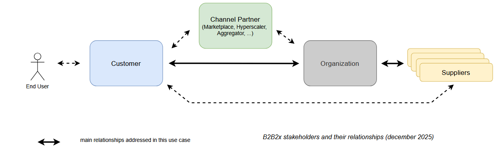

The Organization will provide an Offer (ProductOffering) which is based on its own and Suppliers's assets. 

Even if the figure describes here the main relationships (**↔**), other relationships can exist and / or have to be managed.

B2B2x use cases will illustrate

- Partner On-boarding with Agreement Management (TMFS019)
*An Organization will manage Framework Agreement with ad hoc Suppliers (SDWAN Vendors, Cloud Providers, SSE Editors, ...) to be able to provide a SASE solution to its customers*

- **Multi Party Contract Management for a large enterprise (TMFS020)**
***An Organization will manage Framework Agreement, Implementation Agreement(s) regarding Customer's Intent (incl. Framework Agreement Implementation with its Suppliers) through SASE Solution.***

- Orchestration of a multi party, multi domain, multi tenant Product Offering sold as a solution (TMFS021)

- Cross domain event correlation, event to incident (TMFS022)

- Multi party Usage Management and Charging (TMFS023)

- Settlement with partner for Type 2 marketplaces (TMFS024)

## Context or Background

To illustrate Multi Party Contract Management for a large enterprise, we propose to use the following configuration: 

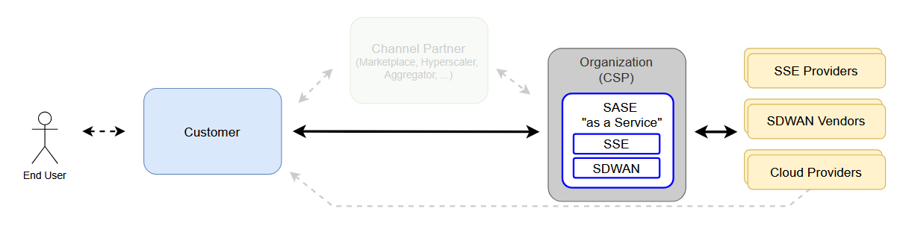

An Organization (a Communication Service Provider aka CSP) provides to its Customers a SASE Solution based on its own assets and some provided by dedicated Suppliers.

To provide such an offer, the CSP define / enrich
- SASE Solution in its catalog that refers to Products provided by Suppliers 
- Framework Agreement Specification / Implementation Agreement Specification for its Customers
  note: Implementation Agreement Specification can include specific Terms and Conditions linked to Framework Agreement signed with its Suppliers

|  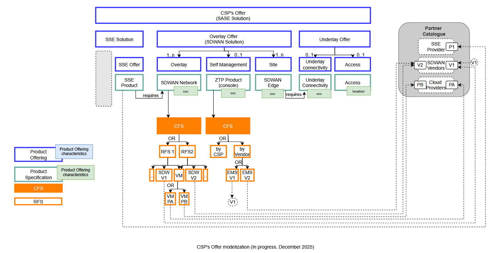 |  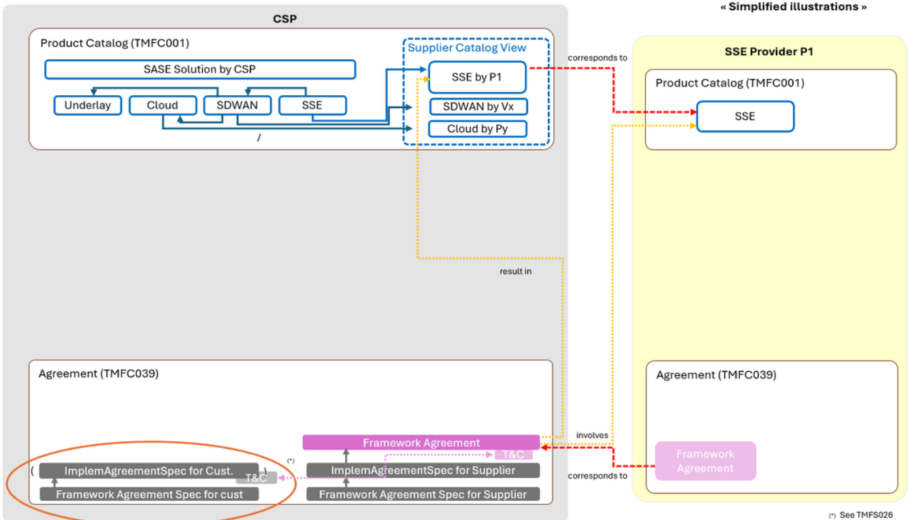 |
| --- | --- |
| Catalog Modeling illustration | Framework Agreement illustration |

Based on those elements, the Organization (aka the CSP) will be able to address Customer's business intent regarding SASE requirements.

## Objective of the use case

The objective of the use case is to illustrate how TMF Frameworks support contractualization between an Organization (the CSP) and its Customer based on business intent and relying on Multi Party, Multi Domain assets and contracts.

As a CSP (the Organization), I want
 - to manage Customer business Intent
 - to be able to propose an ad hoc solution / bundle based on my assets and some provided by my Suppliers
 - to manage contractualization with my Customer including Supplier's commitment

As a Customer, I want to find an ad hoc solution regarding my requirements (Secured Network for 300 Sites for next 5 years) and to be able to organise sites deployement regarding my agenda. 

## Scope and assumptions

### Scope

This use case focuses on contractualization between an Organization (the CSP) and its Customer. 

This contractualization is based on
 - the definition of the scope of the deal, through a Framework Agreement between CSP and its Customer regarding SASE solution
   ensuring Customer and CSP (the Organization) from one side and CSP (the Organization) and its Suppliers on the other side clearly agreed on the scope of the commitment
 - the instanciation of this Framework Agreement through Implementation Agreement(s) between the CSP and its Customer (and the CSP and its Suppliers regarding CSP's Customer order))

Out of Scope:

Operations are done regarding CSP / Supplier Agreements, meaning if an evolution on Products / Services agreed between CSP and its Suppliers, they will have to update the agreement through TMFS019.
Some call flows have been simplified because described in other use cases

This is the first version of the use case, it will be enriched later (operational models, ...).

### Assumptions

It is assumed that this is a happy path and there are no Order errors or fallout.

**Pre-Requisites for this use Case:**

- The Partner onboarding is completed and a Framework Agreement between the CSP and its Suppliers / Partners has been approved for the Partner Product Offerings (see TMFS019)

- The Customer Account (Party) of the large enterprise is already created and is active
*Information View, Sequence diagram, ... will not describe steps linked to Customer management (at organization level nor individuals)*

# Description

A Customer express a Business Intent to the CSP regarding SASE Solution (new Lead).

Step A

Regarding Customer Intent, the CSP will propose a "high level" ProductOffering (via an Opportunity) and the Customer and the CSP will establish a Framework Agreement that will describe the general rules, prices, ... under which the CSP and the Customer will work together. A Framework Agreement can include a set of Framework Agreement Items that may concern, as examples:

- Negotiated Prices of ProductOfferingSpecification (here SASE) according to volumes, examples for SASE:

- Number of sites: 300 Sites (200 small / 75 medium / 20 large / 5 specific)

- Commited support for 200 hours a month

- Support level: Gold for 100 / Silver for 200

- Restriction on ProductSpecification Characteristics possible values through ProductConfigSpec,

- Restriction on AllowedProductAction,

- Ethic clauses,

- Security clauses,

- Privacy clauses,

- Non disclosure clauses,

- Payment clauses,

- Liquidated damages,

- Responsibility,

- Target geographical areas…

Step B

In accordance with this Framework Agreement, the Customer will order, as many as necessary, SASE Solutions to the CSP leading to Implementation Agreement(s).
       For example, an order (via a new Opportunity) could be

- Solution: SASE

- Number of sites: 10 sites (9 Small / 1 Medium)

- Commited support for 20 hours a month

- Support level: Gold (1) / Silver (9)

- ...

At this stage,

- a ProductOffering proposition will be provided by the CSP to its Customer (via a dedicated Opportunity)
*In this illustration, the ProductOffering proposition includes Supplier's commitment and 1st quotation*.
*note: several quotations can be done*

- Customer will accept one of the quotes, this acceptance will trigger

- the production of an Implementation Agreement (according to Implementation Agreement Specification) between the CSP and its Customer,

- the generation of a Customer Product Order,

- the generation of ad hoc assets in the ProductInventory,

- the production of an Implementation Agreement between the CSP and its Suppliers,

- the generation of Business Partner Product Orders (orders from the CSP to its Suppliers).

Please note that, depending on the CSP's policies, the Customer ProductOrder may be generated before or after the Implementation Agreement approval (signature) by the CSP and the Customer.

# Information View

## 3. A Framework Agreement definition between the CSP and its Customer

This figure illustrates CSP's IT System the definition of the Framework Agreement signed with its Customer (referring to its FrameworkAgreementSpec for Cust / ImplementationAgreementSpec for Cust and its Catalog / FrameworkAgreement with its Supplier).

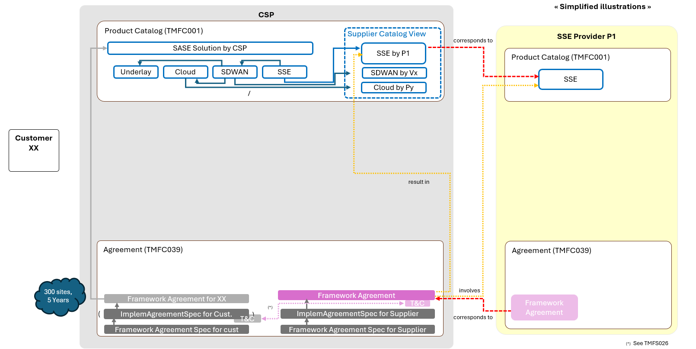

Please see a more detailed illustration (restricted view to CSP's IT System) in SID documentation *(abstract from in progress SID 25.5, available in PROLABORATE Tools)*

*note: this **representation** includes SalesLead and Sales Opportunity not described above*

|  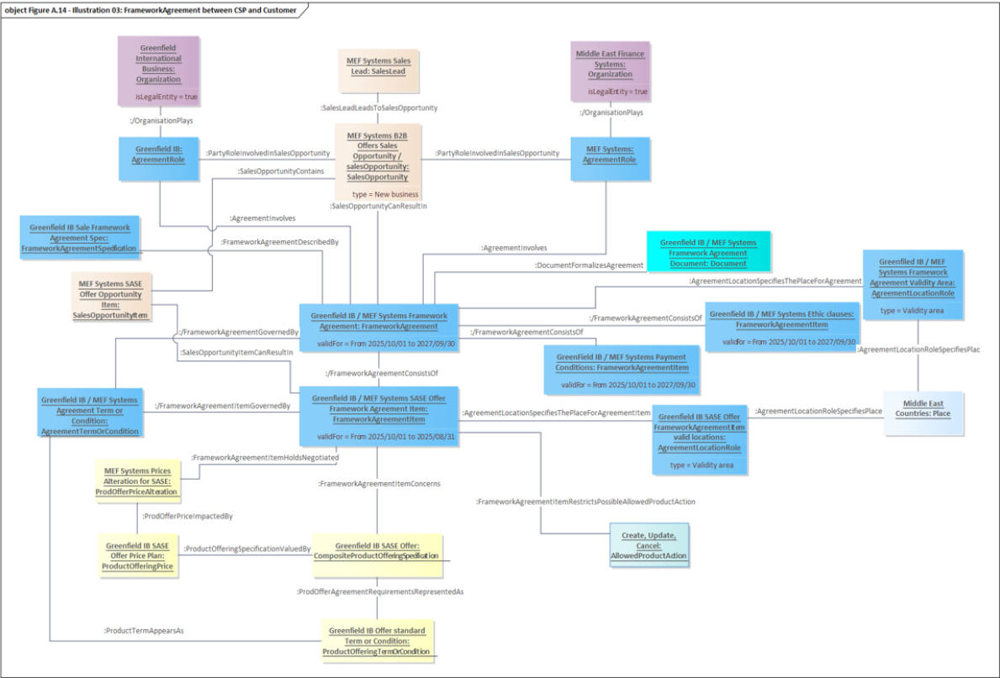 |  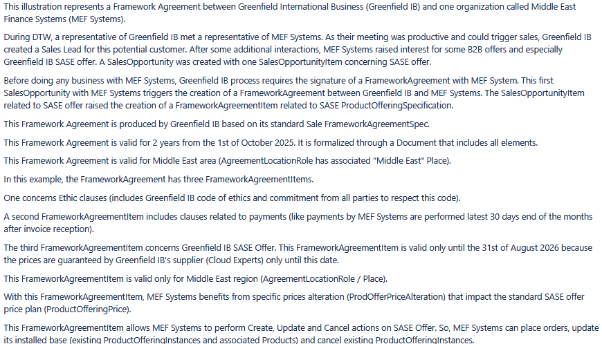 |
| --- | --- |

## 3.B Framework Agreement instanciation through Implementation Agreement between CSP and its Customer 

This figure illustrates Framework Agreement instanciation trough

- the production of an Implementation Agreement (according to Implementation Agreement Specification) between the CSP and its Customer

- the generation of a Customer Product Order

- the generation of ad hoc assets in the ProductInventory 

- the production of an Implementation Agreement between the CSP and its Suppliers

- the generation of Business Partner Product Orders (orders from the CSP to its Suppliers)

Please note that, depending on the CSP's policies, the Customer Product Order may be generated before or after the Implementation Agreement approval (signature) by the CSP and the Customer. 

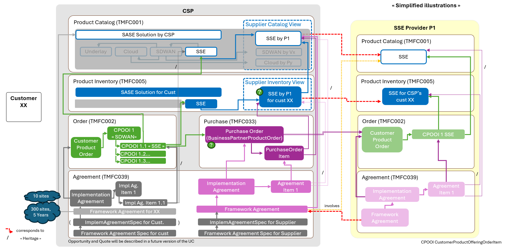

In real life, a lot of situations can be encountered: 
 - quote can be done with / without qualification with Suppliers, 
 - Implementation Agreement instanciation can be realised during Order Delivery, after Order Delivery...
 - ..

Please see a more detailed illustration (restricted view to CSP's IT System) in SID documentation *(asbtract from in progress SID 25.5, available in PROLABORATE Tools)*

| implementationAgreement between CSP and Customer | implementationAgreement between CSP and Customer |
| --- | --- |
|  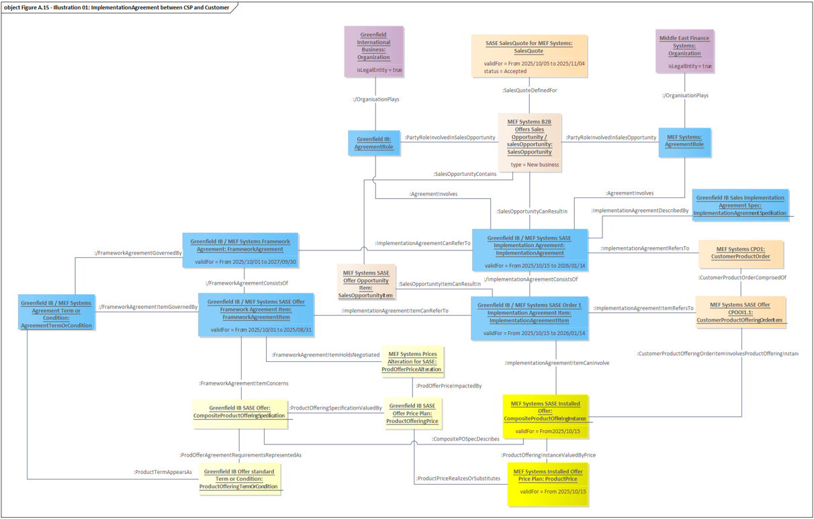 |  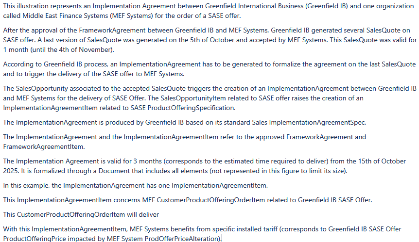 |
| implementationAgreement between CSP and Supplier | implementationAgreement between CSP and Supplier |
|  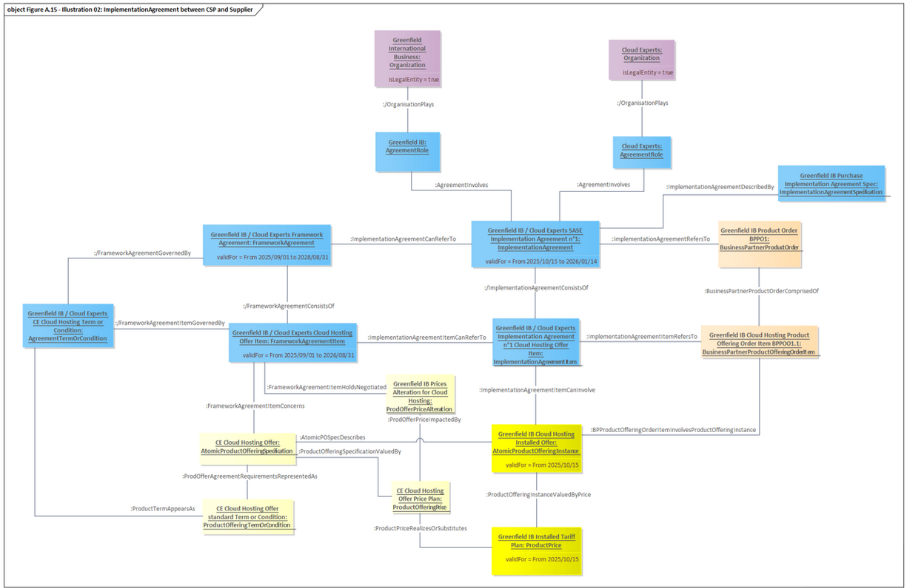 |  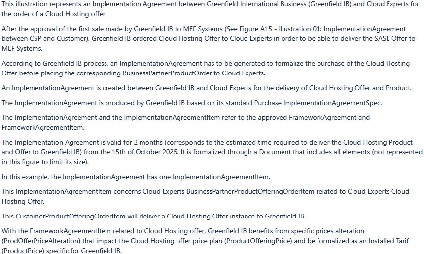 |

# Sequence diagrams

Regarding Customer needs, Customer and CSP will agree on assets that will contribute to SASE Solution, and potentially other solutions, for Customer's context and validate Framework Agreement.

## 4.A Step 1 Framework Agreement definition between the CSP and its Customer

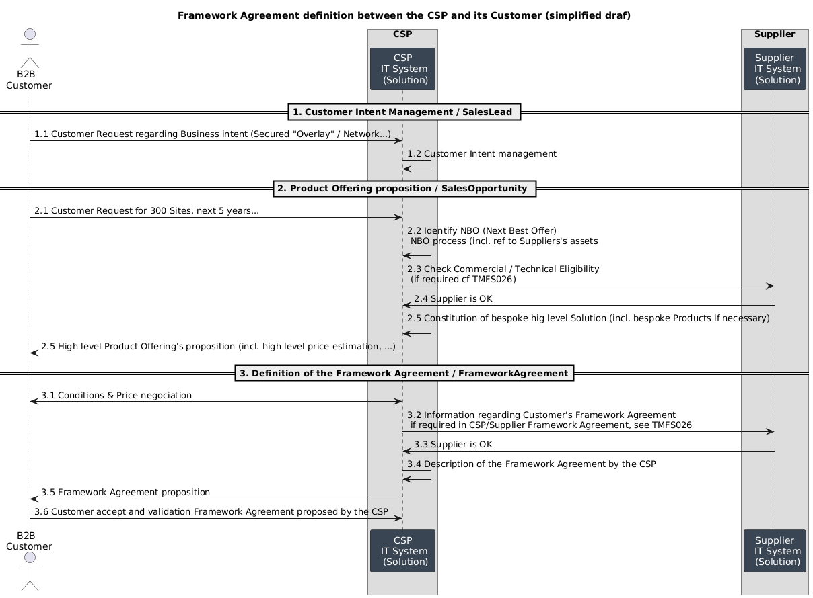

Main ODA Components involved in this process

- At CSP level

- TMFC001 Product Catalog (incl. Supplier Catalog involved in Framework Agreement

- TMFC002 Product Order Capture & Validation

- TMFC039 Agreement Management

- TMFC050 (Product) Recommendation Management

- TMFC??? ProductOffering Qualification / TMFC??? Resource Qualification (tbc)

- TMFC023 Party Interaction Mgt / TMFC??? Party Request Management (to be analysed with TMFS031) 

- TMFC036 Lead and Opportunity Management

- At Supplier level 

- TMFC002 Product Order Capture & Validation

"Opening the box"
*note: some elements here are proposition of "in progress" topics linked to enrichment proposed by other UC (TMFS018, ...)*

| Customer Intent Management / SalesLead | Customer Intent Management / SalesLead |
| --- | --- |
|  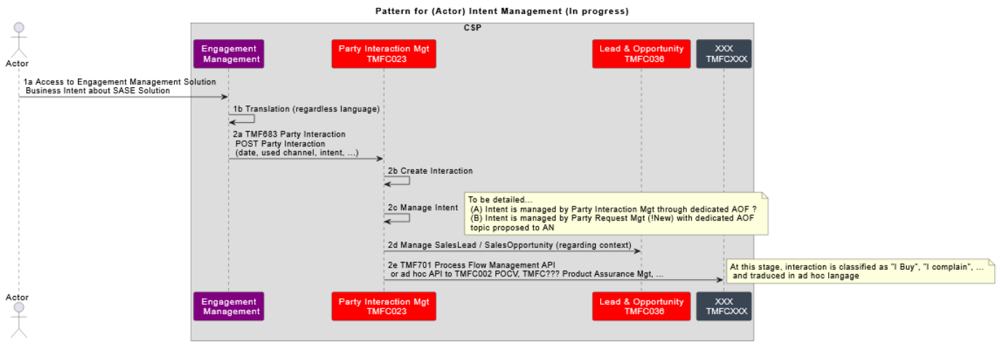 |  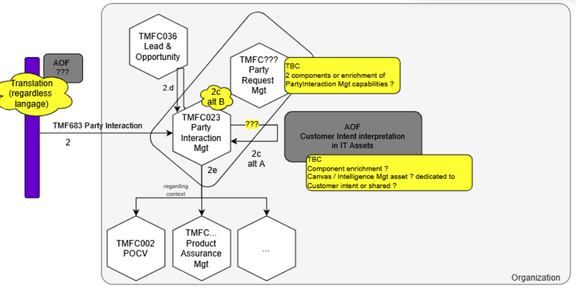 |
| Product Offering proposition / SalesOpportunity | Product Offering proposition / SalesOpportunity |
|  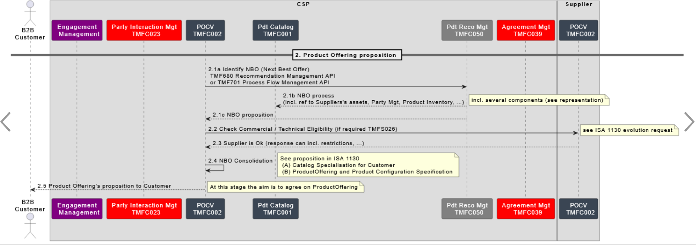 |  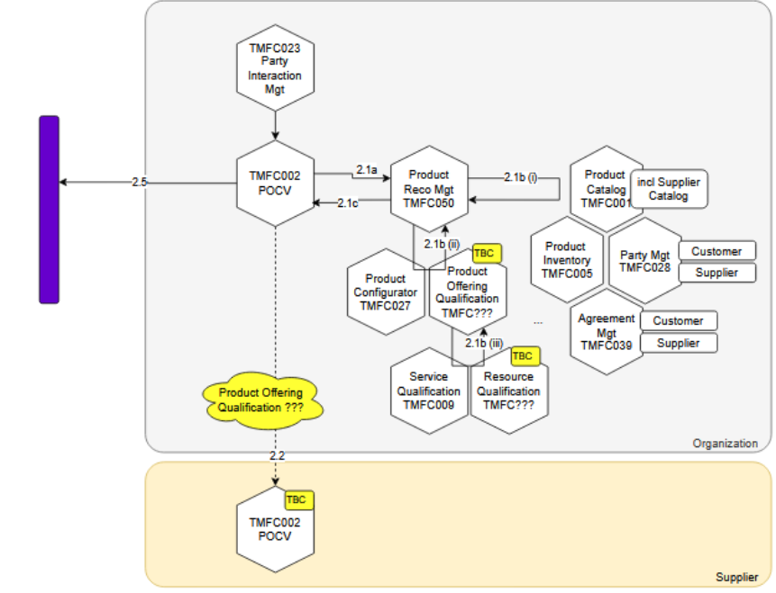 |
| Definition of Framework Agreement / FrameworkAgreement | Definition of Framework Agreement / FrameworkAgreement |
|  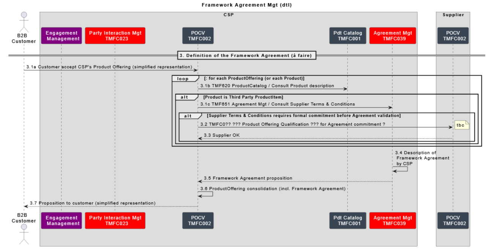 |  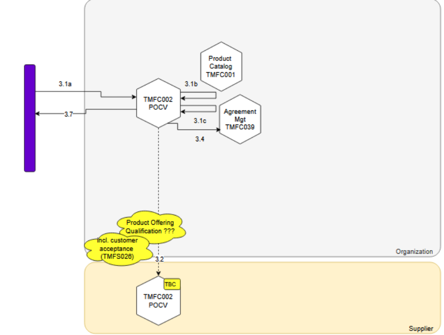 |

## 4.B Step 2 Framework Agreement instanciation through Implementation Agreement between CSP and its Customer 

*(kept for comment consideration, to be removed) *

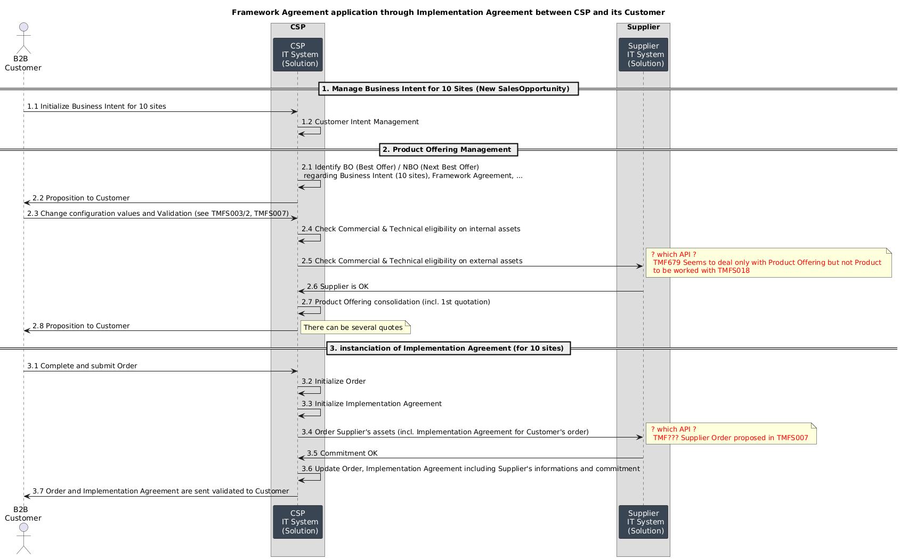

Main ODA Components involved in this process

- At CSP level

- TMFC001 Product Catalog (incl. Supplier Catalog involved in Framework Agreement

- TMFC002 Product Order Capture & Validation and / or TMFC??? Party Request Management (to be analysed with TMFS031)

- TMFC033 Purchase Management 
At this level, ODA Component TMFC033 Purchase Management will be in charge of order that will be done by the CSP to its Suppliers regarding its Customer's order.

- TMFC039 Agreement Management

- TMFC050 (Product) Recommendation Management

- TMFC??? ProductOffering Qualification / TMFC??? Resource Qualification (tbc)

- TMFC023 Party Interaction Mgt / TMFC??? Party Request Management (to be analysed with TMFS031) 

- TMFC036 Lead and Opportunity Management

- At Supplier level 

- TMFC002 Product Order Capture & Validation

"Opening the box"
*note: some elements here are proposition of "in progress" topics linked to enrichment proposed by other UC (TMFS018, ...)*

 

| Customer Intent Management (10 Sites) / Sales Opportunity   → see description done for step 1 Framework Agreement definition between the CSP and its Customer | Customer Intent Management (10 Sites) / Sales Opportunity   → see description done for step 1 Framework Agreement definition between the CSP and its Customer |
| --- | --- |
| Product Offering proposition  → not detailed here, see requirements addressed for TMFS018     see description done for step 1 Framework Agreement definition between the CSP and its Customer regarding step 2.4, how does Commercial and Technical eligibility are done internally at PO/P/S/R level (API, Components) ? (cf TMFS018) regarding step 2.5, how does Commercial and Technical eligibility are done externally at PO/P level (API) ? (cf TMFS018) | Product Offering proposition  → not detailed here, see requirements addressed for TMFS018     see description done for step 1 Framework Agreement definition between the CSP and its Customer regarding step 2.4, how does Commercial and Technical eligibility are done internally at PO/P/S/R level (API, Components) ? (cf TMFS018) regarding step 2.5, how does Commercial and Technical eligibility are done externally at PO/P level (API) ? (cf TMFS018) |
| instanciation of Implementation Agreement  focus on purchase order from CSP to its Supplier | instanciation of Implementation Agreement  focus on purchase order from CSP to its Supplier |
|  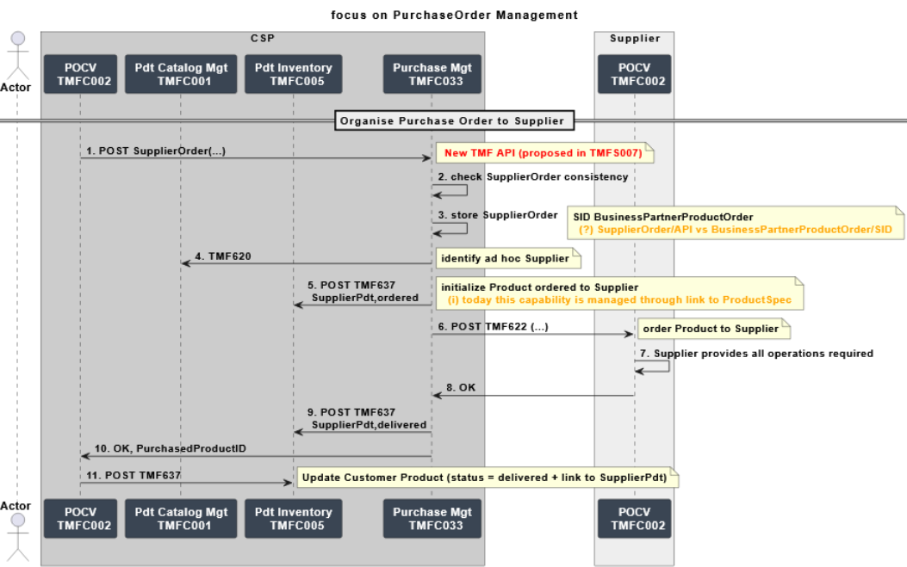 |  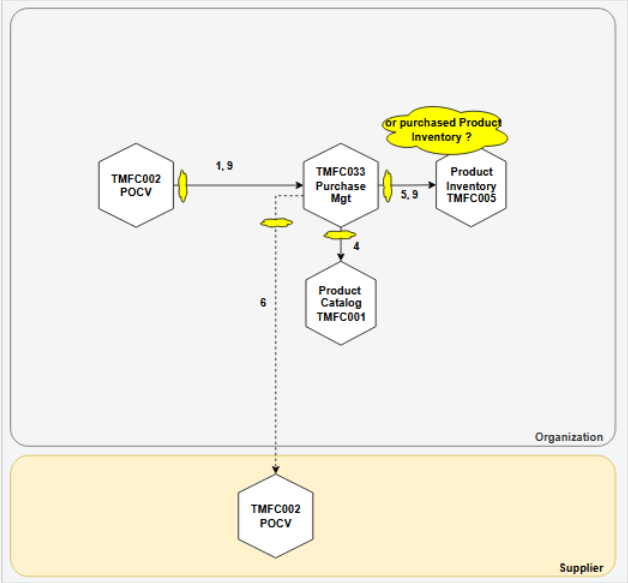 |

# Conclusion

## Lessons learned 

Even if the use case still needs to be detailed, this version illustrates 
 - Framework Agreement management between a CSP and its Customer (incl. reference / consistency with Framework Agreements defined between the CSP and its Suppliers) 
 - Framework Agreement instanciation through Implementation Agreement defintion between a CSP and its Customer (incl. Implementation Agreement between the CSP and its Suppliers regarding CSP's Customer Agreement)

keeping in mind that this is just an illustration, several configuration can occur.

## Impacts identified

Some propositions / topics are proposed about

 - how Lead / Opportunity / Order can be managed for the different steps 
 - Intent management, proposition to address with ad hoc teams (cf Autonomous Network UC for ODA / AN convergence, TMFS031 vs TMFC??? Party Request Management)
 - ProductOffering / Product / Service / Resource Qualification (internally and with Supplier), proposition to address with ad hoc teams (cf TMFS018)
 - ProductOffering / Product Configuration, proposition to address with ad hoc teams 
 - Purchase Management (sequence flow / interaction diagram) => impact on SID, API, ODA Component Framework
 - BO (Best Offer) / NBO (Next Best Offer) Recommandation process, proposition to address with ad hoc teams (cf Autonomous Network UC for ODA / AN convergence)

as 1st proposition to work on

# Appendix

