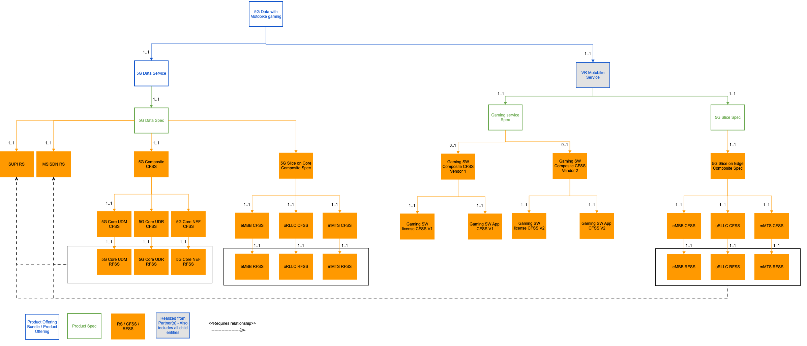
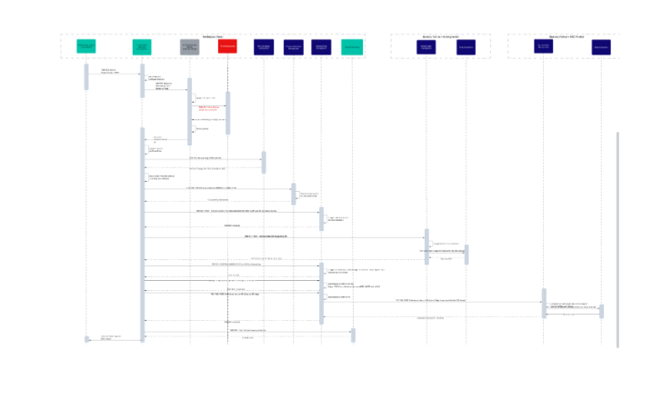
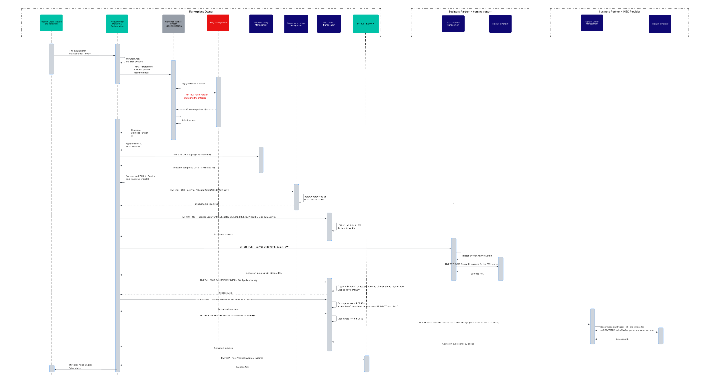
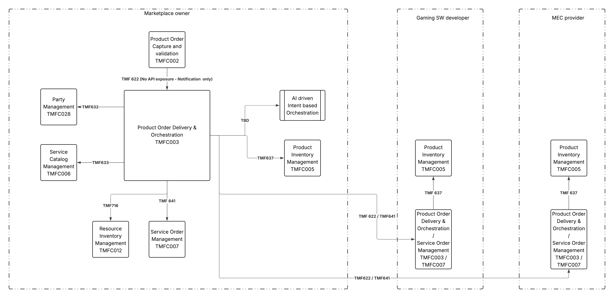
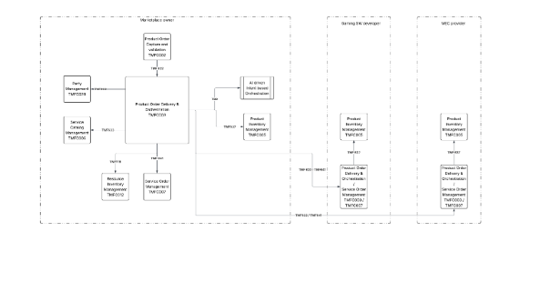

# Introduction

This use case details the e2e Orchestration of a bundled Product offering realized through multiple domains made up of Marketplace owner's products and services and business partner's (MEC provider and SW gaming provider) products and services. The concept of NAAS is used to illustrate how the Service catalog model and Orchestration in Multi domain scenarios can be designed to also achieve Zero Trust operations. (The actual provisioning is not in scope and is mentioned in the Use case description)

The domains in this Use case are Marketplace Owner's 5G Core, Marketplace owners 5G Edge, SW gaming vendor's activation server and the MEC provider's 5G edge.

While the standard Catalog driven decomposition and orchestration principles are used , the additional aspect is the dynamic nature of B2B2x transactions where the partner is sometimes selected during the orchestration and not during the Quotation i.e. the partner fulfilling the service is selected during the orchestration based on criterion defined by the CSP (marketplace owner) and hence the need for a new function called AI driven Dynamic orchestration (AI driven orchestration based on business need and not catalog configurations) that is added as a solution but not an ODA component in the Use case flow.

This and the other Use Cases around B2B2x assume that the person reading this has gone through the other documentation done earlier which provides the context to the topic of marketplaces. A few of them are listed here

[https://www.tmforum.org/resources/exploratory-report/tr302-oda-ecosystem-challenges-and-roadmap-proposal-v2-0-1/](https://www.tmforum.org/resources/exploratory-report/tr302-oda-ecosystem-challenges-and-roadmap-proposal-v2-0-1/)

[https://www.tmforum.org/resources/introductory-guide/ig1317-oda-dse-platform-extensions-patterns-for-b2b-b2b2x-partner-ecosystems-v3-0-0/](https://www.tmforum.org/resources/introductory-guide/ig1317-oda-dse-platform-extensions-patterns-for-b2b-b2b2x-partner-ecosystems-v3-0-0/)

[https://www.tmforum.org/resources/reference/ig1282-oda-design-challenges-in-applying-b2c-solutions-to-b2b-b2b2x-requirements-v1-0-0/](https://www.tmforum.org/resources/reference/ig1282-oda-design-challenges-in-applying-b2c-solutions-to-b2b-b2b2x-requirements-v1-0-0/) 

[https://www.tmforum.org/resources/introductory-guide/ig1262-software-marketplaces-a-new-go-to-market-opportunity-for-communications-service-providers-v1-2-0/](https://www.tmforum.org/resources/introductory-guide/ig1262-software-marketplaces-a-new-go-to-market-opportunity-for-communications-service-providers-v1-2-0/)

[IG1279 Zero-Touch Partnering Vision & Strategy v3.1.0](https://projects.tmforum.org/wiki/pages/viewpage.action?pageId=309825995)

[https://www.tmforum.org/resources/introductory-guide/tr303a-federated-identity-and-authentication-management-for-multi-domain-zero-trust-architecture-v4-0-0/](https://www.tmforum.org/resources/introductory-guide/tr303a-federated-identity-and-authentication-management-for-multi-domain-zero-trust-architecture-v4-0-0/)

[GB1027C Zero-Touch Partnering Use-Cases v6.0.0](https://projects.tmforum.org/wiki/display/PUB/GB1027C+Zero-Touch+Partnering+Use-Cases+v6.0.0)

## Source of requirements

This ODA Use case flow is derived from requirements and recommended next steps in GB1027C.

## Context or Background

Taking into account a Multi domain, Multi party offerings the dynamic orchestration of a Product Offering of VR Gaming over 5G slices is being taken as an example for the Orchestration Use Case. This is to showcase the following:

- TMF SID can also be used to model non Telco Product Offerings (as bundles in this case, even though standalone no telco offerings can also be modelled using TMF SID)

- The same decomposition and Orchestration principles will apply to Non Telco Product offerings (sometimes with reduced complexity)

**Pre-Requisites:**

- The Partnership agreements i.e. Operational (with ownership of activities across the SELL-FULL-BILL-CARE cycle), Contractual (SLAs, APIs etc) and Financial (Settlement) agreements being defined in TMFS019 are in place between the Marketplace owner and the business partners. 

- The sales or framework agreement and the contracts with the end customer who is purchasing the bundled solution consisting of products and services from the Marketplace owner and the business partners as defined in various usecases including TMFS002,TMFS003,TMFS016, TMFS019 and TMFS020 are complete.

- The Business partner's product is onboarded into the marketplace owner's catalog and the customer order for the PO bundle that contains the business partner's PO, is created and submitted

## Objective of the use case

**As an** Order Fulfillment administrator,

**I want to **ensure that the customer product order that is submitted has been decomposed, enriched with the right data and orchestrated to the right partners as well as the internal provisioning systems...

**So that** the service activation and provisioning of the various services happens in the correct sequence based on dependencies and the end customer can start using the service with the right billing data and the business partners have the right instances in their Product Inventory which is mapped to the master Product Inventory.

## Scope and assumptions

### Scope

***In Scope for this use case: ***

- The definition of the Product Model with the various entities like PO, PS, RS, CFSS, RFSS with emphasis on the technical specs (because this Use Case deals with Order orchestration and not Order capture) is in scope

- The Order decomposition of the Customer product order into Service and Resource orders and equivalent APIs and the orchestration sequence is in scope

***Out of Scope for this use case:***

- The actual Service provisioning activities on the 5G core and the Partner services of the gaming SW vendor or the Hyperscaler on the MEC 5G edge are out of scope are assumed to be actions that are a success for the overall order to be completed

- Line Item level Service Location is out of scope for this Use case.

- Consumer tasks like Billing Account create, billing Instance creation are not mentioned here as they do not change for B2B2x Use Cases.

### Assumptions

It is assumed that this is a happy path and there are no Order errors or fallout

# Description

This usecase deals with the orchestration of a Customer Product Order that has multiple Product Order Line Items some of which map to products &  services from business partners. The flow with the mandatory ODA components , the APIs between the components are provided in the form of a sequence flow. At the end a recommendation on using TMF 622 vs TMF 641 when orchestration the domain orders to the business partner is provided. However, a more detailed discussion is needed before converting this recommendation into a firm guideline.

Since this is an automated process and assumes a happy path scenario there is no screen flow for this use case

# Information View

The Service model, using the NAAS framework of abstraction to enable multi domain orchestration when the domains belong to multiple stakeholders (business partners), with the technical specs mapping to the Product Offering bundle for this Use Case is given below.

# Diagrams

## Sequence Diagram

The sequence flow for the Multi domain orchestration with the dynamic orchestration function is given below.

Due to technical issues in embedding Lucid chart in Confluence the image of the diagram is being given below:

The Sequence flow is described in the table below.

| Operation | Operation Type | Description | ODA Components - Comments | Open APIs - Comments |
| --- | --- | --- | --- | --- |
| TMF 622 Submit Product Order  POST (PO ID, PO details) | API | The product order for the Product Offering shown in the Information model is submitted to the Product Order Delivery and Orchestration | Product Order Delivery and Orchestration - Currently it is a notification. It should be via TMF622 | TMF 622 - No enhancements needed |
| Int: Order Ack.  and start decomp | Internal Action | The Order acknowledgement happens in Product Order Delivery and Orchestration component and the decomposition process is started. | Product Order Delivery and Orchestration - No enhancements needed | NA |
| TMF???: Determine Business partner based on need | API | The Gaming partner IDs needs to be fetched from the component with this new API i.e. those Partner IDs who provide the service mapping to the PS | AI driven Intent based orchestration solution (not a component) - Where does this map to? To be Discussed with AN and other teams on how they are approaching this. | New API needed |
| Apply criterion to order | Internal action | Apply the criterion to select the Gaming SW business partner | AI driven Intent based orchestration solution (not a component) Where does this map to? To be Discussed with AN and other teams on how they are approaching this. | NA |
| TMF 632: Fetch Partner  matching the criterion | API | The API will be used to fetch the Partner ID(s) and feed the ID(s) | Party Management component needs to be enhanced to hold the Partner IDs based on the services they provide. Or a separate component is needed. It is suggested to enhance this component | TMF 632 - No enhancements needed |
| Consume the response (Partner information) | API response | The Partner IDs who provide this service are consumed by the AI Function for Dynamic orchestration | To be Discussed with AN and other teams on how they are approaching this. This needs to be an AI function to identify the correct partner based on certain criterion for this customer's order | TMF 632 - No enhancements needed |
| Select Partner | Internal Action | The AI Function for Dynamic orchestration- Feed partner IDs to the AI algorithm and select the partner | To be Discussed with AN and other teams on how they are approaching this. This needs to be an AI function to identify the correct partner based on certain criterion for this customer's order. And this needs to be real time and not based on product rules. | NA |
| Consume Business Partner ID | API response | The selected business partners is consumed as a response |   | TMF??? New API |
| TMF 633  GET the mapping CFSS and RS  for all PS in the Product Order (PS) | API | Map the CFSS for the PS | No enhancement needed | No enhancement needed |
| Consume response With composite CFSS / child CFSS (as the case maybe) and RS | API response | Response to the API with the CFSS and RS | No enhancement needed | No enhancement needed |
| Decompose the Order  -  POLI into Service and Resource Orders | Internal action | Order is decomposed based on the Partner ID and the mapping CFSS | No enhancement needed | No enhancement needed |
| TMF 716: POST Reserve / Allocate MSISDN and IMSI / SUPI | API | Reserve the MSISDN and IMSI / SUPI. NO separate API for pairing as in the flow it is assumed that the pairing is an internal action of the resource management or the resources are pre-paired | No enhancement needed | No enhancement needed |
| Reserve resources for  the Resource Order | Internal Action | The resources like IMSI / SUPI / MSISDN are reserved and allocated to the customer order | No enhancement needed | No enhancement needed |
| Consume the Resources | API response | The reserved / allocated MSISDN with the paired SUPI (and IMSI if applicable) are part of the response | No enhancement needed | No enhancement needed |
| TMF 641 POST Service Orders for 5G Core Data service Activation on with MSISDN and SUPI / IMSI on the various core NE | API | The SOM component triggers the Service Activation Orders. This is for core and hence has been explained in many use cases earlier and is being given here for context to complete the e2e flow. This will be split into 3 separate Service order for the 5G slices on eMBB, uRLLC and IOT. This Use case has been done as part of ODD-NAAS and hence the details of this decomposition are not being given here. | No enhancement needed | No enhancement needed |
| Trigger TMF 640 for the  Service Activation | API | The SOM component triggers the Resource Orders. This is for core and hence has been explained in many use cases earlier and is being given here for context to complete the e2e flow | No enhancement needed | No enhancement needed |
| TMF 641 POST Service Order for Composite CFSS  = Gaming SW and App activation for Partner <ID> | API | The same mechanism is used to trigger the Service Order to the Partner for activating the services owned by the Partner. In certain cases TMF 622 may be used instead of TMF 641. In this use case we assume that 641 is used as the partner does not need the end customer's details. | No Enhancement needed | No enhancement needed |
| TMF 640 SW License | API | The Service Activation by the Partner for the VR gaming license key to the customer is completed as part of this step | No enhancement needed | No enhancement needed |
| TMF 640 for App activation | API | The Service Activation by the Partner for the end user app activation paired to the license key that was provisioned in the previous step is completed as part of this step. This can be Zero touch i.e. remote provisioning with the settings instead of notification to the user to download the App. | No enhancement needed | No enhancement needed |
| TMF 637 POST Product Inventory  Instance | API | The partner i.,e. SW Gaming vendor needs to maintain their Product Inventory Instances for the service that they have provisioned. For a B2B2X services the master will be with the Marketplace owner and if the product offer purchased by the subscriber has line items with partner services, those partners need to maintain those activated line items as instances in their PI The master PI with all the services will be with the CSP / Marketplace owner The Product Inventory for CSP / marketplace owner is not being shown as that is handled in the normal B2C and B2B flows. | No enhancements needed (Assumption - SW Gaming vendor maintains their own PI instance for the PO or the CFSS mapped to the PO or child CFSS and RFSS with Child CFSS as the mapping payer between the marketplace owner and the ME provider) | No enhancements needed |
| Activation success for 5G slices | API response | Service Activation on 5G slices at MEC provider is a success |   |   |
| App Activation success with license Key | API response | The Service order for the Gaming partner services is now complete | No enhancement needed | No enhancement needed |
| TMF 641 POST Service Order for composite CFSS - 5G Slice for resource = MSISDN and SW App | API | Same as other service order for Core service and hence no change needed for B2B2X. The step is provided here for context as this will be used to pair the MSISDN to the License key of the partner and register the license key on the Network node | No Enhancement needed | No enhancement needed |
| Decompose to child CFSS and  trigger 640(s) to activate service on eMBB, MMTC and uRLLCTr | Internal Action and API | The Child Service order based on the atomic CFSS are triggered and the activation commands for each of those via 640 are then processed. This detail is not being explained as the scope of this use case is up to the Service Order | No enhancement needed | No enhancements needed |
| Activation is success | API response | Activation on Core (   VR gaming SW on 5G Slices) is completed | No enhancement needed | No enhancement needed |
| TMF 641 POST Service Order for 5G slices on edge on Composite CFSS | API | The same mechanism is used to trigger the Service Order for activating the services on 5G slices of the MEC provider. In certain cases TMF 622 may be used instead of TMF 641. In this use case we assume that 641 is used as the partner does not need the end customer's details. Certain partners may not use TMF Open APIs and he larger objective is to bring those partners and verticals on board the TMF ODA and Open APIs, at least for the beyond connectivity services. | No enhancement needed | No enhancement needed |
| TMF 641 POST Service Order for 5G slices on edge on | API | Due to the Product Order Delivery and Order orchestration and Service Order Management as 2 components, the role of Service Order Management here is to decompose further based on Composite to atomic CFSS relationship and trigger the granular service orders using 641. This also follows the NaaS model with a CFSS abstraction layer when multi domain service orchestration is needed.  (Multiple network domains, some of them belonging to the partner but the orchestration pattern until the CFSS remains uniform and is network agnostic) | No enhancements needed | No enhancements needed |
| TMF 640 for 5G slices | API | The MEC provider after receiving the 3 Service Orders, triggers the Service Activation commands for the activation of the Customer MSISDN and Gaming License key on the 3 slices i.e. uRLLC, IOT and eMBB. It is assumed the partner is not exposing the Service Activation commands to the marketplace owners and hence the abstraction shown in the step above. | No enhancement needed | No enhancement needed |
| TMF 637 POST Product Inventory  Instance | API | The partner i.,e. MEC provider needs to maintain their Product Inventory Instances for the service that they have provisioned. For a B2B2X services the master will be with the Marketplace owner and if the product offer purchased by the subscriber has line items with partner services, those partners need to maintain those activated line items as instances in their PI. The master PI with all the services will be with the CSP / Marketplace owner The Product Inventory for CSP / marketplace owner is not being shown as that is handled in the normal B2C and B2B flows. | No enhancements needed (Assumption - MEC provider maintains their own PI instance for the child CFSS and RFSS with Child CFSS as the mapping payer between the marketplace owner and the ME provider) | No enhancements needed |
| Activation success for 5G slices | API response | Service Activation on 5G slices at MEC provider is a success | No enhancement needed | No enhancement needed |
| Activation success | API response | The Service order at the composite CFSS for 5G slices at 5G edge is now closed-complete as success | No enhancements needed | No enhancement needed |
| TMF 637 : Post Product Inventory Instance | API | The master PI with all the services is created and activated now and from here on the Billing will start for the end consumer. Based on Agreements defined in TMFC019, this step may also determine the settlement initiation. Mapping between the PI instances of the marketplace owner and the 2 partners is via the catalog entities (with characteristic value / attribute values) and is implicit. No additional logic is needed | No enhancements needed | No enhancements needed |
| Success Ack | API response | The master PI is successfully created and activated. | No enhancement needed | No enhancements needed |

**Recommendation**: *The progression of Orders from the marketplace owner to the Business partner can be based on PO.PS or the CFSS*. If it is triggered based on PO.PS, Product Order 622 is to be used. If it is based on the CFSS, Service Order 641 is to be used. This decision should be a joint decision between the marketplace owner and the business partner,based on the service exposure of the business partner and should be detailed during the Contractual agreement as part of TMFC019.

The contractual agreement may depend on the Operational agreement which defines the roles and responsibilities of both the parties (marketplace owner and the Business partner ) during the SELL-FULFILL-BILL - CARE cycle.

In this UseCase, Service Orders are used because: 

- The flow considers CFSS abstraction to achieve a NAAS layer across Multiple Network domains

- The Service order in at least one instance will trigger a provisioning command which is Zero Trust

- Picked up a complex scenario considering service level API exposure by the partners. 

In cases where the progression will only be through Product Orders based on PO and PS, there will be an appendix to this use case, to depict that scenario as the complexity is greatly reduced and hence it does not warrant a new Use Case. 

## ODA component model

Due to problems with embedding Lucid Chart in Confluence, the diagram as an image is being reproduced here. 

# Conclusion

## Lessons learned

## Impacts identified

# Appendix

