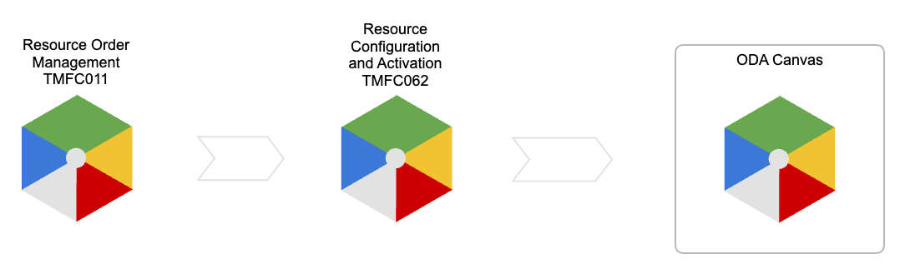
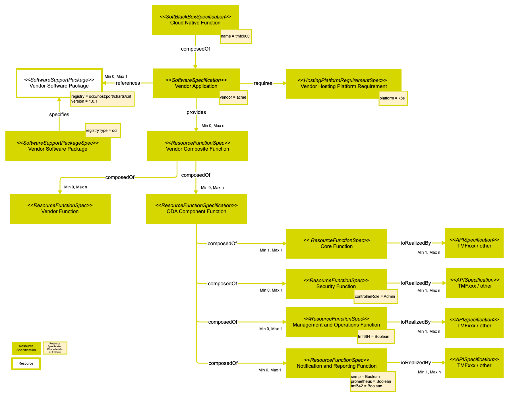
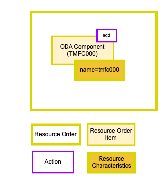
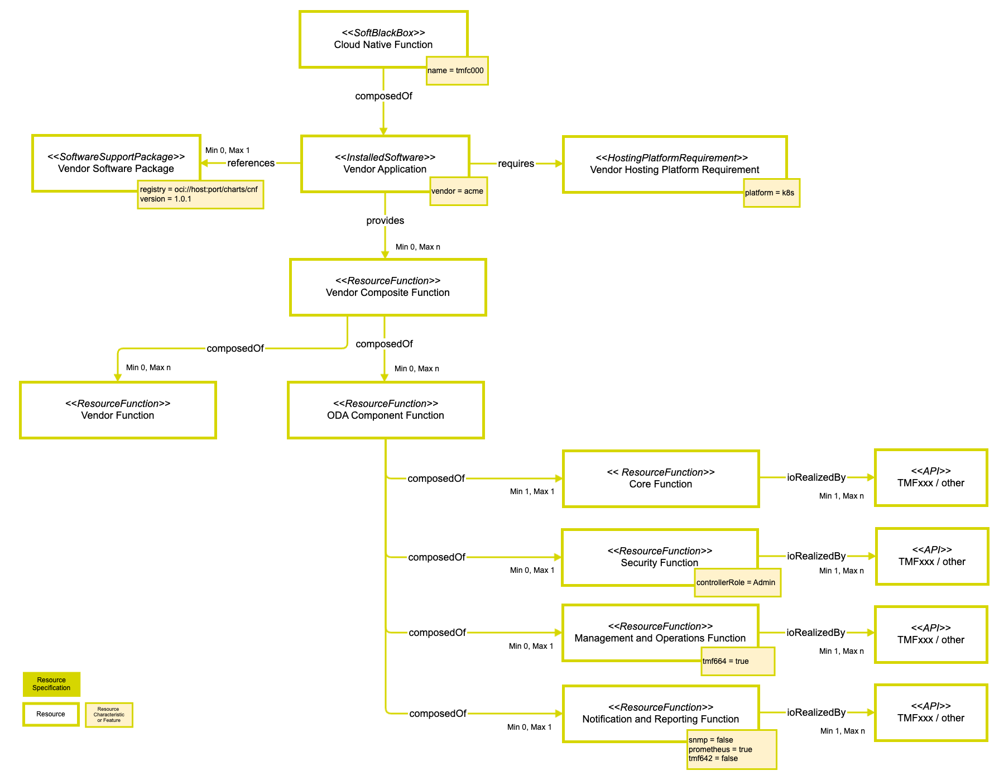
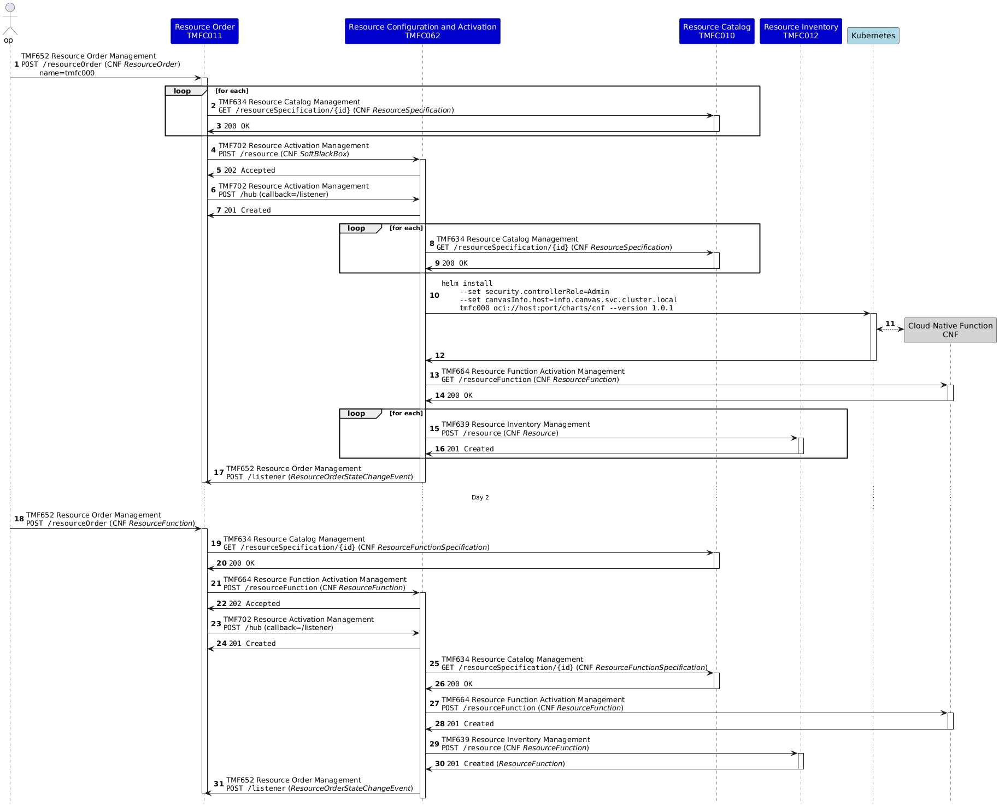

# Introduction

*This use case describes managing Cloud Native Functions (CNF) in ODA.*

## Context or Background

Composable IT & ecosystems are key enablers for telco transformation. TM Forum’s *Open Digital Architecture* (ODA) is a blueprint for the transformation of telecoms IT and networks, helping telco businesses become agile by enabling composable systems and processes, component parts built by the telco and ecosystem partners, connected with Open APIs. It allows telcos to add and remove components and capabilities as technology evolves without escalating costs.

This document is a product of the *ODA Production Modelling* team of the *Technical Architecture* workstream within the *Components and Canvas* project.

The *ODA Production* block encompasses *Service* and *Resource* domain concerns. Cloud native applications are modeled with the *Computing and Software ABE* of the *Information Framework* (SID) and managed with *Resource* domain Open APIs as described in [TMF730](https://projects.tmforum.org/wiki/display/AP/TMF730+Software+and+Compute+Entity+Management+API). *Cloud Native Functions* (CNF) may be provisioned by *ODA Component* [TMFC062](https://projects.tmforum.org/wiki/pages/viewpage.action?pageId=319468121) *Resource Configuration and Activation*.

## Objective of the use case

As an architect, I need a management continuum across the IT estate so that application lifecycle management is done consistently and harmonized with ODA.

This use case is of interest to strategic planners, designers and operators of the IT estate. It demonstrates how software applications, network and management functions, compute and network resources may be managed with ODA across a multivendor landscape.

Extending the *Open Digital Framework* (ODF) to cloud native software and networks amortizes investment in ODA.  Onboarding and ongoing management of network and management functions, including *ODA Components* themselves, will enable holistic solutions.

## Scope and assumptions

### Scope

The initial use case considers the deployment of a cloud native software application onto an infrastructure platform. In this initial version of the document we will consider only *Day 1* provisioning.

### Assumptions

The target software application realizes a *Cloud Native Function* (CNF), which for this use case example is assumed to be an *ODA Component*. This choice allows us to decompose the software application to provide the *Core* and *Supporting* functions specified in the *ODA Component* definition ([IG1171](https://projects.tmforum.org/wiki/display/TAC/IG1171+ODA+Component+Definition)).

The target infrastructure platform is assumed to be *Kubernetes*.

# Description

The use case flow begins after a resource order for an *ODA Component* and ends with a newly created instance on an *ODA Canvas*.

*([text description](media/resource-order-to-oda-canvas-instance-flow.text-description.md))*

# Information View

Software applications may be modeled as *Resource* domain entities using the TM Forum *Information Framework* (SID). 

## CompoundResource Specification ABE

Within the *Resource Specification ABE* we have the *CompoundResource Specification ABE*.

### SoftBlackBoxSpecification

A *Cloud Native Function* (CNF) performs a role (e.g. 5GC AMF, ODA TMFC001) in a logical architecture which is independent of its implementation. A *SoftBlackBoxSpecification* may be used to model a network function with embedded software.

## Software Resource and Software Specifications ABE

Within the *Logical Resource Specification ABE* we find the *Software Resource and Software Specifications ABE*.

### SoftwareSpecification

A software application may be run on a hosting platform. A *SoftwareSpecification* describes the software including release version, license and requirements on the hosting platform such as operating system, memory and disk space.

### ResourceFunctionSpec

Software exists to perform functions, which accept inputs and produce outputs. A *ResourceFunctionSpec* describes a function provided by the software and its input and output connection points. It may also describe the internal topology of a compound *ResourceFunctionSpec*.

### ConnectionPointSpec

A software function has inputs and outputs. A *ConnectionPointSpec* describes the information/data which is input/output independently of how it is realized (i.e. a *Stage 2* specification).

### SoftConnectionPointSpec

A *Cloud Native Function* (CNF) uses application programming interfaces (API) for it's input/output. A *SoftConnectionPointSpec* is a realisation of *ConnectionPointSpec* as an API.

### APISpecification

A CNF gets it's input/output through APIs.  An *APISpecification* describes the attribute values shared by all API instances related to it (i.e. Stage 3 specification).

### SoftwareSupportPackageSpec

A software application is delivered in one or more files, downloaded or stored on physical media. A *SoftwareSupportPackageSpec* is a locally managed subclass of *PhysicalResourceSpec* which defines *Characteristics* to describe the methods and locations used to retrieve a *SoftwareSupportPackage*. 

### HostingPlatformRequirementSpec

A software application, made available by a *SoftwareSupportPackage*, will have been created with a set of expectations about the runtime environment. An executable compiled for an Intel instruction set won't run on an ARM CPU, a Helm chart requires Kubernetes, a CNF may require hardware acceleration, etc. A *HostingPlatformRequirementSpec* is used to describe the attributes of a hosting platform required by the software.

## Specifications for CNF Use Case

The diagram below provides a *Resource Catalog* view of our use case example CNF. 

*([PlantUML source](media/cnf-resource-catalog-specification-view.puml))*

### Cloud Native Function

This *SoftBlackBoxSpecification* describes the CNF as a logical system containing one or more software applications.  This can be useful to generalize a role with replaceable software or to describe a role composed of multiple software applications. A *SoftBlackBoxSpecification* defines characteristics of a *SoftBlackBox* instance in *Resource Inventory*.

### Vendor Application

This *SoftwareSpecification* describes the software application provided by the vendor and references the *SoftwareSupportPackage* in *Resource Inventory* which delivers it. An instantiation of a *SoftwareSpecification* in *Resource Inventory* has type *InstalledSoftware*.

### Vendor Hosting Platform Requirement

This *HostingPlatformRequirementSpec* places restrictions on target hosting platforms for this software application by defining characteristics of a *HostingPlatformRequirement*.

### Vendor Software Package

This *SoftwareSupportPackageSpec* defines characteristics of a *SoftwareSupportPackage*.

### Vendor Composite Function

This *ResourceFunctionSpec* describes a compound *ResourceFunction* which implements the vendor's CNF.

### Vendor Function

This *ResourceFunctionSpec* describes a *ResourceFunction* which implements a vendor proprietary function.

### ODA Component Function

This *ResourceFunctionSpec* describes a *ResourceFunction* which implements an *ODA Component*.

### Core Function

This *ResourceFunctionSpec* describes a *ResourceFunction* which implements an *ODA Component*'s *Core* function.

### Security Function

This *ResourceFunctionSpec* describes a *ResourceFunction* which implements an *ODA Component*'s *Security* function.

### Management and Operations Function

This *ResourceFunctionSpec* describes a *ResourceFunction* which implements an *ODA Component*'s *Management and Operations* function.

### Notification and Reporting Function

This *ResourceFunctionSpec* describes a *ResourceFunction* which implements an *ODA Component*'s *Notification and Reporting* function.

### TMFxxx / other

These *APISpecifications* describe the functions' input/output which. In this example we have no need for independently describing a (Stage 2) *ConnectPoint* so it is realized directly by an API.

## Resource Order for CNF Use Case

The diagram below provides a *Resource Order* view of our use case example CNF. 

*([PlantUML source](media/cnf-resource-order-view.puml))*

## Managed Entities for CNF Use Case

The diagram below provides a *Resource Inventory* view of our use case example CNF. 

*([PlantUML source](media/cnf-resource-inventory-managed-entities-view.puml))*

# Sequence diagrams

The diagram below depicts an example message sequence for the use case of deploying an instance of a *Cloud Native Function* (CNF).

## Step 1

An operator places a resource order for a new CNF. The name for this instance, and any other required *Characteristic values*, is provided.

## Step 2-3

The *Resource Order Component* (TMFC011) retrieves specifications referenced in the order from the *Resource Catalog Component* (TMFC010).

## Step 4-5

The *Resource Order Component* (TMFC011) requests activation of the CNF as a *SoftBlackBox* from the *Resource Configuration and Activation Component* (TMFC062).

##  Step 6-7

The *Resource Order Component* (TMFC011) subscribes to notification of state changes on the resource order.

## Step 8-9

The *Resource Configuration and Activation Component* (TMFC062) retrieves specifications referenced in the activation request from the *Resource Catalog Component* (TMFC010).

## Step 10-12

The *Resource Configuration and Activation Component* (TMFC062) requests activation of the CNF in the infrastructure platform. In this Kubernetes example the *Vendor Software Package* provided a Helm chart which is installed with helm install and parameterized with [Values](https://helm.sh/docs/chart_template_guide/values_files/). After this the CNF has been created.

## Step 13-14

The *Resource Configuration and Activation Component* (TMFC062) retrieves resources from the instantiated CNF.

## Step 15-16

The *Resource Configuration and Activation Component* (TMFC062) creates the instantiated resources in the *Resource Inventory Component* (TMFC012).

## Step 17

The *Resource Configuration and Activation Component* (TMFC062) notifies the *Resource Order Component* (TMFC011) of resource order state change.

## Step 18

Later, in *Day 2* operations, an operator places a resource order for a new, or updated, *Resource Function* in the CNF. For example a supporting *Notification & Reporting Function* is enabled with TMF642 for alarm reporting.

## Step 19-20

The *Resource Order Component* (TMFC011) retrieves specifications referenced in the order from the *Resource Catalog Component* (TMFC010).

## Step 21-22

The *Resource Order Component* (TMFC011) requests activation of the CNF *Notification & Reporting Function* as a *ResourceFunction* from the *Resource Configuration and Activation Component* (TMFC062).

##  Step 23-24

The *Resource Order Component* (TMFC011) subscribes to notification of state changes on the resource order.

##  Step 25-26

The *Resource Configuration and Activation Component* (TMFC062) retrieves the *Resource Function Specification* referenced in the activation request from the *Resource Catalog Component* (TMFC010).

## Step 27-28

The *Resource Configuration and Activation Component* (TMFC062) requests activation of the *Notification & Reporting Function* as a *ResourceFunction* in the instantiated CNF.

## Step 29-30

The *Resource Configuration and Activation Component* (TMFC062) creates the instantiated *ResourceFunction* in the *Resource Inventory Component* (TMFC012).

## Step 31

The *Resource Configuration and Activation Component* (TMFC062) notifies the *Resource Order Component* (TMFC011) of resource order state change.

*([PlantUML source](media/cnf-deployment-day1-day2-sequence.puml))*

# Conclusion

## Lessons learned

Any *Cloud Native Function* (CNF) can be represented, with arbitrary level of specificity, with the *Information Framework* (SID) models.

Software applications can be decomposed to represent their individual functions as managed entities in a *Resource Inventory*.

The information managed shouldn't overlap with that of the infrastructure platforms (i.e. k8s) and tooling (i.e. Helm), but should concentrate on the application level, such as describing *ODA Component Core* and *Supporting* function behaviour.

The *Supporting* function *Management and Operations* should expose TMF664 in order to make the *ODA Component*'s *Core* and *Supporting* functions independently managed entities.

An *ODA Component* for *Resource Configuration and Activation* (TMFC062) can provide a consistent interface for managing software application lifecycles within the *Open Digital Framework* (ODF).

## Impacts identified

During development of this document the following issues were encountered:

- [ ISA-1131](https://projects.tmforum.org/jira/browse/ISA-1131?src=confmacro) - Software Support Package Specification ** backlog ** *SoftwareSupportPackageSpec* is missing in SID.

# Appendix

The JSON in the following code blocks provides an example of specifying an ODA Component using *Resource Specifications* compatible with *TMF730 Software and Compute*.

## ODA Component Specification

Currently, TM Forum specifies ODA Components with a YAML file which is consumed by a Kubernetes operator in the ODA-CA Canvas reference implementation. We can map the information model of an *ODA Component* specification onto a *SoftBlackBoxSpecification* so it can be managed as an entity in a *Resource Catalog*. This *Component* specification provides *ResourceFunctionSpecifications* for the *Core* and *Supporting* functions.

The following JSON objects provide an example for specifying an ODA Component (TMFC062).

| { "name": "TMFC062 ODA Component", "description": "ODA Component Specification of Resource Configuration and Activation (TMFC062)". "@type": "SoftBlackBoxSpecification", "@baseType": "ResourceSpecification", "category": "ODA Production", "targetResourceSchema": { "@type": "SoftBlackBox" }, "lifecycleStatus": "In Study", "version": "0.0.1", "lastUpdate": "2024-08-31T13:32:00Z", "relatedParty": [ { "name": "Vance Shipley", "role": "owner" }, { "name": "Vance Shipley", "role": "maintainer" } ], "isBundle": true, "resourceSpecRelationship": [ { "name": "TMFC062 Core Function", "role": "Core Function", "relationshipType": "provides" }, { "name": "TMFC062 Security Function", "role": "Security Function", "relationshipType": "provides" }, { "name": "TMFC062 Management and Operations Function", "role": "Management and Operations Function", "relationshipType": "provides" }, { "name": "TMFC062 Notification and Reporting Function", "role": "Notification and Reporting Function", "relationshipType": "provides" } ], "featureSpecification": [ ], "resourceSpecCharacteristic": [ { "name": "name", "description": "Name for the installed Helm release", "valueType": "string", "configurable": true, "minCardinality": 1, "maxCardinality": 1, "isUnique": true } ] } |
| --- |

Code Block 1 TMFC062 ODA Component Specification

| { "name": "TMFC062 Core Function", "description": "Core Function Specification of Resource Configuration and Activation (TMFC062)". "@type": "ResourceFunctionSpecification", "category": "ODA Production", "targetResourceSchema": { "@type": "ResourceFunction" }, "lifecycleStatus": "In Study", "version": "0.0.1", "lastUpdate": "2024-08-31T14:17:00Z", "relatedParty": [ { "name": "Vance Shipley", "role": "owner" }, { "name": "Vance Shipley", "role": "maintainer" } ], "isBundle": false, "resourceSpecRelationship": [ { "name": "TMFC062-TMF702", "version": "0.0.1", "relationshipType": "ioRealizedBy" }, { "name": "TMF062-TMF664", "version": "0.0.1", "relationshipType": "ioRealizedBy" } ], "connectionPointSpecification": [ { "name": "TMFC062-TMF702", "version": "0.0.1", "@referredType": "APISpecification" }, { "name": "TMF062-TMF66", "version": "0.0.1", "@referredType": "APISpecification" } ], "connectivitySpecification": [ ], "featureSpecification": [ ], "resourceSpecCharacteristic": [ ] } |
| --- |

Code Block 2 TMFC062 Core Function Specification

| { "name": "TMFC062 Security Function", "description": "Security Function Specification of Resource Configuration and Activation (TMFC062)". "@type": "ResourceFunctionSpecification", "category": "ODA Production", "targetResourceSchema": { "@type": "ResourceFunction" }, "lifecycleStatus": "In Study", "version": "0.0.1", "lastUpdate": "2024-08-31T14:17:00Z", "relatedParty": [ { "name": "Vance Shipley", "role": "owner" }, { "name": "Vance Shipley", "role": "maintainer" } ], "isBundle": false, "resourceSpecRelationship": [ { "name": "TMF062-TMF669", "version": "0.0.1", "relationshipType": "ioRealizedBy" } ], "connectionPointSpecification": [ { "name": "TMF062-TMF669", "version": "0.0.1", "@referredType": "APISpecification" } ], "connectivitySpecification": [ ], "featureSpecification": [ ], "resourceSpecCharacteristic": [ { "name": "controllerRole", "description": "Name of a Party Role used by the Security Function", "valueType": "string", "configurable": true, "minCardinality": 1, "maxCardinality": 1, "isUnique": true } ] } |
| --- |

Code Block 3 TMFC062 Security Function Specification

| { "name": "TMFC062 Management and Operations Function", "description": "Management and Operations Function Specification of Resource Configuration and Activation (TMFC062)". "@type": "ResourceFunctionSpecification", "category": "ODA Production", "targetResourceSchema": { "@type": "ResourceFunction" }, "lifecycleStatus": "In Study", "version": "0.0.1", "lastUpdate": "2024-08-31T14:17:00Z", "relatedParty": [ { "name": "Vance Shipley", "role": "owner" }, { "name": "Vance Shipley", "role": "maintainer" } ], "isBundle": false, "resourceSpecRelationship": [ { "name": "TMF062-TMF664", "version": "0.0.1", "relationshipType": "ioRealizedBy" } ], "connectionPointSpecification": [ { "name": "TMF062-TMF664", "version": "0.0.1", "@referredType": "APISpecification" } ], "connectivitySpecification": [ ], "featureSpecification": [ { "name": "tmf664", "isEnabled": true } ], "resourceSpecCharacteristic": [ ] } |
| --- |

Code Block 4 TMFC062 Management and Operations Function Specification

| { "name": "TMFC062 Notification and Reporting Function", "description": "Notification and Reporting Function Specification of Resource Configuration and Activation (TMFC062)". "@type": "ResourceFunctionSpecification", "category": "ODA Production", "targetResourceSchema": { "@type": "ResourceFunction" }, "lifecycleStatus": "In Study", "version": "0.0.1", "lastUpdate": "2024-08-31T14:17:00Z", "relatedParty": [ { "name": "Vance Shipley", "role": "owner" }, { "name": "Vance Shipley", "role": "maintainer" } ], "isBundle": false, "resourceSpecRelationship": [ { "name": "TMF062-TMF642", "version": "0.0.1", "relationshipType": "ioRealizedBy" }, { "name": "TMF062-Prometheus", "version": "0.0.1", "relationshipType": "ioRealizedBy" }, { "name": "TMF062-SNMP", "version": "0.0.1", "relationshipType": "ioRealizedBy" } ], "connectionPointSpecification": [ { "name": "TMF062-TMF642", "version": "0.0.1", "@referredType": "APISpecification" }, { "name": "TMF062-Prometheus", "version": "0.0.1", "@referredType": "APISpecification" }, { "name": "TMF062-SNMP", "version": "0.0.1", "@referredType": "APISpecification" } ], "connectivitySpecification": [ ], "featureSpecification": [ { "name": "tmf642", "isEnabled": false }, { "name": "prometheus", "isEnabled": false }, { "name": "snmp", "isEnabled": false } ], "resourceSpecCharacteristic": [ ] } |
| --- |

Code Block 5 TMFC062 Notification and Reporting Function Specification

| { "name": "TMFC062-TMF702", "description": "TMF702 Resource Activation API Specification for TMF062 Core function", "@type": "APISpecification", "targetResourceSchema": { "@type": "API" }, "apiProtocolType": "REST", "majorVersion": "4", "internalSchema": "https://tmf-open-api-table-documents.s3.eu-west-1.amazonaws.com/OpenApiTable/TMF702_Resource_Activation/4.0.0/swagger/TMF702_Resource_Activation_Management_API_v4.0.0_swagger.json", "internalUrl": "/tmf-api/ResourceActivationAndConfiguration/v4", "allowedOperations": [ "GET", "POST", "PATCH", "DELETE" ], "allowedAPIEntities": [ "resource", "monitor", "hub", "listener" ], "responseTypeFormat": [ "application/json" ] } |
| --- |

Code Block 6 TMF702 API Specification

| { "name": "TMF062-TMF664", "description": "TMF664 API Specification", "@type": "APISpecification", "targetResourceSchema": { "@type": "API" }, "apiProtocolType": "REST", "majorVersion": "4", "internalSchema": "https://tmf-open-api-table-documents.s3.eu-west-1.amazonaws.com/OpenApiTable/TMF664_Resource_Function_Activation/4.0.0/swagger/TMF664_Resource_Function_Activation_Management_API_v4.0.0_swagger.json", "internalUrl": "/tmf-api/resourceFunctionActivation/v4", "allowedOperations": [ "GET", "POST", "PATCH", "DELETE" ], "allowedAPIEntities": [ "resourceFunction", "heal", "scale", "migrate", "monitor", "hub", "listener" ], "responseTypeFormat": [ "application/json" ] } |
| --- |

Code Block 7 TMF664 API Specification

| { "name": "TMF062-TMF669", "description": "TMF669 API Specification", "@type": "APISpecification", "targetResourceSchema": { "@type": "API" }, "apiProtocolType": "REST", "majorVersion": "4", "internalSchema": "https://tmf-open-api-table-documents.s3.eu-west-1.amazonaws.com/ODA/TMF669_v4.0.0.swagger.json", "internalUrl": "/tmf-api/partyRoleManagement/v4", "allowedOperations": [ "GET", "POST", "PATCH", "DELETE" ], "allowedAPIEntities": [ "partyRole", "hub", "listener" ], "responseTypeFormat": [ "application/json" ] } |
| --- |

Code Block 8 TMF669 API Specification

| { "name": "TMF062-Prometheus", "description": "Prometheus API Specification", "@type": "APISpecification", "targetResourceSchema": { "@type": "API" }, "apiProtocolType": "REST", "internalUrl": "/", "allowedOperations": [ "GET" ], "allowedAPIEntities": [ "metrics" ], "responseTypeFormat": [ "text/plain; version=0.0.4" ] } |
| --- |

Code Block 9 Prometheus API Specification

