# Introduction

This use case is set in the context of commercializing the CAMARA Geolocation Verification API, based on two distinct agreement models between a Channel Partners and several CSPs: the Wholesale Reseller and the Marketplace Aggregator.

These business models directly influence how the Channel Partner Product Catalog and its Supplier/Partner Product Catalog are designed and represented.

The objective is to illustrate how the TMF Operate APIs support this commercialization logic, using structured views aligned with both the Channel Partner and CSP roles at Framework Agreement and Product Catalog, then Product Order levels.

This use case will serve as a foundation for further developments, building upon the work initiated within the Operate API working group to ensure a comprehensive approach.

## Context or Background

The GSMA Open Gateway initiative aims to define standardized Camara APIs and harmonized integration mechanisms, enabling consistent and interoperable interactions across different telecom ecosystems involving Channel Partners and Telco CSPs.

Depending on the agreement model, the end user of the Geolocation API offer may be either a customer of the Channel Partner such as an enterprise developing and commercializing applications or a direct customer of the telecom CSP, when the Channel Partner acts as a marketplace facilitator.

The CAMARA APIs subscribed by the enterprise customer will be consumed by their applications, either explicitly or implicitly, in response to end-user interactions

The use case is focused on the implementation of the TMF Operate APIs, especially which this supporting the onboarding and ordering between Channel Partners and CSPs. This Operate API facilitates interactions between Channel Partners and CSPs by allowing Channel Partners to:

- Subscribe to and manage Service APIs

- Onboard and manage Application Owners

- Create and manage Applications for these Application Owners

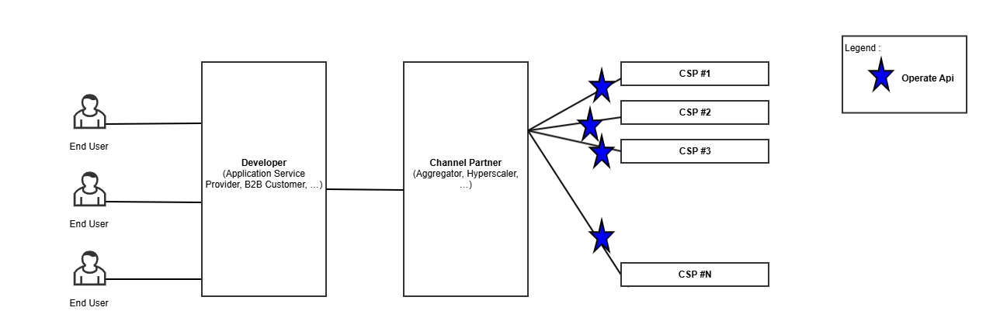

The use case illustrates two business models defined by the GSMA Open Gateway initiative:

- **Wholesale Reseller model** where the Channel Partner fully manages the service experience.

- **Marketplace Aggregator model** where the Channel Partner operates a marketplace platform where CSPs publish and manage their API products individually. Each API offering reflects the CSP’s own pricing and commercial terms. While the Channel Partner may group these offers in an aggregated view for ApplicationOwners for better discoverability, the CSP retains control over the commercial aspects of the product.

To ensure a consistent experience for Application Owners, a unified user experience (UX) layer is typically implemented on the Channel Partner side, abstracting differences between CSPs regardless of the underlying business model. This approach solves the challenge of fragmentation by shielding developers from having to manage multiple CSP-specific integrations and behaviors.

**Note: Terminology Alignment**

As part of refining our use case documentation, we will implement the following terminology updates:

- "Wholesale Reseller model" ==> "Aggregator model"

- "Marketplace Aggregator model" ==> "Marketplace model"

The terms originally used are derived from the **GSMA Open Gateway playbook (**[Channel-Partner-Onboarding-Guide-WA.101-v1.0.pdf](https://www.gsma.com/solutions-and-impact/gsma-open-gateway/wp-content/uploads/2024/02/Channel-Partner-Onboarding-Guide-WA.101-v1.0.pdf)**) **, but they may not fully reflect the operational reality in our context.

## Objective of the use case

The objective of this use case is to illustrate the commercialization of Camara Telco APIs by a Channel Partner, who will use the TMF Operate APIs to interact with his suppliers who are Telco CSPs.

It will permit to illustrate several options related to the ODA components able to provide/expose each Operate API.

## Scope and assumptions

### Scope

This use case describes a simple interaction scenario involving key players:

- A developer (Tom) who manages the application "ZoneDeals"

- A channel partner (Globy)

- Tom works at Country-Tour, a company interacting with the ecosystem through the Channel Partner. Depending on the agreement model, Country-Tour may either be a direct customer of the Channel Partner (in the Aggregator model) or a customer of the CSP (in the Marketplace model).

- 3 telecom CSPs **Op-Brazil**,** Op-France**, **Op-Belgium** that offer packaged Telco API services.

The scenario will illustrate two agreement models between the channel partner Globy and the different telecom CSPs: **Aggregator Model** and **Marketplace Model.** Then it will present the resulting catalog views for the channel partner and his customers.

And it will describe an order capture made by Tom on behalf of his company Country-Tour.

The delivery of this order, the usage and billing of the ordered products will be described in next versions of the use case or a subsequent use case .

### Assumptions

The following assumptions outline the key differences in how Globy operates under the Aggregator and Marketplace models for the commercialization of network APIs, using the Geolocation API as an example. In this use case, the commercial name of the API is 'Geolocation,' but it relies on the CAMARA specification of the Location Verification API.

- **Aggregator Model with (Belgium & France): **

- The Channel Partner Globy will bundle a Geolocation Offer that provides access to geolocation services in both France and Belgium, including:

- SLA service (99.9% uptime)

- Usage-based pricing per API call

- One-time fee

- The offer will be based on CAMARA APIs provided by the local CSPs (Op-Belgium in Belgium and Op-France in France).

- Globy will act as the main provider of the bundled geolocation service to the end customer.

- **Marketplace Model with (Brazil):**

- The Channel Partner will act as a broker, integrating the Geolocation API from Op-Brazil.

- The geolocation API will be offered as part of the Geolocation API product, maintaining the CSPs’ independent pricing and commercial terms.

- Globy will manage billing on behalf of the CSP and take a commission when it commercializes and invoices the service.

|   | Aggregator Model with (Belgium & France) | Marketplace Model with (Brazil) |
| --- | --- | --- |
| Catalog Management | Assumes a single offer managed by Globy. | Assumes that individual APIs are commercialized by each CSP. |
| Pricing | Assumes that Globy sets a fixed price for the bundled offer. | Assumes that each CSP sets its own pricing. |
| Commercial Relationship with End Customer | Assumes that Globy is responsible for managing Country-Tour relationship. | Assumes that the CSP is responsible for managing Country-Tour relationship. |
| Billing | Assumes that Globy bills Country Tour directly. Globy invoices and reverses part of the revenue to CSPs based on the agreement. | Assumes that Globy bills on behalf of the CSP and takes a commission (for commercialization and invoicing). Billing is handled based on the agreement. |

- This use case enables an existing application "ZoneDeals" already onboarded and managed by an ApplicationOwner(CountryTour) to subscribe to Geolocation API provided by channel partner and one or more Communication Service Providers (CSPs):

- ApplicationOwner :CountryTour is already registered with the Channel Partner 

- Application is onboarded and approved.

# Description

Scenario Overview:

The commercialization of the Geolocation API is structured through two distinct agreements between the Channel Partner (Globy) and the local mobile CSPs. Each agreement follows a different business model—Aggregator and Marketplace—defining how the API is priced, distributed, and invoiced.

- **Commercial Agreements Overview:**

The table below summarizes the two different agreements between the Channel Partner (Globy) and the local mobile CSPs, outlining their respective commercialization models, pricing strategies, and invoicing processes.

| Agreement Model | Aggregator Model (Belgium & France) | Marketplace Model (Brazil) |
| --- | --- | --- |
| Business Model | Globy acts as the exclusive distributor of the Geolocation API from Op-Belgium and Op-France. | Globy acts as a broker, listing Op-Brazil's Geolocation API on its marketplace. |
| Offer | A single, unified bundle managed and priced by Globy. | Each CSP publishes its own API separately. |
| Pricing | Fixed pricing set by Globy: | Price set by Op-Brazil One-time fee: 5€ Usage-based fee: 0.40€ per API call |
| Pricing | Fixed Price set by Op-France &Op-Belgium for Globy | Globy's commission on the order : 1€ Globy's commission per invoice: 0.50€ |
| Special Commercial Terms | Volume discounts :10% off for 1000+ API calls/month | Seasonal discounts :10% during summer |
| Customer Relationship | Managed by Globy (Globy is the main point of contact for customers).(Customers of Globy) | Managed by Op-Brazil(Customers of Op-Brazil) Globy invoices and takes a commission. Globy is not the CSP Customer CountryTour is the CSP's Customer |
| Invoicing | Globy invoices customers directly | Globy invoices Country Tour on behalf of Op-Brazil on a monthly basis and retains a commission for each transaction, as defined in the Marketplace Agreement. |
| settlement | Settlement over a one-month period calculated based on 0.40€ per API call. | Commission on the order and commission per invoice for Globy. |

- **Customer Journey:**

Tom logs into the Globy portal (the Channel Partner) as a Developer at Country-Tour. Depending on the commercial model, Country-Tour may act either as a direct customer of Globy (in the Aggregator model) or as a customer of the CSP (in the Marketplace model). Tom browses the catalog and subscribes to the 'Geolocation API' packaged offer.

Country-Tour** **uses the 'Geolocation API' to track users in real-time in Belgium and France through the Channel Partner, "Globy."

In our scenario, the channel partner is connected with the CSPs in Belgium and France through an Aggregator Model contract, and with Brazil through a Marketplace model contract.

Aggregator Model with SLA (Belgium and France): In addition to the 'Geolocation API', "Globy" offers an additional SLA service to ensure 99.9% availability and response times under 100ms. 

Marketplace Model (Brazil): "Globy" acts as a Marketplace, where the Brazilian CSP exposes its 'Geolocation API' with its own pricing and conditions. Globy takes a commission on each transaction.

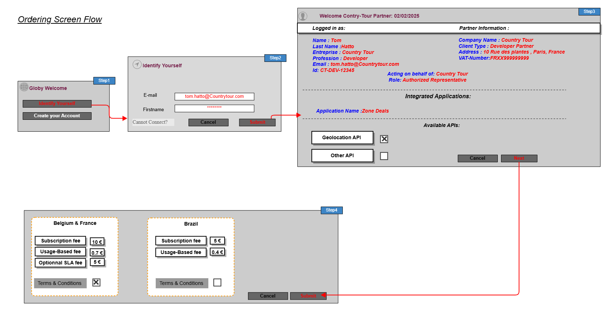

# Information View

This information model represents the Globy perspective components.

The use case does not currently cover the agreement's setup, it is considered as a pre-existing input.

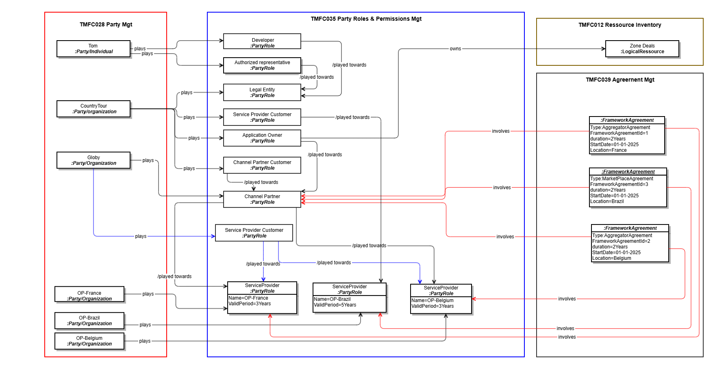

- The below diagrams details the information models for the channel partner and CSP product catalogs. It also depicts the framework agreements established between them. This information is also considered as pre-existing inputs.

The first modeling illustrates how, by following the Aggregator** agreement model**, the **offer and product catalog views** of the **Channel Partner** as well as the **involved CSPs in France and Belgium** are represented.

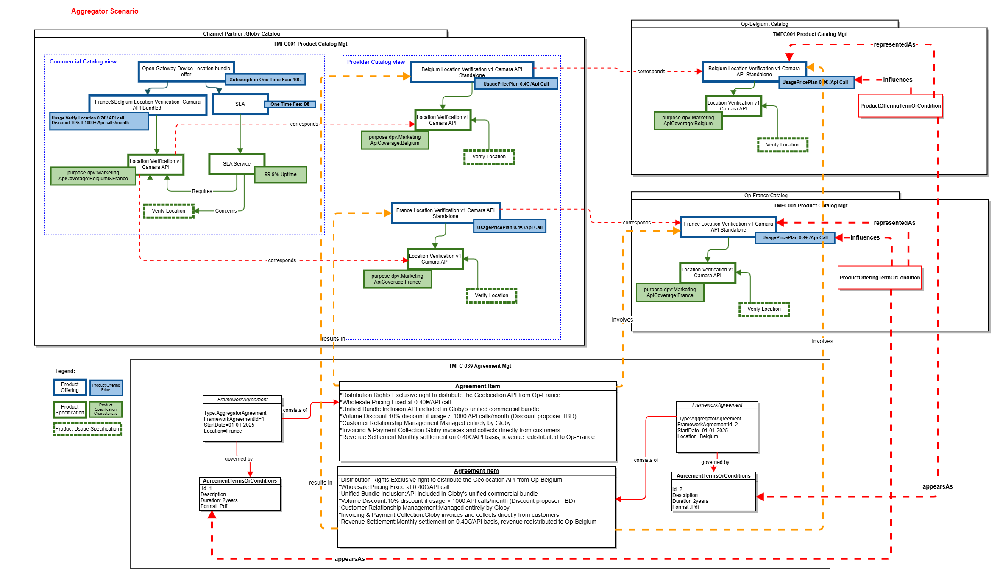

The second modeling illustrates how, by following the **Marketplace agreement model**, the **offer and product catalog views** of the **Channel Partner** and the **involved CSP** are represented.

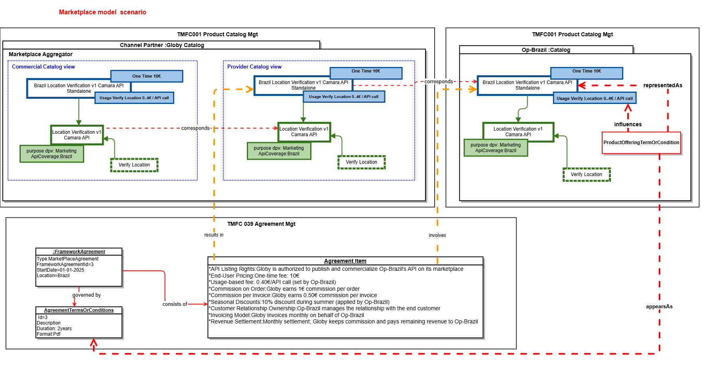

**Note: « AgreementItem » will need to be reconsidered in the evolution of the ABE « Agreement » within the SID.**

- Below is the representation of the Product Order view for the order placed by Tom, on behalf of Country Tour with the Channel Partner Globy. It corresponds to the result of the first version of this use case.

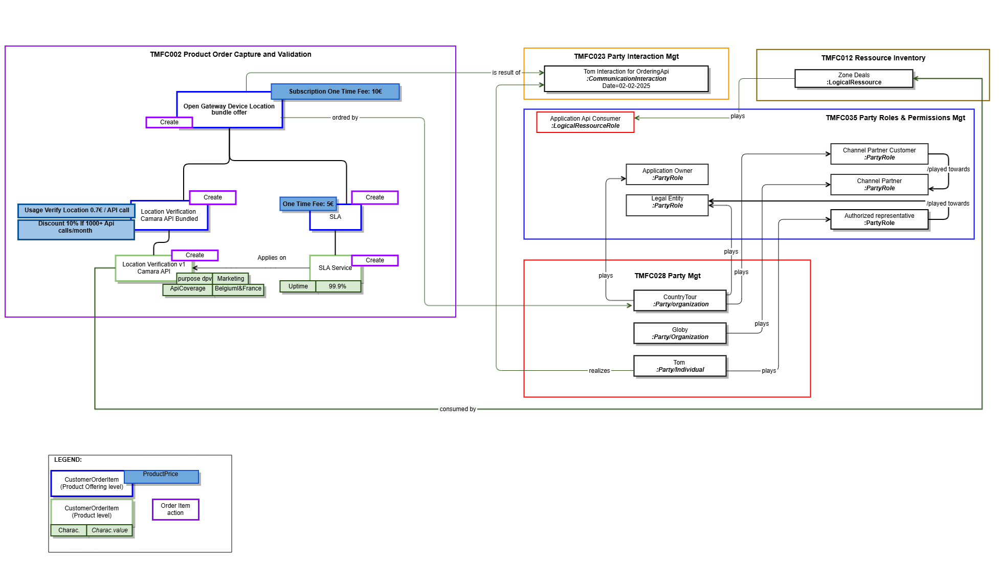

Below is the representation of the Product Order view for the order placed by Channel Partner Globy with the CSPs in France and Belgium.

This order enables the application ZoneDeals, managed by the ApplicationOwner Country-Tour, to access geolocation services provided by these CSPs. The API product will be consumed by the ZoneDeals application, which is owned by Country-Tour, to deliver location-based experiences to end users for marketing purposes.

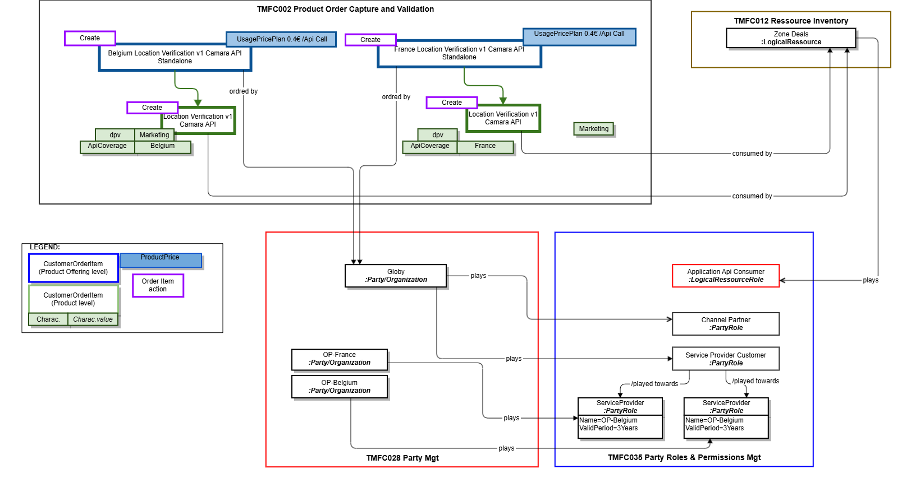

# Sequence diagrams:

In the sequence diagrams, the prerequisites to be considered for the two scenarios described below are:

- **Tom**, as a developer at Country Tour, initiates an order. The following assumptions are made:

- He is already known by the Channel Partner as:

- An identified individual

- A person with a digital identity

- A representative of Country Tour (role)

- **Country Tour** is recognized as:

- A legal entity

- An application owner

- **Zone Deals** is considered as a logical resource.

## Scenario 1 :

- **The Channel Partner’s POOM component orchestrates the delegation of the order delivery by directly interacting with the CSP France and Belgium components.**

- **The Channel Partner’s POOM component moreover orchestrates information creation prerequisites to the order delivery on CSP side (Party, PartyRole ...) **

- **The CSP- Catalog Management component (TMFC001) exposes the TMF936 (Product Catalog API)**

- ** while CSP-( Party Management (TMFC028), Resource Inventory (TMFC008), Party Role & Permission Management (TMFC035), and Product Order Capture & Validation (TMFC002) each expose only the relevant resource-specific parts of the TMF931 (Onboarding and Ordering API.))**

**Assumptions: **

- The onboarding of the application and its Application Owner takes place during the fulfillment of the first order placed by Tom, acting as the representative of Country Tour

- The CSP exposes an **API Gateway** that serves only as a simple **routing layer** (Not presented in the sequence diagram).

*** Contract & Catalog Sync Notification:***

This sequence describes how a Channel Partner integrates CSP offers into its commercial catalog through agreements, catalog synchronization, and packaged offer creation.

AGREEMENT SETUP:

- Contracts are signed between the Channel Partner and CSPs (France & Belgium)

- Agreement events (TMF651 AgreementCreateEvent) notify catalogs on both sides

- Each CSP creates product offerings linked to the specific agreements

- Channel Partner subscribe to event published by CSP Catalog

OFFER NOTIFICATION:

- When CSPs create new offers, they notify the Channel Partner via TMF936 ProductOfferingCreateEvent

- Notifications include offer IDs and basic information

OFFER RETRIEVAL:

- The Channel Partner queries CSP catalogs using TMF936 GET (ProductOffering and ProductSpecification)

- Retrieves detailed information about the new offers from both CSPs

UI NOTIFICATION:

- The system pushes notifications to the UI inbox

- Informs administrators that new CAMARA offers have been created and are available

BUNDLE CREATION:

- The Channel Partner admin manually creates a packaged/bundled offer

- Combines CSP France and Belgium offers into a single commercial offering

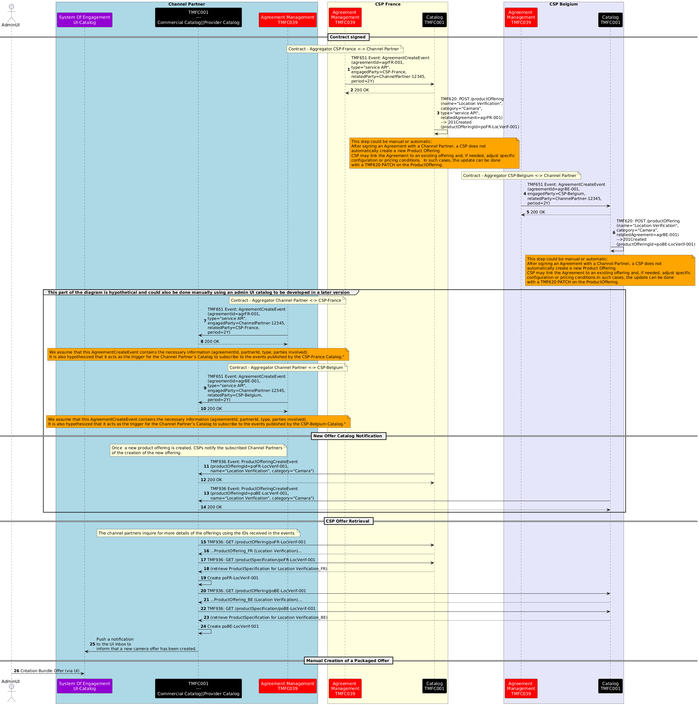

***Tom submits the order on the channel partner's website:***

This section will cover a standard order capture process, which is detailed in **TMFS003**.

Tom (Country Tour) authenticates, browses available API offers, and submits a product order via the Channel Partner platform, using TMF Open APIs. The steps involved are:

- Authentication:

- Catalog Browsing:

- Order Confirmation:

- Order Creation:

Notes:

- No qualification or configuration of offers is performed .

- Authentication ensures that Tom’s identity, roles, and permissions are verified before catalog access.

***Product Ordering and Application Onboarding:***

The following part of the diagram illustrates how a Channel Partner orchestrates a multi-country API product order with CSP France and CSP Belgium using TMF APIs.

- Order initiation: The CP’s POCV sends a ProductOrderCreateEvent (TMF622) to the POOM, which retrieves order details and triggers the fulfillment workflow.

- Onboarding in CSP France: An ApplicationOwnerOrganization is created (TMF931), followed by a role applicationOwner creation and the ZoneDeals application (TMF931). 

- Onboarding in CSP Belgium: The same sequence is repeated – owner, application, then role creation.

- Product ordering: The CP’s POOM sends POST /apiProductOrder (TMF931) requests to FR POCV and BE POCV. Both CSPs confirm the orders and emit productOrderStateChangeEvent.

- Finalization: The CP assigns the role applicationApiConsumer (TMF669) to the ZoneDeals app to enable API consumption.

Note:

- The TMF931 specification does not allow for the direct creation of a Party entity. Currently, a Party is instantiated implicitly during the creation of the Party Role "applicationOwner."

We propose enhancing the API to enable the independent creation of a Party entity, separate from the Party Role, through the introduction of a dedicated endpoint: "/applicationOwnerOrganization."

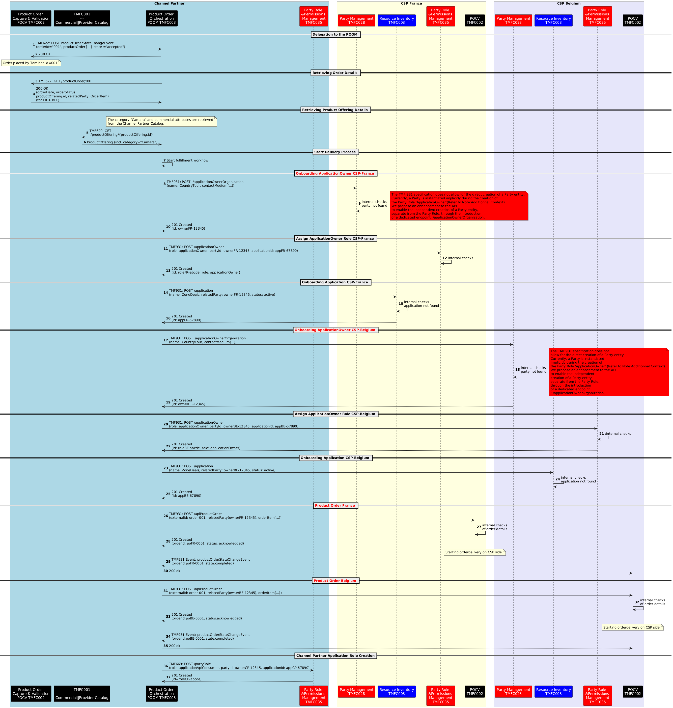

##  Scénario 2 :

- **The Channel Partner interacts exclusively with the CSP through the Open Gateway façade, using the standardized TMF931 (Onboarding & Ordering) and TMF936 (Product Catalog) Operate APIs.**

- **The Channel Partner’s POOM component orchestrates the delegation of the order delivery  interacting via facade with the CSP France and Belgium components.**

- **The Channel Partner’s POOM component moreover orchestrates informtaion creation prequisites to the order delivery on CSP side (Party, PartyRole ...) **

- **The façade does not implement any business process, it serves purely as a technical translation layer. It maps the external TMF931 and TMF936 requests to the appropriate internal APIs exposed by each CSP component**

- TMF936  used for catalog discovery, mapped internally to the CSP’s TMF620 Product Catalog API

- TMF931 used for both onboarding and ordering, mapped internally to:

- TMF632 Party API (for applicationOwner / organization creation).**(proposed as an evolution of the TMF931)**

- TMF639 Resource Inventory API (for application registration as a resource).

- TMF622 Product Ordering API (for product order management).

- TMF669 Party Role API (for assigning roles such as applicationOwner)

The façade is therefore an interoperability layer, ensuring that channel partners see a uniform interface (TMF936, TMF931), while each CSP can implement it by mapping to its own internal TMF APIs.

Note that even with a façade, the internal TMF API will have to understand the payload from the Operate API. So in reality, will have to implement the additional attributes added in the Operate API. For instance the TMF632 Party Management API will have to manage the additional attributes that are not in this TMF632 definition, for instance "dateProtectionOfficer". So in reality the TMF632 internal API will have to be upgraded to be TMF931 compatible. the difference between an internal API that is able to manage Operate API specificities vs the Operate API itself could be null.Except the fact that the standard internal API manages more contextes that the only Open Gateway context.

**Assumption:**

- Each CSP exposes an **Open Gateway façade** that only publishes the standardized APIs (**TMF936 for Catalog** and **TMF931 for Onboarding & Ordering**).

- The façade does not carry business processes; it acts strictly as a **technical translation layer**, mapping the Open Gateway APIs to the relevant internal APIs (**TMF620, TMF632, TMF639, TMF622**, etc.).

- *** Contract & Catalog Sync Notification Via Opengateway-Facade:***

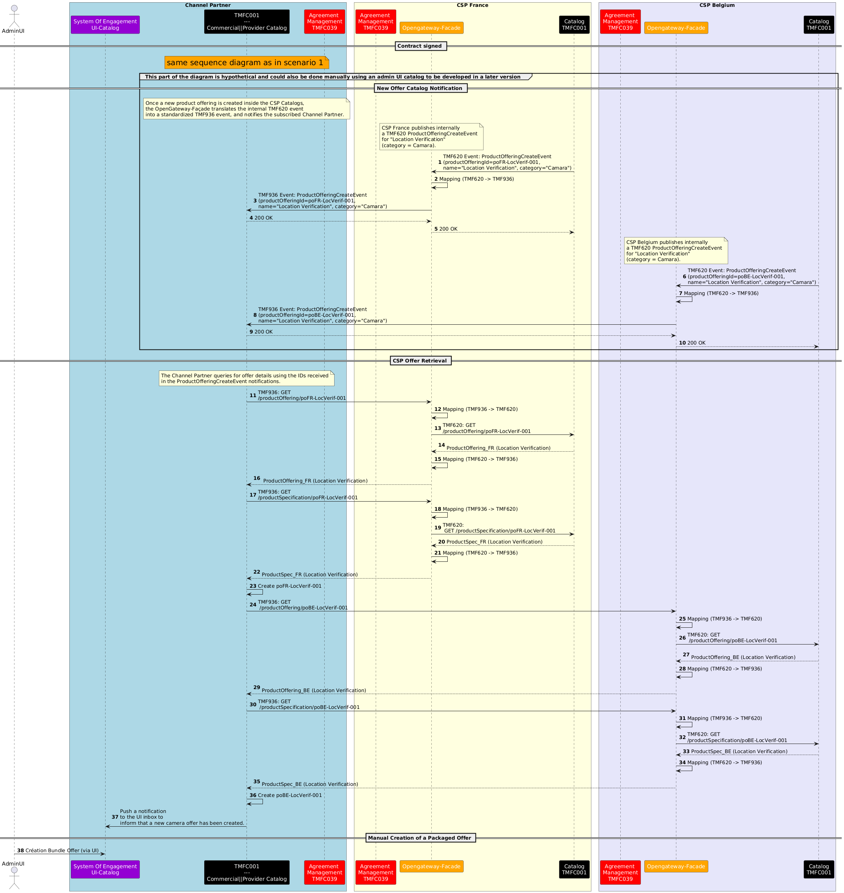

- ***Tom submits the order on the channel partner's website:  ***

This section will cover a standard order capture process, which is detailed in **TMFS003**.

Tom (Country Tour) authenticates, browses available API offers, and submits a product order via the Channel Partner platform, using TMF Open APIs. The steps involved are:

- Authentication:

- Catalog Browsing:

- Order Confirmation:

- Order Creation:

Notes:

- No qualification or configuration of offers is performed .

- Authentication ensures that Tom’s identity, roles, and permissions are verified before catalog access.

- ***Product Ordering and Application Onboarding Via Opengateway-Facade:***

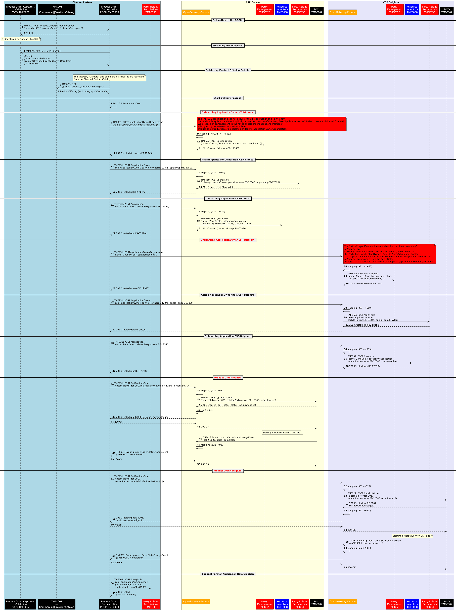

**NOTE :Additional Context – GSMA Approach**

- In the GSMA reference approach, only a single operation is exposed to the Channel Partner : the creation of the partyRole ApplicationOwner (via TMF931) that contains the Party information by value.

This has been a choice of Operate API team in order to reduce the number of endpoints and API calls by the Channel Partner. This is not consistent with the TMF669 Party Role API that doesn’t allow to pass the engagedParty by value, but only by reference.

- The CSP is responsible for creating the party internally, using its own orchestration layer, before assigning the partyRole.

- The sequence diagram for this “orchestrated Open Gateway-facade” scenario could be developed in a future version of this use case, as a main reference scenario complementing the two existing ones (direct exposure and simple façade translation).

- Or we can also imagine a scenario that envisions sending a single consolidated Product Order request from the Channel Partner to the CSP, which would then handle the creation of all prerequisite entities (Party, PartyRole, Application) and execute the order as part of the same process.

# Conclusion

## Lessons learned

- A new **translation component (Open Gateway Façade)** is introduced: exposed by CSPs to Channel Partners, it plays only the role of technical translation between standardized APIs (TMF931, TMF936) and the native APIs exposed by internal ODA components (TMF620, TMF622, TMF632, TMF639, TMF669).

- The **POOM component of the Channel Partner** goes beyond its initial orchestration role: it actively creates the prerequisite entities on the CSP side (Party, PartyRole, Resource) required to complete the order fulfillment.

- Beyond the two implemented scenarios, other alternatives are possible  : for example, the POOM could delegate the creation of prerequisites and even the execution of the order directly to the CSPs’ POCV components.

- One **open question remains**: in Scenario 2, in case of anomalies or errors during execution, which component is accountable for handling them — the façade, or the underlying CSP components?

- In Scenario 3, in the next version on the asset would provide further elaboration on the option "rely on existing TMF931 implementation" where the façade orchestrates steps 8 to 13 during the onboarding, exposing a single call creating (applicationOwner) resource, instead of 2 calls for party and partyRole.

## Impacts identified

*<List of JIRA items identified at SID, Open APIs or ODA components inventory (IG1242) levels - or other impacts to reference inputs>*

# Appendix

*Refer to *[TMFS003](https://www.tmforum.org/resources/technical-specification/tmfs003-order-capture-fiber-contract-v9-0-0/)*:use case Order Capture :Fiber Contract (in sequence diagram section)*

