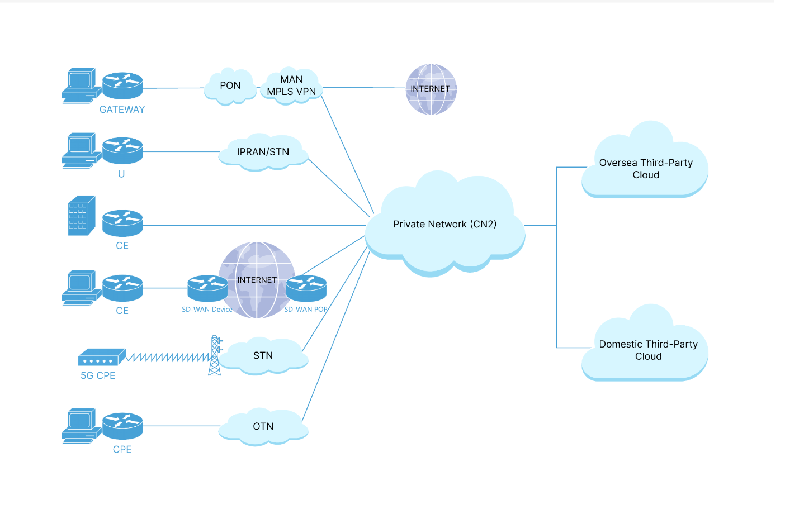
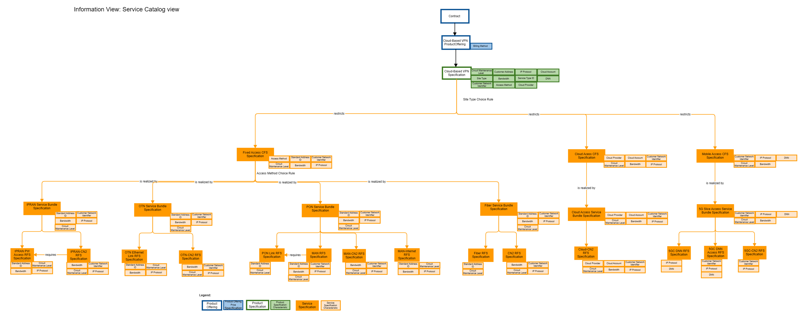
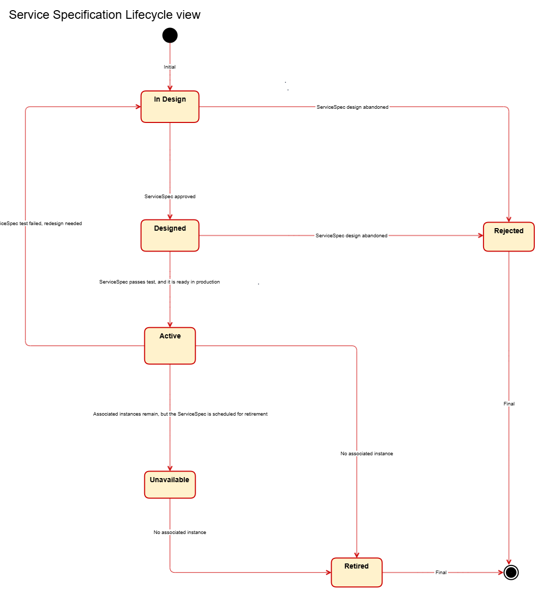
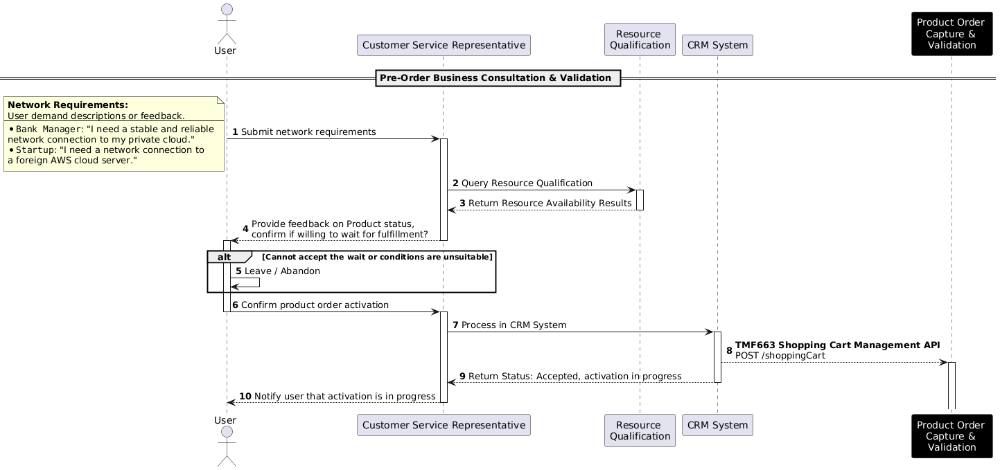
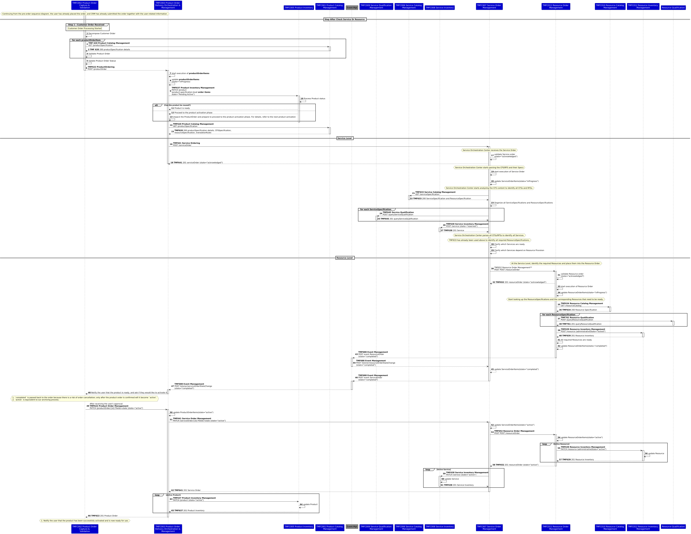
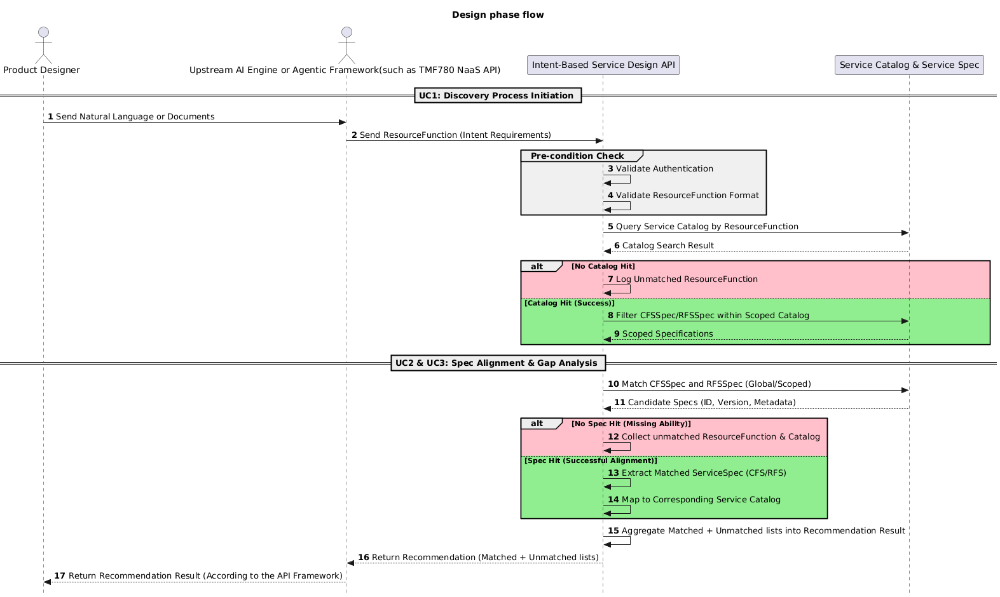
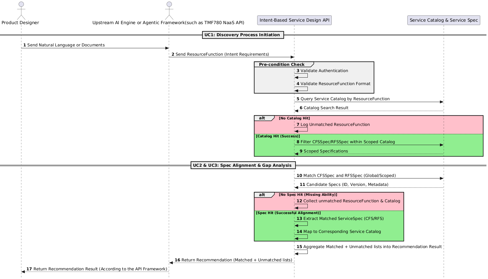

# Executive Summary

This document presents a use case for end-to-end modelling of cloud-based VPN services for government and enterprise customers using a Product-Service-Resource (PSR) approach and dynamic orchestration. It shows how operators can replace manual, fragmented provisioning processes with modular, reusable service components that support more flexible design and automated delivery across complex scenarios. Key benefits include reduced development effort, faster product loading and time-to-market, improved delivery efficiency, greater scalability, and stronger support for customized enterprise services.

# Introduction

This use case focuses on the service provisioning design process for government and enterprise services. Before a new product is launched, the OSS team generates the required configuration plan based on the business requirements provided by the BSS, and initiates development, integration, and validation. Once integration testing is successful, the product is made available for commercial activation and sales through the BSS.

The use case adopts a PSR (Product-Service-Resource) modeling approach to design end-to-end service provisioning. It leverages a bottom-up, component-based modeling methodology, decomposing complex government and enterprise business scenarios into reusable service components that can be flexibly composed and configured. This approach significantly reduces redundant development efforts and greatly improves product loading efficiency and time-to-market.

## Context or Background

This use case focuses on the government and enterprise market, targeting industry customers in sectors such as education, healthcare, public services, and manufacturing with virtual private network (VPN) services. It aims to optimize the service provisioning process and the design of service capabilities. Given the increasingly diverse and customized demands of industry VPNs, traditional provisioning approaches that rely heavily on manual coordination are no longer sufficient to support efficient delivery or large-scale replication.

To address these challenges, the use case is built upon the TM Forum GB922 series standards and the Network-as-a-Service (NaaS) concept. It adopts a PSR (Product-Service-Resource) modeling approach combined with dynamic orchestration mechanisms to enable the modular restructuring of service capabilities and automated provisioning across multiple scenarios. This approach enhances the flexibility of service design and the efficiency of delivery, empowering operators to evolve into agile service capability providers.

This document will analyze practices in three phases—pre-order, provision, and design—but the main focus will be on the design phase, with the pre-order and provision phases briefly covered to aid understanding. To balance the authenticity of end-to-end modeling with readability, the content of the article has been structured with appropriate detail (design phase elaborated, others condensed), in the hope of helping readers understand the real-world situations described.

## Objective of the use case

Previously,communication network management systems are typically constructed in a siloed manner, segmented by network domain, operations structure, and network hierarchy. This results in a “chimney-style” architecture, where systems for different network domains operate independently, and there is limited coordination across regions and hierarchical levels. Consequently, network management systems are numerous yet fragmented, making it difficult to share data and to achieve unified, end-to-end network and service management.

During the service provisioning process, telecom operators often rely on experts from various network areas to coordinate across departments and manually design provisioning workflows on a per-project basis. This leads to long provisioning cycles, low process reusability, and reduced overall efficiency. From an operation and maintenance perspective, the lack of a unified service view limits the ability to comprehensively monitor and manage service performance. At the same time, insufficient automation in O&M means that fault diagnosis and resolution still require significant manual intervention, impacting overall operational efficiency and service quality.

This use case is intended for OSS teams within telecom operators, including network experts, developers, testers, and operations personnel. It aims to enhance the efficiency, reusability, and consistency of service provisioning for government and enterprise customers by applying standardized, component-based, and automated approaches.

For network experts, this use case provides a structured and standardized component modeling methodology that enables the abstraction and encapsulation of network resources and service capabilities based on unified specifications. This reduces cross-domain communication costs, avoids redundant component design, and improves the accuracy and consistency of provisioning design. In practical implementation, network experts may act as Service Designers and/or Technical Solution Designers to contribute to end-to-end solution development and delivery.

For developers, the standardized design of service capability components lowers the development threshold, increases development efficiency, and eliminates redundant implementation of similar functionalities.

For testers, unified components and provisioning workflows simplify test design, reduce complexity, and alleviate the maintenance burden caused by duplicated test suites.

For operations personnel, this use case adopts a componentized process design along with dynamic orchestration capabilities, supporting rapid construction of end-to-end provisioning workflows tailored to different business scenarios. The reuse of service components across multiple product provisioning cases reduces operational costs. Meanwhile, streamlined orchestration logic, visualized workflows, and controlled execution improve provisioning consistency and responsiveness.

This use case aims to establish an agile, efficient, and scalable service provisioning architecture that supports rapid rollout of government and enterprise services, serving as a key enabler for NaaS capability exposure and agile operations in telecom environments.

## Scope and assumptions

### Scope

This use case is based on a typical end-to-end private network service provisioning scenario. It covers customer internet access, cloud access, inter-site connectivity, and access from customer sites to various types of cloud resource pools. It is applicable to virtual private network (VPN) service requirements in application domains such as video, education, healthcare, IoT, cloud desktops, cloud conferencing, and cloud recording. The use case systematically demonstrates the complete construction path from RFS (Resource-Facing Services) and CFS (Customer-Facing Services) to the product layer.

### Assumptions

This use case assumes that RFS capabilities are already in place and therefore does not focus on the composition and mapping between RFS and underlying RES (Resources). The core objective of the use case is to demonstrate how to construct CFS based on existing RFS capabilities and further assemble them into a product view.

It is important to note that the term "product" in this context specifically refers to an OSS-oriented net product—a technical construct designed and delivered by the OSS team in response to business provisioning requirements from the BSS side. This type of product focuses solely on enabling end-to-end connectivity and communication capabilities, without involving commercial attributes such as pricing strategies, charging models, or billing processes.

As such, the product constructed in this use case is not a commercial offering intended for direct sale to end customers, but rather a foundational capability package that supports subsequent product composition, commercial bundling, and sales activities handled by the BSS layer. The objective of this use case is to support the rapid launch and efficient delivery of service capabilities, laying the foundation for operators to build a flexible, standardized, and scalable product and service design framework.

# Description

The Cloud-Based VPN is a typical networking product that adopts a modular approach-like Lego blocks. It is composed of multiple network segments to support multi-point-to-multi-point communication, enabling internet access, cloud connectivity, and inter-site networking for customers.

Based on the product diagram, this use case includes the following typical segments:

- **Multiservice over a single line**: A single physical or logical access link can simultaneously carry multiple services. In this case, PON (Passive Optical Network)is used as the access method. By configuring the connectivity between the PON and MAN (Metropolitan Area Network), the same access line can be used to support both internet and private network access for the customer site.

- **Customer site access**: Customer sites connect to the private network through fixed access technologies such as IPRAN (IP Radio Access Network), PON, and OTN (Optical Transport Network), or via mobile access using 5G. This enables connectivity between customer edge devices and the private network, supporting communication across branch locations.

- **Cloud site access**: Set up the network configuration between the cloud resource pool and the private network to allow seamless access from the private network to the cloud resource pool.

In the enterprise networking scenario, the configuration is as follows:

**Initial Site Installation: **The user first submits an order to activate a new user site—for instance, using PON access. During order intake, key information such as the customer network identifier, and customer information is collected, and the customer address is converted into standard address ID and sent to the OSS systems for network activation. The resource management system then creates a VPN instance based on the customer network identifier, assigns VPN RD (Route Distinguisher) and RT (Route Target) according to the site's city, and send this data to the MSE equipment within the MAN and PE equipment within private network, thereby establishing the site’s connectivity to the private network. The site is billed based on its specific access rate.

**Additional Site Access: **Based on an existing VPN instance, additional sites can be deployed—for example, adding a new site in another city using an IPRAN access method. The resource system queries the VPN information based on the customer network identifier and allocates RT. The configuration is then delivered to the PE devices within the private network, completing the VPN instance setup and enabling connectivity from the new site to the private network.

Once deployed, both sites are connected to the private network under the same VPN instance, the end-to-end connectivity between the sites has been established. Billing is handled independently for each site and summed according to the defined charging policy.

# View

## Information View

From the above network segments, it is clear that the  Cloud-Based VPN Product specification includes three CustomerFacingServiceSpecs: Fixed Access CFS, Mobile Access CFS, and Cloud Access CFS. Some of these CustomerFacingServiceSpecs may have already been modeled in other ProductSpecs, and can therefore be reused directly in this ProductSpec, improving efficiency and reducing duplication.

It is important to note that these CustomerFacingServiceSpecs do not follow strict sequential dependencies. They are modular functional components that can be flexibly assembled based on specific customer needs, rather than being preconditions that must be fulfilled in a fixed order.

**Why a Single Product with 3 CFSs instead of 3 Independent Products?**

We explicitly decided against defining each CFS as an individual AtomicProductSpec due to internal operational workload and product management constraints.

If we were to use an atomic product model, the combination of our multiple branch offices and varied customer demands would lead to an exponential spike in product records. For instance, if 3 branches sell this Cloud-Based VPN to 3 different customers, and each selects 2 access methods, the atomic product combination model would require 3 x 3 x 2 = 18 records to be maintained. Our current "1 Product + 3 Modular CFSs" design drastically reduces this complexity to just 3 records.

Consequently, avoiding the atomic model prevents a massive administrative burden on the BSS and OSS for product lifecycle management, sales performance reviewing, and product tracking.

At runtime, the CRM system places orders according to the customer’s selected service and current network situation, and each order matches with a specific CustomerFacingServiceSpec and generates its corresponding service instance. These orders are ultimately assembled into a complete end-to-end service chain, enabling flexible and efficient service delivery tailored to customer requirements.

Taking a specific scenario as an example: the service flow starts from the customer premises, where the user connects to the operator’s private network via a fixed access method (e.g.,IPRAN, OTN, PON or fiber access ). From the private network, the connection extends to the cloud resource pool, enabling a dedicated and secure link between the customer site and cloud services. The end-to-end circuit can be divided into two segments: the user access segment and the cloud-to-CN2 segment. The following two cases may occur:

- If the site is classified as a cloud site, and a fixed site has already been provisioned within the same private network, the order processing specialist typically needs to submit only one service order (e.g.,Cloud Access) for the cloud site. This enables the user to access cloud services through the existing fixed access connection.

- If no circuits have yet been provisioned, the order processing specialist need to submit two separate service orders: one for a cloud site (e.g.,Cloud Access) and another for a fixed site (e.g.,IPRAN Access) or mobile site (e.g.,5G ACCESS), in order to complete the full product implementation.

At runtime, the order processing specialist must also specify the site type and access method. The system will automatically execute the corresponding CustomerFacingService instance based on site type, and the appropriate Service Bundle is selected based on the access method. For example, if the site type is "fixed site" and the access method is "IPRAN", the system will automatically trigger the Fixed Access CFS, along with the execution of the IPRAN PW Access RFS and IPRAN–CN2 RFS.

Note: The "private network" referenced in this use case refers specifically to the operator’s bearer network, which corresponds to “CN2” in the Information View.

A ServiceSpec starts in the "In Design" state when it is first created. After completing the design and passing the review process, it transitions to the "Designed" state. If the review fails, it remains in "In Design". If the ServiceSpec is abandoned during design, it moves to "Rejected".

Once designed, the ServiceSpec should pass a series of tests—including functional testing in a test environment and business validation in the production environment. If it passes, it transitions to "Active", indicating that the specification is now callable in production and can be used to generate corresponding service instances. Multiple service instances can be generated from a single ServiceSpec.

If testing fails, the ServiceSpec should be reworked, and its status returns to "In Design" for redesign.

When a ServiceSpec is scheduled for retirement but still has associated service instances in the production environment, its state changes to "Unavailable"—no new instances may be created from it. Once all instances are removed from the production environment, the ServiceSpec status is updated to "Retired", marking the end of its lifecycle.

The service specification lifecycle view is informative and not normative.

# Diagrams

## Sequence diagrams

### Pre-order Business Consultation and Validation Sequence Diagram

1. Regulatory Resource Validation: Before a formal order is placed, the Customer Service Representative (CSR) performs a resource availability check via the Resource Qualification interface. 

2. Informed User Consent: By providing feedback on resource status and potential wait times before final commitment, the process ensures the user can make an informed decision to proceed or abandon. This effectively filters out mismatched expectations and reduces the risk of future complaints.

3. Seamless System Integration: Once the user confirms, the workflow transitions smoothly from manual consultation to CRM System processing. This culminates in the submission of the order to Product Order Capture & Validation, marking the formal handover from the "inquiry phase" to the "automated fulfillment phase."

### Product Fulfillment and Activation Sequence Diagram

1. Product Level (Product Order Orchestration & Management)
This level handles the customer-facing business logic, managing the entry, validation, and lifecycle of the commercial offering.
* Order Capture and Decomposition: Receives the customer order and utilizes the Product Catalog Management (TMF 620) to validate specifications and decompose the order into actionable product items.
* Business State Management: Manages the product's lifecycle via Product Inventory Management (TMF 637), transitioning the product from "Pending Active" to "Active" based on orchestration events.
* Customer Interaction & Confirmation: Acts as the final gatekeeper that notifies the user of readiness and secures final approval before triggering the ultimate activation of the service.

2. Service Level (Service Order Management)
This level acts as the bridge between business products and technical infrastructure, translating commercial intent into technical configurations.
* Technical Specification Parsing: Uses Service Catalog Management (TMF 633) to decompose products into Customer Facing Services (CFS) and Resource Facing Services (RFS).
* Service Qualification and Reservation: Performs serviceability checks via Service Qualification Management (TMF 645) and pre-allocates service instances in Service Inventory Management (TMF 638) with a "Reserved" status.
* Service Orchestration: Coordinates the dependencies between different services and triggers the necessary resource requirements to the underlying resource management layer.

3. Resource Level (Resource Order Management)
This level deals with the actual physical and logical network components required to realize the service.
* Resource Specification Identification: Queries the Resource Catalog Management (TMF 634) to identify the specific hardware, logical ports, or cloud resources needed for the service.
* Resource Qualification and Locking: Conducts resource availability checks via Resource Qualification (TMF 761) and updates Resource Inventory Management (TMF 639) to set the resource state to "Locked" to prevent double-allocation.
* Infrastructure Readiness: Confirms that all underlying network elements are prepared and notifies the Service Level that the physical/logical foundation is ready for activation.

4. Activation Level
This is the final execution phase where configurations are pushed to the network, and the entire stack is brought online.
* Bottom-Up Activation Sequence: Executes a synchronized activation flow starting from the Resource Inventory Management, moving up to Service Inventory Management, and finally reaching Product Inventory Management.
* State Synchronization: Updates the administrative and operational states of all components to "Active" across all inventory systems, ensuring the "as-built" record matches the "as-ordered" request.
* Completion and Archiving: Finalizes the product order after successful activation, transitioning the process from an "Order State" to a "Live State" and notifying the customer that the service is ready for use.

### Design Phase Flowchart and Sequence Diagram

The core of the flowchart is:

- Based on ResourceFunction, identify existing Service Catalogs and Service Specifications that meet the user's network requirements.

- Locate missing service catalogs and Service Specifications, and supplement them through means such as AI, manual efforts, etc.

- Generate a list containing the content from the above two points and return it to the user.

The core of the sequence diagram is:

- Compared to the flowchart, it adds pre-conditions, maps out ResourceFunctions based on AI technology or existing IT technology, and supplements the interactions of APIs related to the actual design phase.

- The AI framework of the sequence diagram can be adjusted according to the requirements of each organization. Due to the rapid development of the AI era, there is no definitive consensus on the specific framework. However, the structure of its inputs and outputs is clear.

# Conclusion

## Lessons learned

This use case demonstrates that the transition from siloed, "chimney-style" network management to an agile, PSR-based architecture is essential for supporting modern network services. The key lessons learned are:

- **De-siloing via PSR Modeling:** The adoption of a Product-Service-Resource (PSR) modeling approach effectively eliminates the dependency on manual, cross-department coordination. By decomposing complex business scenarios into reusable service components (CFS/RFS), operators can achieve a modular structure that supports rapid service design and automated provisioning.

- **Standardization as an Enabler:** Standardized component design reduces the development threshold and eliminates redundant implementations of similar functionalities. This consistency is crucial for reducing O&M costs and improving the overall quality of service.

- **Efficiency Gains:** By shifting from project-specific manual workflows to standardized, component-based orchestration, operators can significantly shorten provisioning cycles and improve time-to-market. The use case confirms that the defined approach is a critical enabler for NaaS capability exposure.

Also, TMFC027 Product Configurator is well-suited for supporting the Product Qualification and ProductOffering Qualification in the pre-order process; however, it currently lacks Product Qualification working for checking and querying Product.

## Impacts identified

This use case validates the effectiveness of the PSR modeling approach in decomposing complex business scenarios and demonstrates the significant evolutionary potential of the GB922 standard in agile, cross-domain orchestration environments.

 The design phase flow and sequence diagrams will be updated in subsequent releases, aligned with the initiation progress of the TM Forum OpenAPI(Intent-Based Service Specification Design API).

