# Introduction

This Use Case focuses on Assurance of a network scenario incorporating multiple network technology domains:

- where several of the domains have active functions that are self-managing and self-healing ( Proactive/ Predictive Maintenance) ,

- where a fault occurs in the physical network realizing connections supporting multiple OSI connectivity layers and multiple technology domains. (Reactive Maintenance).

This SD-WAN  Use Case is inspired by:

- High value use cases proposed to the AN  Self-Healing Domain Team: [IG1373 AN Use Cases: A Guide to Self-Healing and Closed-Loop Automation v1.2.0](https://www.tmforum.org/resources/introductory-guide/ig1373-an-use-cases-a-guide-to-self-healing-and-closed-loop-automation-v1-2-0/) Access Domain use case using SD-WAN services.
also to be published as  [IG1373B](https://projects.tmforum.org/wiki/pages/viewpage.action?pageId=347675152).

- A fibre break /faulty optical line Termination (OLT)  use case 5.2.1.1. NaaS Service Intent Assurance : Fibre break [TR313C ODA (Production) Components for NaaS Evolution v1.0.0 – TM Forum](https://www.tmforum.org/resources/component/tr313c-oda-production-components-for-naas-evolution-v1-0-0/)

IG1373B identified a high value use case comprising a cross domain assurance capability that establishes network health; and probable causes of network faults/impairment, in the context of network technologies
supporting several layers of the OSI stack, (rather than focusing solely on concatenation of connectivity at a single layer in the OSI Stack).

The key benefit identified in this self healing use case is:

- Whilst a network failure within Self Healing Domains does not lead to a immediate customer service failure, it is easy to think that no assurance actions are required by Operations staff as the customer service is maintained. 

- But in the case of a fault: such as  failed router, failed optical transport or a fibre cut due to a backhoe, these physical conditions do need to be repaired as they impair the Network Heath e.g resilience and availability They impact and potentially extend 
Mean Time to Repair(MTTR)  of a subsequent fault that cannot be remediated and hence directly affect an end customer SLA.

The opportunity is to move from expensive reactive maintenance actions to repair a customer service, to a planned predictive approach, where there are enhanced options to schedule and deploy fewer staff and truck rolls and drive up operational efficiency.

## Context or Background

This Use Case focuses on the determination of network health and Probable Cause Analysis aka Root Cause Analysis (RCA) involving multiple Multi-Technology Domain Managers, Multiple Operational Domains (aka Autonomous Domains) and making a Next Best Repair/Remediation Action recommendation.

For this Use Case the cause is physical line plant failure between Technology Domains such as a Fibre Breaks caused by a backhoe damaging the physical ducts and cables. 

Noting that in the access network there is less likelihood of standby or duplicated paths as compared to core network where duplication is more prevalent. So in this example there is a mixture of self-healing and non self-healing domains working together.

## Objective of the use case

When a physical infrastructure fault i.e. line card or fibre occurs with a mixture of self-healing and non-healing network domains:

- How do Operations staff determine that there is an outage/ impairment to the Network Health?
*I.e. what kind of observability and metrics need to be available to Operations staff?*

- How do they determine who, what, where & when to repair the fault?
*I.e. what are the operational procedures and mechanisms  for using this information?*

Currently there is limited experience in operating self-healing networks with non-healing networks. Hence the best practices have yet to be established and will evolve over time.

## Scope and assumptions

### Scope

[IG1373 AN Use Cases: A Guide to Self-Healing and Closed-Loop Automation v1.2.0](https://www.tmforum.org/resources/introductory-guide/ig1373-an-use-cases-a-guide-to-self-healing-and-closed-loop-automation-v1-2-0/)  shows that many practical examples of high value assurance use cases are dependent on linking inventories of  physical resources (OSI Layers L0/L1) to the  inventories of configuration and state of active equipment and software ( operating at OSI  L2/3); and possibly to sources external to the network. 

Self-managing Domains based on Controller concepts generally operate at L2/L3 layers. For L0/L1 physical domain self-healing is usually limited to core networks, as self-healing in access network is prohibitively expensive (CAPEX).

The linkage of information in inventories is part of creating a digital twin representation - a specialized form of a Topology Graph - that records the relationships among inventory information and allows for queries that navigate the relationships both within and between inventories for: Infrastructure L0, Transport L1, Logical L2/L3 and potentially L4 of the network.

Intrinsically networks are layered, and the challenge is to discover and establish relationships between assets at these different network layers to support relating observed symptoms to causes of network impairments/incidents.

This is illustrated in the  [IG1373B AN Use Cases: Network Quality Optimization & Fault Management v1.0.0 DRAFT (ANP-1236)](https://projects.tmforum.org/wiki/pages/viewpage.action?pageId=347675152)

 

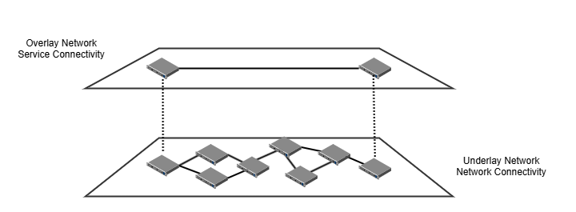
*([text description](media/overlay-underlay-network-connectivity-layers.text-description.md))*

**Fig 1.1 IG1373 Use Case Access Domain section 3.3.8 underlay network **

This shows the layered nature of network illustrated as an overlay link e.g. UCS in SD-WAN, that is dependent on an IP Transport underlay e.g., MPLS/ IP Transport. 
Similarly, there are further layers of dependency e.g. Fibre Transport layer and Physical Infrastructure.

 It is frequently presumed that only the network topologies and network data /telemetry feeds are needed for automated self-healing. But in many real-world use cases, additional sources of data information and knowledge are needed, for example power company information, civil emergency information, social events, metrology information and more.

An  example of layering may also emerge when considering the ServCo NetCo/InfraCo split:

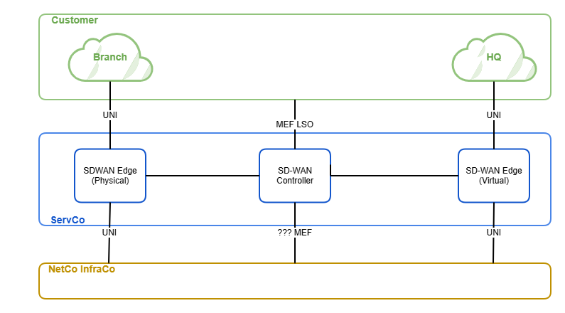
*([text description](media/servco-netco-infraco-sdwan-layering.text-description.md))*

**Fig 1.2 Example of layering between ServCo and NetCo/InfraCo for SD-WAN service**

In the following examples we assume use of a mixture of Mplify LSO API data models realized using TM Forum Open APIs, and interfaces realized by lower level Coordinators using typically IETF/ BBF RESTCONF based interfaces, and YANG based data models.

The positioning of this SD-WAN exemplar to  IG1224 NaaSOperational Domains and TR313C ODA Production Components is: 

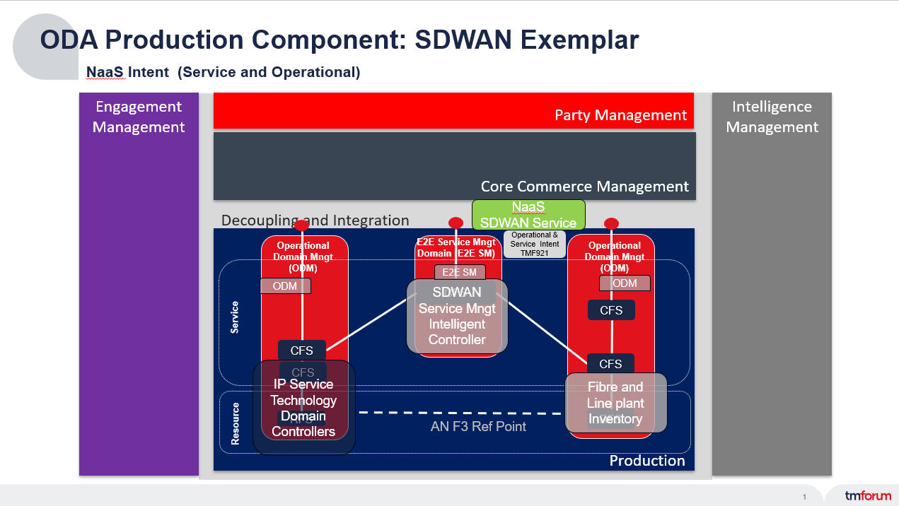
*([text description](media/oda-production-sdwan-naas-domain-mapping.text-description.md))*

**Fig 1.3 Mapping of exemplar to IG1224 NaaS Domain model**

The NaaS Service exposed by ODA Production is a SD-WAN Service based on NaaS APIs and using a MEF SD-WAN Service/attributes as API Payload. In this SD-WAN exemplar the service is exposed by a configured instance of a Service Management Intelligent Controller (SMIC) solution ( which maybe a bundle of ODA Components — for further study)

The IP (Underlay) Service is based on a technology Domain Controller exposing TM Forum APIs using MEF IP Service/Attributes Payload.  In practice, vendor provided controllers may natively come with functionally equivalent RESTCONF YANG interfaces, and some form of protocol adaption may be required, possibly using a Operational Domain specific SMIC ControllerSolution. This model is chosen as simpler, and avoids over complicating the Use Case Flow Scenario with incidental detail.

The Fibre and Line Plant Infrastructure is assumed to be entirely passive so that operational domain is supported by Inventory Solutions mostly probably based on TMFC012 Resource Inventory  with schema extensions to support each technology domain.

Other functionally equivalent use cases could be constructed but the assurance interaction patterns between solutions (using both ODA and NEP Networking Components) would be essentially unchanged.

### Assumptions

This Use Case assumes that:

- Practical CSP operational scenarios will comprise of a mixture of self-healing domains and traditional non self-healing domains (Proactive and Reactive Maintenance).

- The Operational Domain Model from IG1224 NAAS corresponds to one form of self-healing Autonomous Domain. 

# Description

## IG1373B SD-WAN Use Case

This Use Case is focused on remediation and recovering from a physical Fibre Break or OLT failure between logical equipment in multiple locations, operating at multiple OSI levels, where different equipments are under several Operational Domain governance regimes. This corresponds to the typical operational situation in most CSPs.

This proposal is derived from the SD-WAN Use Case in the Self-healing Use Case document: 

 [IG1373B AN Use Cases: Network Quality Optimization & Fault Management v1.0.0 DRAFT (ANP-1236)](https://projects.tmforum.org/wiki/pages/viewpage.action?pageId=347675152)

The goal is to correctly identify the next best remediation action and achieve both: 

- Minimum number of field force interventions and truck rolls.

- Reduce the Mean Time to Repair/remediation which improves network Health e.g. resilience and availability.

The use case in IG1373B created the scenario below which has been enhanced with:

- Proposals for exemplar Autonomous Domain boundaries, 

- Addition of the proposed Service Management Intelligent Controller (SMIC) solution that creates a customer facing end to end service management view derived from the collection of technology domains e.g. SD-WAN Controllers, IP /MPLS underlay underpinned by fiber controllers, physical and infrastructure. This concept of e2e Service Management Operational Domain/Manager comes from IG1224 NaaS Operational Domain concept. 

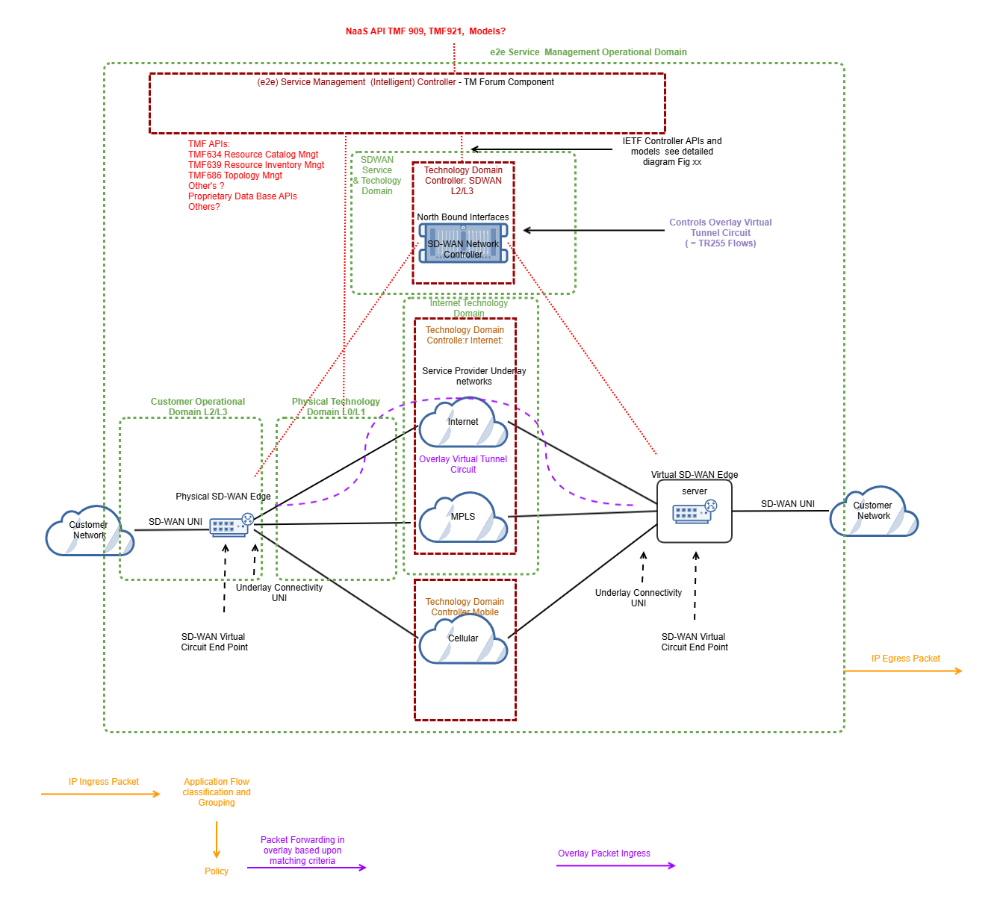
*([text description](media/sdwan-self-healing-use-case-packet-flow-overview.text-description.md))*

**Figure 2.1 IG1373 Self-healing SD-WAN Use Case **

The SM Intelligent Controller solution works directly with each Individual Layer of the network, some working in reactive assurance mode, and some in predictive /proactive assurance mode. 

The common requirement is observability of the state of health of the constituent  Operational and  Technology Domains. This aligns with current analysis and proposals in the IETF NMOP initiative.  

Use of Intent management interfaces means the provisioning process will operate on a Standardized service model but the assurance interactions may report at both a Service level for Health, and Resource level with impaired resources together with links to the impacted Service entities. This information allows SMIC to navigate between network(OSI)  layers and carry out impact analysis. 
The IETF NMOP team are proposing a common telemetry solution for Assurance Management and reporting solutions for several IP networking solutions, where the difference between the solutions are the specific resource model and mapping to standardized Service Models. 

This Use Case reflects an evolution in the management of IP Networks. Historically IP Network Management has operated at the element management and device level as shown on the left-hand in the diagram below.

Recent IP Management Solutions are based on Network Management realized as controllers as shown on the right-hand side below:

*Ed Note consider putting this following material in an appendix.* 

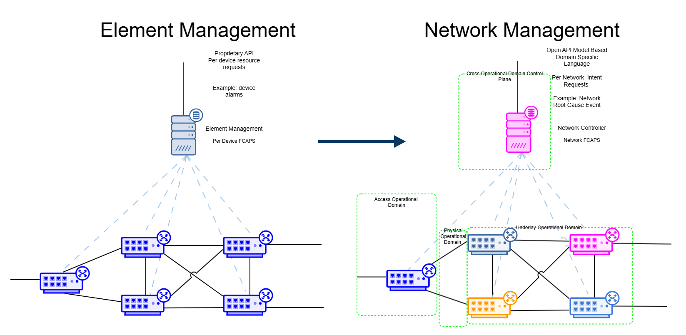
*([text description](media/element-management-vs-network-management-evolution.text-description.md))*

**Figure 2.2 Evolution  of IP Management**

The evolution of IP Management has led to the introduction of Service based Intent interfaces as proposed in the NaaS concept of autonomous Technology Domain Managers.

Current vendor implementation of IP Networking are adopting Information models based on IETF models and standards. The main elements of these models and standards are summarized below. 

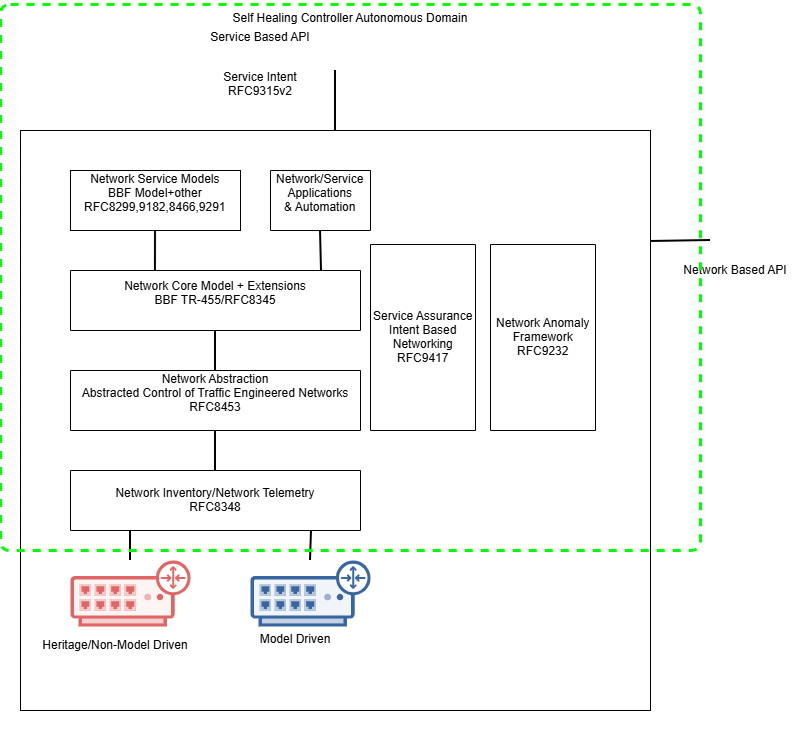
*([text description](media/ietf-network-controller-models-standards-stack.text-description.md))*

**Figure 2.3 IETF Network Controller models and standards for Technology Domain Managers **

***Note It is probable  that both service and resource/network level models need to be exposed by Controller Solutions in addition to Intent interfaces ***

This evolution mirrors the ITU evolution of Telecommunication Network Network (TMN) standards from Element Management supporting FCAPS functionality in M.3010, to the Service based models in M.3041 and M.3080.

It also mirrors ITU-T proposal in draft Y.3061 Architecture framework for Autonomous Networks with multiple cooperating controllers/orchestrators:

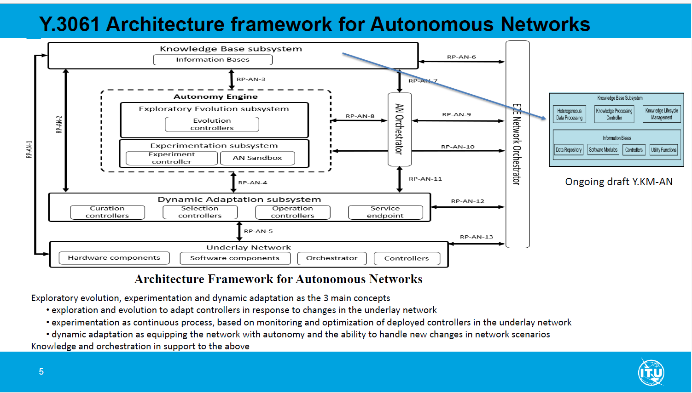
*([text description](media/itu-y3061-autonomous-network-architecture-framework.text-description.md))*

**Figure 2.4  Draft Y.3061 Architecture Framework for AN and roles of Controllers**

## IG1373 Service based model 

The implied model in IG1373B is  complex as it:

- Covers multiple OSI layers.

- Uses multiple technologies. 

- Uses multiple operational domains. 

- Spans across physical infrastructure and fiber, and  logical networks operating at OSI levels 2 though 4.

To illustrate the different aspects of this complex model, this document  has refactored the IG1373 model into an SD-WAN OSI Layered Service Model:

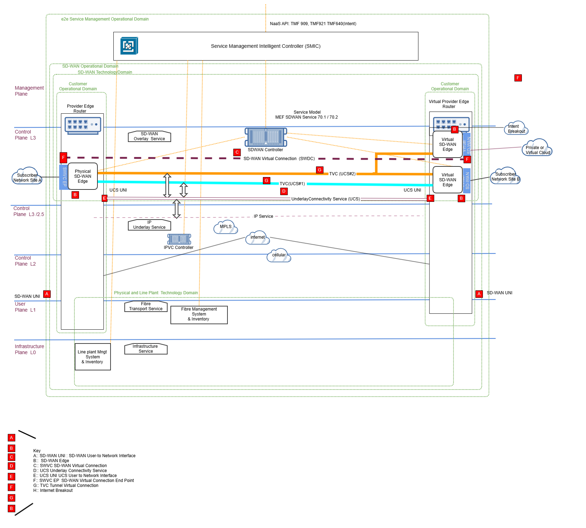
*([text description](media/sdwan-osi-layered-service-model-with-underlay-clouds.text-description.md))*

**Figure 2.4 Refactored IG1373 SD-WAN OSI  Layered Service Model:**

*Ed Note this diagram is derived from a single complex model but with each viewpoint being captured in a **drawing 'layer'** and only exposing the viewpoints needed for each section of this document.*

The ODA Production team explored placing Autonomous Domains around these entities and there were a few insights:

- This is a complex task, and the domains are hierarchical across level 3, 2.5, 2 ,1 and zero; whereas originally it was thought that the Cross Domains Management would be horizontal concatenated Connectivity Domains at the same OSI level,

- When networked domains are self managing and self healing, then a break in fiber link does not always lead to a hard fault that that must be repaired immediately to restore service.
In many cases the network health is impaired and less resilient whilst this resource issue is left unresolved.
However to maintain network availability and resilience it is necessary that the resource repair is carried out so the interaction with the supervising system might be a request to replace or repair a resource. 
For physical failures this requires personnel to be despatched to carry our repairst. Initial PoC evidence shows that such approaches can lead to 40% fewer tickets being processed.

- Whilst the services are provisioned at the service /intent level the reporting may be at the resource level. Consequently, the mapping of services to resources implies this information is exposed by  the resource inventory functions held within these self-managing domains.

This viewpoint shows: the physical equipment, the OSI layers that are supported and the proposed Autonomous Domains to support the use case.

It also proposes the service layers whose management information models for provisioning and assurance are documented in the following sections.

# Information View

This section describes the Information models that interact in this use case: 

- The SD-WAN Service  (Overlay)

- The IP Transport Service Underlay (IETF ACTN based)

- The Fiber Transport Service 

- The Infrastructure Service 

* Ed Note the service-based model used for provisioning may need extension to include a resource level model for notifications of impaired resources within self-healing domains.*

Whilst the models that follow cover the logical models for the provision of the services, the assurance processes simply need to use these models to identify and label degradation and faults in services and resources . Hence the assurance models n Section 3.3 are the principle focus for interactions among network and ODA Solutions.

## Modelling 

[TR255A Connectivity Patterns for Virtualization Management v4.0.1 ](https://www.tmforum.org/resources/technical-report/tr255a-connectivity-patterns-for-virtualization-management-v4-0/)documents a model for representing network and connections. This model separates the static part of connectivity from the dynamic part on a per layer basis - For example what is regarded as a static network  connection at level 3 might actually viewed as dynamic flow from a level 2 viewpoint.

The core concepts are shown below:

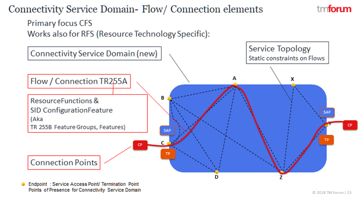
*([text description](media/tr255-connectivity-service-domain-flow-connection-elements.text-description.md))*

**Figure 3.1  Connectivity service model  TR255  GB999 ODA Production Implemtnation Guidelines**

This concept of connections/trails and flows has a long history in ITU G.905 and G.908 (connectionless) with concepts such as: link connection, trail, sub-network and Connection points. These evolved and form the basis of the ONF TR512.4 Common Information Model  which was adopted across several SDOs including: TM Forum (incorporated in GB922), MEF, 3GPP and ETSI. There is also a concept of a link to concatenate between  Connectivity Service Domain Termination Points at the same OSI level.

## SD-WAN (Overlay) Service Information Model (MEF 70.1): Provisioning

For this exemplar  the SD-WAN Service model used is the MEF 70.1 Service Model and Attributes at [MEF 3.0 SD-WAN Service Standards](https://www.mef.net/service-standards/overlay-services/sd-wan/)

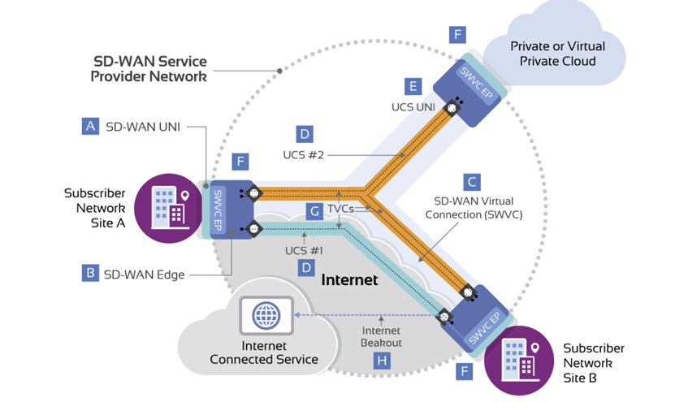
*([text description](media/sdwan-service-provider-network-lettered-overview.text-description.md))*

**Figure 3.1.1 SD-WAN Service Model (derived from MEF 70.1)**

**Key for MEF SD-WAN Service Model MEF 70.1**

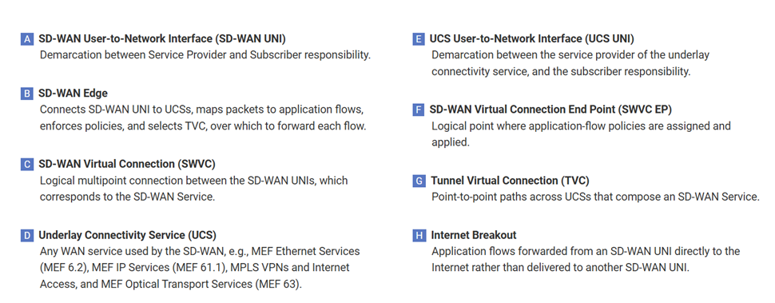
*([text description](media/mef-sdwan-service-model-key-legend.text-description.md))*

The scope of this MEF SD-WAN model and concepts above is shown in the refactored IG1373 SD-WAN Use Case Layered Model:

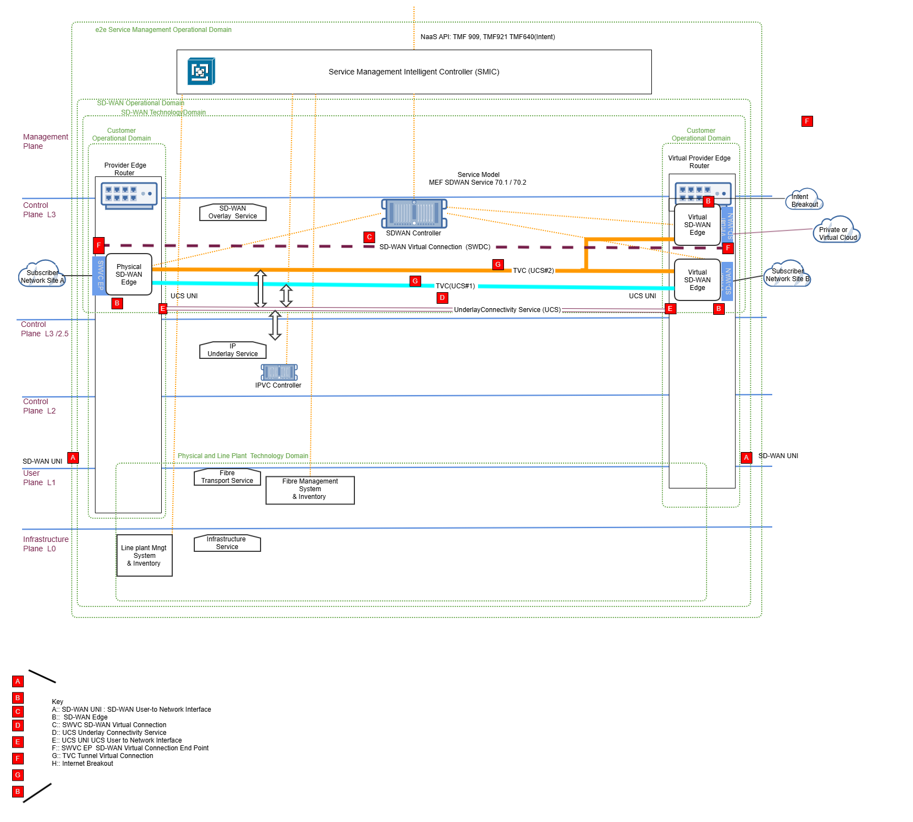
*([text description](media/sdwan-osi-layered-service-model-mef-mapping-view.text-description.md))*

**Figure 3.1.2  SD-WAN  service model mapped to refactored IG1373 SD-WAN OSI Layered Service Model**

*Ed note: This diagram is a specific view of the **Gliffy** master diagram in the appendix section 6*

### Mapping MEF SD-WAN model entities to TM Forum SID/ ONF

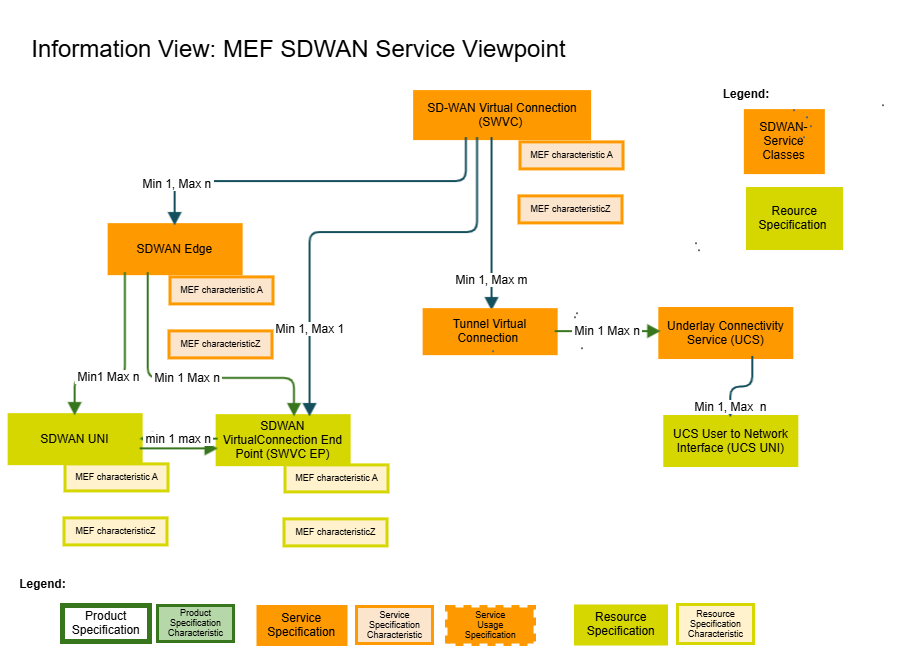
*([PlantUML source](media/mef-sdwan-service-information-model.puml))*

**Figure 3.1.3 Information model MEF SD-WAN Service**

This diagram provides a UML lclass representation of the MEF SD-WAN Service Model.

### Mapping table for SD-WAN based on TR255A 

The following table maps the SD-WAN classes to the equivalent classes in TR255A and Information Framework GB922.

The main benefit is the addition of SD-WAN service attributes/ characteristics to TR255A/ Information Framework (GB922).

This is valuable when creating JSON Schema extensions to be used with Open APIs when using the polymorphic extension pattern.

These entities and atrributes provide the structure for assurance reports defining impaired services and resources.

| Name | TR255A/SID | MEF SD-WAN Service Model MEF70.1 | Attributes |
| --- | --- | --- | --- |
| Static |   |   |   |
| Connectivity Service Domain | New entity Propose TM Forum Service domain entity: a type of Management DomainSpec | SD-WAN Service Provider Network |   |
| Connectivity Service | New | SD-WAN Service (MEF) |   |
| Connectivity Matrix | List of Connectivity Potential |   | See Connectivity Potential/ Resource Graph |
| Connectivity Potential/ Resource Graph | TR 255A pg10 | Underlay Connectivity Service (UCS) | 12 UCS Service Attributes 12.1 UCS Identifier Service Attribute  12.2 UCS Type Service Attribute  12.3 UCS Billing Method Service Attribute |
| Connectivity Potential/ Resource Graph | TR 255A pg10 | Tunnel Virtual Connections |   |
| Service Access Point(SAP) | TR255A page 8 TR255 pg76 SID | SD-WAN UNI SD-WAN Edge |   |
| Termination Point |   | UCS User to network Interface (UCS UNI) | 13 UCS UNI Service Attributes 13.1 UCS UNI Identifier Service Attribute |
| Termination Point |   | UCS End Point Service Attributes | 14 UCS End Point Service Attributes  14.1 UCS End Point Identifier Service Attribute  14.2 UCS End Point Backup Service Attribute  14.3 UCS End Point Breakout Service Attribute |
| Resource Function | GB922 Logical and Compound Resource Computing and Software |   |   |
| Dynamic |   |   |   |
| Flow/ connection | TR 255A Modeled as an RF pg 14 | SD-WAN Virtual Connection (SWVC) | SD-WAN Virtual Connection (SWVC) Service Attributes  9.1 SWVC Identifier Service Attribute  9.2 SWVC List of End Points Service Attribute  9.3 SWVC List of UCSs Service Attribute  9.4 SWVC Service Uptime Objective Service Attribute  9.5 SWVC Reserved Prefixes Service Attribute  9.6 SWVC List of Zones Service Attribute 9.7 SWVC List of Virtual Topologies Service Attribute  9.7.1 vtType=multipoint-to-multipoint 9.7.2 vtType=rooted-multipoint . 9.8 SWVC Performance Time Intervals Service Attribute  9.9 SWVC List of Security Policies Service Attribute  9.10 SWVC List of Policies Service Attribute . 9.10.1 Policy Criteria specification and interaction . 9.10.2 Ingress Policy Criteria 9.10.3 Egress Policy Criteria  9.11 SWVC List of Application Flow Specification Groups Service Attribute 9.12 SWVC List of Application Flow Specifications Service Attribute |
| Flow/ connection |   | Internet breakout |   |
| Connection Point | GB922 LR SID | SD-WAN Vritual Connection End point (SWVC EP) | MEF70.1 section 10 10 SD-WAN Virtual Connection (SWVC) End Point Service Attributes |
| Termination Point |   | SD-WAN User to Network Interface (SD-WAN UNI) | MEF 70.1 Section 11 11 SD-WAN UNI Service Attributes - |
| Service Access Point |   | Subscriber network Site A Subscriber network Site B Private or Virtual Private Cloud |   |

## SD-WAN (Overlay) Service Information Model: Assurance

*Ed Note In this release we identify the sources of assurance information models. Further work is needed to create definitive impairment type specifications. The expectation is that further studies  will result in both formal ontologies and JSON Schemas for health and network impairments *

As SD-WAN Service is self-healing then a proactive Assurance approach is needed.

The Assurance models are based on both the Service and their related Resource Models. The Service-Resource relationships are managed within the service thus allowing changes to be made by self-healing functions, and may change frequently e.g. virtualization. Hence these relationship cannot be held in traditional OSS inventories outside the service. 

- The Service model reports status changes which may be hard failures in some functions ( e.g. SD-WAN  UNI, SD-WAN EDGE ) and heath impairments e.g. Tunnel Virtual Connection arising from faulty or impaired resources forming the Underlay Connectivity Service (UCS).

- Resource models are vendor specific i.e. the resource model is not standardized (but may work to common resources specifications).  State changes or impairments in these models are reported together with the relationship to the impacted service model entities. Accurate timestamping of events  and state changes of service and resource impairments  in reports is critical for temporal correlation of changes.

IETF work for Intent based network assurance is based on a number of recommendations (RFC):

- [RFC 9417: Service Assurance for Intent-Based Networking Architecture](https://www.ietf.org/rfc/rfc9417.pdf) (SAIN)
Services rely upon multiple subservices provided by a variety of elements, including the underlying network devices and functions, getting the assurance of a healthy service is only possible with a holistic view of all involved elements.
This architecture  not only helps to correlate the service degradation with symptoms of a specific network component but, it also lists the services impacted by the failure or degradation of a specific network component

- [RFC 8345 - A YANG Data Model for Network Topologies](https://datatracker.ietf.org/doc/rfc8345/)

Abstract  data model to represent networks and topologies. The data model is divided into two parts:
The first part of the data model defines a network data model that enables the definition of network hierarchies, or network stacks (i.e., networks that are layered on top of each other) and maintenance of an inventory of nodes contained in a network.
The second part of the data model augments the basic network data model with information to describe topology information.

- SIMAP Service & Infrastructure Maps: [draft-ietf-nmop-simap-concept-03 - SIMAP: Concept, Requirements, and Use Cases](https://datatracker.ietf.org/doc/draft-ietf-nmop-simap-concept/)
Data model that provides a view of the operator's networks and services, including how it is connected to other models/data (e.g., inventory, observability sources, and operational knowledge).
It specifically provides an approach to model multi-layered topology and an appropriate mechanism to navigate amongst layers and correlate between them.
This includes layers from physical topology to service topology.
This model is applicable to multiple domains (access, core, data center, etc.) and technologies (Optical, IP, etc.).
The SIMAP modelling defines the core topological entities (network, node, link, and termination point) at each layer, their role in the network topology, core topological properties, and topological relationships both inside each layer and between the layers. 
Example of the use of this model, which is based on ONF512.4 Common Information Model, is incorporated in the TM Forum Information Framework contributed by TR255. Examples of IETF usage of these models are in: 

- Reactive Maintenance/Assurance:  [i](https://www.ietf.org/archive/id/draft-ietf-nmop-network-incident-yang-03.txt)[draft-ietf-nmop-network-incident-yang-03 - A YANG Data Model for Network Incident Management](https://datatracker.ietf.org/doc/draft-ietf-nmop-network-incident-yang/)

- Proactive Maintenance/Assurance: [draft-ietf-nmop-network-anomaly-architecture-02 - A Framework for a Network Anomaly Detection Architecture](https://datatracker.ietf.org/doc/draft-ietf-nmop-network-anomaly-architecture/)

### General Observability Model 

Whilst provisioning may be largely done at a network service level, assurance processes also need to be able to observe the resources that are realizing these services. 

Shown below is an example of the distinction between a *Service* and a *Resource*.  A CFS may declaratively describe an SD-WAN *Flow* while a *Resource Function* may describe a *Flow* as realized in the network:

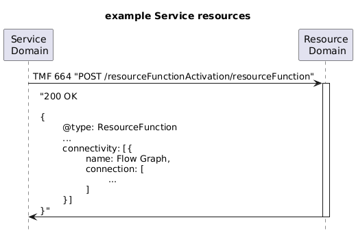
*([PlantUML source](media/tmf664-resource-function-activation-sequence.puml))*

** Fig 3.3.1  TMF664 request is declarative while the response/result may include the end-to-end topology as deployed. **

For a self-healing domain the resources and the topology underpinning a service may change arising from decisions made by controllers or heath changes when incidents/ Faults occur. At least two forms of observability are needed:

- Responses to *Resource Inventory* queries that may produce dynamic results reflecting up to date information, in some cases in the form of topology information (TMF 664 Resource Activation and configuration and TMF686 Topology API)

- State changes that may trigger a *Resource Inventory* (TMF 639) notifications when a resources is impaired/ faulty, or where service heath is impacted *Service Inventory *(TMF638) state changes update and subsequent notifications.

- Service Problem Management API(TMF656) has some features for reporting impaired services and resources.

- It is possible that these notifications need to use the TMF688 Event Management API so that events can be streamed by topic to relevant consumers. 
Use of TMF 688 would appear to fit with the thinking about democratizing of Data in the Modern Data Architecture team. 

### Reactive  assurance models

 The IETF reactive model describes a set of functions that are provided to give observability of Network Resource. For this use case the main addition will be to add to these resource reports the list of impacted services and timestamps.

Incident Identification service VPN Degradation Example

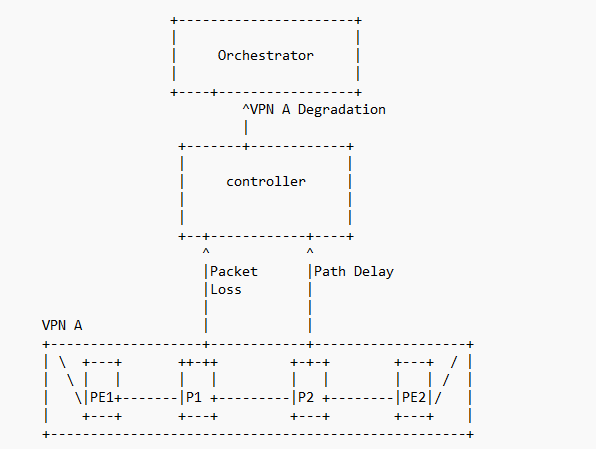
*([text description](media/vpn-degradation-network-incident-identification-ascii.text-description.md))*

**FIG 3.3.2 Example of Network incident Identification IETF NMOP Network IncidentYANG-03**

In this use case the Service Management Intelligent Controller incorporates the Orchestrator functionality and Observability API need to support Service and Resource health impairments. The example here being a VPN Degradation arising from either or both Packet Loss or Path Delay.

### Alarm Incident Management Service Interworking  Reactive 

 

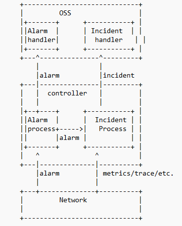
*([text description](media/alarm-incident-management-interworking-ascii.text-description.md))*

**Fig 3.3.3  Interworking with Alarm Management  IETF NMOP Network IncidentYANG-03**

The SM Intelligent Controller can perform either or both the e2e OSS functions and the operational domain controller roles above. The APIs required for the controller implied from the diagram above include:

- Observability including Metrics, traces /logs.

- Fault/Alarm and incident reporting from supporting controllers. 

These interactions are also being explored in the AN Team for use with  AI,  nd reported in [IG1343 Using AI to Enable Network Fault Detection, Resolution and Configuration v1.0.0 DRAFT](https://projects.tmforum.org/wiki/pages/viewpage.action?pageId=278564348)

### Proactive assurance models 

IETF are developing a proactive assurance model in  [draft-ietf-nmop-network-anomaly-architecture-02 - A Framework for a Network Anomaly Detection Architecture](https://datatracker.ietf.org/doc/draft-ietf-nmop-network-anomaly-architecture/).

Functionally  equivalent work has been specified by the TM Forum  AI-Closed Loop Automation team in  [AI Closed Loop Automation – Anomaly Detection and Resolution v2.1.0 (IG1219) – TM Forum](https://www.tmforum.org/resources/how-to-guide/ig1219-ai-closed-loop-automation-anomaly-detection-and-resolution-v2-1-0/)

 IETF Predictive assurance model 

The IETF [draft-ietf-nmop-network-anomaly-architecture-02 - A Framework for a Network Anomaly Detection Architecture](https://datatracker.ietf.org/doc/draft-ietf-nmop-network-anomaly-architecture/)  describes a set of co-operating function that together can predict anomalies and incidents

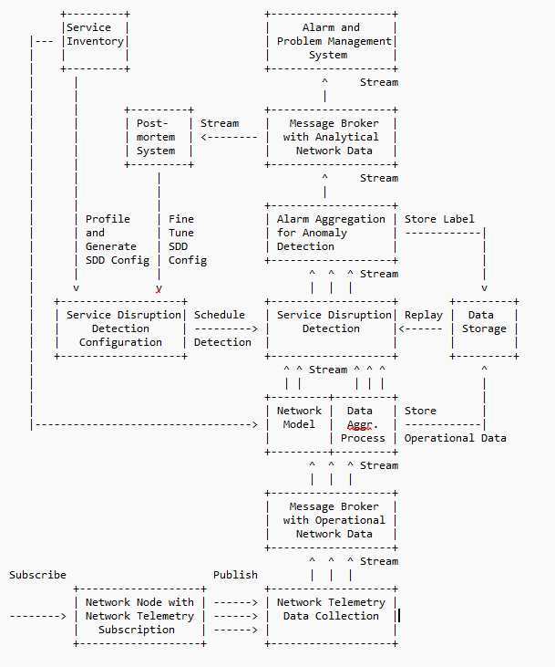
*([text description](media/network-anomaly-detection-architecture-framework-ascii.text-description.md))*

**Figure 3.3.4 IETF NMP **[Framework for a Network Anomaly Detection Architecture](https://datatracker.ietf.org/doc/draft-ietf-nmop-network-anomaly-architecture/)

A few observations:

- The results of these architecture functions are streaming messages that report network anomalies/incidents..

- This approach is different from traditional fault managers, as it is based on collecting data via telemetry sources, and then reasoning about anomalies and outliers.

- These functions form the part of a control loop covering: awareness, analysis and decision-making functions. akak OODA

- These functions are controlled and managed by a Technology Domain Controller that adds closed loop management, and orchestration functions that direct solutions/components that execute decisions.
Separating the control loop functions from their management /orchestration in a controller permits the controller to control multiple specialist anomally solutions each optimized for a specific technology. 

TMF Anomaly /Assurance predictive model

Three components were proposed for implementing part of the assurance analysis, prediction and mitigation decisions.

- [TR309 Anomaly Predictor ODA Component Requirements v1.1.0 – TM Forum](https://www.tmforum.org/resources/introductory-guide/tr309-anomaly-predictor-oda-component-requirements-v1-1-0/)

- [TR309A Anomaly Predictor Business Process Scenarios v1.0.0 – TM Forum](https://www.tmforum.org/resources/introductory-guide/tr309a-anomaly-predictor-business-process-scenarios-v1-0-0/)

- [TR310 Anomaly Mitigator ODA Component Requirements v1.1.0 – TM Forum](https://www.tmforum.org/resources/introductory-guide/tr310-anomaly-mitigator-oda-component-requirements-v1-1-0/)

Subsequentially these were decided to be features of as single Anomaly Management Component TMFC041

The architectural model for Anomaly Management is described  in TR 284A 

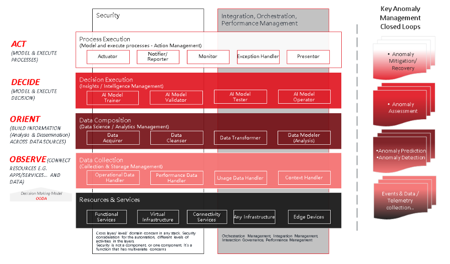
*([text description](media/anomaly-management-closed-loop-functions-tr284a.text-description.md))*

**Figure 3.3.5 Anomaly management Closed Loop functions TR284A**

This architectural framework identifies the functions that are needed for Anomaly Management Closed Loops.

The stages used are based on the Observe Orient Decide Act model which is functionally similar to the awareness, analysis, decision and execution model used in the Autonomous Network Functional Architecture. 

The architectural model for event processing is documented in TR284D.

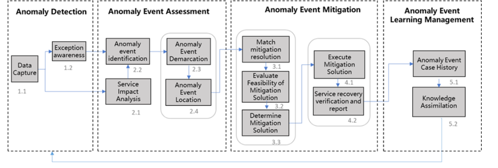
*([text description](media/anomaly-event-processing-framework-tr284.text-description.md))*

**Figure 3.3.6   Framework of Anomaly Event processing TR284**

**Anomaly Detection: **The group of tasks that monitor quality/state of network/services, such as collecting network/services information, preprocess information and identifies exception data, to support awareness for assurance etc.

**Anomaly Event Assessment: **Anomaly Event Assessment provides analysis for data collected by awareness or anomaly detection phase, it consists of four submodules, service impact analysis, Anomaly event identification, demarcation, and locating.

**Anomaly Event Mitigation: **Anomaly event mitigation process matches, evaluates, determines, and executes the anomaly event mitigation solution, and verifies and reports the service recovery status. It covers both decision and execution.

**Anomaly Event Learning Management: **Knowledge recycle is responsible for extracting and applying knowledge process extract anomaly event handling knowledge using technologies,
such as knowledge graph and apply the knowledge to iEM system. The knowledge includes anomaly event identification rules, diagnosis and location logic, resolution matching rules, and service verification policies.
This process continuously enriches and enhances the automatic close-loop ability of anomaly events of the EM system.

### Information Models for Assurance

Development of precise assurance models for the service used in this use case will be added in a later release. 

In this release we identify the sources of models that need enhancement or modification.

The  working assumption is that the model needs to cover Incident and Fault Management Types and for these to be associated with impacted services and resources references serivces asn repurces defined in the provisioning models identified in this document. 

There need to be explicit types developed for each service to support   both temporal and spatial correlation.

Current APIs tend to be incomplete, or generic, often using string types rather than being strongly typed which is needed for effective correlation . 

TM Forum Alarm Management TMF642

The Alarm Management API support the current alarm types identified are:

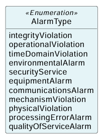
*([PlantUML source](media/tmf642-alarmtype-enumeration.puml))*
 wit:h severity

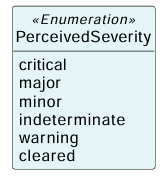
*([PlantUML source](media/tmf642-perceivedseverity-enumeration.puml))*

The current data model for Alarm is

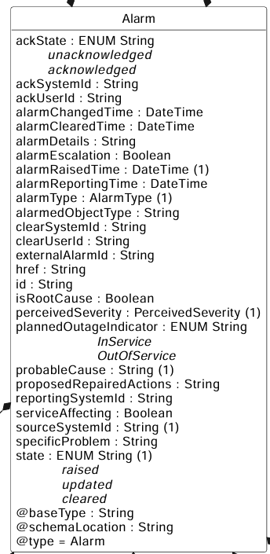
*([PlantUML source](media/tmf642-alarm-data-model.puml))*

This does have a set of attributes that could be enhanced: 

- AlarmRaisedTime But the semantics may need clarification that 'time' is of the event occuring in the network not its registration in the OSS/Controller.

- AlarmedObjectType   need to be based on provisioning models 

- ProposedRepairedAction  need to relate repar to reource models, some of which my be vendor specific.

However the data model neeed to support multiple fault type and and multiple incident types in a single report. Proof of Concept trials are showing that volumes of faults and incident is a major implementation concern.

TM Forum Incident Management TMF742

There is a data model for incidents in TMF742.

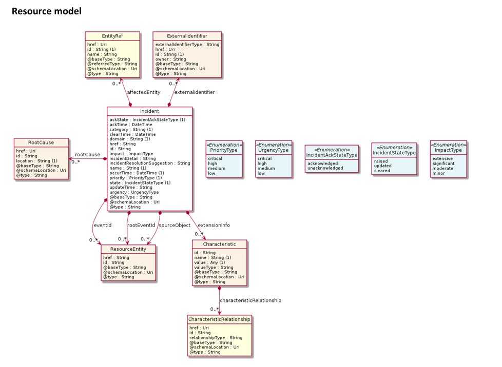
*([PlantUML source](media/tmf742-incident-resource-model.puml))*

This does have 

- Incident Detail  (string) which probably needs extension to cover health types enumerated for each service.

- Occur time: Semantic may need tightening up. 

- Resource entity may need to add Service, or use Resource Functions that can be used in both Service and Resource Models 

Data models for these APIs have some extensions based on ITU-T X.733 and 3GPP TS 32.111-2 Annex B and could be the best place for adding extension types.

Ed Note The current Service Management Intelligent Controller (SMIC) Solution  specfication may need to add this API for observability purposes. 

TM Forum Service Problem Management TMF656

The Service Problem Management API TMF656 uses a Servcie Problem Schema at 

[Open_Api_And_Data_Model/schemas/Service/ServiceProblem.schema.json at master · tmforum-apis/Open_Api_And_Data_Model · GitHub](https://github.com/tmforum-apis/Open_Api_And_Data_Model/blob/master/schemas/Service/ServiceProblem.schema.json)

this identifies a number of problem type but is current weakly typed as String types.

IETF Incident Management Models 

IETF do have some YANG models for Incident in  [draft-ietf-nmop-network-incident-yang-03 - A YANG Data Model for Network Incident Management](https://datatracker.ietf.org/doc/draft-ietf-nmop-network-incident-yang/).

extract from [draft-ietf-nmop-network-incident-yang-03 - A YANG Data Model for Network Incident Management](https://datatracker.ietf.org/doc/draft-ietf-nmop-network-incident-yang/)

...

structure incident-acknowledge-error-info:

       +-- incident-acknowledge-error-info
          +-- incident-no?   incident-ref
          +-- reason?        identityref
          +-- description?   string
     structure incident-diagnose-error-info:
       +-- incident-diagnose-error-info
          +-- incident-no?   incident-ref
          +-- reason?        identityref
          +-- description?   string
     structure incident-resolve-error-info:
       +-- incident-resolve-error-info
          +-- incident-no?   incident-ref
          +-- reason?        identityref
          +-- description?   string

...

 identity incident-domain {
       description
         "The abstract identity to indicate the domain of
          an incident.";
     }

     identity single-domain {
       base incident-domain;
       description
         "single domain.";
     }

     identity access {
       base single-domain;
       description
         "access domain.";
     }

     identity ran {
       base access;
       description
         "radio access network domain.";
     }

     identity transport {
       base single-domain;
       description
         "transport domain.";
     }

     identity otn {
       base transport;
       description
         "optical transport network domain.";
     }

     identity ip {
       base single-domain;
       description
         "ip domain.";
     }

     identity ptn {
       base ip;
       description
         "packet transport network domain.";
     }

     identity cross-domain {
       base incident-domain;
       description
         "cross domain.";
     }

     identity incident-category {
       description
         "The abstract identity for incident category.";
     }

     identity device {
       base incident-category;
       description
         "device category.";
     }

     identity power-environment {
       base device;
       description
         "power environment category.";
     }

     identity device-hardware {
       base device;
       description
         "hardware of device category.";
     }

     identity device-software {
       base device;
       description
         "software of device category";
     }

     identity line {
       base device-hardware;
       description
         "line card category.";
     }

     identity maintenance {
       base incident-category;
       description
         "maintenance category.";
     }

     identity network {
       base incident-category;
       description
         "network category.";
     }

     identity protocol {
       base incident-category;
       description
         "protocol category.";
     }

     identity overlay {
       base incident-category;
       description
         "overlay category";
     }

     identity vm {
       base incident-category;
       description
         "vm category.";
     }

     identity event-type {
       description
         "The abstract identity for Event type";
     }

     identity alarm {
       base event-type;
       description
         "alarm event type.";
     }

     identity notif {
       base event-type;
       description
         "Notification event type.";
     }

     identity log {
       base event-type;
       description
         "Log event type.";
     }

     identity KPI {
       base event-type;
       description
         "KPI event type.";
     }

     identity unknown {
       base event-type;
       description
         "Unknown event type.";
     }

 identity incident-class {
       description
         "The abstract identity for Incident category.";
     }

     identity problem {
       base incident-class;
       description
         "It indicates the class of the incident is a problem
                (i.e.,cause of the incident) for example an interface
                fails to work.";
     }

     identity sla-violation {
       base incident-class;
       description
         "It indicates the class of the incident is a sla
                violation, for example high CPU rate may cause
                a fault in the future.";
     }

typedef incident-ref {
       type leafref {
         path "/inc:incidents/inc:incident/inc:incident-no";
       }
       description
         "reference a network incident.";
     }

## IP Transport (Underlay) Service Information Model (IETF ACTN) Provisioning

There are a couple of possible IP Transport models that are based on the IETF:

[RFC 8453 - Framework for Abstraction and Control of TE Networks (ACTN)](https://datatracker.ietf.org/doc/rfc8453/) and Associated 
[RFC 8454: Information Model for Abstraction and Control of TE Networks (ACTN)](https://www.rfc-editor.org/rfc/rfc8454)

which have extension for L3VPN in  [RFC 8299: YANG Data Model for L3VPN Service Delivery](https://www.rfc-editor.org/rfc/rfc8299)

The other candidate model for IP Transport Service is from MEF in 

[MEF 69.1 - Subscriber IP Service Definitions](https://www.mef.net/wp-content/uploads/MEF-69.1.pdf)
[MEF 61.1 IP Service Attributes - MEF](https://www.mef.net/resources/mef-61-1-ip-service-attributes/)

which has a mapping to 

[RFC 8299: YANG Data Model for L3VPN Service Delivery](https://www.rfc-editor.org/rfc/rfc8299)

### MEF IP Service 

MEF has the following high-level model for (Subscriber) IP Service 

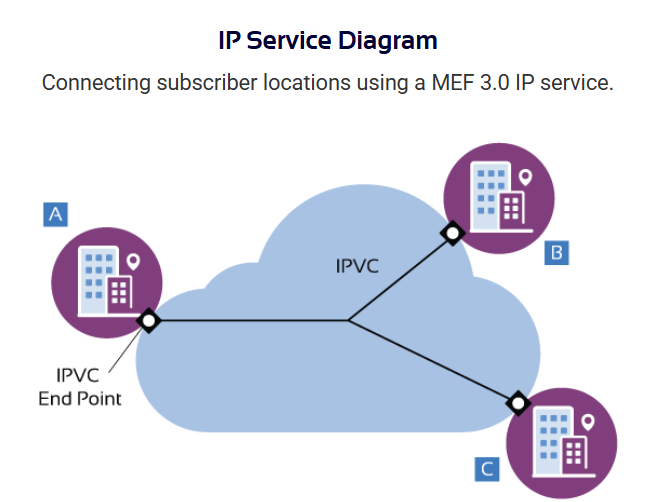
*([text description](media/mef-ip-service-diagram.text-description.md))*

**Figure 3.4.1  MEF IP Service Model  MEF 69.1 MEF 61.1**

### Mapping table for IP Service based on TR255A 

The high-level Information Model for MEF IP Services is 

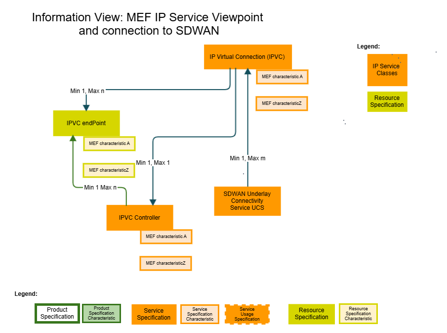
*([PlantUML source](media/mef-ip-service-information-model.puml))*

**Figure 3.4.2 Information model MEF IP Service**

This diagram provides a UML class representation of the MEF IP Service Model.

The following table maps the IP Service classes to the equivalent classes in TR255A and Information Framework GB922.

The main benefit is the addition of IP Service attributes/ characteristics to TR255A/ Information Framework (GB922).

This is valuable when creating JSON Schema extensions to be used with Open APIs when using the polymorphic extension pattern.

| Name | TR255A/SID | MEF IP Service Model MEF61.1 | Attributes |
| --- | --- | --- | --- |
| Static |   |   |   |
| Connectivity Service Domain | New entity Propose TM Forum Service domain entity: of type of Management DomainSpec | IP Service |   |
| Connectivity Service | New | IP Service (MEF) |   |
| Connectivity Matrix | List of Connectivity Potential | Internet reachability | 9 Routing and Packet Delivery in an IPVC  9.1 IP Routing in an SP or Operator Network  9.1.1 UNI Routing Information Database  9.1.2 ENNI Service Mapping Context Routing Information Database  9.1.3 IPVC EP Local Routing Information Database  9.1.4 IPVC EP Remote Routing Information Database  9.1.5 IPVC EP Routing Table |
| Connectivity Potential/ Resource Graph | TR 255A pg. 10 |   |   |
| Connectivity Potential/ Resource Graph | TR 255A pg. 10 |   |   |
| Service Access Point(SAP) | TR255A page 8 TR255 pg. 76 SID | UNI  ENNI  Location of the IPVC endpoint ENNI Service Attributes | 12 UNI Service Attributes  12.1 UNI Identifier Service Attribute  12.2 UNI Management Type Service Attribute 12.3 UNI List of UNI Access Links Service Attribute 12.4 UNI Ingress Bandwidth Profile Envelope Service Attribute  12.5 UNI Egress Bandwidth Profile Envelope Service Attribute  12.6 UNI List of Control Protocols Service Attribute  12.7 UNI Routing Protocols Service Attribute  12.7.1 Static  12.7.2 OSPF  12.7.3 BGP  12.8 UNI Reverse Path Forwarding Service Attribute 13 UNI Access Link Service Attributes 14 ENNI Service Attributes 14.1 ENNI Identifier Service Attribute  14.2 ENNI Type Service Attribute  14.3 ENNI Routing Information Service Attribute  14.3.1 ENNI Routing Protocols for Option A  14.4 ENNI Ingress Bandwidth Profile Envelopes Service Attribute  14.5 ENNI Egress Bandwidth Profile Envelopes Service Attribute 15 ENNI Common Attributes 15.1 ENNI Peering Identifier Common Attribute  15.2 ENNI Peering Type Common Attribute  15.3 ENNI List of ENNI Links Common Attribute  15.3.1 L1 Link Identifier  15.3.2 L1 Technology  15.3.3 List of ENNI Links  15.3.4 Example  15.4 ENNI List of Control Protocols Common Attribute  15.5 ENNI Routing Protocols Common Attribute . 15.5.1 ENNI Routing Protocols for Option A  15.6 ENNI Service Map Common Attribute  15.6.1 ENNI Service Map for Option A |
| Termination Point |   | IPVC Endpoint? |   |
| Termination Point |   |   |   |
| Resource Function | GB922 Logical and Compound Resource Computing and Software adopted by TR 255A pg 9, pg 21 & 28 TR255 pg75 | UNI Access Link Service ENNI Link Service | 13 UNI Access Link Service Attributes  13.1 UNI Access Link Identifier Service Attribute  13.2 UNI Access Link Connection Type Service Attribute  13.3 UNI Access Link L2 Technology Service Attribute  13.3.1 Physical Point-to-Point Ethernet Link 5 13.3.2 Multipoint Ethernet Link over WiFi  13.3.3 VLAN over an Ethernet Link Aggregation Group  13.3.4 Physical Ethernet Link using VRRP  13.3.5 Point to Point Protocol (PPP)  13.3.6 Point-to-Point Ethernet Link using an E-Access service  13.4 UNI Access Link IPv4 Connection Addressing Service Attribute 13.5 UNI Access Link IPv6 Connection Addressing Service Attribute 13.6 UNI Access Link DHCP Relay Service Attribute  13.7 UNI Access Link Prefix Delegation Service Attribute  13.8 UNI Access Link BFD Service Attribute . 13.9 UNI Access Link IP MTU Service Attribute  13.10 UNI Access Link Ingress Bandwidth Profile Envelope Service Attribute  13.11 UNI Access Link Egress Bandwidth Profile Envelope Service Attribute 13.12 UNI Access Link Reserved VRIDs Service Attribute 16 ENNI Link Attributes  16.1 ENNI Link Identifier Attribute . 16.2 ENNI Link L2 Technology Attribute  16.3 ENNI Link IPv4 Connection Addressing Attribute . 16.4 ENNI Link IPv6 Connection Addressing Attribute  16.5 ENNI Link BFD Attribute  16.6 ENNI Link IP MTU Attribute   15 ENNI Common Attributes 15.1 ENNI Peering Identifier Common Attribute  15.2 ENNI Peering Type Common Attribute  15.3 ENNI List of ENNI Links Common Attribute  15.3.1 L1 Link Identifier  15.3.2 L1 Technology  15.3.3 List of ENNI Links  15.3.4 Example  15.4 ENNI List of Control Protocols Common Attribute  15.5 ENNI Routing Protocols Common Attribute . 15.5.1 ENNI Routing Protocols for Option A  15.6 ENNI Service Map Common Attribute  15.6.1 ENNI Service Map for Option A |
| Dynamic |   |   |   |
| Flow/ connection |   | IP Virtual Connection (IPVC) Bandwidth Profile | 10. IPVC Service Attributes  10.1 IPVC Identifier Service Attribute  10.2 IPVC Topology Service Attribute  10.3 IPVC End Point List Service Attribute 10.4 IPVC Packet Delivery Service Attribute  10.5 IPVC Maximum Number of IPv4 Routes Service Attribute  10.6 IPVC Maximum Number of IPv6 Routes Service Attribute  10.7 IPVC DSCP Preservation Service Attribute  10.8 IPVC List of Class of Service Names Service Attribute . 10.9 IPVC Service Level Specification Service Attribute  10.9.1 SLS Reference Points  10.9.2 Qualified Packets  10.9.3 One-way Packet Delay  10.9.4 One-way Packet Delay Percentile Performance Metric 10.9.5 One-way Mean Packet Delay Performance Metric . 10.9.6 One-way Inter-Packet Delay Variation Performance Metric 10.9.7 One-way Packet Delay Range Performance Metric  10.9.8 One-way Packet Loss Ratio Performance Metric . 10.9.9 Service Uptime Performance Metric  10.10 IPVC MTU Service Attribute  10.11 IPVC Path MTU Discovery Service Attribute  10.12 IPVC Fragmentation Service Attribute  10.13 IPVC Cloud Service Attribute  10.13.1 Cloud Type 10.13.2 Cloud Ingress Class of Service Map . 10.13.3 Cloud Data Limit  10.13.4 Cloud Network Address Translation . 10.13.5 Cloud DNS Service  10.13.6 Cloud Subscriber Prefix List  10.14 IPVC Reserved Prefixes Service Attribute 17 Bandwidth Profiles  17.1 Structure of Bandwidth Profiles   17.2 Bandwidth Profile Flows   17.3 Bandwidth Profile Envelopes   17.4 Bandwidth Profile Behavior   17.4.1 Packet Bursts   17.4.2 Ingress Bandwidth Profiles   17.4.3 Egress Bandwidth Profiles |
| Connection Point | GB922 LR SID | IPVC Endpoint | 11 IPVC End Point Service Attributes 11.1 IPVC EP Identifier Service Attribute  11.2 IPVC EP EI Type Service Attribute  11.3 IPVC EP EI Service Attribute  11.4 IPVC EP Role Service Attribute  11.5 IPVC EP Prefix Mapping Service Attribute  11.5.1 Mapping IP Data Packets to an IPVC  11.6 IPVC EP ENNI Service Mapping Identifier Service Attribute . 11.7 IPVC EP Maximum Number of IPv4 Routes Service Attribute  11.8 IPVC EP Maximum Number of IPv6 Routes Service Attribute  11.9 IPVC EP Ingress Class of Service Map Service Attribute . 11.10 IPVC EP Egress Class of Service Map Service Attribute  11.11 IPVC EP Ingress Bandwidth Profile Envelope Service Attribute  11.12 IPVC EP Egress Bandwidth Profile Envelope Service Attribute |
| Termination Point |   | IPVC Endpoint |   |
| Service Access Point |   | UNI  ENNI  Location of the IPVC endpoint |   |

## Fiber Transport  and Infrastructure Service Information Models (TMF Information Framework)

Fiber access and transport are specified by IEEE and ITU-T. The following tabel shows the initial work of the access and transport infrastructure.

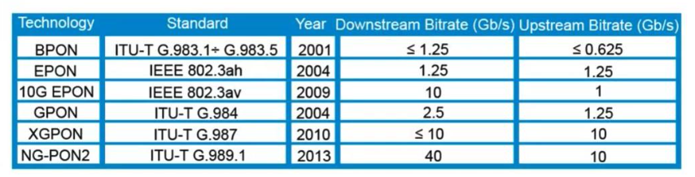
*([text description](media/pon-technology-standards-bitrate-table.text-description.md))*

**Figure 3.4.5.1  Transport model sources **

The following diagrams show exemplar Physical Infrastructure Models for Access and Core Transport network used to realize fiber based networks. 

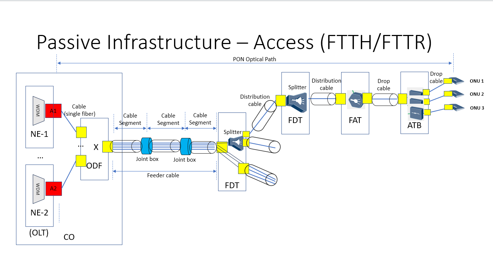
*([text description](media/passive-infrastructure-access-ftth-fttr.text-description.md))*

**Figure 3.5.2 Passive Infrastructure Access network **

*Ed Note: UML models to be **added.along** with description of entities  This will be based on an **mTOP** Contribution ( in this working document comments).*

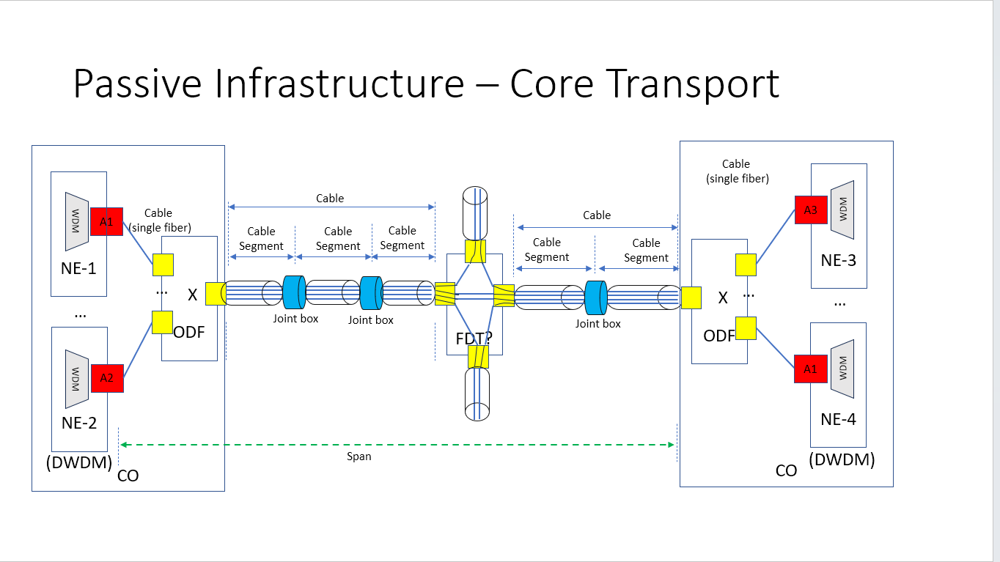
*([text description](media/passive-infrastructure-core-transport.text-description.md))*

**Figure 3.5.3 Exemplar passive Infrastructure - Core transport **

*Ed Note: UML models to be **added.along** with description of entities  This will be based on an **mTOP** Contribution ( in this working document comments). **the** terms and concept in the diagram above are described in this contribution. *

There is a possibility of using [draft-ietf-ivy-network-inventory-topology-01](https://datatracker.ietf.org/doc/html/draft-ietf-ivy-network-inventory-topology-01) as basis of a formal Information Model  in the SID. An example of the current IETF model is shown below: 

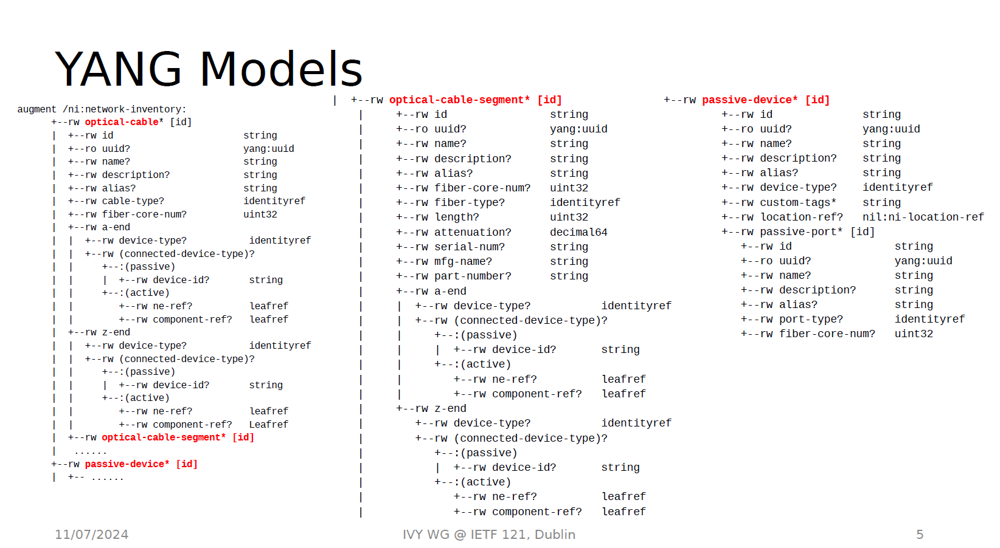
*([text description](media/ietf-ivy-network-inventory-yang-model-tree.text-description.md))*

**Figure 3.5.4 Draft IETF Network Inventory model in YANG**

It is possible to translate the IETF Yang model into equivalent Json schema for  use  in a Network Inventory such as TMFC012 Resource Inventory. 

For further Study.

# Sequence diagrams

The following simplistic scenario shows a Backhoe severing a Fibre and the consequential activities and actions.

Asynchronously several component start reporting service and resource health impairment and specific Incident/Faults in physical resource. 

The assumptions are that:

- All reports are time-stamped for temporal correlation.

- The Service Management Intelligent controller has the responsibility to:

- Evaluate and diagnose the incoming reports, and determine actions including, 

- Request relationship and topology information from service and resource inventories including those within the SD-WAN and IP Service Controllers,

- Recommend through work order actions to repair impairments and restore the network Health.

This sequence chart reflects the proposed functional capabilities and context of a E2e Service Management Intent Controller (SMIC) Solution.

Draft specification for this SMIC Controller Solution  including the implementation and deployment context is documented at :  TMFCxdcontrol: Service  Management Intelligent Controller  

Development of this solution as ODA component proposal is on hold whilst ODA works our template requirements for composition components such as Controllers Gateways and other non- 'systems of record' components.

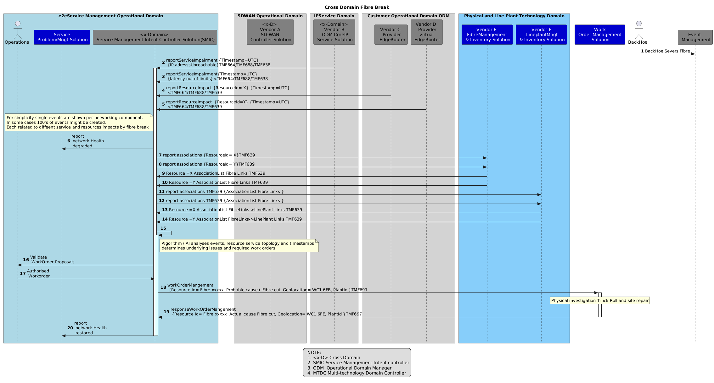
*([PlantUML source](media/fibre-break-cross-domain-health-restoration-sequence.puml))*

**Fig 4.1 Exemplar network heath restoration sequence arising from fiber break **

Note in this networking example, the networking components are vendor supplied and need to interoperate with ODA Components. In some cases using interfaces defined by other organizations e.g. MEF models enhancing TM Forum Open APIs,  and IETF protocols and Yang based models.

In this example a fiber break may be reported by an external party but in practice it will be preceded by numerous reports about network impairments  (Service and Resource level) that are  generated by multiple parts of the network and in this exemplar received by the  Service Management intelligent Controller (SMIC).

It then analyses these reports, gathers supporting information, including that from Fiber and Line Plant Invenentories  and makes recommendations on actions to restore netwotk Health.

These diagnostic and decision process are not simple but this ODA Production framework establishes the environment in which such an intelligent controller can operate, and facitiate the development of improved AI algorithms to reduce the burden on Operations staff managing Assurance and Network Heath.

This Ai enabled assurance addresses tthe two operational challenge identified in the objectives:  awareness of the network health and guidance on what network repairs are needed to restore network Health

There are two areas where alternative interaction sequences might be possible:

- In this example, Reporting network Health  is assumed to a Service Problem Management  Component but could have been to a SLA Management Component if it was specified.

- requests for Work orders need to be validated by Operations staff. However, this might be submitted through a separate system such as a trouble  ticket Component  rather than the SMIC proposed here.
This approach has the benefit that it  allow for automated invocation of repairs once confidence in AI decison making has been established by Operations people.

# Conclusions

## Lessons learned

Cross Domain Health & Probable Cause Analysis Fibre Fault/Break is a complex topic as it involves multiple interacting networking technologies, multiple OSI levels, and the need to link Information and inventory for both Physical Networks and for logical network function 

Assurance processes are a high value use case if they support operations people address two questions:

- How do Operations staff determine that there is an outage/ impairment to the Network Health?
*I.e. what kind of observability and metrics need to be available to Operations staff*

- How do they determine who,  what, where & when to repair the fault?
*I.e. what are the operational procedures and mechanisms for using this information?*

 These being more challenging when networks are self-managing and healing using proactive and predicative mechanisms.

What is needed are:

- Management solutions that integrate with network equipment supplier current Controller based solutions. The component boundaries of management functions for deployment have to match network controller which means component boundaries are not based on purely functional or information model boundaries. 

- A common observability model across multiple Network technologies and multiple OSI levels.

- Interfaces that allow for flexible exchange of information between controllers operating at multiple OSI levels,

- Interfaces that provide time-stamped  events for state changes in network and service impairments.

- The draft  specification for the Service Management Intelligent Controller solution [here](https://projects.tmforum.org/wiki/pages/viewpage.action?pageId=325655858) needs an uplift to support observability requirements including addition of dependent APIs 

- [Service Inventory Management API TMF638-v5.0](https://www.tmforum.org/oda/open-apis/directory/service-inventory-management-api-TMF638/v5.0)

- [Resource Inventory Management API TMF639-v4.0](https://www.tmforum.org/oda/open-apis/directory/resource-inventory-management-api-TMF639/v4.0)

- [Incident Management API TMF724-v4.0](https://www.tmforum.org/oda/open-apis/directory/incident-management-api-TMF724/v4.0)

- [Alarm Management API TMF642-v5.0](https://www.tmforum.org/oda/open-apis/directory/alarm-management-api-TMF642/v5.0)  ( fault) 

## Impacts identified

There is a need to extend both Information Framework and API data models to support concrete network technologies such as those considered in this use case e.g., SD-WAN, IP Transport, Fibre and Physical Infrastructure.

These models are fundamental to correlating events temporally and spatially across multiple technologies and OSI levels.

Given the complexity of networks and the skills required, the lead for the development and validation of these models needs to come from members within depth networking knowledge, as this is not commonly present within the skill sets of API developers or information modelers.

Additional analysis, enhanced coordination and alignment i is needed with the  proposals in  [IG1343 Using AI to Enable Network Fault Detection, Resolution and Configuration v1.0.0 DRAFT ](https://projects.tmforum.org/wiki/pages/viewpage.action?pageId=278564348)

# Appendix

## Use Case Autonomous Domain Layering

*The box infrastructure is described in IG1G1373 *

### Canonical model  from which previous models are derived

updated

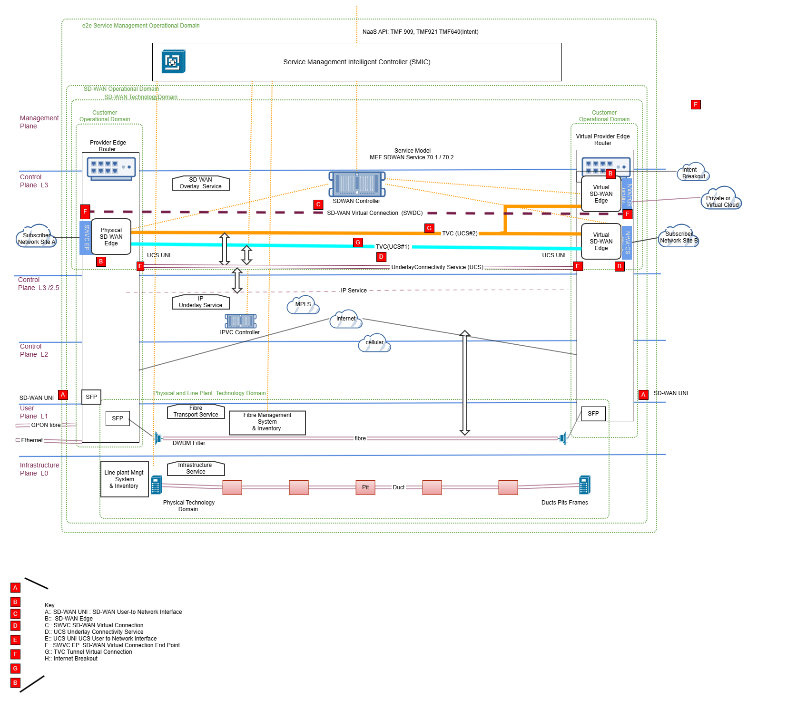
*([text description](media/sdwan-osi-layered-service-model-canonical-full.text-description.md))*

**Figure A 6.1  Refactored layers model derived form IG1373 SD-WAN Use Case **

*This diagram is used to derive all the other diagrams in this report by hiding layers that are not relevant to the **dicussion**.*

##  Terminology

The IETF has recently produced a recommended set of term for Network Management in:

[ietf.org/archive/id/draft-ietf-nmop-terminology-16.txt](https://www.ietf.org/archive/id/draft-ietf-nmop-terminology-16.txt)

for the purposes of this use case we use  these terms:

| IETF Term | IETF Definition | Interpretation |
| --- | --- | --- |
| Problem | A State regarded as undesirable and that may require remedial action. A Problem cannot necessarily be associated with a Cause. The resolution of a Problem does not necessarily act on the thing that has the Problem. * Note that there is a historic aspect to the concept of a Problem. The current State may be operational, but there could have been a Fault that is unexplained, and the fact of that unexplained recent Fault is a Problem. * Note that while a Problem is unresolved it may continue to require attention. A record of resolved Problems may be maintained in a log. * Note that there may be a State which is considered to be a Problem from several perspectives. For example, consider a "loss of light" State that may cause multiple services to fail. In this example, a new State (the light recovers) may cause the Problem to be resolved from one perspective (the services are operational once more) but may leave the Problem as unresolved (because the loss of light has not been explained). Further, in this example, there could be another development (the reason for the temporary loss of light is traced to a microbend in the fiber that is repaired) resulting in that unresolved Problem now being resolved. But, in this example, this still leaves a further Problem unresolved (a microbend occurred, and that Problem is not resolved until it is understood how it occurred and a remedy is put in place to prevent recurrence). |   |
| (Resource) State: | A particular Condition that a Resource has (i.e., it is in a State) at a specific time. For example, a router may report the total amount of memory it has, and how much is free. These are the Values of two Characteristics of a Resource. These Values can be interpreted to determine the Condition of the Resource, and that may determine the State of the router, such as shortage of memory. * While a State may be observed at a specific moment in time, it is actually determined by summarizing measurement over time in a process sometimes called State compression. * It may be helpful to qualify this as "Resource State" to make clear the distinction between this and other uses of "state" such as "protocol state". This term may be contrasted with "Operational State" as used in [RFC8342]. For example, the state of a link might be up/down/ degraded, but the operational state of link would include a collection of Values of Characteristics of the link. | For assurance and observability, it is necessary to send Resource State changes with timestamps using telemetry / intent reporting |
| Incident: | A (Network) Incident is an undesired Occurrence such as an unexpected interruption of a network service, degradation of the quality of a network service, or the below-target performance of a network service. An Incident results from one or more Problems, and a Problem may give rise to or contribute to one or more Incidents. Greater discussion of Network Incident relationships, including Customer Incidents and Incident management, can be found in [I-D.ietf-nmop-network-incident-yang]. | Use this term to describe a network Impairment i.e., reduction in Heath affecting integrity resilience of the network such as a Line Card fault or physical connection failure. This abstracts and encapsulates other concepts which may be used internal to a self-healing domain  see IETF Terminology  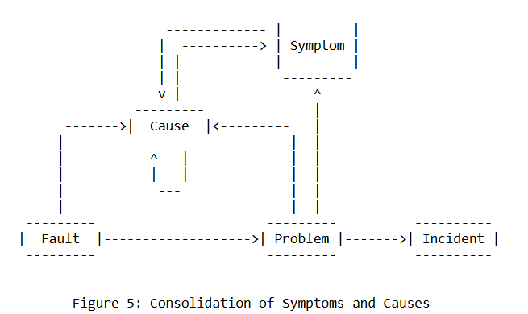 ([text description](media/fault-problem-incident-cause-symptom-consolidation-ascii.text-description.md)) This scenario assumes incidents are timestamped |

