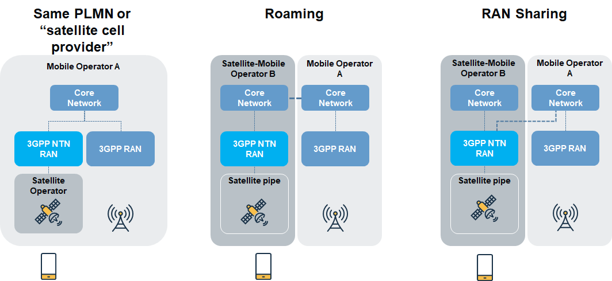
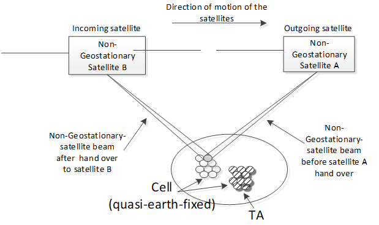
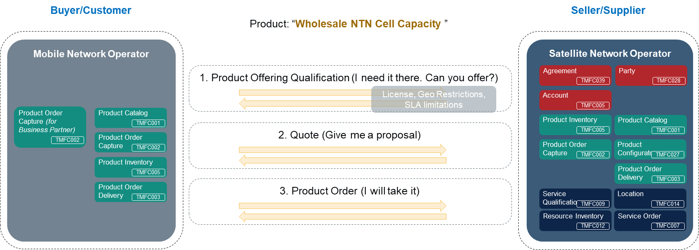
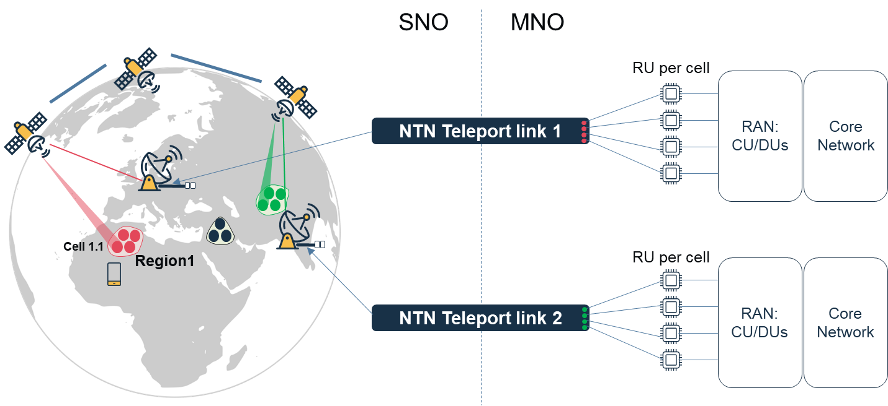
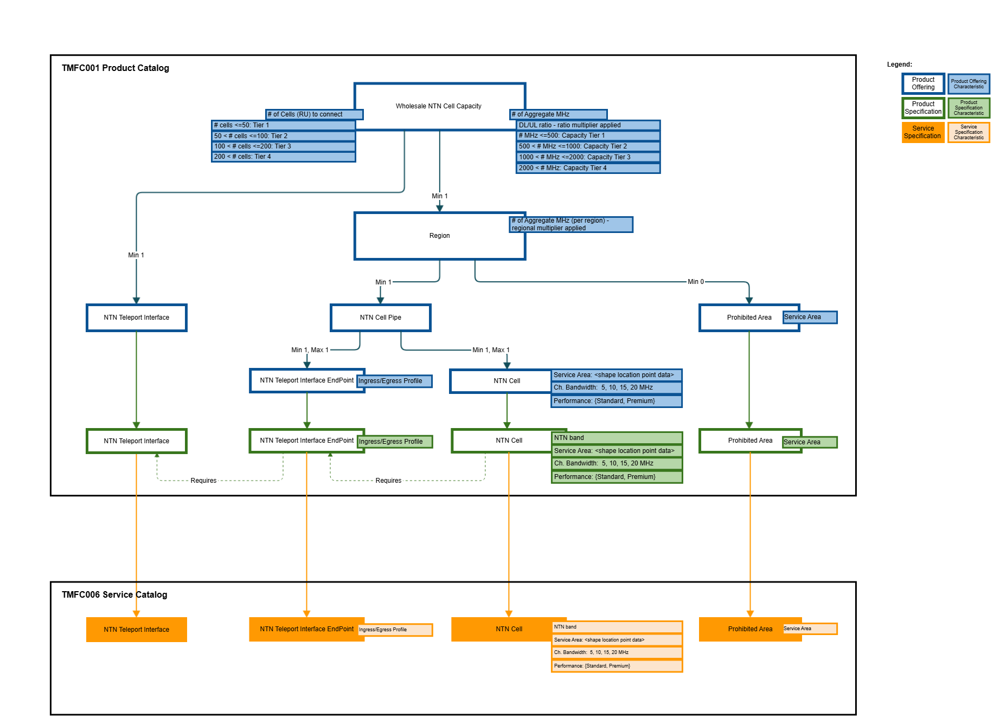
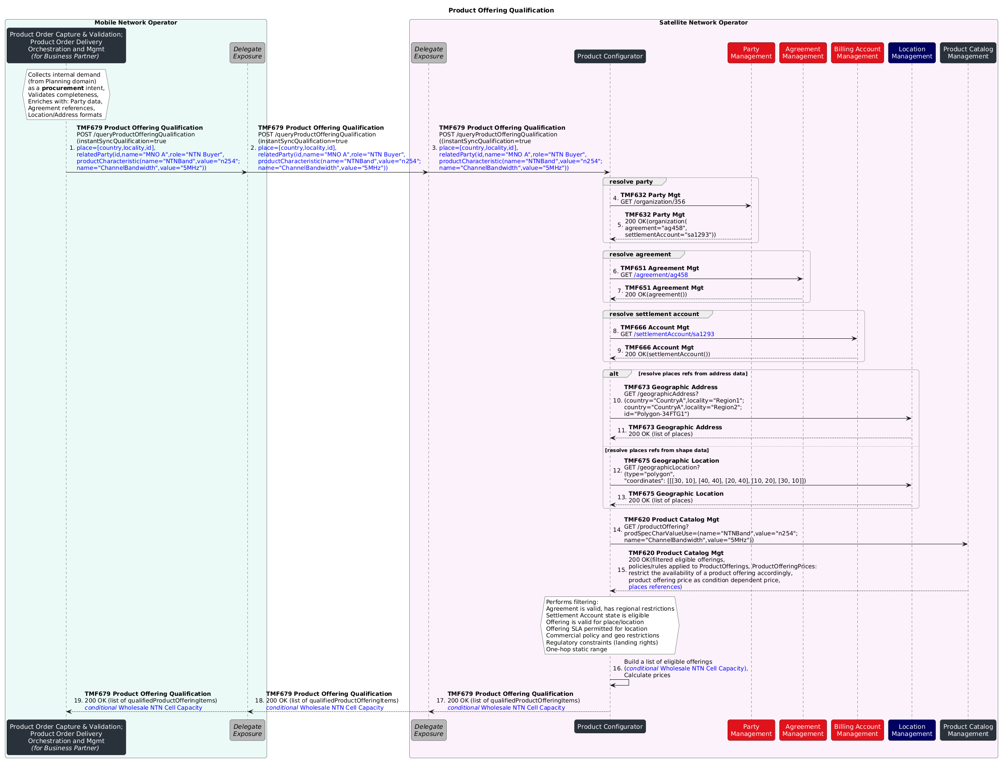
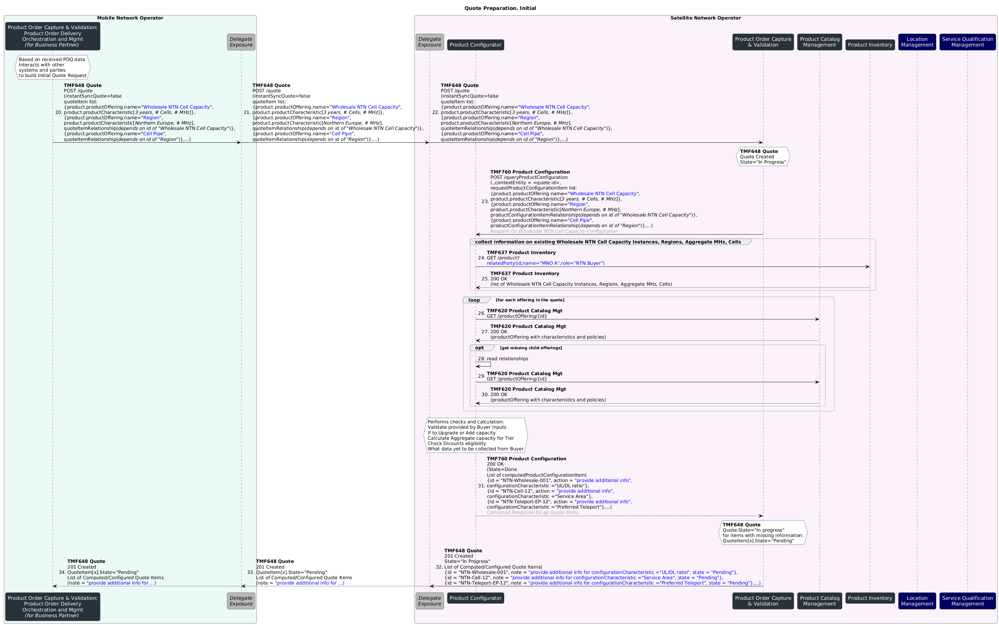
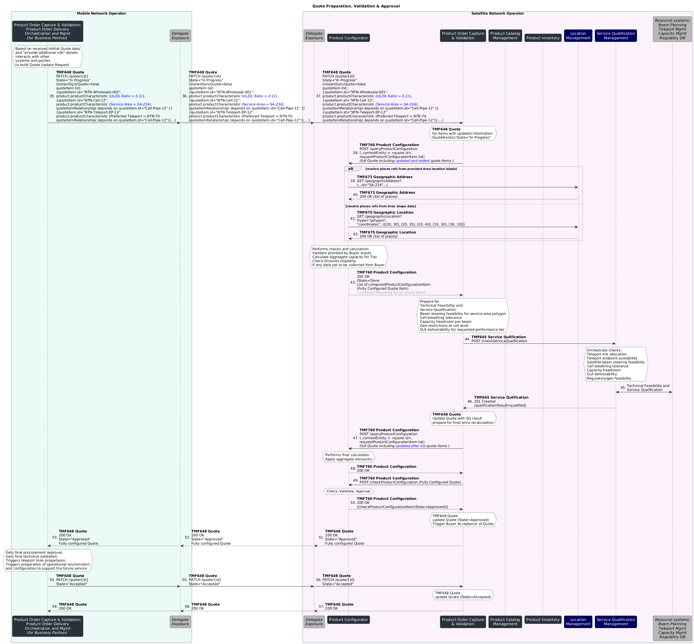
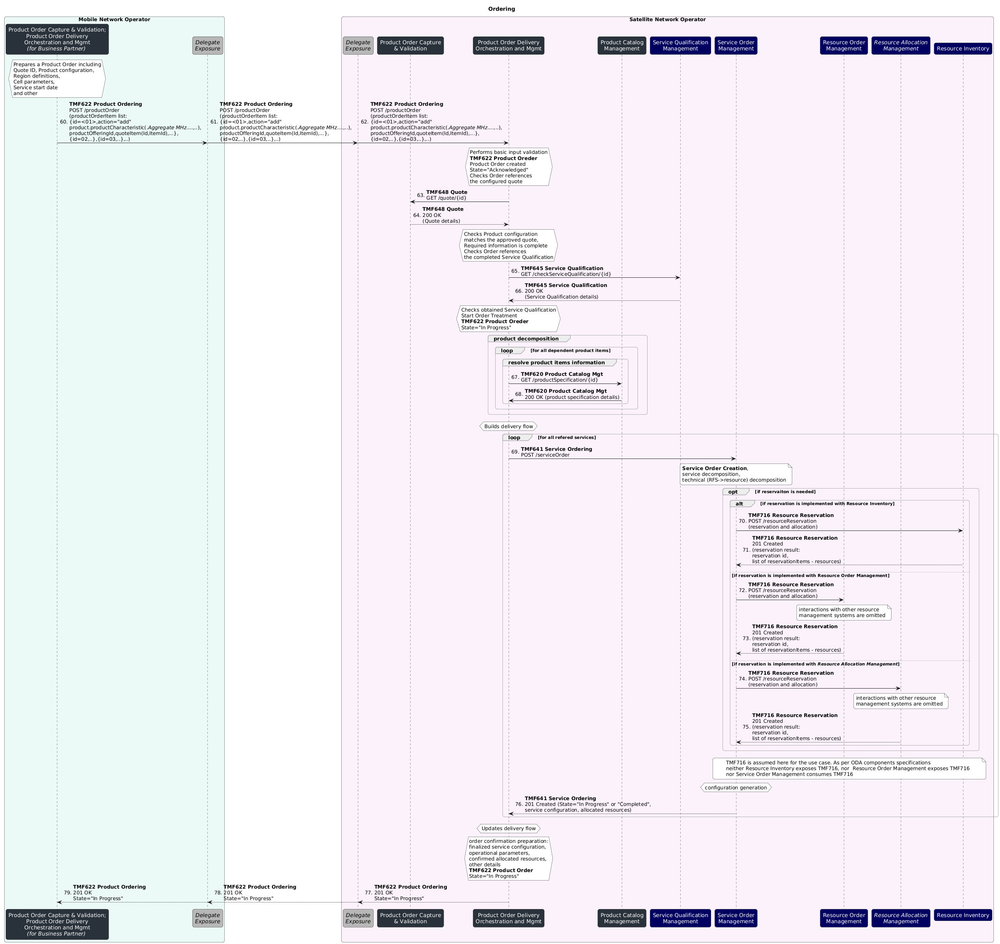
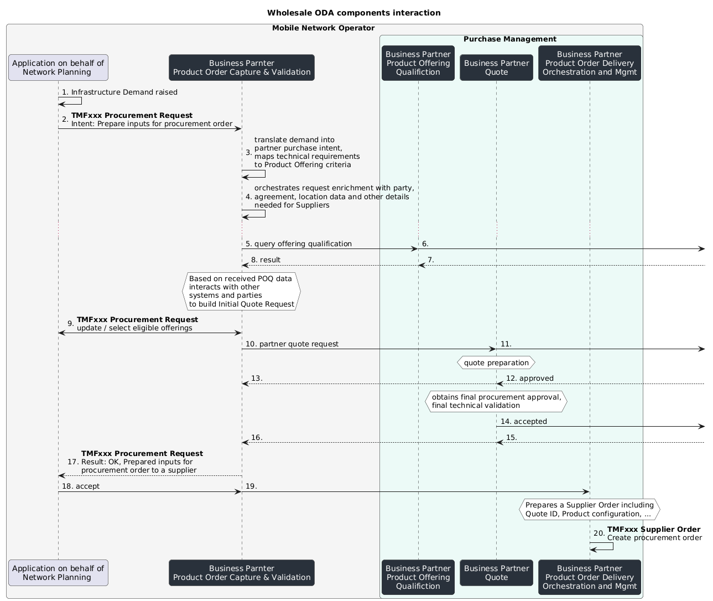

# Executive Summary

Collaboration between Satellite Network Operators (SNOs) and Mobile Network Operators (MNOs) is rapidly emerging as a key area of innovation in the telecommunications industry.  The maturity of terrestrial mobile networks, combined with the ability to extend coverage via satellite, makes this partnership strategically important and mutually beneficial.  Realizing this opportunity requires aligned business interpretations and streamlined partner interactions across critical processes, particularly in pre-ordering and ordering. This use case illustrates how TM Forum assets can support such alignment through a scenario focused on provisioning NTN bent-pipe cells.  In this scenario, the SNO capitalizes on the growth of Non-Terrestrial Networks (NTN) by offering satellite capacity to MNOs in the form of bent-pipe cells. The MNO, in turn, leverages this capability to extend coverage to underserved or unserved areas, enabling connectivity for standard handheld devices without the need for specialized hardware.  This use case highlights how an SNO can apply ODA functional architecture and TM Forum Open APIs to enable efficient, scalable pre-order and order management for satellite wholesale access.

# Introduction

With the development of Low-Earth Orbit (LEO) satellite communications, the standardization of 3GPP Non-Terrestrial Networks (NTN), and the advancement of handheld devices to support mobile satellite spectrum, there is growing enthusiasm around Satellite Direct-to-Device (D2D) communications.

Mobile Network Operators (MNOs) and Satellite Operators (SNO) are exploring and implementing various solutions to integrate their systems, aiming to maximize the benefits of this emerging opportunity and maintain a competitive edge in the industry. As technical standards in that area mature, number of partnership opportunities increase, and satellite operators work to acquire Mobile Satellite Spectrum (MSS) bands in countries of operation, there is a strong case for adopting standards-aligned implementations at the telecom management layer.

## Context or Background

Direct-to-Device (D2D) refers to a capability of connecting handsets or IoT devices directly via satellite. In D2D satellite is located between a mobile device and mobile operator network (in 3GPP NTN architecture gNB is point of interconnect to a satellite ground station). 

Early Satellite D2D implementations relied on proprietary non-3GPP radio access technologies and were limited to basic emergency alerts and messaging services. LEO based solutions using 3GPP standardized mobile satellite spectrum bands are much more promising as they potentially can provide voice and data services.

3GPP NTN as such covers multitude of possible use cases including Direct-to-Device, IoT/NBIoT, Mobile Backhaul. 3GPP NTN addresses bands in spectrum ranges for mobile devices (FR1 n254, n255, n256 mapping to MSS S and L bands - 1-2,2-4 GHz) and for fixed devices (fixed VSAT - Very Small Aperture Terminal, FR2 n257-262, n510-512, mapping to Fixed Satellite Spectrum, FSS, bands - Ka-band - 26 GHz+). 

In most of the cases MNOs would partner with Satellite Operators who would offer wholesale access or roaming agreements. In such a case MNOs would deal with the customer relationship, while satellite operators receive a fee for connectivity. Examples include AST Space Mobile for USA & more than 45 MNOs, Deutsche Telekom & Skylo, Telefonica Germany & Skylo, Salt & Starlink, e&(Etisalat) & Yahsat, Telstra & Starlink and others. However, as Analysis Mason points out that there should be "right incentives to stimulate participation of actors across the value chain".

Currently different service deployment and integration models can be used by each satellite and mobile network operator. Following are three of them.

Figure 1.SNO to MNO Integration models

- Same PLMN model or "satellite cell provider" presumes Satellite Operator participates in a bent-pipe architecture (or transparent payload as defined in 3GPP 38.811. In that case terminal and ground station drive the structure of the signal,  while the satellites work transparently as repeaters).  5G NTN integration evolution presumes non-transparent or regenerative mode in which a base station is integrated into the satellite (not depicted). In such a model Satellite Operators would be able to provide its resources as coverage spots on the Earth surface with certain capacity and quality characteristics.

Figure 2. Quasi Earth Fixed NTN Cell

- Roaming model. It is the most straightforward model. From MNO standpoint, Roaming model is the easiest in terms of technical challenges since it relies on classic roaming agreement. Here technical challenges of specific RAN adaptations to NTN requirements are put on Satellite Operator (or its another one partner). 

- RAN sharing. It is similar to the Roaming model in terms of technical challenges to be solved by Satellite Operator. In this scenario Satellite Operator is a Hosting RAN Provider while MNO is a Participating Operator.

3GPP 22.261 presumes that "the 5G system shall support service continuity between 5G terrestrial access network and 5G satellite access networks owned by the same operator or owned by different operators having an agreement" and that "the 5G system shall be able to support mobility between the supported access networks (e.g. NG-RAN, WLAN, fixed broadband access network, 5G satellite access network)". In case of roaming agreement that is more challenging to achieve compared to RAN Sharing or Same PLMN model. 

In terms of business and operational use cases to be in focus of TMF IG1228, one may consider two groups of them:

- Partnership cases. MNO and Satellite operator in context of D2D. Satellite infrastructure is being consumed by MNO. MNO is doing end-customer relations.

- Satellite cell. Satellite Operator is a bent-pipe offering “quasi-earth-fixed cells”

- Roaming. Satellite Operator builds own 3GPP NTN RAN and Core and let to roam other MNO’s subs

- RAN Sharing. Satellite Operator builds only 3GPP NTN RAN to share with other MNOs

- Residential cases. MNO and End-customer in context of D2D (or IoT, FWA)

- D2D - Handheld devices. Satellite access fulfils the demand for communication where terrestrial communication is not available

- IoT or NBIoT – VSAT (GEO case) or portable (LEO, MEO case) terminal connected to 3GPP core

- FWA - In a hardly accessible site install an NTN VSAT GW to share MNO communication services over the satellite

## Objective of the use case

The objective of the use case is to demonstrate on the selected interaction scenario between MNO and Satellite operator (SNO) how a SNO can leverage ODA functional architecture and TMF Open APIs to organize pre-order and order processes of a satellite wholesale access. For that "satellite cell provider" (transparent payload) scenario is selected. The benefits of the scenario at least include

- no demand to support 3GPP gNB functions on board of satellites that is required for regenerative payload case

- no demand to support 3GPP gNB functions on ground that is required for RAN sharing case

- no demand to support 3GPP Core Network on ground that is required for Roaming case

- no demand for additional processing capacity of NTN payload on board of satellites

- no responsibility for subscriber management and lawful interception as the the signal is processed on the ground 

- single operator control of 3GPP RAN link, resource and policy control layers to simplify terrestrial-to-satellite cell re-selection and handover 

At the same time there are as well some challenges and drawbacks in this scenario. These include at least

- technically more complicated interconnection implementation between SNO and MNO

- MNO is required to have RAN subsystem specially adopted to support NTN technology

- Non-typical, adopted to NTN gateway interconnection, Radio Units (RUs) are required to enable such interconnection

- Compared to regenerative payload case, less frequency-utilization efficient and more prone to transmission errors

- 3GPP does not address Inter-Satellite Links for this scenario (as opposed to regenerative mode were 3GPP standard inter-gNB Xn link could be utilized)

From the MNO perspective the user story can be described as follows:

| Business context | Increase loyalty and retention of subscribers by enabling their standard handheld devices to connect directly to satellites without specialized hardware in the open areas with no or very limited terrestrial mobile network coverage. Rely on partnership between MNOs and SNOs. |
| --- | --- |
| AS A | Partner Manager of Mobile Network Operator playing a role of wholesale buyer |
| I NEED TO | have a capability offered by SNO partner to order wholesale satellite capacity using TMF APIs |
| SO THAT I | can order capacity for usage with NTN RAN I have (or planning to install) can leverage my management systems using existing TMF APIs can follow my existing business processes in controllable and traceable way |

From the SNO perspective the user story can be described as follows:

| Business context | Leverage the market opportunity of NTN to increase revenue through partnership with MNOs by offering them satellite capacity. |
| --- | --- |
| AS A | Partner Manager of Satellite Network Operator playing a role of wholesale seller |
| I NEED TO | have a capability exposed to MNO partner, that would enable ordering of wholesale satellite capacity using TMF APIs |
| SO THAT I | can increase wholesale capacity sales can leverage my existing satellite constellation without the need to have a costly upgrade can lower the barrier for MNOs who used to use TMF APIs in management systems |

## Scope and assumptions

### Scope

The present document will include:

- Illustrative functional and topology architecture explaining the essence of Wholesale NTN Cell Capacity

- Example Product Catalog structure as well as related Service Catalog entities for Wholesale NTN Cell Capacity offering

- Example Product Order structure for Wholesale NTN Cell Capacity offering

- Sequence diagrams depicting ODA components level pre-order and order processes of Wholesale NTN Cell Capacity offering

SNO plays a role of Wholesale NTN Cell Capacity Seller (or a Supplier of MNO). MNO plays a role of Wholesale NTN Cell Capacity Buyer (or a Customer of SNO)

### Assumptions

General assumptions:

- NTN Control Function connection to RAN Element Management System (and/or CU, depending on technical architecture) is established and configured

- it is required for handheld user device/equipment (UE) to receive Satellite Assistance Information in broadcast System Information Block (SIB) #19 from RAN. Satellite Assistance Information includes various data for UE to communicate successfully over satellite, support cell reselection, handovers in idle and connected modes - ephemeris data (the precise orbital parameters of the satellite serving the cell, satellite position and velocity information), common timing advance parameters (to manage uplink timing and frequency synchronization), validity duration for uplink synchronization epoch time, cell reference location, cell stop time and other

- sunny day scenario is considered (i.e. no fall-out scenario, no eligibility check error scenario)

- agreement exists

- product offerings are configured

- prices, discounts, pricing rules and conditions for the product offerings are configured

- products and related technical dependencies are configured

- MNO is aware of SNO's product catalog, available product offerings and specifications and can build a configured product order

Pre-conditions:

- product offerings are configured

- prices, discounts, pricing rules and conditions for the product offerings are configured

- products and related technical dependencies are configured

# Description

SNO as a Seller offers Wholesale NTN Cell Capacity that is made available though a number of satellite ground station teleport reference points or links between MNO (as a Buyer) and SNO. MNO and SNO come through pre-order and order processes. High level view looks as follows

Figure 3. Pre-order and Order Processes for Wholesale NTN Cell Capacity

**Step 1**

MNO provides intent inputs to get quick clarity on *available offerings* over target region(s). SNO filters matching offerings taking into account things like

- agreement: status, specific regional restrictions

- settlement account: status (e.g. suspended?), outstanding payables, settlement history,

- existing administrative geo restrictions (e.g. commercial policy restrictions),

- regulatory license restrictions for operation over certain regions, cross-border compliance and traffic* *landing rights,

- remaining market capacity due to existing long-term agreements with other customers,

- administrative SLA-based (minimal pre-requisite) regional restrictions to certain offerings,

- proximity of the ground station within a one-hop distance to complete the bent-pipe circuit

**Step 2**

MNO requests a quote creation from SNO providing detailed specification per quote item. It can include

- Planned aggregate capacity

- NTN cells service area shapes, coordinates

- Channel bandwidth, Downlink/Uplink ratio, Expected performance level 

SNO builds product configuration, calculates quote items following rules and policies configured in the product catalog. It includes collection of additional information from MNO to configure the quote. SNO performs required serviceability checks. These checks can include such tasks as: 

- check if NTN teleport link can be allocated

- check if required NTN teleport link end-point can be allocated

- check if satellite beams can be pinned to match service area shape (steering feasibility, cell breathing tolerance)

- check if there is a capacity headroom, cell-level geo-restrictions are absent, licenses are available, SLAs can be delivered. 

On completion, SNO approves the quote internally and sends it to MNO for acceptance including additional information such as:

- explanations for quote items composition 

- important notes (for instance, per cell "given configuration covers  X% of specified service area polygon at Y performance with Z MHz of channel bandwidth")

- applied volume discounts.

MNO accepts the quote.

**Step 3**

MNO submits a Product Order based on the accepted quote from the prior step. The order details agreed business and technical parameters, including:

- Number of NTN cells

- Aggregate spectrum capacity

- Regional allocation

- Service area shapes, channel bandwidth, performance class per NTN cell

SNO validates the order input, then decomposes it into atomic components per the product structure, such as regions, cell pipes, NTN cells, and teleport interface endpoints.

SNO then reserves and allocates the required resources. These resources include satellite beam capacity, spectrum allocation, NTN teleport connectivity, and interface endpoints. To ensure the ordered NTN cells can deliver the agreed service parameters such as coverage area, channel bandwidth, and performance class, the resource allocation is made accordingly.

As reservation and allocation presumes detailed preparation, SNO, during this phase, also prepares necessary operational configuration updates required to connect the satellite segment to the MNO’s radio network through the NTN teleport interface, covering:

- Teleport endpoint assignments.

- Satellite beam steering parameters.

- Cell-level capacity allocations.

- Network parameters for MNO radio unit integration.

- Possible updates to SNO's NTN Control Function connection with MNO's RAN Element Management System.

Once resources are reserved and configurations prepared, SNO confirms the order, transitions to service fulfillment (with NTN cell deployment ready for provisioning/activation), and sends MNO an order confirmation with finalized service configuration and operational parameters

## Functional Architecture Diagram

For the sake of easier readability functional and topology architecture explaining the essence of Wholesale NTN Cell Capacity is given below

Figure . Wholesale NTN Cell: Functional and topology architecture

As per scenario SNO does not support 3GPP gNB functions neither on board of satellite, nor on NTN ground station gateway, MNO fully forms the structure of the signal for radio emission and deploys RUs adopted to NTN gateway interconnection. RUs output digitized signals but does not perform RF amplification. Instead, the equipment at the SNO ground station completes those steps. Therefore, the physical link between the RU and the ground station is a terrestrial high-capacity data link that carries the digitized or RF signal destined for satellite uplink via the ground station equipment.

Besides, for handheld user device/equipment (UE) to receive proper Satellite Assistance Information the control plane connectivity will have to be established between SNO's NTN Control Function and MNO's RAN Element Management System (or other control functions in MNO's domain)

## Offering description

*Wholesale* *NTN Cell Capacity* is a bundle offering that is a subject of volume discount depending on a total amount of capacity and a number of NTN Cells to Connect.

Each *Region* offering is composed of a number of *Cell Pipe* and *Prohibited Area* offering. Due to various circumstances like cost, market potential, regional regulation policies and fees prices in each region may differ. That difference is reflected through a *regional multiplier* applied to number of *Aggregated  MHz* set per each region. Some areas may not be allowed to land the traffic due to regulatory, license, military or other reasons. SNO can be aware of certain areas. MNO can specify additional areas. *Prohibited Area* offering is used to specify these areas.

*Cell Pipe* in turn is composed of *NTN Teleport Interface End Point* and *NTN Cell* offerings. *NTN Teleport Interface End Point* represents a logical endpoint at MNO to SNO interconnection interface represented through another offering - *NTN Teleport Interface. *Each NTN Cell is to be served by a single RU to be connected via NTN Teleport Interface End Point.

# Information View

## Catalog View

Product Structure view

Figure . Wholesale NTN Cell: Product Structure view

# Sequence diagrams

## Step 1: Getting Available Offerings

## 2026 Preparation, Technical Qualification and Acceptance of a Quote

## Ordering

# Conclusion

## Lessons learned

### Management APIs Exposure framework

An API exposure framework is required to ensure secured interaction between ODA systems of the SNO/Seller (Exposer) and MNO/Buyer (Consumer).

Similar demand has been identified in:

- TMFS018: Use Case: Wholesale Broadband. There concepts of BuyerGW and SellerGW were used with the following justification. The Buyer and Seller will each utilize their own ODA implementation, prohibiting direct communication between their respective components. However, Buyer Gateway communicates with the Seller Gateway via a DCS OpenAPI tailored to that use case. 

- TMFS026: Use Case: Commercialising CAMARA. A new translation component (Open Gateway Façade) is used in the description. It is assumed to expose CSPs APIs to Channel Partners and to play only the role of technical translation between standardized APIs (TMF931, TMF936) and the native APIs exposed by internal ODA components (TMF620, TMF622, TMF632, TMF639, TMF669).

There are other use cases that can benefit from such an exposure:

- TMFS007: Use Case: B2B use-case re-using MEF. There is B2B interaction (Service Provider to Supplier) based on TMF Open APIs. Existing sequence diagrams do not include any exposure layer. However, in real world scenarios security is to be ensured. 

- TMFS021: Use Case: Orchestration of a Multi Party, Multi domain Sales Order. There is B2B interaction between Marketplace owner and business partner - MEC provider and SW gaming provider. Existing sequence diagrams do not include any exposure layer.

The demand has been addressed within Components and Canvas project in "Terms of reference: Technical Architecture Workstream: Components and Canvas Project". During Accelerate 2026 a concept proposal was presented by Kamal Maghsoudlou. The proposal is to introduce a Delegate Component type.

| Delegate Component exposes, protects and adapts TM Forum Open APIs and events at the boundary between the ODA environment and external or backend systems and domains. It applies delegation patterns, including Proxy and Decorator patterns to underlying ODA components. It acts as an intermediary preserving the functional contract of the exposed TMF APIs. Its role is limited to proxying, decorating and adapting interactions. The Delegate Component fulfils the following responsibilities: exposes TMF Open APIs and event interfaces on behalf of underlying components or backend systems performs mediation, protocol transformation and data-model adaptation between TMF-aligned interfaces and non-TMF or legacy interfaces applies cross-cutting concerns (such as security, policy enforcement, throttling, auditing and observability) using a decorator-style behavior without altering the business semantics of the delegated operations enforces access control, traffic management and API governance policies is reusable and composable as a standard integration and boundary building block within the ODA ecosystem |
| --- |

The outstanding Action item is to consolidate definitions (canonical, aggregated, composite, delegate, AI-powered, AI-native) into a unified taxonomy.

### New Pre-Order Business Process framework processes

As per latest GB921 v24.0  there is Business Partner Order Management processes group (id 1.6.8). It lacks Business Partner Order Capture part. Currently Customer Domain includes Manage Customer Order Placement processes group (id 1.3.3.10) but nothing symmetrical exists for Business Partner Orders.

In partner-facing procurement flows, existing Business Partner Order Management processes group (1.6.8) **does not clearly cover the order capture or intent formation**. Here pre-order intent formation can address such tasks as  internal demand capture to partner/supplier and pre-order validation. The following tasks as assessment of partners' capabilities can be covered by existing Determine Business Partner Pre-Order Feasibility processes group (id. 1.6.8.2). 

### New "Wholesale" capabilities for ODA Core Commerce Function Block

Currently ODA contains TMFC002 Product Order Capture & Validation and TMFC003 Product Order Delivery Orchestration and Management that are retail side focused. Business Partner side is not addressed.

The proposal is to consider three alternatives.

- Alternative #1. Introduce new, Business Partner side-focused components. ODA components expose their business capabilities through Open APIs. Therefore, to avoid implementation ambiguity, a given Open API is expected to be exposed by the only functional ODA component. Therefore, ODA components introduction presumes allocated Open API. TMFC002 exposes TMF648 Quote and TMFC003 exposes TMF622 Product Ordering. For Supplier/Business Partner side case there might be new defined APIs by new ODA componets:

- TMFCxxx Business Partner Order Capture & Validation. Its role would be an intent formation - internal demand capture, translation from internal customer systems and orchestration of internal enrichment of the intent.

- Exposed API - TMFxxx Procurement Request API

-  TMFCxxx Business Partner Order Delivery Orchestration and Management. Its role would be to accept, create, orchestrate and track lifecycle of an Order to Business Partner /Supplier

- Exposed API - TMFxxx Supplier Order API

- Alternative #2. Extend functional scope of

- existing TMFC002 Product Order Capture & Validation and TMF648 Quote API

- existing TMFC003 Product Order Delivery Orchestration and Management, and TMF622 Product Ordering API, so that they will cover Business Partner side related business capabilities

- Alternative #3. Introduce new, and reuse existing concept Business Partner side focused components:

- TMFCxxx Business Partner Order Capture & Validation. Its role would be an intent formation - internal demand capture, translation from internal customer systems and orchestration of internal enrichment of the intent. It is valuable if procurement process requires formal handling; there is a need to track requests to procurement system and to store revisions, approvals and lifecycle of such requests; Supplier Order is not supposed to be created immediately but first internal demand is to be managed for proper capturing, stucturing and validation

- Exposed API - TMFxxx Procurement Request API

- Reuse proposed TMFC033 Purchase Management component. Currently Purchase Management is described on high conceptual level. **It may require decomposition** as it seems to group all partner procurement and purchase interactions including partner selection, eligibility, quote and order. As per current context of description, Purchase Management suggests the intent is already prepared. For example, such tasks as internal demand capture, translation from internal customer systems and internal enrichment orchestration are not explicitly covered.

- TMFS007: Use Case: B2B use-case re-using MEF. There, Purchase Management component is a recipient of internal requests for partner product qualification, partner quote, and Supplier Order

- Exposed API - TMFxxx Supplier Order

Assuming current concept of Purchase Management the internal interaction between these proposed components at MNO side could look as follows

### Expand Product Offering Qualification criteria for TMFC027 Product Configurator

TMFC027 exposes Product Offering Qualification capability. To facilitate that, TMFC027 relies on data obtainable from dependent APIs. The list of dependent APIs for TFMC027 v2.1.2 does not include TMF651 Agreement Management.

Agreements can provide contractual context that determines commercial and operational eligibility beyond financial account status, such as agreement status (qualification needs approved or active status. If rejected/expired/terminated status, then can be unqualified), specific regional restrictions that should match place value in qualification query. 

Similar demand has been identified in:

- TMFS018: Use Case: Wholesale Broadband. To support the Wholesale Broadband use case the OpenAPI specification TMF679 should be extended with agreement: an AgreementRef pointing to the Wholesale Broadband Master Agreement

Besides, commercial and technical qualification has been discussed during Accelerate 2026 event, admitting the gap and planning to address identified gaps.

- In Accelerate 2026-02-05 Q1 "End to end ODA Multi-Party Contract Management" Meeting: "a FrameworkAgreement can include a set of FramewokAgreementItems that may concern, as examples, negotiated Prices of ProductOfferingSpecification, Restriction on ProductSpecification Characteristics possible values".

- Participants discussed how framework agreements may reference classes of products or be amended to bind to specific product sets later. The team agreed to document requirements, open JIRA tickets, and coordinate with API and component teams to address identified gaps, ensuring that both commercial and technical aspects are adequately supported in future developments.

That **gap is addressed in TMFC027 v2.2.0**, which was not yet available when this document began but has since appeared and is awaiting official publication

### Consider leveraging of TMF675 Geographic Location 

In the context of radio coverage, including satellite services, it should be possible for the Buyer to specify a required service area or no-service area. The currently available TMF673 Geographic Address API does not explicitly support the definition of free-form service area geometries.

As an alternative approach, the Buyer and the Seller may mutually agree to utilize a commonly accepted mapping between predefined service area coordinates and corresponding labels or identifiers. While such an arrangement may constitute a viable interim solution, it does not provide the flexibility or precision associated with the ability to define arbitrary geographic shapes.

This capability could be supported through the TMF675 Geographic Location API, which is more suitable for representing geographic geometries. However, at present, TMF675 is in “Preview” status and has not yet reached “Stable” maturity.

### No dedicated attribute for Service Qualification results in TMF648 Quote Management 

The use case scenario assumes that the service qualification result is stored in the quote. However, the mechanism for storing this information in the quote is not specified. There is no native attribute for service qualification in the TMF648 Quote Management API. While capturing this information is important for traceability and for avoiding inconsistencies, the API currently does not define a standard approach.

In the meantime, a generic mechanism could be used. For example:

- Store service qualification details (such as the reference, result, and any alternate service proposals) as product characteristics within quote items.

- Store service qualification details as text notes within quote items.

###  No component exposing TMF716 Resource Reservation

Currently, there are no ODA components exposing the TMF716 Resource Reservation API. Potential candidate components for exposing this API include TMFC012 Resource Inventory and TMFC011 Resource Order Management.

TMFC012 Resource Inventory can be considered the more appropriate choice for the following reasons:

- Resource Inventory represents the source of truth for the actual state of resources.

- Resource reservation is not necessarily triggered only by a Resource Order; it may occur in other contexts as well.

- Effective resource reservation requires awareness of the resource model, which is managed within Resource Inventory.

- Resource reservation relies on the Capacity sub-resource. Since Resource Inventory maintains the actual state of resources, it is well suited to handle capacity-related functionality.

However, selecting TMFC011 Resource Order Management could also be justified. This component manages the lifecycle of resource allocation and activation, and resource reservation could be interpreted as a preliminary allocation step. In this view, reservation may simplify or reduce the number of tasks required in the subsequent resource ordering process.

Alternatively, a dedicated component for resource reservation could be introduced to handle tasks such as capacity evaluation, resource allocation, reservation creation, and reservation cancellation.

This component would interact with Resource Inventory in the back end, allowing Resource Inventory to remain focused on maintaining the state of resources rather than managing reservation logic. The reservation component could be invoked by Resource Order Management, or directly by other components in cases where resource order management is not required.

## Impacts identified

- **SID**:

- **eTOM**:

- Following  5.1.2.

- Extend Business Partner Order Management processes group (id 1.6.8) with Business Partner Order Capture - <new Jira ticket> - Add Business Partner Order Capture

- **OpenAPI**:

- Following 5.1.3. Alternative #1 and Alternative#3

- to support internal customer with preparation of technical and commercial details to build an input for procurement order to a supplier - <new Jira ticket> - Assess creation of TMFxxx Procurement Request API

- <new Jira ticket OR vote & update existing> - Assess creation of TMFxxx Supplier Order API (proposed in TMFS007, supported in TMFS020)

- Following 5.1.3. Alternative #2

- to support internal customer with preparation of technical and commercial details to build an input for procurement order to a supplier - <new Jira ticket> - Extend TMF648 Quote API to support procurement proccess 

- <new Jira ticket> - Extend TMF622 Product Ordering API to support Supplier Ordering

- <new Jira ticket> - Assess the extension of TMF648 with mechanism for storing Service Qualification results

- Reopen the ticket [ AP-5087](https://projects.tmforum.org/jira/browse/AP-5087?src=confmacro) - Assess the extension of TMF675 with a task resource to perform geospatial searches ** done **

- Assess relevance of other related tickets  [ AP-5085](https://projects.tmforum.org/jira/browse/AP-5085?src=confmacro) - Assess the extension of TMF673 with task for Geospatial Searches ** done **;[ AP-5086](https://projects.tmforum.org/jira/browse/AP-5086?src=confmacro) - Assess the extension of TMF674 with a task resource to perform geospatial searches ** done **

- **Component**:

- Following 5.1.3. Alternative #1.

- [ TAC-1387](https://projects.tmforum.org/jira/browse/TAC-1387?src=confmacro) - Create and Publish: TMFCxxx New ODA Component for Business Partner Order Capture & Validation ** backlog **

- [ TAC-1388](https://projects.tmforum.org/jira/browse/TAC-1388?src=confmacro) - Create and Publish: TMFCxxx New ODA Component for Business Partner Order Delivery Orchestration and Management ** backlog **

- Following 5.1.3. Alternative#3

- [ TAC-1387](https://projects.tmforum.org/jira/browse/TAC-1387?src=confmacro) - Create and Publish: TMFCxxx New ODA Component for Business Partner Order Capture & Validation ** backlog **

- [ TAC-1390](https://projects.tmforum.org/jira/browse/TAC-1390?src=confmacro) - Create/Decompose and Publish: TMFC033 Purchase Management ** backlog **

- Following 5.1.4

- add TMF651 Agreement Management API in the list of dependent APIs <new Jira ticket> - Update and Publish: TMFC027 Product Configurator - add TMF651 Agreement Management API

- Following 5.1.7

- [ TAC-1389](https://projects.tmforum.org/jira/browse/TAC-1389?src=confmacro) - Create and Publish: TMFCxxx New ODA Component for Resource Reservation and Allocation ** backlog **- Create and Publish: TMFCxxx Resource Reservation and Allocation

