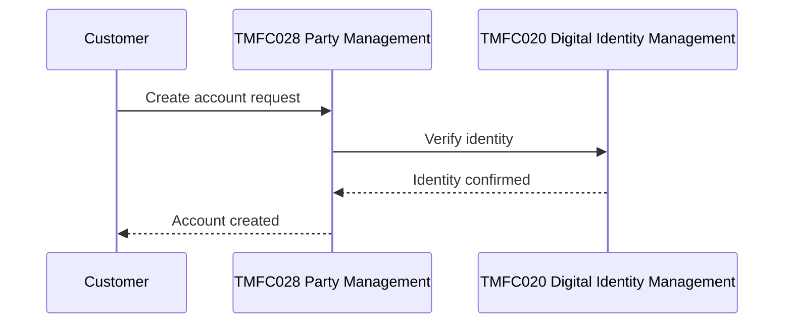

# Draft Architecture Diagram from Use Case — Skill Instructions

## What this skill produces

A Mermaid diagram (`sequenceDiagram` for interaction flow, or a simple
graph for component relationships) redrawn from a use case's own
sequence-diagram content and frontmatter links — not a generic diagram
inferred from the use case's name or summary.

## Step 1 — Check maturity first

Run `check-usecase-maturity` against the id and include its verdict in
the output. A diagram drawn from an Alpha/Beta use case should carry that
caveat — the flow it depicts may still change.

## Step 2 — Read the actual diagram images, not just prose

```
${CLAUDE_PLUGIN_ROOT}/knowledge/use-cases/{ID}/{ID}.md
```

Find the `# Sequence diagrams` section and read every image it references
(`` — the Read tool handles images directly). The
real actor/step flow lives in these images; surrounding prose is often
only a partial gloss on what the diagram actually shows. Document shapes
vary: some use cases narrate each step with its own diagram under a
`## Step N: ...` subheading, others have one diagram covering the whole
flow with a summary paragraph, and some (like TMFS009) use a tabular
scenario/outcome matrix instead of a diagram at all — if there's no
diagram, redraw from the table's rows or say a diagram isn't applicable
rather than inventing one.

## Step 3 — Resolve every actor/component to a real id

Cross-reference every actor/component the diagram images show against the
use case's own `links.components`/`links.apis` frontmatter. Label diagram
nodes with the real id and name (`TMFC028 Party Management`), not a
paraphrase of what the image's label says. If a diagram box names a
capability with no matching frontmatter entry, label it with the plain
name from the image and note in the diagram's surrounding text that it
isn't backed by a frontmatter id — don't invent one to make the diagram
look complete.

## Output format

A single Mermaid `sequenceDiagram` (preferred for interaction flow) or
`graph`/`flowchart` (for a component-relationship view), with a one-line
maturity caveat from Step 1 above it and a short "Sources" note below
listing which images and frontmatter fields the diagram was drawn from.
Example shape:



Keep actor/participant names exactly matching the real ids from Step 3 —
a reader should be able to cross-reference every box in the diagram back
to `${CLAUDE_PLUGIN_ROOT}/knowledge/index/components.json` or `apis.json` directly.

## What this skill does NOT do

- Does not invent steps or actors not shown in the source diagram images or described in the Sequence Diagrams section — this is a redraw, not a fresh design.
- Does not draft Gherkin test scenarios — that's `generate-test-cases-from-usecase`'s job; this skill's output is a visual artifact, not test cases.
- Does not skip the maturity check — every diagram carries its source use case's maturity caveat.
