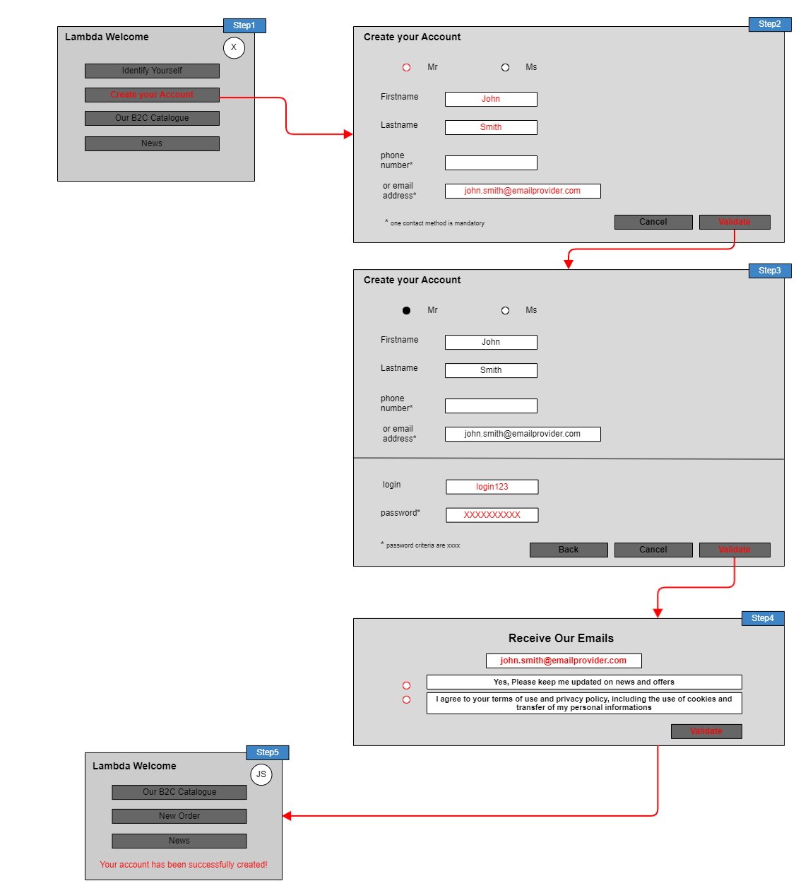
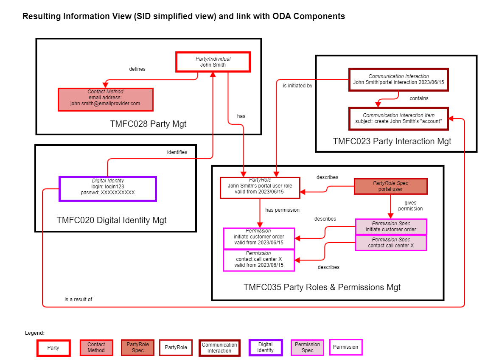
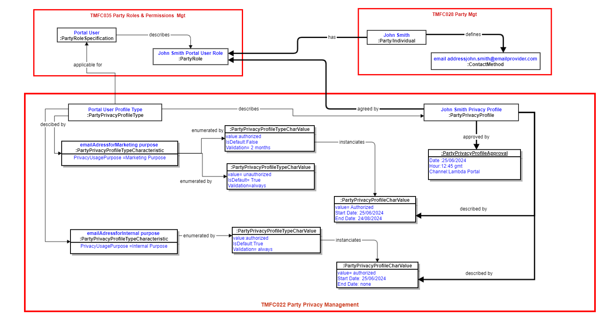
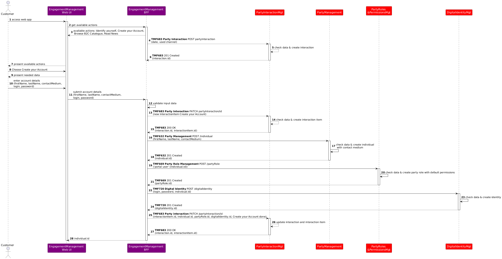
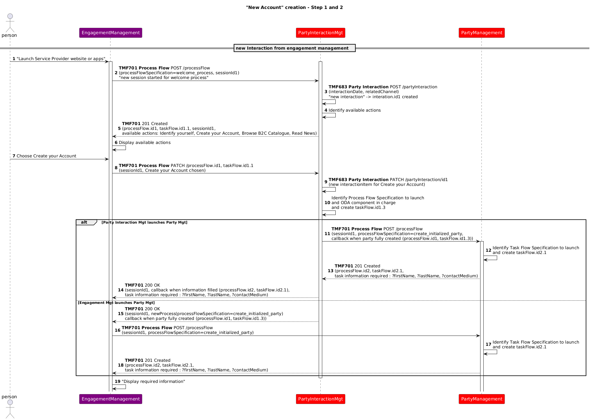
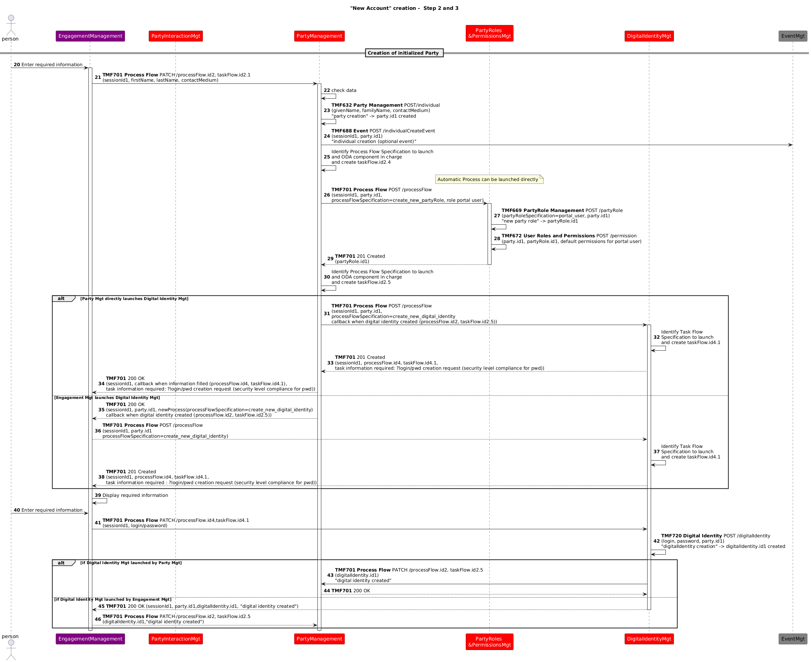
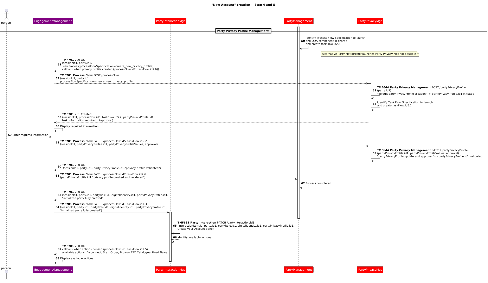
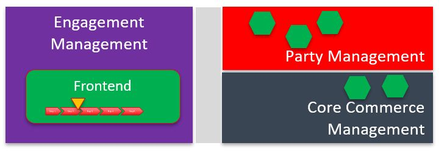
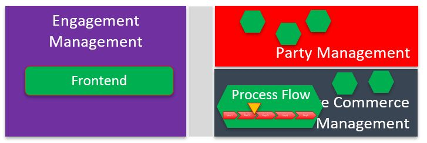
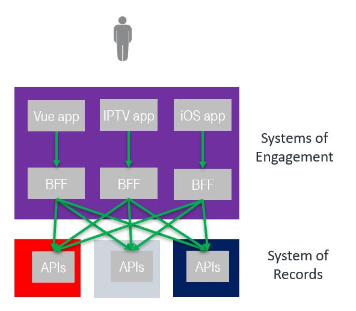

# Introduction

## Context or Background

This use case is the first description to illustrate a set of identified ODA components, and how they interact and collaborate using TMF Open APIs to manage a business process.

As it includes manual tasks and front-end interactions, it also permits to illustrate 2 approaches regarding front-end layer and process layer articulation.

## Objective of the use case

The objective of this use case is to illustrate a first and simple interaction between a person and a CSP Front-End, web portal or mobile app: 

As a potential new customer, John Smith needs/chooses to create his "account" and provides all the requested information, so that he can be identified/authenticated and recognized for his further interactions with the CSP. 

## Scope and assumptions

### Scope

This use case permits to initiate an interaction, with a first interaction item, corresponding to the creation of John Smith's "account". It will be continued, with another interaction item in TMFS002.

It manages the entry of the information necessary to create this "account" and their validation.

### Assumptions

For the CSP the global term « account » corresponds to a set of information to be provided, checked, registered and linked:

- Create a Party/person, status initialized

- Create a contact medium (mail address or phone number)

- Assign a default « Portal User » Party Role to the Party/person 1

- Create an Electronic Identity (login / password) and associate it to the Party/person

A better term to describe this set of information could be « profile ».

This use case also includes the validation of a default privacy profile, to clarify the authorized usages of the contact medium for the CSP. 

1 Another scenario could be to assign another Party Role, such as « Prospect » or even « Customer ». In this series of use cases (TMFS001 to TMFS005) we chose to assign the customer role only to persons ordering a contract, and to associate it to controls on the person identity and legal address. Some companies can choose to assign a customer role - and to control identity and legal address - as a pre-requisite to start an order process.

# Description

*([text description](media/account-creation-ui-mockup.text-description.md))*

- Step 1

- A person, not yet known by the operator, connects to one of the operators front-end and is proposed to create his « account », among other possible actions. A Communication Interaction is initialized.

- He agrees to create his « account ». A Communication Interaction Item is initialized.

- Step 2

- The Front-end presents a first set of information to enter to initialize the Party/person and his contact medium

- The person enters the information and triggers the «validate » action

- Step 3

- The Front-end presents a second set of information to enter to initialize the credentials of the person

- The person enters the information and triggers the "validate" action

- Step 4

- The Front-End presents the possible opt-in to permit the CSP to use the provided contact medium for marketing purpose and the mandatory approval of global privacy rules.

- The person agrees - or not - and validate his answers. 

- Step 5

- All the information entered have been transmitted to the process layer, checked and registered.

- The « account » is created, so the person can now identify / authenticate himself and be recognized

- The related Communication Interaction Item is updated

- Possible actions are updated

Note: In a next version it is planned to add:

- login and password levels of security, by requesting a minimum number and different types of characters (lower case and capital letters, special characters) and checking the inputs,

- the certification of the contact means, by sending an email or an SMS with a code to copy in the front-end,

- after step3, a new step to request the front-end user to enter his credentials and control them before connecting him to his personal environment.

# Information View

Based on the Party Role specifications and the Permission specifications, at the end of the use case, the information created will be:

*([text description](media/sid-information-view-party-account.text-description.md))*

Based on the Party Privacy Profile Type defined for the Portal User Party Role specification, at the end of the use case the information related to privacy management will be:

*([text description](media/sid-information-view-privacy-profile.text-description.md))*

# Sequence Diagrams

2 approaches regarding Front-End and processes articulation are presented. You can refer to the Appendix at the end of the document for more details.

- Approach A: the Frontend manages the process by itself, via the BFF (backend-for-frontend) component, and it knows what the next task is to proceed with and which data are expected. It is also able to apply a first level of validation of the data provided by the user, even if at each ODA component level data checks will be done again.

This approach illustrates a very common implementation of Frontend - Backend articulation in current IT solutions, but doesn't correspond to ODA Functional Architecture recommendation.

- Approach B: GUI kinematics managed by Frontend and process layer managed by ODA components are totally decoupled. This approach illustrates ODA Functional Architecture decoupling principle between Engagement Management and all the other ODA Functional Blocs in charge of business processes.

TMF701 Process Flow API is used to illustrate how to decouple Frontend and process, as how to decouple process managed by different ODA components. 

## Approach A (SoE steers the process)

Here the Frontend manages the process by itself, via the BFF (backend-for-frontend) component, and it knows what the next task is to proceed with and which data are expected. It is also able to apply a first level of validation of the data provided by the user, even if at each ODA component level data checks will be done again.

This approach illustrates a very common implementation of Frontend - Backend articulation in current IT solutions, but doesn't correspond to ODA Functional Architecture recommendation.

Note: This approach has not been updated to describe Step 4 and Party Privacy Profile management.

*([PlantUML source](media/account-creation-approach-a-sequence.puml))*

## Approach B (SoR steers the process)

Here GUI kinematics managed by Frontend and process layer managed by ODA components are totally decoupled. This approach illustrates ODA Functional Architecture decoupling principle between Engagement Management and all the other ODA Functional Blocs and ODA Components in charge of business processes.

TMF701 Process Flow API is used to illustrate how to decouple Frontend and process, as how to decouple process managed by different ODA components.

In this approach we illustrate how we can use TMF701 to solve the issue that a new triggered ODA component, such as Party Management, cannot directly establish a flow with the Frontend in case of manual task required (because of standard technical behavior of Frontend). As the use case was progressively enriched with new steps, new ODA components and APIs, 2 ways of establishing the link between the Frontend and the new triggered component were described, using TMF701:

-  initiate the link through the last component in communication with the Frontend. It is why we have, for example in step 1, Party Management triggered by Party Interaction, and its answer passing through Party Interaction Management to reach the Frontend to permit it to establish a direct communication with Party Management for the next steps. This scenario reached limits when we introduced the Party Privacy Management step, as the last component in communication with the Frontend, Digital Identity Management has finished its process.

- so another scenario is now illustrated as an alternative, each time a new process / a new ODA component needs to be triggered: the Frontend is requested by the component responsible of the main process, to trigger itself the new subprocess / new ODA component. So the flow between them is directly establish.

Note: When TMF701 is used between the Frontend and ODA components, we can show some parameters, such as a session Id, that are not, or not yet, describe in the API. The intent is to illustrate that we should have a way to identify a global frontend context, in which the interactions with the processes managed by the different ODA components are done. This may be also done at a technical level not traced as an API parameter.

In this approach we can also notice that the Party Interaction Management component has a specific role: it is not only in charge of Interaction Management, but also the first component to trigger when a new Frontend session begins, as it is in charge to identify the possible actions depending on the context of the session. For each possible action it knows, by configuration, which ODA component is responsible for. When a chosen action is finished, it is also able to update the possible actions list according to the context changes. 

Note: We could also introduce a dedicated "Welcome Management" component, triggered when a new Frontend session begins and in charge to identify the possible actions depending on the context of the session, and which ODA component to trigger. In this case Party Interaction Management would be simplified and centered on the tracking of the interaction, its items, actors and results.

Here is an illustration of a catalog of processes that can be triggered, and the link with the ODA component in charge, including the configuration of the URL. This catalog can be used by the ODA components and by the Frontend, according to the scenarii and the steps illustrated.

| Process Flow Specification | ODA Component to trigger | Process Entirely Automated | URL to launch the ODA component |
| --- | --- | --- | --- |
| create_initialized_party | TMFC632 Party Management | No | url="https://partyManagementComponent.mycsp.com:8080/tmf-api/processFlowManagement/v4/processFlow" |
| create_new_partyRole | TMFC035 Permissions Management | Yes | url="https://permissionsManagementComponent.mycsp.com:8080/tmf-api/processFlowManagement/v4/processFlow" |
| create_new_digital_identity | TMFC020 Digital Identity Management | No | url="https://digitalIdentityManagementComponent.mycsp.com:8080/tmf-api/processFlowManagement/v4/processFlow" |
| create_new_privacy_profile | TMFC023 Party Privacy Management | No | url="https://partyPrivacyManagementComponent.mycsp.com:8080/tmf-api/processFlowManagement/v4/processFlow" |

In case of an entirely automated process, that is to say without any manual task existing in the process flow, we could manage a dedicated parameter to indicate that the component in charge could be directly trigger, as illustrated in the sequence diagram for TMFC035 Permissions Management.

In this first sequence diagram we illustrate how, according to the choice made by the Frontend user, Party Interaction Management can identify the related process, managed here by Party Management, and trigger it directly or requesting the Frontend to trigger it.

*([PlantUML source](media/account-creation-step1-2-sequence.puml))*

Note: as a reminder, the different codes that can be used as answer to an API call are

- 200 OK : indicates that the client’s request was accepted successfully, SHOULD be used to indicate nonspecific success. Must not be used to communicate errors in the response

- 201 Created : indicates that the client’s request was accepted successfully, MUST be used to indicate successful resource creation. Return message SHOULD contain a resource representation and a Location header with the created resource’s URI

- 202 Accepted : indicates that the client’s request was accepted successfully, MUST be used to indicate successful start of an asynchronous action

For more information you can refer to TMF APIs Guidelines TMF630 v4.2 and future TMF763 (planned for DTW 2025), especially Part 1 chapter 9.

In this diagram, we illustrate how Party Management, responsible of the main process, can delegate sub-processes to other components:

-  it can directly trigger Permissions Management, as the sub-process is entirely automated (no manual task)

-  it can also directly trigger Digital Identity Management, or request the Frontend to trigger it (first alternative illustrated).

- at the end of the Digital Identity Management sub-process, the return to Party Management main process will depend on the way the sub-process was launched (second alternative illustrated).

*([PlantUML source](media/account-creation-step2-3-sequence.puml))*

In the previous diagrams, each time a process or sub-process needs to be triggered in a new component, we illustrated 2 alternatives:

- Alternative 1: the component in charge of the main process, here Party Management, triggers it directly

- Alternative 2: the component in charge of the main process  requests the Frontend to trigger it.

When this sequence diagram starts, regarding alternative 1, the last component in relation with the Frontend is Digital Identity Management, which is no more active. So Party Management cannot interact with the Frontend by means of this component.

Only alternative 2 in the previous steps permits to Party Management to continue to interact with the Frontend.

So only alternative 2 is described in the following steps.

*([PlantUML source](media/account-creation-step4-5-sequence.puml))*

# Conclusion

## Lessons learned

The use case shows a simple process of collecting information and with the 2 different approaches used, regarding front-end and process layer, it is clear that the interactions between the components and the use of the Open APIs differ greatly between the two approaches.

- The approach A can seem simpler, but it impacts managing the process steps and information needed at each step at EngagementManagement-BFF level. And to develop, and maintain it for each channel. We can also see that in this approach A we have no exchanges between the ODA components, as all the process complexity sits in the engagement layer, outside the ODA components.

- The approach B can seem more complex because it needs more exchanges between the Engagement Management and the ODA components - and also needs exchanges between the ODA components. But it permits to develop and maintain each process only once, in the dedicated component, able to delegate a sub-process to another component. And it permits the reuse of these processes for all the channels. With this approach reusability and maintenance are highly improved.

- This use case illustrates that using the TMF701 Process Flow API permits to delegate sub-processes from one component to another, as we have here TMFC028 Party Management in charge of the global process and delegating specific sub-processes to TMFC035 Permissions Management, TMFC020 Digital Identity Management and TMFC022 Party Privacy Management.

- This use case also illustrates that using the TMF701 Process Flow API to decouple the GUI layer and process layer is possible.

- But the constraint we have that a new triggered ODA component cannot directly establish a flow with the Frontend (because of standard technical behavior of Frontend) cannot be always solved by passing through the last component in communication with the Frontend. This mechanism, illustrated with Alternative 1, can only be used for simple sequences of components 

- On the contrary, the second alternative illustrated the redirection to the Frontend of the triggering of any new ODA component and sub-process requested by the main process. This mechanism is able to treat any complex cases of multiple ODA components triggered, many of them with manual tasks needing interaction with the GUI layer.

- Other mechanisms could surely be possible.

## Impacts identified

- Jira ticket to be able to check credentials provided by a portal user and identify the person [ AP-4739](https://projects.tmforum.org/jira/browse/AP-4739?src=confmacro) - TMF720 Credential check operation ** done **

Included in Digital Identity Management V5 - still in progress

As many APIs will be modified with the V5 transformation, sequence diagrams will need to be checked when the APIs V5 are published.

# Appendix: Different approaches regarding management of the overall process

Decoupling Systems of Engagement (SoE) from System of Records (SoR) in current integrated legacy IT landscapes isn't an easy task. Establishing the fully decoupled architecture described in ODA Technical Architecture require upskilling of a large portion of the IT organization in new technologies such as APIs and eventing for both development and operations. That's why many CSPs start with an overlay approach where the SoE still steers the process (approach A) before moving to the target described by approach B.

- SoE = Systems of Engagement

- SoR = Systems of Records

| Approach description | Architecture overview |
| --- | --- |
| Approach A: SoE steers the process |   *([text description](media/architecture-approach-a-soe-steers.text-description.md))* |
| Approach B: SoR steer the process |   *([text description](media/architecture-approach-b-sor-steers.text-description.md))* |

## Relationship to BFF pattern

The BFF (backend-for-frontend) is a well-established IT concept to technically decouple frontend applications running on customer device from backend APIs.

Example for frontend applications running on customer device: Vue, React or Angular single page application in browser, Swift iOS app, IPTV set-top box app…

Both applications, on customer device and BFF, are parts of the ODA Engagement domain.

In approach A to process management the BFF is usually the place where the process is managed.

*([text description](media/architecture-bff-pattern.text-description.md))*

## Approach A : SoE steers the process

- Frontends can define the processes autonomously while leveraging the Open APIs provided by the SoRs.

- The components implementing the Open APIs, in case of creation or update of entities, must check the business rules (e.g., when creating the ProductOrder its content is fully checked by the ProductOrdering component).

- It is the responsibility of each frontend to optimize the/its process by analyzing the global status obtained by interrogating the entities from the Open APIs (e.g., if an installation address has already been defined for a Product in the Shopping Cart the frontend may skip querying that address again).

## Approach B : SoR steers the process

- Based on independent components, each covering a set of related business processes, business entities and APIs.

- Front-Ends are in charge of GUI kinematics and presentation layer. They can directly query any type of business entities they are allowed to.

- Front-Ends never directly trigger creation or update of business entities. They provide needed inputs to the process layer in charge, as the process layer requires.

- TMF701 Process Flow API is used here to decouple front-ends and process layers, as recommended in ODA Functional Architecture. So APIs and components are directly reusable by any Front-End, or by any other process needing to trigger the related process (ex: creation of a Party)

- Processes are data driven (catalogue driven for the order capture) and they drive the GUI, so customer/user journey is not linear : only useful steps are presented to the customer/user.

- TMF688 Event API is used to trigger events that can be transmitted to any other component.

- All exchanges are covered by TMF Open APIs.

