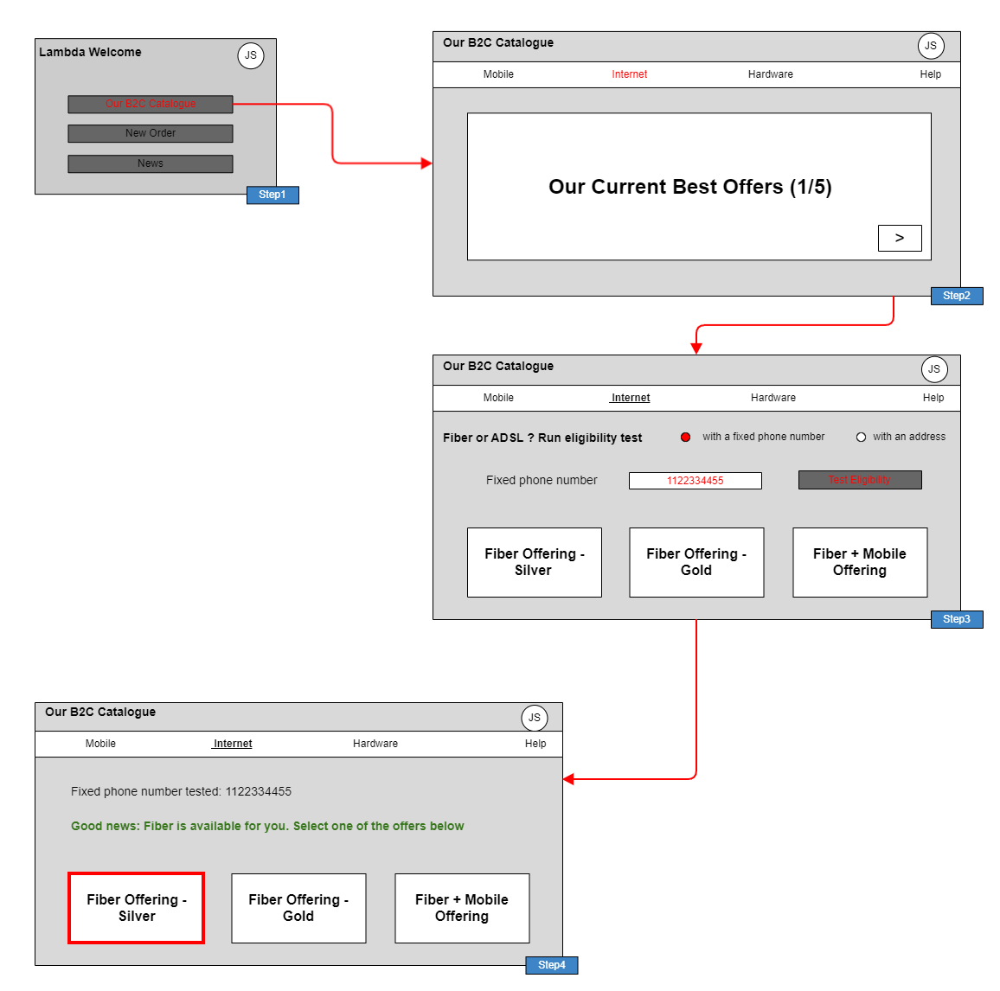
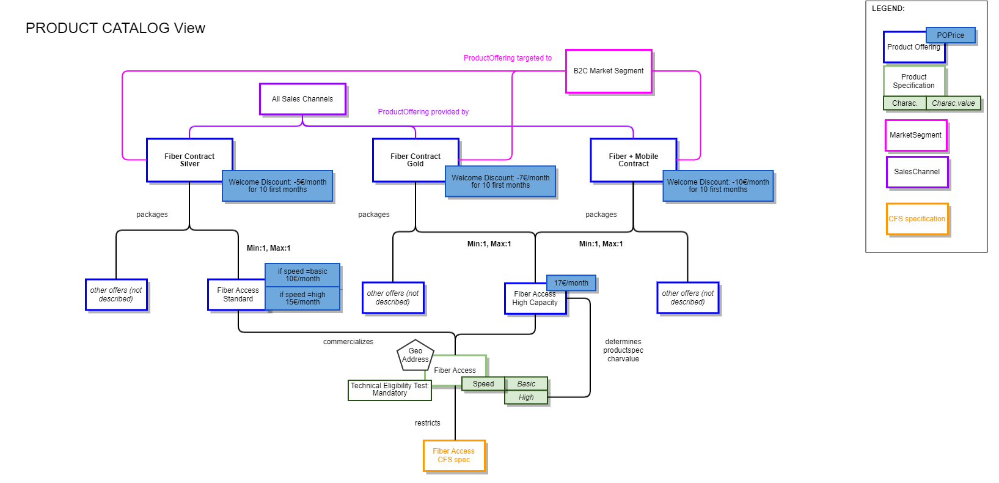
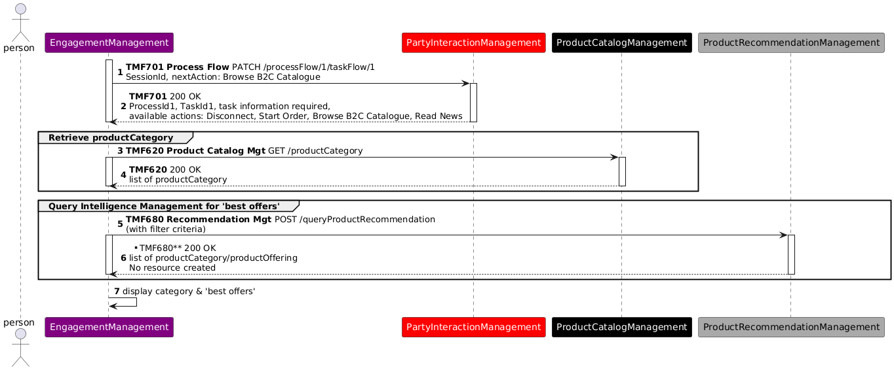
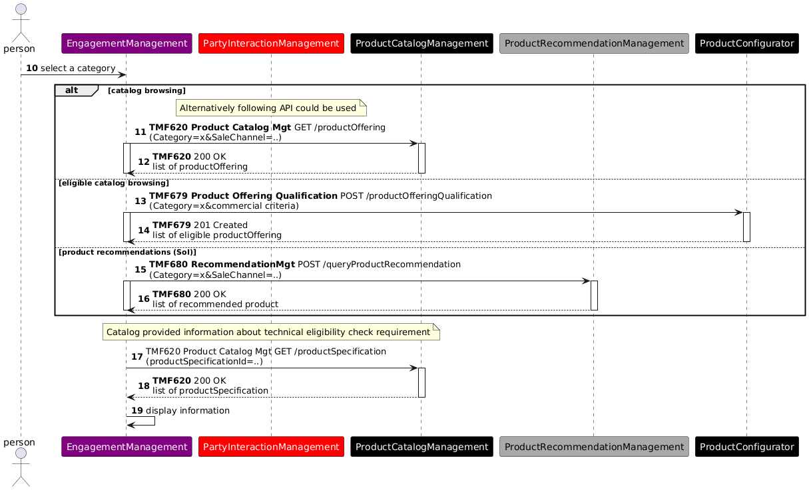
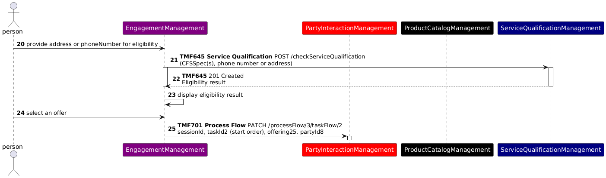

# Introduction

## Context or Background

This use case illustrates a set of ODA components and TMF Open APIs that can provide Product Catalog information and Product Offering recommendations, based on marketing rules and/or customer context analysis.

This use case follows TMSF001.

## Objective of the use case

The objective of this use case is to show how a front-end user can search and get Product Catalog information, and how to push him marketing recommendations.

This use case also demonstrates that a front-end can directly use TMF Open APIs to query information - and build and fill its GUI with the results.

## Scope and assumptions

### Scope

In this use case, John Smith, the front-end user, is interested in Internet offers, and more specifically by Fiber offers. He browses the B2C catalog, and a technical eligibility test is proposed, to check if Fiber is available for him or not.

### Assumptions

In this use case we consider that the CSP decided to use the Fiber technology as a sales argument - so he makes it explicit in the contract names, and for the technical eligibility test. This is possible and common because B2C customers are well aware that Fiber technology exists, permits higher speeds and is not available in every location because a new Fiber network takes time to be deployed. B2C customers also know that Fiber contracts are more expensive.

Another possibility would be to name contracts as "High speed Internet offers", and at technical eligibility level to only share with B2C customers a range of speeds available in a specific location. So Fiber and ADSL technologies are only explicit at technical solution level (RFS specification).

These 2 options are possible and consistent with ODA architecture and decoupling principles, and with the Catalog information model. CSP business owners can choose.

# Description

*([text description](media/catalogue-browsing-eligibility-ui-mockup.text-description.md))*

- Step 1

- John Smith is identified / authenticated on the CSP website (or mobile app) and the list of available actions is displayed (following TMSF001)

- He chooses to browse the operator catalogue.

- The list of available actions is refreshed (same list)

- The Front-End builds the B2C Catalogue start screen, by directly querying the Product Catalog component to retrieve the lines of products (managed as categories), and the Product Recommendation Management component to retrieve the product offerings to push1.

- Step 2

- The front-end presents the lines of products, as well as the operator current best offers

- John Smith chooses the Internet Line of Product

- The Front-End identifies the product offerings corresponding to this line of products

- Step 3

- The Front-End analyses the description of the Fiber Product specification included in the 3 possible offers, and identifies that a technical eligibility test is mandatory.

- The front-end displays the selection of internet offers, and proposes to check fiber technical eligibility based on the person's fixed phone number or geographical address

- John Smith enters his fixed phone number and triggers the test

- Step 4

- Eligibility check is OK.

- John Smith can now start an order capture process, choosing one of the proposed fiber offers

1 We consider here that the Product Recommendation Management component, as part of Intelligence Management is able to check the product offering qualification before pushing them.

# Information View

This view presents 3 examples of contract level Product Offerings commercializing a Fiber Access product. It illustrates that:

- The same product specification can be commercialized through several product offerings, and even more that a product offering can restrict the characteristics values of the product specification.

- The same product offering can be packaged in several composite product offerings

- Product offering pricing rules (POP) can evaluate product specification characteristics values

- Product offerings can be associated to market segments and sales channels - and classified in line of products (as categories - not described in the view)

- The Fiber Access product specification is based on a CFS specification - this link will be used for the technical eligibility test, that is configured as mandatory for this product specification as the Fiber Network is not available in all locations.

*([text description](media/product-catalog-view-fiber-offers.text-description.md))*

# Sequence diagrams

##  Step 1 - Build the B2C Catalogue start screen

** **

*([PlantUML source](media/catalogue-start-screen-sequence.puml))*

## Step 2 - Build the Internet Line of Product screen

The front-end can use 3 ways of identifying the product offerings of this Line of Product to display:

- a simple query of the Product Catalog, to display all the possible product offerings

- a query based on the Product Configurator, to only display the product offerings commercially available for John Smith

- a query based on the Product Recommendation engine, to display the product offerings recommended for John Smith, according to marketing criteria and John Smith individual information.

When the list of product offerings is available, the front-end also query the Product Catalog at Product Specification level to identify if a technical eligibility test is needed, according to catalog parameters.

*([PlantUML source](media/line-of-product-screen-sequence.puml))*
** **

Note: TMF679 Product Offering Qualification API V4 is used in the previous diagram. With the V5 of this API now available we should rather have at this step a POST /**Query**ProductOfferingQualification.

## Step 3 - Test Fiber Product Technical Eligibility

As in the Product Catalog the Fiber Access product specification is defined with a mandatory eligibility test, this test is directly proposed to John Smith who provides a phone number and launches the test.

The test is configurated with the CFS specification identifier associated to the Fiber Access Product specification.

As the test is OK, the list of proposed Fiber contracts remains the same, and John Smith can choose one of them to start an order capture process (continued in TMFS003).

*([PlantUML source](media/fiber-eligibility-test-sequence.puml))*

# Conclusion

## Lessons learned

ODA Functional Architecture introduces a strong decoupling principle between Engagement Management and all the other ODA Functional Blocks in charge of business processes. So front-ends cannot directly create or update information, only a business process layer can.

But this use case illustrates that front-ends can directly query information to build and fill their different screens, here Product Catalog and Product Recommendation information.

## Impacts identified

[[AP-4744] TMF620 - Explicit impact of characteristic values on pricing - TM Forum JIRA](https://projects.tmforum.org/jira/browse/AP-4744)

TMF620 Product Catalog API: permit to associate product offerings to market segments (as possible in SID model)

[[ISA-898] Product Specification ABE - Add attributes to manage technical eligibility check and geographic address need - TM Forum JIRA](https://projects.tmforum.org/jira/browse/ISA-898)

[[ISA-899] Service Specification ABE - Add attributes to manage technical eligibility check and geographic address needs - TM Forum JIRA](https://projects.tmforum.org/jira/browse/ISA-899)

TMF620 Product Catalog API and TMF633 Service Catalog API: treat impacts of the SID Jira tickets ISA-898 and ISA-899 on the API resource model

As many APIs will be modified with the V5 transformation, sequence diagrams will need to be checked when the APIs V5 are published.

