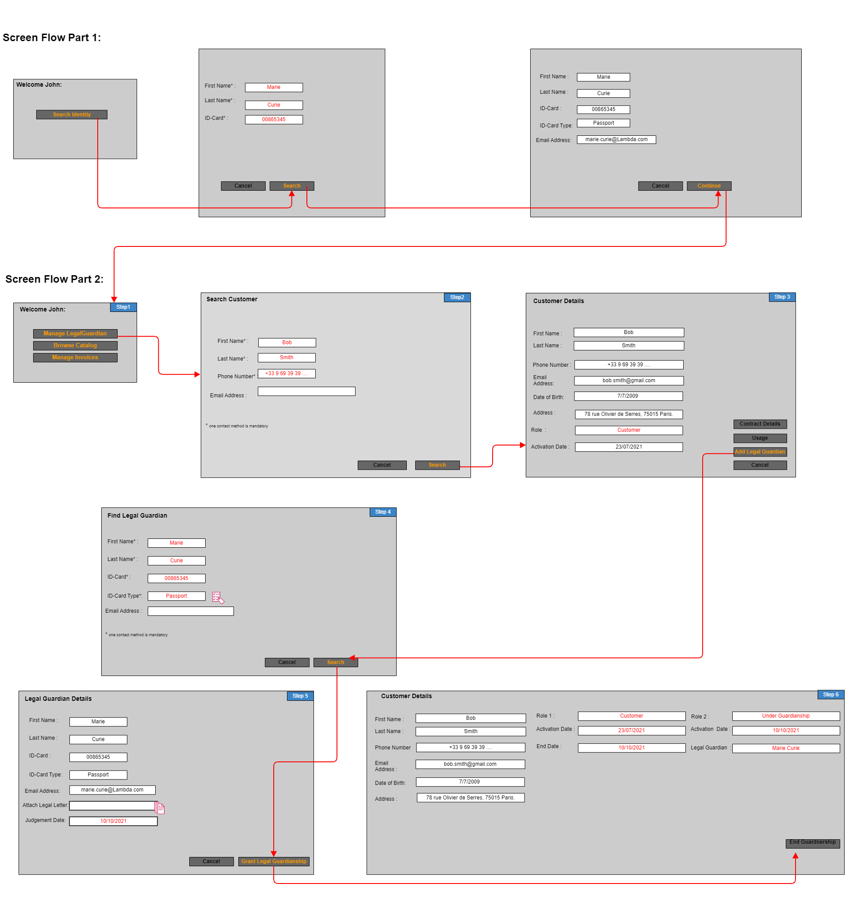
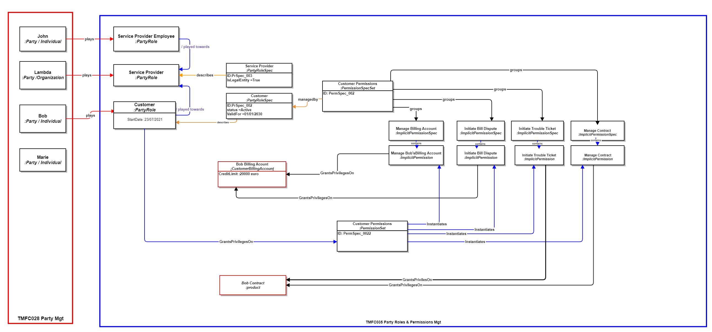
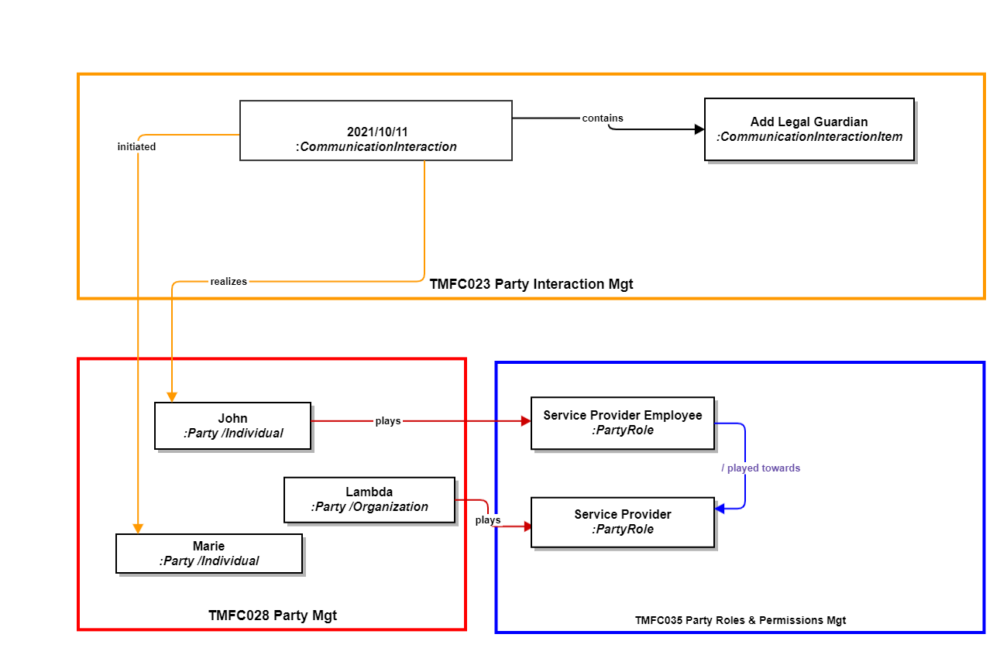
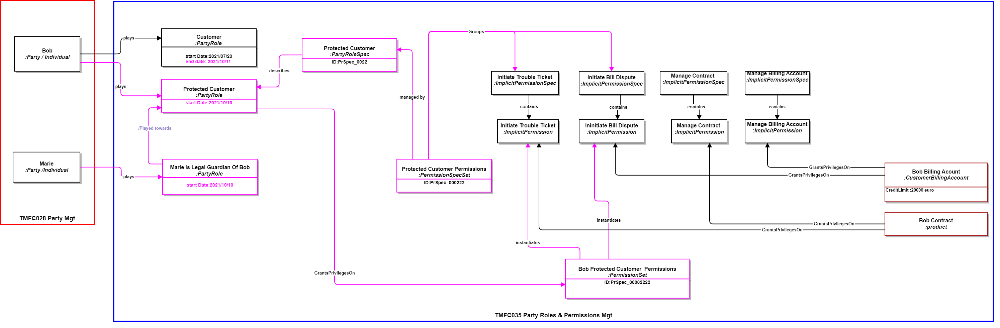
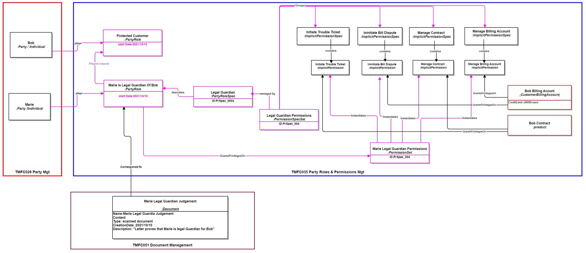
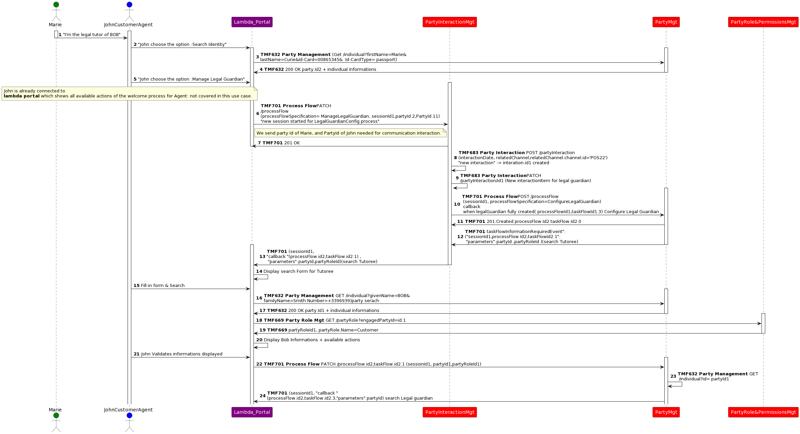
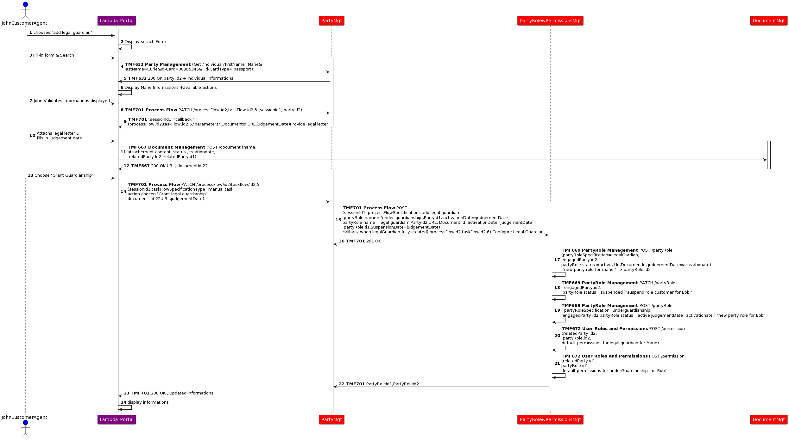

# Introduction

## Context or Background

This use case is a description to illustrate a set of identified ODA components, and how they interact and collaborate using TMF Open APIs to manage a business process.
As it includes manual tasks and front-end interactions, it also permits to illustrate approach regarding front-end layer and process layer articulation.

## Objective of the use case

**Bob, a client of a telecommunications operator "Lambda"**, has subscribed to a service plan. In this use case, the court decides to place him under the **guardianship of Marie**, who becomes his **legal guardian**. This decision may occur in situations where Bob is deemed incapable of making decisions for himself, whether due to mental health issues, protection of his interests, or other circumstances where he is considered to require special assistance. As a result, Marie will act as Bob's legal guardian, making decisions on his behalf and ensuring his interests, including those related to his relationship with the telecommunications operator and the management of his subscription.

## Scope and assumptions

### Scope

Bob, an individual customer (party individual) with a postpaid subscription (offering) from Operator Lambda, has his legal guardianship transferred to Marie. Marie assumes the role of Bob's legal guardian (party role) and gains permission to manage Bob's subscription.

### Assumptions

- Bob's initial status: Individual customer with a prepaid subscription under Operator Lambda.

- Legal Intervention: Marie assumes the legal guardianship of Bob.

- Guardianship Implications: Marie gains permission to manage Bob's prepaid subscription.

- Operator Involvement: Bob is a customer of Operator Lambda.

This use case demonstrates the handling of subscription management when a customer's legal status changes, involving the transfer of subscription management permissions to a legal guardian. It highlights the ability of telecommunications providers to adapt to such changes and ensure continuity of service for their customers.

# Description

John, an agent working for a CSP (Communications Service Provider) agency, will configure Marie as Bob's legal guardian based on a legal document she provides.

**John's Actions:**

- **Identify Bob:** John will first search for the existing party record associated with Bob.

- **Add Legal Guardian:** John will then add a new legal guardian association to Bob's party record.

- **Validate and Attach Document:** Finally, John will validate the legal document provided by Marie and attach it to Bob's party record as proof of guardianship.

**BPMN Diagram :**

[BPMN diagram TMFS006 powered by [viadee](https://www.viadee.de/business-process-management/bpmn-modeler-fuer-confluence/)]

## As-Is Data Model View

This data model outlines the parties, roles, and permissions involved in the "legal guardian" configuration use case before the "legal guardian" is set up. It serves as a foundation for modeling the changes introduced by the "legal guardian" configuration.

## View Data Model after Guardianship operation: 

### Focus on Communication Interaction:

This data model segment focuses on the interaction initiated by Marie, where she contacts John, an employee of the operator, to request her configuration as Bob's legal guardian. She provides the court judgment as supporting documentation.

### SID representation :"Bob Party Role & Permissions" :

This section of the data model demonstates the impact on Bob's party role and permissions following his placement under Marie's guardianship. As a result of this change, Bob assumes a new role as a "Protected Customer" with restricted permissions.

###  SID representation : " Marie Party Role & Permissions ":

This segment of the data model depicts the representation of Marie's new party role as Bob's legal guardian and the permissions associated with this role.

# Sequence diagrams

Part 1: Search tutoree &Legal Guardian:

# Conclusion

## Lessons learned

This use case is a first example that shows how the document management component works. It also shows how the party management component handles the complex process of setting up a new party role and how this affects existing roles.

## Impacts identified

This use case will serve as an input for the specification work of the document management component

