# Executive Summary

This use case illustrates how a Communications Service Provider can deliver a postpaid mobile subscription end-to-end on the TM Forum Open Digital Architecture (ODA), from a customer's product order down to network activation. Covering both 4G and 5G fulfillment — including physical SIM, pre-provisioned SIM, and eSIM variants — it shows that a single, standardized order management stack can serve all mainstream mobile generations and SIM technologies. The use case provides a repeatable blueprint for B2C mobile fulfillment, helping operators reduce integration cost, accelerate time-to-market for postpaid offers, and converge their BSS/OSS on Open APIs.

# Introduction

Mobile postpaid is one of a CSP's highest-volume B2C products, yet its fulfillment still spans fragmented catalog, order, inventory and network-provisioning systems, with each mobile generation (4G, 5G) and SIM technology (physical, pre-provisioned, eSIM) typically integrated separately. This use case shows how a single, standardized order management stack, built on TM Forum ODA and realized through Open APIs, can deliver a postpaid subscription end-to-end, from product order to network activation, reducing integration cost and accelerating time-to-market.

The central finding is that, from an end-to-end ODA perspective, there are no fundamental differences between 4G and 5G: catalog, order decomposition and lifecycle patterns are common, with only minor variations in the delivery and provisioning steps. Two scenarios are modelled: a **base scenario** (4G postpaid, with SIM either shipped and provisioned during order execution or handed over pre-provisioned at retail) and an **extended scenario** (4G subscription enhanced with 5G Core provisioning and eSIM activation).

Architecturally, the use case follows ODA principles and the SID product–service–resource separation: an upstream-validated product order is decomposed into service and resource orders, progressed through the Acknowledged → In Progress → Completed lifecycle via Open APIs including TMF622, TMF641 and TMF652, and supported by catalog, inventory, activation and shipping APIs (TMF620/633/634, TMF637/638/639, TMF702, TMF685, TMF700, TMF688). This version covers the happy path only; order capture and validation, fallout, UI interactions and static network functions are out of scope and handled by other IG1228 use cases.

## Context or Background

This use case explores the order management ODA stack for a simple product - mobile postpaid, and in particular, the boundary between the ODA stack and the networking layer (4G and 5G).

## Objective of the use case

The purpose of this consolidated use case is to show that there are no fundamental differences between 4G and 5G scenarios from the perspective of the E2E ODA use case. Subtle differences might exist, especially in the delivery part, which highlights the particular implementation of mobile technology or migration from one technology to another, or the coexistence of two technologies

## Scope and assumptions

### Scope

The use case considers subscription to a mainstream post-paid mobile service (instantiation of a product). The service characteristics are further described in Section #3 on the catalog. Two scenarios are considered:

Subscription to 4 G-based mobile product (base scenario)

This 4G Scenario considers 2 variants as regards SIM card provisioning:

- The SIM card is shipped to the customer after order confirmation. The SIM card is provisioned as part of the order execution process (variant 1).

- A pre-provisioned SIM card is handed over to the customer at the point of retail (variant 2).

Subscription to 4G/5G based mobile product (extended scenario)

This Extended Scenario enhances the 4G postpaid mobile subscription provisioning with 5G Core network and eSIM provisioning.

From a SIM provisioning point of view, while this scenario focuses on the eSIM-related activation flows, the other two variants indicated in the 4G Scenario are still valid.

### Assumptions

The following additional assumptions are made:

- Base scenario:

- The customer is new and obtains a new SIM card. No number needs to be ported.

- The offer is for a subscription only and is not bundled with a device. This also excludes the use of embedded SIMs. eSIMs are included in a follow-up use case.

- The offer is for a "real" mobile service and excludes the use of mobile technologies for fixed services.

- Extended scenario:

- User equipment in the use case may be a smartphone, tablet, modem, or a smart device like a smartwatch that supports a SIM Card (Physical or eSIM) 

- The use case considers only mobile postpaid contracts with optional offerings such as User equipment, Vanity line, one-time package, Recurring package, etc.

- Pre-check is done to ensure the user equipment is compatible with Physical SIM (with compatible form factor), eSIM, or both.

- Pre-Check is done to ensure the user equipment is compatible to receive the eSIM profile and also supports permissible eSIM profile download options.

- All the licenses to use the VAS offered by the third parties are procured by the operator and ready for provisioning to the end user.

- Separate 4G and 5G Logical resources used from a provisioning point of view, whereas from an implementation point of view, common resources may be used.

- The entities on the Catalog diagram related to the Extended 5G Scenario are marked with an asterisk.

# Description 

## Order lifecycle

The use case starts once a valid product order has been raised. The starting point is similar to that of TMFS004. The use case will subsequently move the service and resource orders through the order lifecycle as defined in the relevant Open API specifications. The first version of the use case considers the happy path "Acknowledged → In Progress → Completed", which is common to the 2 types of orders (and specified in TMF641 and TMF652). State changes of related orders in different domains have dependencies, as shown in the following diagram.

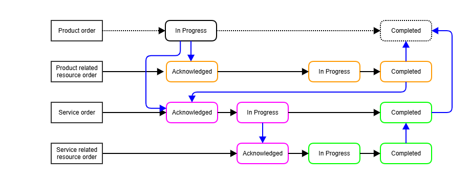

**Figure 1: Order state changes and use case steps**

The black solid arrows indicate the state transitions of each order. The blue arrows indicate preconditions of state changes created by state values of related orders. E.g., a service-related resource order reaches state "Acknowledged" only if the service order has reached state "In progress". A service order reaches state "Completed" only if the related resource orders have reached the same state. The product order lifecycle (black dashed line) is outside the scope of this use case. The related components, such as Product Order Inventory ("POI") or Product Order Capture and Validation ("POCV"), are not or only peripherally covered in this use case.

The use case is organized in the following steps (also indicated by color codes on the diagram above):

| Step | Product-related resource order | Service order | Service-related resource order |
| --- | --- | --- | --- |
| Step 1 | → Acknowledged → In Progress → Completed | N/A | N/A |
| Step 2 | No change | → Acknowledged → In Progress | → Acknowledged |
| Step 3 | No change | → Completed | → In Progress → Completed |

**Table 1: Use case steps.**

The state values of an order and its associated order items are related:

| Order state | Associated order items state |
| --- | --- |
| Acknowledged | All order items are acknowledged |
| InProgress | At least one order item is in progress |
| Completed | All order items are completed |

**Table 2: Relationship between states of orders and order items (as per TMF622, TMF641, and TMF652)**

These relationships represent necessary, but not sufficient, conditions. e.g., the order management component might execute additional business logic, such as confirming that the contract document has been signed and a proof of identity has been provided by the customer, after all order items have been completed but prior to the completion of the order itself.

## UI flow

This use case begins after a product order is created. We assume that the product order has been created and validated by a Product Order Capture and Validation component. This part is not described here as it is covered by other use cases (e.g., TMFS003). As a consequence, the user interaction related to product order creation is outside the scope of this use case.

In addition, this version of the use case is limited to the happy path. No user interaction is required to complete the flow.

As a consequence, no UI screens are required for this version of the use case.

# Views

## Information View

### Catalog views

Product catalog view

The product catalog configuration used to illustrate the Base and Extended scenarios is based on a bundle comprising the following product offerings.

Base Products Specification marketed in Contract Offering:

- Mobile Line

- Recurring Package. This is a package refreshing a balance of subscribed services (e.g., a set of national voice minutes, GB of data) at the beginning of a new billing period.

- Extra National Voice

- Extra SMS and Extra Data

- Voice Mail

- SIM Card and Physical SIM 

Extended Products Specification marketed in Contract Offering:

- User Equipment - smartphone, tablet, modem.

- VAS - contents, APPs, licenses.

- One-Time package. This is an optional package provided to the customer only once after the contract is signed off. This package is usually valid only for one predefined period.

- Vanity Lines. It is an opportunity to choose any set of numbers (e.g., Lucky number, 777, car registration sign number, gold number, etc.).

- Extra International Voice. This is an optional product offering (minutes), which can be purchased by the customer.

- eSIM is a form of programmable SIM that is embedded directly into a device.

These offers are linked with product specifications, which will drive the product order execution. The characteristic values of the product specifications will depend on the offers selected by the customer and the information gathered during the order capture process.

To model the usage available to the customer, we are using the ProductUsageSpecification entity, along with bucket product specifications, described in the latest versions of the SID model. However, it is not supported by any API yet; this aspect is addressed as part of the sequence diagrams.

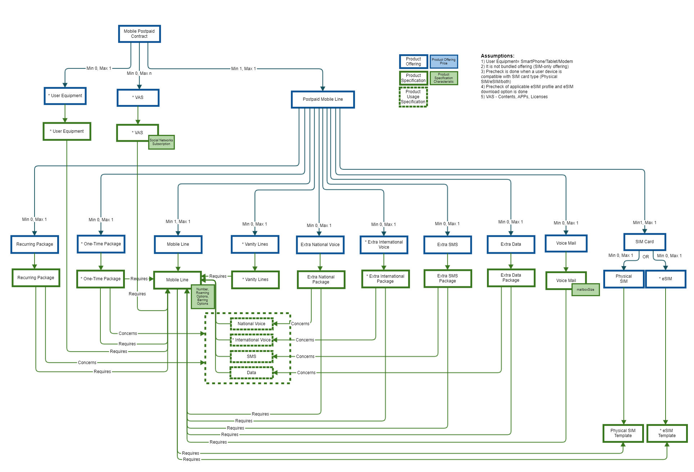

**Figure 2: Product catalog**

Notes:

- The maximum cardinality of the relationship between the "Postpaid Mobile Contract" and "SIM Card" product offerings is typically 2. It could be higher, but it will be a (very) tiny integer.

- The specifications whose names are prefixed by an asterisk '*' are part of the extended scenario but not the base scenario. The same convention is used in the service and resource catalog views.

Service and resource catalog view

The product specifications described above can be linked with resource specifications of the resource catalog or customer-facing service specifications of the service catalog. The following figure represents those relationships, as well as the configuration of the service catalog:

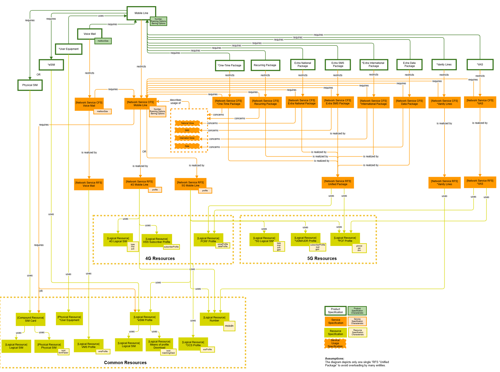

**Figure 3:** **Service and resource catalog**

As shown in the diagram, Mobile Line Product specification is associated with respective product specifications for the Physical SIM template, eSIM Template, User Equipment, Voice Mail, Vanity lines, VAS, and a set of packages based on the billing cycle or usage limits. These product specifications are associated with the corresponding CFS and RFS specifications. The following are some of the design considerations.

- Physical SIM Template Product Specification is realized as a compound resource (SIM Card Resource Specification) consisting of a Physical SIM (selected during order capture or shipped to the customer during product order processing) and a Logical SIM (which is provisioned during the order execution), both related to respective resource specifications. The Physical SIM part of the order execution is detailed in UC008, so the current use case focuses more on the eSIM provisioning than on the Physical SIM provisioning flow.

- A common set of Service Usage Specifications (National Voice, SMS, International Voice, Data) is shown in the diagram associated with the Mobile Line Product Specification. Note that, in practical implementations, each CFS may have a mapping to the respective service usage specification indicating the corresponding usage event.

- Three sets of resources are shown in the diagram: 4G Resources, 5G Resources, and Common Resources. This separation is purely from a provisioning point of view; in practical scenarios, such separation may not exist, and converged resources may be used depending on the provisioning APIs exposed by respective vendors and specific implementations. For example, two separate resources – 4G Logical SIM, 5G Logical SIM are depicted with separation of respective characteristics, but in practice this can be a common Logical SIM with relevant characteristics associated with 4G and 5G. Additionally, in practical cases, some resources may expose both 4G and 5G specific functionality to ease the migration and implementation.  

- It is assumed that there may not be a 5G-only service scenario in the near future,  as there are issues like coverage gaps that need to be filled with other generations of mobile technology, such as 4G, 3G, etc. Hence, it may be necessary to provision 4G services along with 5G for all practical purposes.

- A common unified package RFS is shown in the diagram with the assumption that the package or service-specific functional aspect (rules for PCF, PCRF, etc.) is captured in the respective CFSs. Additionally, such a design approach is followed to give a uniform presentation of resources irrespective of the technical solution (e.g., PCF or PCRF) abstracted by a common and unified RFS (Unified Package RFS).

- The eSIM Profile shown in the diagram is the provisioning view of the corresponding profile being downloaded to the end user equipment. In practice, there can be two logical resources: a) the profile being downloaded to the end user device, and b) from a provisioning point of view, the details of the profile for management & tracking purposes. The “eSIM Profile” downloaded to the end user device is typically maintained by the SM-DP+ function (Subscription Manager- Data Preparation) as defined by GSMA SGP.21. For the purpose of this use case, only the provisioning view of the eSIM Profile is considered. 

- In the case of 4G, the mobile line CFS specification does not use the PCF specification, i.e., a mobile line can be instantiated without prior instantiation of a PCF profile. The latter is instantiated when packages are instantiated.

- PCF Profile is the set of policies that are provisioned in UDR for the specific 5G Mobile Line.

Resource catalog relationships view

The logical resources that represent profiles are provided by network resources. This means that they are created during the resource order execution, launching commands against existing network elements of the resource inventory. The resource order management will use API specifications (which are optional on the Resource catalog view and may vary across the implementation)   to find and connect to those network elements through resource inventory entities. The API specifications represent existing, configured resources that are used during the instantiation of HSS (UDM/UDR), PCRF (PCF), and VMS profiles. They represent what needs to be known about HSS (UDM/UDR), PCRF (PCF), and VMS-related resources. New instances of such APIs are not instantiated within the scope of this use case. In order to differentiate them from resources that will be instantiated, the relationship "uses configured" is defined (SID extension).

It is not strictly necessary that the network resources, like HSS (UDM/UDR) and PCRF (PCF), are fully represented as resource specifications in the resource catalog, because most of their characteristics are static elements outside the scope of customer order management processes.

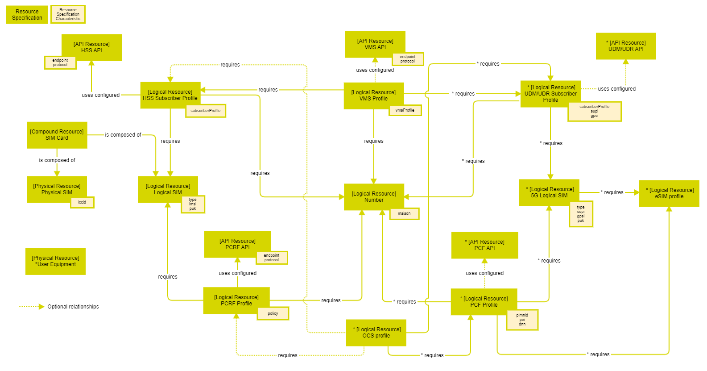

**Figure 4: Resource catalog relationships view**

The following are some of the design considerations:

- Physical SIM Card is represented through a compound resource SIM Card with two parts – Physical SIM Template, Logical Resource, and Physical SIM Physical Resource. eSIM is represented as a separate resource - eSIM Profile and managed independently of the Physical SIM.   

- 5G supports multiple evolutionary deployment options called Standalone and Non-Standalone.  It is assumed that during this evolutionary process, the 4G Core network will be used (NSA) until a full migration to 5G (SA) happens. The above resource view is for a deployment option where the core network is fully migrated to 5G. 

### Order structure

A product order is released by the product capture and validation component with five product-specification-level order items (some commercial order items, related to product offerings, might be released as well, but are not described here since they are not relevant to the delivery process):

- The main post-paid Mobile Line.

- The SIM/eSIM card is related to the mobile line.

- The Voice Mail value-added product.

- The Recurring Package is associated with one of the ‘flavors’ of the offer.

- An optional Extra Data Package.

The product order orchestration and management component decomposes the product order into two new orders:

- A resource order that contains one resource order item for each resource specification related to product specifications in the catalog. In this case, it contains the SIM Card resource (Base scenario) or the User Equipment resource (Extended Scenario).

- A service order that contains the CFS specifications associated with the product specifications in the catalog. The grouping of all CFS order items in a single CFS order rests on the implicit assumption that all the CFS-based products are delivered by a single "CFS factory". If several factories were involved, several orders would be needed, and the processing of these service orders would be orchestrated by PODOM.

The service order management component decomposes the CFS-based service order items in Resource Facing Services by using the configuration and rules stored in the service catalog. In the same way, it identifies the resources related to RFS specifications to build and launch resource orders. We assume the existence of several resource order management components and several resource orders. Specifically, one resource order per RFS order item is issued.

As regards the decomposition of the orders into ordered items, the proposed order structure strictly follows the specification structures defined by the catalogues.

Order structure for Base Scenario 

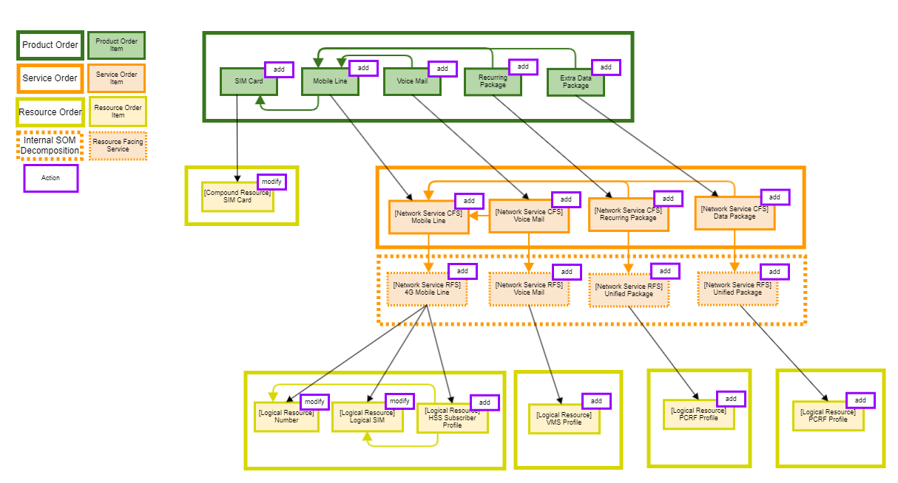

**Figure 5: Order structure for base scenario**

Some of the resources created or modified in the first resource order are required to create the VMS and PCRF in further resource orders. Therefore, references to those resources have to be specified as part of the information sent in the order items.

The Logical SIM and Number resource order item actions consist of status "modify" actions, as the use case assumes that:

- The Logical SIM card is tied to the Physical SIM card, and both are selected in step 1.

- The number is reserved as part of the product order capture and validation (see mobile line product specification on figure 2).

This catalog configuration and order structure lead to the following orchestrations between order items at the various layers.

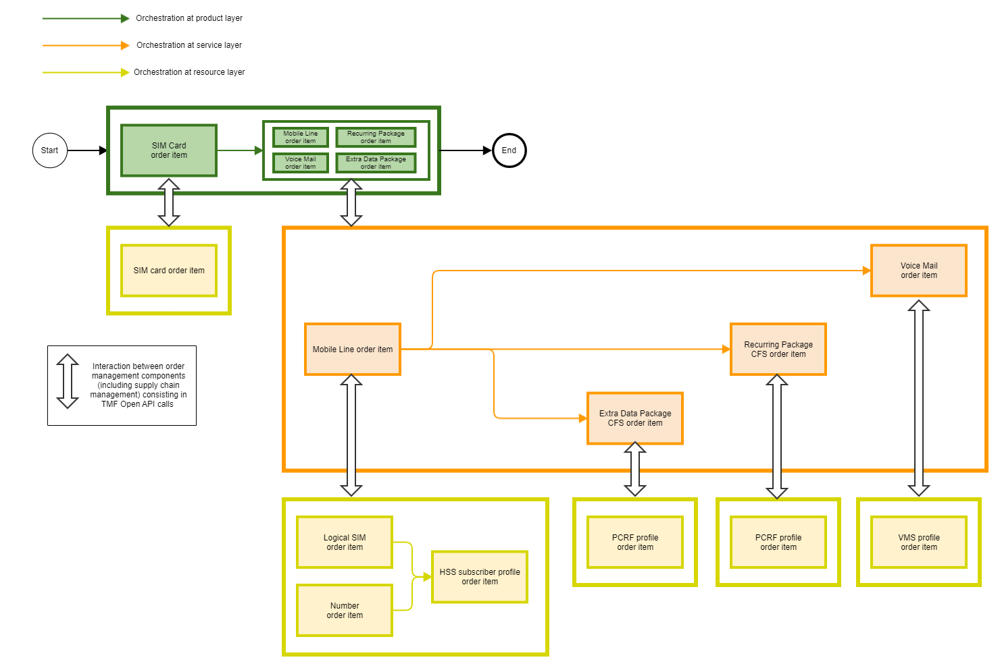

**Figure 6: Base scenario orchestration**

 Order structure for Extended Scenario 

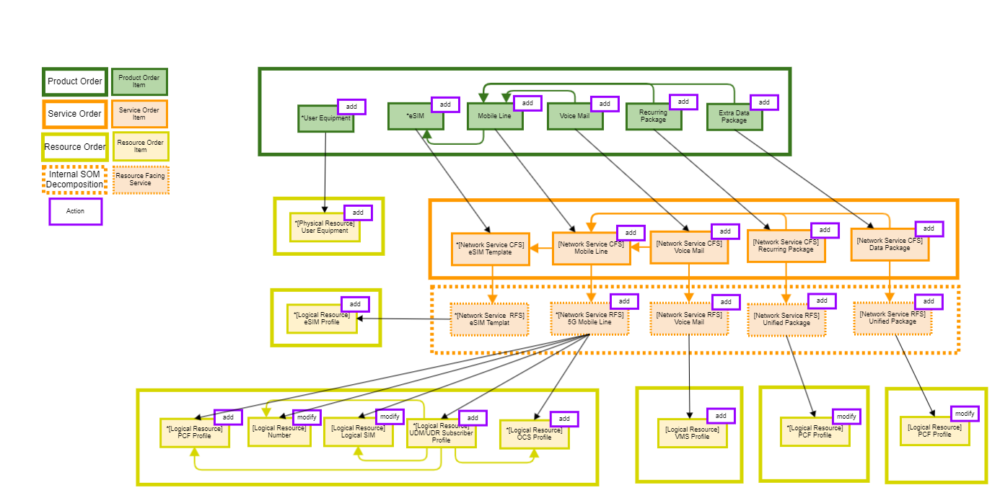

**Figure 7: Order structure for extended scenario**

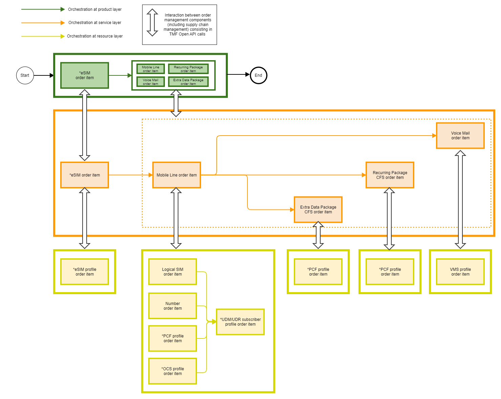

**Figure 8: Extended scenario orchestration**

# Diagrams

## Sequence diagrams

### Classic request/response communication model

Step 0: Product order handling aspects

The following shows the preliminaries at the product-order level that lead to the creation of the service and resource orders that are within the scope of the use case.

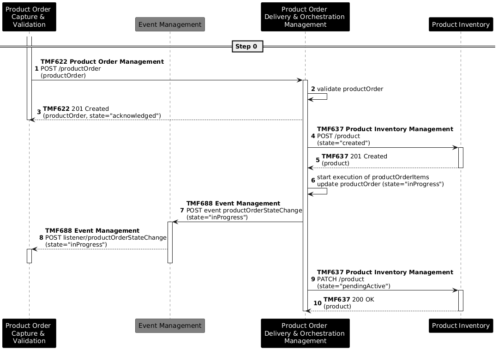

**Figure 9: Preliminaries**

Notes:

- The use case begins when the Product Order Capture & Validation ("POCV") component explicitly requests the creation of a product order by sending a POST request to the Product Order Delivery and Orchestration Management ("PODOM") component via the TMF622 Product Order Management API.

- PODOM validates the received product order and, upon successful validation, responds synchronously with a 201 Created status, indicating that the order has transitioned to the "Acknowledged" state.

- Following acknowledgement, PODOM immediately creates the corresponding product instances in the Product Inventory via a POST request to the TMF637 Product Inventory Management API, setting their initial state to "Created".

- PODOM then begins the execution of the product order items and transitions the product order to "InProgress" state. This state change is communicated asynchronously to POCV through the Event Management component via the TMF688 Event Management API.

- Once the order items are processed, PODOM updates the previously created product instances in the Product Inventory to state "Pending Active" via a PATCH request to the TMF637 API.

- In the above, several order items are processed at the same time. The TMF637 API calls can group several order items as needed.

It is worth noting that this does not reflect the behavior described in the latest version (v24.0.0 to date) of the ODA Component Inventory, IG1242. That document still describes the POCV component as the one exposing the TMF622 API and owning the product order, while PODOM only reacts to events published by POCV. However, ongoing work within the Component Architecture team is moving in the direction described in this use case: PODOM exposes the TMF622 API and owns the product order. This change is expected to be published in upcoming versions of the aforementioned document.

Step 1: Tangible product delivery

The following deals with the handling of the resource orders that directly fulfil a product order, namely SIM card (base scenario) and User Equipment (extended scenario). Step 1 involves the supply chain management of the CSP and its partners.

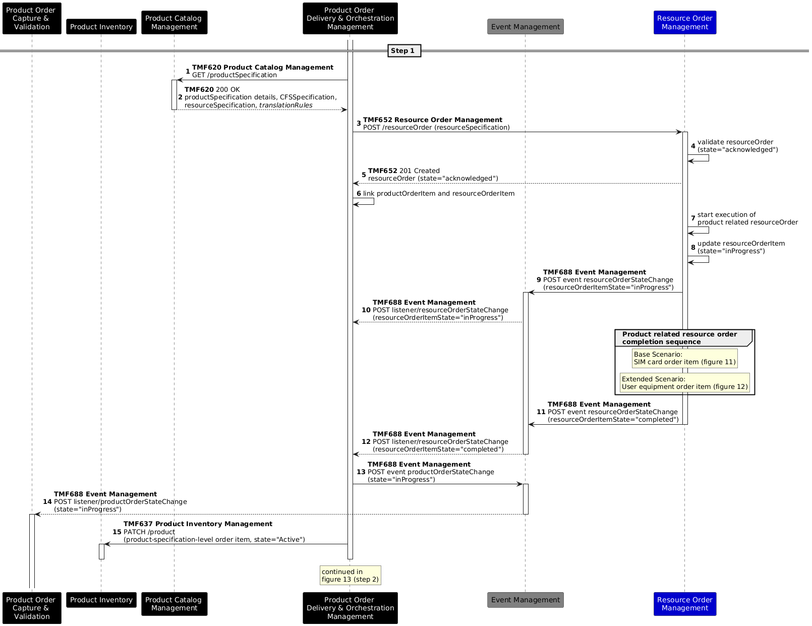

**Figure 10: Sequence diagram for step 1 (both scenarios)**

Notes:

- *translationRules* are a proposed API extension. This resource represents the rules used to translate product characteristics into the corresponding CFS and resource characteristics. See section 5.2  for the related JIRA issue.

- In the base scenario, as per the catalogue, SIM cards are the only resources that are directly used by the product. As they also represent physical goods that need to be shipped to the customer, the supply chain management component will be introduced in the following steps.

- In the extended scenario, User Equipment is the resource directly under the product. Similar to the case in the Base scenario with the SIM card, the supply chain management component is used for managing the shipment of the UE.

- In the above, it is implicit that each specification group all the specifications related to the product, service, or resource covered by the corresponding order.

- This use case implements TMF652 to manage the delivery of the product-related resources. A similar scenario is considered by IG1228's use case 004. In the latter, the TMF700 interface is called directly from the Product Order Delivery Orchestration & Management component— the approach proposed here considers delegating the coordination of those calls to the Resource Order Management component. Both implementations are not entirely satisfactory, and section 4.4.1 of use case TMFS004 sets out some of the issues. This point will likely lead to updates of the above in subsequent versions of IG1228, as the discussion on the Supply Chain Management component and related APIs matures.

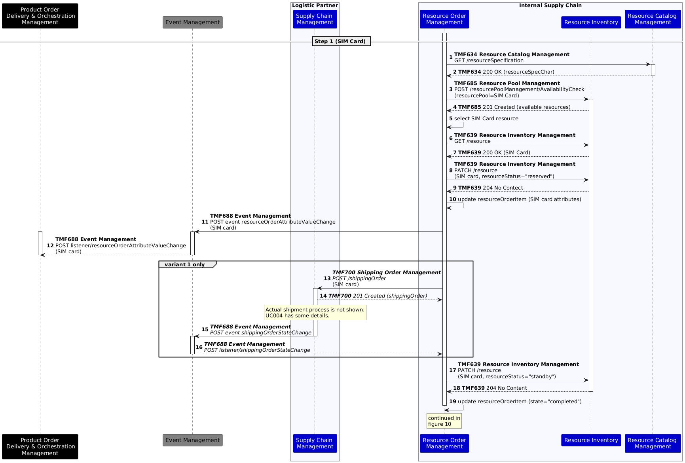

**Figure 11: Base Scenario - Completion of the resource order (item) related to the SIM card product**

Base Scenario Notes:

- The use case considers 2 variants. Variant 1: SIM card is shipped to the customer after order confirmation. The SIM card is provisioned as part of the order execution process. Variant 2: A pre-provisioned SIM card is handed over to the customer at the point of retail.

- The SIM card resource is selected from among the available ones returned by TMF685. In variant 2, this step is materialized by the handover of the SIM card to the customer.

- The reserved SIM card characteristics are communicated back to the product order orchestration and management so that the product instance can be related to the resource instance.

- The sequence diagram is based on TMF700 (published as a beta version in [Open API Table - Early Adoption (Beta) - TM Forum Ecosystem API Portal - TM Forum Confluence](https://www.tmforum.org/oda/open-apis/table/pre-production)).

- It is common practice that certain logical SIM card characteristics (e.g., PUK) are printed on the SIM card holder that is shipped to the customer. The sequence diagram supposes that the logistics partner handles these production aspects of the SIM card. Some CSPs also print the phone number on the SIM card holder. This process is not supported in the sequence diagram above.

- The resource order is considered to be completed when the corresponding shipping order reaches a specific state. This also needs further analysis once TMF700 has been released.

- For variant 2 (a pre-provisioned SIM card is handed over to the customer at the point of retail), the sequences involving the logistics partner are not required.

- For the SIM card status values, the resourceStatus field of TMF639 is used. The SIM card status is set to "standby" before activation by the subscriber.

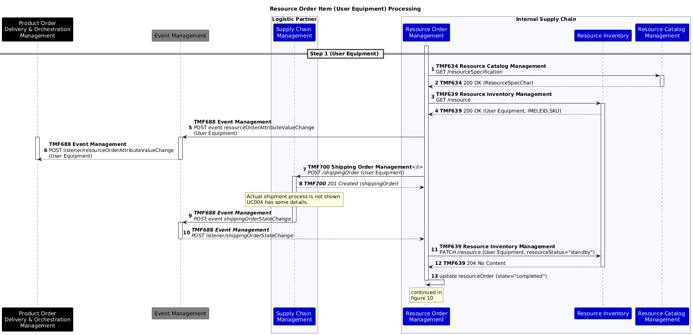

**Figure 12: Extended Scenario - Completion of the resource order (item) related to the User Equipment product**

Extended Scenario Notes: 

- In the extended scenario, instead of the SIM Card, the availability check and reservation of the user equipment is carried out before initiating the shipment through the Supply Chain Management component

- Unlike in the Base scenario, setting the status of the User Equipment resource to "standby" in Resource Inventory is optional and depends on the business logic and security considerations of the operator. In certain operator scenarios, an additional unlocking procedure needs to be carried out before the User Equipment is activated

- It is assumed that the Resource Inventory is updated with In-Stock User Equipment that is available for shipment to the customer. The Resource inventory will capture details such as the IMEI, EID (eUICC ID), based on the manufacturing details of the User Equipment. Optionally, these details can be updated if the customer is using a pre-existing User equipment that is not bundled with the product offering. 

- In the case of a bundled offering with user equipment, it is assumed that the device is not pre-loaded with an eSIM Profile, but practically, this may be a valid option considering the particular offering supported by the operator and the specific subscription management implementation. 

- Extended scenario order structure includes eSIM Profile CFS Order item wherein eSIM Profile(s) to be used in the User equipment is generated with the support of the Subscription Management network systems as defined in GSMA SGP.22 specification -   Remote SIM Provisioning (RSP) Architecture for consumer Devices. 

Step 2: Service & related resource order initiation

The orchestration at the CFS level (according to the diagrams in chapter 4) is reflected in the following:

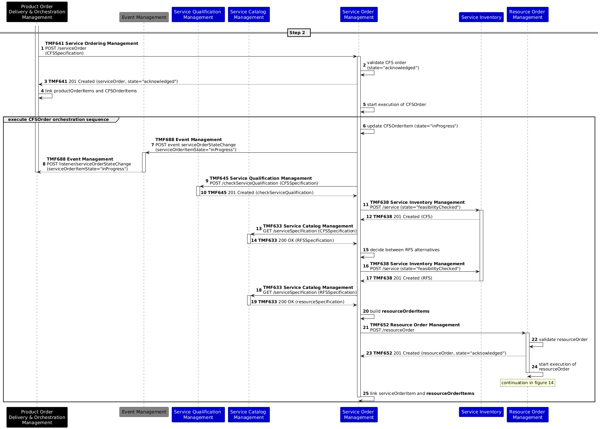

**Figure 13: Sequence diagram for step 2**

Notes:

- TMF641 does not support reference to a service qualification, nor does the qualification process affect any changes in the network, such as reservations. Hence, the service qualification is performed a second time by the service order management. See also the related issue under section 5.2, item 2.

- The RFS Orders are internal to the service order management and are not shown.

- The first sequence expresses the fact that the order management component has some internal logic that decides to start execution of the CFS order. This logic might depend on characteristics of the order, on other orders, and/or environmental factors (e.g., load of the system).

Step 3: Service & related resource order completion

Step 3: Common sequences

The following sequences are generic to the base and extended scenarios.

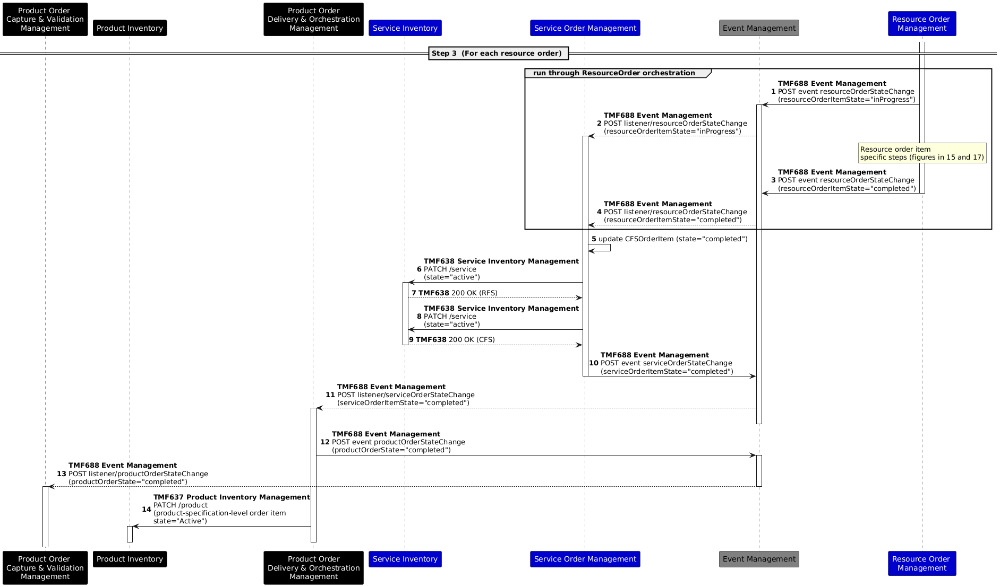

**Figure 14: Step 3 sequence diagram for a resource order**

Notes:

- As stated in the "Order lifecycle" section, each order management component might implement additional business logic before transitioning an order to the state "completed".

- After completion of the service-related resource orders, the service inventory is updated, and the core commerce components are notified.

Step 3: CFS Order Processing for Base Scenario

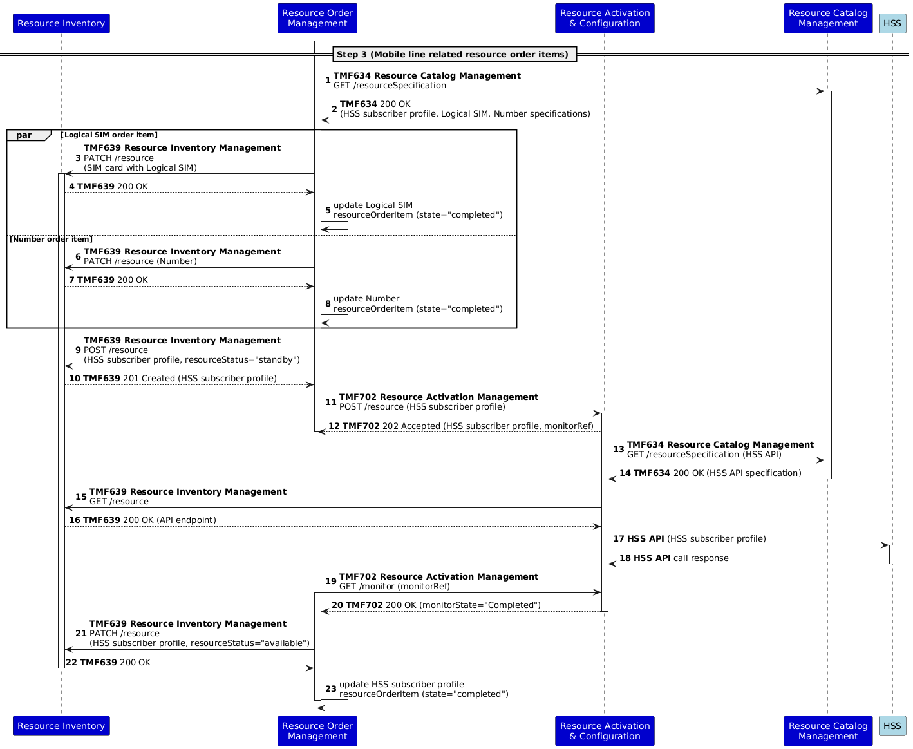

**Figure 15: Completion of the HSS subscriber profile resource order item**

Notes:

- This use case proposes the separation of Resource Activation and Configuration from Resource Order Management. This Resource Activation and Configuration component exposes the resource activation and configuration API (TMF702), which is currently in beta release. In previous versions of this use case (e.g., v1 published as part of IG1228v5.0.0), resource activation was modeled as a functionality of the Resource Order Management component. The reader should hence be aware that such a separation is still the subject of debate within the ODA project and that subsequent versions of this use case might evolve on this aspect. The need for activation components is also a topic discussed in the ODA Technical and Components Project, especially in the context of cloud native networks. The Resource Activation and Configuration is proposed in [ TAC-280](https://projects.tmforum.org/jira/browse/TAC-280?src=confmacro) - Create and Publish: TMFCxxx: Service & Resource Orchestration v1.0.0 ** in progress **  and referenced as TMFC062 in the TAC project.

- We have introduced network components (HSS, PCRF, and VMS) that represent the network systems and that participate in the completion of the resource order. Likely, the API(s) on those systems are not compliant with TMF standards. We make the assumption that the Resource Activation and Configuration component is able to build this API call via information managed in the resource catalogue and inventory. In case such a system would present a TMF-compliant interface (such as TMF702), it could be functionally subsumed by the ODA stack (as a resource activation function).

- We use the asynchronous capability of TMF702 (Resource Activation Management API), by analogy with the asynchronous capability of TMF640 (Service Activation Management API). However, the current (beta) swagger of TMF702 does not (yet) allow it, and the extension is proposed in [ AP-4055](https://projects.tmforum.org/jira/browse/AP-4055?src=confmacro) - Support asynchronous response in TMF702 ** done **. The diagram only indicates the TMF702 GET /monitor call that returns a final monitor state (InError or Completed) and does not indicate the calls that return the InProgress state. The same applies to all downstream sequence diagrams that use the asynchronous capability of TMF702.

- For the HSS profile status values, the resourceStatus field of TMF639 is used. The status is set to "standby" prior to activation and "available" after activation.

The completion of the Bucket and Voice mail-related resource order items follows the same pattern. They do not introduce new insights or requirements with respect to the involved components (without prejudice to what is said above about separation between order management and activation).

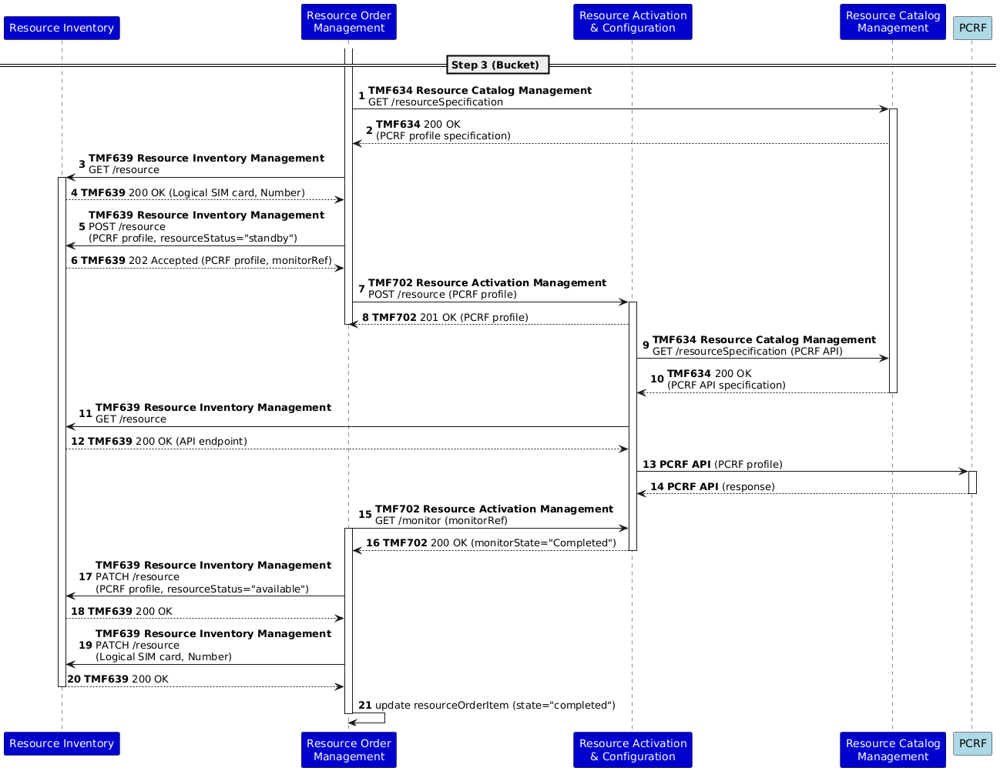

**Figure 16: Completion of the resource order item related to the Bucket RFS**

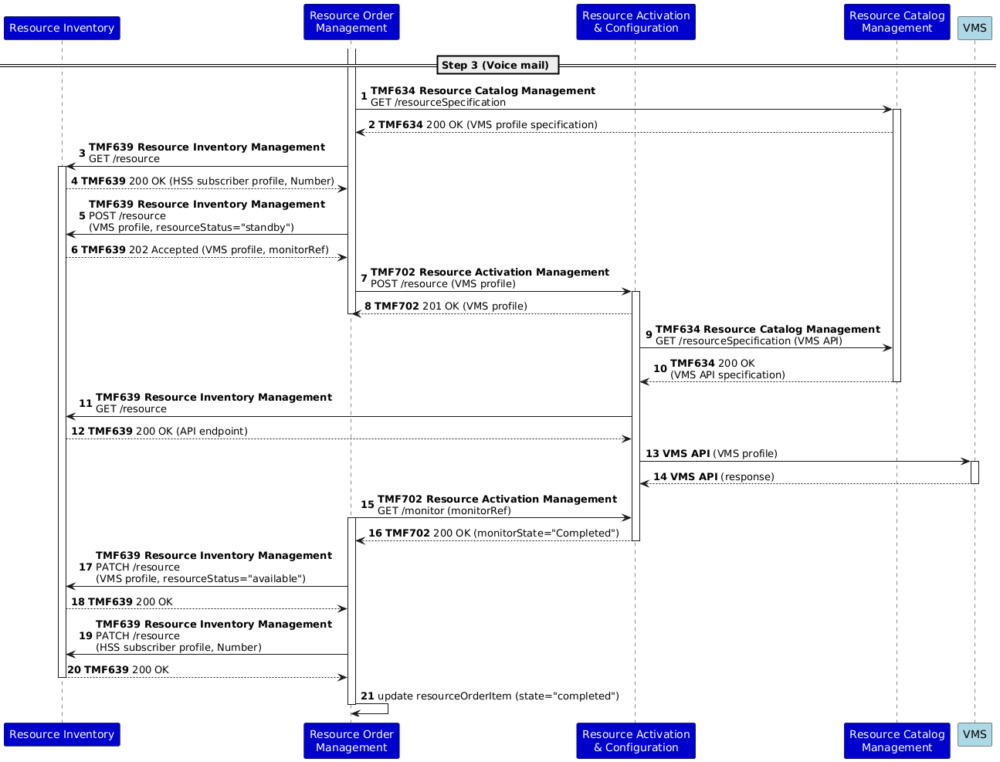

**Figure 17: Completion of the resource order item related to the Voice Mail RFS**

Step 3: CFS Order Processing for Extended Scenario

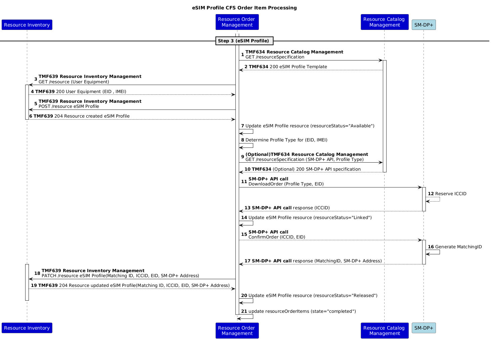

**Figure 18: eSIM Profile CFS Order Item Processing **

Note : 

- The procedure follows the GSMA SGP.22 Specification, Clause 3.1.1 - Download Preparation Process.  Download preparation involves provisioning of subscription management and other operator BSS systems for allocation of eSIM Profile based on an Order. 

- It is assumed that the User equipment details, such as EID and IMEI, are preloaded in inventory before the eSIM Profile provisioning.  Optionally, ICCID can be retrieved if the customer has a pre-allocated eSIM Profile or subscription information (i.e., a device change) 

- An eSIM compatible device has a component embedded universally integrated circuit card (eUICC) with a remote provisioning function, that is uniquely identified by an identifier EID (eUICC ID). eUICC provides the capability to store multiple network profiles (eSIM Profiles) that can be provisioned and managed over-the-air

-  Each eSIM Profile downloaded to the eUICC is uniquely identified through an Integrated Circuit Card Identification Number (ICCID). Additionally, the profile may contain additional information used for communication, such as MSISDN, IMSI, Authentication Key, etc. 

- In general, IMEI uniquely identifies the user equipment, EID uniquely identifies the eUICC associated with the user equipment, and ICCID identifies a eSIM Profile.

- eSIM Subscription Management component SM-DP+ (Subscription Management Data Preparation) manages the eSIM Profile. 

- Steps 7 & 8 in the sequence diagram above are optional. In the case where the API Specification is not maintained in the Resource Catalog Management, it is assumed that respective API level integration with SM-DP+ is done through a predefined configuration in the Resource Order Management

- The process of eSIM Profile allocation starts with an API call to SM-DP+ with EID and Profile Type. Optionally, ICCID can be provided if the customer has a pre-existing profile. The profile type is Operator-specific, a defined type of Profile.  

- In response to the allocation request, ICCID is reserved, and once the allocation is confirmed by the Resource Order Management EID, ICCID is linked and updated in the Resource Inventory.  The procedure does not show MSISDN and IMSI association with the eSIM profile, as these are implementation-specific. 

- Once the eSIM Profile allocation is confirmed (ConfirmOrder), SM-DP+ generates a unique matching ID associated with the eSIM Profile that can be used along with the SM-DP+ address as a reference for downloading the profile to user equipment. 

- The sequence above does not show the eSIM Profile download and activation process. These steps are subjective based on the particular implementation of the subscription management process by the operator - i.e., based on a QR code scanning or workflow involving interaction with the Party Management components. In general, given the matching ID and SM-DP+ Address (or EID and SM-DP+ Address), the customer may initiate eSIM Profile download, and once completed, SM-DP+ notifies the Production/Core Commerce component about the completion of eSIM Profile. Based on the notification, the eSIM Profile is activated, and the state in the resource inventory is updated.  

- The resource status in the diagram follows the recommended states as per the GSMA SGP.22 Specification (as maintained by SM-DP+), which can be mapped to the Resource Inventory level state (available, standby, etc.) 

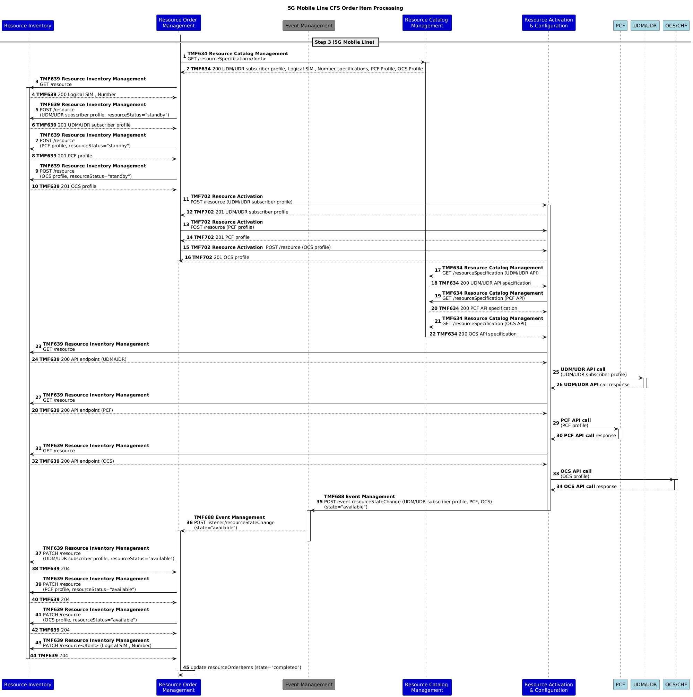

**Figure 19: 5G Mobile Line CFS Order Item Processing **

Note : 

- The sequence diagram shows only the 5G Mobile line provisioning.  

- As described in the Overview above, in practical deployments, 5G Mobile line service co-exists with 4G Mobile line to support the coverage gaps in 5G.  But the extended scenario focuses on a case of 5G alone - indicating a SA mode of 5G deployment. For addressing the practical requirement of filling coverage gaps, it is advised to look at base and extended scenarios is unison or to extend the scenario further with the roaming provisioning.

- The Logical SIM and Number entities in the Resource inventory are populated based on the updates associated with the eSIM Profile. 

- UDM/UDR and PCF Profiles are associated with the eSIM Profile details, as well as Logical SIM and Number 

- It is the implementation decision to choose between an existing OCS functionality deployed by the Operator, or the 3GPP-recommended Converged Charging Function (CHF). In the case of OCS, a corresponding OCS profile should be created, and similarly, a profile will be created for CHF as recommended by 3GPP. (Given the complexity of OCS/CHF discussion (ODA or network component), it is delayed until the next Sprint. 

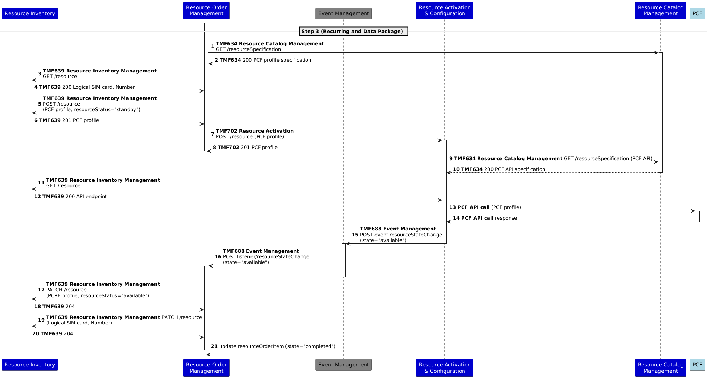

**Figure 20: ** **Recurring Package & Data Package CFS Order Item Processing**

Notes:

- For recurring and data package order items, the PCF Profile is updated to include the specific subscription and the quota allocated, which can be monitored at the time of service usage

- Further, the Logical SIM and Number, PCF profile details, and the required associations are modified through the PATCH operation on the Resource Inventory.

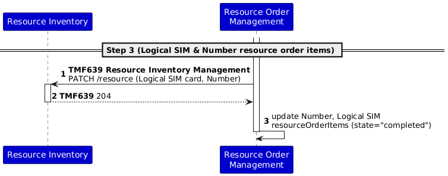

**Figure 21: Completion of the Logical SIM & Number resource order items**

Notes:

- As the Logical SIM and Number resource order item actions consist of "modify" actions, the completion of the resource order items merely consists of inventory updates.

**Voice Mail CFS Order Item Processing **described in Figure 17: Completion of the resource order item related to the Voice Mail RFS.

### Asynchronous APIs within an Event Driven Architecture (EDA)

In the previous sections of this document, we presented scenario diagrams where communications between components follow a hybrid approach, combining both synchronous and asynchronous interactions. Standard operations—such as creating, deleting, modifying, and querying resources via Open APIs—adhere to the classic Request-Response model through REST interfaces. Furthermore, any operations involving resources managed by a component are published as events. These events enable asynchronous communication in scenarios where synchronous handling is impractical due to complexity, such as the full lifecycle management of a service order.

In this section, we present an alternative scenario diagram for service order initiation (Figure 22), leveraging a fully event-driven architecture (EDA) to enable complete decoupling of components. In this paradigm, all communications between components are orchestrated by an event manager. Using the TMF688 API, this event manager handles the publication of requests, responses, and notifications to topics that can be consumed by any interested components.

To achieve this, a set of criteria for naming these topics has been defined, which all components must adhere to:

- Request messages that would typically be handled via POST, GET, PATCH, and DELETE operations will now be published to topics using the following format:

**[*prefix*].[*openapi_name*].[*openapi_version*].[*operation_name_resource_name*].commandRequest**

For instance:

- **[*prefix*].resourceCatalogManagement.v1.retrieveResourceSpecification.commandRequest** will be used to query the ResourceSpecification resource via the TMF634 ResourceCatalogManagement API. This is equivalent to the classic operation of a GET /resourceSpecification/id.

- **[*prefix*].resourceOrderManagement.v1.createResourceOrder.commandRequest** will be used to create a new resource order via the TMF652 Resource Order Management API.

The operations equivalent to the REST methods mentioned above are as follows:

- retrieve (GET).

- create (POST).

- patch (PATCH).

- delete (DELETE)

Note that the ***openapi_version*** refers to the specific production implementation of the API, not the version of the OpenAPI specification published by TM Forum.

- Responses to the aforementioned requests will be published to topics following a similar structure as the requests, but with 'Request' replaced by 'Reply':

**[*prefix*].[*openapi_name*].[*openapi_version*].[*operation_name_resource_name*].commandReply**

The topics for the responses to the two example requests mentioned earlier would be:

- **[*prefix*].resourceCatalogManagement.v1.retrieveResourceSpecification.commandReply**

- **[*prefix*].resourceOrderManagement.v1.createResourceOrder.commandReply**

- For notifications, topics will follow the structure below:

**[*prefix*].[*openapi_name*].[*openapi_version*].[*resource_name*].notificationEvent**

For instance:

- **[*prefix*].resourceCatalogManagement.v1.resourceSpecification.notificationEvent**

- **[*prefix*].resourceOrderManagement.v1.resourceOrder.notificationEvent**

In the entities specification of the asynchronous version of the Open APIs, the topicRef field has been added alongside the href field. It will contain the reference to the topic from which the entity can be fetched.

Service order initiation using asynchronous APIs

Following the previously established criteria, the diagram below illustrates the use of asynchronous APIs in one of the business scenarios outlined in this use case.

In this diagram, we will see how the components TMFC003 Product Order Delivery Orchestration & Management, TMFC007 Service Order Management, TMFC008 Service Inventory, and TMFC006 Service Catalog interact through events to launch and execute the initial steps of a service order. All message traffic is managed by the Event Management platform component via the TMF688 Event Management API:

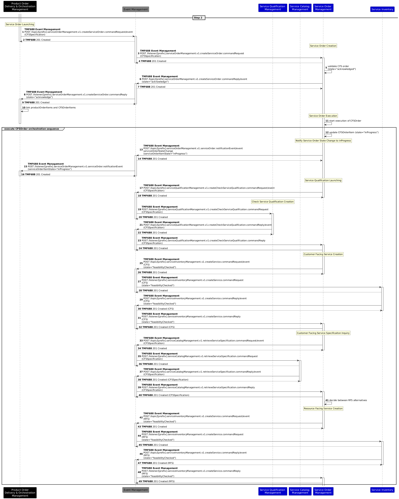

**Figure 22: Service order initiation using asynchronous APIs**

## ODA Component & Canvas Interaction Diagram

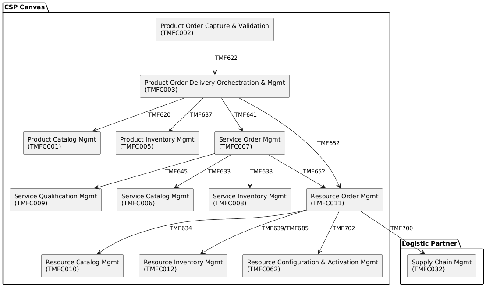

**Figure 23: ODA Component diagram**

# Conclusion

## Lessons learned

The main conclusion that can be drawn from the development of this use case is that there do not have to be fundamental differences in the order management process for mobile services implemented with 4G and 5G technologies, at least at the product and service levels. The only differences are found in the resource layer, where different network elements must be activated and configured.

In essence, the use of a catalog-driven order management approach, along with a proper catalog configuration, makes it possible that the introduction of new technologies does not necessarily imply massive changes in the order capture, validation, and decomposition processes. In this way, only the implementation of adequate management of the new resources introduced is necessary.

We have seen how the use of asynchronous APIs enables the implementation of the use case following an event-driven architecture, orchestrated by platform components through the use of Open APIs. However, despite the availability of asynchronous versions for several TM Forum Open APIs, there are still several unresolved questions:

- How should ODA components manage the process of creating and registering for different topics within the infrastructure, both as providers and consumers?

- How can we prevent components from being overloaded by processing events they do not need to handle?

- Where is the logic that determines which component should handle and respond to a request, especially when multiple components of the same type coexist within the infrastructure?

- What information should be included in the topic naming prefix, and how is it utilized?

In summary, there is a general lack of documentation that clarifies these aspects, which could apply to any API.

Additionally:

- While 4G and 5G scenarios are shown distinctly for clarity of flows, in a practical scenario, the implementation may use common ODA components and common Core network functions 

- One particular variation of eSIM activation is shown in the scenarios above. In practical cases, there can be more variations depending on the business case of the operator and the maturity of the internal management functions. 

- Currently, the eSIM Profile details are assumed in the Resource inventory, but in real implementation, alternate systems may be used to store such details  -for example, an Asset Management solution or a 5G EIR function. A similar case is with the User Equipment delivered to the customer as a bundled offering. 

- In a 5G scenario, provisioning of PCF may also involve subscription to the Slices, value-added services, etc., and activation of policies corresponding to the customer profile. The specific steps are detailed in the 3GPP specifications referred to above. 

## Impacts identified

- Translation of product characteristics to service and resource characteristics addressed in step 2 (Figure 13): [[AP-1444] Need mapping between characteristics (and values) in PSR catalogs - TM Forum JIRA](https://projects.tmforum.org/jira/browse/AP-1444)

- Reference to service qualification addressed in step 2 (Figure 13): [[AP-2477] Extend TMF641 to include references to ServiceQualification items - TM Forum JIRA](https://projects.tmforum.org/jira/browse/AP-2477)

- Extension of use case in change order management will require extension of service inventory API : [[AP-2832] TMF API needed to support Resource Order Calculation - TM Forum JIRA](https://projects.tmforum.org/jira/browse/AP-2832)

- Need for components for service and resource activation: [[TAC-280] Service & Resource Orchestration - TM Forum JIRA](https://projects.tmforum.org/jira/browse/TAC-280)

- [ AP-4055](https://projects.tmforum.org/jira/browse/AP-4055?src=confmacro) - Support asynchronous response in TMF702 ** done **

- [[ISA-905] Add a relationship between CFS Spec and Resource Spec - TM Forum Jira](https://projects.tmforum.org/jira/browse/ISA-905)

- General design guidelines for asynchronous APIs are currently missing [ AP-6190](https://projects.tmforum.org/jira/browse/AP-6190?src=confmacro) - Design guidelines for Asynchronous APIs ** backlog **

