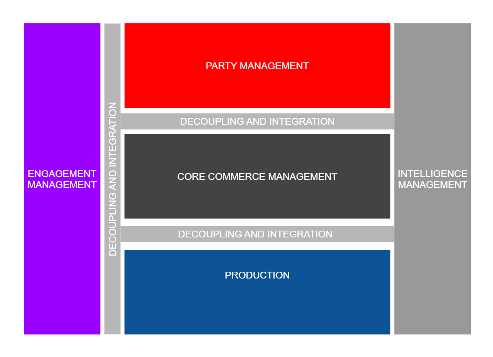
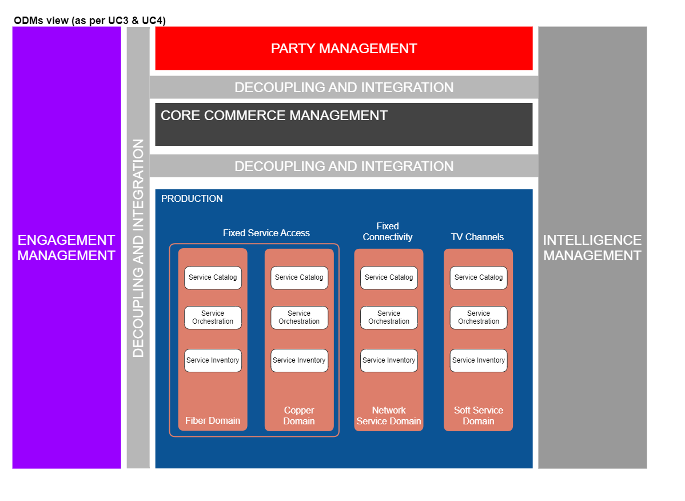
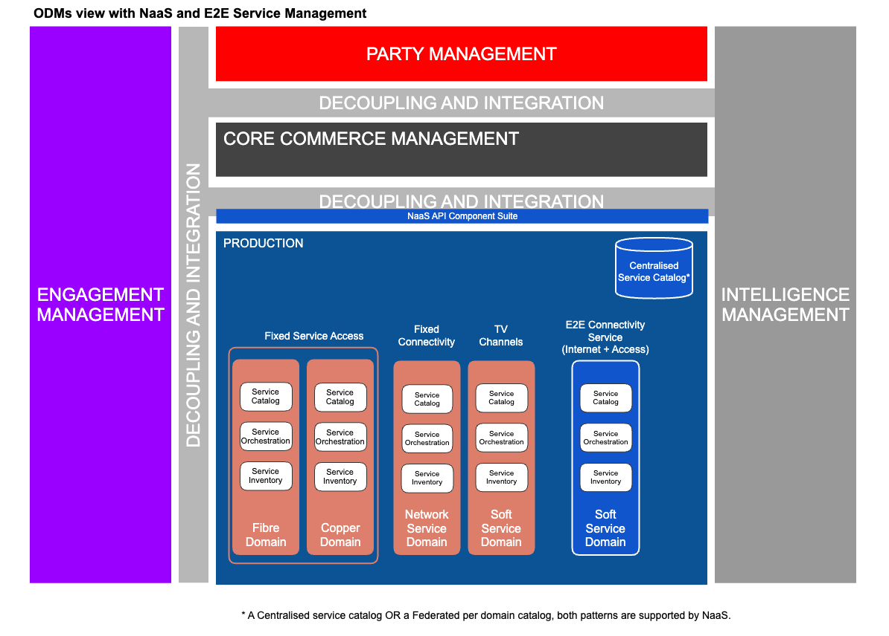
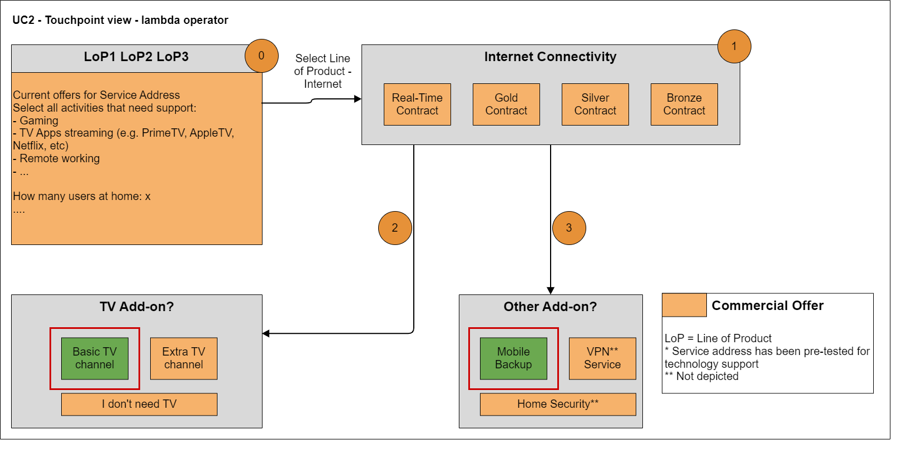
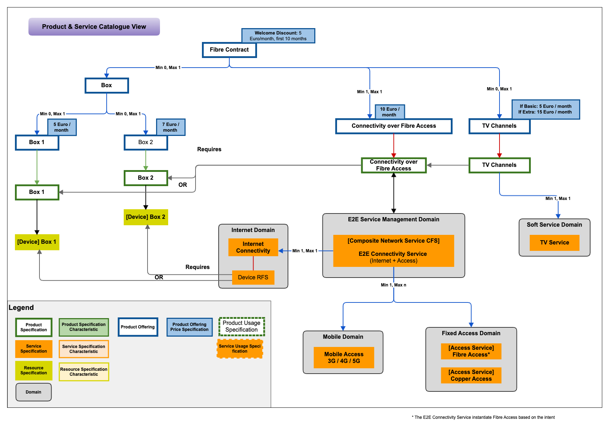
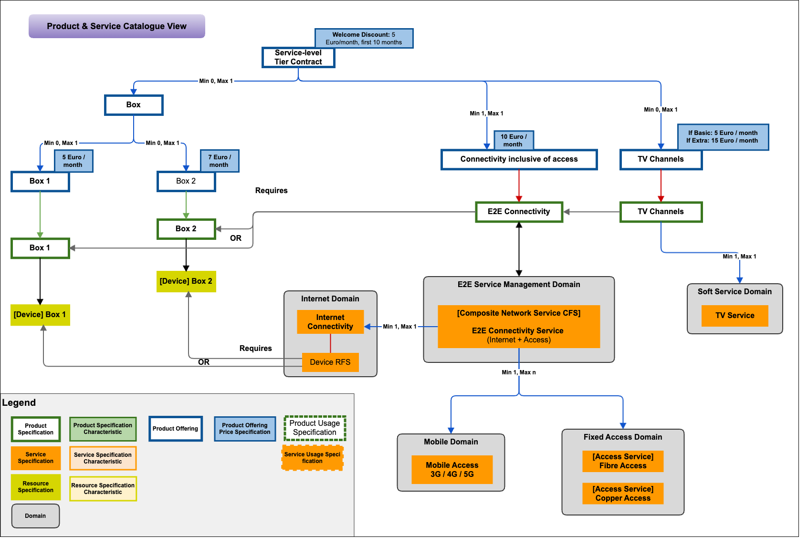
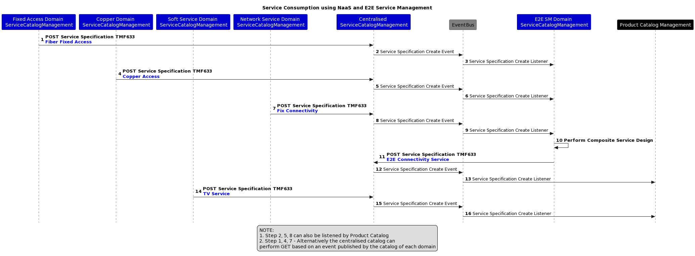
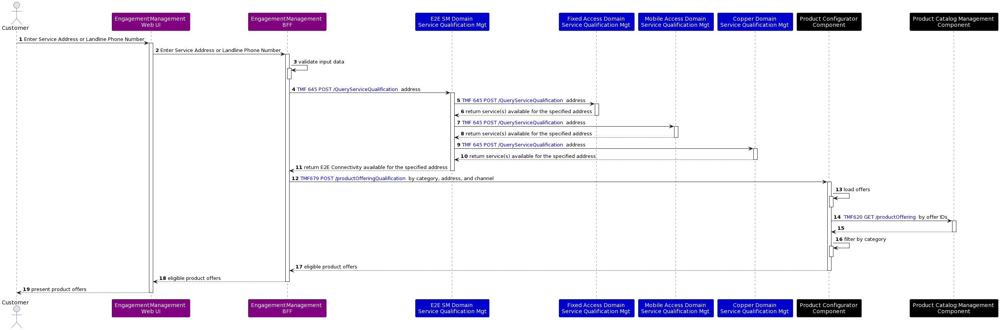
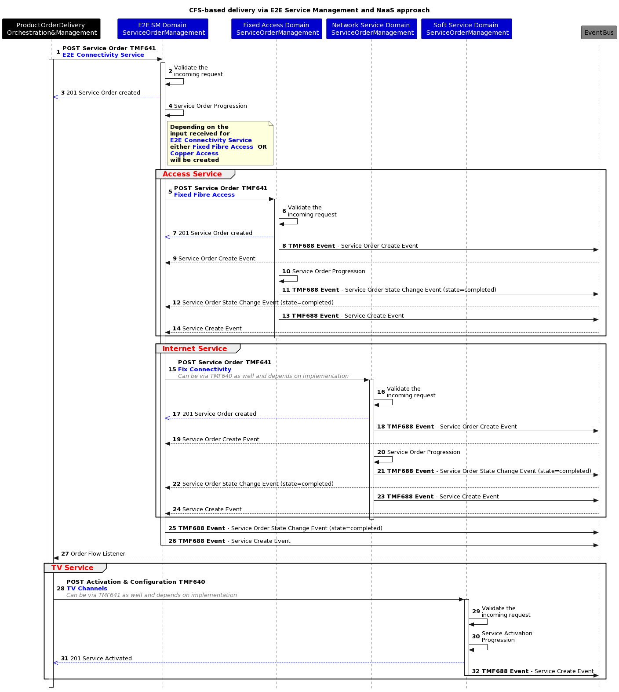

# List of Figures

Figure 1: Open Digital Architecture Functional Architecture	6

Figure 2: Production functional Block with ODM	8

Figure 3: Comparison of Production functional block without and with NaaS	10

Figure 4: Example of CSP intent request for technology-agnostic product offering	11

Figure 5: Product and service catalogue view supporting technology-focused product offerings	12

Figure 6: Product and service catalogue view supporting technology agnostic product offerings	13

Figure 7: Sequence diagram showing the creation journey of "E2E Connectivity Service" composite service	14

Figure 8: Sequence diagram showing the service qualification check at the requested address	15

Figure 9: Sequence diagram showing the Service Order Delivery via E2E SM and NaaS approach	16

# Introduction

## Context or Background

The TM Forum's Open Digital Architecture has been designed to enable members to build highly complex, but very flexible solutions by using sets of loosely coupled components, that expose their business functionality via a set of industry agreed Open APIs.

This use case proposes that every production group (e.g., Transport, IP, access, media, etc.) exposes and manages service capabilities (i.e., Network as a Service) in the Open Digital Architecture (ODA) from the Production function block to other ODA functional blocks *(such as Core Commerce Management, Intelligence Management)* via the decoupling and integration function block (i.e., APIs and API gateway) to allow for zero touch automation.

Figure 1: Open Digital Architecture Functional Architecture

## Objective of the use case

**NaaS** simplifies the Networks to IT Communication and is fundamental to network of the future.  Today most OSSs and BSSs need to understand how the underlying network works and how each product is designed down to each resource used, which makes change costly, manual, and slow. In this ODA Functional Architecture, traditional Business Support Systems would be in the Core Commerce Management and in the party management functional blocks managed by IT while most of the Operational Support Systems would be in the Production functional block managed by Operational Domain Management (ODM)- typically technology/network - teams. 

Today these systems are inter-connected using suppliers' custom APIs for each network domain making product additions or modifications, a large project within both IT and Network domains. As per ODA principles, NaaS enables network capabilities to be exposed as reusable services, hiding "How" (typically resource level) the capabilities are defined and using standards Open APIs, agnostic of technology and vendor.

NaaS is changing the current lengthy processes used from idea to product delivery and maintenance leading to shortened time to market and enhanced customer experience. For best practices around NaaS, refer to [IG1224 NaaS Service Fulfillment](https://www.tmforum.org/resources/reference/ig1224-naas-service-fulfillment-guidelines-v3-0-0/)[ Guidelines](https://www.tmforum.org/resources/reference/ig1224-naas-service-fulfillment-guidelines-v3-0-0/).

## Scope, assumptions, and considerations

### Scope

The purpose of this document is to demonstrate the benefits and agility brought by NaaS and its E2E Service Management in ODA Production block and how it simplifies the design, fulfillment, and assurance on the original Internet product with Fiber use case TMSF003 and TMSF004. 

### Assumptions

This use case does not intend to describe how to perform a NaaS Transformation or what domains are needed in order to support NaaS. It focuses on the comparison between traditional and NaaS abstraction processes, architecture and separation of concerns.  

# Description

## Internet Product with Fiber using NaaS

The purpose of this document is to demonstrate the benefits and agility brought by NaaS and its E2E Service Management in ODA Production block and how it simplifies the design, fulfillment, and assurance on the Internet product with Fiber use case TMSF003 and TMSF004. The original IG1228 TMSF003 and TMSF004 use cases used ODMs from Production block namely the Access, Network Service and Soft Service Domains. Below diagram shows the change in landscape of Production block with introduction of NaaS and E2E Service Management Domain.

| Production block as per TMSF003 & TMSF004 | Production block with introduction of NaaS and E2E Service Management Domain |
| --- | --- |
|   |   |

Figure 3: Comparison of Production functional block without and with NaaS

The role of E2E Service Management Domain and NaaS are documented in [IG1224 NaaS Service Fulfillment](https://www.tmforum.org/resources/reference/ig1224-naas-service-fulfillment-guidelines-v3-0-0/)[ Guidelines](https://www.tmforum.org/resources/reference/ig1224-naas-service-fulfillment-guidelines-v3-0-0/).

## Modularization & Abstraction using NaaS & its E2E SM 

A simplified, modularized and abstracted** Composite Service** (E2E Connectivity Service CFS) is designed using E2E Service Management Domain, by composing the services offered by each domain. The introduction of this **Composite Service **in the Production Domain abstracts away all the orchestration complexities (including network dependencies) and simplifies the overall provisioning. Also, post activation, the E2E service management domain is also responsible for all the other life cycle functions such as assurance. A detailed view of revised service models and the consumption by product models are shown in the sections below.

## Screen Flows

Having the E2E SM Domain hiding the technology complexity, CSPs can move away from selling technology to selling Product offers agnostic of technology. This helps CSPs migrating technologies, using 3rd parties or even start with one technology available (e.g. Mobile) and change it later when, for example Fixed access is available; providing another way to differentiate. Refer to the example below where the current offers have been dynamically generated according to the technologies available returned by the E2E SM Domain for the requested address (or landline phone number).

Figure 4: Example of CSP intent request for technology-agnostic product offering

# Information View

## Service Exposure for Technology Focused Product Models

Below is the service model with technology agnostic service specifications supporting Technology-focused Products. The E2E Connectivity Service CFS contains information from every Access technology domain available, the Network Service domain and the mobile domain (which can be possibly used as a backup service). The product specification "Connectivity over Fibre Access" will instantiate the E2E Connectivity Service with its choice of Fibre technology as per the Product offering sold to the customer.

Figure 5: Product and service catalogue view supporting technology-focused product offerings  

## Service Exposure for Technology Agnostic Product Models

Below is the service model with technology agnostic service offerings supporting non-technology focused Products. The same E2E Connectivity Service CFS as above is used but this time Product Offers are not tied to technologies. Product specifications can still be created for access, connectivity and TV channels if these can be sold individually or as Add-On or can be combined in one product specification. The right technology to deliver the customer intent will be determined by the E2E Connectivity Service.

Figure 6: Product and service catalogue view supporting technology agnostic product offerings

# Sequence diagrams

## Service Specification Design (Sequence Diagrams)

Each domain designs its own services such as "Copper Access" CFS specification (CFSS), "Fiber Fixed Access" CFSS, "TV Service" CFSS, "3rd Party Access" CFSS, "Mobile Access" CFSS, etc. While each of these CFSSs can be exposed to the product catalog in an individual fashion, the E2E SM domain within NaaS, brings the capability to compose these CFSSs into a comprehensive E2E service across domains, and only expose the comprehensive service specification to the product catalog. Benefits of using the E2E SM Domain is the support for the complete service lifecycle within that overarching E2E domain including closed loop automation and autonomous network capability. Doing the composition not only for fulfillment but assurance at the Product level with siloed network domains sending their individual alarms and events in their own format would need network experts in CCM and would be a lot more complex for cross-domain services.

Services once designed are published to NaaS Catalog for exposure to other domains and product catalog for the non-internal services. Composite services are created in E2E Service Management domain by composing various NaaS services, in this example "E2E Connectivity Service". The E2E SM can compose any type of cross-domain services reusing atomic services exposed from each domain. Each domain is responsible for providing E2E lifecycle management for their services and the E2E SM provides the complete lifecycle management with closed-loop support across domains in real-time.

The below sequence diagram shows the creation journey of "E2E Connectivity Service" composite service.

 

Figure 7: Sequence diagram showing the creation journey of "E2E Connectivity Service" composite service

## API call flows

 

Figure 8: Sequence diagram showing the service qualification check at the requested address

**Service Order Delivery via E2E SM and NaaS approach**

The below sequence diagram explains the service order delivery with NaaS approach. The CCM will perform the Order Capture first with the requested Products and the Product Order Delivery Orchestration & Management subsequently send a service order to activate connected "Add-On" with necessary parameters to E2E Service Management Domain.

 

Figure 9: Sequence diagram showing the Service Order Delivery via E2E SM and NaaS approach

# Conclusion

## Lessons learned

- NaaS and E2E Service Management in ODA Production block brings agility and simplifies the design, fulfillment, and assurance of the services.

- NaaS allows product specifications to evolve independently without any dependency on service layer from ODA Production block.

