# Introduction

## Context or Background

The Product Catalog Management is a major ODA component. It implements a very rich and powerful information model, able to drive customer oriented business processes such as order capture and delivery orchestration.

So it is important to describe how this Product Catalog can be initialized and updated, and to illustrate the links it has with the Service Catalog (or Resource Catalog in some cases) as they will permit an easy articulation between order capture and delivery processes.

## Objective of the use case

The objective of this use case is to illustrate Product Catalog Management common operations such as the design, test and commercial launch of a new offer (Product Offering), with the different steps needed and actors involved.

It will also illustrate the reuse of different elements of the Product Catalog as building blocks, for example how several offers (Product Offering) can market the same product (Product Specification) with different conditions or prices.

As this use case includes manual tasks and front-end interactions, it permits to illustrate the decoupling between front-end and process layers, as recommended in ODA Functional Architecture.

It also illustrates the publication of events related to each information creation or update in the Product Catalog or Service Catalog.

## Scope and assumptions

### Scope

For release v1/v2 :

- We create a new product (Product Specification) based on a new designed service (Customer Facing Service Specification or CFS Specification)

- We create a new offer (Product Offering) to market this new product (Product Specification), and a new pricing rule (Product Offering Price) for a recurring charge

- We test the order capture and delivery of the new offer (Product Offering) 

- We launch it to the market

In future releases we could extend to:

- reuse of a product in several offers description (Product Offering)

- cretaion of several intangible products based on the same service description (CFS specification)

- creation of a tangible product (or good product) based on stock items described in the Resource Catalog

- bundled offers management use case - and reuse of an offer in several bundled offers

- onboarding of partner products and offers

- modification of an 'active' offer (leveraging version management)

- impacts of the modification of an existing service description on the related products

- manage end of selling

- add catalog federation use case

- catalog publication

- catalog entities deprecation

- leverage existing Test API (704-709)

### Assumption

The use case is based on a macro-processus description presented in chapter 3, and on information lifecycles presented in chapter 4.

It involves actors with roles such as Marketer, Technical Expert and Catalog Administrator, using a Product Catalog Management front-end, with different possible actions (or rights). This is entirely configurable, according to each company organisation.

As this use case includes manual tasks and front-end interactions, we choose to leverage TMF701 Process Flow API to manage them. 

# Description

This macro process represents the end to end use case and the steps described by sequence diagrams in chapter 5.

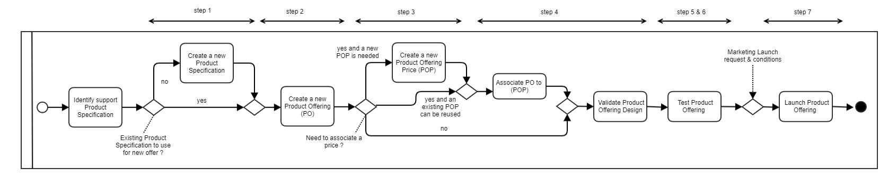

# Information View

## Lifecycles

As lifecycles are not provided in SID or in TMF620 Product Catalog Management API, we use following lifecycle state engine for illustration. This is informative and **not normative** information.

### Product Specification Lifecycle

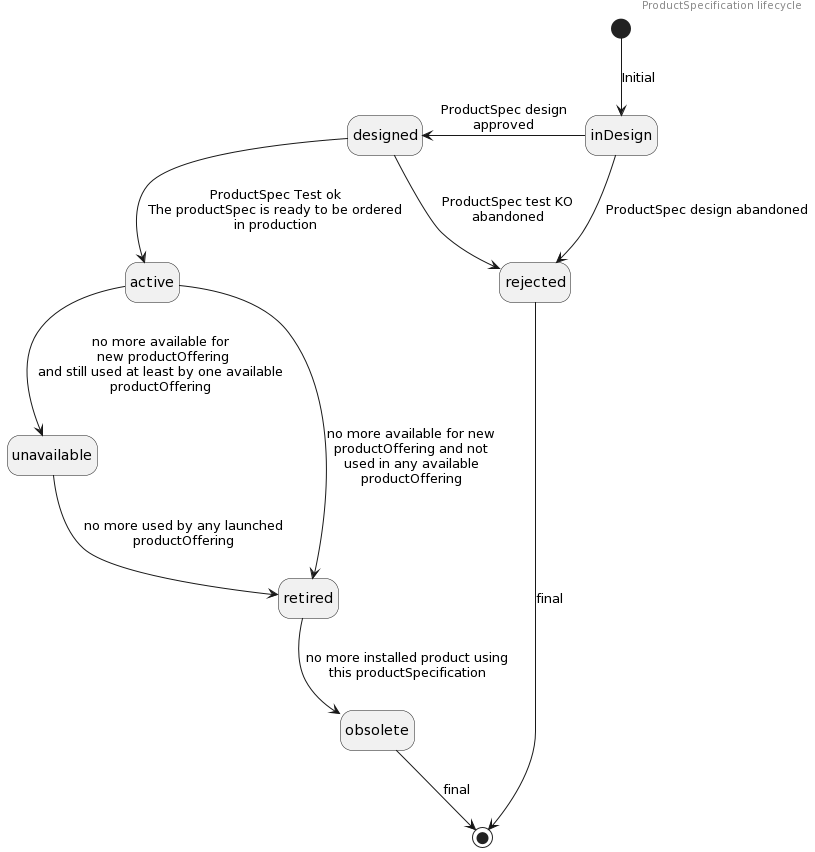

### Product Offering Lifecycle

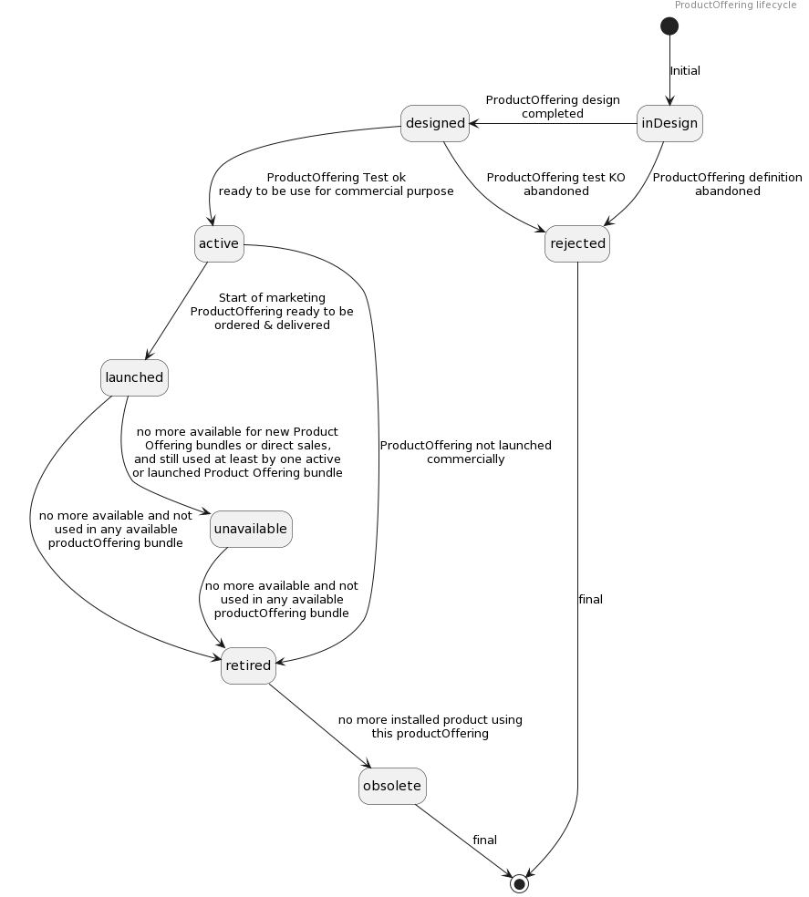

### Product Offering Price Lifecycle

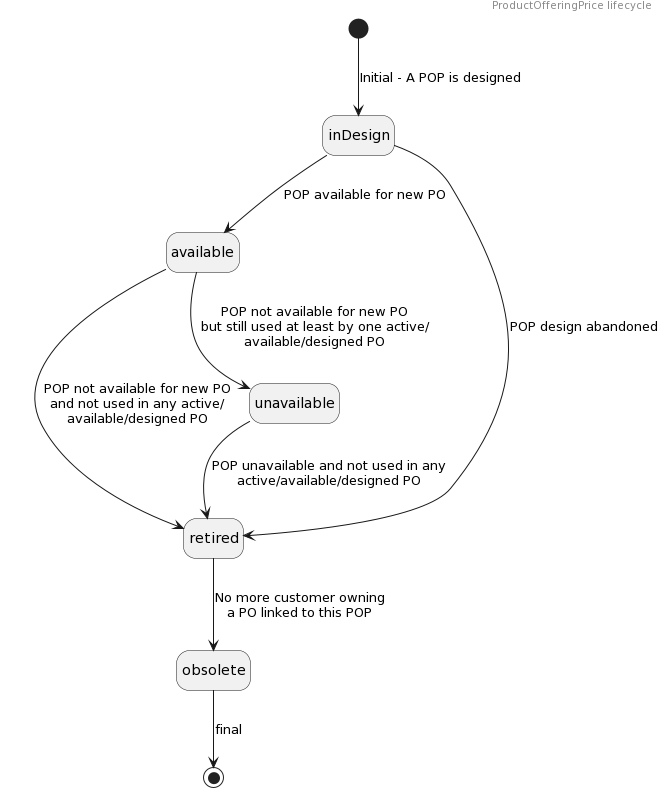

# Sequence diagrams

## Step 1: Create a Product Specification derived from a new CFS (Customer Facing Service) Specification

In this first diagram we illustrate:

- A new service description (CFS Specification) is available in the Service Catalog, and so ready to be used as support for new products specifications definition. Product Catalog application (and product catalog user as the techical expert in charge of product specification design) could receive notification about this CFS Specification availability via en event. This event could provide complete CFS Specification representation or only id. This is an illustration about service catalog → product catalog synchronization.

- A new product description (Product Specification) guided creation step by step automated by a process. At each step the process checks the data, in particular the consistency between the 'root' CFS Specification and the Product Specification.

- ProductSpecification characteristicSpecification and relationship has to be checked from the CFS Specification

- We added in our example management of usageSpecification & operationSpecification - please note that currently these specifications are not fully managed in the ProductSpecification resource model in TMF620.

- at the end, the Product Specification is directly created with the "Designed" state.

Note: The update of the catalog database could be discussed. Several options could exist:

- At each step the database is updated, first with a POST and then a PATCH 

- Only when mandatory steps are completed the POST operation is completed and then PATCH (illustrated for ProductSpecification creation)

- Only when the creation is completed (or when Admin save for later) then the POST is performed. (illustrated for ProductOffering creation)

- ...

All these scenarios are valid from an API perspective, but the choice is dependent on the responsability of data. Additionnal event triggers is also a factor to pick option.

Note: We could illustrate other ways of synchronisation between the service catalog and the product catalog. As an example the receip of the event published by the service catalog could automatically trigger in the Product Catalog the creation of a new Product Specification with all the characteristics and values, operations and usages described at CFS specification level. Then restrictions could be introduced by an actor in charge of Product design.

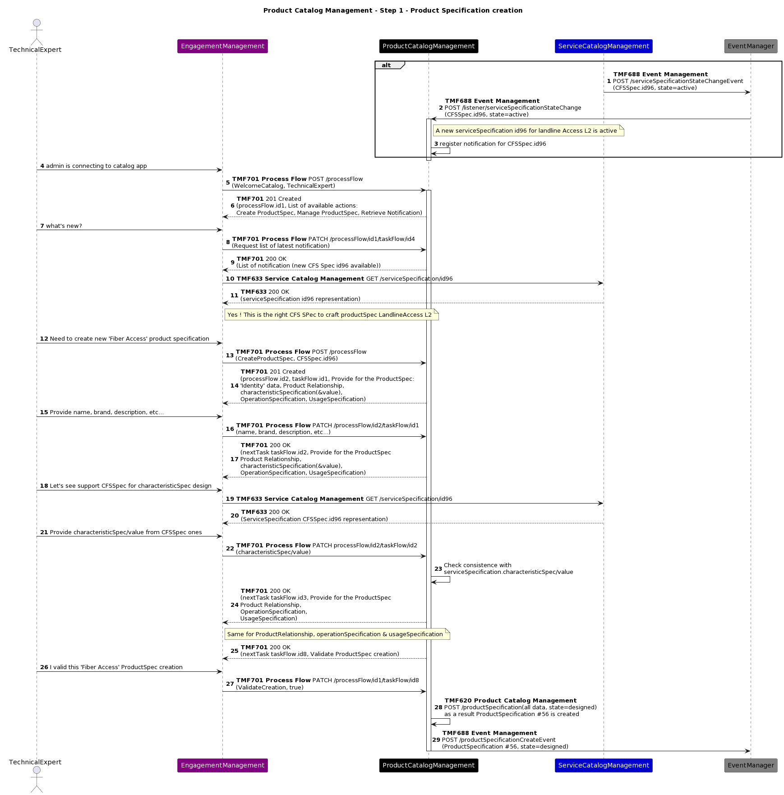

## Step 2 : Create a new Product Offering to market the Product Specification

Now that the Product Specification is ready, the marketer is able to create a new Product Offering to market it.

As for the Product Specification creation, we illustrate a process-guided creation:

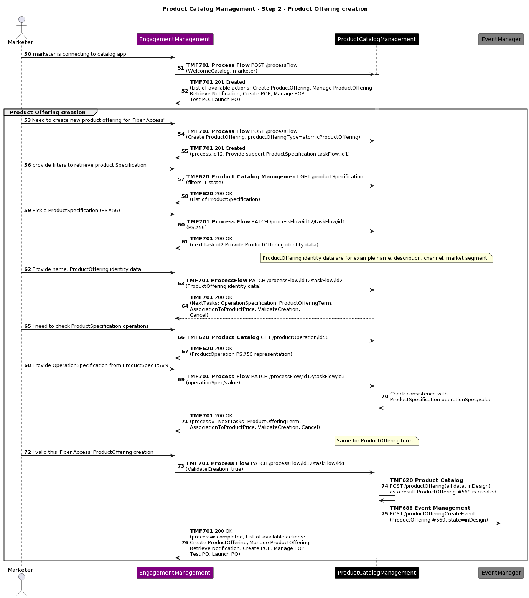

## Step 3 : Create a Product Offering Price for recurrent charge

The creation of the Product Offering Price to define recurrent fees is the next step.

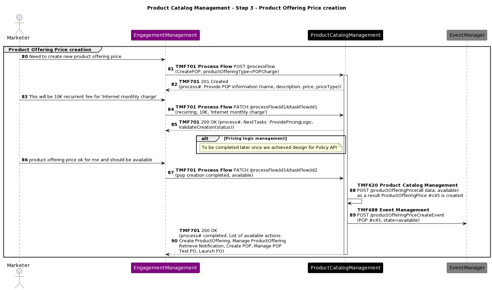

## Step 4 : Link the Product Offering Price to the Product Offering

Once the Product Offering Price is created, the marketer can link it to the Product Offering.

As the Product Offering is still "inDesign" state, it is possible to directly update it without managing versioning.

After this operation, the description of the Product Offering is completed so the marketer validate its design, and its state becomes "Designed"

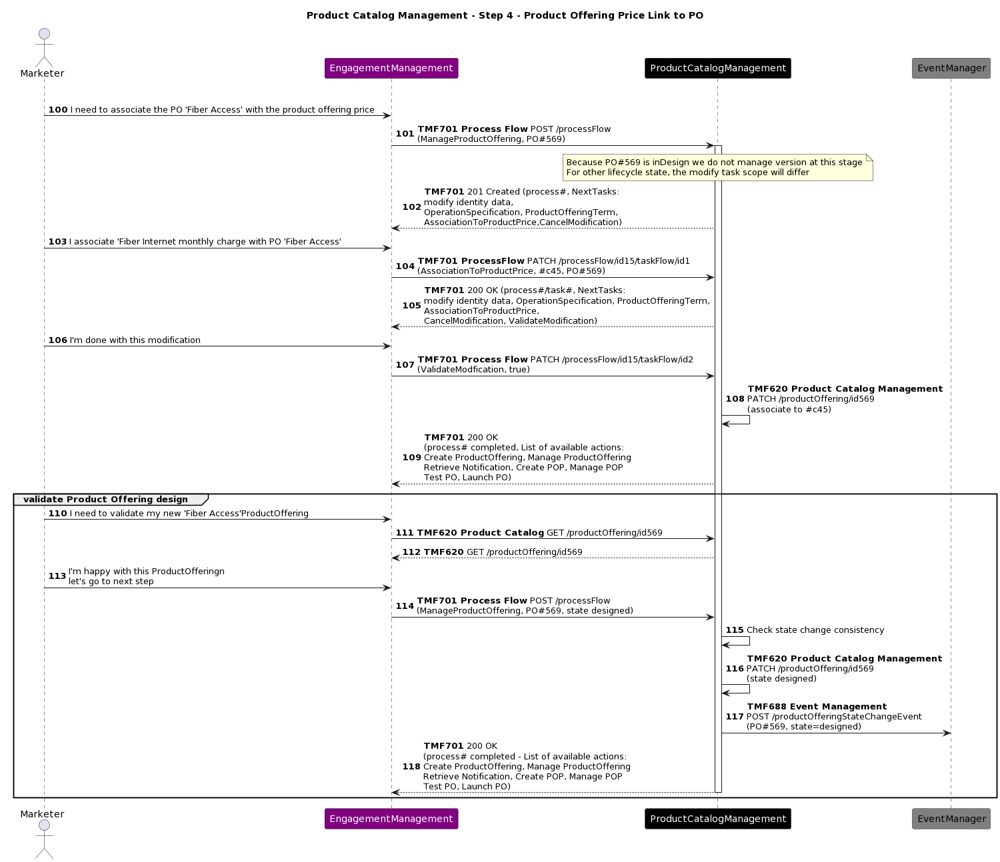

## Step 5 : Product Offering testing

Now that the Product Offering definition is completed, it should be tested before to be launched.

Note: The use of 'designed' ProductOffering on order capture/management applications needs a specific attention. Indeed, from a standard perspective a 'designed' offering cannot be visible/orderable. This test could be performed on specific IT chain (as described here).

As assumption, we consider that all tests related to the provisionning, activation and usage have been done during the Service Specification design, and are **not** required to be done again.

To be addedd: Test recurrent charge inclusion in billing & bill invoice production → This part will be described for production in future TMSF005.

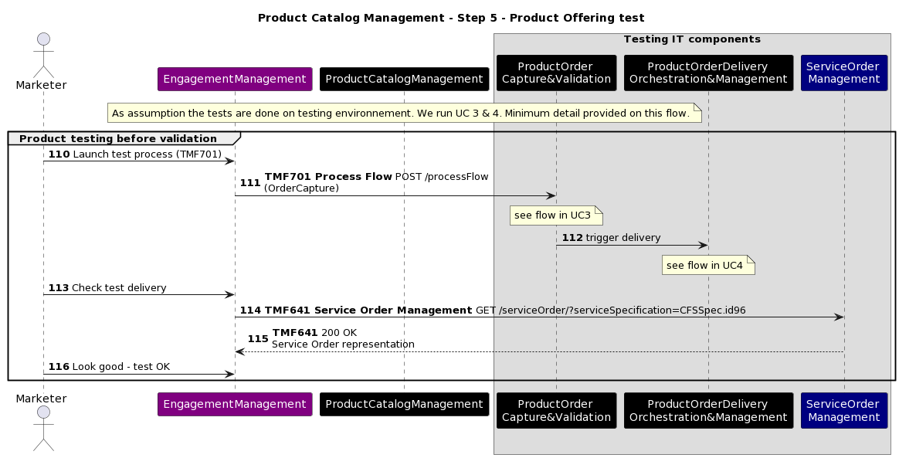

## Step 6 : New Product Specification & Product Offering 'activation'

Once the test is successful, the Product Specification and the Product Offering can be shifted to state "active"

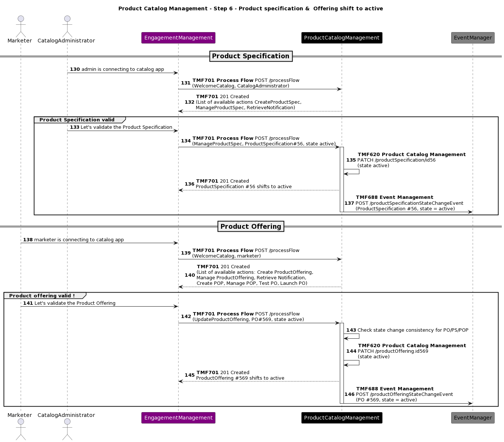

## Step 7 : Marketing launch

Now that everything is ready & running, it is up to the marketing team to launch the Product Offering.

In this example, we have a soft launch of the Product Offering in a couple of shops in Lyon.

As a result the Product Offering state is updated to "Launched"

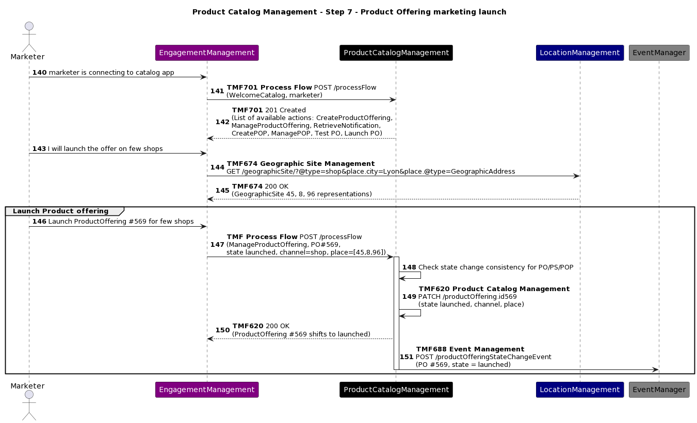

# Conclusion

## Lessons learned

This use case currently illustrates only a basic view of all that a Product Catalog Management component should cover.

At least it gives an idea about

- how Service Catalog Management and Product Catalog Management can interact

- how different actors in charge of different parts of the global process can also collaborate

- how the Product Catalog Management component can drive the GUI layer, according to the process needs

Further iterations will detail new sets of sequence diagram, and present views of catalog information produced.

## Impacts identified

[AP-2626](https://projects.tmforum.org/jira/browse/AP-2626)* - Introduce allowedAction in Product Catalog  resolved  *

[AP-2519](https://projects.tmforum.org/jira/browse/AP-2519)* - Manage operation for Catalog entities like productSpec, productOffering, etc...  close  *

*to be confirmed:*

*check if the TMF620 update at allowedAction or operation level is OK.*

*check if TMF620 published events include Product Specification State and Attribute Value Changes (not listed in TMFC001 ODA Component specification)*

*add a new Jira item to introduce Product Usage Specification in TMF620, as part of the definition of a Product Specification.*

*create a new Jira item to add lifecycles in TMF620, as proposed in §4.1*

As many APIs will be modified with the V5 transformation, sequence diagrams will need to be checked when the APIs V5 is published.

