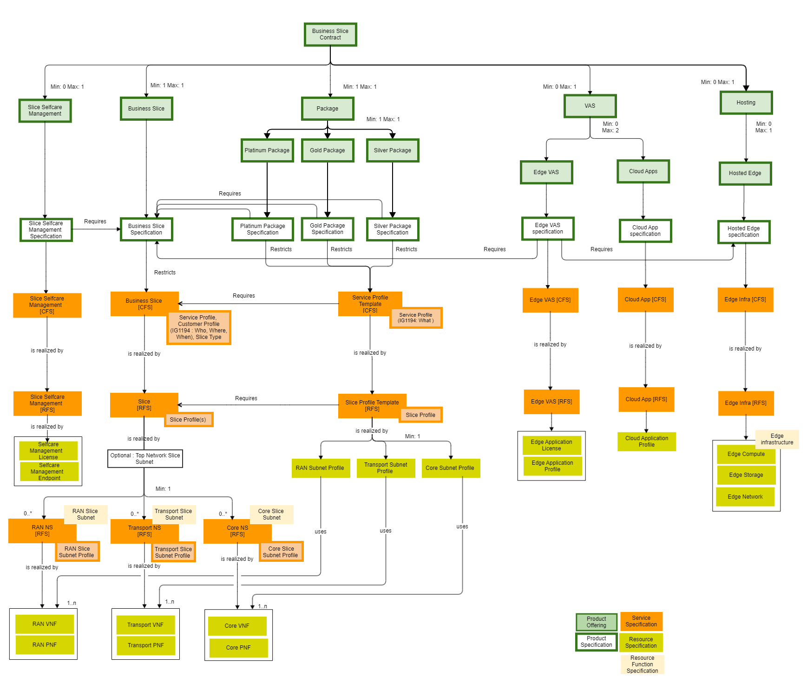
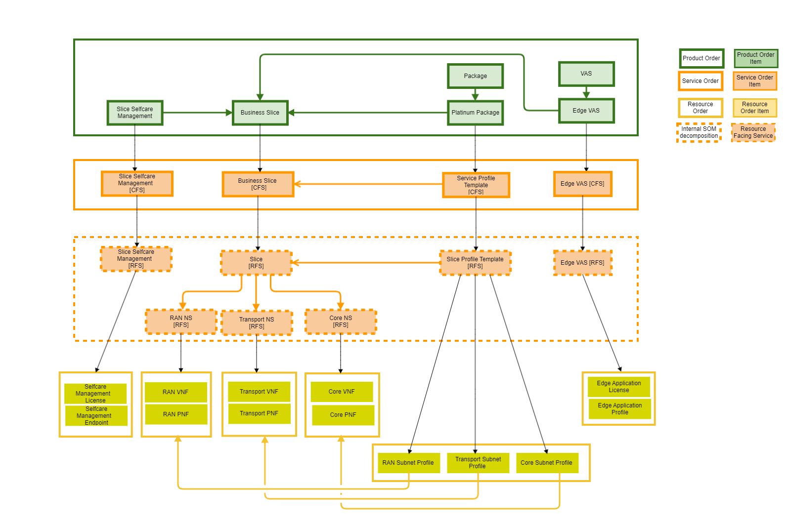
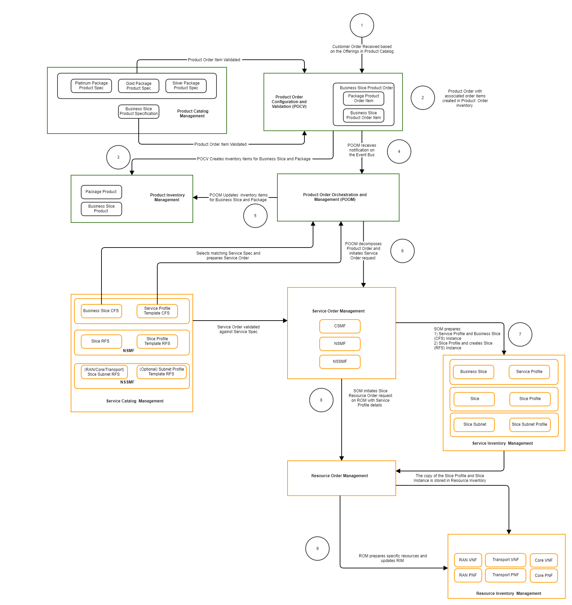
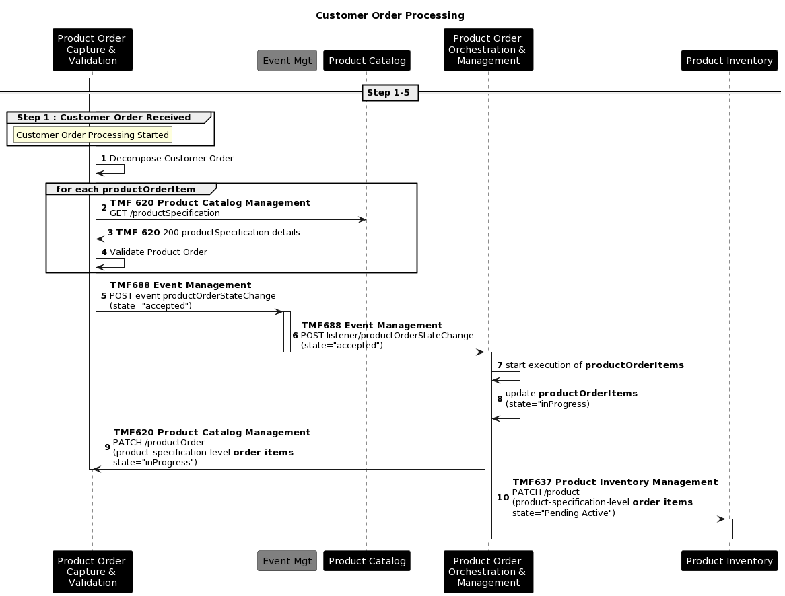
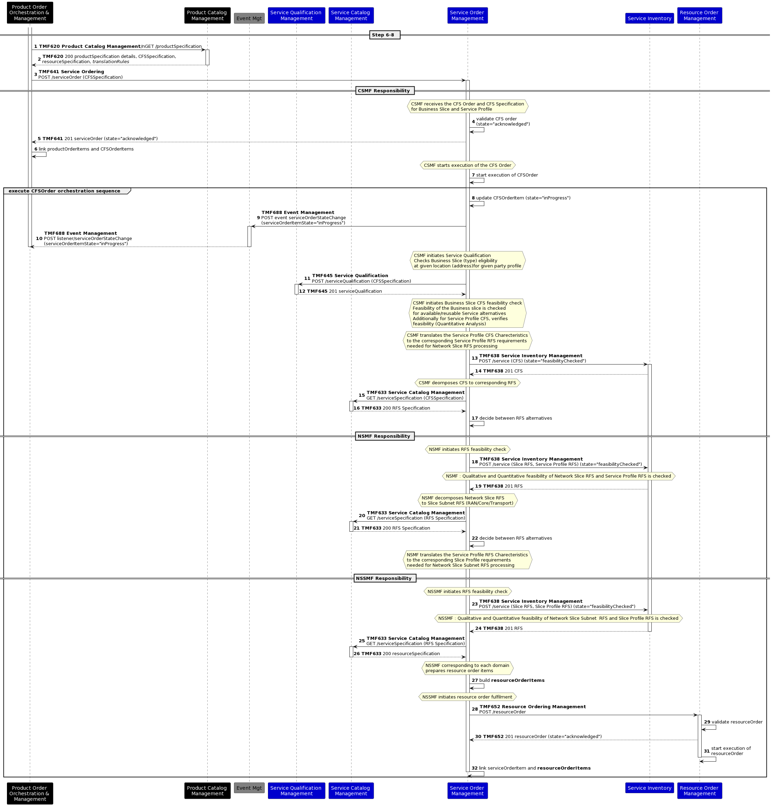
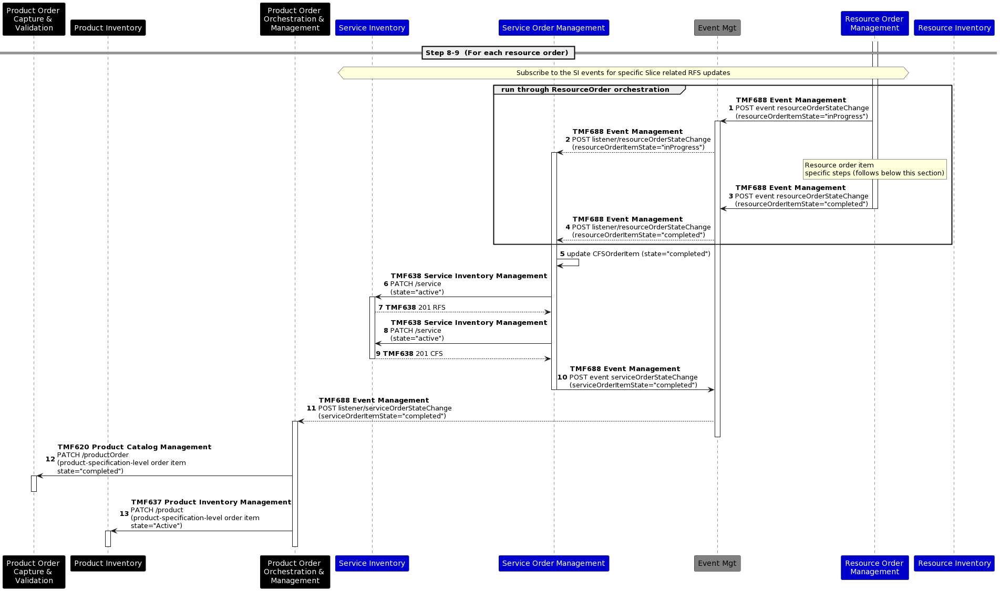
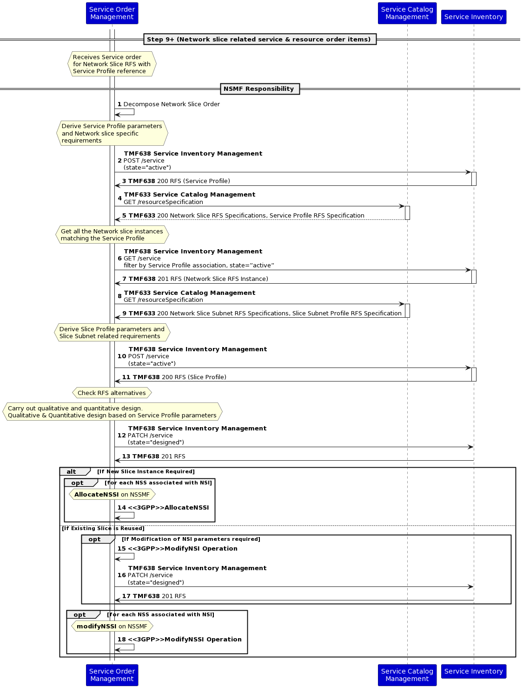
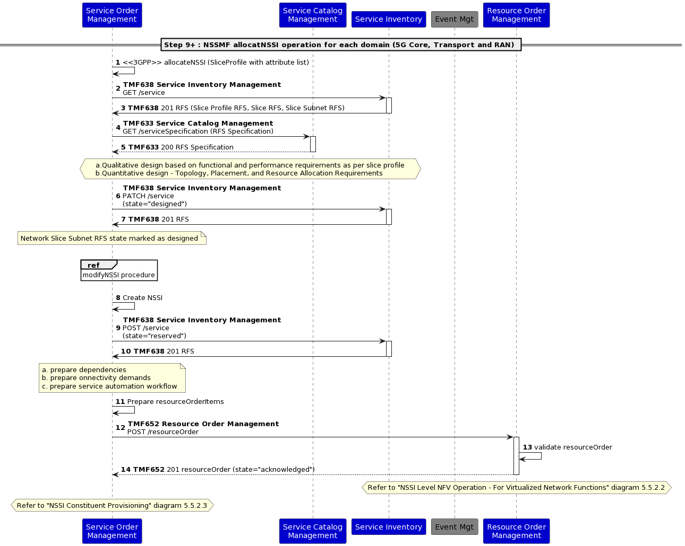
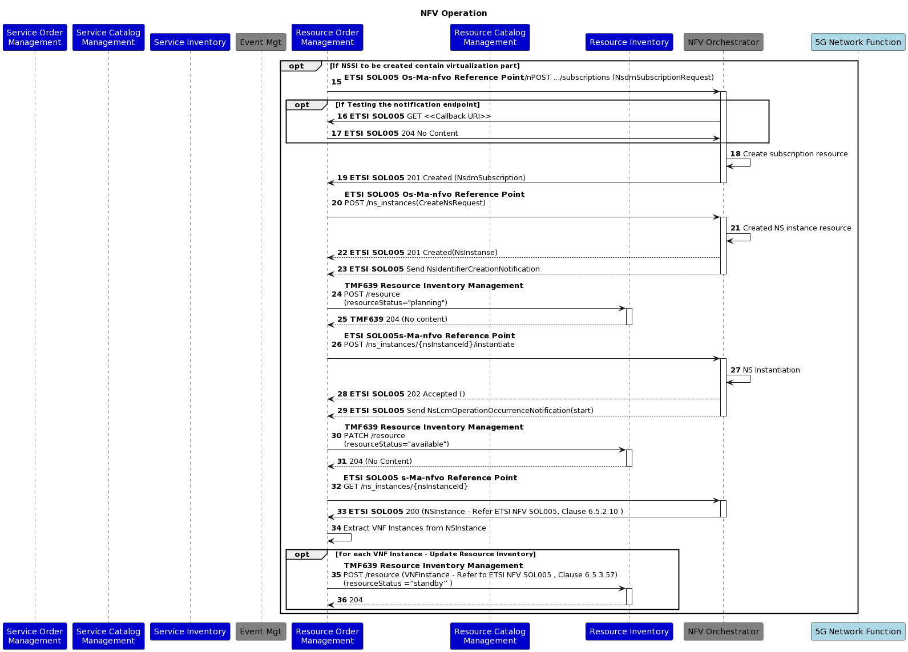
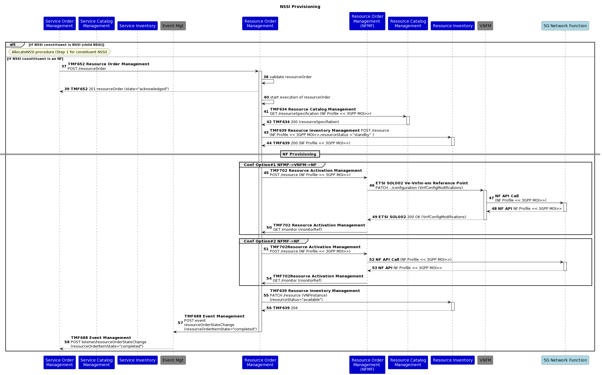

# Introduction

## Context or Background

This use case demonstrates the management of 5G slices using ODA components and TMF Open API architecture, in relation to other standards such as 3GPP, ETSI NFV, and GSMA.

## Objective of the use case

The objective is to clarify end-to-end 5G slice orchestration including details of CFS and RFS decomposition and Network Slice and Network Slice Subnet provisioning in TMF ODA taxonomy.

## Scope and assumptions

### Scope

The use case scope includes:

- Catalog structure featuring Main and Extended/Optional offerings, as well as CFS/RFSs.

- Order structure including RFSs and Subnet Profiles for RAN, Transport, and Core domains.

- Sequence diagrams depict the detailed processing of Customer Orders, Service Orders, and Resource Orders, highlighting the responsibilities of NSMF and NSSMF.

### Assumptions

- **Top down vs bottom up perspective and impact on catalog modeling**:

One of the challenges faced while developing the catalog structure was to keep a balance between the top-down and bottom-up approach. For example while looking from a 3GPP perspective a network slice is realized based on the requirements or purpose defined through a Service Profile (3GPP terminology).

As it is realized in industry today network slice has a dependency on the Service profile and Slice Profile (both 3GPP constructs). The Service Profile is a declarative representation of the slice SLA/SLS requirement which has independent lifecycle and maintained in the inventory with a unique identifier. A Network Slice composes set of Network Slice Subnets which in turn are a recursive collection of network functions. Another declarative construct called Slice Profile is used to define the purpose of the network slice subnet. The SLS (Service Profile) associated with the Network Slice and the Slice Profile associated with the Network Slice Subnet can undergo variations during the lifecycle of a slice, depending on consumption patterns. Therefore, flexibility is required in Service Profile/Slice Profile creation and association with Slice. This means the collection of resources represented by Slice and the purpose of the slice represented by the associated profile can vary. Such variations may arise due to changes in the Service Profile initiated by the consumer, leading to the regrouping of resources associated with the slice. In order to generalize these variations and mitigate complexity arising from flexibility, three broad categories of Slice packages have been identified - Platinum, Gold, and Silver, which correspond to different levels of product offerings.   Consequently, the definition of purpose through Slice Package becomes essential for the realization of a slice. From a catalog modeling perspective, this relationship may appear as a "Requires" association from Slice offering to a Slice Package offering.

So far a bottom up approach of identifying catalog entities is being described. However, when adopting a top-down perspective, considering two distinct offerings like Slice and Slice package, it becomes apparent that, from the standpoint of conventional offerings catalog modeling, the Slice package lacks autonomous existence without a Slice.  Consequently, it is necessary to establish a dependency (Require relationship) of the Slice Package on Slice. Note that from a bottom-up perspective, the dependency is reverse, i.e Slice depending on Slice Package. Current document considers an approach of top-down with an assumption that the management of any dynamic correlation between Slice and Service Profile (or Slice Subnet and Slice Profile) can be effectively handled by maintaining a rule in the inventory, rather than at the catalogue level.

- **Hierarchy of Slice subnet**:

As per 3GPP 28.541 Network Slice Class diagram (clause 6.2.1) a Network Slice is associated with a single top level Network Slice Subnet (1:1 cardinality), and the top level Slice Subnet in turn can compose domain specific slice subnet such as RAN Slice Subnet and Core Slice Subnet. In this use case a simplified approach is chosen wherein the Network slice directly composes the domain specific slice subnets. 

- **Association between Network Slice, Network Slice Subnet with Service Profile and Slice Profile (respectively)**:
In the 3GPP 28.541 Network Slice class diagram a Network Slice is associated with a Service Profile that defines the SLS/SLA of the Network Slice. Similarly Network Slice Subnet is associated with Slice Profile which specifies corresponding purpose of Slice Subnet. As described earlier, since the Profiles are entities that can independently evolve outside the lifecycle of Slice. Hence the catalog structure maintains a separate product offering (Package) and separate CFS with corresponding RFS  to represent each profile along with its characteristics. The association of these profiles are generally established at run-time.

For example in ONAP implementation, an AllotedResource entity is used to associate a Slice/Slice Subnet with corresponding profile. This association is currently not shown in the catalog structure, however a "Requires" relationship is shown to indicate that a Package (or Profile being represented) requires corresponding slice to realize the purpose. It is debatable looking from the top-down or bottom-up perspective. However this is parked as an item for future discussions and resolution. 

- **Top Slice Subnet**:

Top Slice Subnet is shown as an optional RFS to keep as a placeholder for aligning with the 3GPP 28.541 class diagram. However for simplification this is omitted in the catalog view. 3GPP 28.541 also defines Top Slice Subnet Profile which is omitted as well for simplicity. In the catalog structure above it is assumed that the network slice is composed of RAN/Core/Transport Slice Subnets (and not through a nested network slice subnet as defined in 3GPP 28.541).

- **3GPP and GSMA Network Slicing Terminologies**:
3GPP has already defined the basic concepts, information models and procedures for wireless network resource sharing through network slicing. Since this use case considers a 5G network slicing scenario the document will use some of the 3GPP terminologies (e.g., CSMF, NSMF, NSSMF, Service Profile, Slice Profile), especially management functions and entities.

Note that 3GPP reuses some of the GSMA terminologies as well for alignment with GSMA NG116 document which defines the GST (Generic Network Slice Template) and NST (Network Slice Template).

- **Alignment with 3GPP, GSMA, prior work in TMF**:

While this use case intends to align with the network slicing specifications already defined by 3GPP, GSMA and TMF (e.g., recommendations in IG1280, IG1194), the key focus is on representing the operational flow across the ODA components for realizing network slice. Hence the use case took the path of simplification at relevant places to highlight the use of ODA components while aligning with other SDO specification. 

# Description

- CSP is offering a Business Slice product catering to different vertical markets and has specialized/customized offering depending on the end vertical needs. To grade different levels of usage CSP has three bundles of offers namely Platinum, Gold and Silver. Each with associated levels of SLA. All the offerings are made available for subscription through a digital marketplace.

- Enterprise customer “Drone Operator” would like to purchase a Network Slice for its fleet of drones. The requirements for the slice are the following:

- Reliable and pervasive private connectivity for the drones operated by the enterprise across city based on the SLA suitable for drone signaling and media access
- Drones are offered for rent for various end user needs (parcel delivery, monitoring, law enforcement surveillance etc.)
- Additional Services required drones monitoring and management apps to be hosted at edge and licenses for self-management and registration of new drones (eSIM Management)

- “Drone Operator” opens CSP Digital Marketplace portal and browses through offerings

- For the Drone operations they identified Platinum as the most suitable bundle

- They also selected Edge VAS for hosting drone management edge apps

- After receiving the Platinum Offer SLA requirement, CSP validates the Customer Order and initiates feasibility check

- Once feasibility is verified, a Quote is sent to the customer

- Once quote is approved, a product order lifecycle is initiated

- Slice Package represented in terms of Product Spec Characteristic values is translated to Service Order characteristics by POOM

- For the Slice allocation, the request is forwarded to SOM where Service Order characteristics is translated Service Profile by CSMF and sent to NSMF

- NSMF translates the Service Profile to associated Slice Profile across domain orchestrators  where NSSMF receives corresponding Slice profile and provisions the Slice subnets

- Once Slice is provisioned and associated apps deployed the POOM send back provisioned SLA details, contract details, Slice details, Service endpoint details for self-management

- Drone operator access the Service endpoints to provision new Drones and associated eSIMs

# Information View

## Catalog view

Main Offerings:

- Business Slice

- Slice Package - different packages to meet the specific needs of the Business Slice

Extended/Optional Offerings:

- Slice Selfcare Management 

- Edge VAS - optional applications to be hosted on the CSP Edge along with slice (to support the communication service) - for e.g. CDN specific services application. In the case of drone operator customer this can be video optimization or object detection applications, or it can be Drone control applications

- Cloud App - optional applications to be hosted in the Telco Cloud or a Hyperscaler cloud to support the communication service over slice. In the case of drone operator, this can be a video server storing the recorded images from the drone

- Hosted Edge - optional Edge network to be hosted on the customer premise to support the communication service. In the drone operator scenario this can be a hosted edge where the edge application and other drone control applications may be deployed

Figure 3.1.1: Catalog view of the 5G Network Slice Management 

## Order Structure

Figure 3.2.1: Example of Order Structure

Note: This diagram depicts an example of an Order Structure with a limited list of Order Items.

# Sequence diagram 

## High Level Flow 

Figure 4.1.1: End to End High Level Flow

Note: Operations like serviceability/feasibility not shown. Above picture shows how the end to end flow may look like with associated items in inventory and catalog. 

## Steps 1-5 : Customer Order processing 

## Steps 6-8 : Service Qualification & Feasibility Check

## Steps 8-9 : Detail for each Resource Order

Note: For the 5G Slice provisioning it may be necessary to cross check the slice profile information corresponding to different domains for optimizing the configurations. For example provisioning the resources for core network domain it may be necessary for the Quantitative and Qualitative analysis algorithm to cross check the slice profile corresponding to core slice subent with slice profile for the RAN and Transport domain. It is assumed that implementation specific strategies are used in such cases for example a local copy of profile is stored locally at the resource provisioning layer (while ensuring consistency) for performance and efficiency, but these strategies are beyond the scope of this use case .     

## Steps 9+: Network slice related service & resource order items

### NSMF Responsibility

### NSSMF Responsibility

#### NSSI Allocation

#### NSSI Level NFV Operation - For Virtualized Network Functions 

#### NSSI Constituent Provisioning 

# Conclusion

## Lessons learned

- Flexibility is required in creating Service Profiles and associating them with the Slice. Therefore, a Top-down approach is assumed, where the association between the Slice and Service Profile (or Slice Subnet and Slice Profile) can be managed with a rule or dynamic association maintained in the inventory.

- Service Order Management, Service Catalog Management, and Service Inventory Management ODA components should have CSMF, NSMF, and NSSMF capabilities to manage slices.

- Service and Customer Profiles might be specified on CFS layer, Slice Profiles on RFS layer, and RAN/Transport/Core Slice Subnet Profiles on the corresponding domain-related RFS

- During the course of developing this use case, there were recommendations to regard the Service Profile as an RFS and the Service Profile Template as an RFS Specification. However, after further consideration, it was determined that, according to 3GPP, the Service Profile or Slice profile represents the purpose or requirements of the Slice, and it does not align well with the conventional understanding of RFS, which relates to a technical solution rather than a requirement or purpose. Consequently, a tactical approach has been adopted, wherein the template is presented as a CFS with specific characteristics, and the actual profile needed for the realization of the Slice is composed based on the characteristic values populated during the order processing phase. This use case acknowledges the fact that there can be alternate interpretations and vary across implementations.      

- The initial consideration for provisioning virtualized resources associated with the Network slice involved the TMF Resource Function Activation and Configuration API. However, based on the recommendation from operator representatives, this approach was modified to utilize domain-specific SDO APIs, such as ETSI or 3GPP APIs. This decision aligns with practical implementations undertaken by operators and recognizes the need to employ specialized APIs to enhance efficiency and performance.

- The Resource management layer employs distinct ROMs (Resource Order Management Component) to handle virtualized resource lifecycle management and the configuration of deployed network functions. This approach serves two objectives: firstly, it enables the isolation of virtualized resource lifecycle management from configuration processes, which entails the use of separate APIs and domain contexts. Secondly, it acknowledges the potential existence of physical network functions that might necessitate distinct provisioning and optimization capabilities.

- For the 5G Slice provisioning it may be necessary to cross check the slice profile information corresponding to different domains for optimizing the configurations. For example, provisioning the resources for core network domain it may be necessary for the Quantitative and Qualitative analysis algorithm to cross check the slice profile corresponding to core slice subnet with slice profile for the RAN and Transport domain. It is assumed that implementation specific strategies are used in such cases for example a local copy of profile is stored locally at the resource provisioning layer (while ensuring consistency) for performance and efficiency, but these strategies are beyond the scope of this use case.

## Impacts identified

- Interaction with the NFV domain and its components should be performed based on ETSI NFV specific APIs

- Interaction with the 3GPP defined APIs for the provisioning of Network functions associated with Slice/Slice Subnet.

- Representation of domain specific capabilities different ODA components at the SOM level and ROM level and positioning them as consumed or provided APIs – For example NSSMF, NSMF, CSMF etc.

- The current scenario exposes 5G slice management for one operator, but in real life, it might be a multi-operator environment, which requires additional clarification.

- Potential RAN Sharing scenarios such as MORAN and MOCN require further study, this may require enhancements to different domain components (Product, Service, and Resource) as well as the Party management because this may involve complex resource sharing scenarios across operators.

- This use case assumes uniform complexity for all technology domains – i.e. RAN, Core and Transport. However, in reality, each domain may exhibit different levels of complexity. In order to achieve optimal performance and operational flexibility, it may be necessary to adopt a bottom-up approach that integrates these domains by utilizing a dedicated domain orchestrator under the coordination of a cross-domain orchestrator. The existing SOM and ROM components should be designed with careful consideration given to their compatibility with domain/cross-domain orchestrator-based deployments.

- There are many scenarios yet to be well defined at the operations management layer for Network slice. Some of the open areas include – Roaming management across operator slices, dynamic subscription and switching across slices at runtime, adjustment of slice resource quota from an application perspective, subscription of slices belonging to two different operators having separate PLMN identifiers, closed loop optimization of network slice etc. These are potential directions for enhancement of this use case.

# Appendix

## Abbreviations

| CSMF | Communication Service Management Function |
| --- | --- |
| NFMF | Network Function Management Function |
| NSI | Network Slice Instance |
| NSP | Network Slice Provider |
| NSS | Network Slice Subnet |
| NSSI | Network Slice Subnet Instance |
| NSMF | Network Slice Management Function |
| NSSMF | Network Slice Subnet Management Function |

