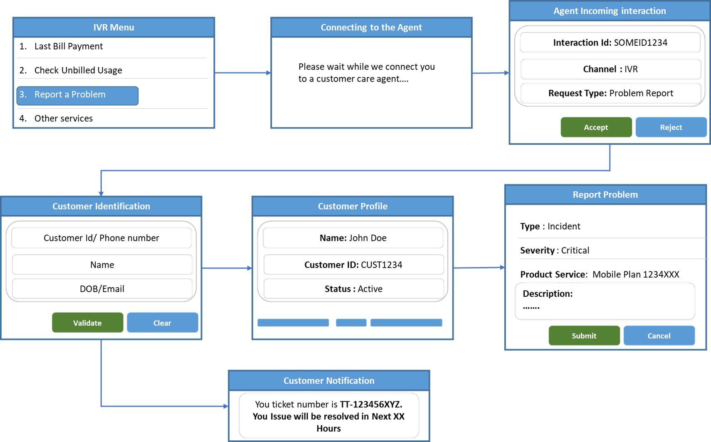
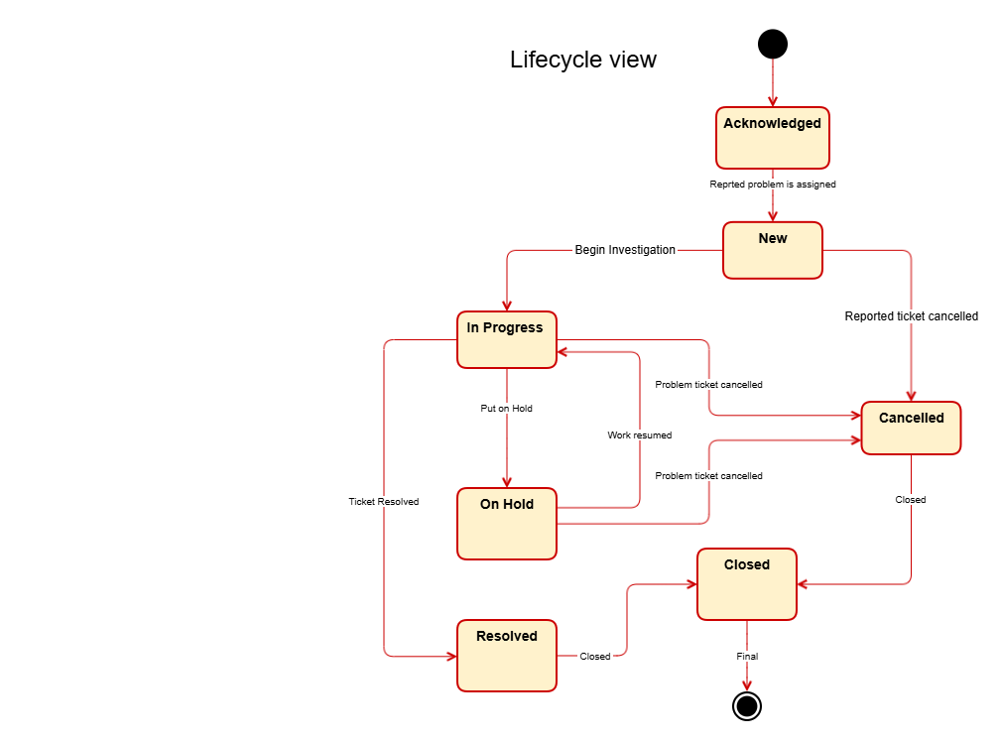
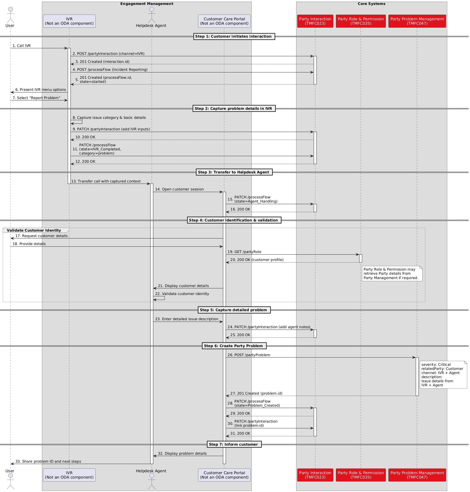

# Executive Summary

This document explores the scope and responsibilities of the proposed Party Problem Management ODA component within TM Forum architecture, focusing on end-to-end lifecycle management of customer- and partner-reported issues and identifying gaps in API alignment, component ownership, and assurance workflows.

The use case provides a foundational step toward clearer ODA component responsibilities, improved API positioning, and standardized problem lifecycle governance across telecom ecosystems.

# Introduction

Telecom operators handle a wide range of customer-related issues on a daily basis. Typical examples include broadband connectivity failures, billing discrepancies, requests for engineer visits, SIM card replacements, and recurring service faults. These interactions represent the front line of service assurance and directly influence customer experience. For effective resolution ensuring the highest customer experience, it is important that these interactions with customers are captured, categorized and tracked uniformly and structured way.

However, customer-reported incidents alone do not provide a complete view of assurance. Many service-impacting issues originate within underlying network infrastructure, shared platforms, or partner-operated systems. Failures such as interconnect disruptions on a wholesale partner’s network may degrade customer services without being immediately visible at the customer interaction layer.

A holistic assurance model must therefore extend beyond customer incidents to encompass issues raised by all operational stakeholders, customer, partner and internal teams. A mechanism is also required to co-relate them for systematic root cause analysis and tracking its lifecycle.

Party Problem Management addresses this gap by enabling cross-stakeholder visibility, coordinated root cause analysis, and accountable resolution across organizational boundaries. Its objective is not merely faster ticket handling, but transparent and structured governance of problems that impact the broader service ecosystem.

## Context or Background

The TM Forum artifacts, including the Business Process Framework (eTOM), Shared Information/Data (SID) model, and Open APIs, provide extensive coverage of the Problem Management domain. But still gaps and ambiguities exists in terms of scope definition, component responsibility, and API alignment within the ODA component.

The key observations are outlined below:

**Scope of Party Problem Management component**

As per the current agreement, the scope of the Party Problem Management component is limited to collecting and managing the lifecycle of problems reported by parties, such as customers, partners, or suppliers. The actual resolution of the problem is outside the responsibility of this component.

If this is the case, the reported problem must either:

- be routed to the appropriate internal stakeholder or operational domain responsible for resolution, or

- Trigger notifications to relevant stakeholders so that corrective actions can be initiated promptly.

In addition, the specification needs to clearly identify

- the **dependent APIs**,

- the **mapping to SID entities**, and

- the **alignment with the functional processes defined in the eTOM framework**,

to ensure the component specification is complete and consistent within the broader architecture.

**Proactive vs. Reactive issues**

The current scope of Party Problem Management focus primarily on reactive issues, where an issue is reported by an external party such as a customer, partner, or supplier.

However, telecom operations frequently encounter proactive scenarios, where network or service issues are detected internally before being reported by customers. Such issues may still impact multiple customers or partners and therefore need to be managed end-to-end, including:

- Identifying the affected services and parties, and

- Notifying customers or partners regarding the potential or actual impact.

The current scope does not clearly address how such proactively detected problems should be handled within the problem management framework.

**TMF724 Incident Management API**

The TMF724 Incident Management API currently does not appear to be mapped to any specific ODA component.

The API is defined with the following scope:

*“The Incident Management API provides a standardized mechanism to report, diagnose, and resolve incidents and manages the entire lifecycle of incidents as defined by IT service management practices. The primary objective of incident management is to restore normal service operation as quickly as possible and minimize the adverse impact on business operations while maintaining agreed service quality levels.”*

Part of this API addresses several aspects relevant to the Problem Management domain, particularly in terms of reporting and tracking issues, both proactive and reactive. However, the API also includes incident resolution responsibilities, which fall outside the scope of the Party Problem Management component as currently defined.

In addition, the API does not fully cover all types of issues that the problem management component is expected to address, such as:

- General inquiries, complaints, or commendations.

- General questions regarding products purchased and used by the party.

- etc

**TMF621 Trouble Ticket Management API**

The TMF621 API currently does not appear to be mapped to any specific ODA component. The scope of this API is defined as follows:

*Provides a standardized client interface to Trouble Ticket Management Systems for creating, tracking and managing trouble tickets among partners as a result of an issue or problem identified by a customer or another system. Examples of Trouble Ticket API clients include CRM applications, network management or fault management systems, or other trouble ticket management systems (e.g. B2B).*

These API is rightly positioned to handle the party problem management requirements covering both the partners and customer related issues. The only issues is with the API client example that includes Network Management or Fault management systems, this example blurs the scope of incident management and trouble ticket. While techinically it is correct but from the scope perspective TMF624 is primary API that Network or Fault management system should interact with. Also, this API needs enhancement like modelling need to improve and its relationship with Party Problem Management needs to be defined.

**TMFC043 Fault Management ODA Component and TMF656 Service Problem Management API**

The TMFC043 Fault Management component is positioned within the Production domain of the ODA architecture. This component has an optional dependency on the TMF656 Service Problem Management API. However, there is currently no ODA component that mandatorily exposes this API. TMFC043 mainly deals with active alarms and potential problem candidates detected at the Network level hence this is not a concern. But there remains a gap in terms of clearly associating the TMF656 API with an appropriate ODA component responsible for service-level problem management.

**Terminology alignment and issue categorization**

As stated in the current definition of the Problem Management component, issues reported by parties are not limited to problems related to customer-facing services. Such interactions may also include general inquiries, feedback, or commendations. Therefore, it is important to categorize these issues in a standardized manner so that they are consistently understood across the organization and can be effectively tracked and managed.

The following section describes the different types of issues that can be handled within the scope of Party Problem Management, along with illustrative examples.

The definitions of these issue types are aligned with terminology from ITIL 4.

- **Incidents**:

An incident represents an unplanned interruption or degradation of a service that requires immediate attention to restore normal operation. It captures situations where a service is not functioning as expected. Incidents may be reported by customers, partners, or internal operational teams. Examples include internet connectivity not working, inability to make phone calls, or failure to log in to a self-care application. The primary objective of incident management is to restore the affected service as quickly as possible, and incident tickets are typically assigned to technical teams for investigation and resolution.

- **Complaints**:

A complaint represents a Party dissatisfaction with the service or service experience. Unlike incidents, complaints do not always indicate a technical fault. Instead, they capture situations where the service does not meet the customer’s expectations or agreed service levels. Examples include billing disputes, poor network coverage, or frequent call drops. Complaints are generally handled through customer care or service management processes and may sometimes lead to further technical investigation if an underlying issue is identified.

- **Problem**

A problem represents the underlying cause or potential cause of one or more incidents. When multiple similar incidents occur, they may indicate a systemic issue rather than isolated faults. In such cases, a problem record is created to investigate the issue end-to-end and identify the root cause. Long-term resolution and prevention of recurrence is important, and therefore root cause analysis (RCA) is an essential activity associated with problem records.

- **Service request**

A service request represents a request from a party for a standard service action, information, or access. Unlike incidents, service requests are not related to service failures but to routine operational needs or support activities. Examples include requesting a technician visit, asking for access to a self-care application, or requesting configuration changes. Service requests are typically handled through predefined fulfillment processes rather than fault resolution workflows.

Note:

External parties interact with Products, not underlying Services. TMF product model translates to service.

## Objective of the use case

The objective of use case is to work with various scenarios to define the scope of Party problem management ODA component. Its interaction with other ODA components and related APIs. While doing so the usecase will work with standard APIs available and other TMF artifacts in the process it will identify the gaps that must be addressed for complete definition of Party problem management ODA component.

## Scope and assumptions

### Scope

Scope of usecase covered in this document is limited to Party problem management only. The scope is just to outline E2E lifecycle of problems, but Resource fault or component/parties involved in resolving the problem is outside the scope.

### Assumptions

General assumptions:

- No test is performed by the helpdesk agent to investigate the problem reported by the customer.

- Party Problem Management only tracks the lifecycle of problem ticket. It is not responsible for the solution of the reported problem, but it just manages the status from lifecycle perspective and does not own resolution of the ticket.

- Proactive problems identification resulting customer problem is not considered in this phase.

- The usecase assumes that reported problem are resolved by technical team. The details of problem resolution is not in the purview of work. 

# Description

| Actor | The Customer, IVR, The Customer Care Agent, Customer Care portal, Interaction Management, Party Problem Management, Party Management |
| --- | --- |
| Pre-conditions | Party exists and Party Role as Customer is in place Customer has already had active Product Offering |
| Begins When | Customer is not able to make calls from his phone. |
| Description | Customer calls the IVR system. IVR triggers a TMF701 Process Flow to Party Interaction IVR presents options to the customer. Customer selects “Report Problem”. IVR forwards the call/request to the Helpdesk Agent. Helpdesk Agent logs into the Customer Care Portal. Customer identity verification and validation are completed by Helpdesk Agent Agent records the customer problem in the portal Portal sends request to Party Problem Management to create the ticket Party Problem Management system creates the ticket and returns confirmation (201 Created). Helpdesk Agent informs the customer about the ticket creation |
| Ends when | Incident Ticket is created |
| Post-conditions | Ticket is assigned to the right team for further investigation |

# Views

## Information View

This diagram illustrates a typical lifecycle flow of an  incident/problem ticket. It describes how a reported issue progresses through various operational states from initial acknowledgment to final closure. The lifecycle begins when a reported problem is acknowledged and registered as a new ticket. Once investigation activities start, the ticket transitions into the “In Progress” state, where diagnosis and resolution activities are performed.

During the resolution process, the ticket may temporarily move to an “On Hold” state due to dependencies, pending customer inputs, external actions, or operational constraints. Work can later resume and return the ticket to the active investigation phase. If the issue is successfully resolved, the ticket transitions to the “Resolved” state and is eventually moved to “Closed” after validation and confirmation. Alternatively, the ticket may transition to a “Cancelled” state if the issue is withdrawn, invalid, duplicated, or no longer applicable.

Lifecycle of a Trouble ticket

# Diagrams

## Sequence diagrams

This sequence diagram illustrates an end-to-end customer support and incident handling flow aligned with TM Forum Open APIs and ODA principles. The interaction begins when a customer initiates contact through the IVR channel to report a problem. Customer interaction details and workflow context are captured and maintained throughout the journey using Party Interaction Management and Process Flow Management APIs. The process then transitions from automated IVR handling to assisted support through a helpdesk agent, ensuring continuity of customer context across channels.

During the assisted support phase, the customer identity is validated using Party and Party Role Management APIs, after which the detailed issue information is captured and associated with the ongoing interaction. A trouble ticket is subsequently created using Trouble Ticket Management APIs to initiate incident resolution and lifecycle tracking.

# Conclusion

## Lessons learned

This document is still under development. This section will be updated as the work matures and the requirements and recommendations are further refined.

## Impacts identified

- **Clear boundary definition for Party Problem Management:** The use case clarified that Party Problem Management should focus on capturing, tracking, correlating, and governing problem lifecycle activities, while technical resolution remains outside its scope. Correlation with other party, service, or resource problems is important for end-to-end lifecycle tracking.

- **ODA component-to-API alignment requires clarification:** APIs such as TMF621 and TMF724 do not have clearly defined ODA component ownership, creating ambiguity in implementation responsibility and Party Problem Management specification.

- **Support for reactive and proactive assurance scenarios:** Current Party Problem Management scope mainly addresses customer-reported (reactive) issues and requires enhancement to support proactively detected service or network issues.

- **Definition of responsible handling teams:** Although resolution is outside the component scope, technical ownership for different issue categories (e.g., billing, application, network) should be clearly defined to ensure efficient routing and lifecycle management.

- **Standardized trouble ticket lifecycle states:** Consistent lifecycle states such as Acknowledged, In Progress, On Hold, Resolved, Closed, and Cancelled are required across implementations.

- **TMF621 as a strong candidate API:** TMF621 aligns well with external issue and trouble ticket lifecycle management, though clearer positioning relative to network fault management APIs is still needed.

- **Gap in Service Problem Management :** The use case identified a gap in the ODA architecture regarding ownership of Service Problem Management capabilities and exposure of the TMF656 API. Clear ODA component definition is required to support end-to-end service problem management and correlation between network faults and customer-impacting service issues, especially for proactive assurance scenarios. However, this raises the question of whether similar architectural clarification is required for Product Problem Management and Resource Problem Management. This lesson learned highlights the need for a broader review and alignment across TMF artifacts to ensure consistent ownership, capability definition, and API exposure patterns

Although the above impacts have been identified, this work is still at an early stage, and the current use case covers a very limited scope. Additional scenarios and use cases need to be incorporated into the document to further validate the findings and enable the creation of well-defined JIRA items with clear scope, ownership, and implementation boundaries.

